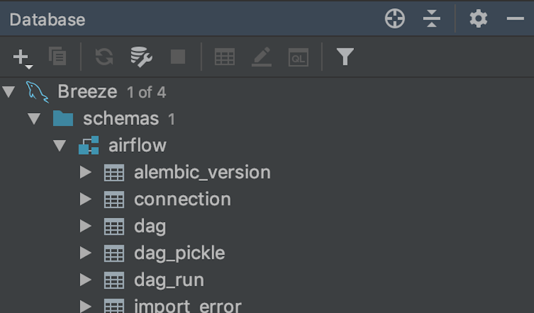

 .. Licensed to the Apache Software Foundation (ASF) under one
    or more contributor license agreements.  See the NOTICE file
    distributed with this work for additional information
    regarding copyright ownership.  The ASF licenses this file
    to you under the Apache License, Version 2.0 (the
    "License"); you may not use this file except in compliance
    with the License.  You may obtain a copy of the License at

 ..   http://www.apache.org/licenses/LICENSE-2.0

 .. Unless required by applicable law or agreed to in writing,
    software distributed under the License is distributed on an
    "AS IS" BASIS, WITHOUT WARRANTIES OR CONDITIONS OF ANY
    KIND, either express or implied.  See the License for the
    specific language governing permissions and limitations
    under the License.

.. contents:: :local:

Airflow Breeze CI Environment
=============================

Airflow Breeze is an easy-to-use integration test environment managed via
`Docker Compose <https://docs.docker.com/compose/>`_.
The environment is available for local use and is also integrated into Airflow's CI Travis tests.

We called it *Airflow Breeze* as **It's a Breeze to develop Airflow**.

The advantages and disadvantages of using the Breeze environment vs. other ways of testing Airflow
are described in `CONTRIBUTING.rst <CONTRIBUTING.rst#integration-test-development-environment>`_.

Here is a short 10-minute video about Airflow Breeze:

.. image:: http://img.youtube.com/vi/ffKFHV6f3PQ/0.jpg
   :width: 480px
   :height: 360px
   :scale: 100 %
   :alt: Airflow Breeze Simplified Development Workflow
   :align: center
   :target: http://www.youtube.com/watch?v=ffKFHV6f3PQ

Prerequisites
=============

Docker Community Edition
------------------------

- **Version**: Install the latest stable Docker Community Edition and add it to the PATH.
- **Permissions**: Configure to run the ``docker`` commands directly and not only via root user.
  Your user should be in the ``docker`` group.
  See `Docker installation guide <https://docs.docker.com/install/>`_ for details.
- **Disk space**: On macOS, increase your available disk space before starting to work with
  the environment. At least 128 GB of free disk space is recommended. You can also get by with a
  smaller space but make sure to clean up the Docker disk space periodically.
  See also `Docker for Mac - Space <https://docs.docker.com/docker-for-mac/space>`_ for details
  on increasing disk space available for Docker on Mac.
- **Docker problems**: Sometimes it is not obvious that space is an issue when you run into
  a problem with Docker. If you see a weird behaviour, try
  `cleaning up the images <#cleaning-up-the-images>`_. Also see
  `pruning <https://docs.docker.com/config/pruning/>`_ instructions from Docker.

Docker Compose
--------------

- **Version**: Install the latest stable Docker Compose and add it to the PATH.
  See `Docker Compose Installation Guide <https://docs.docker.com/compose/install/>`_ for details.

- **Permissions**: Configure to run the ``docker-compose`` command.

Docker Images Used by Breeze
----------------------------

For all development tasks, related integration tests and static code checks, we use the
**CI image** maintained on the Docker Hub in the ``apache/airflow`` repository.
This Docker image contains a lot test-related packages (size of ~1GB).
Its tag follows the pattern of ``<BRANCH>-python<PYTHON_VERSION>-ci``
(for example, ``apache/airflow:master-python3.6-ci``). The image is built using the
`<Dockerfile>`_ Dockerfile.

Before you run tests, enter the environment or run local static checks, the necessary local images should be
pulled and built from Docker Hub. This happens automatically for the test environment but you need to
manually trigger it for static checks as described in `Building the images <#bulding-the-images>`_
and `Pulling the latest images <#pulling-the-latest-images>`_.
The static checks will fail and inform what to do if the image is not yet built.

Building the image first time pulls a pre-built version of images from the Docker Hub, which may take some
time. But for subsequent source code changes, no wait time is expected.
However, changes to sensitive files like ``setup.py`` or ``Dockerfile`` will trigger a rebuild
that may take more time though it is highly optimized to only rebuild what is needed.

In most cases, rebuilding an image requires network connectivity (for example, to download new
dependencies). If you work offline and do not want to rebuild the images when needed, you can set the
``FORCE_ANSWER_TO_QUESTIONS`` variable to ``no`` as described in the
`Default behaviour for user interaction <#default-behaviour-for-user-interaction>`_ section.

See `Troubleshooting section <#troubleshooting>`_ for steps you can make to clean the environment.

Getopt and gstat
----------------

* For Linux, run ``apt install util-linux coreutils`` or an equivalent if your system is not Debian-based.
* For macOS, install GNU ``getopt`` and ``gstat`` utilities to get Airflow Breeze running.

  Run ``brew install gnu-getopt coreutils`` and then follow instructions to link the gnu-getopt version to
  become the first on the PATH. Make sure to re-login after you make the suggested changes.

**Examples:**

If you use bash, run this command and re-login:

.. code-block:: bash

    echo 'export PATH="/usr/local/opt/gnu-getopt/bin:$PATH"' >> ~/.bash_profile
    . ~/.bash_profile

If you use zsh, run this command and re-login:

.. code-block:: bash

    echo 'export PATH="/usr/local/opt/gnu-getopt/bin:$PATH"' >> ~/.zprofile
    . ~/.zprofile

Memory
------

Minimum 4GB RAM is required to run the full Breeze environment.

On macOS, 2GB of RAM are available for your Docker containers by default, but more memory is recommended
(4GB should be comfortable). For details see
`Docker for Mac - Advanced tab <https://docs.docker.com/v17.12/docker-for-mac/#advanced-tab>`_.

Airflow Directory Structure inside Docker
-----------------------------------------

When you are in the container, the following directories are used:

.. code-block:: text

  /opt/airflow - Contains sources of Airflow mounted from the host (AIRFLOW_SOURCES).
  /root/airflow - Contains all the "dynamic" Airflow files (AIRFLOW_HOME), such as:
      airflow.db - sqlite database in case sqlite is used;
      dags - folder with non-test dags (test dags are in /opt/airflow/tests/dags);
      logs - logs from Airflow executions;
      unittest.cfg - unit test configuration generated when entering the environment;
      webserver_config.py - webserver configuration generated when running Airflow in the container.

Note that when running in your local environment, the ``/root/airflow/logs`` folder is actually mounted
from your ``logs`` directory in the Airflow sources, so all logs created in the container are automatically
visible in the host as well. Every time you enter the container, the ``logs`` directory is
cleaned so that logs do not accumulate.

Using the Airflow Breeze Environment
=====================================

Airflow Breeze is a bash script serving as a "swiss-army-knife" of Airflow testing. Under the
hood it uses other scripts that you can also run manually if you have problem with running the Breeze
environment.

Breeze script allows performing the following tasks:

* Enter an interactive environment when no command flags are specified (default behaviour).
* Stop the interactive environment with ``-k``, ``--stop-environment`` command.
* Build a Docker image with ``-b``, ``--build-only`` command.
* Set up autocomplete for itself with ``-a``, ``--setup-autocomplete`` command.
* Build documentation with ``-O``, ``--build-docs`` command.
* Run static checks either for currently staged change or for all files with ``-S``, ``--static-check``
  or ``-F``, ``--static-check-all-files`` commands.
* Set up local virtualenv with ``-e``, ``--setup-virtualenv`` command.
* Run a test target specified with ``-t``, ``--test-target`` command.
* Execute an arbitrary command in the test environment with ``-x``, ``--execute-command`` command.
* Execute an arbitrary docker-compose command with ``-d``, ``--docker-compose`` command.

Entering Breeze
---------------

You enter the Breeze integration test environment by running the ``./breeze`` script. You can run it with
the ``--help`` option to see the list of available flags. See `Airflow Breeze flags <#airflow-breeze-flags>`_
for details.

.. code-block:: bash

  ./breeze

First time you run Breeze, it pulls and builds a local version of Docker images.
It pulls the latest Airflow CI images from `Airflow DockerHub <https://hub.docker.com/r/apache/airflow>`_
and use them to build your local Docker images. Note that the first run (per python) might take up to 10
minutes on a fast connection to start. Subsequent runs should be much faster.

Once you enter the environment, you are dropped into bash shell of the Airflow container and you can
run tests immediately.

You can `set up autocomplete <#setting-up-autocomplete>`_ for commands and add the
checked-out Airflow repository to your PATH to run Breeze without the ``./`` and from any directory.

Stopping Breeze
---------------

After starting up, the environment runs in the background and takes precious memory.
You can always stop it via:

.. code-block:: bash

   ./breeze --stop-environment

Choosing a Breeze Environment
-----------------------------

You can use additional ``breeze`` flags to customize your environment. For example, you can specify a Python
version to use, backend and a container environment for testing. With Breeze, you can recreate the same
environments as we have in matrix builds in Travis CI.

For example, you can choose to run Python 3.6 tests with MySQL as backend and in the Docker environment as
follows:

.. code-block:: bash

    ./breeze --python 3.6 --backend mysql --env docker

The choices you make are persisted in the ``./.build/`` cache directory so that next time when you use the
``breeze`` script, it could use the values that were used previously. This way you do not have to specify
them when you run the script. You can delete the ``.build/`` directory in case you want to restore the
default settings.

The defaults when you run the Breeze environment are Python 3.6, Sqlite, and Docker.

Available Docker Environments
..............................

You can choose a container environment when you run Breeze with ``--env`` flag.
Running the default ``docker`` environment takes a considerable amount of resources. You can run a
slimmed-down version of the environment - just the Apache Airflow container - by choosing ``bare``
environment instead.

The following environments are available:

* The ``docker`` environment (default): starts all dependencies required by a full integration test suite
  (Postgres, Mysql, Celery, etc). This option is resource intensive so do not forget to
  [stop environment](#stopping-the-environment) when you are finished. This option is also RAM intensive
  and can slow down your machine.
* The ``kubernetes`` environment: Runs Airflow tests within a Kubernetes cluster.
* The ``bare`` environment:  runs Airflow in the Docker without any external dependencies.
  It only works for independent tests. You can only run it with the sqlite backend.

Cleaning Up the Environment
---------------------------

You may need to clean up your Docker environment occasionally. The images are quite big
(1.5GB for both images needed for static code analysis and CI tests) and, if you often rebuild/update
them, you may end up with some unused image data.

To clean up the Docker environment:

1. `Stop Breeze <#stopping-breeze>`_ with ``./breeze --stop-environment``.

2. Run the ``docker system prune`` command.

3. Run ``docker images --all`` and ``docker ps --all`` to verify that your Docker is clean.

   Both commands should return an empty list of images and containers respectively.

If you run into disk space errors, consider pruning your Docker images with the ``docker system prune --all``
command. You may need to restart the Docker Engine before running this command.

In case of disk space errors on macOS, increase the disk space available for Docker. See
`Prerequisites <#prerequisites>`_ for details.

Building the Images
-------------------

You can manually trigger building the local images using the script:

.. code-block::

  ./scripts/ci/local_ci_build.sh

The scripts that build the images are optimized to minimize the time needed to rebuild the image when
the source code of Airflow evolves. This means that if you already have the image locally downloaded and
built, the scripts will determine whether the rebuild is needed in the first place. Then the scripts will
make sure that minimal number of steps are executed to rebuild parts of the image (for example,
PIP dependencies) and will give you an image consistent with the one used during Continuous Integration.

Pulling the Latest Images
-------------------------

Sometimes the image on the Docker Hub needs to be rebuilt from scratch. This is required, for example,
when there is a security update of the Python version that all the images are based on.
In this case it is usually faster to pull the latest images rather than rebuild them
from scratch.

You can do it via the ``--force-pull-images`` flag to force pulling the latest images from the Docker Hub.

To manually force pulling the images for static checks, use the script:

.. code-block::

  ./scripts/ci/local_ci_pull_and_build.sh

In the future Breeze will warn you when you are recommended to pull images.

Running Arbitrary Commands in the Breeze Environment
-------------------------------------------------------

To run other commands/executables inside the Breeze Docker-based environment, use the
``-x``, ``--execute-command`` flag. To add arguments, specify them
together with the command surrounded with either ``"`` or ``'``, or pass them after ``--`` as extra arguments.

.. code-block:: bash

     ./breeze --execute-command "ls -la"

.. code-block:: bash

     ./breeze --execute-command ls -- --la

Running Docker Compose Commands
-------------------------------

To run Docker Compose commands (such as ``help``, ``pull``, etc), use the
``-d``, ``--docker-compose`` flag. To add extra arguments, specify them
after ``--`` as extra arguments.

.. code-block:: bash

     ./breeze --docker-compose pull -- --ignore-pull-failures

Mounting Local Sources to Breeze
--------------------------------

Important sources of Airflow are mounted inside the ``airflow-testing`` container that you enter.
This means that you can continue editing your changes on the host in your favourite IDE and have them
visible in the Docker immediately and ready to test without rebuilding images. You can disable mounting
by specifying ``--skip-mounting-source-volume`` flag when running Breeze. In this case you will have sources
embedded in the container and changes to these sources will not be persistent.

After you run Breeze for the first time, you will have an empty directory ``files`` in your source code,
which will be mapped to ``/files`` in your Docker container. You can pass there any files you need to
configure and run Docker. They will not be removed between Docker runs.

Adding/Modifying Dependencies
-----------------------------

If you need to change apt dependencies in the ``Dockerfile``, add Python packages in ``setup.py`` or
add javascript dependencies in ``package.json``, you can either add dependencies temporarily for a single
Breeze session or permanently in ``setup.py``, ``Dockerfile``, or ``package.json`` files.

Installing Dependencies for a Single Breeze Session
...................................................

You can install dependencies inside the container using ``sudo apt install``, ``pip install`` or
``yarn install`` (in ``airflow/www`` folder) respectively. This is useful if you want to test something
quickly while you are in the container. However, these changes are not retained: they disappear once you
exit the container (except for theh node.js dependencies if your sources are mounted to the container).
Therefore, if you want to retain a new dependency, follow the second option described below.

Adding Dependencies Permanently
...............................

You can add dependencies to the ``Dockerfile``, ``setup.py`` or ``package.json`` and rebuild the image. This
should happen automatically if you modify any of these files.
After you exit the container and re-run ``breeze``, Breeze detects changes in dependencies,
asks you to confirm rebuilding the image and proceeds with rebuilding if you confirm (or skip it
if you do not confirm). After rebuilding is done, Breeze drops you to shell. You may also provide the
``--build-only`` flag to only rebuild images and not to go into shell.

Changing apt Dependencies in the Dockerfile
....................................................

During development, changing dependencies in ``apt-get`` closer to the top of the ``Dockerfile``
invalidates cache for most of the image. It takes long time for Breeze to rebuild the image.
So, it is a recommended practice to add new dependencies initially closer to the end
of the ``Dockerfile``. This way dependencies will be added incrementally.

Before merge, these dependencies should be moved to the appropriate ``apt-get install`` command,
which is already in the ``Dockerfile``.

Port Forwarding
---------------

When you run Airflow Breeze, the following ports are automatically forwarded:

* 28080 -> forwarded to Airflow webserver -> airflow-testing:8080
* 25433 -> forwarded to Postgres database -> postgres:5432
* 23306 -> forwarded to MySQL database  -> mysql:3306

You can connect to these ports/databases using:

* Webserver: ``http://127.0.0.1:28080``
* Postgres: ``jdbc:postgresql://127.0.0.1:25433/airflow?user=postgres&password=airflow``
* Mysql: ``jdbc:mysql://localhost:23306/airflow?user=root``

Start the webserver manually with the ``airflow webserver`` command if you want to connect
to the webserver. You can use ``tmux`` to multiply terminals.

For databases, you need to run ``airflow db reset`` at least once (or run some tests) after you started
Airflow Breeze to get the database/tables created. You can connect to databases with IDE or any other
database client:

You can change the used host port numbers by setting appropriate environment variables:

* ``WEBSERVER_HOST_PORT``
* ``POSTGRES_HOST_PORT``
* ``MYSQL_HOST_PORT``

If you set these variables, next time when you enter the environment the new ports should be in effect.

Setting Up Autocompletion
-------------------------

The ``breeze`` command comes with a built-in bash/zsh autocomplete option for its flags. When you start typing
the command, you can use <TAB> to show all the available switches and get autocompletion on typical
values of parameters that you can use.

You can set up the autocomplete option automatically by running:

.. code-block:: bash

   ./breeze --setup-autocomplete

You get the autocompletion working when you re-enter the shell.

Zsh autocompletion is currently limited to only autocomplete flags. Bash autocompletion also completes
flag values (for example, Python version or static check name).

Setting Defaults for User Interaction
--------------------------------------

Sometimes during the build, you are asked whether to perform an action, skip it, or quit. This happens
when rebuilding or removing an image - actions that take a lot of time and could be potentially destructive.

For automation scripts, you can export one of the three variables to control the default
interaction behaviour:

.. code-block::

  export FORCE_ANSWER_TO_QUESTIONS="yes"

If ``FORCE_ANSWER_TO_QUESTIONS`` is set to ``yes``, the images are automatically rebuilt when needed.
Images are deleted without asking.

.. code-block::

  export FORCE_ANSWER_TO_QUESTIONS="no"

If ``FORCE_ANSWER_TO_QUESTIONS`` is set to ``no``, the old images are used even if rebuilding is needed.
This is useful when you work offline. Deleting images is aborted.

.. code-block::

  export FORCE_ANSWER_TO_QUESTIONS="quit"

If ``FORCE_ANSWER_TO_QUESTIONS`` is set to ``quit``, the whole script is aborted. Deleting images is aborted.

If more than one variable is set, ``yes`` takes precedence over ``no``, which takes precedence over ``quit``.

Building the Documentation
--------------------------

To build documentation in Breeze, use the ``-O``, ``--build-docs`` command:

.. code-block:: bash

     ./breeze --build-docs

Results of the build can be found in the ``docs/_build`` folder.

Often errors during documentation generation come from the docstrings of auto-api generated classes.
During the docs building auto-api generated files are stored in the ``docs/_api`` folder. This helps you
easily identify the location the problems with documentation originated from.

Using Your Host IDE
===================

You can set up your host IDE (for example, IntelliJ's PyCharm/Idea) to work with Breeze
and benefit from all the features provided by your IDE, such as local and remote debugging,
autocompletion, documentation support, etc.

To use your host IDE with Breeze:

1. Create a local virtual environment as follows:

   ``mkvirtualenv <ENV_NAME> --python=python<VERSION>``

   You can use any of the following wrappers to create and manage your virtual environemnts:
   `pyenv <https://github.com/pyenv/pyenv>`_, `pyenv-virtualenv <https://github.com/pyenv/pyenv-virtualenv>`_,
   or `virtualenvwrapper <https://virtualenvwrapper.readthedocs.io/en/latest/>`_.

   Ideally, you should have virtualenvs for all Python versions supported by Airflow (3.5, 3.6, 3.7)
   and switch between them with the ``workon`` command.

2. Use the ``workon`` command to enter the Breeze environment.

3. Initialize the created local virtualenv:

   ``./breeze --initialize-local-virtualenv``

4. Select the virtualenv you created as the project's default virtualenv in your IDE.

Note that you can also use the local virtualenv for Airflow development without Breeze.
This is a lightweight solution that has its own limitations.

More details on using the local virtualenv are avaiable in the `LOCAL_VIRTUALENV.rst <LOCAL_VIRTUALENV.rst>`_.

Running static checks in Breeze
===============================

The Breeze environment is also used to run some of the static checks as described in
`STATIC_CODE_CHECKS.rst <STATIC_CODE_CHECKS.rst>`_.

Running Tests in Breeze
=======================

As soon as you enter the Breeze environment, you can run Airflow unit tests via the ``run-tests`` command.

For supported CI test suites, types of unit tests, and other tests, see `TESTING.rst <TESTING.rst>`_.

Breeze Command-Line Interface Reference
=======================================

Airflow Breeze Syntax
---------------------

This is the current syntax for  `./breeze <./breeze>`_:

 .. START BREEZE HELP MARKER

.. code-block:: text

  Usage: breeze [FLAGS] \
    [-k]|[-S <STATIC_CHECK>]|[-F <STATIC_CHECK>]|[-O]|[-e]|[-a]|[-b]|[-t <TARGET>]|[-x <COMMAND>]|[-d <COMMAND>] \
    -- <EXTRA_ARGS>

  The swiss-knife-army tool for Airflow testings. It allows to perform various test tasks:

    * Enter interactive environment when no command flags are specified (default behaviour)
    * Stop the interactive environment with -k, --stop-environment command
    * Run static checks - either for currently staged change or for all files with
      -S, --static-check or -F, --static-check-all-files commanbd
    * Build documentation with -O, --build-docs command
    * Setup local virtualenv with -e, --setup-virtualenv command
    * Setup autocomplete for itself with -a, --setup-autocomplete command
    * Build docker image with -b, --build-only command
    * Run test target specified with -t, --test-target connad
    * Execute arbitrary command in the test environmenrt with -x, --execute-command command
    * Execute arbitrary docker-compose command with -d, --docker-compose command

  ** Commands

    By default the script enters IT environment and drops you to bash shell,
    but you can also choose one of the commands to run specific actions instead:

  -k, --stop-environment
          Bring down running docker compose environment. When you start the environment, the docker
          containers will continue running so that startup time is shorter. But they take quite a lot of
          memory and CPU. This command stops all running containers from the environment.

  -O, --build-docs
         Build documentation.

  -S, --static-check <STATIC_CHECK>
          Run selected static checks for currently changed files. You should specify static check that
          you would like to run or 'all' to run all checks. One of
          [ all all-but-pylint check-apache-license check-executables-have-shebangs check-hooks-apply check-merge-conflict check-xml debug-statements doctoc detect-private-key end-of-file-fixer flake8 forbid-tabs insert-license lint-dockerfile mixed-line-ending mypy pylint pylint-test setup-order shellcheck].
          You can pass extra arguments including options to to the pre-commit framework as
          <EXTRA_ARGS> passed after --. For example:

          './breeze  --static-check mypy' or
          './breeze  --static-check mypy -- --files tests/core.py'

          You can see all the options by adding --help EXTRA_ARG:

          './breeze  --static-check mypy -- --help'

  -F, --static-check-all-files <STATIC_CHECK>
          Run selected static checks for all applicable files. You should specify static check that
          you would like to run or 'all' to run all checks. One of
          [ all all-but-pylint check-apache-license check-executables-have-shebangs check-hooks-apply check-merge-conflict check-xml debug-statements doctoc detect-private-key end-of-file-fixer flake8 forbid-tabs insert-license lint-dockerfile mixed-line-ending mypy pylint pylint-test setup-order shellcheck].
          You can pass extra arguments including options to the pre-commit framework as
          <EXTRA_ARGS> passed after --. For example:

          './breeze --static-check-all-files mypy' or
          './breeze --static-check-all-files mypy -- --verbose'

          You can see all the options by adding --help EXTRA_ARG:

          './breeze --static-check-all-files mypy -- --help'

  -e, --initialize-local-virtualenv
          Initializes locally created virtualenv installing all dependencies of Airflow.
          This local virtualenv can be used to aid autocompletion and IDE support as
          well as run unit tests directly from the IDE. You need to have virtualenv
          activated before running this command.

  -a, --setup-autocomplete
          Sets up autocomplete for breeze commands. Once you do it you need to re-enter the bash
          shell and when typing breeze command <TAB> will provide autocomplete for parameters and values.

  -b, --build-only
          Only build docker images but do not enter the airflow-testing docker container.

  -t, --test-target <TARGET>
          Run the specified unit test target. There might be multiple
          targets specified separated with comas. The <EXTRA_ARGS> passed after -- are treated
          as additional options passed to pytest. For example:

          './breeze --test-target tests/test_core.py -- --logging-level=DEBUG'

  -x, --execute-command <COMMAND>
          Run chosen command instead of entering the environment. The command is run using
          'bash -c "<command with args>" if you need to pass arguments to your command, you need
          to pass them together with command surrounded with " or '. Alternatively you can pass arguments as
           <EXTRA_ARGS> passed after --. For example:

          './breeze --execute-command "ls -la"' or
          './breeze --execute-command ls -- --la'

  -d, --docker-compose <COMMAND>
          Run docker-compose command instead of entering the environment. Use 'help' command
          to see available commands. The <EXTRA_ARGS> passed after -- are treated
          as additional options passed to docker-compose. For example

          './breeze --docker-compose pull -- --ignore-pull-failures'

  ** General flags

  -h, --help
          Shows this help message.

  -P, --python <PYTHON_VERSION>
          Python version used for the image. This is always major/minor version.
          One of [ 3.6 3.7 ]. Default is the python3 or python on the path.

  -E, --env <ENVIRONMENT>
          Environment to use for tests. It determines which types of tests can be run.
          One of [ docker kubernetes ]. Default: docker

  -B, --backend <BACKEND>
          Backend to use for tests - it determines which database is used.
          One of [ sqlite mysql postgres ]. Default: sqlite

  -K, --kubernetes-version <KUBERNETES_VERSION>
          Kubernetes version - only used in case of 'kubernetes' environment.
          One of [ v1.13.0 ]. Default: v1.13.0

  -M, --kubernetes-mode <KUBERNETES_MODE>
          Kubernetes mode - only used in case of 'kubernetes' environment.
          One of [ persistent_mode git_mode ]. Default: git_mode

  -s, --skip-mounting-source-volume
          Skips mounting local volume with sources - you get exactly what is in the
          docker image rather than your current local sources of airflow.

  -v, --verbose
          Show verbose information about executed commands (enabled by default for running test)

  -y, --assume-yes
          Assume 'yes' answer to all questions.

  -n, --assume-no
          Assume 'no' answer to all questions.

  -C, --toggle-suppress-cheatsheet
          Toggles on/off cheatsheet displayed before starting bash shell

  -A, --toggle-suppress-asciiart
          Toggles on/off asciiart displayed before starting bash shell

  ** Dockerfile management flags

  -D, --dockerhub-user
          DockerHub user used to pull, push and build images. Default: apache.

  -H, --dockerhub-repo
          DockerHub repository used to pull, push, build images. Default: airflow.

  -r, --force-build-images
          Forces building of the local docker images. The images are rebuilt
          automatically for the first time or when changes are detected in
          package-related files, but you can force it using this flag.

  -R, --force-build-images-clean
          Force build images without cache. This will remove the pulled or build images
          and start building images from scratch. This might take a long time.

  -p, --force-pull-images
          Forces pulling of images from DockerHub before building to populate cache. The
          images are pulled by default only for the first time you run the
          environment, later the locally build images are used as cache.

  -u, --push-images
          After building - uploads the images to DockerHub
          It is useful in case you use your own DockerHub user to store images and you want
          to build them locally. Note that you need to use 'docker login' before you upload images.

  -c, --cleanup-images
          Cleanup your local docker cache of the airflow docker images. This will not reclaim space in
          docker cache. You need to 'docker system prune' (optionally with --all) to reclaim that space.

 .. END BREEZE HELP MARKER

Convenience Scripts
-------------------

Once you run ``./breeze`` you can also execute various actions via generated convenience scripts:

.. code-block::

   Enter the environment          : ./.build/cmd_run
   Run command in the environment : ./.build/cmd_run "[command with args]" [bash options]
   Run tests in the environment   : ./.build/test_run [test-target] [pytest options]
   Run Docker compose command     : ./.build/dc [help/pull/...] [docker-compose options]

Troubleshooting
===============

If you are having problems with the Breeze environment, try the steps below. After each step you
can check whether your problem is fixed.

1. If you are on macOS, check if you have enough disk space for Docker.
2. Stop Breeze with ``./breeze --stop-environment``.
3. Delete the ``.build`` directory and run ``./breeze --force-pull-images``.
4. `Clean up Docker images <#cleaning-up-the-images>`_.
5. Restart your Docker Engine and try again.
6. Restart your machine and try again.
7. Re-install Docker CE and try again.

In case the problems are not solved, you can set the VERBOSE variable to "true" (``export VERBOSE="true"``),
rerun the failed command, copy-and-paste the output from your terminal to the
`Airflow Slack <https://apache-airflow-slack.herokuapp.com/>`_  #troubleshooting channel and
add the problem description.

Fixing File/Directory Ownership
-------------------------------

On Linux there is a problem with propagating ownership of created files (a known Docker problem). Basically,
files and directories created in the container are not owned by the host user (but by the root user in our
case). This may prevent you from switching branches, for example, if files owned by the root user are
created within your sources. In case you are on a Linux host and have some files in your sources created
y the root user, you can fix the ownership of those files by running this script:

.. code-block::

  ./scripts/ci/local_ci_fix_ownership.sh
