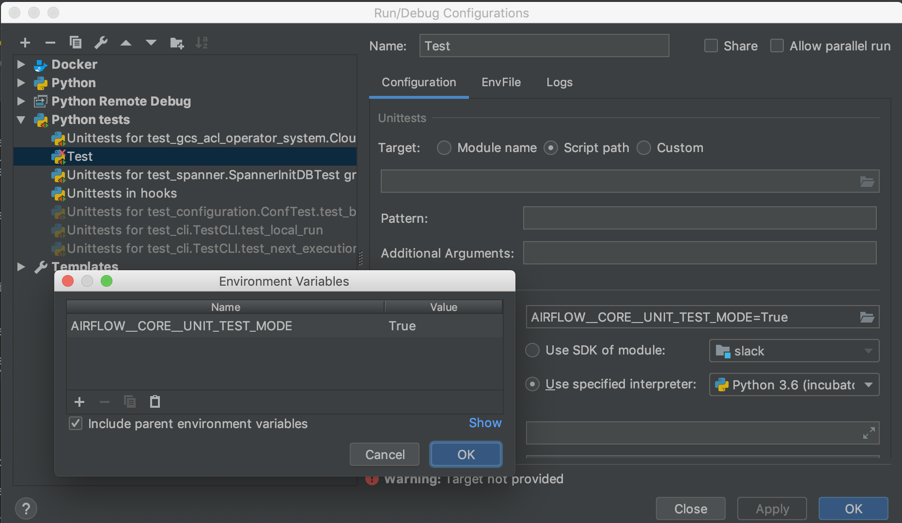

 .. Licensed to the Apache Software Foundation (ASF) under one
    or more contributor license agreements.  See the NOTICE file
    distributed with this work for additional information
    regarding copyright ownership.  The ASF licenses this file
    to you under the Apache License, Version 2.0 (the
    "License"); you may not use this file except in compliance
    with the License.  You may obtain a copy of the License at

 ..   http://www.apache.org/licenses/LICENSE-2.0

 .. Unless required by applicable law or agreed to in writing,
    software distributed under the License is distributed on an
    "AS IS" BASIS, WITHOUT WARRANTIES OR CONDITIONS OF ANY
    KIND, either express or implied.  See the License for the
    specific language governing permissions and limitations
    under the License.

.. image:: images/AirflowBreeze_logo.png
    :align: center
    :alt: Airflow Breeze Logo

Table of Contents
=================

* `Airflow Breeze <#airflow-breeze>`_
* `Installation <#installation>`_
* `Setting up autocomplete <#setting-up-autocomplete>`_
* `Using the Airflow Breeze environment <#using-the-airflow-breeze-environment>`_
    - `Entering the environment <#entering-the-environment>`_
    - `Running tests in Airflow Breeze <#running-tests-in-airflow-breeze>`_
    - `Debugging with ipdb <#debugging-with-ipdb>`_
    - `Airflow directory structure in Docker <#airflow-directory-structure-inside-docker>`_
    - `Port forwarding <#port-forwarding>`_
* `Using your host IDE <#using-your-host-ide>`_
    - `Configuring local virtualenv <#configuring-local-virtualenv>`_
    - `Running unit tests via IDE <#running-unit-tests-via-ide>`_
    - `Debugging Airflow Breeze Tests in IDE <#debugging-airflow-breeze-tests-in-ide>`_
* `Running commands via Airflow Breeze <#running-commands-via-airflow-breeze>`_
    - `Running static code checks <#running-static-code-checks>`_
    - `Building the documentation <#building-the-documentation>`_
    - `Running tests <#running-tests>`_
    - `Running commands inside Docker <#running-commands-inside-docker>`_
    - `Running Docker Compose commands <#running-docker-compose-commands>`_
    - `Convenience scripts <#convenience-scripts>`_
* `Keeping images up-to-date <#keeping-images-up-to-date>`_
    - `Updating dependencies <#updating-dependencies>`_
    - `Pulling the images <#pulling-the-images>`_
* `Airflow Breeze flags <#airflow-breeze-flags>`_

Airflow Breeze
==============

Airflow Breeze is an easy-to-use integration test environment managed via
`Docker Compose <https://docs.docker.com/compose/>`_ .
The environment is easy to use locally and it is also used by Airflow's CI Travis tests.

It's called **Airflow Breeze** as in "It's a *Breeze* to develop Airflow"

The advantages and disadvantages of using the environment vs. other ways of testing Airflow
are described in `CONTRIBUTING.md <CONTRIBUTING.md#integration-test-development-environment>`_.

Here is the short 10 minute video about Airflow Breeze

.. image:: http://img.youtube.com/vi/ffKFHV6f3PQ/0.jpg
   :width: 480px
   :height: 360px
   :scale: 100 %
   :alt: Airflow Breeze Simplified Development Workflow
   :align: center
   :target: http://www.youtube.com/watch?v=ffKFHV6f3PQ

Installation
============

Prerequisites for the installation:

*
  If you are on MacOS you need gnu ``getopt`` and ``gstat`` to get Airflow Breeze running. Typically
  you need to run ``brew install gnu-getopt coreutils`` and then follow instructions (you need
  to link the gnu getopt version to become first on the PATH).

*
  Latest stable Docker Community Edition installed and on the PATH. It should be
  configured to be able to run ``docker`` commands directly and not only via root user

  * your user should be in ``docker`` group.
    See `Docker installation guide <https://docs.docker.com/install/>`_

*
  Latest stable Docker Compose installed and on the PATH. It should be
  configured to be able to run ``docker-compose`` command.
  See `Docker compose installation guide <https://docs.docker.com/compose/install/>`_

Your entry point for Airflow Breeze is `./breeze <./breeze>`_
script. You can run it with ``-h`` option to see the list of available flags.
You can add the checked out airflow repository to your PATH to run breeze
without the ./ and from any directory if you have only one airflow directory checked out.

See `Airflow Breeze flags <#airflow-breeze-flags>`_ for details.

First time you run `./breeze <./breeze>`_ script, it will pull and build local version of docker images.
It will pull latest Airflow CI images from `Apache Airflow DockerHub <https://hub.docker.com/r/apache/airflow>`_
and use them to build your local docker images. It will use latest sources from your source code.
Further on ``breeze`` uses md5sum calculation and Docker caching mechanisms to only rebuild what is needed.
Airflow Breeze will detect if Docker images need to be rebuilt and ask you for confirmation.

Setting up autocomplete
=======================

The ``breeze`` command comes with built-in bash/zsh autocomplete. When you start typing
`./breeze <./breeze>`_ command you can use <TAB> to show all the available switches
nd to get autocompletion on typical values of parameters that you can use.

You can setup auto-complete automatically by running this command (-a is shortcut for --setup-autocomplete):

.. code-block:: bash

   ./breeze --setup-autocomplete

You get autocomplete working when you re-enter the shell.

Zsh autocompletion is currently limited to only autocomplete flags. Bash autocompletion also completes
flag values (for example python version or static check name).

Using the Airflow Breeze environment
====================================

Entering the environment
------------------------

You enter the integration test environment by running the `./breeze <./breeze>`_ script.

You can specify python version to use, backend to use and environment for testing - so that you can
recreate the same environments as we have in matrix builds in Travis CI. The defaults when you
run the environment are reasonable (python 3.6, sqlite, docker).

What happens next is the appropriate docker images are pulled, local sources are used to build local version
of the image and you are dropped into bash shell of the airflow container -
with all necessary dependencies started up. Note that the first run (per python) might take up to 10 minutes
on a fast connection to start. Subsequent runs should be much faster.

.. code-block:: bash

   ./breeze

You can choose the optional flags you need with `./breeze <./breeze>`_.

For example you could choose to run python 3.6 tests with mysql as backend and in docker
environment by:

.. code-block:: bash

   ./breeze --python 3.6 --backend mysql --env docker

The choices you made are persisted in ``./.build/`` cache directory so that next time when you use the
`./breeze <./breeze>`_ script, it will use the values that were used previously. This way you do not
have to specify them when you run the script. You can delete the ``./.build/`` in case you want to
restore default settings.

Relevant sources of airflow are mounted inside the ``airflow-testing`` container that you enter,
which means that you can continue editing your changes in the host in your favourite IDE and have them
visible in docker immediately and ready to test without rebuilding images. This can be disabled by specifying
``--skip-mounting-source-volume`` flag when running breeze, in which case you will have sources
embedded in the container - and changes to those sources will not be persistent.

Once you enter the environment you are dropped into bash shell and you can run tests immediately.

Running tests in Airflow Breeze
-------------------------------

Once you enter Airflow Breeze environment you should be able to simply run
`run-tests` at will. Note that if you want to pass extra parameters to nose
you should do it after '--'

For example, in order to just execute the "core" unit tests, run the following:

.. code-block:: bash

   run-tests tests.core:TestCore -- -s --logging-level=DEBUG

or a single test method:

.. code-block:: bash

   run-tests tests.core:TestCore.test_check_operators -- -s --logging-level=DEBUG

The tests will run ``airflow db reset`` and ``airflow db init`` the first time you
run tests in running container, so you can count on database being initialized.

All subsequent test executions within the same container will run without database
initialisation.

You can also optionally add --with-db-init flag if you want to re-initialize
the database.

.. code-block:: bash

   run-tests --with-db-init tests.core:TestCore.test_check_operators -- -s --logging-level=DEBUG

Debugging with ipdb
-------------------

You can debug any code you run in the container using ``ipdb`` debugger if you prefer console debugging.
It is as easy as copy&pasting this line into your code:

.. code-block:: python

   import ipdb; ipdb.set_trace()

Once you hit the line you will be dropped into interactive ipdb  debugger where you have colors
and auto-completion to guide your debugging. This works from the console where you started your program.
Note that in case of ``nosetest`` you need to provide `--nocapture` flag to avoid nosetests
capturing the stdout of your process.

Airflow directory structure inside Docker
-----------------------------------------

When you are in the container note that following directories are used:

.. code-block:: text

  /opt/airflow - here sources of Airflow are mounted from the host (AIRFLOW_SOURCES)
  /root/airflow - all the "dynamic" Airflow files are created here: (AIRFLOW_HOME)
      airflow.db - sqlite database in case sqlite is used
      dags - folder where non-test dags are stored (test dags are in /opt/airflow/tests/dags)
      logs - logs from airflow executions are created there
      unittest.cfg - unit test configuration generated when entering the environment
      webserver_config.py - webserver configuration generated when running airflow in the container

Note that when run in your local environment ``/root/airflow/logs`` folder is actually mounted from your
``logs`` directory in airflow sources, so all logs created in the container are automatically visible in the host
as well. Every time you enter the container the logs directory is cleaned so that logs do not accumulate.

Port forwarding
---------------

When you run Airflow Breeze, the following ports are automatically forwarded:

* 28080 -> forwarded to airflow webserver -> airflow-testing:8080
* 25433 -> forwarded to postgres database -> postgres:5432
* 23306 -> forwarded to mysql database  -> mysql:3306

You can connect to those ports/databases using:

* Webserver: (http://127.0.0.1:28080)[http://127.0.0.1:28080]
* Postgres: ``jdbc:postgresql://127.0.0.1:25433/airflow?user=postgres&password=airflow``
* Mysql: ``jdbc:mysql://localhost:23306/airflow?user=root``

Note that you need to start the webserver manually with ``airflow webserver`` command if you want to connect
to the webserver (you can use ``tmux`` to multiply terminals).

For databases you need to run ``airflow resetdb`` at least once after you started Airflow Breeze to get
the database/tables created. You can connect to databases with IDE or any other Database client:

.. image:: images/database_view.png
    :align: center
    :alt: Database view

You can change host port numbers used by setting appropriate environment variables:

* WEBSERVER_HOST_PORT
* POSTGRES_HOST_PORT
* MYSQL_HOST_PORT

When you set those variables, next time when you enter the environment the new ports should be in effect.

Using your host IDE
===================

Configuring local virtualenv
----------------------------

In order to use your host IDE (for example IntelliJ's PyCharm/Idea) you need to have virtual environments
setup. Ideally you should have virtualenvs for all python versions that Airflow supports (3.5, 3.6, 3.7).
You can create the virtualenv using ``virtualenvwrapper`` - that will allow you to easily switch between
virtualenvs using workon command and mange your virtual environments more easily.

Typically creating the environment can be done by:

.. code-block:: bash

  mkvirtualenv <ENV_NAME> --python=python<VERSION>

After the virtualenv is created, you must initialize it. Simply enter the environment
(using workon) and once you are in it run:

.. code-block:: bash

  ./breeze --initialize-local-virtualenv

Once initialization is done, you should select the virtualenv you initialized as the project's default
virtualenv in your IDE.

Running unit tests via IDE
--------------------------

After setting it up - you can use the usual "Run Test" option of the IDE and have all the
autocomplete and documentation support from IDE as well as you can debug and click-through
the sources of Airflow - which is very helpful during development. Usually you also can run most
of the unit tests (those that do not require prerequisites) directly from the IDE:

Running unit tests from IDE is as simple as:

.. image:: images/running_unittests.png
    :align: center
    :alt: Running unit tests

Some of the core tests use dags defined in ``tests/dags`` folder - those tests should have
``AIRFLOW__CORE__UNIT_TEST_MODE`` set to True. You can set it up in your test configuration:

You cannot run all the tests this way - only unit tests that do not require external dependencies
such as postgres/mysql/hadoop etc. You should use
`Running tests in Airflow Breeze <#running-tests-in-airflow-breeze>`_ in order to run those tests. You can
still use your IDE to debug those tests as explained in the next chapter.

Debugging Airflow Breeze Tests in IDE
-------------------------------------

When you run example DAGs, even if you run them using UnitTests from within IDE, they are run in a separate
container. This makes it a little harder to use with IDE built-in debuggers.
Fortunately for IntelliJ/PyCharm it is fairly easy using remote debugging feature (note that remote
debugging is only available in paid versions of IntelliJ/PyCharm).

You can read general description `about remote debugging
<https://www.jetbrains.com/help/pycharm/remote-debugging-with-product.html>`_

You can setup your remote debug session as follows:

.. image:: images/setup_remote_debugging.png
    :align: center
    :alt: Setup remote debugging

Not that if you are on ``MacOS`` you have to use the real IP address of your host rather than default
localhost because on MacOS container runs in a virtual machine with different IP address.

You also have to remember about configuring source code mapping in remote debugging configuration to map
your local sources into the ``/opt/airflow`` location of the sources within the container.

.. image:: images/source_code_mapping_ide.png
    :align: center
    :alt: Source code mapping

Running commands via Airflow Breeze
===================================

Running static code checks
--------------------------

If you wish to run static code checks inside Docker environment you can do it via
``-S``, ``--static-check`` flags or ``-F``, ``--static-check-all-files``. The former will run appropriate
checks only for files changed and staged locally, the latter will run it on all files. It can take a lot of
time to run check for all files in case of pylint on MacOS due to slow filesystem for Mac OS Docker.
You can add arguments you should pass them after -- as extra arguments.
You cannot pass ``--files`` flage if you selected ``--static-check-all-files`` option.

You can see the list of available static checks via --help flag or use autocomplete. Most notably ``all``
static check runs all static checks configured. Also since pylint tests take a lot of time you can
also run special ``all-but-pylint`` check which will skip pylint checks.

Run mypy check in currently staged changes:

.. code-block:: bash

     ./breeze  --static-check mypy

Run mypy check in all files:

.. code-block:: bash

     ./breeze --static-check-all-files mypy

Run flake8 check for tests.core.py file with verbose output:

.. code-block:: bash

     ./breeze  --static-check flake8 -- --files tests/core.py --verbose

Run flake8 check for tests.core package with verbose output:

.. code-block:: bash

     ./breeze  --static-check mypy -- --files tests/hooks/test_druid_hook.py

Run all tests on currently staged files:

.. code-block:: bash

     ./breeze  --static-check all

Run all tests on all files:

.. code-block:: bash

     ./breeze  --static-check-all-files all

Run all tests but pylint on all files:

.. code-block:: bash

     ./breeze  --static-check-all-files all-but-pylint

Run pylint checks for all changed files:

.. code-block:: bash

     ./breeze  --static-check pylint

Run pylint checks for selected files:

.. code-block:: bash

     ./breeze  --static-check pylint -- --files airflow/configuration.py

Run pylint checks for all files:

.. code-block:: bash

     ./breeze --static-check-all-files pylint

The ``license`` check is also run via separate script and separate docker image containing
Apache RAT verification tool that checks for Apache-compatibility of licences within the codebase.
It does not take pre-commit parameters as extra args.

.. code-block:: bash

     ./breeze --static-check-all-files licenses

Building the documentation
--------------------------

The documentation is build using ``-O``, ``--build-docs`` command:

.. code-block:: bash

     ./breeze --build-docs

Results of the build can be found in ``docs/_build`` folder. Often errors during documentation generation
come from the docstrings of auto-api generated classes. During the docs building auto-api generated
files are stored in ``docs/_api`` folder - so that in case of problems with documentation you can
find where the problems with documentation originated from.

Running tests
-------------

If you wish to run tests only and not drop into shell, you can run them by providing
-t, --test-target flag. You can add extra nosetest flags after -- in the commandline.

.. code-block:: bash

     ./breeze --test-target tests/hooks/test_druid_hook.py -- --logging-level=DEBUG

You can run the whole test suite with special '.' test target:

.. code-block:: bash

    ./breeze --test-target .

You can also specify individual tests or group of tests:

.. code-block:: bash

    ./breeze --test-target tests.core:TestCore

Running commands inside Docker
------------------------------

If you wish to run other commands/executables inside of Docker environment you can do it via
``-x``, ``--execute-command`` flag. Note that if you want to add arguments you should specify them
together with the command surrounded with " or ' or pass them after -- as extra arguments.

.. code-block:: bash

     ./breeze --execute-command "ls -la"

.. code-block:: bash

     ./breeze --execute-command ls -- --la

Running Docker Compose commands
-------------------------------

If you wish to run docker-compose command (such as help/pull etc. ) you can do it via
``-d``, ``--docker-compose`` flag. Note that if you want to add extra arguments you should specify them
after -- as extra arguments.

.. code-block:: bash

     ./breeze --docker-compose pull -- --ignore-pull-failures

Convenience scripts
-------------------

Once you run ./breeze you can also execute various actions via generated convenience scripts

.. code-block::

   Enter the environment          : ./.build/cmd_run
   Run command in the environment : ./.build/cmd_run "[command with args]" [bash options]
   Run tests in the environment   : ./.build/test_run [test-target] [nosetest options]
   Run Docker compose command     : ./.build/dc [help/pull/...] [docker-compose options]

Keeping images up-to-date
=========================

Updating dependencies
---------------------

If you change apt dependencies in the Dockerfile or change setup.py or
add new apt dependencies or npm dependencies, you have two options how to update the dependencies.

*
  You can install dependencies inside the container using 'sudo apt install', 'pip install' or 'npm install'
  (in airflow/www folder) respectively. This is useful if you want to test somthing quickly while in the
  container. However, those changes are not persistent - they will disappear once you
  exit the container (except npm dependencies in case your sources are mounted to the container). Therefore
  if you want to persist a new dependency you have to follow with the second option.

*
  You can add the dependencies to the Dockerfile, setup.py or package.json and rebuild the image. This
  should happen automatically if you modify any of setup.py, package.json or update Dockerfile itself.
  After you exit the container and re-run `./breeze <./breeze>`_ the Breeze detects changes in dependencies,
  ask you to confirm rebuilding of the image and proceed to rebuilding the image if you confirm (or skip it
  if you won't confirm). After rebuilding is done, it will drop you to shell. You might also provide
  ``--build-only`` flag to only rebuild images and not go into shell - it will then rebuild the image
  and will not enter the shell.

Note that during development, changing dependencies in apt-get closer to the top of the Dockerfile
will invalidate cache for most of the image and it will take long time to rebuild the image by breeze.
Therefore it is a recommended practice to add new dependencies closer to the bottom of
Dockerfile during development (to get the new dependencies incrementally added) and only move them to the
top when you are close to finalise the PR and merge the change. It's OK for development time to add separate
``apt-get install`` commands similar to those that are already there (but remember to move newly added
dependencies to the appropriate ``apt-get install`` command which is already in the Dockerfile.

Pulling the images
------------------

Sometimes the image on DockerHub is rebuilt from the scratch. This happens for example when there is a
security update of the python version that all the images are based on. In this case it is much faster to
pull latest images rather than rebuild them from the scratch. Airflow Breeze will detect such case and
will ask you to confirm to pull and build the image and if you answer OK, it will pull and build the image.
You might also provide ``--force-pull-images`` flag to force pull latest images from DockerHub.

Airflow Breeze flags
====================

These are the current flags of the `./breeze <./breeze>`_ script

.. code-block:: text

    Usage: breeze [FLAGS] \
      [-k]|[-S <STATIC_CHECK>]|[-F <STATIC_CHECK>]|[-O]|[-e]|[-a]|[-b]|[-t <TARGET>]|[-x <COMMAND>]|[-d <COMMAND>] \
      -- <EXTRA_ARGS>

    The swiss-knife-army tool for Airflow testings. It allows to perform various test tasks:

      * Enter interactive environment when no command flags are specified (default behaviour)
      * Stop the interactive environment with -k, --stop-environment command
      * Run static checks - either for currently staged change or for all files with
        -S, --static-check or -F, --static-check-all-files commanbd
      * Build documentation with -O, --build-docs command
      * Setup local virtualenv with -e, --setup-virtualenv command
      * Setup autocomplete for itself with -a, --setup-autocomplete command
      * Build docker image with -b, --build-only command
      * Run test target specified with -t, --test-target connad
      * Execute arbitrary command in the test environmenrt with -x, --execute-command command
      * Execute arbitrary docker-compose command with -d, --docker-compose command

    ** Commands

      By default the script enters IT environment and drops you to bash shell,
      but you can also choose one of the commands to run specific actions instead:

    -k, --stop-environment
            Bring down running docker compose environment. When you start the environment, the docker
            containers will continue running so that startup time is shorter. But they take quite a lot of
            memory and CPU. This command stops all running containers from the environment.

    -O, --build-docs
           Build documentation.

    -S, --static-check <STATIC_CHECK>
            Run selected static checks for currently changed files. You should specify static check that
            you would like to run or 'all' to run all checks. One of
            [ all all-but-pylint check-hooks-apply check-merge-conflict check-executables-have-shebangs check-xml detect-private-key doctoc end-of-file-fixer flake8 forbid-tabs insert-license check-apache-license lint-dockerfile mixed-line-ending mypy pylint shellcheck].
            You can pass extra arguments including options to to the pre-commit framework as
            <EXTRA_ARGS> passed after --. For example:

            './breeze  --static-check mypy' or
            './breeze  --static-check mypy -- --files tests/core.py'

            You can see all the options by adding --help EXTRA_ARG:

            './breeze  --static-check mypy -- --help'

    -F, --static-check-all-files <STATIC_CHECK>
            Run selected static checks for all applicable files. You should specify static check that
            you would like to run or 'all' to run all checks. One of
            [ all all-but-pylint check-hooks-apply check-merge-conflict check-executables-have-shebangs check-xml detect-private-key doctoc end-of-file-fixer flake8 forbid-tabs insert-license check-apache-license lint-dockerfile mixed-line-ending mypy pylint shellcheck].
            You can pass extra arguments including options to the pre-commit framework as
            <EXTRA_ARGS> passed after --. For example:

            './breeze --static-check-all-files mypy' or
            './breeze --static-check-all-files mypy -- --verbose'

            You can see all the options by adding --help EXTRA_ARG:

            './breeze --static-check-all-files mypy -- --help'

    -e, --initialize-local-virtualenv
            Initializes locally created virtualenv installing all dependencies of Airflow.
            This local virtualenv can be used to aid autocompletion and IDE support as
            well as run unit tests directly from the IDE. You need to have virtualenv
            activated before running this command.

    -a, --setup-autocomplete
            Sets up autocomplete for breeze commands. Once you do it you need to re-enter the bash
            shell and when typing breeze command <TAB> will provide autocomplete for parameters and values.

    -b, --build-only
            Only build docker images but do not enter the airflow-testing docker container.

    -t, --test-target <TARGET>
            Run the specified unit test target. There might be multiple
            targets specified separated with comas. The <EXTRA_ARGS> passed after -- are treated
            as additional options passed to nosetest. For example:

            './breeze --test-target tests.core -- --logging-level=DEBUG'

    -x, --execute-command <COMMAND>
            Run chosen command instead of entering the environment. The command is run using
            'bash -c "<command with args>" if you need to pass arguments to your command, you need
            to pass them together with command surrounded with " or '. Alternatively you can pass arguments as
             <EXTRA_ARGS> passed after --. For example:

            './breeze --execute-command "ls -la"' or
            './breeze --execute-command ls -- --la'

    -d, --docker-compose <COMMAND>
            Run docker-compose command instead of entering the environment. Use 'help' command
            to see available commands. The <EXTRA_ARGS> passed after -- are treated
            as additional options passed to docker-compose. For example

            './breeze --docker-compose pull -- --ignore-pull-failures'

    ** General flags

    -h, --help
            Shows this help message.

    -P, --python <PYTHON_VERSION>
            Python version used for the image. This is always major/minor version.
            One of [ 3.5 3.6 3.7 ]. Default is the python3 or python on the path.

    -E, --env <ENVIRONMENT>
            Environment to use for tests. It determines which types of tests can be run.
            One of [ docker kubernetes ]. Default: docker

    -B, --backend <BACKEND>
            Backend to use for tests - it determines which database is used.
            One of [ sqlite mysql postgres ]. Default: sqlite

    -K, --kubernetes-version <KUBERNETES_VERSION>
            Kubernetes version - only used in case of 'kubernetes' environment.
            One of [ v1.13.0 ]. Default: v1.13.0

    -M, --kubernetes-mode <KUBERNETES_MODE>
            Kubernetes mode - only used in case of 'kubernetes' environment.
            One of [ persistent_mode git_mode ]. Default: git_mode

    -s, --skip-mounting-source-volume
            Skips mounting local volume with sources - you get exactly what is in the
            docker image rather than your current local sources of airflow.

    -v, --verbose
            Show verbose information about executed commands (enabled by default for running test)

    -y, --assume-yes
            Assume 'yes' answer to all questions.

    -C, --toggle-suppress-cheatsheet
            Toggles on/off cheatsheet displayed before starting bash shell

    -A, --toggle-suppress-asciiart
            Toggles on/off asciiart displayed before starting bash shell

    ** Dockerfile management flags

    -D, --dockerhub-user
            DockerHub user used to pull, push and build images. Default: apache.

    -H, --dockerhub-repo
            DockerHub repository used to pull, push, build images. Default: airflow.

    -r, --force-rebuild-images
            Forces rebuilding of the local docker images. The images are rebuilt
            automatically for the first time or when changes are detected in
            package-related files, but you can force it using this flag.

    -R, --force-rebuild-images-clean
            Force rebuild images without cache. This will remove the pulled or build images
            and start building images from scratch. This might take a long time.

    -p, --force-pull-images
            Forces pulling of images from DockerHub before building to populate cache. The
            images are pulled by default only for the first time you run the
            environment, later the locally build images are used as cache.

    -u, --push-images
            After rebuilding - uploads the images to DockerHub
            It is useful in case you use your own DockerHub user to store images and you want
            to build them locally. Note that you need to use 'docker login' before you upload images.

    -c, --cleanup-images
            Cleanup your local docker cache of the airflow docker images. This will not reclaim space in
            docker cache. You need to 'docker system prune' (optionally with --all) to reclaim that space.
