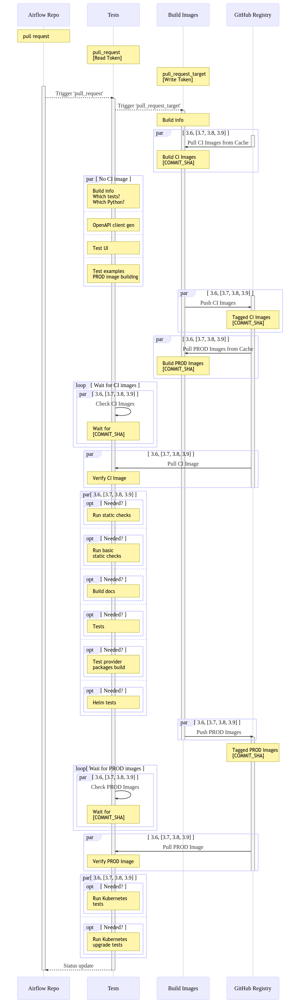
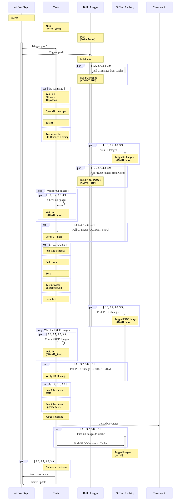
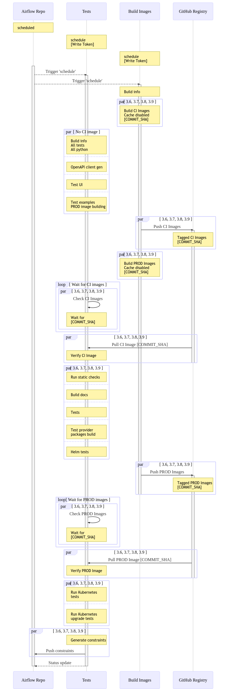

 .. Licensed to the Apache Software Foundation (ASF) under one
    or more contributor license agreements.  See the NOTICE file
    distributed with this work for additional information
    regarding copyright ownership.  The ASF licenses this file
    to you under the Apache License, Version 2.0 (the
    "License"); you may not use this file except in compliance
    with the License.  You may obtain a copy of the License at

 ..   http://www.apache.org/licenses/LICENSE-2.0

 .. Unless required by applicable law or agreed to in writing,
    software distributed under the License is distributed on an
    "AS IS" BASIS, WITHOUT WARRANTIES OR CONDITIONS OF ANY
    KIND, either express or implied.  See the License for the
    specific language governing permissions and limitations
    under the License.

.. contents:: :local:

CI Environment
==============

Continuous Integration is important component of making Apache Airflow robust and stable. We are running
a lot of tests for every pull request, for main and v2-*-test branches and regularly as CRON jobs.

Our execution environment for CI is `GitHub Actions <https://github.com/features/actions>`_. GitHub Actions
(GA) are very well integrated with GitHub code and Workflow and it has evolved fast in 2019/202 to become
a fully-fledged CI environment, easy to use and develop for, so we decided to switch to it. Our previous
CI system was Travis CI.

However part of the philosophy we have is that we are not tightly coupled with any of the CI
environments we use. Most of our CI jobs are written as bash scripts which are executed as steps in
the CI jobs. And we have  a number of variables determine build behaviour.

GitHub Actions runs
-------------------

Our builds on CI are highly optimized. They utilise some of the latest features provided by GitHub Actions
environment that make it possible to reuse parts of the build process across different Jobs.

Big part of our CI runs use Container Images. Airflow has a lot of dependencies and in order to make
sure that we are running tests in a well configured and repeatable environment, most of the tests,
documentation building, and some more sophisticated static checks are run inside a docker container
environment. This environment consist of two types of images: CI images and PROD images. CI Images
are used for most of the tests and checks where PROD images are used in the Kubernetes tests.

In order to run the tests, we need to make sure that the images are built using latest sources and that it
is done quickly (full rebuild of such image from scratch might take ~15 minutes). Therefore optimisation
techniques have been implemented that use efficiently cache from the GitHub Docker registry - in most cases
this brings down the time needed to rebuild the image to ~4 minutes. In some cases (when dependencies change)
it can be ~6-7 minutes and in case base image of Python releases new patch-level, it can be ~12 minutes.

Container Registry used as cache
--------------------------------

For the CI builds of our we are using GitHub Container Registry to store results of the "Build Image" workflow
and pass it to the "CI Build" workflow.

Currently in main version of Airflow we run tests in 4 different versions of Python (3.6, 3.7, 3.8, 3.9)
which means that we have to build 8 images (4 CI ones and 4 PROD ones). Yet we run around 12 jobs
with each of the CI images. That is a lot of time to just build the environment to run. Therefore
we are utilising ``pull_request_target`` feature of GitHub Actions.

This feature allows to run a separate, independent workflow, when the main workflow is run -
this separate workflow is different than the main one, because by default it runs using ``main`` version
of the sources but also - and most of all - that it has WRITE access to the Github Container Image registry.

This is especially important in our case where Pull Requests to Airflow might come from any repository,
and it would be a huge security issue if anyone from outside could
utilise the WRITE access to the Container Image Registry via external Pull Request.

Thanks to the WRITE access and fact that the ``pull_request_target`` by default uses the ``main`` version of the
sources, we can safely run some logic there will checkout the incoming Pull Request, build the container
image from the sources from the incoming PR and push such image to an GitHub Docker Registry - so that
this image can be built only once and used by all the jobs running tests. The image is tagged with unique
``COMMIT_SHA`` of the incoming Pull Request and the tests run in the Pull Request can simply pull such image
rather than build it from the scratch. Pulling such image takes ~ 1 minute, thanks to that we are saving
a lot of precious time for jobs.

We use `GitHub Container Registry <https://docs.github.com/en/packages/guides/about-github-container-registry>`_.
``GITHUB_TOKEN`` is needed to push to the registry and we configured scopes of the tokens in our jobs
to be able to write to the registry.

Locally replicating CI failures
-------------------------------

The main goal of the CI philosophy we have that no matter how complex the test and integration
infrastructure, as a developer you should be able to reproduce and re-run any of the failed checks
locally. One part of it are pre-commit checks, that allow you to run the same static checks in CI
and locally, but another part is the CI environment which is replicated locally with Breeze.

You can read more about Breeze in `BREEZE.rst <BREEZE.rst>`_ but in essence it is a script that allows
you to re-create CI environment in your local development instance and interact with it. In its basic
form, when you do development you can run all the same tests that will be run in CI - but locally,
before you submit them as PR. Another use case where Breeze is useful is when tests fail on CI. You can
take the full ``COMMIT_SHA`` of the failed build pass it as ``--github-image-id`` parameter of Breeze and it will
download the very same version of image that was used in CI and run it locally. This way, you can very
easily reproduce any failed test that happens in CI - even if you do not check out the sources
connected with the run.

You can read more about it in `BREEZE.rst <BREEZE.rst>`_ and `TESTING.rst <TESTING.rst>`_

Difference between local runs and GitHub Action workflows
---------------------------------------------------------

Depending whether the scripts are run locally (most often via `Breeze <BREEZE.rst>`_) or whether they
are run in "CI Build" or "Build Image" workflows they can take different values.

You can use those variables when you try to reproduce the build locally.

+-----------------------------------------+-------------+-------------+------------+-------------------------------------------------+
| Variable                                | Local       | Build Image | Main CI    | Comment                                         |
|                                         | development | CI workflow | Workflow   |                                                 |
+=========================================+=============+=============+============+=================================================+
|                                                           Basic variables                                                          |
+-----------------------------------------+-------------+-------------+------------+-------------------------------------------------+
| ``PYTHON_MAJOR_MINOR_VERSION``          |             |             |            | Major/Minor version of Python used.             |
+-----------------------------------------+-------------+-------------+------------+-------------------------------------------------+
| ``DB_RESET``                            |    false    |     true    |    true    | Determines whether database should be reset     |
|                                         |             |             |            | at the container entry. By default locally      |
|                                         |             |             |            | the database is not reset, which allows to      |
|                                         |             |             |            | keep the database content between runs in       |
|                                         |             |             |            | case of Postgres or MySQL. However,             |
|                                         |             |             |            | it requires to perform manual init/reset        |
|                                         |             |             |            | if you stop the environment.                    |
+-----------------------------------------+-------------+-------------+------------+-------------------------------------------------+
|                                                           Mount variables                                                          |
+-----------------------------------------+-------------+-------------+------------+-------------------------------------------------+
| ``MOUNT_SELECTED_LOCAL_SOURCES``        |     true    |    false    |    false   | Determines whether local sources are            |
|                                         |             |             |            | mounted to inside the container. Useful for     |
|                                         |             |             |            | local development, as changes you make          |
|                                         |             |             |            | locally can be immediately tested in            |
|                                         |             |             |            | the container. We mount only selected,          |
|                                         |             |             |            | important folders. We do not mount the whole    |
|                                         |             |             |            | project folder in order to avoid accidental     |
|                                         |             |             |            | use of artifacts (such as ``egg-info``          |
|                                         |             |             |            | directories) generated locally on the           |
|                                         |             |             |            | host during development.                        |
+-----------------------------------------+-------------+-------------+------------+-------------------------------------------------+
| ``MOUNT_ALL_LOCAL_SOURCES``             |     false   |    false    |    false   | Determines whether all local sources are        |
|                                         |             |             |            | mounted to inside the container. Useful for     |
|                                         |             |             |            | local development when you need to access .git  |
|                                         |             |             |            | folders and other folders excluded when         |
|                                         |             |             |            | ``MOUNT_SELECTED_LOCAL_SOURCES`` is true.       |
|                                         |             |             |            | You might need to manually delete egg-info      |
|                                         |             |             |            | folder when you enter breeze and the folder was |
|                                         |             |             |            | generated using different Python versions.      |
+-----------------------------------------+-------------+-------------+------------+-------------------------------------------------+
|                                                           Force variables                                                          |
+-----------------------------------------+-------------+-------------+------------+-------------------------------------------------+
| ``FORCE_PULL_IMAGES``                   |    true     |    true     |    true    | Determines if images are force-pulled,          |
|                                         |             |             |            | no matter if they are already present           |
|                                         |             |             |            | locally. This includes not only the             |
|                                         |             |             |            | CI/PROD images but also the Python base         |
|                                         |             |             |            | images. Note that if Python base images         |
|                                         |             |             |            | change, also the CI and PROD images             |
|                                         |             |             |            | need to be fully rebuild unless they were       |
|                                         |             |             |            | already built with that base Python             |
|                                         |             |             |            | image. This is false for local development      |
|                                         |             |             |            | to avoid often pulling and rebuilding           |
|                                         |             |             |            | the image. It is true for CI workflow in        |
|                                         |             |             |            | case waiting from images is enabled             |
|                                         |             |             |            | as the images needs to be force-pulled from     |
|                                         |             |             |            | GitHub Registry, but it is set to               |
|                                         |             |             |            | false when waiting for images is disabled.      |
+-----------------------------------------+-------------+-------------+------------+-------------------------------------------------+
| ``FORCE_BUILD_IMAGES``                  |    false    |    false    |    false   | Forces building images. This is generally not   |
|                                         |             |             |            | very useful in CI as in CI environment image    |
|                                         |             |             |            | is built or pulled only once, so there is no    |
|                                         |             |             |            | need to set the variable to true. For local     |
|                                         |             |             |            | builds it forces rebuild, regardless if it      |
|                                         |             |             |            | is determined to be needed.                     |
+-----------------------------------------+-------------+-------------+------------+-------------------------------------------------+
| ``FORCE_ANSWER_TO_QUESTIONS``           |             |     yes     |     yes    | This variable determines if answer to questions |
|                                         |             |             |            | during the build process should be              |
|                                         |             |             |            | automatically given. For local development,     |
|                                         |             |             |            | the user is occasionally asked to provide       |
|                                         |             |             |            | answers to questions such as - whether          |
|                                         |             |             |            | the image should be rebuilt. By default         |
|                                         |             |             |            | the user has to answer but in the CI            |
|                                         |             |             |            | environment, we force "yes" answer.             |
+-----------------------------------------+-------------+-------------+------------+-------------------------------------------------+
| ``SKIP_CHECK_REMOTE_IMAGE``             |    false    |     true    |    true    | Determines whether we check if remote image     |
|                                         |             |             |            | is "fresher" than the current image.            |
|                                         |             |             |            | When doing local breeze runs we try to          |
|                                         |             |             |            | determine if it will be faster to rebuild       |
|                                         |             |             |            | the image or whether the image should be        |
|                                         |             |             |            | pulled first from the cache because it has      |
|                                         |             |             |            | been rebuilt. This is slightly experimental     |
|                                         |             |             |            | feature and will be improved in the future      |
|                                         |             |             |            | as the current mechanism does not always        |
|                                         |             |             |            | work properly.                                  |
+-----------------------------------------+-------------+-------------+------------+-------------------------------------------------+
|                                                           Host variables                                                           |
+-----------------------------------------+-------------+-------------+------------+-------------------------------------------------+
| ``HOST_USER_ID``                        |             |             |            | User id of the host user.                       |
+-----------------------------------------+-------------+-------------+------------+-------------------------------------------------+
| ``HOST_GROUP_ID``                       |             |             |            | Group id of the host user.                      |
+-----------------------------------------+-------------+-------------+------------+-------------------------------------------------+
| ``HOST_OS``                             |             |    Linux    |    Linux   | OS of the Host (Darwin/Linux).                  |
+-----------------------------------------+-------------+-------------+------------+-------------------------------------------------+
| ``HOST_HOME``                           |             |             |            | Home directory on the host.                     |
+-----------------------------------------+-------------+-------------+------------+-------------------------------------------------+
|                                                      Version suffix variables                                                      |
+-----------------------------------------+-------------+-------------+------------+-------------------------------------------------+
| ``VERSION_SUFFIX_FOR_PYPI``             |             |             |            | Version suffix used during provider             |
|                                         |             |             |            | package preparation for PyPI builds.            |
+-----------------------------------------+-------------+-------------+------------+-------------------------------------------------+
|                                                            Git variables                                                           |
+-----------------------------------------+-------------+-------------+------------+-------------------------------------------------+
| COMMIT_SHA                              |             | GITHUB_SHA  | GITHUB_SHA | SHA of the commit of the build is run           |
+-----------------------------------------+-------------+-------------+------------+-------------------------------------------------+
|                                                         Verbosity variables                                                        |
+-----------------------------------------+-------------+-------------+------------+-------------------------------------------------+
| ``PRINT_INFO_FROM_SCRIPTS``             |   true\*    |    true\*   |    true\*  | Allows to print output to terminal from running |
|                                         |             |             |            | scripts. It prints some extra outputs if true   |
|                                         |             |             |            | including what the commands do, results of some |
|                                         |             |             |            | operations, summary of variable values, exit    |
|                                         |             |             |            | status from the scripts, outputs of failing     |
|                                         |             |             |            | commands. If verbose is on it also prints the   |
|                                         |             |             |            | commands executed by docker, kind, helm,        |
|                                         |             |             |            | kubectl. Disabled in pre-commit checks.         |
|                                         |             |             |            |                                                 |
|                                         |             |             |            | \* set to false in pre-commits                  |
+-----------------------------------------+-------------+-------------+------------+-------------------------------------------------+
| ``VERBOSE``                             |    false    |     true    |    true    | Determines whether docker, helm, kind,          |
|                                         |             |             |            | kubectl commands should be printed before       |
|                                         |             |             |            | execution. This is useful to determine          |
|                                         |             |             |            | what exact commands were executed for           |
|                                         |             |             |            | debugging purpose as well as allows             |
|                                         |             |             |            | to replicate those commands easily by           |
|                                         |             |             |            | copy&pasting them from the output.              |
|                                         |             |             |            | requires ``PRINT_INFO_FROM_SCRIPTS`` set to     |
|                                         |             |             |            | true.                                           |
+-----------------------------------------+-------------+-------------+------------+-------------------------------------------------+
| ``VERBOSE_COMMANDS``                    |    false    |    false    |    false   | Determines whether every command                |
|                                         |             |             |            | executed in bash should also be printed         |
|                                         |             |             |            | before execution. This is a low-level           |
|                                         |             |             |            | debugging feature of bash (set -x) and          |
|                                         |             |             |            | it should only be used if you are lost          |
|                                         |             |             |            | at where the script failed.                     |
+-----------------------------------------+-------------+-------------+------------+-------------------------------------------------+
|                                                        Image build variables                                                       |
+-----------------------------------------+-------------+-------------+------------+-------------------------------------------------+
| ``UPGRADE_TO_NEWER_DEPENDENCIES``       |    false    |    false    |   false\*  | Determines whether the build should             |
|                                         |             |             |            | attempt to upgrade Python base image and all    |
|                                         |             |             |            | PIP dependencies to latest ones matching        |
|                                         |             |             |            | ``setup.py`` limits. This tries to replicate    |
|                                         |             |             |            | the situation of "fresh" user who just installs |
|                                         |             |             |            | airflow and uses latest version of matching     |
|                                         |             |             |            | dependencies. By default we are using a         |
|                                         |             |             |            | tested set of dependency constraints            |
|                                         |             |             |            | stored in separated "orphan" branches           |
|                                         |             |             |            | of the airflow repository                       |
|                                         |             |             |            | ("constraints-main, "constraints-2-0")          |
|                                         |             |             |            | but when this flag is set to anything but false |
|                                         |             |             |            | (for example commit SHA), they are not used     |
|                                         |             |             |            | used and "eager" upgrade strategy is used       |
|                                         |             |             |            | when installing dependencies. We set it         |
|                                         |             |             |            | to true in case of direct pushes (merges)       |
|                                         |             |             |            | to main and scheduled builds so that            |
|                                         |             |             |            | the constraints are tested. In those builds,    |
|                                         |             |             |            | in case we determine that the tests pass        |
|                                         |             |             |            | we automatically push latest set of             |
|                                         |             |             |            | "tested" constraints to the repository.         |
|                                         |             |             |            |                                                 |
|                                         |             |             |            | Setting the value to commit SHA is best way     |
|                                         |             |             |            | to assure that constraints are upgraded even if |
|                                         |             |             |            | there is no change to setup.py                  |
|                                         |             |             |            |                                                 |
|                                         |             |             |            | This way our constraints are automatically      |
|                                         |             |             |            | tested and updated whenever new versions        |
|                                         |             |             |            | of libraries are released.                      |
|                                         |             |             |            |                                                 |
|                                         |             |             |            | \* true in case of direct pushes and            |
|                                         |             |             |            |    scheduled builds                             |
+-----------------------------------------+-------------+-------------+------------+-------------------------------------------------+
| ``CHECK_IMAGE_FOR_REBUILD``             |     true    |     true    |   true\*   | Determines whether attempt should be            |
|                                         |             |             |            | made to rebuild the CI image with latest        |
|                                         |             |             |            | sources. It is true by default for              |
|                                         |             |             |            | local builds, however it is set to              |
|                                         |             |             |            | true in case we know that the image             |
|                                         |             |             |            | we pulled or built already contains             |
|                                         |             |             |            | the right sources. In such case we              |
|                                         |             |             |            | should set it to false, especially              |
|                                         |             |             |            | in case our local sources are not the           |
|                                         |             |             |            | ones we intend to use (for example              |
|                                         |             |             |            | when ``--github-image-id`` is used              |
|                                         |             |             |            | in Breeze.                                      |
|                                         |             |             |            |                                                 |
|                                         |             |             |            | In CI builds it is set to true                  |
|                                         |             |             |            | in case of the "Build Image"                    |
|                                         |             |             |            | workflow or when                                |
|                                         |             |             |            | waiting for images is disabled                  |
|                                         |             |             |            | in the CI workflow.                             |
|                                         |             |             |            |                                                 |
|                                         |             |             |            | \* if waiting for images the variable is set    |
|                                         |             |             |            |    to false automatically.                      |
+-----------------------------------------+-------------+-------------+------------+-------------------------------------------------+
| ``SKIP_BUILDING_PROD_IMAGE``            |     false   |     false   |   false\*  | Determines whether we should skip building      |
|                                         |             |             |            | the PROD image with latest sources.             |
|                                         |             |             |            | It is set to false, but in deploy app for       |
|                                         |             |             |            | kubernetes step it is set to "true", because at |
|                                         |             |             |            | this stage we know we have good image build or  |
|                                         |             |             |            | pulled.                                         |
|                                         |             |             |            |                                                 |
|                                         |             |             |            | \* set to true in "Deploy App to Kubernetes"    |
|                                         |             |             |            |    to false automatically.                      |
+-----------------------------------------+-------------+-------------+------------+-------------------------------------------------+

Running CI Builds locally
=========================

The scripts and configuration files for CI builds are all in ``scripts/ci`` - so that in the
``pull_request_target`` target workflow, we can copy those scripts from the ``main`` branch and use them
regardless of the changes done in the PR. This way we are kept safe from PRs injecting code into the builds.

* ``build_airflow`` - builds airflow packages
* ``constraints`` - scripts to build and publish latest set of valid constraints
* ``docs`` - scripts to build documentation
* ``images`` - scripts to build and push CI and PROD images
* ``kubernetes`` - scripts to setup kubernetes cluster, deploy airflow and run kubernetes tests with it
* ``openapi`` - scripts to run openapi generation
* ``pre_commit`` - scripts to run pre-commit checks
* ``provider_packages`` - scripts to build and test provider packages
* ``static_checs`` - scripts to run static checks manually
* ``testing`` - scripts that run unit and integration tests
* ``tools`` - scripts that can be used for various clean-up and preparation tasks

Common libraries of functions for all the scripts can be found in ``libraries`` folder. The ``dockerfiles``,
``mysql.d``, ``openldap``, ``spectral_rules`` folders contains DockerFiles and configuration of integrations
needed to run tests.

For detailed use of those scripts you can refer to ``.github/workflows/`` - those scripts are used
by the CI workflows of ours. There are some variables that you can set to change the behaviour of the
scripts.

The default values are "sane"  you can change them to interact with your own repositories or registries.
Note that you need to set "CI" variable to true in order to get the same results as in CI.

+------------------------------+----------------------+-----------------------------------------------------+
| Variable                     | Default              | Comment                                             |
+==============================+======================+=====================================================+
| CI                           | ``false``            | If set to "true", we simulate behaviour of          |
|                              |                      | all scripts as if they are in CI environment        |
+------------------------------+----------------------+-----------------------------------------------------+
| CI_TARGET_REPO               | ``apache/airflow``   | Target repository for the CI build. Used to         |
|                              |                      | compare incoming changes from PR with the target.   |
+------------------------------+----------------------+-----------------------------------------------------+
| CI_TARGET_BRANCH             | ``main``             | Target branch where the PR should land. Used to     |
|                              |                      | compare incoming changes from PR with the target.   |
+------------------------------+----------------------+-----------------------------------------------------+
| CI_BUILD_ID                  | ``0``                | Unique id of the build that is kept across re runs  |
|                              |                      | (for GitHub actions it is ``GITHUB_RUN_ID``)        |
+------------------------------+----------------------+-----------------------------------------------------+
| CI_JOB_ID                    | ``0``                | Unique id of the job - used to produce unique       |
|                              |                      | artifact names.                                     |
+------------------------------+----------------------+-----------------------------------------------------+
| CI_EVENT_TYPE                | ``pull_request``     | Type of the event. It can be one of                 |
|                              |                      | [``pull_request``, ``pull_request_target``,         |
|                              |                      |  ``schedule``, ``push``]                            |
+------------------------------+----------------------+-----------------------------------------------------+
| CI_REF                       | ``refs/head/main``   | Branch in the source repository that is used to     |
|                              |                      | make the pull request.                              |
+------------------------------+----------------------+-----------------------------------------------------+

GitHub Registry Variables
=========================

Our CI uses GitHub Registry to pull and push images to/from by default. You can use your own repo by changing
``GITHUB_REPOSITORY`` and providing your own GitHub Username and Token.

+--------------------------------+---------------------------+----------------------------------------------+
| Variable                       | Default                   | Comment                                      |
+================================+===========================+==============================================+
| GITHUB_REPOSITORY              | ``apache/airflow``        | Prefix of the image. It indicates which.     |
|                                |                           | registry from GitHub to use                  |
+--------------------------------+---------------------------+----------------------------------------------+
| GITHUB_USERNAME                |                           | Username to use to login to GitHub           |
|                                |                           |                                              |
+--------------------------------+---------------------------+----------------------------------------------+
| GITHUB_TOKEN                   |                           | Token to use to login to GitHub.             |
|                                |                           | Only used when pushing images on CI.         |
+--------------------------------+---------------------------+----------------------------------------------+
| GITHUB_REGISTRY_WAIT_FOR_IMAGE | ``false``                 | Wait for the image to be available. This is  |
|                                |                           | useful if commit SHA is used as pull tag     |
+--------------------------------+---------------------------+----------------------------------------------+
| GITHUB_REGISTRY_PULL_IMAGE_TAG | ``latest``                | Pull this image tag. This is "latest" by     |
|                                |                           | default, can also be full-length commit SHA. |
+--------------------------------+---------------------------+----------------------------------------------+
| GITHUB_REGISTRY_PUSH_IMAGE_TAG | ``latest``                | Pull this image tag. This is "latest" by     |
|                                |                           | default, can also be full-length commit SHA. |
+--------------------------------+---------------------------+----------------------------------------------+

Authentication in GitHub Registry
=================================

We are using GitHub Container Registry as cache for our images. Authentication uses GITHUB_TOKEN mechanism.
Authentication is needed for pushing the images (WRITE) only in "push", "pull_request_target" workflows.

CI Architecture
===============

The following components are part of the CI infrastructure

* **Apache Airflow Code Repository** - our code repository at https://github.com/apache/airflow
* **Apache Airflow Forks** - forks of the Apache Airflow Code Repository from which contributors make
  Pull Requests
* **GitHub Actions** -  (GA) UI + execution engine for our jobs
* **GA CRON trigger** - GitHub Actions CRON triggering our jobs
* **GA Workers** - virtual machines running our jobs at GitHub Actions (max 20 in parallel)
* **GitHub Image Registry** - image registry used as build cache for CI jobs.
  It is at https://ghcr.io/apache/airflow
* **DockerHub Image Registry** - image registry used to pull base Python images and (manually) publish
  the released Production Airflow images. It is at https://dockerhub.com/apache/airflow
* **Official Images** (future) - these are official images that are prominently visible in DockerHub.
  We aim our images to become official images so that you will be able to pull them
  with ``docker pull apache-airflow``

CI run types
============

The following CI Job run types are currently run for Apache Airflow (run by ci.yaml workflow)
and each of the run types has different purpose and context.

Pull request run
----------------

Those runs are results of PR from the forks made by contributors. Most builds for Apache Airflow fall
into this category. They are executed in the context of the "Fork", not main
Airflow Code Repository which means that they have only "read" permission to all the GitHub resources
(container registry, code repository). This is necessary as the code in those PRs (including CI job
definition) might be modified by people who are not committers for the Apache Airflow Code Repository.

The main purpose of those jobs is to check if PR builds cleanly, if the test run properly and if
the PR is ready to review and merge. The runs are using cached images from the Private GitHub registry -
CI, Production Images as well as base Python images that are also cached in the Private GitHub registry.
Also for those builds we only execute Python tests if important files changed (so for example if it is
"no-code" change, no tests will be executed.

The workflow involved in Pull Requests review and approval is a bit more complex than simple workflows
in most of other projects because we've implemented some optimizations related to efficient use
of queue slots we share with other Apache Software Foundation projects. More details about it
can be found in `PULL_REQUEST_WORKFLOW.rst <PULL_REQUEST_WORKFLOW.rst>`_.

Direct Push/Merge Run
---------------------

Those runs are results of direct pushes done by the committers or as result of merge of a Pull Request
by the committers. Those runs execute in the context of the Apache Airflow Code Repository and have also
write permission for GitHub resources (container registry, code repository).
The main purpose for the run is to check if the code after merge still holds all the assertions - like
whether it still builds, all tests are green.

This is needed because some of the conflicting changes from multiple PRs might cause build and test failures
after merge even if they do not fail in isolation. Also those runs are already reviewed and confirmed by the
committers so they can be used to do some housekeeping:
- pushing most recent image build in the PR to the GitHub Container Registry (for caching)
- upgrading to latest constraints and pushing those constraints if all tests succeed
- refresh latest Python base images in case new patch-level is released

The housekeeping is important - Python base images are refreshed with varying frequency (once every few months
usually but sometimes several times per week) with the latest security and bug fixes.
Those patch level images releases can occasionally break Airflow builds (specifically Docker image builds
based on those images) therefore in PRs we only use latest "good" Python image that we store in the
GitHub Container Registry and those push requests will refresh the latest images if they changed.

Scheduled runs
--------------

Those runs are results of (nightly) triggered job - only for ``main`` branch. The
main purpose of the job is to check if there was no impact of external dependency changes on the Apache
Airflow code (for example transitive dependencies released that fail the build). It also checks if the
Docker images can be build from the scratch (again - to see if some dependencies have not changed - for
example downloaded package releases etc.

All runs consist of the same jobs, but the jobs behave slightly differently or they are skipped in different
run categories. Here is a summary of the run categories with regards of the jobs they are running.
Those jobs often have matrix run strategy which runs several different variations of the jobs
(with different Backend type / Python version, type of the tests to run for example). The following chapter
describes the workflows that execute for each run.

Those runs and their corresponding ``Build Images`` runs are only executed in main ``apache/airflow``
repository, they are not executed in forks - we want to be nice to the contributors and not use their
free build minutes on GitHub Actions.

Workflows
=========

A general note about cancelling duplicated workflows: for the Build Images, CI Build and CodeQL workflows we
use the ``concurrency`` feature of GitHub actions to automatically cancel "old" workflows of each time --
meaning if you push a new commit to a branch or to a pull request and there is a workflow running GitHub
Actions will cancel the old job automatically.

Build Images Workflow
---------------------

This workflow builds images for the CI Workflow.

It's a special type of workflow: ``pull_request_target`` which means that it is triggered when a pull request
is opened. This also means that the workflow has Write permission to push to the GitHub registry the images
used by CI Builds which means that the images can be built only once and reused by all the CI jobs
(including the matrix jobs). We've implemented it in the way that the CI Build running will wait until the
images are built by the "Build Images" workflow.

This workflow is also triggered on normal pushes to our "main" branches, i.e. after a
pull request is merged and whenever ``scheduled`` run is triggered.

It's possible to disable this feature and go back to the previous behaviour via
``GITHUB_REGISTRY_WAIT_FOR_IMAGE`` flag in the "Build Workflow image". Setting it to "false" switches back to
the behaviour that each job builds its own image.

The workflow has the following jobs:

+---------------------------+---------------------------------------------+
| Job                       | Description                                 |
|                           |                                             |
+===========================+=============================================+
| Build Info                | Prints detailed information about the build |
+---------------------------+---------------------------------------------+
| Build CI images           | Builds all configured CI images             |
+---------------------------+---------------------------------------------+
| Build PROD images         | Builds all configured PROD images           |
+---------------------------+---------------------------------------------+

The images are stored in the `GitHub Container Registry <https://github.com/orgs/apache/packages?repo_name=airflow>`_
and the names of those images follow the patterns described in
`Naming conventions for stored images <#naming-conventions-for-stored-images>`_

Image building is configured in "fail-fast" mode. When any of the images
fails to build, it cancels other builds and the source "CI Build" workflow run
that triggered it.

CI Build Workflow
-----------------

This workflow is a regular workflow that performs all checks of Airflow code.

+---------------------------+----------------------------------------------+-------+-------+------+
| Job                       | Description                                  | PR    | Push  | CRON |
|                           |                                              |       | Merge | (1)  |
+===========================+==============================================+=======+=======+======+
| Build info                | Prints detailed information about the build  | Yes   | Yes   | Yes  |
+---------------------------+----------------------------------------------+-------+-------+------+
| Test OpenAPI client gen   | Tests if OpenAPIClient continues to generate | Yes   | Yes   | Yes  |
+---------------------------+----------------------------------------------+-------+-------+------+
| UI tests                  | React UI tests for new Airflow UI            | Yes   | Yes   | Yes  |
+---------------------------+----------------------------------------------+-------+-------+------+
| Test image building       | Tests if PROD image build examples work      | Yes   | Yes   | Yes  |
+---------------------------+----------------------------------------------+-------+-------+------+
| CI Images                 | Waits for and verify CI Images (3)           | Yes   | Yes   | Yes  |
+---------------------------+----------------------------------------------+-------+-------+------+
| (Basic) Static checks     | Performs static checks (full or basic)       | Yes   | Yes   | Yes  |
+---------------------------+----------------------------------------------+-------+-------+------+
| Build docs                | Builds documentation                         | Yes   | Yes   | Yes  |
+---------------------------+----------------------------------------------+-------+-------+------+
| Tests                     | Run all the Pytest tests for Python code     | Yes(2)| Yes   | Yes  |
+---------------------------+----------------------------------------------+-------+-------+------+
| Tests provider packages   | Tests if provider packages work              | Yes   | Yes   | Yes  |
+---------------------------+----------------------------------------------+-------+-------+------+
| Upload coverage           | Uploads test coverage from all the tests     | -     | Yes   | -    |
+---------------------------+----------------------------------------------+-------+-------+------+
| PROD Images               | Waits for and verify PROD Images (3)         | Yes   | Yes   | Yes  |
+---------------------------+----------------------------------------------+-------+-------+------+
| Tests Kubernetes          | Run Kubernetes test                          | Yes(2)| Yes   | Yes  |
+---------------------------+----------------------------------------------+-------+-------+------+
| Constraints               | Upgrade constraints to latest ones (4)       | -     | Yes   | Yes  |
+---------------------------+----------------------------------------------+-------+-------+------+
| Push images               | Pushes latest images to GitHub Registry (4)  | -     | Yes   | Yes  |
+---------------------------+----------------------------------------------+-------+-------+------+

Comments:

 (1) CRON jobs builds images from scratch - to test if everything works properly for clean builds
 (2) The tests are run when the Trigger Tests job determine that important files change (this allows
     for example "no-code" changes to build much faster)
 (3) The jobs wait for CI images if ``GITHUB_REGISTRY_WAIT_FOR_IMAGE`` variable is set to "true".
     You can set it to "false" to disable using shared images - this is slower though as the images
     are rebuilt in every job that needs them.
 (4) PROD and CI images are pushed as "latest" to GitHub Container registry and constraints are upgraded
     only if all tests are successful. The images are rebuilt in this step using constraints pushed
     in the previous step.

CodeQL scan
-----------

The `CodeQL <https://securitylab.github.com/tools/codeql>`_ security scan uses GitHub security scan framework to scan our code for security violations.
It is run for JavaScript and Python code.

Publishing documentation
------------------------

Documentation from the ``main`` branch is automatically published on Amazon S3.

To make this possible, GitHub Action has secrets set up with credentials
for an Amazon Web Service account - ``DOCS_AWS_ACCESS_KEY_ID`` and ``DOCS_AWS_SECRET_ACCESS_KEY``.

This account has permission to write/list/put objects to bucket ``apache-airflow-docs``. This bucket has
public access configured, which means it is accessible through the website endpoint.
For more information, see:
`Hosting a static website on Amazon S3 <https://docs.aws.amazon.com/AmazonS3/latest/dev/WebsiteHosting.html>`_

Website endpoint: http://apache-airflow-docs.s3-website.eu-central-1.amazonaws.com/

Naming conventions for stored images
====================================

The images produced during the CI builds are stored in the
`GitHub Container Registry <https://github.com/orgs/apache/packages?repo_name=airflow>`_

The images are stored with both "latest" tag (for last main push image that passes all the tests as well
with the COMMIT_SHA id for images that were used in particular build.

The image names follow the patterns (except the Python image, all the images are stored in
https://ghcr.io/ in ``apache`` organization.

The packages are available under (CONTAINER_NAME is url-encoded name of the image). Note that "/" are
supported now in the ``ghcr.io`` as apart of the image name within ``apache`` organization, but they
have to be percent-encoded when you access them via UI (/ = %2F)

``https://github.com/apache/airflow/pkgs/container/<CONTAINER_NAME>``

+--------------+----------------------------------------------------------+----------------------------------------------------------+
| Image        | Name:tag (both cases latest version and per-build)       | Description                                              |
+==============+==========================================================+==========================================================+
| Python image | python:<X.Y>-slim-buster                                 | Base Python image used by both production and CI image.  |
| (DockerHub)  |                                                          | Python maintainer release new versions of those image    |
|              |                                                          | with security fixes every few weeks in DockerHub.        |
+--------------+----------------------------------------------------------+----------------------------------------------------------+
| Airflow      | airflow/<BRANCH>/python:<X.Y>-slim-buster                | Version of python base image used in Airflow Builds      |
| python base  |                                                          | We keep the "latest" version only to mark last "good"    |
| image        |                                                          | python base that went through testing and was pushed.    |
+--------------+----------------------------------------------------------+----------------------------------------------------------+
| PROD Build   | airflow/<BRANCH>/prod-build/python<X.Y>:latest           | Production Build image - this is the "build" stage of    |
| image        |                                                          | production image. It contains build-essentials and all   |
|              |                                                          | necessary apt packages to build/install PIP packages.    |
|              |                                                          | We keep the "latest" version only to speed up builds.    |
+--------------+----------------------------------------------------------+----------------------------------------------------------+
| Manifest     | airflow/<BRANCH>/ci-manifest/python<X.Y>:latest          | CI manifest image - this is the image used to optimize   |
| CI image     |                                                          | pulls and builds for Breeze development environment      |
|              |                                                          | They store hash indicating whether the image will be     |
|              |                                                          | faster to build or pull.                                 |
|              |                                                          | We keep the "latest" version only to help breeze to      |
|              |                                                          | check if new image should be pulled.                     |
+--------------+----------------------------------------------------------+----------------------------------------------------------+
| CI image     | airflow/<BRANCH>/ci/python<X.Y>:latest                   | CI image - this is the image used for most of the tests. |
|              | or                                                       | Contains all provider dependencies and tools useful      |
|              | airflow/<BRANCH>/ci/python<X.Y>:<COMMIT_SHA>             | For testing. This image is used in Breeze.               |
+--------------+----------------------------------------------------------+----------------------------------------------------------+
|              |                                                          | faster to build or pull.                                 |
| PROD image   | airflow/<BRANCH>/prod/python<X.Y>:latest                 | Production image. This is the actual production image    |
|              | or                                                       | optimized for size.                                      |
|              | airflow/<BRANCH>/prod/python<X.Y>:<COMMIT_SHA>           | It contains only compiled libraries and minimal set of   |
|              |                                                          | dependencies to run Airflow.                             |
+--------------+----------------------------------------------------------+----------------------------------------------------------+

* <BRANCH> might be either "main" or "v2-*-test"
* <X.Y> - Python version (Major + Minor).Should be one of ["3.6", "3.7", "3.8", "3.9"].
* <COMMIT_SHA> - full-length SHA of commit either from the tip of the branch (for pushes/schedule) or
  commit from the tip of the branch used for the PR.

Reproducing CI Runs locally
===========================

Since we store images from every CI run, you should be able easily reproduce any of the CI build problems
locally. You can do it by pulling and using the right image and running it with the right docker command,
For example knowing that the CI build was for commit ``cd27124534b46c9688a1d89e75fcd137ab5137e3``:

.. code-block:: bash

  docker pull ghcr.io/apache/airflow/main/ci/python3.6:cd27124534b46c9688a1d89e75fcd137ab5137e3

  docker run -it ghcr.io/apache/airflow/main/ci/python3.6:cd27124534b46c9688a1d89e75fcd137ab5137e3

But you usually need to pass more variables and complex setup if you want to connect to a database or
enable some integrations. Therefore it is easiest to use `Breeze <BREEZE.rst>`_ for that. For example if
you need to reproduce a MySQL environment with kerberos integration enabled for commit
cd27124534b46c9688a1d89e75fcd137ab5137e3, in python 3.8 environment you can run:

.. code-block:: bash

  ./breeze --github-image-id cd27124534b46c9688a1d89e75fcd137ab5137e3 --python 3.8

You will be dropped into a shell with the exact version that was used during the CI run and you will
be able to run pytest tests manually, easily reproducing the environment that was used in CI. Note that in
this case, you do not need to checkout the sources that were used for that run - they are already part of
the image - but remember that any changes you make in those sources are lost when you leave the image as
the sources are not mapped from your host machine.

CI Sequence diagrams
====================

Sequence diagrams are shown of the flow happening during the CI builds.

Pull request flow from fork
---------------------------

Direct Push/Merge flow
----------------------

Scheduled build flow
---------------------

Adding new Python versions to CI
--------------------------------

In 2.0 line we currently support Python 3.6, 3.7, 3.8, 3.9.

In order to add a new version the following operations should be done (example uses Python 3.10)

* copy the latest constraints in ``constraints-main`` branch from previous versions and name it
  using the new Python version (``constraints-3.10.txt``). Commit and push

* add the new Python version to `breeze-complete <breeze-complete>`_ and
  `_initialization.sh <scripts/ci/libraries/_initialization.sh>`_ - tests will fail if they are not
  in sync.

* build image locally for both prod and CI locally using Breeze:

.. code-block:: bash

  ./breeze build-image --python 3.10

* push image as cache to GitHub:

.. code-block:: bash

  ./breeze push-image --python 3.10

* Find the 4 new images (main, ci, build, ci-manifest) created in
  `GitHub Container registry <https://github.com/orgs/apache/packages?tab=packages&ecosystem=container&q=airflow>`_
  go to Package Settings and turn on ``Public Visibility`` and set "Inherit access from Repository" flag.
