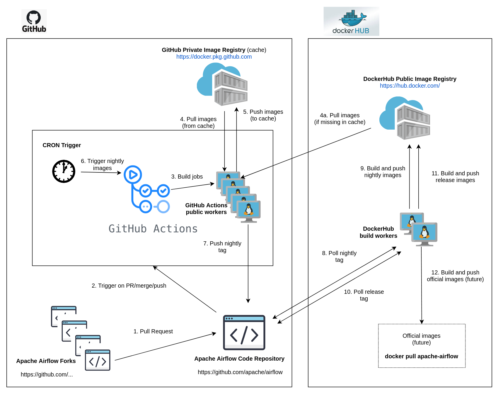

 .. Licensed to the Apache Software Foundation (ASF) under one
    or more contributor license agreements.  See the NOTICE file
    distributed with this work for additional information
    regarding copyright ownership.  The ASF licenses this file
    to you under the Apache License, Version 2.0 (the
    "License"); you may not use this file except in compliance
    with the License.  You may obtain a copy of the License at

 ..   http://www.apache.org/licenses/LICENSE-2.0

 .. Unless required by applicable law or agreed to in writing,
    software distributed under the License is distributed on an
    "AS IS" BASIS, WITHOUT WARRANTIES OR CONDITIONS OF ANY
    KIND, either express or implied.  See the License for the
    specific language governing permissions and limitations
    under the License.

.. contents:: :local:

CI Environment
==============

Continuous Integration is important component of making Apache Airflow robust and stable. We are running
a lot of tests for every pull request, for master and v1-10-test branches and regularly as CRON jobs.

Our execution environment for CI is `GitHub Actions <https://github.com/features/actions>`_. GitHub Actions
(GA) are very well integrated with GitHub code and Workflow and it has evolved fast in 2019/202 to become
a fully-fledged CI environment, easy to use and develop for, so we decided to switch to it. Our previous
CI system is Travis CI.

However part of the philosophy we have is that we are not tightly coupled with any of the CI
environments we use. Most of our CI jobs are written as bash scripts which are executed as steps in
the CI jobs and we are mapping all the CI-specific environment variables to generic "CI" variables.
The only two places where CI-specific code might be are:

- CI-specific declaration file (for example it is `<.github/workflows/ci.yml>`_ for GitHub Actions
- The ``get_environment_for_builds_on_ci`` function in `<scripts/ci/libraries/_build_images.sh>`_ where mapping is
  performed from the CI-environment specific to generic values. Example for that is CI_EVENT_TYPE variable
  which determines whether we are running a ``push``. ``schedule`` or ``pull_request`` kind of CI job. For
  GitHub Action those are values mapped from ``GITHUB_EVENT_NAME`` variable, for Travis several other
  variables were used to determine it (``TRAVIS_PULL_REQUEST``, ``TRAVIS_EVENT_TYPE``).

CI Architecture
===============

The following components are part of the CI infrastructure

* **Apache Airflow Code Repository** - our code repository at https://github.com/apache/airflow
* **Apache Airflow Forks** - forks of the Apache Airflow Code Repository from which contributors make
  Pull Requests
* **GitHub Actions** -  (GA) UI + execution engine for our jobs
* **GA CRON trigger** - GitHub Actions CRON triggering our jobs
* **GA Workers** - virtual machines running our jobs at GitHub Actions (max 20 in parallel)
* **GitHub Private Image Registry**- image registry used as build cache for CI  jobs.
  It is at https://docker.pkg.github.com/apache/airflow/airflow
* **DockerHub Public Image Registry** - publicly available image registry at DockerHub.
  It is at https://hub.docker.com/repository/docker/apache/airflow
* **DockerHub Build Workers** - virtual machines running build jibs at DockerHub
* **Official Images** (future) - these are official images that are prominently visible in DockerHub.
  We aim our images to become official images so that you will be able to pull them
  with ``docker pull apache-airflow``

CI run types
============

The following CI Job runs are currently run for Apache Airflow, and each of the runs have different
purpose and context.

Pull request run
----------------

Those runs are results of PR from the forks made by contributors. Most builds for Apache Airflow fall
into this category. They are executed in the context of the "Fork", not main
Airflow Code Repository which means that they have only "read" permission to all the GitHub resources
(container registry, code repository). This is necessary as the code in those PRs (including CI job
definition) might be modified by people who are not committers for the Apache Airflow Code Repository.

The main purpose of those jobs is to check if PR builds cleanly, if the test run properly and if
the PR is ready to review and merge. The runs are using cached images from the Private GitHub registry -
CI, Production Images as well as base Python images that are also cached in the Private GitHub registry.
Also for those builds we only execute Python tests if important files changed (so for example if it is
doc-only change, no tests will be executed.

Direct Push/Merge Run
---------------------

Those runs are results of direct pushes done by the committers or as result of merge of a Pull Request
by the committers. Those runs execute in the context of the Apache Airflow Code Repository and have also
write permission for GitHub resources (container registry, code repository).
The main purpose for the run is to check if the code after merge still holds all the assertions - like
whether it still builds, all tests are green.

This is needed because some of the conflicting changes from multiple PRs might cause build and test failures
after merge even if they do not fail in isolation. Also those runs are already reviewed and confirmed by the
committers so they can be used to do some housekeeping:
- pushing most recent image build in the PR to the Github Private Registry (for caching)
- upgrading to latest constraints and pushing those constraints if all tests succeed
- refresh latest Python base images in case new patch-level is released

The housekeeping is important - Python base images are refreshed with varying frequency (once every few months
usually but sometimes several times per week) with the latest security and bug fixes.
Those patch level images releases can occasionally break Airflow builds (specifically Docker image builds
based on those images) therefore in PRs we only use latest "good" python image that we store in the
private GitHub cache. The direct push/master builds are not using registry cache to pull the python images
- they are directly pulling the images from DockerHub, therefore they will try the latest images
after they are released and in case they are fine, CI Docker image is build and tests are passing -
those jobs will push the base images to the private GitHub Registry so that they be used by subsequent
PR runs.

Scheduled runs
--------------

Those runs are results of (nightly) triggered job - only for ``master`` branch. The
main purpose of the job is to check if there was no impact of external dependency changes on the Apache
Airflow code (for example transitive dependencies released that fail the build). It also checks if the
Docker images can be build from the scratch (again - to see if some dependencies have not changed - for
example downloaded package releases etc. Another reason for the nightly build is that the builds tags most
recent master with ``nightly-master`` tag so that DockerHub build can pick up the moved tag and prepare a
nightly public master build in the DockerHub registry. The ``v1-10-test`` branch images are build in
DockerHub when pushing ``v1-10-stable`` manually.

All runs consist of the same jobs, but the jobs behave slightly differently or they are skipped in different
run categories. Here is a summary of the run categories with regards of the jobs they are running.
Those jobs often have matrix run strategy which runs several different variations of the jobs
(with different Backend type / Python version, type of the tests to run for example)

+---------------------------+----------------------------------------------------------------------------------------------------------------+------------------------------------+---------------------------------+----------------------------------------------------------------------+
| Job                       | Description                                                                                                    | Pull Request Run                   | Direct Push/Merge Run           | Scheduled Run                                                        |
|                           |                                                                                                                |                                    |                                 |   (*) Builds all images from scratch                                 |
+===========================+================================================================================================================+====================================+=================================+======================================================================+
| Cancel previous workflow  | Cancels the previously running workflow run if there is one running                                            | Yes                                | Yes                             | Yes *                                                                |
+---------------------------+----------------------------------------------------------------------------------------------------------------+------------------------------------+---------------------------------+----------------------------------------------------------------------+
| Static checks             | Performs static checks                                                                                         | Yes                                | Yes                             | Yes *                                                                |
+---------------------------+----------------------------------------------------------------------------------------------------------------+------------------------------------+---------------------------------+----------------------------------------------------------------------+
| Docs                      | Builds documentation                                                                                           | Yes                                | Yes                             | Yes *                                                                |
+---------------------------+----------------------------------------------------------------------------------------------------------------+------------------------------------+---------------------------------+----------------------------------------------------------------------+
| Prepare Backport packages | Prepares Backport Packages for 1.10.*                                                                          | Yes                                | Yes                             | Yes *                                                                |
+---------------------------+----------------------------------------------------------------------------------------------------------------+------------------------------------+---------------------------------+----------------------------------------------------------------------+
| Trigger tests             | Checks if tests should be triggered                                                                            | Yes                                | Yes                             | Yes *                                                                |
+---------------------------+----------------------------------------------------------------------------------------------------------------+------------------------------------+---------------------------------+----------------------------------------------------------------------+
| Build Prod Image          | Builds production image                                                                                        | Yes                                | Yes                             | Yes *                                                                |
+---------------------------+----------------------------------------------------------------------------------------------------------------+------------------------------------+---------------------------------+----------------------------------------------------------------------+
| Tests                     | Run all the combinations of Pytest tests for Python code                                                       | Yes (if tests-triggered)           | Yes                             | Yes *                                                                |
+---------------------------+----------------------------------------------------------------------------------------------------------------+------------------------------------+---------------------------------+----------------------------------------------------------------------+
| Tests Kubernetes          | Run Kubernetes test                                                                                            | Yes (if tests-triggered)           | Yes                             | Yes *                                                                |
+---------------------------+----------------------------------------------------------------------------------------------------------------+------------------------------------+---------------------------------+----------------------------------------------------------------------+
| Quarantined tests         | Those are tests that are flaky and we need to fix them                                                         | Yes (if tests-triggered)           | Yes                             | Yes *                                                                |
+---------------------------+----------------------------------------------------------------------------------------------------------------+------------------------------------+---------------------------------+----------------------------------------------------------------------+
| Test OpenAPI client gen   | Tests if OpenAPIClient continues to generate                                                                   | Yes                                | Yes                             | Yes *                                                                |
+---------------------------+----------------------------------------------------------------------------------------------------------------+------------------------------------+---------------------------------+----------------------------------------------------------------------+
| Helm tests                | Runs tests for the Helm chart                                                                                  | Yes                                | Yes                             | Yes *                                                                |
+---------------------------+----------------------------------------------------------------------------------------------------------------+------------------------------------+---------------------------------+----------------------------------------------------------------------+
| Constraints               | Upgrade constraints to latest eagerly pushed ones (only if tests successful)                                   | -                                  | Yes                             | Yes *                                                                |
+---------------------------+----------------------------------------------------------------------------------------------------------------+------------------------------------+---------------------------------+----------------------------------------------------------------------+
| Constraints push          | Pushes updated constraints (only if tests successful)                                                          | -                                  | Yes                             | Yes *                                                                |
+---------------------------+----------------------------------------------------------------------------------------------------------------+------------------------------------+---------------------------------+----------------------------------------------------------------------+
| Push Prod images          | Pushes production images to GitHub Private Image Registry to cache the build images for following runs         | -                                  | Yes                             | -                                                                    |
+---------------------------+----------------------------------------------------------------------------------------------------------------+------------------------------------+---------------------------------+----------------------------------------------------------------------+
| Push CI images            | Pushes CI images to GitHub Private Image Registry to cache the build images for following runs                 | -                                  | Yes                             | -                                                                    |
+---------------------------+----------------------------------------------------------------------------------------------------------------+------------------------------------+---------------------------------+----------------------------------------------------------------------+
| Tag Repo nightly          | Tags the repository with nightly tagIt is a lightweight tag that moves nightly                                 | -                                  | -                               | Yes. Triggers DockerHub build for public registry                    |
+---------------------------+----------------------------------------------------------------------------------------------------------------+------------------------------------+---------------------------------+----------------------------------------------------------------------+
