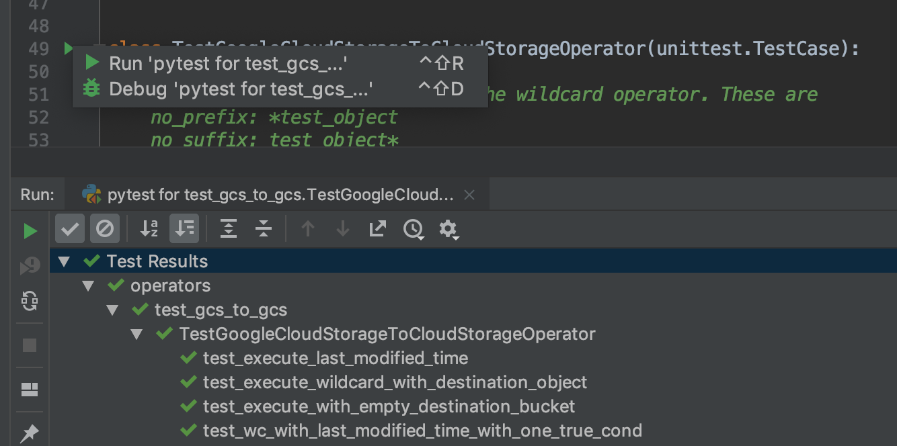

<!--
Licensed to the Apache Software Foundation (ASF) under one
or more contributor license agreements.  See the NOTICE file
distributed with this work for additional information
regarding copyright ownership.  The ASF licenses this file
to you under the Apache License, Version 2.0 (the
"License"); you may not use this file except in compliance
with the License.  You may obtain a copy of the License at

  http://www.apache.org/licenses/LICENSE-2.0

Unless required by applicable law or agreed to in writing,
software distributed under the License is distributed on an
"AS IS" BASIS, WITHOUT WARRANTIES OR CONDITIONS OF ANY
KIND, either express or implied.  See the License for the
specific language governing permissions and limitations
under the License.
-->

# Contributing

Contributions are welcome and are greatly appreciated! Every
little bit helps, and credit will always be given.

<!-- START doctoc generated TOC please keep comment here to allow auto update -->
<!-- DON'T EDIT THIS SECTION, INSTEAD RE-RUN doctoc TO UPDATE -->
**Table of Contents**  *generated with [DocToc](https://github.com/thlorenz/doctoc)*

- [Types of Contributions](#types-of-contributions)
  - [Report Bugs](#report-bugs)
  - [Fix Bugs](#fix-bugs)
  - [Implement Features](#implement-features)
  - [Improve Documentation](#improve-documentation)
  - [Submit Feedback](#submit-feedback)
- [Documentation](#documentation)
- [Local virtualenv development environment](#local-virtualenv-development-environment)
  - [Installation](#installation)
  - [Running individual tests](#running-individual-tests)
  - [Running tests directly from the IDE](#running-tests-directly-from-the-ide)
- [Integration test development environment](#integration-test-development-environment)
  - [Prerequisites](#prerequisites)
  - [Using the Docker Compose environment](#using-the-docker-compose-environment)
    - [Entering bash shell in Docker Compose environment](#entering-bash-shell-in-docker-compose-environment)
    - [Running individual tests within the container](#running-individual-tests-within-the-container)
    - [Running static code analysis](#running-static-code-analysis)
      - [Running static code analysis from the host](#running-static-code-analysis-from-the-host)
      - [Running static code analysis in the docker compose environment](#running-static-code-analysis-in-the-docker-compose-environment)
      - [Running static code analysis on selected files/modules](#running-static-code-analysis-on-selected-filesmodules)
  - [Automation of image building](#automation-of-image-building)
  - [Local Docker Compose scripts](#local-docker-compose-scripts)
    - [Running the whole suite of tests](#running-the-whole-suite-of-tests)
    - [Stopping the environment](#stopping-the-environment)
    - [Fixing file/directory ownership](#fixing-filedirectory-ownership)
    - [Building the images](#building-the-images)
    - [Force pulling the images](#force-pulling-the-images)
  - [Cleaning up cached Docker images/containers](#cleaning-up-cached-docker-imagescontainers)
  - [Troubleshooting](#troubleshooting)
- [Pylint checks](#pylint-checks)
- [Git hooks](#git-hooks)
- [Pull Request Guidelines](#pull-request-guidelines)
- [Testing on Travis CI](#testing-on-travis-ci)
  - [Travis CI GitHub App (new version)](#travis-ci-github-app-new-version)
  - [Travis CI GitHub Services (legacy version)](#travis-ci-github-services-legacy-version)
  - [Prefer travis-ci.com over travis-ci.org](#prefer-travis-cicom-over-travis-ciorg)
- [Changing the Metadata Database](#changing-the-metadata-database)
- [Setting up the node / npm javascript environment](#setting-up-the-node--npm-javascript-environment)
  - [Node/npm versions](#nodenpm-versions)
  - [Using npm to generate bundled files](#using-npm-to-generate-bundled-files)
    - [npm](#npm)
    - [npm packages](#npm-packages)
    - [Upgrading npm packages](#upgrading-npm-packages)
    - [Javascript Style Guide](#javascript-style-guide)

<!-- END doctoc generated TOC please keep comment here to allow auto update -->

# Types of Contributions

## Report Bugs

Report bugs through [Apache Jira](https://issues.apache.org/jira/browse/AIRFLOW)

Please report relevant information and preferably code that exhibits
the problem.

## Fix Bugs

Look through the Jira issues for bugs. Anything is open to whoever wants
to implement it.

## Implement Features

Look through the [Apache Jira](https://issues.apache.org/jira/browse/AIRFLOW) for features.
Any unassigned "Improvement" issue is open to whoever wants to implement it.

We've created the operators, hooks, macros and executors we needed, but we
made sure that this part of Airflow is extensible. New operators,
hooks, macros and executors are very welcomed!

## Improve Documentation

Airflow could always use better documentation,
whether as part of the official Airflow docs,
in docstrings, `docs/*.rst` or even on the web as blog posts or
articles.

## Submit Feedback

The best way to send feedback is to open an issue on
[Apache Jira](https://issues.apache.org/jira/browse/AIRFLOW)

If you are proposing a feature:

- Explain in detail how it would work.
- Keep the scope as narrow as possible, to make it easier to implement.
- Remember that this is a volunteer-driven project, and that contributions are welcome :)

# Documentation

The latest API documentation is usually available
[here](https://airflow.apache.org/). To generate a local version,
you need to have set up an Airflow development environment (see below). Also
install the `doc` extra.

```
pip install -e '.[doc]'
```

Generate and serve the documentation by running:

```
cd docs
./build.sh
./start_doc_server.sh
```

#  Local virtualenv development environment

When you develop Airflow you can create local virtualenv with all requirements required by Airflow.

Advantage of local installation is that everything works locally, you do not have to enter Docker/container
environment and you can easily debug the code locally. You can also have access to python virtualenv that
contains all the necessary requirements and use it in your local IDE - this aids autocompletion, and
running tests directly from within the IDE.

The disadvantage is that you have to maintain your dependencies and local environment consistent with
other development environments that you have on your local machine.

Another disadvantage is that you you cannot run tests that require
external components - mysql, postgres database, hadoop, mongo, cassandra, redis etc..
The tests in Airflow are a mixture of unit and integration tests and some of them
require those components to be setup. Only real unit tests can be run bu default in local environment.

If you want to run integration tests, you need to configure and install the dependencies on your own.

It's also very difficult to make sure that your local environment is consistent with other environments.
This can often lead to "works for me" syndrome. It's better to use the Docker Compose integration test
environment in case you want reproducible environment consistent with other people.

## Installation

Install Python (3.5 or 3.6), MySQL, and libxml by using system-level package
managers like yum, apt-get for Linux, or Homebrew for Mac OS at first.
Refer to the [Dockerfile](Dockerfile) for a comprehensive list of required packages.

In order to use your IDE you need you can use the virtual environment. Ideally
you should setup virtualenv for all python versions that Airflow supports (2.7, 3.5, 3.6).
An easy way to create the virtualenv is to use
[virtualenvwrapper](https://virtualenvwrapper.readthedocs.io/en/latest/) - it allows
you to easily switch between virtualenvs using `workon` command and mange
your virtual environments more easily. Typically creating the environment can be done by:

```
mkvirtualenv <ENV_NAME> --python=python<VERSION>
```

Then you need to install python PIP requirements. Typically it can be done with:
`pip install -e ".[devel]"`. Then you need to run `airflow db init` to create sqlite database.

Once initialization is done, you should select the virtualenv you initialized as the
project's default virtualenv in your IDE and run tests efficiently.

After setting it up - you can use the usual "Run Test" option of the IDE and have
the autocomplete and documentation support from IDE as well as you can
debug and view the sources of Airflow - which is very helpful during
development.

## Running individual tests

Once you activate virtualenv (or enter docker container) as described below you should be able to run
`run-tests` at will (it is in the path in Docker environment but you need to prepend it with `./` in local
virtualenv (`./run-tests`). 

Note that this script has several flags that can be useful for your testing.

```text
Usage: run-tests [FLAGS] [TESTS_TO_RUN] -- <EXTRA_NOSETEST_ARGS>

Runs tests specified (or all tests if no tests are specified)

Flags:

-h, --help
        Shows this help message.

-i, --with-db-init
        Forces database initialization before tests

-s, --nocapture
        Don't capture stdout when running the tests. This is useful if you are
        debugging with ipdb and want to drop into console with it
        by adding this line to source code:

            import ipdb; ipdb.set_trace()

-v, --verbose
        Verbose output showing coloured output of tests being run and summary
        of the tests - in a manner similar to the tests run in the CI environment.
```

You can pass extra parameters to nose, by adding nose arguments after `--`

For example, in order to just execute the "core" unit tests and add ipdb set_trace method, you can 
run the following command:

```bash
./run-tests tests.core:CoreTest --nocapture --verbose
```

or a single test method without colors or debug logs:

```bash
./run-tests tests.core:CoreTest.test_check_operators
```
Note that `./run_tests` script runs tests but the first time it runs, it performs database initialisation.
If you run further tests without leaving the environment, the database will not be initialized, but you 
can always force database initialization with `--with-db-init` (`-i`) switch. The scripts will
inform you what you can do when they are run.

## Running tests directly from the IDE

Once you configure your tests to use the virtualenv you created. running tests
from IDE is as simple as:



Note that while most of the tests are typical "unit" tests that do not
require external components, there are a number of tests that are more of
"integration" or even "system" tests (depending on the convention you use).
Those tests interact with external components. For those tests
you need to run complete Docker Compose - base environment below.

# Integration test development environment

This is the environment that is used during CI builds on Travis CI. We have scripts to reproduce the
Travis environment and you can enter the environment and run it locally.

The scripts used by Travis CI run also image builds which make the images contain all the sources. You can
see which scripts are used in [.travis.yml](.travis.yml) file.

## Prerequisites

**Docker**

You need to have [Docker CE](https://docs.docker.com/get-started/) installed.

IMPORTANT!!! : Mac OS Docker default Disk size settings

When you develop on Mac OS you usually have not enough disk space for Docker if you start using it seriously.
You should increase disk space available before starting to work with the environment. Usually you have weird
stops of docker containers when you run out of Disk space. It might not be obvious that space is an issue.
If you get into weird behaviour try [Cleaning Up Docker](#cleaning-up-cached-docker-imagescontainers)

See [Docker for Mac - Space](https://docs.docker.com/docker-for-mac/space/) for details of increasing
disk space available for Docker on Mac.

At least 128 GB of Disk space is recommended. You can also get by with smaller space but you should more often
clean the docker disk space periodically.

**Getopt and coreutils**

If you are on MacOS:

* Run `brew install gnu-getopt coreutils` (if you use brew, or use equivalent command for ports)
* Then (with brew) link the gnu-getopt to become default as suggested by brew by typing.
```bash
echo 'export PATH=\"/usr/local/opt/gnu-getopt/bin:\$PATH\"' >> ~/.bash_profile"
. ~/.bash_profile"
```
* Login and logout afterwards

If you are on Linux:

* Run `apt install util-linux coreutils` or equivalent if your system is not Debian-based.

## Using the Docker Compose environment

### Entering bash shell in Docker Compose environment

Default environment settings (python 3.6, sqlite backend, docker environment)
```bash
 ./scripts/ci/local_ci_enter_environment.sh
```

Overriding default environment settings:

```bash
PYTHON_VERSION=3.5 BACKEND=postgres ENV=docker ./scripts/ci/local_ci_enter_environment.sh
```

### Running individual tests within the container

Once you are inside the environment you can run individual tests as described in
[Running individual tests](#running-individual-tests).

### Running static code analysis

We have a number of static code checks that are run in Travis CI but you can run them locally as well.
All the scripts are available in [scripts/ci](scripts/ci) folder.

All these tests run in python3.6 environment. Note that the first time you run the checks it might take some
time to rebuild the docker images required to run the tests, but all subsequent runs will be much faster -
the build phase will just check if your code has changed and rebuild as needed.

The checks below are run in a docker environment, which means that if you run them locally,
they should give the same results as the tests run in TravisCI without special environment preparation.

#### Running static code analysis from the host

You can trigger the static checks from the host environment, without entering Docker container. You
do that by running appropriate scripts (The same is done in TravisCI)

* [ci_docs.sh](scripts/ci/ci_docs.sh) - checks that documentation can be built without warnings.
* [ci_flake8.sh](scripts/ci/ci_flake8.sh) - runs flake8 source code style guide enforcement tool
* [ci_mypy.sh](scripts/ci/ci_mypy.sh) - runs mypy type annotation consistency check
* [ci_pylint.sh](scripts/ci/ci_pylint.sh) - runs pylint static code checker
* [ci_lint_dockerfile.sh](scripts/ci/ci_lint_dockerfile.sh) - runs lint checker for the Dockerfile
* [ci_check_license.sh](scripts/ci/ci_check_license.sh) - checks if all licences are present in the sources

Those scripts are optimised for time of rebuilds of docker image. The image will be automatically
rebuilt when needed (for example when dependencies change). 

You can also force rebuilding of the image by deleting [.build](./build) 
directory which keeps cached information about the images built.

Documentation after it is built, is available in [docs/_build/html](docs/_build/html) folder.
This folder is mounted from the host so you can access those files in your host as well.

#### Running static code analysis in the docker compose environment

If you are already in the [Docker Compose Environment](#entering-bash-shell-in-docker-compose-environment)
you can also run the same static checks from within container:

* Mypy: `./scripts/ci/in_container/run_mypy.sh airflow tests`
* Pylint: `./scripts/ci/in_container/run_pylint.sh`
* Flake8: `./scripts/ci/in_container/run_flake8.sh`
* Licence check: `./scripts/ci/in_container/run_check_licence.sh`
* Documentation: `./scripts/ci/in_container/run_docs_build.sh`

#### Running static code analysis on selected files/modules

In all static check scripts - both in container and in the host you can also pass module/file path as 
parameters of the scripts to only check selected modules or files. For example:

In container:

`./scripts/ci/in_container/run_pylint.sh ./airflow/example_dags/`

or

`./scripts/ci/in_container/run_pylint.sh ./airflow/example_dags/test_utils.py`

In host:

`./scripts/ci/ci_pylint.sh ./airflow/example_dags/`

or

`./scripts/ci/ci_pylint.sh ./airflow/example_dags/test_utils.py`

And similarly for other scripts.

## Automation of image building

When you run tests or enter environment (see below) the first time you do it, the local image will be
pulled and build for you automatically.

Note that building image first time pulls the pre-built version of image from Dockerhub based on master 
sources and rebuilds the layers that need to be rebuilt - because they changed in local sources. 
This might take a bit of time when you run it for the first time and when you add new dependencies - 
but rebuilding the image should be an operation done quite rarely (mostly when you start seeing some
unknown problems and want to refresh the environment). 

See [Troubleshooting section](#troubleshooting) for steps you can make to clean the environment.
 
Once you performed the first build, the images are rebuilt locally rather than pulled - unless you 
force pull the images. But you can force it using the scripts described below.

## Local Docker Compose scripts

For your convenience, there are scripts that can be used in local development
- where local host sources are mounted to within the docker container.
Those "local" scripts starts with "local_" prefix in [scripts/ci](scripts/ci) folder and
they run Docker-Compose environment with relevant backends (mysql/postgres)
and additional services started.

### Running the whole suite of tests

Running all tests with default settings (python 3.6, sqlite backend, docker environment):

```bash
./scripts/ci/local_ci_run_airflow_testing.sh
```

Selecting python version, backend, docker environment:

```bash
PYTHON_VERSION=3.5 BACKEND=postgres ENV=docker ./scripts/ci/local_ci_run_airflow_testing.sh
```

Running kubernetes tests:
```bash
KUBERNETES_VERSION==v1.13.0 BACKEND=postgres ENV=kubernetes ./scripts/ci/local_ci_run_airflow_testing.sh
```

* PYTHON_VERSION might be one of 3.5/3.6
* BACKEND might be one of postgres/sqlite/mysql
* ENV might be one of docker/kubernetes
* KUBERNETES_VERSION - required for Kubernetes tests - currently KUBERNETES_VERSION=v1.13.0.

The kubernetes env might not work locally as easily as other tests because it requires your host
to be setup properly (specifically it installs minikube cluster locally on your host and depending 
on your machine setting it might or might not work out of the box.
We are working on making the kubernetes tests more easily reproducible locally in the future.

### Stopping the environment

Docker-compose environment starts a number of docker containers and keep them running.
You can tear them down by running 
[/scripts/ci/local_ci_stop_environment.sh](scripts/ci/local_ci_stop_environment.sh)


### Fixing file/directory ownership

On Linux there is a problem with propagating ownership of created files (known Docker problem). Basically
files and directories created in container are not owned by the host user (but by the root user in our case). 
This might prevent you from switching branches for example if files owned by root user are created within 
your sources. In case you are on Linux host and haa some files in your sources created by the root user, 
you can fix the ownership of those files by running 
[scripts/ci/local_ci_fix_ownership.sh](scripts/ci/local_ci_fix_ownership.sh) script.

### Building the images

You can manually trigger building of the local CI image using
[scripts/ci/local_ci_build.sh](scripts/ci/local_ci_build.sh). 

### Force pulling the images

You can later force-pull the images before building it locally so that you are sure that you download
latest images from DockerHub repository before building. This can be done with
[scripts/ci/local_ci_pull_and_build.sh](scripts/ci/local_ci_pull_and_build.sh) script.

## Cleaning up cached Docker images/containers

Note that you might need to cleanup your Docker environment occasionally. The images are quite big
(1.5GB for both images needed for static code analysis and CI tests). And if you often rebuild/update
images you might end up with some unused image data. 

Cleanup can be performed with `docker system prune` command. In case you have huge problems with disk space
and want to clean-up all image data you can run `docker system prune --all`. You might need to 
[Stop the environment](#stopping-the-environment) in order to clean everything including running containers.

If you are on Mac OS and you end up with not enough disk space for Docker you should increase disk space
available for Docker. See [Docker for Mac - Space](https://docs.docker.com/docker-for-mac/space/) for details.

## Troubleshooting

In case you have problems with the Docker Compose environment - try the following:

1. [Stop the environment](#stopping-the-environment)
2. Delete [.build](.build)
3. [Force pull the images](#force-pulling-the-images)
4. Re-run the scripts
5. [Clean Up Docker engine](#cleaning-up-cached-docker-imagescontainers)
6. [Fix file/directory ownership](#fixing-filedirectory-ownership)
7. Run `docker system prune --all` to cleanup all images/containers
8. Restart your docker and try again
9. Restart your machine and try again
10. Run `docker system prune --all` after restart (if you had previously errors when running it)
1. Remove and re-install Docker CE, then [force pull the images](#force-pulling-the-images)

In case the problems are not solved, you can set VERBOSE variable to "true" (`export VERBOSE="true"`)
and rerun failing command, and copy & paste the output from your terminal, describe the problem and 
post it in [Airflow Slack](https://apache-airflow-slack.herokuapp.com/) #troubleshooting channel.

# Pylint checks

Note that for pylint we are in the process of fixing pylint code checks for the whole Airflow code. This is
a huge task so we implemented an incremental approach for the process. Currently most of the code is
excluded from pylint checks via [pylint_todo.txt](scripts/ci/pylint_todo.txt). We have an open JIRA
issue [AIRFLOW-4364](https://issues.apache.org/jira/browse/AIRFLOW-4364) which has a number of
sub-tasks for each of the modules that should be made compatible. Fixing pylint problems is one of
straightforward and easy tasks to do (but time-consuming) so if you are a first-time contributor to
Airflow you can choose one of the sub-tasks as your first issue to fix. The process to fix the issue looks
as follows:

1) Remove module/modules from the [pylint_todo.txt](scripts/ci/pylint_todo.txt)
2) Run [ci_pylint.sh](scripts/ci/ci_pylint.sh)
3) Fix all the issues reported by pylint
4) Re-run [ci_pylint.sh](scripts/ci/ci_pylint.sh)
5) If you see "success" - submit PR following [Pull Request guidelines](#pull-request-guidelines)

There are following guidelines when fixing pylint errors:

* Ideally fix the errors rather than disable pylint checks - often you can easily refactor the code
  (IntelliJ/PyCharm might be helpful when extracting methods in complex code or moving methods around)
* When disabling particular problem - make sure to disable only that error-via the symbolic name
  of the error as reported by pylint
* If there is a single line where to disable particular error you can add comment following the line
  that causes the problem. For example:
```python
def MakeSummary(pcoll, metric_fn, metric_keys):  # pylint: disable=invalid-name
```
* When there are multiple lines/block of code to disable an error you can surround the block with
  comment only pylint:disable/pylint:enable lines. For example:

```python
# pylint: disable=too-few-public-methods
class LoginForm(Form):
    """Form for the user"""
    username = StringField('Username', [InputRequired()])
    password = PasswordField('Password', [InputRequired()])
# pylint: enable=too-few-public-methods
```

# Git hooks

Another great way of automating linting and testing is to use
 [Git Hooks](https://git-scm.com/book/uz/v2/Customizing-Git-Git-Hooks). For example you could create a
`pre-commit` file based on the Travis CI Pipeline so that before each commit a local pipeline will be
triggered and if this pipeline fails (returns an exit code other than `0`) the commit does not come through.
This "in theory" has the advantage that you can not commit any code that fails that again reduces the
errors in the Travis CI Pipelines.

Since there are a lot of tests the script would last very long so you probably only should test your
 new
feature locally.

The following example of a `pre-commit` file allows you..
- to lint your code via flake8
- to test your code via nosetests in a docker container based on python 2
- to test your code via nosetests in a docker container based on python 3

```
#!/bin/sh

GREEN='\033[0;32m'
NO_COLOR='\033[0m'

setup_python_env() {
    local venv_path=${1}

    echo -e "${GREEN}Activating python virtual environment ${venv_path}..${NO_COLOR}"
    source ${venv_path}
}
run_linting() {
    local project_dir=$(git rev-parse --show-toplevel)

    echo -e "${GREEN}Running flake8 over directory ${project_dir}..${NO_COLOR}"
    flake8 ${project_dir}
}
run_testing_in_docker() {
    local feature_path=${1}
    local airflow_py2_container=${2}
    local airflow_py3_container=${3}

    echo -e "${GREEN}Running tests in ${feature_path} in airflow python 2 docker container..${NO_COLOR}"
    docker exec -i -w /airflow/ ${airflow_py2_container} nosetests -v ${feature_path}
    echo -e "${GREEN}Running tests in ${feature_path} in airflow python 3 docker container..${NO_COLOR}"
    docker exec -i -w /airflow/ ${airflow_py3_container} nosetests -v ${feature_path}
}

set -e
# NOTE: Before running this make sure you have set the function arguments correctly.
setup_python_env /Users/feluelle/venv/bin/activate
run_linting
run_testing_in_docker tests/contrib/hooks/test_imap_hook.py dazzling_chatterjee quirky_stallman

```

For more information on how to run a subset of the tests, take a look at the
nosetests docs.

See also the list of test classes and methods in `tests/core.py`.

Feel free to customize based on the extras available in [setup.py](./setup.py)

# Pull Request Guidelines

Before you submit a pull request from your forked repo, check that it
meets these guidelines:

1. The pull request should include tests, either as doctests, unit tests, or both. The airflow repo uses
[Travis CI](https://travis-ci.org/apache/airflow) to run the tests and
[codecov](https://codecov.io/gh/apache/airflow) to track coverage.
You can set up both for free on your fork (see "Testing on Travis CI" section below).
It will help you make sure you do not break the build with your PR and that you help increase coverage.
1. Please [rebase your fork](http://stackoverflow.com/a/7244456/1110993), squash commits, and
resolve all conflicts.
1. Every pull request should have an associated
[JIRA](https://issues.apache.org/jira/browse/AIRFLOW/?selectedTab=com.atlassian.jira.jira-projects-plugin:summary-panel).
The JIRA link should also be contained in the PR description.
1. Preface your commit's subject & PR's title with **[AIRFLOW-XXX]** where *XXX* is the JIRA number.
We compose release notes (i.e. for Airflow releases) from all commit titles in a release.
By placing the JIRA number in the commit title and hence in the release notes, Airflow users can look into
JIRA and GitHub PRs for more details about a particular change.
1. Add an [Apache License](http://www.apache.org/legal/src-headers.html) header to all new files
1. If the pull request adds functionality, the docs should be updated as part of the same PR. Doc string
are often sufficient.  Make sure to follow the Sphinx compatible standards.
1. The pull request should work for Python 3.5 and 3.6.
1. As Airflow grows as a project, we try to enforce a more consistent style and try to follow the Python
community guidelines. We currently enforce most [PEP8](https://www.python.org/dev/peps/pep-0008/) and a
few other linting rules - described in [Running linting and tests](#running-linting-and-tests). It's a good
idea to run tests locally before opening PR.
1. Please read this excellent [article](http://chris.beams.io/posts/git-commit/) on commit messages and
adhere to them. It makes the lives of those who come after you a lot easier.

# Testing on Travis CI

We currently rely heavily on Travis CI for running the full Airflow test suite
as running all of the tests locally requires significant setup.  You can setup
Travis CI in your fork of Airflow by following the
[Travis CI Getting Started guide][travis-ci-getting-started].

There are two different options available for running Travis CI which are
setup as separate components on GitHub:

1. **Travis CI GitHub App** (new version)
1. **Travis CI GitHub Services** (legacy version)

## Travis CI GitHub App (new version)

1. Once installed, you can configure the Travis CI GitHub App at
https://github.com/settings/installations -> Configure Travis CI.

1. For the Travis CI GitHub App, you can set repository access to either "All
repositories" for convenience, or "Only select repositories" and choose
`<username>/airflow` in the dropdown.

1. You can access Travis CI for your fork at
`https://travis-ci.com/<username>/airflow`.

## Travis CI GitHub Services (legacy version)

The Travis CI GitHub Services versions uses an Authorized OAuth App.  Note
that `apache/airflow` is currently still using the legacy version.

1. Once installed, you can configure the Travis CI Authorized OAuth App at
https://github.com/settings/connections/applications/88c5b97de2dbfc50f3ac.

1. If you are a GitHub admin, click the "Grant" button next to your
organization; otherwise, click the "Request" button.

1. For the Travis CI Authorized OAuth App, you may have to grant access to the
forked `<organization>/airflow` repo even though it is public.

1. You can access Travis CI for your fork at
`https://travis-ci.org/<organization>/airflow`.

## Prefer travis-ci.com over travis-ci.org

The travis-ci.org site for open source projects is now legacy and new projects
should instead be created on travis-ci.com for both private repos and open
source.

Note that there is a second Authorized OAuth App available called "Travis CI
for Open Source" used for the
[legacy travis-ci.org service][travis-ci-org-vs-com].  It should not be used
for new projects.

More information:

- [Open Source on travis-ci.com][travis-ci-open-source]
- [Legacy GitHub Services to GitHub Apps Migration Guide][travis-ci-migrating]
- [Migrating Multiple Repositories to GitHub Apps Guide][travis-ci-migrating-2]

[travis-ci-getting-started]: https://docs.travis-ci.com/user/getting-started/
[travis-ci-migrating-2]: https://docs.travis-ci.com/user/travis-migrate-to-apps-gem-guide/
[travis-ci-migrating]: https://docs.travis-ci.com/user/legacy-services-to-github-apps-migration-guide/
[travis-ci-open-source]: https://docs.travis-ci.com/user/open-source-on-travis-ci-com/
[travis-ci-org-vs-com]: https://devops.stackexchange.com/a/4305/8830

# Changing the Metadata Database

When developing features the need may arise to persist information to the the
metadata database. Airflow has [Alembic](https://bitbucket.org/zzzeek/alembic)
built-in to handle all schema changes. Alembic must be installed on your
development machine before continuing.

```
# starting at the root of the project
$ pwd
~/airflow
# change to the airflow directory
$ cd airflow
$ alembic revision -m "add new field to db"
  Generating
~/airflow/airflow/migrations/versions/12341123_add_new_field_to_db.py
```

# Setting up the node / npm javascript environment

`airflow/www/` contains all npm-managed, front end assets.
Flask-Appbuilder itself comes bundled with jQuery and bootstrap.
While these may be phased out over time, these packages are currently not
managed with npm.

## Node/npm versions

Make sure you are using recent versions of node and npm. No problems have been found with node>=8.11.3 and
npm>=6.1.3

## Using npm to generate bundled files

### npm

First, npm must be available in your environment. If you are on Mac and it is not installed,
you can run the following commands (taken from [this source](https://gist.github.com/DanHerbert/9520689)):

```
brew install node --without-npm
echo prefix=~/.npm-packages >> ~/.npmrc
curl -L https://www.npmjs.com/install.sh | sh
```

The final step is to add `~/.npm-packages/bin` to your `PATH` so commands you install globally are usable.
Add something like this to your `.bashrc` file, then `source ~/.bashrc` to reflect the change.

```
export PATH="$HOME/.npm-packages/bin:$PATH"
```

You can also follow
[the general npm installation instructions](https://docs.npmjs.com/downloading-and-installing-node-js-and-npm).

### npm packages

To install third party libraries defined in `package.json`, run the
following within the `airflow/www/` directory which will install them in a
new `node_modules/` folder within `www/`.

```bash
# from the root of the repository, move to where our JS package.json lives
cd airflow/www/
# run npm install to fetch all the dependencies
npm install
```

To parse and generate bundled files for airflow, run either of the
following commands. The `dev` flag will keep the npm script running and
re-run it upon any changes within the assets directory.

```
# Compiles the production / optimized js & css
npm run prod

# Start a web server that manages and updates your assets as you modify them
npm run dev
```

### Upgrading npm packages

Should you add or upgrade an npm package, which involves changing `package.json`, you'll need to re-run `npm install`
and push the newly generated `package-lock.json` file so we get the reproducible build.

### Javascript Style Guide

We try to enforce a more consistent style and try to follow the JS community guidelines.
Once you add or modify any javascript code in the project, please make sure it follows the guidelines
defined in [Airbnb JavaScript Style Guide](https://github.com/airbnb/javascript).
Apache Airflow uses [ESLint](https://eslint.org/) as a tool for identifying and reporting on patterns
in JavaScript, which can be used by running any of the following commands.

```bash
# Check JS code in .js and .html files, and report any errors/warnings
npm run lint

# Check JS code in .js and .html files, report any errors/warnings and fix them if possible
npm run lint:fix
```
