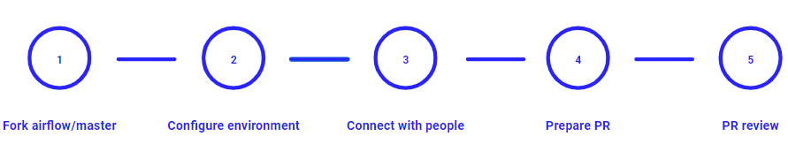
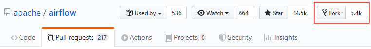
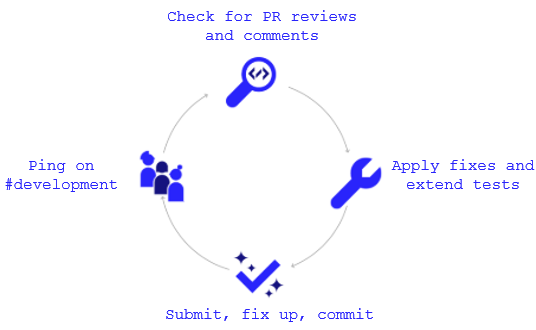

 .. Licensed to the Apache Software Foundation (ASF) under one
    or more contributor license agreements.  See the NOTICE file
    distributed with this work for additional information
    regarding copyright ownership.  The ASF licenses this file
    to you under the Apache License, Version 2.0 (the
    "License"); you may not use this file except in compliance
    with the License.  You may obtain a copy of the License at

 ..   http://www.apache.org/licenses/LICENSE-2.0

 .. Unless required by applicable law or agreed to in writing,
    software distributed under the License is distributed on an
    "AS IS" BASIS, WITHOUT WARRANTIES OR CONDITIONS OF ANY
    KIND, either express or implied.  See the License for the
    specific language governing permissions and limitations
    under the License.

.. contents:: :local:

Contributions
=============

Contributions are welcome and are greatly appreciated! Every little bit helps,
and credit will always be given.

Get Mentoring Support
---------------------

If you are new to the project, you might need some help in understanding how the dynamics
of the community works and you might need to get some mentorship from other members of the
community - mostly committers. Mentoring new members of the community is part of committers
job so do not be afraid of asking committers to help you. You can do it
via comments in your Pull Request, asking on a devlist or via Slack. For your convenience,
we have a dedicated #newbie-questions Slack channel where you can ask any questions
you want - it's a safe space where it is expected that people asking questions do not know
a lot about Airflow (yet!).

If you look for more structured mentoring experience, you can apply to Apache Software Foundation's
`Official Mentoring Programme <http://community.apache.org/mentoringprogramme.html>`_. Feel free
to follow it and apply to the programme and follow up with the community.

Report Bugs
-----------

Report bugs through `GitHub <https://github.com/apache/airflow/issues>`__.

Please report relevant information and preferably code that exhibits the
problem.

Fix Bugs
--------

Look through the GitHub issues for bugs. Anything is open to whoever wants to
implement it.

Implement Features
------------------

Look through the `GitHub issues labeled "kind:feature"
<https://github.com/apache/airflow/labels/kind%3Afeature>`__ for features.

Any unassigned feature request issue is open to whoever wants to implement it.

We've created the operators, hooks, macros and executors we needed, but we've
made sure that this part of Airflow is extensible. New operators, hooks, macros
and executors are very welcomed!

Improve Documentation
---------------------

Airflow could always use better documentation, whether as part of the official
Airflow docs, in docstrings, ``docs/*.rst`` or even on the web as blog posts or
articles.

Submit Feedback
---------------

The best way to send feedback is to `open an issue on GitHub <https://github.com/apache/airflow/issues/new/choose>`__.

If you are proposing a new feature:

-   Explain in detail how it would work.
-   Keep the scope as narrow as possible to make it easier to implement.
-   Remember that this is a volunteer-driven project, and that contributions are
    welcome :)

Documentation
=============

The latest API documentation is usually available
`here <https://airflow.apache.org/docs/>`__.

To generate a local version:

1.  Set up an Airflow development environment.

2.  Install the ``doc`` extra.

.. code-block:: bash

    pip install -e '.[doc]'

3.  Generate and serve the documentation as follows:

.. code-block:: bash

    cd docs
    ./build.sh
    ./start_doc_server.sh

.. note::
    The docs build script ``build.sh`` requires bash 4.0 or greater.
    If you are building on Mac OS, you can install latest version of bash with homebrew.

**Known issues:**

If you are creating a new directory for new integration in the ``airflow.providers`` package,
you should also update the ``docs/autoapi_templates/index.rst`` file.

If you are creating a ``hooks``, ``sensors``, ``operators`` directory in
the ``airflow.providers`` package, you should also update
the ``docs/operators-and-hooks-ref.rst`` file.

If you are creating ``example_dags`` directory, you need to create ``example_dags/__init__.py`` with Apache license or copy another ``__init__.py`` file that contains the necessary license.

Pull Request Guidelines
=======================

Before you submit a pull request (PR) from your forked repo, check that it meets
these guidelines:

-   Include tests, either as doctests, unit tests, or both, to your pull
    request.

    The airflow repo uses `Travis CI <https://travis-ci.org/apache/airflow>`__ to
    run the tests and `codecov <https://codecov.io/gh/apache/airflow>`__ to track
    coverage. You can set up both for free on your fork (see
    `Travis CI Testing Framework <TESTING.rst#travis-ci-testing-framework>`__ usage guidelines).
    It will help you make sure you do not break the build with your PR and
    that you help increase coverage.

-   Follow our project's `Coding style and best practices`_.

    These are things that aren't currently enforced programtically (either because they are too hard or just
    not yet done.)

-   `Rebase your fork <http://stackoverflow.com/a/7244456/1110993>`__, squash
    commits, and resolve all conflicts.

-   When merging PRs, wherever possible try to use **Squash and Merge** instead of **Rebase and Merge**.

-   Add an `Apache License <http://www.apache.org/legal/src-headers.html>`__ header
    to all new files.

    If you have `pre-commit hooks <STATIC_CODE_CHECKS.rst#pre-commit-hooks>`__ enabled, they automatically add
    license headers during commit.

-   If your pull request adds functionality, make sure to update the docs as part
    of the same PR. Doc string is often sufficient. Make sure to follow the
    Sphinx compatible standards.

-   Make sure your code fulfils all the
    `static code checks <STATIC_CODE_CHECKS.rst#pre-commit-hooks>`__ we have in our code. The easiest way
    to make sure of that is to use `pre-commit hooks <STATIC_CODE_CHECKS.rst#pre-commit-hooks>`__

-   Run tests locally before opening PR.

-   Make sure the pull request works for Python 3.6 and 3.7.

-   Adhere to guidelines for commit messages described in this `article <http://chris.beams.io/posts/git-commit/>`__.
    This makes the lives of those who come after you a lot easier.

Airflow Git Branches
====================

All new development in Airflow happens in the ``master`` branch. All PRs should target that branch.
We also have a ``v1-10-test`` branch that is used to test ``1.10.x`` series of Airflow and where committers
cherry-pick selected commits from the master branch.
Cherry-picking is done with the ``-x`` flag.

The ``v1-10-test`` branch might be broken at times during testing. Expect force-pushes there so
committers should coordinate between themselves on who is working on the ``v1-10-test`` branch -
usually these are developers with the release manager permissions.

Once the branch is stable, the ``v1-10-stable`` branch is synchronized with ``v1-10-test``.
The ``v1-10-stable`` branch is used to release ``1.10.x`` releases.

Development Environments
========================

There are two environments, available on Linux and macOS, that you can use to
develop Apache Airflow:

-   `Local virtualenv development environment <#local-virtualenv-development-environment>`_
    that supports running unit tests and can be used in your IDE.

-   `Breeze Docker-based development environment <#breeze-development-environment>`_ that provides
    an end-to-end CI solution with all software dependencies covered.

The table below summarizes differences between the two environments:

========================= ================================ =====================================
**Property**              **Local virtualenv**             **Breeze environment**
========================= ================================ =====================================
Test coverage             - (-) unit tests only            - (+) integration and unit tests
------------------------- -------------------------------- -------------------------------------
Setup                     - (+) automated with breeze cmd  - (+) automated with breeze cmd
------------------------- -------------------------------- -------------------------------------
Installation difficulty   - (-) depends on the OS setup    - (+) works whenever Docker works
------------------------- -------------------------------- -------------------------------------
Team synchronization      - (-) difficult to achieve       - (+) reproducible within team
------------------------- -------------------------------- -------------------------------------
Reproducing CI failures   - (-) not possible in many cases - (+) fully reproducible
------------------------- -------------------------------- -------------------------------------
Ability to update         - (-) requires manual updates    - (+) automated update via breeze cmd
------------------------- -------------------------------- -------------------------------------
Disk space and CPU usage  - (+) relatively lightweight     - (-) uses GBs of disk and many CPUs
------------------------- -------------------------------- -------------------------------------
IDE integration           - (+) straightforward            - (-) via remote debugging only
========================= ================================ =====================================

Typically, you are recommended to use both of these environments depending on your needs.

Local virtualenv Development Environment
----------------------------------------

All details about using and running local virtualenv environment for Airflow can be found
in `LOCAL_VIRTUALENV.rst <LOCAL_VIRTUALENV.rst>`__.

Benefits:

-   Packages are installed locally. No container environment is required.

-   You can benefit from local debugging within your IDE.

-   With the virtualenv in your IDE, you can benefit from autocompletion and running tests directly from the IDE.

Limitations:

-   You have to maintain your dependencies and local environment consistent with
    other development environments that you have on your local machine.

-   You cannot run tests that require external components, such as mysql,
    postgres database, hadoop, mongo, cassandra, redis, etc.

    The tests in Airflow are a mixture of unit and integration tests and some of
    them require these components to be set up. Local virtualenv supports only
    real unit tests. Technically, to run integration tests, you can configure
    and install the dependencies on your own, but it is usually complex.
    Instead, you are recommended to use
    `Breeze development environment <#breeze-development-environment>`__ with all required packages
    pre-installed.

-   You need to make sure that your local environment is consistent with other
    developer environments. This often leads to a "works for me" syndrome. The
    Breeze container-based solution provides a reproducible environment that is
    consistent with other developers.

-   You are **STRONGLY** encouraged to also install and use `pre-commit hooks <STATIC_CODE_CHECKS.rst#pre-commit-hooks>`_
    for your local virtualenv development environment.
    Pre-commit hooks can speed up your development cycle a lot.

Breeze Development Environment
------------------------------

All details about using and running Airflow Breeze can be found in
`BREEZE.rst <BREEZE.rst>`__.

The Airflow Breeze solution is intended to ease your local development as "*It's
a Breeze to develop Airflow*".

Benefits:

-   Breeze is a complete environment that includes external components, such as
    mysql database, hadoop, mongo, cassandra, redis, etc., required by some of
    Airflow tests. Breeze provides a preconfigured Docker Compose environment
    where all these services are available and can be used by tests
    automatically.

-   Breeze environment is almost the same as used in `Travis CI <https://travis-ci.com/>`__ automated builds.
    So, if the tests run in your Breeze environment, they will work in Travis CI as well.

Limitations:

-   Breeze environment takes significant space in your local Docker cache. There
    are separate environments for different Python and Airflow versions, and
    each of the images takes around 3GB in total.

-   Though Airflow Breeze setup is automated, it takes time. The Breeze
    environment uses pre-built images from DockerHub and it takes time to
    download and extract those images. Building the environment for a particular
    Python version takes less than 10 minutes.

-   Breeze environment runs in the background taking precious resources, such as
    disk space and CPU. You can stop the environment manually after you use it
    or even use a ``bare`` environment to decrease resource usage.

**NOTE:** Breeze CI images are not supposed to be used in production environments.
They are optimized for repeatability of tests, maintainability and speed of building rather
than production performance. The production images are not yet officially published.

Extras
------

There are a number of extras that can be specified when installing Airflow. Those
extras can be specified after the usual pip install - for example
``pip install -e .[gcp]``. For development purpose there is a ``devel`` extra that
installs all development dependencies. There is also ``devel_ci`` that installs
all dependencies needed in CI envioronment.

This is the full list of those extras:

  .. START EXTRAS HERE

all, all_dbs, async, atlas, aws, azure, cassandra, celery, cgroups, cloudant, dask, databricks,
datadog, devel, devel_ci, devel_hadoop, doc, docker, druid, elasticsearch, exasol, gcp, gcp_api,
github_enterprise, google_auth, grpc, hashicorp, hdfs, hive, jdbc, jira, kerberos, kubernetes, ldap,
mongo, mssql, mysql, odbc, oracle, pagerduty, papermill, password, pinot, postgres, presto, qds,
rabbitmq, redis, salesforce, samba, segment, sendgrid, sentry, singularity, slack, snowflake, ssh,
statsd, tableau, vertica, virtualenv, webhdfs, winrm, yandexcloud

  .. END EXTRAS HERE

Airflow dependencies
--------------------

Airflow is not a standard python project. Most of the python projects fall into one of two types -
application or library. As described in
[StackOverflow Question](https://stackoverflow.com/questions/28509481/should-i-pin-my-python-dependencies-versions)
decision whether to pin (freeze) requirements for a python project depdends on the type. For
applications, dependencies should be pinned, but for libraries, they should be open.

For application, pinning the dependencies makes it more stable to install in the future - because new
(even transitive) dependencies might cause installation to fail. For libraries - the dependencies should
be open to allow several different libraries with the same requirements to be installed at the same time.

The problem is that Apache Airflow is a bit of both - application to install and library to be used when
you are developing your own operators and DAGs.

This - seemingly unsolvable - puzzle is solved by having pinned requirement files. Those are available
as of airflow 1.10.10.

Pinned requirement files
------------------------

By default when you install ``apache-airflow`` package - the dependencies are as open as possible while
still allowing the apache-airflow package to install. This means that 'apache-airflow' package might fail to
install in case a direct or transitive dependency is released that breaks the installation. In such case
when installing ``apache-airflow``, you might need to provide additional constraints (for
example ``pip install apache-airflow==1.10.2 Werkzeug<1.0.0``)

However we now have ``requirements-python<PYTHON_MAJOR_MINOR_VERSION>.txt`` file generated
automatically and committed in the requirements folder based on the set of all latest working and tested
requirement versions. Those ``requirement-python<PYTHON_MAJOR_MINOR_VERSION>.txt`` files can be used as
constraints file when installing Apache Airflow - either from the sources

.. code-block:: bash

  pip install -e . --constraint requirements/requirements-python3.6.txt

or from the pypi package

.. code-block:: bash

  pip install apache-airflow --constraint requirements/requirements-python3.6.txt

This works also with extras - for example:

.. code-block:: bash

  pip install .[gcp] --constraint requirements/requirements-python3.6.txt

It is also possible to use constraints directly from github using tag/version name:

.. code-block:: bash

  pip install apache-airflow[gcp]==1.10.10 \
      --constraint https://raw.githubusercontent.com/apache/airflow/1.10.10/requirements/requirements-python3.6.txt

There are different set of fixed requirements for different python major/minor versions and you should
use the right requirements file for the right python version.

The ``requirements-python<PYTHON_MAJOR_MINOR_VERSION>.txt`` file MUST be regenerated every time after
the ``setup.py`` is updated. This is checked automatically in Travis CI build. There are separate
jobs for each python version that checks if the requirements should be updated.

If they are not updated, you should regenerate the requirements locally using Breeze as described below.

Generating requirement files
----------------------------

This should be done every time after you modify setup.py file. You can generate requirement files
using `Breeze <BREEZE.rst>`_ . Simply use those commands:

.. code-block:: bash

  breeze generate-requirements --python 3.7

.. code-block:: bash

  breeze generate-requirements --python 3.6

Note that when you generate requirements this way, you might update to latest version of requirements
that were released since the last time so during tests you might get errors unrelated to your change.
In this case the easiest way to fix it is to limit the culprit dependency to the previous version
with ``<NNNN.NN>`` constraint added in setup.py.

Backport providers packages
---------------------------

Since we are developing new operators in the master branch, we prepared backport packages ready to be
installed for Airflow 1.10.* series. Those backport operators (the tested ones) are going to be released
in PyPi and we are going to maintain the list at
`Backported providers package page <https://cwiki.apache.org/confluence/display/AIRFLOW/Backported+providers+packages+for+Airflow+1.10.*+series>`_

Some of the packages have cross-dependencies with other providers packages. This typically happens for
transfer operators where operators use hooks from the other providers in case they are transferring
data between the providers. The list of dependencies is maintained (automatically with pre-commits)
in the ``airflow/providers/dependencies.json``. Pre-commits are also used to generate dependencies.
The dependency list is automatically used during pypi packages generation.

Cross-dependencies between provider packages are converted into extras - if you need functionality from
the other provider package you can install it adding [extra] after the apache-airflow-providers-PROVIDER
for example ``pip install apache-airflow-providers-google[amazon]`` in case you want to use GCP's
transfer operators from Amazon ECS.

If you add a new dependency between different providers packages, it will be detected automatically during
pre-commit phase and pre-commit will fail - and add entry in dependencies.json so that the package extra
dependencies are properly added when package is installed.

You can regenerate the whole list of provider dependencies by running this command (you need to have
``pre-commits`` installed).

.. code-block:: bash

  pre-commit run build-providers-dependencies

Here is the list of packages and their extras:

  .. START PACKAGE DEPENDENCIES HERE

========================== ===========================
Package                    Extras
========================== ===========================
amazon                     apache.hive,google,imap,mongo,postgres,ssh
apache.druid               apache.hive
apache.hive                amazon,microsoft.mssql,mysql,presto,samba,vertica
apache.livy                http
dingding                   http
discord                    http
google                     amazon,apache.cassandra,cncf.kubernetes,microsoft.azure,microsoft.mssql,mysql,postgres,presto,sftp
hashicorp                  google
microsoft.azure            oracle
microsoft.mssql            odbc
mysql                      amazon,presto,vertica
opsgenie                   http
postgres                   amazon
sftp                       ssh
slack                      http
========================== ===========================

  .. END PACKAGE DEPENDENCIES HERE

Static code checks
==================

We check our code quality via static code checks. See
`STATIC_CODE_CHECKS.rst <STATIC_CODE_CHECKS.rst>`_ for details.

Your code must pass all the static code checks in Travis CI in order to be eligible for Code Review.
The easiest way to make sure your code is good before pushing is to use pre-commit checks locally
as described in the static code checks documentation.

.. _coding_style:

Coding style and best practices
===============================

Most of our coding style rules are enforced programmatically by flake8 and pylint (which are run automatically
on every pull request), but there are some rules that are not yet automated and are more Airflow specific or
semantic than style

Database Session Handling
-------------------------

**Explicit is better than implicit.** If a function accepts a ``session`` parameter it should not commit the
transaction itself. Session management is up to the caller.

To make this easier there is the ``create_session`` helper:

.. code-block:: python

    from airflow.utils.session import create_session

    def my_call(*args, session):
      ...
      # You MUST not commit the session here.

    with create_session() as session:
        my_call(*args, session=session)

If this function is designed to be called by "end-users" (i.e. DAG authors) then using the ``@provide_session`` wrapper is okay:

.. code-block:: python

    from airflow.utils.session import provide_session

    ...

    @provide_session
    def my_method(arg, arg, session=None)
      ...
      # You SHOULD not commit the session here. The wrapper will take care of commit()/rollback() if exception

Test Infrastructure
===================

We support the following types of tests:

* **Unit tests** are Python tests launched with ``pytest``.
  Unit tests are available both in the `Breeze environment <BREEZE.rst>`_
  and `local virtualenv <LOCAL_VIRTUALENV.rst>`_.

* **Integration tests** are available in the Breeze development environment
  that is also used for Airflow Travis CI tests. Integration test are special tests that require
  additional services running, such as Postgres, Mysql, Kerberos, etc.

* **System tests** are automatic tests that use external systems like
  Google Cloud Platform. These tests are intended for an end-to-end DAG execution.

For details on running different types of Airflow tests, see `TESTING.rst <TESTING.rst>`_.

Metadata Database Updates
==============================

When developing features, you may need to persist information to the metadata
database. Airflow has `Alembic <https://github.com/sqlalchemy/alembic>`__ built-in
module to handle all schema changes. Alembic must be installed on your
development machine before continuing with migration.

.. code-block:: bash

    # starting at the root of the project
    $ pwd
    ~/airflow
    # change to the airflow directory
    $ cd airflow
    $ alembic revision -m "add new field to db"
       Generating
    ~/airflow/airflow/migrations/versions/12341123_add_new_field_to_db.py

Node.js Environment Setup
=========================

``airflow/www/`` contains all yarn-managed, front-end assets. Flask-Appbuilder
itself comes bundled with jQuery and bootstrap. While they may be phased out
over time, these packages are currently not managed with yarn.

Make sure you are using recent versions of node and yarn. No problems have been
found with node\>=8.11.3 and yarn\>=1.19.1.

Installing yarn and its packages
--------------------------------

Make sure yarn is available in your environment.

To install yarn on macOS:

1.  Run the following commands (taken from `this source <https://gist.github.com/DanHerbert/9520689>`__):

.. code-block:: bash

    brew install node --without-npm
    brew install yarn
    yarn config set prefix ~/.yarn

2.  Add ``~/.yarn/bin`` to your ``PATH`` so that commands you are installing
    could be used globally.

3.  Set up your ``.bashrc`` file and then ``source ~/.bashrc`` to reflect the
    change.

.. code-block:: bash

    export PATH="$HOME/.yarn/bin:$PATH"

4.  Install third-party libraries defined in ``package.json`` by running the
    following commands within the ``airflow/www/`` directory:

.. code-block:: bash

    # from the root of the repository, move to where our JS package.json lives
    cd airflow/www/
    # run yarn install to fetch all the dependencies
    yarn install

These commands install the libraries in a new ``node_modules/`` folder within
``www/``.

Should you add or upgrade a node package, run
``yarn add --dev <package>`` for packages needed in development or
``yarn add <package>`` for packages used by the code.
Then push the newly generated ``package.json`` and ``yarn.lock`` file so that we
could get a reproducible build. See the `Yarn docs
<https://yarnpkg.com/en/docs/cli/add#adding-dependencies->`_ for more details.

Generate Bundled Files with yarn
----------------------------------

To parse and generate bundled files for Airflow, run either of the following
commands:

.. code-block:: bash

    # Compiles the production / optimized js & css
    yarn run prod

    # Starts a web server that manages and updates your assets as you modify them
    yarn run dev

Follow Javascript Style Guide
-----------------------------

We try to enforce a more consistent style and follow the JS community
guidelines.

Once you add or modify any javascript code in the project, please make sure it
follows the guidelines defined in `Airbnb
JavaScript Style Guide <https://github.com/airbnb/javascript>`__.

Apache Airflow uses `ESLint <https://eslint.org/>`__ as a tool for identifying and
reporting on patterns in JavaScript. To use it, run any of the following
commands:

.. code-block:: bash

    # Check JS code in .js and .html files, and report any errors/warnings
    yarn run lint

    # Check JS code in .js and .html files, report any errors/warnings and fix them if possible
    yarn run lint:fix

Contribution Workflow Example
==============================

Typically, you start your first contribution by reviewing open tickets
at `GitHub issues <https://github.com/apache/airflow/issues>`__.

For example, you want to have the following sample ticket assigned to you:
`#7782: Add extra CC: to the emails sent by Aiflow <https://github.com/apache/airflow/issues/7782>`_.

In general, your contribution includes the following stages:

1. Make your own `fork <https://help.github.com/en/github/getting-started-with-github/fork-a-repo>`__ of
   the Apache Airflow `main repository <https://github.com/apache/airflow>`__.

2. Create a `local virtualenv <LOCAL_VIRTUALENV.rst>`_,
   initialize the `Breeze environment <BREEZE.rst>`__, and
   install `pre-commit framework <STATIC_CODE_CHECKS.rst#pre-commit-hooks>`__.
   If you want to add more changes in the future, set up your own `Travis CI
   fork <https://github.com/PolideaInternal/airflow/blob/more-gsod-improvements/TESTING.rst#travis-ci-testing-framework>`__.

3. Join `devlist <https://lists.apache.org/list.html?dev@airflow.apache.org>`__
   and set up a `Slack account <https://apache-airflow-slack.herokuapp.com>`__.

4. Make the change and create a `Pull Request from your fork <https://help.github.com/en/github/collaborating-with-issues-and-pull-requests/creating-a-pull-request-from-a-fork>`__.

5. Ping @ #development slack, comment @people. Be annoying. Be considerate.

Step 1: Fork the Apache Repo
----------------------------
From the `apache/airflow <https://github.com/apache/airflow>`_ repo,
`create a fork <https://help.github.com/en/github/getting-started-with-github/fork-a-repo>`_:

Step 2: Configure Your Environment
----------------------------------
Configure the Docker-based Breeze development environment and run tests.

You can use the default Breeze configuration as follows:

1. Install the latest versions of the Docker Community Edition
   and Docker Compose and add them to the PATH.

2. Enter Breeze: ``./breeze``

   Breeze starts with downloading the Airflow CI image from
   the Docker Hub and installing all required dependencies.

3. Enter the Docker environment and mount your local sources
   to make them immediately visible in the environment.

4. Create a local virtualenv, for example:

.. code-block:: bash

   mkvirtualenv myenv --python=python3.6

5. Initialize the created environment:

.. code-block:: bash

   ./breeze --initialize-local-virtualenv

6. Open your IDE (for example, PyCharm) and select the virtualenv you created
   as the project's default virtualenv in your IDE.

Step 3: Connect with People
---------------------------

For effective collaboration, make sure to join the following Airflow groups:

- Mailing lists:

  - Developer’s mailing list `<dev-subscribe@airflow.apache.org>`_
    (quite substantial traffic on this list)

  - All commits mailing list: `<commits-subscribe@airflow.apache.org>`_
    (very high traffic on this list)

  - Airflow users mailing list: `<users-subscribe@airflow.apache.org>`_
    (reasonably small traffic on this list)

- `Issues on GitHub <https://github.com/apache/airflow/issues>`__

- `Slack (chat) <https://apache-airflow-slack.herokuapp.com/>`__

Step 4: Prepare PR
------------------

1. Update the local sources to address the issue.

   For example, to address this example issue, do the following:

   * Read about `email configuration in Airflow <https://airflow.readthedocs.io/en/latest/howto/email-config.html>`__.

   * Find the class you should modify. For the example ticket,
     this is `email.py <https://github.com/apache/airflow/blob/master/airflow/utils/email.py>`__.

   * Find the test class where you should add tests. For the example ticket,
     this is `test_email.py <https://github.com/apache/airflow/blob/master/tests/utils/test_email.py>`__.

   * Create a local branch for your development. Make sure to use latest
     ``apache/master`` as base for the branch. See `How to Rebase PR <#how-to-rebase-pr>`_ for some details
     on setting up the ``apache`` remote. Note - some people develop their changes directy in their own
     ``master`` branches - this is OK and you can make PR from your master to ``apache/master`` but we
     recommend to always create a local branch for your development. This allows you to easily compare
     changes, have several changes that you work on at the same time and many more.
     If you have ``apache`` set as remote then you can make sure that you have latest changes in your master
     by ``git pull apache master`` when you are in the local ``master`` branch. If you have conflicts and
     want to override your locally changed master you can override your local changes with
     ``git fetch apache; git reset --hard apache/master``.

   * Modify the class and add necessary code and unit tests.

   * Run the unit tests from the `IDE <TESTING.rst#running-unit-tests-from-ide>`__
     or `local virtualenv <TESTING.rst#running-unit-tests-from-local-virtualenv>`__ as you see fit.

   * Run the tests in `Breeze <TESTING.rst#running-unit-tests-inside-breeze>`__.

   * Run and fix all the `static checks <STATIC_CODE_CHECKS>`__. If you have
     `pre-commits installed <STATIC_CODE_CHECKS.rst#pre-commit-hooks>`__,
     this step is automatically run while you are committing your code. If not, you can do it manually
     via ``git add`` and then ``pre-commit run``.

2. Rebase your fork, squash commits, and resolve all conflicts. See `How to rebase PR <#how-to-rebase-pr>`_
   if you need help with rebasing your change. Remember to rebase often if your PR takes a lot of time to
   review/fix. This will make rebase process much easier and less painful - and the more often you do it,
   the more comfortable you will feel doing it.

3. Re-run static code checks again.

4. Create a pull request with the following title for the sample ticket:
   ``[AIRFLOW-5934] Added extra CC: field to the Airflow emails.``

Make sure to follow other PR guidelines described in `this document <#pull-request-guidelines>`_.

Step 5: Pass PR Review
----------------------

Note that committers will use **Squash and Merge** instead of **Rebase and Merge**
when merging PRs and your commit will be squashed to single commit.

How to rebase PR
================

A lot of people are unfamiliar with rebase workflow in Git, but we think it is an excellent workflow,
much better than merge workflow, so here is a short guide for those who would like to learn it. It's really
worth to spend a few minutes learning it. As opposed to merge workflow, the rebase workflow allows to
clearly separate your changes from changes of others, puts responsibility of proper rebase on the
author of the change. It also produces a "single-line" series of commits in master branch which
makes it much easier to understand what was going on and to find reasons for problems (it is especially
useful for "bisecting" when looking for a commit that introduced some bugs.

First of all - you can read about rebase workflow here:
`Merging vs. rebasing <https://www.atlassian.com/git/tutorials/merging-vs-rebasing>`_ - this is an
`Merging vs. rebasing <https://www.atlassian.com/git/tutorials/merging-vs-rebasing>`_ - this is an
excellent article that describes all ins/outs of rebase. I recommend reading it and keeping it as reference.

The goal of rebasing your PR on top of ``apache/master`` is to "transplant" your change on top of
the latest changes that are merged by others. It also allows you to fix all the conflicts
that are result of other people changing the same files as you and merging the changes to ``apache/master``.

Here is how rebase looks in practice:

1. You need to add Apache remote to your git repository. You can add it as "apache" remote so that
   you can refer to it easily:

``git remote add apache git@github.com:apache/airflow.git`` if you use ssh or
``git remote add apache https://github.com/apache/airflow.git`` if you use https.

Later on

2. You need to make sure that you have the latest master fetched from ``apache`` repository. You can do it
   by ``git fetch apache`` for apache remote or ``git fetch --all`` to fetch all remotes.

3. Assuming that your feature is in a branch in your repository called ``my-branch`` you can check easily
   what is the base commit you should rebase from by: ``git merge-base my-branch apache/master``.
   This will print the HASH of the base commit which you should use to rebase your feature from -
   for example: ``5abce471e0690c6b8d06ca25685b0845c5fd270f``. You can also find this commit hash manually -
   if you want better control. Run ``git log`` and find the first commit that you DO NOT want to "transplant".
   ``git rebase HASH`` will "trasplant" all commits after the commit with the HASH.

4. Make sure you checked out your branch locally:

``git checkout my-branch``

5. Rebase:
   Run: ``git rebase HASH --onto apache/master``
   for example: ``git rebase 5abce471e0690c6b8d06ca25685b0845c5fd270f --onto apache/master``

6. If you have no conflicts - that's cool. You rebased. You can now run ``git push --force-with-lease`` to
   push your changes to your repository. That should trigger the build in CI if you have a
   Pull Request opened already.

7. While rebasing you might have conflicts. Read carefully what git tells you when it prints information
   about the conflicts. You need to solve the conflicts manually. This is sometimes the most difficult
   part and requires deliberate correcting your code looking what has changed since you developed your
   changes. There are various tools that can help you with that. You can use ``git mergetool`` (and you can
   configure different merge tools with it). Also you can use IntelliJ/PyCharm excellent merge tool.
   When you open project in PyCharm which has conflict you can go to VCS->Git->Resolve Conflicts and there
   you have a very intuitive and helpful merge tool. You can see more information
   about it in `Resolve conflicts <https://www.jetbrains.com/help/idea/resolving-conflicts.html.>`_

8. After you solved conflicts simply run ``git rebase --continue`` and go either to point 6. or 7.
   above depending if you have more commits that cause conflicts in your PR (rebasing applies each
   commit from your PR one-by-one).

How to communicate
==================

Apache Airflow is a Community within Apache Software Foundation. As the motto of
the Apache Software Foundation states "Community over Code" - people in the
community are far more important than their contribution.

This means that communication plays a big role in it, and this chapter is all about it.

We have various channels of communication - starting from the official devlist, comments
in the Pull Requests, Slack, wiki.

All those channels can be used for different purposes.
You can join the channels via links at the `Airflow Community page <https://airflow.apache.org/community/>`_

* The `Apache Airflow devlist <https://lists.apache.org/list.html?dev@airflow.apache.org>`_ for:
   * official communication
   * general issues, asking community for opinion
   * discussing proposals
   * voting
* The `Airflow CWiki <https://cwiki.apache.org/confluence/display/AIRFLOW/Airflow+Home?src=breadcrumbs>`_ for:
   * detailed discussions on big proposals (Airflow Improvement Proposals also name AIPs)
   * helpful, shared resources (for example Apache Airflow logos
   * information that can be re-used by others (for example instructions on preparing workshops)
* Github `Pull Requests (PRs) <https://github.com/apache/airflow/pulls>`_ for:
   * discussing implementation details of PRs
   * not for architectural discussions (use the devlist for that)
* The `Apache Airflow Slack <https://apache-airflow-slack.herokuapp.com/>`_ for:
   * ad-hoc questions related to development (#development channel)
   * asking for review (#development channel)
   * asking for help with PRs (#how-to-pr channel)
   * troubleshooting (#troubleshooting channel)
   * group talks (including SIG - special interest groups) (#sig-* channels)
   * notifications (#announcements channel)
   * random queries (#random channel)
   * regional announcements (#users-* channels)
   * newbie questions (#newbie-questions channel)
   * occasional discussions (wherever appropriate including group and 1-1 discussions)

The devlist is the most important and official communication channel. Often at Apache project you can
hear "if it is not in the devlist - it did not happen". If you discuss and agree with someone from the
community on something important for the community (including if it is with committer or PMC member) the
discussion must be captured and reshared on devlist in order to give other members of the community to
participate in it.

We are using certain prefixes for email subjects for different purposes. Start your email with one of those:
  * ``[DISCUSS]`` - if you want to discuss something but you have no concrete proposal yet
  * ``[PROPOSAL]`` - if usually after "[DISCUSS]" thread discussion you want to propose something and see
    what other members of the community think about it.
  * ``[AIP-NN]`` - if the mail is about one of the Airflow Improvement Proposals
  * ``[VOTE]`` - if you would like to start voting on a proposal discussed before in a "[PROPOSAL]" thread

Voting is governed by the rules described in `Voting <https://www.apache.org/foundation/voting.html>`_

We are all devoting our time for community as individuals who except for being active in Apache Airflow have
families, daily jobs, right for vacation. Sometimes we are in different time zones or simply are
busy with day-to-day duties that our response time might be delayed. For us it's crucial
to remember to respect each other in the project with no formal structure.
There are no managers, departments, most of us is autonomous in our opinions, decisions.
All of it makes Apache Airflow community a great space for open discussion and mutual respect
for various opinions.

Disagreements are expected, discussions might include strong opinions and contradicting statements.
Sometimes you might get two committers asking you to do things differently. This all happened in the past
and will continue to happen. As a community we have some mechanisms to facilitate discussion and come to
a consensus, conclusions or we end up voting to make important decisions. It is important that these
decisions are not treated as personal wins or looses. At the end it's the community that we all care about
and what's good for community, should be accepted even if you have a different opinion. There is a nice
motto that you should follow in case you disagree with community decision "Disagree but engage". Even
if you do not agree with a community decision, you should follow it and embrace (but you are free to
express your opinion that you don't agree with it).

As a community - we have high requirements for code quality. This is mainly because we are a distributed
and loosely organised team. We have both - contributors that commit one commit only, and people who add
more commits. It happens that some people assume informal "stewardship" over parts of code for some time -
but at any time we should make sure that the code can be taken over by others, without excessive communication.
Setting high requirements for the code (fairly strict code review, static code checks, requirements of
automated tests, pre-commit checks) is the best way to achieve that - by only accepting good quality
code. Thanks to full test coverage we can make sure that we will be able to work with the code in the future.
So do not be surprised if you are asked to add more tests or make the code cleaner -
this is for the sake of maintainability.

Here are a few rules that are important to keep in mind when you enter our community:

 * Do not be afraid to ask questions
 * The communication is asynchronous - do not expect immediate answers, ping others on slack
   (#development channel) if blocked
 * There is a #newbie-questions channel in slack as a safe place to ask questions
 * You can ask one of the committers to be a mentor for you, committers can guide within the community
 * You can apply to more structured `Apache Mentoring Programme <https://community.apache.org/mentoringprogramme.html>`_
 * It’s your responsibility as an author to take your PR from start-to-end including leading communication
   in the PR
 * It’s your responsibility as an author to ping committers to review your PR - be mildly annoying sometimes,
   it’s OK to be slightly annoying with your change - it is also a sign for committers that you care
 * Be considerate to the high code quality/test coverage requirements for Apache Airflow
 * If in doubt - ask the community for their opinion or propose to vote at the devlist
 * Discussions should concern subject matters - judge or criticise the merit but never criticise people
 * It’s OK to express your own emotions while communicating - it helps other people to understand you
 * Be considerate for feelings of others. Tell about how you feel not what you think of others

Resources & Links
=================
- `Airflow’s official documentation <http://airflow.apache.org/>`__

- `More resources and links to Airflow related content on the Wiki <https://cwiki.apache.org/confluence/display/AIRFLOW/Airflow+Links>`__

Preparing backport packages
===========================

As part of preparation to Airflow 2.0 we decided to prepare backport of providers package that will be
possible to install in the Airflow 1.10.*, Python 3.6+ environment.
Some of those packages will be soon (after testing) officially released via PyPi, but you can build and
prepare such packages on your own easily.

* The setuptools.py script only works in python3.6+. This is also our minimally supported python
  version to use the packages in.

* Make sure you have ``setuptools`` and ``wheel`` installed in your python environment. The easiest way
  to do it is to run ``pip install setuptools wheel``

* Run the following command:

  .. code-block:: bash

    ./scripts/ci/ci_prepare_packages.sh

* Usually you only build some of the providers package. The ``providers`` directory is separated into
  separate providers. You can see the list of all available providers by running
  ``./scripts/ci/ci_prepare_packages.sh --help``. You can build the backport package
  by running ``./scripts/ci/ci_prepare_packages.sh <PROVIDER_NAME>``. Note that there
  might be (and are) dependencies between some packages that might prevent subset of the packages
  to be used without installing the packages they depend on. This will be solved soon by
  adding cross-dependencies between packages.

* This creates a wheel package in your ``dist`` folder with a name similar to:
  ``apache_airflow_providers-0.0.1-py2.py3-none-any.whl``

* You can install this package with ``pip install <PACKAGE_FILE>``

* You can also build sdist (source distribution packages) by running
  ``python setup.py <PROVIDER_NAME> sdist`` but this is only needed in case of distribution of the packages.

Each package has description generated from the the general ``backport_packages/README.md`` file with the
following replacements:

* ``{{ PACKAGE_NAME }}`` is replaced with the name of the package (``apache-airflow-providers-<NAME>``)
* ``{{ PACKAGE_DEPENDENCIES }}`` is replaced with list of optional dependencies for the package
* ``{{ PACKAGE_BACKPORT_README }}`` is replaced with the content of ``BACKPORT_README.md`` file in the
  package folder if it exists.

Note that those are unofficial packages yet - they are not yet released in PyPi, but you might use them to
test the master versions of operators/hooks/sensors in Airflow 1.10.* environment  with Python3.6+
