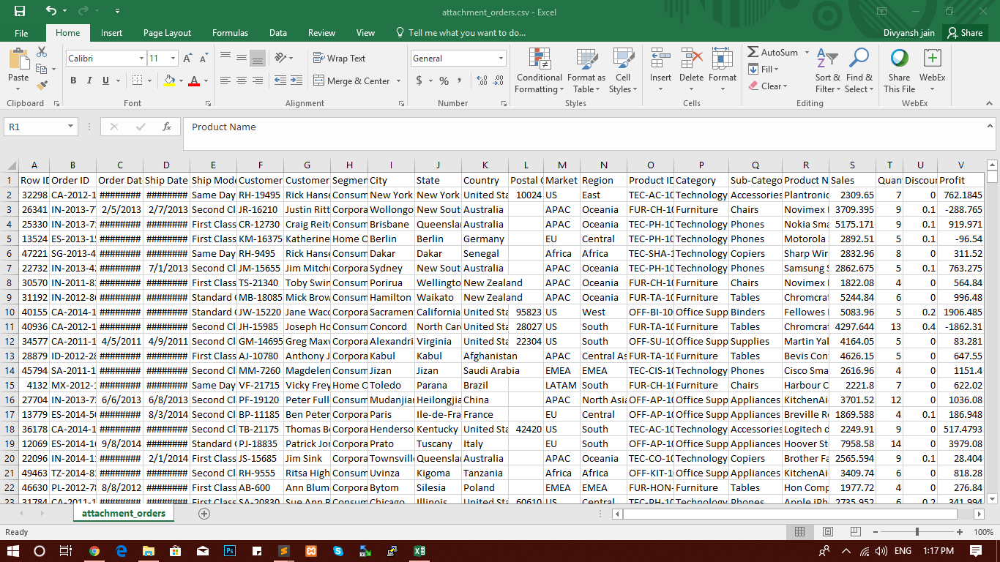
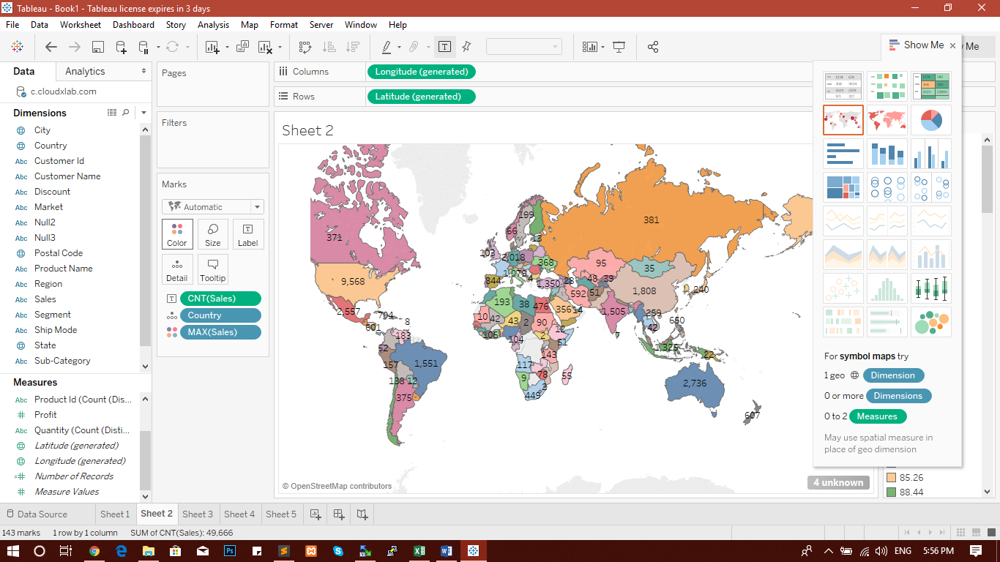

# Migrating MySQL Database to Spark

****************************************************************************************

## INTRODUCTION

This pipleine will focus on Data Loading, Data Ananlysis & Visualization demonstrating loading of data in MySQL to Hadoop File System (HDFS), later with the analysis using Spark followed by storing into Hive Tables, and import it into Tableau to generate dashboards for meaningful insights.

## DATA VISUALISATION

The concept of using pictures and graphs to understand data has been around for many years. As day by day, the data is getting increased it is a challenge to visualize these data and provide productive results within the lesser amount of time. Thus, Data visualization comes to the rescue to convey concepts in a universal manner and to experiment in different scenarios by making slight adjustments.
Data visualization is a process of describing information in a graphical or pictorial format which helps the decision makers to analyze the data in an easier way.

1) Data visualization just not makes data more beautiful but also provides insight into complex data sets by communicating with the key aspects more intrude on the meaningful ways.
2) Helps in identifying areas that need attention or improvement.
3) Clarify which factors influence customer behavior
4) Helps to understand which fields to place where
5) Helps to predict scenarios and more

## Objective

To find the profits gained by every customer for each region considering different country and states.

## Data Description

Dataset contains csv files consists of many column of an orders data.

## Tools & Technologies Used

Best suited technologies:
 
 1. MYSQL

 2. SQOOP

 3. Apache Spark

 4. Apache Hive

 5. Tableau (Visualisation)	

----------------------------------------------------------------------------------------------------------------------------------------------
----------------------------------------------------------------------------------------------------------------------------------------------

## MySql Connection  

1. Use below command to connect with MySQL Server

mysql -h ip-XXX-XX-XX-XXX -u sqoopuser -p

2. Create Table in MySQL using below command:

		create table pipeline(Row_ID int not null, Order_ID int not null, Order_Date date, Ship_Date date, Ship_Mode varchar(20) default 'new', Customer_ID varchar(20) default 'new', Customer_Name varchar(20) default 'new', Segment varchar(20) default 'new', City varchar(20) default 'new', State varchar(20) default 'new', Country varchar(20) default 'new', Postal_Code varchar(20) default 'new', Market varchar(20) default 'new', Region varchar(20) default 'new', Product_ID varchar(20) default 'new', Category varchar(20) default 'new', Sub_Category varchar(20) default 'new', Product_Name varchar(20) default 'new', Sales varchar(20) default 'new', Quantity varchar(20) default 'new', Discount varchar(20) default 'new', Profit varchar(20) default 'new');

3. Below command is used to Load orders data in MySQL Table:

		LOAD DATA LOCAL INFILE "orders.csv" INTO TABLE pipeline COLUMNS TERMINATED BY ',' LINES TERMINATED BY '\n' (Row_ID, Order_ID, @var1, @var2, Ship_Mode, Customer_ID, Customer_Name, Segment, City, State, Country, Postal_Code, Market, Region, Product_ID, Category, Sub_Category, Product_Name, Sales, Quantity, Discount, Profit) SET Order_Date = STR_TO_DATE(@var1, '%m/%d/%Y'), Ship_Date = STR_TO_DATE(@var2, '%m/%d/%Y');   

// Parsing Date from String in above command, to store exact Date in table instead of null values

----------------------------------------------------------

## SQOOP

Command to store MySQL Table into HDFS

Here, it arises with 2 cases: 

Case 1: Storing in HDFS & then reading with part-m file created by HDFS(by-default)

Case 2: While storing in HDFS converting file into Parquete format
**************

## Case 1: Storing & then reading from HDFS Part File in Spark 

Use below Sqoop command to store MySQL loaded data into HDFS 

	sqoop import --connect "jdbc:mysql://ip-XXX-XX-XX-XXX:XXXX/sqoopex" --table pipeline --username sqoopuser -P --target-dir /user/support1161/Divyansh -m 1

** SPARK CODE **
*****************

Refer SparkCode1.txt

----------------------------------------------

## Case 2: Converting it into parquete format & then reading from parquete file format in SPARK

Use below Sqoop command to store MySQL loaded data into HDFS 

	sqoop import --connect "jdbc:mysql://ip-XXX-XX-XX-XXX:XXXX/sqoopex" --table pipeline --username sqoopuser -P --target-dir /user/support1161/Divya --as-parquet-file -m 1

** SPARK CODE **
*****************

Refer SparkCode2.txt

-----------------------------------------------------

## Special Case: Directly analyisng in Spark from MySQL without storing in HDFS

// For this Spark needs a mysql connector to connect MySQL with Spark
// Download MySQL connector from the link: https://mvnrepository.com/artifact/mysql/mysql-connector-java/5.1.36

After downloading use below command to enter into spark shell
	
	spark-shell --driver-class-path /home/support1161/mysql-connector-java-5.1.36.jar --jars /home/support1161/mysql-connector-java-5.1.36.jar

After entering into SPARK-SHELL write below code:

** SPARK CODE **

Refer SparkCode3.txt

// Tables are now created in Hive, now the task is to do visualisation with Tableau.

## Tableau

Downlaod Tableau from the below link: 
https://www.tableau.com/products/trial

And then to connect Tableau with Hive, Download Tableau Hive ODBC connector from below link:
https://hortonworks.com/downloads/#addons

After opening the link, drag to HDP adds on and Download & install Hortonworks ODBC Driver for Apache Hive (v2.1.16)

Later connect Hive server with Tableau & go with Visualisations as below:

