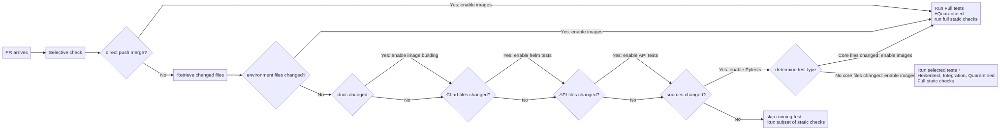
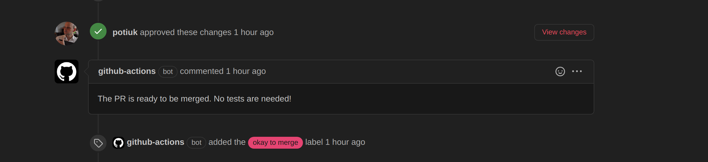
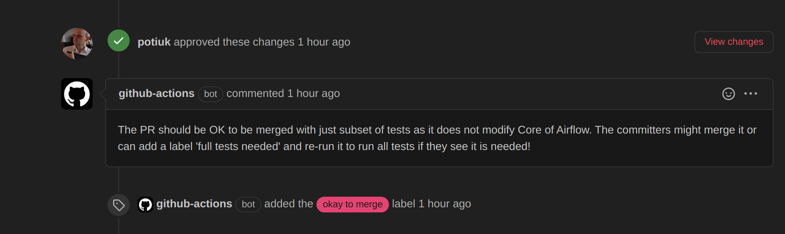
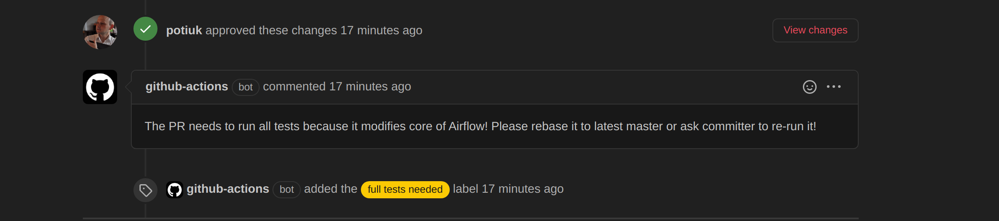

 .. Licensed to the Apache Software Foundation (ASF) under one
    or more contributor license agreements.  See the NOTICE file
    distributed with this work for additional information
    regarding copyright ownership.  The ASF licenses this file
    to you under the Apache License, Version 2.0 (the
    "License"); you may not use this file except in compliance
    with the License.  You may obtain a copy of the License at

 ..   http://www.apache.org/licenses/LICENSE-2.0

 .. Unless required by applicable law or agreed to in writing,
    software distributed under the License is distributed on an
    "AS IS" BASIS, WITHOUT WARRANTIES OR CONDITIONS OF ANY
    KIND, either express or implied.  See the License for the
    specific language governing permissions and limitations
    under the License.

.. contents:: :local:

Why non-standard pull request workflow?
---------------------------------------

This document describes the Pull Request Workflow we've implemented in Airflow. The workflow is slightly
more complex than regular workflow you might encounter in most of the projects because after experiencing
some huge delays in processing queues in October 2020 with GitHub Actions, we've decided to optimize the
workflow to minimize the use of GitHub Actions build time by utilising selective approach on which tests
and checks in the CI system are run depending on analysis of which files changed in the incoming PR and
allowing the Committers to control the scope of the tests during the approval/review process.

Just to give a bit of context, we started off with the approach that we always run all tests for all the
incoming PRs, however due to our matrix of tests growing, this approach did not scale with the increasing
number of PRs and when we had to compete with other Apache Software Foundation projects for the 180
slots that are available for the whole organization. More Apache Software Foundation projects started
to use GitHub Actions and we've started to experience long queues when our jobs waited for free slots.

We approached the problem by:

1) Improving mechanism of cancelling duplicate workflow runs more efficiently in case of queue conditions
   (duplicate workflow runs are generated when someone pushes a fixup quickly - leading to running both
   out-dated and current run to completion, taking precious slots. This has been implemented by improving
   `cancel-workflow-run <https://github.com/potiuk/cancel-workflow-runs/>`_ action we are using. In version
   4.1 it got a new feature of cancelling all duplicates even if there is a long queue of builds.

2) Heavily decreasing strain on the GitHub Actions jobs by introducing selective checks - mechanism
   to control which parts of the tests are run during the tests. This is implemented by the
   ``scripts/ci/selective_ci_checks.sh`` script in our repository. This script analyses which part of the
   code has changed and based on that it sets the right outputs that control which tests are executed in
   the CI build, and whether we need to build CI images necessary to run those steps. This allowed to
   heavily decrease the strain especially for the Pull Requests that were not touching code (in which case
   the builds can complete in < 2 minutes) but also by limiting the number of tests executed in PRs that do
   not touch the "core" of Airflow, or only touching some - standalone - parts of Airflow such as
   "Providers", "WWW" or "CLI". This solution is not yet perfect as there are likely some edge cases but
   it is easy to maintain and we have an escape-hatch - all the tests are always executed in master pushes,
   so contributors can easily spot if there is a "missed" case and fix it - both by fixing the problem and
   adding those exceptions to the code. More about it can be found in the
   `Selective CI checks <#selective-ci-checks>`_ chapter.

3) Even more optimisation came from limiting the scope of tests to only "default" matrix parameters. So far
   in Airflow we always run all tests for all matrix combinations. The primary matrix components are:

   * Python versions (currently 3.6, 3.7, 3.8)
   * Backend types (currently MySQL/Postgres)
   * Backed version (currently MySQL 5.7, MySQL 8, Postgres 9.6, Postgres 13

   We've decided that instead of running all the combinations of parameters for all matrix component we will
   only run default values (Python 3.6, Mysql 5.7, Postgres 9.6) for all PRs which are not approved yet by
   the committers. This has a nice effect, that full set of tests (though with limited combinations of
   the matrix) are still run in the CI for every Pull Request that needs tests at all - allowing the
   contributors to make sure that their PR is "good enough" to be reviewed.

   Even after approval, the automated workflows we've implemented, check if the PR seems to need
   "full test matrix" and provide helpful information to both contributors and committers in the form of
   explanatory comments and labels set automatically showing the status of the PR. Committers have still
   control whether they want to merge such requests automatically or ask for rebase or re-run the tests
   and run "full tests" by applying the "full tests needed" label and re-running such request.
   The "full tests needed" label is also applied automatically after approval when the change touches
   the "core" of Airflow - also a separate check is added to the PR so that the "merge" button status
   will indicate to the committer that full tests are still needed. The committer might still decide,
   whether to merge such PR without the "full matrix". The "escape hatch" we have - i.e. running the full
   matrix of tests in the "merge push" will enable committers to catch and fix such problems quickly.
   More about it can be found in `Approval workflow and Matrix tests <#approval-workflow-and-matrix-tests>`_
   chapter.

4) We've also applied (and received) funds to run self-hosted runners. This is not yet implemented, due to
   discussions about security of self-hosted runners for public repositories. Running self-hosted runners by
   public repositories is currently (as of end of October 2020)
   `Discouraged by GitHub <https://docs.github.com/en/free-pro-team@latest/actions/hosting-your-own-runners/about-self-hosted-runners#self-hosted-runner-security-with-public-repositories>`_
   and we are working on solving the problem - also involving Apache Software Foundation infrastructure team.
   This document does not describe this part of the approach. Most likely we will add soon a document
   describing details of the approach taken there.

Selective CI Checks
-------------------

In order to optimise our CI builds, we've implemented optimisations to only run selected checks for some
kind of changes. The logic implemented reflects the internal architecture of Airflow 2.0 packages
and it helps to keep down both the usage of jobs in GitHub Actions as well as CI feedback time to
contributors in case of simpler changes.

We have the following test types (separated by packages in which they are):

* Always - those are tests that should be always executed (always folder)
* Core - for the core Airflow functionality (core folder)
* API - Tests for the Airflow API (api and api_connexion folders)
* CLI - Tests for the Airflow CLI (cli folder)
* WWW - Tests for the Airflow webserver (www and www_rbac in 1.10 folders)
* Providers - Tests for all Providers of Airflow (providers folder)
* Other - all other tests (all other folders that are not part of any of the above)

We also have several special kinds of tests that are not separated by packages but they are marked with
pytest markers. They can be found in any of those packages and they can be selected by the appropriate
pylint custom command line options. See `TESTING.rst <TESTING.rst>`_ for details but those are:

* Integration - tests that require external integration images running in docker-compose
* Heisentests - tests that are vulnerable to some side effects and are better to be run on their own
* Quarantined - tests that are flaky and need to be fixed
* Postgres - tests that require Postgres database. They are only run when backend is Postgres
* MySQL - tests that require MySQL database. They are only run when backend is MySQL

Even if the types are separated, In case they share the same backend version/python version, they are
run sequentially in the same job, on the same CI machine. Each of them in a separate ``docker run`` command
and with additional docker cleaning between the steps to not fall into the trap of exceeding resource
usage in one big test run, but also not to increase the number of jobs per each Pull Request.

The logic implemented for the changes works as follows:

1) In case of direct push (so when PR gets merged) or scheduled run, we always run all tests and checks.
   This is in order to make sure that the merge did not miss anything important. The remainder of the logic
   is executed only in case of Pull Requests.

2) We retrieve which files have changed in the incoming Merge Commit (github.sha is a merge commit
   automatically prepared by GitHub in case of Pull Request, so we can retrieve the list of changed
   files from that commit directly).

3) If any of the important, environment files changed (Dockerfile, ci scripts, setup.py, GitHub workflow
   files), then we again run all tests and checks. Those are cases where the logic of the checks changed
   or the environment for the checks changed so we want to make sure to check everything.

4) If any of docs changed: we need to have CI image so we enable image building

5) If any of chart files changed, we need to run helm tests so we enable helm unit tests

6) If any of API files changed, we need to run API tests so we enable them

7) If any of the relevant source files that trigger the tests have changed at all. Those are airflow
   sources, chart, tests and kubernetes_tests. If any of those files changed, we enable tests and we
   enable image building, because the CI images are needed to run tests.

8) Then we determine which types of the tests should be run. We count all the changed files in the
   relevant airflow sources (airflow, chart, tests, kubernetes_tests) first and then we count how many
   files changed in different packages:

   a) in any case tests in ``Always`` folder are run. Those are special tests that should be run any time
      modifications to any Python code occurs. Example test of this type is verifying proper structure of
      the project including proper naming of all files.
   b) if any of the Airflow API files changed we enable ``API`` test type
   c) if any of the Airflow CLI files changed we enable ``CLI`` test type and Kubernetes tests (the
      K8S tests depend on CLI changes as helm chart uses CLI to run Airflow).
   d) if any of the Provider files changed we enable ``Providers`` test type
   e) if any of the WWW files changed we enable ``WWW`` test type
   f) if any of the Kubernetes files changed we enable ``Kubernetes`` test type
   g) Then we subtract count of all the ``specific`` above per-type changed files from the count of
      all changed files. In case there are any files changed, then we assume that some unknown files
      changed (likely from the core of airflow) and in this case we enable all test types above and the
      Core test types - simply because we do not want to risk to miss anything.
   h) In all cases where tests are enabled we also add Heisentests, Integration and - depending on
      the backend used = Postgres or MySQL types of tests.

9) Quarantined tests are always run when tests are run - we need to run them often to observe how
   often they fail so that we can decide to move them out of quarantine. Details about the
   Quarantined tests are described in `TESTING.rst <TESTING.rst>`_

10) There is a special case of static checks. In case the above logic determines that the CI image
    needs to be build, we run long and more comprehensive version of static checks - including Pylint,
    MyPy, Flake8. And those tests are run on all files, no matter how many files changed.
    In case the image is not built, we run only simpler set of changes - the longer static checks
    that require CI image are skipped, and we only run the tests on the files that changed in the incoming
    commit - unlike pylint/flake8/mypy, those static checks are per-file based and they should not miss any
    important change.

Similarly to selective tests we also run selective security scans. In Pull requests,
the Python scan will only run when there is a python code change and JavaScript scan will only run if
there is a JavaScript or yarn.lock file change. For master builds, all scans are always executed.

The selective check algorithm is shown here:

Approval Workflow and Matrix tests
----------------------------------

As explained above the approval and matrix tests workflow works according to the algorithm below:

1) In case of "no-code" changes - so changes that do not change any of the code or environment of
   the application, no test are run (this is done via selective checks above). Also no CI/PROD images are
   build saving extra minutes. Such build takes less than 2 minutes currently and only few jobs are run
   which is a very small fraction of the "full build" time.

2) When new PR is created, only a "default set" of matrix test are running. Only default
   values for each of the parameters are used effectively limiting it to running matrix builds for only
   one python version and one version of each of the backends. In this case only one CI and one PROD
   image is built, saving precious job slots. This build takes around 50% less time than the "full matrix"
   build.

3) When such PR gets approved, the system further analyses the files changed in this PR and further
   decision is made that should be communicated to both Committer and Reviewer.

3a) In case of "no-code" builds, a message is communicated that the PR is ready to be merged and
    no tests are needed.

3b) In case of "non-core" builds a message is communicated that such PR is likely OK to be merged as is with
    limited set of tests, but that the committer might decide to re-run the PR after applying
    "full tests needed" label, which will trigger full matrix build for tests for this PR. The committer
    might make further decision on what to do with this PR.

3c) In case of "core" builds (i. e. when the PR touches some "core" part of Airflow) a message is
    communicated that this PR needs "full test matrix", the "full tests needed" label is applied
    automatically and either the contributor might rebase the request to trigger full test build or the
    committer might re-run the build manually to trigger such full test rebuild. Also a check "in-progress"
    is added, so that the committer realises that the PR is not yet "green to merge". Pull requests with
    "full tests needed" label always trigger the full matrix build when rebased or re-run so if the
    PR gets rebased, it will continue triggering full matrix build.

4) If this or another committer "request changes" in in a  previously approved PR with "full tests needed"
   label, the bot automatically removes the label, moving it back to "run only default set of parameters"
   mode. For PRs touching core of airflow once the PR gets approved back, the label will be restored.
   If it was manually set by the committer, it has to be restored manually.

.. note:: Note that setting the labels and adding comments might be delayed, due to limitation of GitHub Actions,
      in case of queues, processing of Pull Request reviews might take some time, so it is advised not to merge
      PR immediately after approval. Luckily, the comments describing the status of the PR trigger notifications
      for the PRs and they provide good "notification" for the committer to act on a PR that was recently
      approved.

The PR approval workflow is possible thanks two two custom GitHub Actions we've developed:

* `Get workflow origin <https://github.com/potiuk/get-workflow-origin/>`_
* `Label when approved <https://github.com/TobKed/label-when-approved-action>`_

Next steps
----------

We are planning to also propose the approach to other projects from Apache Software Foundation to
make it a common approach, so that our effort is not limited only to one project.

Discussion about it in `this discussion <https://lists.apache.org/thread.html/r1708881f52adbdae722afb8fea16b23325b739b254b60890e72375e1%40%3Cbuilds.apache.org%3E>`_
