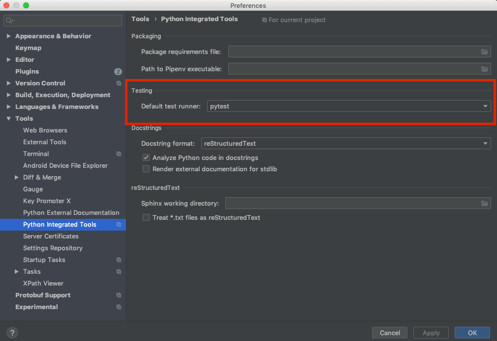
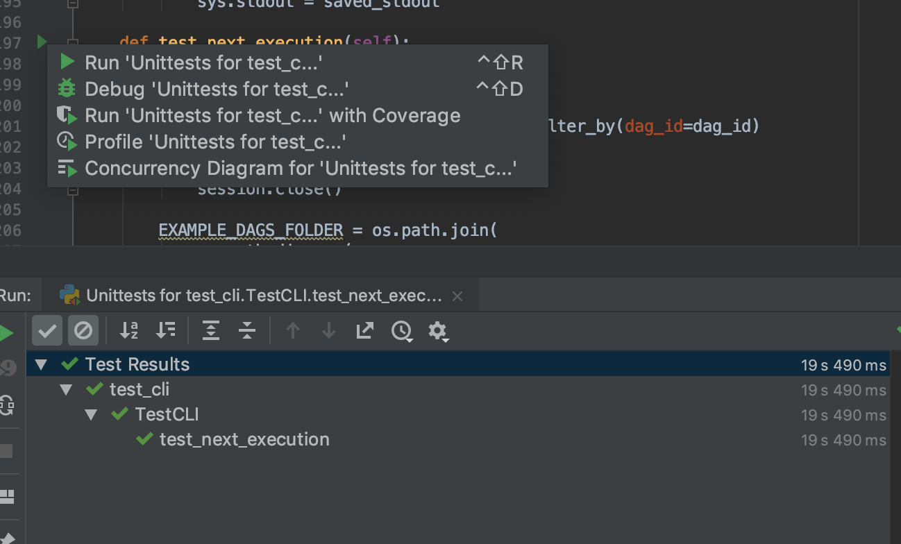
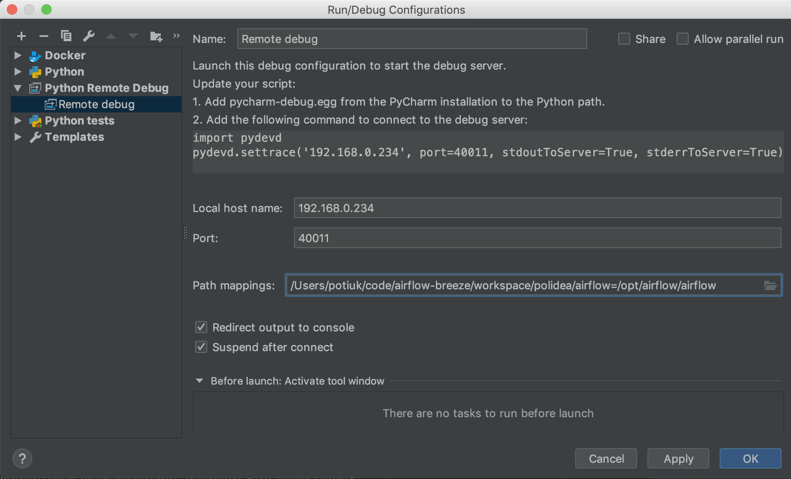
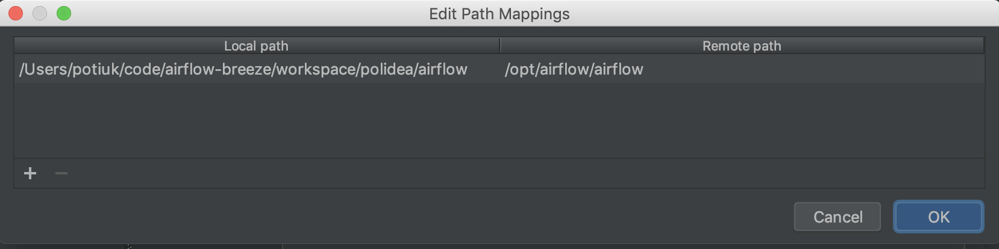

 .. Licensed to the Apache Software Foundation (ASF) under one
    or more contributor license agreements.  See the NOTICE file
    distributed with this work for additional information
    regarding copyright ownership.  The ASF licenses this file
    to you under the Apache License, Version 2.0 (the
    "License"); you may not use this file except in compliance
    with the License.  You may obtain a copy of the License at

 ..   http://www.apache.org/licenses/LICENSE-2.0

 .. Unless required by applicable law or agreed to in writing,
    software distributed under the License is distributed on an
    "AS IS" BASIS, WITHOUT WARRANTIES OR CONDITIONS OF ANY
    KIND, either express or implied.  See the License for the
    specific language governing permissions and limitations
    under the License.

.. contents:: :local:

Airflow Test Infrastructure
===========================

* **Unit tests** are Python tests that do not require any additional integrations.
  Unit tests are available both in the `Breeze environment <BREEZE.rst>`__
  and local virtualenv.

* **Integration tests** are available in the Breeze development environment
  that is also used for Airflow Travis CI tests. Integration test are special tests that require
  additional services running - such as Postgres/Mysql/Kerberos etc. Those tests are not yet
  clearly marked as integration tests but soon they will be clearly separated by pytest annotations.

* **System tests** are automatic tests that use external systems like
  Google Cloud Platform. These tests are intended for an end-to-end DAG execution.
  Note that automated execution of these tests is still
  `work in progress <https://cwiki.apache.org/confluence/display/AIRFLOW/AIP-4+Support+for+System+Tests+for+external+systems#app-switcher>`_.

This document is about running python tests, before the tests are run we also use
`static code checks <STATIC_CODE_CHECKS.rst>`__ which allow to catch typical errors in code
before tests are executed.

Airflow Unit Tests
==================

All tests for Apache Airflow are run using `pytest <http://doc.pytest.org/en/latest/>`_ .

Writing unit tests
------------------

There are a few guidelines that you should follow when writing unit tests:

* Standard unit tests that do not require integrations with external systems should mock all communication
* All our tests are run with pytest make sure you set your IDE/runners (see below) to use pytest by default
* For new tests we should use standard "asserts" of python and pytest decorators/context managers for testing
  rather than unittest ones. Look at `Pytest docs <http://doc.pytest.org/en/latest/assert.html>`_ for details.
* We use parameterized framework for tests that have variations in parameters
* We plan to convert all unittests to standard "asserts" semi-automatically but this will be done later
  in Airflow 2.0 development phase. That will include setUp/tearDown/context managers and decorators

Running Unit Tests from IDE
---------------------------

To run unit tests from the IDE, create the `local virtualenv <LOCAL_VIRTUALENV.rst>`_,
select it as the default project's environment, then configure your test runner:



and run unit tests as follows:



Note that you can run the unit tests in the standalone local virtualenv
(with no Breeze installed) if they do not have dependencies such as
Postgres/MySQL/Hadoop/etc.


Running Unit Tests
--------------------------------
To run unit, integration and system tests from the Breeze and your
virtualenv you can use `pytest <http://doc.pytest.org/en/latest/>`_ framework.

Custom pytest plugin run ``airflow db init`` and ``airflow db reset`` the first
time you launch them, so you can count on the database being initialized. Currently,
when you run tests not supported **in the local virtualenv, the tests may either fail
or provide an error message**.

There are many available options for selecting specific test in pytest. Details could be found
in official documentation but here are few basic examples:

.. code-block:: bash

    pytest -k "TestCore and not check"

This will run ``TestCore`` class but will skip tests of this class that includes 'check' in their names.
For better performance (due to test collection) you should do:

.. code-block:: bash

    pytest tests/tests_core.py -k "TestCore and not bash".

This flag is useful when used like this:

.. code-block:: bash

    pytest tests/tests_core.py -k "test_check_operators"

to run single test. This can also be done by specifying full path to the test:

.. code-block:: bash

    pytest tests/test_core.py::TestCore::test_check_operators

To run whole test class:

.. code-block:: bash

    pytest tests/test_core.py::TestCore

You can use all available pytest flags, for example to increase log level
for debugging purposes:

.. code-block:: bash

    pytest --log-level=DEBUG tests/test_core.py::TestCore

**Note:** We do not provide a clear distinction between tests
(Unit/Integration/System tests), but we are working on it.


Running Tests for a Specified Target using Breeze from the host
---------------------------------------------------------------

If you wish to only run tests and not to drop into shell, you can do this by providing the
``-t``, ``--test-target`` flag. You can add extra pytest flags after ``--`` in the command line.

.. code-block:: bash

     ./breeze --test-target tests/hooks/test_druid_hook.py -- --logging-level=DEBUG

You can run the whole test suite with a special '.' test target:

.. code-block:: bash

    ./breeze --test-target .

You can also specify individual tests or a group of tests:

.. code-block:: bash

    ./breeze --test-target tests/test_core.py::TestCore


Airflow Integration Tests
=========================

Some of the tests in Airflow are Integration tests. Those tests require not only airflow-testing docker
image but also extra images with integrations (such as redis/mongodb etc.).


Enabling integrations
---------------------

Running Airflow integration tests cannot be run in local virtualenv. They can only run in Breeze
environment with enabled integrations and in Travis CI.

When you are in Breeze environment, by default all integrations are disabled - this way only true unit tests
can be executed in Breeze. You can enable the integration by passing ``--integration <INTEGRATION>``
switch when starting Breeze. You can specify multiple integrations by repeating the ``--integration`` switch
or by using ``--integration all`` switch which enables all integrations.

Note, that every integration requires separate container with the corresponding integration image,
so they take precious resources on your PC - mainly memory. The integrations started are not stopped
until you stop the Breeze environment with ``--stop-environment`` switch.

The following integrations are available:

.. list-table:: Airflow Test Integrations
   :widths: 15 80
   :header-rows: 1

   * - Integration
     - Description
   * - cassandra
     - Integration required for Cassandra hooks
   * - kerberos
     - Integration that provides Kerberos authentication
   * - mongo
     - Integration required for MongoDB hooks
   * - openldap
     - Integration required for OpenLDAP hooks
   * - rabbitmq
     - Integration required for Celery executor tests
   * - redis
     - Integration required for Celery executor tests

Below command starts mongo integration only:

.. code-block:: bash

    ./breeze --integration mongo

Below command starts mongo and cassandra integrations:

.. code-block:: bash

    ./breeze --integration mongo --integration cassandra

Below command starts all integrations:

.. code-block:: bash

    ./breeze --integration all

In the CI environment integrations can be enabled by specifying ``ENABLED_INTEGRATIONS`` variable
storing space-separated list of integrations to start. Thanks to that we can run integration and
integration-less tests separately in different jobs which is desired from the memory usage point of view.

Note that Kerberos is a special kind of integration. There are some tests that run differently when
Kerberos integration is enabled (they retrieve and use Kerberos authentication token) and differently when the
Kerberos integration is disabled (they do not retrieve nor use the token). Therefore one of the test job
for the CI system should run all tests with kerberos integration enabled to test both scenarios.

Running integration tests
-------------------------

All tests that are using an integration are marked with custom pytest marker ``pytest.mark.integration``.
The marker has single parameter - name of the integration.

Example redis-integration test:

.. code-block:: python

    @pytest.mark.integration("redis")
    def test_real_ping(self):
        hook = RedisHook(redis_conn_id='redis_default')
        redis = hook.get_conn()

        self.assertTrue(redis.ping(), 'Connection to Redis with PING works.')

The markers can be specified at the test level or at the class level (then all tests in this class
require the integration). You can add multiple markers with different integrations for tests that
require more than one integration.

The behaviour of such marked tests is that it is skipped in case required integration is not enabled.
The skip message will clearly say what's needed in order to use that tests.

You can run all tests that are using certain integration with the custom pytest flag ``--integrations``,
where you can pass integrations as comma separated values. You can also specify ``all`` in order to start
tests for all integrations. Note that if an integration is not enabled in Breeze or CI.

Example that runs only ``mongo`` integration tests:

.. code-block:: bash

    pytest --integrations mongo

Example that runs integration tests fot ``mogo`` and ``rabbitmq``:

.. code-block:: bash

    pytest --integrations mongo,rabbitmq

Example that runs all integration tests:

.. code-block:: bash

    pytest --integrations all

Note that collecting all tests takes quite some time, so if you know where your tests are located you can
speed up test collection significantly by providing the folder where the tests are located.

Here is an example of collection limited only to apache providers directory:

.. code-block:: bash

    pytest --integrations cassandra tests/providers/apache/

Running backend-specific tests
------------------------------

Some tests that are using a specific backend are marked with custom pytest marker ``pytest.mark.backend``.
The marker has single parameter - name of the backend. It correspond with the ``--backend`` switch of
the Breeze environment (one of ``mysql``, ``sqlite``, ``postgres``). Those tests will only run when
the Breeze environment is running with the right backend. You can specify more than one backend
in the marker - then the test will run for all those backends specified.

Example postgres-only test:

.. code-block:: python

    @pytest.mark.backend("postgres")
    def test_copy_expert(self):
        ...


Example postgres,mysql test (they are skipped with sqlite backend):

.. code-block:: python

    @pytest.mark.backend("postgres", "mysql")
    def test_celery_executor(self):
        ...


You can use custom ``--backend`` switch in pytest to only run tests specific for that backend.
Here is an example of only running postgres-specific backend tests:

.. code-block:: bash

    pytest --backend postgres

Running Tests with Kubernetes
-----------------------------

Starting Kubernetes Cluster when starting Breeze
................................................

In order to run Kubernetes in Breeze you can start Breeze with ``--start-kind-cluster`` switch. This will
automatically create a Kind Kubernetes cluster in the same ``docker`` engine that is used to run Breeze
Setting up the Kubernetes cluster takes some time so the cluster continues running
until the cluster is stopped with ``--stop-kind-cluster`` switch or until ``--recreate-kind-cluster``
switch is used rather than ``--start-kind-cluster``. Starting breeze with kind cluster automatically
sets ``runtime`` to ``kubernetes`` (see below).

The cluster name follows the pattern ``airflow-python-X.Y.Z-vA.B.C`` where X.Y.Z is Python version
and A.B.C is kubernetes version. This way you can have multiple clusters setup and running at the same
time for different python versions and different kubernetes versions.

The Control Plane is available from inside the docker image via ``<CLUSTER_NAME>-control-plane:6443``
host:port, the worker of the kind cluster is available at  <CLUSTER_NAME>-worker
and webserver port for the worker is 30809.

The Kubernetes Cluster is started but in order to deploy airflow to Kubernetes cluster you need to:

1. Build the image.
2. Load it to Kubernetes cluster.
3. Deploy airflow application.

It can be done with single script: ``./scripts/ci/in_container/kubernetes/deploy_airflow_to_kubernetes.sh``

You can, however, work separately on the image in Kubernetes and deploying the Airflow app in the cluster.

Building Airflow Images and Loading them to Kubernetes cluster
..............................................................

This is done using ``./scripts/ci/in_container/kubernetes/docker/rebuild_airflow_image.sh`` script:

1. Latest ``apache/airflow:master-pythonX.Y-ci`` images are rebuilt using latest sources.
2. New Kubernetes image based on the  ``apache/airflow:master-pythonX.Y-ci`` is built with
   necessary scripts added to run in kubernetes. The image is tagged with
   ``apache/airflow:master-pythonX.Y-ci-kubernetes`` tag.
3. The image is loaded to the kind cluster using ``kind load`` command

Deploying Airflow Application in the Kubernetes cluster
.......................................................

This is done using ``./scripts/ci/in_container/kubernetes/app/deploy_app.sh`` script:

1. Kubernetes resources are prepared by processing template from ``template`` directory, replacing
   variables with the right images and locations:
   - configmaps.yaml
   - airflow.yaml
2. The existing resources are used without replacing any variables inside:
   - secrets.yaml
   - postgres.yaml
   - volumes.yaml
3. All the resources are applied in the Kind cluster
4. The script will wait until all the applications are ready and reachable

After the deployment is finished you can run Kubernetes tests immediately in the same way as other tests.
The Kubernetes tests are in ``tests/runtime/kubernetes`` folder.

You can run all the integration tests for Kubernetes with ``pytest tests/runtime/kubernetes``.


Running runtime-specific tests
------------------------------

Some tests that are using a specific runtime are marked with custom pytest marker ``pytest.mark.runtime``.
The marker has single parameter - name of the runtime. For the moment the only supported runtime is
``kubernetes``. This runtime is set when you run Breeze with ``--start-kind-cluster`` option.
Those tests will only run when the selectd runtime is started.


.. code-block:: python

    @pytest.mark.runtime("kubernetes")
    class TestKubernetesExecutor(unittest.TestCase):


You can use custom ``--runtime`` switch in pytest to only run tests specific for that backend.

Here is an example of only running kubernetes-runtime backend tests:

.. code-block:: bash

    pytest --runtime kubernetes

Note! For convenience and faster search, all runtime tests are stored in ``tests.runtime`` package. You
can speed up collection of tests in this case by:

.. code-block:: bash

    pytest --runtime kubernetes tests/runtime

Travis CI Testing Framework
===========================

Airflow test suite is based on Travis CI framework as running all of the tests
locally requires significant setup. You can set up Travis CI in your fork of
Airflow by following the
`Travis CI Getting Started guide <https://docs.travis-ci.com/user/getting-started/>`__.

Consider using Travis CI framework if you submit multiple pull requests
and want to speed up your builds.

There are two different options available for running Travis CI, and they are
set up on GitHub as separate components:

-   **Travis CI GitHub App** (new version)
-   **Travis CI GitHub Services** (legacy version)

Travis CI GitHub App (new version)
----------------------------------

1.  Once `installed <https://github.com/apps/travis-ci/installations/new/permissions?target_id=47426163>`__,
    configure the Travis CI GitHub App at
    `Configure Travis CI <https://github.com/settings/installations>`__.

2.  Set repository access to either "All repositories" for convenience, or "Only
    select repositories" and choose ``USERNAME/airflow`` in the drop-down menu.

3.   Access Travis CI for your fork at `<https://travis-ci.com/USERNAME/airflow>`__.

Travis CI GitHub Services (legacy version)
------------------------------------------

**NOTE:** The apache/airflow project is still using the legacy version.

Travis CI GitHub Services version uses an Authorized OAuth App.

1.  Once installed, configure the Travis CI Authorized OAuth App at
    `Travis CI OAuth APP <https://github.com/settings/connections/applications/88c5b97de2dbfc50f3ac>`__.

2.  If you are a GitHub admin, click the **Grant** button next to your
    organization; otherwise, click the **Request** button. For the Travis CI
    Authorized OAuth App, you may have to grant access to the forked
    ``ORGANIZATION/airflow`` repo even though it is public.

3.  Access Travis CI for your fork at
    `<https://travis-ci.org/ORGANIZATION/airflow>`_.

Creating New Projects in Travis CI
----------------------------------

If you need to create a new project in Travis CI, use travis-ci.com for both
private repos and open source.

The travis-ci.org site for open source projects is now legacy and you should not use it.

..
    There is a second Authorized OAuth App available called **Travis CI for Open Source** used
    for the legacy travis-ci.org service. Don't use it for new projects!

More information:

-  `Open Source on travis-ci.com <https://docs.travis-ci.com/user/open-source-on-travis-ci-com/>`__.
-  `Legacy GitHub Services to GitHub Apps Migration Guide <https://docs.travis-ci.com/user/legacy-services-to-github-apps-migration-guide/>`__.
-  `Migrating Multiple Repositories to GitHub Apps Guide <https://docs.travis-ci.com/user/travis-migrate-to-apps-gem-guide/>`__.

Airflow System Tests
====================

The System tests for Airflow are not yet fully implemented. They are Work In Progress of the
`AIP-4 Support for System Tests for external systems <https://cwiki.apache.org/confluence/display/AIRFLOW/AIP-4+Support+for+System+Tests+for+external+systems>`__.
These tests need to communicate with external services/systems that are available
if you have appropriate credentials configured for your tests.
The tests derive from ``tests.system_test_class.SystemTests`` class.

The system tests execute a specified
example DAG file that runs the DAG end-to-end.

An example of such a system test is
``airflow.tests.providers.google.operators.test_natural_language_system.CloudNaturalLanguageExampleDagsTest``.

For now you can execute the system tests and follow messages printed to get them running. Soon more information on
running the tests will be available.


Local and Remote Debugging in IDE
=================================

One of the great benefits of using the local virtualenv and Breeze is an option to run
local debugging in your IDE graphical interface.

When you run example DAGs, even if you run them using unit tests within IDE, they are run in a separate
container. This makes it a little harder to use with IDE built-in debuggers.
Fortunately, IntelliJ/PyCharm provides an effective remote debugging feature (but only in paid versions).
See additional details on
`remote debugging <https://www.jetbrains.com/help/pycharm/remote-debugging-with-product.html>`_.

You can set up your remote debugging session as follows:



Note that on macOS, you have to use a real IP address of your host rather than default
localhost because on macOS the container runs in a virtual machine with a different IP address.

Make sure to configure source code mapping in the remote debugging configuration to map
your local sources to the ``/opt/airflow`` location of the sources within the container:



DAG testing
===========

To ease and speed up process of developing DAGs you can use
py:class:`~airflow.executors.debug_executor.DebugExecutor` - a single process executor
for debugging purposes. Using this executor you can run and debug DAGs from your IDE.

**IDE setup steps:**

1. Add ``main`` block at the end of your DAG file to make it runnable.
It will run a backfill job:

.. code-block:: python

  if __name__ == '__main__':
    dag.clear(reset_dag_runs=True)
    dag.run()


2. Setup ``AIRFLOW__CORE__EXECUTOR=DebugExecutor`` in run configuration of your IDE. In
   this step you should also setup all environment variables required by your DAG.

3. Run and debug the DAG file.

Additionally ``DebugExecutor`` can be used in a fail-fast mode that will make
all other running or scheduled tasks fail immediately. To enable this option set
``AIRFLOW__DEBUG__FAIL_FAST=True`` or adjust ``fail_fast`` option in your ``airflow.cfg``.


BASH unit testing (BATS)
========================

We have started to add tests to cover Bash scripts we have in our codeabase.
The tests are placed in ``tests\bats`` folder.
They require BAT CLI to be installed if you want to run them in your
host or via docker image.

BATS CLI installation
---------------------

You can find installation guide as well as information on how to write
the bash tests in [BATS installation](https://github.com/bats-core/bats-core#installation)

Running BATS tests in the host
------------------------------

Running all tests:

```
bats -r tests/bats/
```

Running single test:

```
bats tests/bats/your_test_file.bats
```

Running BATS tests via docker
-----------------------------

Running all tests:

```
docker run -it --workdir /airflow -v $(pwd):/airflow  bats/bats:latest -r /airflow/tests/bats
```

Running single test:

```
docker run -it --workdir /airflow -v $(pwd):/airflow  bats/bats:latest /airflow/tests/bats/your_test_file.bats
```

BATS usage
----------

You can read more about using BATS CLI and writing tests in:
[BATS usage](https://github.com/bats-core/bats-core#usage)
