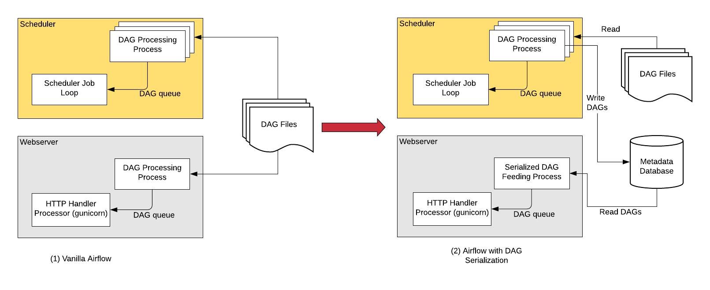

 .. Licensed to the Apache Software Foundation (ASF) under one
    or more contributor license agreements.  See the NOTICE file
    distributed with this work for additional information
    regarding copyright ownership.  The ASF licenses this file
    to you under the Apache License, Version 2.0 (the
    "License"); you may not use this file except in compliance
    with the License.  You may obtain a copy of the License at

 ..   http://www.apache.org/licenses/LICENSE-2.0

 .. Unless required by applicable law or agreed to in writing,
    software distributed under the License is distributed on an
    "AS IS" BASIS, WITHOUT WARRANTIES OR CONDITIONS OF ANY
    KIND, either express or implied.  See the License for the
    specific language governing permissions and limitations
    under the License.

DAG Serialization
=================

In order to make Airflow Webserver stateless, Airflow >=1.10.7 supports
DAG Serialization and DB Persistence. From Airflow 2.0.0, the Scheduler
also use Serialized DAGs for consistency and make Scheduling decisions.

Without DAG Serialization & persistence in DB, the Webserver and the Scheduler both
need access to the DAG files. Both the scheduler and webserver parse the DAG files.

With **DAG Serialization** we aim to decouple the webserver from DAG parsing
which would make the Webserver very light-weight.

As shown in the image above, when using the this feature,
the :class:`~airflow.jobs.scheduler_job.DagFileProcessorProcess` in the Scheduler
parses the DAG files, serializes them in JSON format and saves them in the Metadata DB
as :class:`~airflow.models.serialized_dag.SerializedDagModel` model.

The Webserver now instead of having to parse the DAG file again, reads the
serialized DAGs in JSON, de-serializes them and create the DagBag and uses it
to show in the UI. And the Scheduler does not need the actual DAG for making Scheduling decisions,
instead of using the DAG files, we use Serialized DAGs that contain all the information needing to
schedule the DAGs from Airflow 2.0.0 (this was done as part of :ref:`Scheduler HA <scheduler:ha>`).

One of the key features that is implemented as the part of DAG Serialization is that
instead of loading an entire DagBag when the WebServer starts we only load each DAG on demand from the
Serialized Dag table. This helps reduce Webserver startup time and memory. The reduction is notable
when you have large number of DAGs.

You can enable the source code to be stored in the database to make the Webserver completely independent of the DAG files.
This is not necessary if your files are embedded in an Docker image or you can otherwise provide
them to the webserver. The data is stored in the :class:`~airflow.models.dagcode.DagCode` model.

The last element is rendering template fields. When serialization is enabled, templates are not rendered
to requests, but a copy of the field contents is saved before the task is executed on worker.
The data is stored in the :class:`~airflow.models.renderedtifields.RenderedTaskInstanceFields` model.
To limit the excessive growth of the database, only the most recent entries are kept and older entries
are purged.

.. note::
  From Airflow 2.0 DAG Serialization is a strictly required and can not be turned off.

Dag Serialization Settings
---------------------------

Add the following settings in ``airflow.cfg``:

.. code-block:: ini

    [core]
    store_dag_code = True

    # You can also update the following default configurations based on your needs
    min_serialized_dag_update_interval = 30
    min_serialized_dag_fetch_interval = 10
    max_num_rendered_ti_fields_per_task = 30

*   ``store_dag_code``: This option decides whether to persist DAG files code in DB.
    If set to True, Webserver reads file contents from DB instead of trying to access files in a DAG folder.
*   ``min_serialized_dag_update_interval``: This flag sets the minimum interval (in seconds) after which
    the serialized DAG in DB should be updated. This helps in reducing database write rate.
*   ``min_serialized_dag_fetch_interval``: This option controls how often a SerializedDAG will be re-fetched
    from the DB when it's already loaded in the DagBag in the Webserver. Setting this higher will reduce
    load on the DB, but at the expense of displaying a possibly stale cached version of the DAG.
*   ``max_num_rendered_ti_fields_per_task``: This option controls maximum number of Rendered Task Instance
    Fields (Template Fields) per task to store in the Database.

If you are updating Airflow from <1.10.7, please do not forget to run ``airflow db upgrade``.

Limitations
-----------

*   When using user-defined filters and macros, the Rendered View in the Webserver might show incorrect results
    for TIs that have not yet executed as it might be using external modules that Webserver wont have access to.
    Use ``airflow tasks render`` cli command in such situation to debug or test rendering of you template_fields.
    Once the tasks execution starts the Rendered Template Fields will be stored in the DB in a separate table and
    after which the correct values would be showed in the Webserver (Rendered View tab).

.. note::
    You need Airflow >= 1.10.10 for completely stateless Webserver.
    Airflow 1.10.7 to 1.10.9 needed access to Dag files in some cases.
    More Information: https://airflow.apache.org/docs/1.10.9/dag-serialization.html#limitations

Using a different JSON Library
------------------------------

To use a different JSON library instead of the standard ``json`` library like ``ujson``, you need to
define a ``json`` variable in local Airflow settings (``airflow_local_settings.py``) file as follows:

.. code-block:: python

    import ujson
    json = ujson
