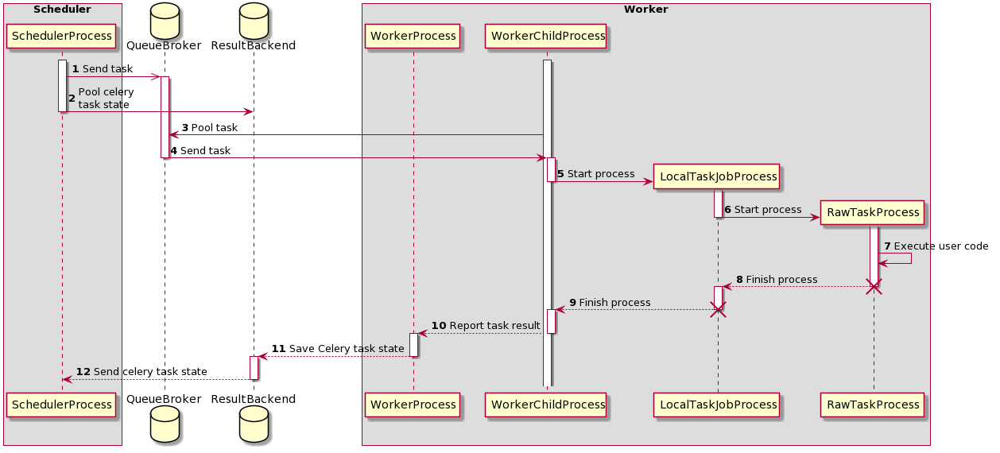

 .. Licensed to the Apache Software Foundation (ASF) under one
    or more contributor license agreements.  See the NOTICE file
    distributed with this work for additional information
    regarding copyright ownership.  The ASF licenses this file
    to you under the Apache License, Version 2.0 (the
    "License"); you may not use this file except in compliance
    with the License.  You may obtain a copy of the License at

 ..   http://www.apache.org/licenses/LICENSE-2.0

 .. Unless required by applicable law or agreed to in writing,
    software distributed under the License is distributed on an
    "AS IS" BASIS, WITHOUT WARRANTIES OR CONDITIONS OF ANY
    KIND, either express or implied.  See the License for the
    specific language governing permissions and limitations
    under the License.

.. _executor:CeleryExecutor:

Celery Executor
===============

``CeleryExecutor`` is one of the ways you can scale out the number of workers. For this
to work, you need to setup a Celery backend (**RabbitMQ**, **Redis**, ...) and
change your ``airflow.cfg`` to point the executor parameter to
``CeleryExecutor`` and provide the related Celery settings.

For more information about setting up a Celery broker, refer to the
exhaustive `Celery documentation on the topic <http://docs.celeryproject.org/en/latest/getting-started/brokers/index.html>`_.

Here are a few imperative requirements for your workers:

- ``airflow`` needs to be installed, and the CLI needs to be in the path
- Airflow configuration settings should be homogeneous across the cluster
- Operators that are executed on the worker need to have their dependencies
  met in that context. For example, if you use the ``HiveOperator``,
  the hive CLI needs to be installed on that box, or if you use the
  ``MySqlOperator``, the required Python library needs to be available in
  the :envvar:`PYTHONPATH` somehow
- The worker needs to have access to its ``DAGS_FOLDER``, and you need to
  synchronize the filesystems by your own means. A common setup would be to
  store your ``DAGS_FOLDER`` in a Git repository and sync it across machines using
  Chef, Puppet, Ansible, or whatever you use to configure machines in your
  environment. If all your boxes have a common mount point, having your
  pipelines files shared there should work as well

To kick off a worker, you need to setup Airflow and kick off the worker
subcommand

.. code-block:: bash

    airflow celery worker

Your worker should start picking up tasks as soon as they get fired in
its direction. To stop a worker running on a machine you can use:

.. code-block:: bash

    airflow celery stop

It will try to stop the worker gracefully by sending ``SIGTERM`` signal to main Celery
process as recommended by
`Celery documentation <https://docs.celeryproject.org/en/latest/userguide/workers>`__.

Note that you can also run `Celery Flower <https://flower.readthedocs.io/en/latest/>`__,
a web UI built on top of Celery, to monitor your workers. You can use the shortcut command
to start a Flower web server:

.. code-block:: bash

    airflow celery flower

Please note that you must have the ``flower`` python library already installed on your system. The recommended way is to install the airflow celery bundle.

.. code-block:: bash

    pip install 'apache-airflow[celery]'

Some caveats:

- Make sure to use a database backed result backend
- Make sure to set a visibility timeout in ``[celery_broker_transport_options]`` that exceeds the ETA of your longest running task
- Make sure to set umask in ``[worker_umask]`` to set permissions for newly created files by workers.
- Tasks can consume resources. Make sure your worker has enough resources to run ``worker_concurrency`` tasks
- Queue names are limited to 256 characters, but each broker backend might have its own restrictions

See :doc:`../modules_management` for details on how Python and Airflow manage modules.

Architecture
------------

.. graphviz::

    digraph A{
        rankdir="TB"
        node[shape="rectangle", style="rounded"]

        subgraph cluster {
            label="Cluster";
            {rank = same; dag; database}
            {rank = same; workers; scheduler; web}

            workers[label="Workers"]
            scheduler[label="Scheduler"]
            web[label="Web server"]
            database[label="Database"]
            dag[label="DAG files"]

            subgraph cluster_queue {
                label="Celery";
                {rank = same; queue_broker; queue_result_backend}
                queue_broker[label="Queue broker"]
                queue_result_backend[label="Result backend"]
            }

            web->workers[label="1"]
            web->dag[label="2"]
            web->database[label="3"]

            workers->dag[label="4"]
            workers->database[label="5"]
            workers->queue_result_backend[label="6"]
            workers->queue_broker[label="7"]

            scheduler->dag[label="8"]
            scheduler->database[label="9"]
            scheduler->queue_result_backend[label="10"]
            scheduler->queue_broker[label="11"]
        }
    }

Airflow consist of several components:

* **Workers** - Execute the assigned tasks
* **Scheduler** - Responsible for adding the necessary tasks to the queue
* **Web server** - HTTP Server provides access to DAG/task status information
* **Database** - Contains information about the status of tasks, DAGs, Variables, connections, etc.
* **Celery** - Queue mechanism

Please note that the queue at Celery consists of two components:

* **Broker** - Stores commands for execution
* **Result backend** - Stores status of completed commands

The components communicate with each other in many places

* [1] **Web server** --> **Workers** - Fetches task execution logs
* [2] **Web server** --> **DAG files** - Reveal the DAG structure
* [3] **Web server** --> **Database** - Fetch the status of the tasks
* [4] **Workers** --> **DAG files** - Reveal the DAG structure and execute the tasks
* [5] **Workers** --> **Database** - Gets and stores information about connection configuration, variables and XCOM.
* [6] **Workers** --> **Celery's result backend** - Saves the status of tasks
* [7] **Workers** --> **Celery's broker** - Stores commands for execution
* [8] **Scheduler** --> **DAG files** - Reveal the DAG structure and execute the tasks
* [9] **Scheduler** --> **Database** - Store a DAG run and related tasks
* [10] **Scheduler** --> **Celery's result backend** - Gets information about the status of completed tasks
* [11] **Scheduler** --> **Celery's broker** - Put the commands to be executed

Task execution process
----------------------

    Sequence diagram - task execution process

Initially, two processes are running:

- SchedulerProcess - process the tasks and run using CeleryExecutor
- WorkerProcess - observes the queue waiting for new tasks to appear
- WorkerChildProcess - waits for new tasks

Two databases are also available:

- QueueBroker
- ResultBackend

During this process, two 2 process are created:

- LocalTaskJobProcess - It logic is described by LocalTaskJob. It is monitoring RawTaskProcess. New processes are started using TaskRunner.
- RawTaskProcess - It is process with the user code e.g. :meth:`~airflow.models.BaseOperator.execute`.

| [1] **SchedulerProcess** processes the tasks and when it finds a task that needs to be done, sends it to the **QueueBroker**.
| [2] **QueueBroker** also begins to periodically query **ResultBackend** for the status of the task.
| [3] **QueueBroker**, when it becomes aware of the task, sends information about it to one WorkerProcess.
| [4] **WorkerProcess** assigns a single task to a one **WorkerChildProcess**.
| [5] **WorkerChildProcess** performs the proper task handling functions - :meth:`~airflow.executor.celery_executor.execute_command`. It creates a new process - **LocalTaskJobProcess**.
| [6] LocalTaskJobProcess logic is described by :class:`~airflow.jobs.local_task_job.LocalTaskJob` class. It starts new process using TaskRunner.
| [7][8] Process **RawTaskProcess** and **LocalTaskJobProcess** is stopped when they have finished their work.
| [10][12] **WorkerChildProcess** notifies the main process - **WorkerProcess** about the end of the task and the availability of subsequent tasks.
| [11] **WorkerProcess** saves status information in **ResultBackend**.
| [13] When **SchedulerProcess** asks **ResultBackend** again about the status, it will get information about the status of the task.

Queues
------

When using the CeleryExecutor, the Celery queues that tasks are sent to
can be specified. ``queue`` is an attribute of BaseOperator, so any
task can be assigned to any queue. The default queue for the environment
is defined in the ``airflow.cfg``'s ``celery -> default_queue``. This defines
the queue that tasks get assigned to when not specified, as well as which
queue Airflow workers listen to when started.

Workers can listen to one or multiple queues of tasks. When a worker is
started (using the command ``airflow celery worker``), a set of comma-delimited
queue names can be specified (e.g. ``airflow celery worker -q spark``). This worker
will then only pick up tasks wired to the specified queue(s).

This can be useful if you need specialized workers, either from a
resource perspective (for say very lightweight tasks where one worker
could take thousands of tasks without a problem), or from an environment
perspective (you want a worker running from within the Spark cluster
itself because it needs a very specific environment and security rights).
