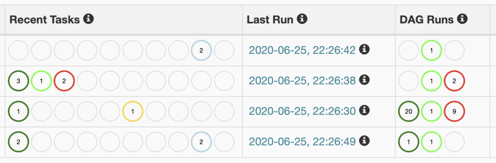
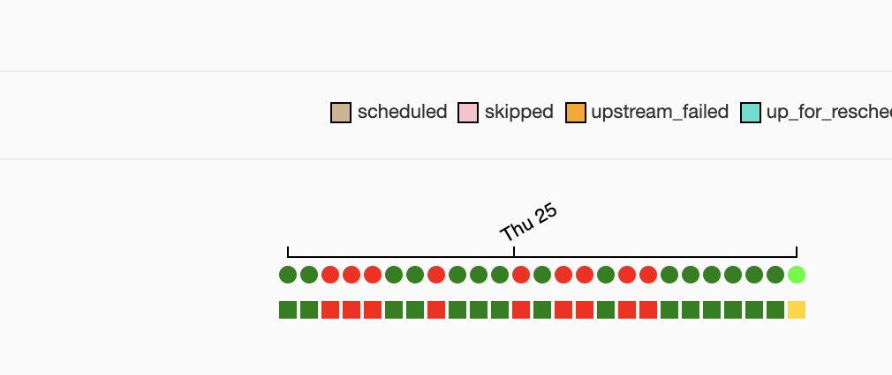
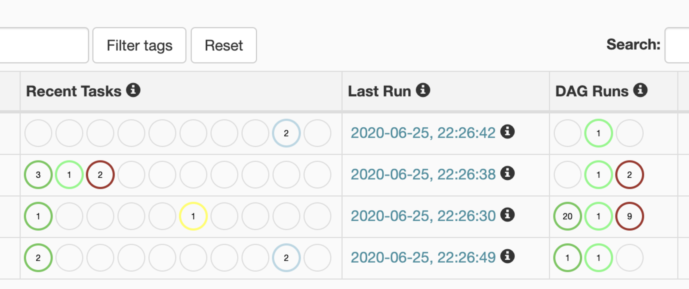
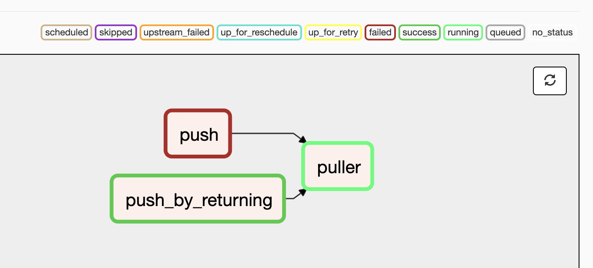
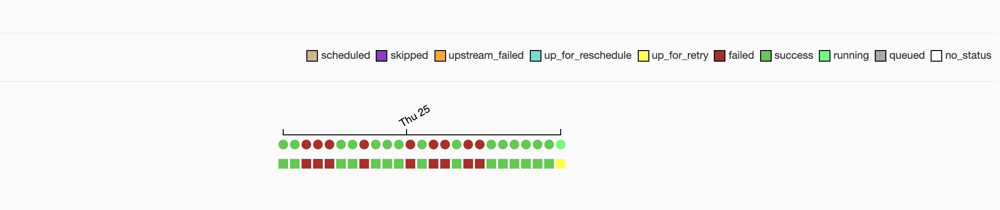
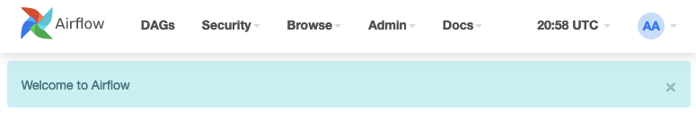

 .. Licensed to the Apache Software Foundation (ASF) under one
    or more contributor license agreements.  See the NOTICE file
    distributed with this work for additional information
    regarding copyright ownership.  The ASF licenses this file
    to you under the Apache License, Version 2.0 (the
    "License"); you may not use this file except in compliance
    with the License.  You may obtain a copy of the License at

 ..   http://www.apache.org/licenses/LICENSE-2.0

 .. Unless required by applicable law or agreed to in writing,
    software distributed under the License is distributed on an
    "AS IS" BASIS, WITHOUT WARRANTIES OR CONDITIONS OF ANY
    KIND, either express or implied.  See the License for the
    specific language governing permissions and limitations
    under the License.

Customizing the UI
==================

Customizing state colours
-------------------------

.. versionadded:: 1.10.11

To change the colors for TaskInstance/DagRun State in the Airflow Webserver, perform the
following steps:

1.  Create ``airflow_local_settings.py`` file and put in on ``$PYTHONPATH`` or
    to ``$AIRFLOW_HOME/config`` folder. (Airflow adds ``$AIRFLOW_HOME/config`` on ``PYTHONPATH`` when
    Airflow is initialized)

2.  Add the following contents to ``airflow_local_settings.py`` file. Change the colors to whatever you
    would like.

    .. code-block:: python

      STATE_COLORS = {
          "queued": "darkgray",
          "running": "#01FF70",
          "success": "#2ECC40",
          "failed": "firebrick",
          "up_for_retry": "yellow",
          "up_for_reschedule": "turquoise",
          "upstream_failed": "orange",
          "skipped": "darkorchid",
          "scheduled": "tan",
          "deferred": "mediumpurple",
      }

3.  Restart Airflow Webserver.

Screenshots
^^^^^^^^^^^

Before
""""""

.. image:: ../img/change-ui-colors/graph-view-old.png

After
""""""

.. note::

    See :doc:`../modules_management` for details on how Python and Airflow manage modules.

Customizing DAG UI Header and Airflow Page Titles
-------------------------------------------------

Airflow now allows you to customize the DAG home page header and page title. This will help
distinguish between various installations of Airflow or simply amend the page text.

.. note::

    The custom title will be applied to both the page header and the page title.

To make this change, simply:

1.  Add the configuration option of ``instance_name`` under the ``[webserver]`` section inside ``airflow.cfg``:

.. code-block::

  [webserver]

  instance_name = "DevEnv"

2.  Alternatively, you can set a custom title using the environment variable:

.. code-block::

  AIRFLOW__WEBSERVER__INSTANCE_NAME = "DevEnv"

Screenshots
^^^^^^^^^^^

Before
""""""

.. image:: ../img/change-site-title/default_instance_name_configuration.png

After
"""""

.. image:: ../img/change-site-title/example_instance_name_configuration.png

.. note::

    From version 2.3.0 you can include markup in ``instance_name`` variable for further customization. To enable, set ``instance_name_has_markup`` under the ``[webserver]`` section inside ``airflow.cfg`` to ``True``.

Add custom alert messages on the dashboard
------------------------------------------

.. versionadded:: 2.2.0

Extra alert messages can be shown on the UI dashboard. This can be useful for warning about setup issues
or announcing changes to end users. The following example shows how to add a simple alert message:

1.  Create ``airflow_local_settings.py`` file and put in on ``$PYTHONPATH`` or
    to ``$AIRFLOW_HOME/config`` folder. (Airflow adds ``$AIRFLOW_HOME/config`` on ``PYTHONPATH`` when
    Airflow is initialized)

2.  Add the following contents to ``airflow_local_settings.py`` file.

    .. code-block:: python

      from airflow.www.utils import UIAlert

      DASHBOARD_UIALERTS = [
          UIAlert("Welcome to Airflow"),
      ]

3.  Restart Airflow Webserver, and you should now see:

You can also control the category of the alert message as well the roles it should be shown to.
For example, to show a warning message to users in the ``User`` role:

    .. code-block:: python

      DASHBOARD_UIALERTS = [
          UIAlert("Airflow update happening next week", category="warning", roles=["User"]),
      ]

HTML can also be included in the messages, though care must be taken to ensure it is done safely.
If your message is safe, you can simply set ``html=True``, otherwise use string formatting. For more
information, see `String Formatting in the MarkupSafe docs <https://markupsafe.palletsprojects.com/en/2.0.x/formatting/>`__.

    .. code-block:: python

      DASHBOARD_UIALERTS = [
          UIAlert(
              'Visit <a href="https://airflow.apache.org">airflow.apache.org</a>', html=True
          ),
          UIAlert(Markup("Welcome <em>%s</em>") % ("John & Jane Doe",)),
      ]
