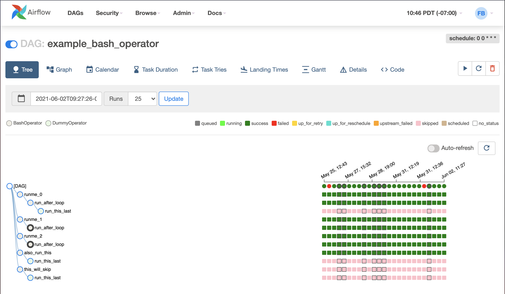
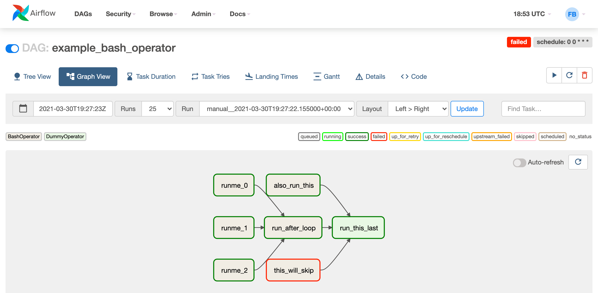
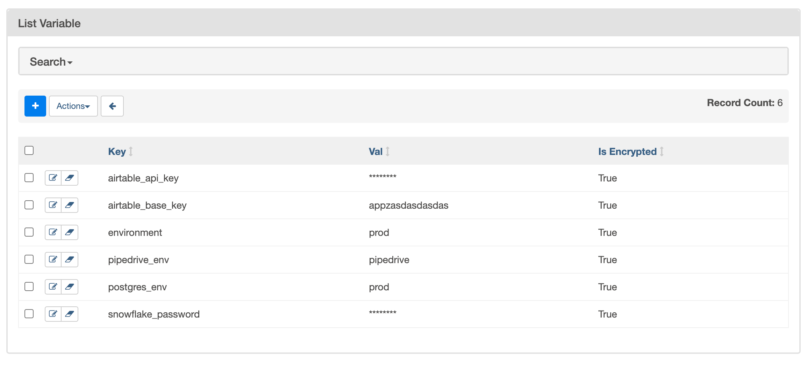
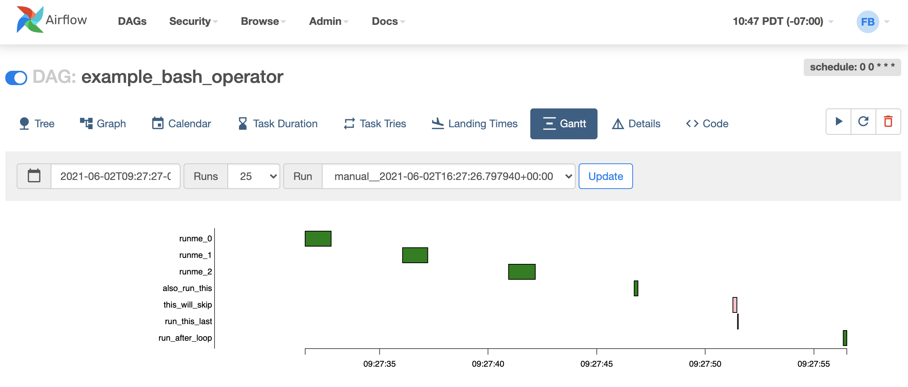
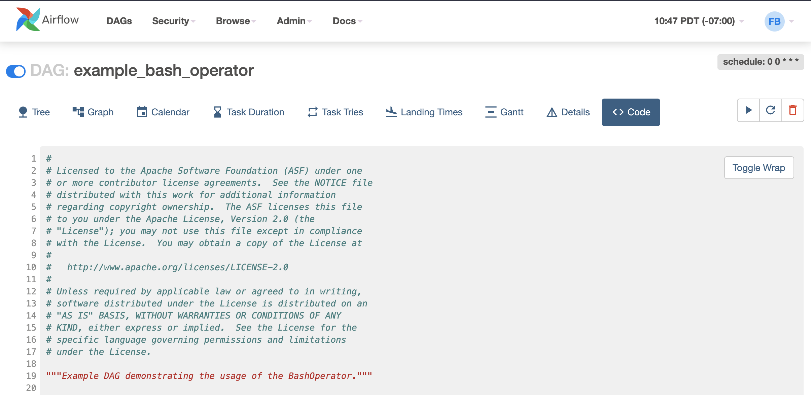

 .. Licensed to the Apache Software Foundation (ASF) under one
    or more contributor license agreements.  See the NOTICE file
    distributed with this work for additional information
    regarding copyright ownership.  The ASF licenses this file
    to you under the Apache License, Version 2.0 (the
    "License"); you may not use this file except in compliance
    with the License.  You may obtain a copy of the License at

 ..   http://www.apache.org/licenses/LICENSE-2.0

 .. Unless required by applicable law or agreed to in writing,
    software distributed under the License is distributed on an
    "AS IS" BASIS, WITHOUT WARRANTIES OR CONDITIONS OF ANY
    KIND, either express or implied.  See the License for the
    specific language governing permissions and limitations
    under the License.

UI / Screenshots
=================
The Airflow UI makes it easy to monitor and troubleshoot your data pipelines.
Here's a quick overview of some of the features and visualizations you
can find in the Airflow UI.

DAGs View
.........
List of the DAGs in your environment, and a set of shortcuts to useful pages.
You can see exactly how many tasks succeeded, failed, or are currently
running at a glance. To hide completed tasks set show_recent_stats_for_completed_runs = False

In order to filter DAGs (e.g by team), you can add tags in each dag.
The filter is saved in a cookie and can be reset by the reset button.
For example:

.. code-block:: python

   dag = DAG('dag', tags=['team1', 'sql'])

------------

.. image:: img/dags.png

------------

Tree View
.........
A tree representation of the DAG that spans across time. If a pipeline is
late, you can quickly see where the different steps are and identify
the blocking ones.

There is also visual difference between scheduled and manually triggered
DAGs/tasks:

.. image:: img/task_manual_vs_scheduled.png

The DAGs/tasks with a black border are scheduled runs, whereas the non-bordered
DAGs/tasks are manually triggered, i.e. by ``airflow dags trigger``.

------------

------------

.. _ui:graph-view:

Graph View
..........
The graph view is perhaps the most comprehensive. Visualize your DAG's
dependencies and their current status for a specific run.

------------

------------

Variable View
.............
The variable view allows you to list, create, edit or delete the key-value pair
of a variable used during jobs. Value of a variable will be hidden if the key contains
any words in ('password', 'secret', 'passwd', 'authorization', 'api_key', 'apikey', 'access_token')
by default, but can be configured to show in clear-text (by configuration option
``hide_sensitive_variable_fields``).

Users can also extend this list by using the following configurations option:

.. code-block:: ini

    [admin]
    sensitive_variable_fields = comma_separated_sensitive_variable_fields_list

------------

------------

Gantt Chart
...........
The Gantt chart lets you analyse task duration and overlap. You can quickly
identify bottlenecks and where the bulk of the time is spent for specific
DAG runs.

------------

------------

Task Duration
.............
The duration of your different tasks over the past N runs. This view lets
you find outliers and quickly understand where the time is spent in your
DAG over many runs.

------------

.. image:: img/duration.png

------------

Code View
.........
Transparency is everything. While the code for your pipeline is in source
control, this is a quick way to get to the code that generates the DAG and
provide yet more context.

------------

------------

Task Instance Context Menu
..........................
From the pages seen above (tree view, graph view, gantt, ...), it is always
possible to click on a task instance, and get to this rich context menu
that can take you to more detailed metadata, and perform some actions.

------------

.. image:: img/context.png
