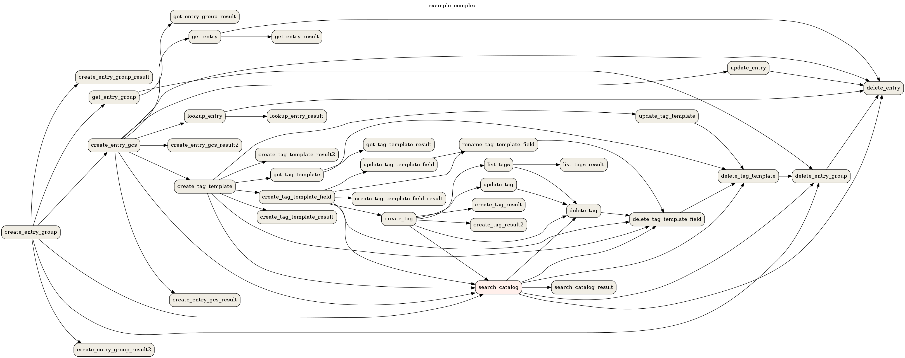

 .. Licensed to the Apache Software Foundation (ASF) under one
    or more contributor license agreements.  See the NOTICE file
    distributed with this work for additional information
    regarding copyright ownership.  The ASF licenses this file
    to you under the Apache License, Version 2.0 (the
    "License"); you may not use this file except in compliance
    with the License.  You may obtain a copy of the License at

 ..   http://www.apache.org/licenses/LICENSE-2.0

 .. Unless required by applicable law or agreed to in writing,
    software distributed under the License is distributed on an
    "AS IS" BASIS, WITHOUT WARRANTIES OR CONDITIONS OF ANY
    KIND, either express or implied.  See the License for the
    specific language governing permissions and limitations
    under the License.

Using the Command Line Interface
================================

This document is meant to give an overview of all common tasks while using the CLI.

.. note::
    For more information on CLI commands, see :doc:`cli-and-env-variables-ref`

.. _cli-remote:

Set Up connection to a remote Airflow instance
----------------------------------------------

For some functions the CLI can use :doc:`the REST API <rest-api-ref>`. To configure the CLI to use the API
when available configure as follows:

.. code-block:: ini

    [cli]
    api_client = airflow.api.client.json_client
    endpoint_url = http://<WEBSERVER>:<PORT>

Set Up Bash/Zsh Completion
--------------------------

When using bash (or ``zsh``) as your shell, ``airflow`` can use
`argcomplete <https://argcomplete.readthedocs.io/>`_ for auto-completion.

For `global activation <https://github.com/kislyuk/argcomplete#activating-global-completion>`_ of all argcomplete enabled python applications run:

.. code-block:: bash

  sudo activate-global-python-argcomplete

For permanent (but not global) airflow activation, use:

.. code-block:: bash

  register-python-argcomplete airflow >> ~/.bashrc

For one-time activation of argcomplete for airflow only, use:

.. code-block:: bash

  eval "$(register-python-argcomplete airflow)"

.. image:: img/cli_completion.gif

If you’re using ``zsh``, add the following to your ``.zshrc``:

.. code-block:: bash

  autoload bashcompinit
  bashcompinit
  eval "$(register-python-argcomplete airflow)"

Creating a Connection
---------------------

For information on creating connections using the CLI, see :ref:`connection/cli`

Exporting DAG structure as an image
-----------------------------------

Airflow lets you print or save your DAG structure as an image. This is useful for documenting or sharing your DAG structure. You'll need to have `Graphviz <https://graphviz.gitlab.io/download/>`_ installed.

For example, to print the ``example_complex`` DAG to the terminal:

.. code-block:: bash

  airflow dags show example_complex

This will print the rendered DAG structure (similar to :ref:`Graph View <ui:graph-view>`) to the screen in DOT format.

Multiple file formats are supported. To use them, add the argument ``--save [filename].[format]``.

To save the ``example_complex`` DAG as a PNG file:

.. code-block:: bash

  airflow dags show example_complex --save example_complex.png

This will save the following image as a file:

    Example DAG representation

The following file formats are supported:

 * ``bmp``
 * ``canon``, ``dot``, ``gv``, ``xdot``, ``xdot1.2``, ``xdot1.4``
 * ``cgimage``
 * ``cmap``
 * ``eps``
 * ``exr``
 * ``fig``
 * ``gd``, ``gd2``
 * ``gif``
 * ``gtk``
 * ``ico``
 * ``imap``, ``cmapx``
 * ``imap_np``, ``cmapx_np``
 * ``ismap``
 * ``jp2``
 * ``jpg``, ``jpeg``, ``jpe``
 * ``json``, ``json0``, ``dot_json``, ``xdot_json``
 * ``pct``, ``pict``
 * ``pdf``
 * ``pic``
 * ``plain``, ``plain-ext``
 * ``png``
 * ``pov``
 * ``ps``
 * ``ps2``
 * ``psd``
 * ``sgi``
 * ``svg``, ``svgz``
 * ``tga``
 * ``tif``, ``tiff``
 * ``tk``
 * ``vml``, ``vmlz``
 * ``vrml``
 * ``wbmp``
 * ``webp``
 * ``xlib``
 * ``x11``

By default, Airflow looks for DAGs in the directory specified by the ``dags_folder`` option in the
``[core]`` section of the ``airflow.cfg`` file. You can select a new directory with the ``--subdir`` argument.

Display DAGs structure
----------------------

Sometimes you will work on DAGs that contain complex dependencies. It is helpful then to preview
the DAG to see if it is correct.

If you have macOS, you can use `iTerm2 <https://iterm2.com/>`__ together with
the `imgcat <https://www.iterm2.com/documentation-images.html>`__ script to display the DAG structure in the
console. You also need to have `Graphviz <https://graphviz.gitlab.io/download/>`_ installed.

Other terminals do not support the display of high-quality graphics. You can convert the image to a text
form, but its resolution will prevent you from reading it.

To do this, you should use the ``--imgcat`` switch in the ``airflow dags show`` command. For example, if you
want to display ``example_bash_operator`` DAG  then you can use the following command:

.. code-block:: bash

  airflow dags show example_bash_operator --imgcat

You will see a similar result as in the screenshot below.

.. figure:: img/usage_cli_imgcat.png

    Preview of DAG in iTerm2

Formatting commands output
--------------------------

Some Airflow commands like ``airflow dags list`` or ``airflow tasks states-for-dag-run`` support ``--output`` flag
which allow users to change the formatting of command's output. Possible options:

  - ``table`` - renders the information as a plain text table
  - ``simple`` - renders the information as simple table which can be parsed by standard linux utilities
  - ``json`` - renders the information in form of json string
  - ``yaml`` - render the information in form of valid yaml

Both ``json`` and ``yaml`` formats make it easier to manipulate the data using command line tools like
`jq <https://stedolan.github.io/jq/>`__ or `yq <https://kislyuk.github.io/yq/>`__. For example:

.. code-block:: bash

  airflow tasks states-for-dag-run example_complex 2020-11-13T00:00:00+00:00 --output json | jq ".[] | {sd: .start_date, ed: .end_date}"
  {
    "sd": "2020-11-29T14:53:46.811030+00:00",
    "ed": "2020-11-29T14:53:46.974545+00:00"
  }
  {
    "sd": "2020-11-29T14:53:56.926441+00:00",
    "ed": "2020-11-29T14:53:57.118781+00:00"
  }
  {
    "sd": "2020-11-29T14:53:56.915802+00:00",
    "ed": "2020-11-29T14:53:57.125230+00:00"
  }
  {
    "sd": "2020-11-29T14:53:56.922131+00:00",
    "ed": "2020-11-29T14:53:57.129091+00:00"
  }
  {
    "sd": "2020-11-29T14:53:56.931243+00:00",
    "ed": "2020-11-29T14:53:57.126306+00:00"
  }
