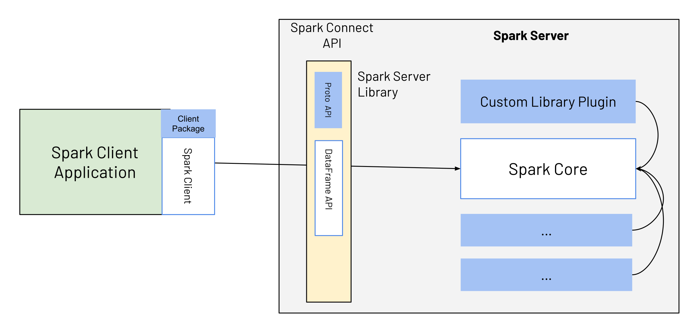
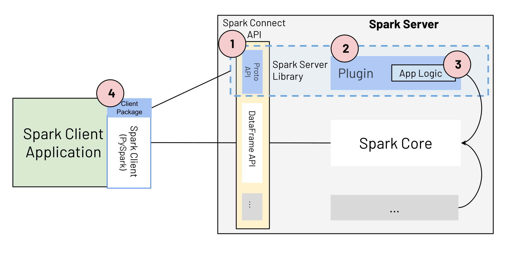

**Spark Connect Overview**

In Apache Spark 3.4, Spark Connect introduced a decoupled client-server
architecture that allows remote connectivity to Spark clusters using the
DataFrame API and unresolved logical plans as the protocol. The separation
between client and server allows Spark and its open ecosystem to be
leveraged from everywhere. It can be embedded in modern data applications,
in IDEs, Notebooks and programming languages.

To learn more about Spark Connect, see [Spark Connect Overview](spark-connect-overview.html).

# Redefining Spark Applications using Spark Connect

With its decoupled client-server architecture, Spark Connect simplifies how Spark Applications are
developed.
The notion of Spark Client Applications and Spark Server Libraries are introduced as follows: 
* _Spark Client Applications_ are regular Spark applications that use Spark and its rich ecosystem for
distributed data processing. Examples include ETL pipelines, data preparation, and model training
and inference.
* _Spark Server Libraries_ build on, extend, and complement Spark's functionality, e.g.
[MLlib](ml-guide.html) (distributed ML libraries that use Spark's powerful distributed processing). Spark Connect
can be extended to expose client-side interfaces for Spark Server Libraries.

With Spark 3.4 and Spark Connect, the development of Spark Client Applications is simplified, and
clear extension points and guidelines are provided on how to build Spark Server Libraries, making
it easy for both types of applications to evolve alongside Spark. As illustrated in Fig.1, Spark
Client applications connect to Spark using the Spark Connect API, which is essentially the
DataFrame API and fully declarative.

  

Spark Server Libraries extend Spark. They typically provide additional server-side logic integrated
with Spark, which is exposed to client applications as part of the Spark Connect API, using Spark
Connect extension points. For example, the _Spark Server Library_ consists of custom
service-side logic (as indicated by the blue box labeled _Custom Library Plugin_), which is exposed
to the client via the blue box as part of the Spark Connect API. The client uses this API, e.g.,
alongside PySpark or the Spark Scala client, making it easy for Spark client applications to work
with the custom logic/library. 

## Spark Client Applications

Spark Client Applications are the _regular Spark applications_ that Spark users develop today, e.g.,
ETL pipelines, data preparation, or model training or inference. These are typically built using
Sparks declarative DataFrame and DataSet APIs. With Spark Connect, the core behaviour remains the
same, but there are a few differences: 
* Lower-level, non-declarative APIs (RDDs) can no longer be directly used from Spark Client
applications. Alternatives for missing RDD functionality are provided as part of the higher-level
DataFrame API.
* Client applications no longer have direct access to the Spark driver JVM; they are fully
separated from the server. 

Client applications based on Spark Connect can be submitted in the same way as any previous job.
In addition, Spark Client Applications based on Spark Connect have several benefits compared to
classic Spark applications using earlier Spark versions (3.4 and below): 
* _Upgradability_: Upgrading to new Spark Server versions is seamless, as the Spark Connect API
abstracts any changes/improvements on the server side. Client- and server APIs are cleanly
separated.
* _Simplicity_: The number of APIs exposed to the user is reduced from 3 to 2. The Spark Connect API
is fully declarative and consequently easy to learn for new users familiar with SQL.
* _Stability_: When using Spark Connect, the client applications no longer run on the Spark driver
and, therefore don’t cause and are not affected by any instability on the server.
* _Remote connectivity_: The decoupled architecture allows remote connectivity to Spark beyond SQL
and JDBC: any application can now interactively use Spark “as a service”.
* _Backwards compatibility_: The Spark Connect API is code-compatible with earlier Spark versions,
except for the usage of RDDs, for which a list of alternative APIs is provided in Spark Connect. 

## Spark Server Libraries

Until Spark 3.4, extensions to Spark (e.g., [Spark ML](ml-guide#:~:text=What%20is%20%E2%80%9CSpark%20ML%E2%80%9D%3F,to%20emphasize%20the%20pipeline%20concept.)
or [Spark-NLP](https://github.com/JohnSnowLabs/spark-nlp)) were built and deployed like Spark
Client Applications. With Spark 3.4 and Spark Connect,  explicit extension points are offered to
extend Spark via Spark Server Libraries. These extension points provide functionality that can be
exposed to a client, which differs from existing extension points in Spark such as
[SparkSession extensions](api/java/org/apache/spark/sql/SparkSessionExtensions.html) or
[Spark Plugins](api/java/org/apache/spark/api/plugin/SparkPlugin.html). 

### Getting Started: Extending Spark with Spark Server Libraries

Spark Connect is available and supports PySpark and Scala
applications. We will walk through how to run an Apache Spark server with Spark
Connect and connect to it from a client application using the Spark Connect client
library.

A Spark Server Library consists of the following components, illustrated in Fig. 2:

1. The Spark Connect protocol extension (blue box _Proto_ API)
2. A Spark Connect Plugin.
3. The application logic that extends Spark.
4. The client package that exposes the Spark Server Library application logic to the Spark Client
Application, alongside PySpark or the Scala Spark Client. 

  

 

#### (1) Spark Connect Protocol Extension

To extend Spark with a new Spark Server Library, developers can extend the three main operation
types in the Spark Connect protocol: _Relation_, _Expression_, and _Command_. 


message Relation {
  oneof rel_type {
    Read read = 1;
    // ...
    google.protobuf.Any extension = 998;
  } 
}

message Expression {
  oneof expr_type {
    Literal literal = 1;
    // ...
    google.protobuf.Any extension = 999;
  } 
}

message Command {
  oneof command_type {
    WriteCommand write_command = 1;
    // ...
    google.protobuf.Any extension = 999;
  } 
} 

Their extension fields allow serializing arbitrary protobuf messages as part of the Spark Connect
protocol. These messages represent the parameters or state of the extension implementation.
To build a custom expression type, the developer first defines the custom protobuf definition
of the expression.


message ExamplePluginExpression {
  Expression child = 1;
  string custom_field = 2;
}


#### (2) Spark Connect Plugin implementation with (3) custom application logic

As a next step, the developer implements the _ExpressionPlugin_ class of Spark Connect with custom
application logic based on the input parameters of the protobuf message. 

class ExampleExpressionPlugin extends ExpressionPlugin {
  override def transform(
      relation: protobuf.Any,
      planner: SparkConnectPlanner): Option[Expression] = {
    // Check if the serialized value of protobuf.Any matches the type
    // of our example expression.
    if (!relation.is(classOf[proto.ExamplePluginExpression])) {
      return None
    }
    val exp = relation.unpack(classOf[proto.ExamplePluginExpression])
    Some(Alias(planner.transformExpression(
        exp.getChild), exp.getCustomField)(explicitMetadata = None))
  }
}
 

Once the application logic is developed, the code must be packaged as a jar and Spark must be
configured to pick up the additional logic. The relevant Spark configuration options are: 
* _spark.jars_ which define the location of the Jar file containing the application logic built for
the custom expression. 
* _spark.connect.extensions.expression.classes_ specifying the full class name
of each expression extension loaded by Spark. Based on these configuration options, Spark will
load the values at startup and make them available for processing.

#### (4) Spark Server Library Client Package

Once the server component is deployed, any client can use it with the right protobuf messages.
In the example above, the following message payload sent to the Spark Connect endpoint would be
enough to trigger the extension mechanism.

{
  "project": {
    "input": {
      "sql": {
        "query": "select * from samples.nyctaxi.trips"
      }
    },
    "expressions": [
      {
        "extension": {
          "typeUrl": "type.googleapis.com/spark.connect.ExamplePluginExpression",
          "value": "\n\006\022\004\n\002id\022\006testval"
        }
      }
    ]
  }
} 
 
To make the example available in Python, the application developer provides a Python library that
wraps the new expression and embeds it into PySpark. The easiest way to provide a function for any
expression is to take a PySpark column instance as an argument and return a new Column instance
with the expression applied. 


from pyspark.sql.connect.column import Expression
import pyspark.sql.connect.proto as proto

from myxample.proto import ExamplePluginExpression

# Internal class that satisfies the interface by the Python client
# of Spark Connect to generate the protobuf representation from
# an instance of the expression.
class ExampleExpression(Expression):
    def to_plan(self, session) -> proto.Expression:
        fun = proto.Expression()
        plugin = ExamplePluginExpression()
        plugin.child.literal.long = 10
        plugin.custom_field = "example"
        fun.extension.Pack(plugin)
        return fun

# Defining the function to be used from the consumers.
def example_expression(col: Column) -> Column:
    return Column(ExampleExpression())

# Using the expression in the Spark Connect client code.
df = spark.read.table("samples.nyctaxi.trips")
df.select(example_expression(df["fare_amount"])).collect()
 