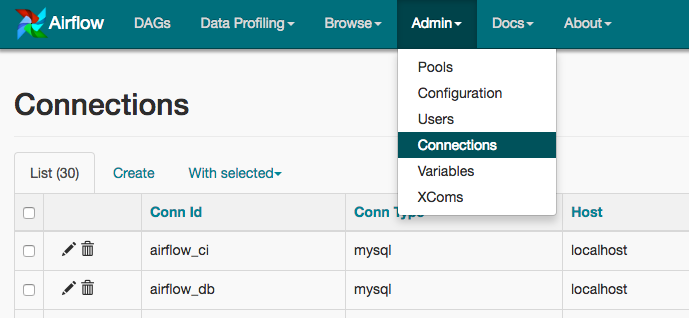

Configuration
-------------

Setting up the sandbox in the :doc:`start` section was easy;
building a production-grade environment requires a bit more work!

.. _setting-options:

Setting Configuration Options
'''''''''''''''''''''''''''''

The first time you run Airflow, it will create a file called ``airflow.cfg`` in
your ``$AIRFLOW_HOME`` directory (``~/airflow`` by default). This file contains Airflow's configuration and you
can edit it to change any of the settings. You can also set options with environment variables by using this format:
``$AIRFLOW__{SECTION}__{KEY}`` (note the double underscores).

For example, the
metadata database connection string can either be set in ``airflow.cfg`` like this:

.. code-block:: bash

    [core]
    sql_alchemy_conn = my_conn_string

or by creating a corresponding environment variable:

.. code-block:: bash

    AIRFLOW__CORE__SQL_ALCHEMY_CONN=my_conn_string

You can also derive the connection string at run time by appending ``_cmd`` to the key like this:

.. code-block:: bash

    [core]
    sql_alchemy_conn_cmd = bash_command_to_run

But only three such configuration elements namely sql_alchemy_conn, broker_url and celery_result_backend can be fetched as a command. The idea behind this is to not store passwords on boxes in plain text files. The order of precedence is as follows -

1. environment variable
2. configuration in airflow.cfg
3. command in airflow.cfg
4. default

Setting up a Backend
''''''''''''''''''''
If you want to take a real test drive of Airflow, you should consider
setting up a real database backend and switching to the LocalExecutor.

As Airflow was built to interact with its metadata using the great SqlAlchemy
library, you should be able to use any database backend supported as a
SqlAlchemy backend. We recommend using **MySQL** or **Postgres**.

.. note:: If you decide to use **Postgres**, we recommend using the ``psycopg2``
   driver and specifying it in your SqlAlchemy connection string.
   Also note that since SqlAlchemy does not expose a way to target a
   specific schema in the Postgres connection URI, you may
   want to set a default schema for your role with a
   command similar to ``ALTER ROLE username SET search_path = airflow, foobar;``

Once you've setup your database to host Airflow, you'll need to alter the
SqlAlchemy connection string located in your configuration file
``$AIRFLOW_HOME/airflow.cfg``. You should then also change the "executor"
setting to use "LocalExecutor", an executor that can parallelize task
instances locally.

.. code-block:: bash

    # initialize the database
    airflow initdb

Connections
'''''''''''
Airflow needs to know how to connect to your environment. Information
such as hostname, port, login and passwords to other systems and services is
handled in the ``Admin->Connection`` section of the UI. The pipeline code you
will author will reference the 'conn_id' of the Connection objects.

By default, Airflow will save the passwords for the connection in plain text
within the metadata database. The ``crypto`` package is highly recommended
during installation. The ``crypto`` package does require that your operating
system have libffi-dev installed.

If ``crypto`` package was not installed initially, you can still enable encryption for
connections by following steps below:

1. Install crypto package ``pip install apache-airflow[crypto]``
2. Generate fernet_key, using this code snippet below. fernet_key must be a base64-encoded 32-byte key.

.. code:: python

    from cryptography.fernet import Fernet
    fernet_key= Fernet.generate_key()
    print(fernet_key) # your fernet_key, keep it in secured place!

3. Replace ``airflow.cfg`` fernet_key value with the one from step 2.
Alternatively, you can store your fernet_key in OS environment variable. You
do not need to change ``airflow.cfg`` in this case as AirFlow will use environment
variable over the value in ``airflow.cfg``:

.. code-block:: bash

  # Note the double underscores
  EXPORT AIRFLOW__CORE__FERNET_KEY = your_fernet_key

4. Restart AirFlow webserver.
5. For existing connections (the ones that you had defined before installing ``airflow[crypto]`` and creating a Fernet key), you need to open each connection in the connection admin UI, re-type the password, and save it.

Connections in Airflow pipelines can be created using environment variables.
The environment variable needs to have a prefix of ``AIRFLOW_CONN_`` for
Airflow with the value in a URI format to use the connection properly. Please
see the :doc:`concepts` documentation for more information on environment
variables and connections.

Scaling Out with Celery
'''''''''''''''''''''''
``CeleryExecutor`` is one of the ways you can scale out the number of workers. For this
to work, you need to setup a Celery backend (**RabbitMQ**, **Redis**, ...) and
change your ``airflow.cfg`` to point the executor parameter to
``CeleryExecutor`` and provide the related Celery settings.

For more information about setting up a Celery broker, refer to the
exhaustive `Celery documentation on the topic <http://docs.celeryproject.org/en/latest/getting-started/brokers/index.html>`_.

Here are a few imperative requirements for your workers:

- ``airflow`` needs to be installed, and the CLI needs to be in the path
- Airflow configuration settings should be homogeneous across the cluster
- Operators that are executed on the worker need to have their dependencies
  met in that context. For example, if you use the ``HiveOperator``,
  the hive CLI needs to be installed on that box, or if you use the
  ``MySqlOperator``, the required Python library needs to be available in
  the ``PYTHONPATH`` somehow
- The worker needs to have access to its ``DAGS_FOLDER``, and you need to
  synchronize the filesystems by your own means. A common setup would be to
  store your DAGS_FOLDER in a Git repository and sync it across machines using
  Chef, Puppet, Ansible, or whatever you use to configure machines in your
  environment. If all your boxes have a common mount point, having your
  pipelines files shared there should work as well

To kick off a worker, you need to setup Airflow and kick off the worker
subcommand

.. code-block:: bash

    airflow worker

Your worker should start picking up tasks as soon as they get fired in
its direction.

Note that you can also run "Celery Flower", a web UI built on top of Celery,
to monitor your workers. You can use the shortcut command ``airflow flower``
to start a Flower web server.

Scaling Out with Dask
'''''''''''''''''''''

``DaskExecutor`` allows you to run Airflow tasks in a Dask Distributed cluster.

Dask clusters can be run on a single machine or on remote networks. For complete
details, consult the `Distributed documentation <https://distributed.readthedocs.io/>`_.

To create a cluster, first start a Scheduler:

.. code-block:: bash

    # default settings for a local cluster
    DASK_HOST=127.0.0.1
    DASK_PORT=8786

    dask-scheduler --host $DASK_HOST --port $DASK_PORT

Next start at least one Worker on any machine that can connect to the host:

.. code-block:: bash

    dask-worker $DASK_HOST:$DASK_PORT

Edit your ``airflow.cfg`` to set your executor to ``DaskExecutor`` and provide
the Dask Scheduler address in the ``[dask]`` section.

Please note:

- Each Dask worker must be able to import Airflow and any dependencies you
  require.
- Dask does not support queues. If an Airflow task was created with a queue, a
  warning will be raised but the task will be submitted to the cluster.

Logs
''''
Users can specify a logs folder in ``airflow.cfg``. By default, it is in
the ``AIRFLOW_HOME`` directory.

In addition, users can supply a remote location for storing logs and log backups
in cloud storage. At this time, Amazon S3 and Google Cloud Storage are supported.
To enable this feature, ``airflow.cfg`` must be configured as in this example:

.. code-block:: bash

    [core]
    # Airflow can store logs remotely in AWS S3 or Google Cloud Storage. Users
    # must supply a remote location URL (starting with either 's3://...' or
    # 'gs://...') and an Airflow connection id that provides access to the storage
    # location.
    remote_base_log_folder = s3://my-bucket/path/to/logs
    remote_log_conn_id = MyS3Conn
    # Use server-side encryption for logs stored in S3
    encrypt_s3_logs = False

Remote logging uses an existing Airflow connection to read/write logs. If you don't
have a connection properly setup, this will fail. In the above example, Airflow will
try to use ``S3Hook('MyS3Conn')``.

In the Airflow Web UI, local logs take precedance over remote logs. If local logs
can not be found or accessed, the remote logs will be displayed. Note that logs
are only sent to remote storage once a task completes (including failure). In other
words, remote logs for running tasks are unavailable. Logs are stored in the log
folder as ``{dag_id}/{task_id}/{execution_date}/{try_number}.log``.

Scaling Out on Mesos (community contributed)
''''''''''''''''''''''''''''''''''''''''''''
``MesosExecutor`` allows you to schedule airflow tasks on a Mesos cluster.
For this to work, you need a running mesos cluster and you must perform the following
steps -

1. Install airflow on a machine where web server and scheduler will run,
   let's refer to this as the "Airflow server".
2. On the Airflow server, install mesos python eggs from `mesos downloads <http://open.mesosphere.com/downloads/mesos/>`_.
3. On the Airflow server, use a database (such as mysql) which can be accessed from mesos
   slave machines and add configuration in ``airflow.cfg``.
4. Change your ``airflow.cfg`` to point executor parameter to
   `MesosExecutor` and provide related Mesos settings.
5. On all mesos slaves, install airflow. Copy the ``airflow.cfg`` from
   Airflow server (so that it uses same sql alchemy connection).
6. On all mesos slaves, run the following for serving logs:

.. code-block:: bash

    airflow serve_logs

7. On Airflow server, to start processing/scheduling DAGs on mesos, run:

.. code-block:: bash

    airflow scheduler -p

Note: We need -p parameter to pickle the DAGs.

You can now see the airflow framework and corresponding tasks in mesos UI.
The logs for airflow tasks can be seen in airflow UI as usual.

For more information about mesos, refer to `mesos documentation <http://mesos.apache.org/documentation/latest/>`_.
For any queries/bugs on `MesosExecutor`, please contact `@kapil-malik <https://github.com/kapil-malik>`_.

Integration with systemd
''''''''''''''''''''''''
Airflow can integrate with systemd based systems. This makes watching your
daemons easy as systemd can take care of restarting a daemon on failure.
In the ``scripts/systemd`` directory you can find unit files that
have been tested on Redhat based systems. You can copy those to
``/usr/lib/systemd/system``. It is assumed that Airflow will run under
``airflow:airflow``. If not (or if you are running on a non Redhat
based system) you probably need to adjust the unit files.

Environment configuration is picked up from ``/etc/sysconfig/airflow``.
An example file is supplied. Make sure to specify the ``SCHEDULER_RUNS``
variable in this file when you run the scheduler. You
can also define here, for example, ``AIRFLOW_HOME`` or ``AIRFLOW_CONFIG``.

Integration with upstart
''''''''''''''''''''''''
Airflow can integrate with upstart based systems. Upstart automatically starts all airflow services for which you
have a corresponding ``*.conf`` file in ``/etc/init`` upon system boot. On failure, upstart automatically restarts
the process (until it reaches re-spawn limit set in a ``*.conf`` file).

You can find sample upstart job files in the ``scripts/upstart`` directory. These files have been tested on
Ubuntu 14.04 LTS. You may have to adjust ``start on`` and ``stop on`` stanzas to make it work on other upstart
systems. Some of the possible options are listed in ``scripts/upstart/README``.

Modify ``*.conf`` files as needed and copy to ``/etc/init`` directory. It is assumed that airflow will run
under ``airflow:airflow``. Change ``setuid`` and ``setgid`` in ``*.conf`` files if you use other user/group

You can use ``initctl`` to manually start, stop, view status of the airflow process that has been
integrated with upstart

.. code-block:: bash

    initctl airflow-webserver status

Test Mode
'''''''''
Airflow has a fixed set of "test mode" configuration options. You can load these
at any time by calling ``airflow.configuration.load_test_config()`` (note this
operation is not reversible!). However, some options (like the DAG_FOLDER) are
loaded before you have a chance to call load_test_config(). In order to eagerly load
the test configuration, set test_mode in airflow.cfg:

.. code-block:: bash

  [tests]
  unit_test_mode = True

Due to Airflow's automatic environment variable expansion (see :ref:`setting-options`),
you can also set the env var ``AIRFLOW__CORE__UNIT_TEST_MODE`` to temporarily overwrite
airflow.cfg.
