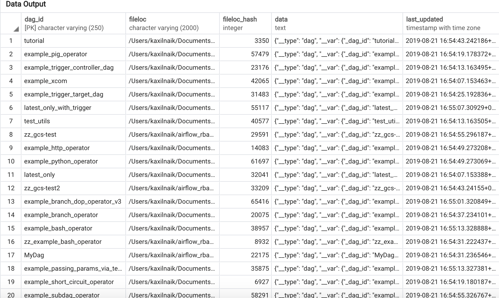

 .. Licensed to the Apache Software Foundation (ASF) under one
    or more contributor license agreements.  See the NOTICE file
    distributed with this work for additional information
    regarding copyright ownership.  The ASF licenses this file
    to you under the Apache License, Version 2.0 (the
    "License"); you may not use this file except in compliance
    with the License.  You may obtain a copy of the License at

 ..   http://www.apache.org/licenses/LICENSE-2.0

 .. Unless required by applicable law or agreed to in writing,
    software distributed under the License is distributed on an
    "AS IS" BASIS, WITHOUT WARRANTIES OR CONDITIONS OF ANY
    KIND, either express or implied.  See the License for the
    specific language governing permissions and limitations
    under the License.

DAG Serialization
=================

In order to make Airflow Webserver stateless, Airflow >=1.10.7 supports
DAG Serialization and DB Persistence.

.. image:: img/dag_serialization.png

Without DAG Serialization & persistence in DB, the Webserver and the Scheduler both
needs access to the DAG files. Both the scheduler and webserver parses the DAG files.

With **DAG Serialization** we aim to decouple the webserver from DAG parsing
which would make the Webserver very light-weight.

As shown in the image above, when using the this feature,
the Scheduler parses the DAG files, serializes them in JSON format and saves them in the Metadata DB.

The Webserver now instead of having to parse the DAG file again, reads the
serialized DAGs in JSON, de-serializes them and create the DagBag and uses it
to show in the UI.

One of the key features that is implemented as the part of DAG Serialization is that
instead of loading an entire DagBag when the WebServer starts we only load each DAG on demand from the
Serialized Dag table. This helps reduce Webserver startup time and memory. The reduction is notable
when you have large number of DAGs.

Below is the screenshot of the ``serialized_dag`` table in Metadata DB:

Enable Dag Serialization
------------------------

Add the following settings in ``airflow.cfg``:

.. code-block:: ini

    [core]
    store_serialized_dags = True
    min_serialized_dag_update_interval = 30

*   ``store_serialized_dags``: This flag decides whether to serialises DAGs and persist them in DB.
    If set to True, Webserver reads from DB instead of parsing DAG files
*   ``min_serialized_dag_update_interval``: This flag sets the minimum interval (in seconds) after which
    the serialized DAG in DB should be updated. This helps in reducing database write rate.

If you are updating Airflow from <1.10.7, please do not forget to run ``airflow db upgrade``.

Limitations
-----------

*   When using user-defined filters and macros, the Rendered View in the Webserver might show incorrect results
    for TIs that have not yet executed as it might be using external modules that Webserver wont have access to.
    Use ``airflow tasks render`` cli command in such situation to debug or test rendering of you template_fields.
    Once the tasks execution starts the Rendered Template Fields will be stored in the DB in a separate table and
    after which the correct values would be showed in the Webserver (Rendered View tab).
*   **Code View** will read the DAG File & show it using Pygments.
    However, it does not need to Parse the Python file so it is still a small operation.

.. note::
    You need Airflow >= 1.10.10 for completely stateless Webserver.
    Airflow 1.10.7 to 1.10.9 needed access to Dag files in some cases.
    More Information: http://airflow.apache.org/docs/stable/dag-serialization.html#limitations

Using a different JSON Library
------------------------------

To use a different JSON library instead of the standard ``json`` library like ``ujson``, you need to
define a ``json`` variable in local Airflow settings (``airflow_local_settings.py``) file as follows:

.. code:: python

    import ujson
    json = ujson
