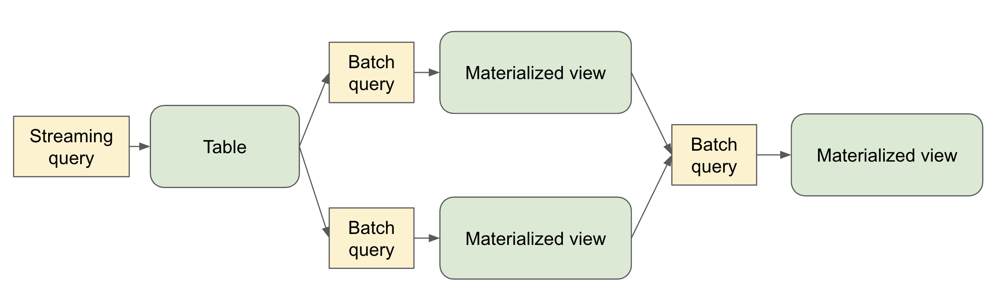

* Table of contents
{:toc}

## What is Spark Declarative Pipelines (SDP)?

Spark Declarative Pipelines (SDP) is a declarative framework for building reliable, maintainable, and testable data pipelines on Apache Spark. SDP simplifies ETL development by allowing you to focus on the transformations you want to apply to your data, rather than the mechanics of pipeline execution.

SDP is designed for both batch and streaming data processing, supporting common use cases such as:
- Data ingestion from cloud storage (Amazon S3, Azure ADLS Gen2, Google Cloud Storage)
- Data ingestion from message buses (Apache Kafka, Amazon Kinesis, Google Pub/Sub, Azure EventHub)
- Incremental batch and streaming transformations

The key advantage of SDP is its declarative approach - you define what tables should exist and what their contents should be, and SDP handles the orchestration, compute management, and error handling automatically.



### Quick install

A quick way to install SDP is with pip:

```
pip install pyspark[pipelines]
```

See the [downloads page](//spark.apache.org/downloads.html) for more installation options.

## Key Concepts

### Flows

A flow is the foundational data processing concept in SDP which supports both streaming and batch semantics. A flow reads data from a source, applies user-defined processing logic, and writes the result into a target dataset.

For example, when you author a query like:

```sql
CREATE STREAMING TABLE target_table AS
SELECT * FROM STREAM source_table
```

SDP creates the table named `target_table` along with a flow that reads new data from `source_table` and writes it to `target_table`.

### Datasets

A dataset is a queryable object that's the output of one of more flows within a pipeline. Flows in the pipeline can also read from datasets produced in the pipeline.

- **Streaming Table** – a definition of a table and one or more streaming flows written into it. Streaming tables support incremental processing of data, allowing you to process only new data as it arrives.
- **Materialized View** – a view that is precomputed into a table. A materialized view always has exactly one batch flow writing to it.
- **Temporary View** – a view that is scoped to an execution of the pipeline. It can be referenced from flows within the pipeline. It's useful for encapsulating transformations and intermediate logical entities that multiple other elements of the pipeline depend on.

### Pipelines

A pipeline is the primary unit of development and execution in SDP. A pipeline can contain one or more flows, streaming tables, and materialized views. While your pipeline runs, it analyzes the dependencies of your defined objects and orchestrates their order of execution and parallelization automatically.

### Pipeline Projects

A pipeline project is a set of source files that contain code definitions of the datasets and flows that make up a pipeline. The source files can be `.py` or `.sql` files.

It's conventional to name pipeline spec files `spark-pipeline.yml` or `spark-pipeline.yaml`.

A YAML-formatted pipeline spec file contains the top-level configuration for the pipeline project with the following fields:

- **name** (Required) - The name of the pipeline project.
- **libraries** (Required) - The paths with the transformation source files in SQL or Python.
- **storage** (Required) – A directory where checkpoints can be stored for streaming tables within the pipeline.
- **database** (Optional) - The default target database for pipeline outputs. **schema** can alternatively be used as an alias.
- **catalog** (Optional) - The default target catalog for pipeline outputs.
- **configuration** (Optional) - Map of Spark configuration properties.

An example pipeline spec file:

```yaml
name: my_pipeline
libraries:
  - glob:
      include: transformations/**
storage: file:///absolute/path/to/storage/dir
catalog: my_catalog
database: my_db
configuration:
  spark.sql.shuffle.partitions: "1000"
```

The `spark-pipelines init` command, described below, makes it easy to generate a pipeline project with default configuration and directory structure.

## The `spark-pipelines` Command Line Interface

The `spark-pipelines` command line interface (CLI) is the primary way to manage a pipeline.

`spark-pipelines` is built on top of `spark-submit`, meaning that it supports all cluster managers supported by `spark-submit`. It supports all `spark-submit` arguments except for `--class`.

### `spark-pipelines init`

`spark-pipelines init --name my_pipeline` generates a simple pipeline project, inside a directory named `my_pipeline`, including a spec file and example transformation definitions.

### `spark-pipelines run`

`spark-pipelines run` launches an execution of a pipeline and monitors its progress until it completes.

Since `spark-pipelines` is built on top of `spark-submit`, it supports all `spark-submit` arguments except for `--class`. For the complete list of available parameters, see the [Spark Submit documentation](https://spark.apache.org/docs/latest/submitting-applications.html#launching-applications-with-spark-submit).

It also supports several pipeline-specific parameters:

* `--spec PATH` - Path to the pipeline specification file. If not provided, the CLI will look in the current directory and parent directories for one of the files:
  * `spark-pipeline.yml`
  * `spark-pipeline.yaml`

* `--full-refresh DATASETS` - List of datasets to reset and recompute (comma-separated). This clears all existing data and checkpoints for the specified datasets and recomputes them from scratch.

* `--full-refresh-all` - Perform a full graph reset and recompute. This is equivalent to `--full-refresh` for all datasets in the pipeline.

* `--refresh DATASETS` - List of datasets to update (comma-separated). This triggers an update for the specified datasets without clearing existing data.

#### Refresh Selection Behavior

If no refresh options are specified, a default incremental update is performed. The refresh parameters are mutually exclusive:
- `--full-refresh-all` cannot be combined with `--full-refresh` or `--refresh`
- `--full-refresh` and `--refresh` can be used together to specify different behaviors for different datasets

#### Examples

```bash
# Basic run with default incremental update
spark-pipelines run

# Run with specific spec file
spark-pipelines run --spec /path/to/my-pipeline.yaml

# Full refresh of specific datasets
spark-pipelines run --full-refresh orders,customers

# Full refresh of entire pipeline
spark-pipelines run --full-refresh-all

# Run with custom Spark configuration
spark-pipelines run --conf spark.sql.shuffle.partitions=200 --driver-memory 4g

# Run on remote Spark Connect server
spark-pipelines run --remote sc://my-cluster:15002
```

### `spark-pipelines dry-run`

`spark-pipelines dry-run` launches an execution of a pipeline that doesn't write or read any data, but catches many kinds of errors that would be caught if the pipeline were to actually run. E.g.
- Syntax errors – e.g. invalid Python or SQL code
- Analysis errors – e.g. selecting from a table or a column that doesn't exist
- Graph validation errors - e.g. cyclic dependencies

Since `spark-pipelines` is built on top of `spark-submit`, it supports all `spark-submit` arguments except for `--class`. For the complete list of available parameters, see the [Spark Submit documentation](https://spark.apache.org/docs/latest/submitting-applications.html#launching-applications-with-spark-submit).

It also supports the pipeline-specific `--spec` parameter (see description above in the `run` section).

## Programming with SDP in Python

SDP Python definitions are defined in the `pyspark.pipelines` module.

Your pipelines implemented with the Python API must import this module. It's recommended to alias the module to `dp`.

```python
from pyspark import pipelines as dp
```

### Creating a Materialized View in Python

The `@dp.materialized_view` decorator tells SDP to create a materialized view based on the results of a function that performs a batch read:

```python
from pyspark import pipelines as dp
from pyspark.sql import DataFrame

@dp.materialized_view
def basic_mv() -> DataFrame:
    return spark.table("samples.nyctaxi.trips")
```

The name of the materialized view is derived from the name of the function.

You can specify the name of the materialized view using the `name` argument:

```python
from pyspark import pipelines as dp
from pyspark.sql import DataFrame

@dp.materialized_view(name="trips_mv")
def basic_mv() -> DataFrame:
    return spark.table("samples.nyctaxi.trips")
```

### Creating a Temporary View in Python

The `@dp.temporary_view` decorator tells SDP to create a temporary view based on the results of a function that performs a batch read:

```python
from pyspark import pipelines as dp
from pyspark.sql import DataFrame

@dp.temporary_view
def basic_tv() -> DataFrame:
    return spark.table("samples.nyctaxi.trips")
```

This temporary view can be read by other queries within the pipeline, but can't be read outside the scope of the pipeline.

### Creating a Streaming Table in Python

You can create a streaming table using the `@dp.table` decorator with a function that performs a streaming read:

```python
from pyspark import pipelines as dp
from pyspark.sql import DataFrame

@dp.table
def basic_st() -> DataFrame:
    return spark.readStream.table("samples.nyctaxi.trips")
```

### Loading Data from Streaming Sources in Python

SDP supports loading data from all the formats supported by Spark Structured Streaming (`spark.readStream`).

For example, you can create a streaming table whose query reads from a Kafka topic:

```python
from pyspark import pipelines as dp
from pyspark.sql import DataFrame

@dp.table
def ingestion_st() -> DataFrame:
    return (
        spark.readStream
        .format("kafka")
        .option("kafka.bootstrap.servers", "localhost:9092")
        .option("subscribe", "orders")
        .load()
    )
```

### Loading Data from Batch Sources in Python

SDP supports loading data from all the formats supported by Spark SQL (`spark.read`).

```python
from pyspark import pipelines as dp
from pyspark.sql import DataFrame

@dp.materialized_view
def batch_mv() -> DataFrame:
    return spark.read.format("json").load("/datasets/retail-org/sales_orders")
```

### Querying Tables Defined in a Pipeline in Python

You can reference other tables defined in your pipeline in the same way you'd reference tables defined outside your pipeline:

```python
from pyspark import pipelines as dp
from pyspark.sql import DataFrame
from pyspark.sql.functions import col

@dp.table
def orders() -> DataFrame:
    return (
        spark.readStream
        .format("kafka")
        .option("kafka.bootstrap.servers", "localhost:9092")
        .option("subscribe", "orders")
        .load()
    )

@dp.materialized_view
def customers() -> DataFrame:
    return (
        spark.read
        .format("csv")
        .option("header", True)
        .load("/datasets/retail-org/customers")
    )

@dp.materialized_view
def customer_orders() -> DataFrame:
    return (
        spark.table("orders")
        .join(
            spark.table("customers"), "customer_id")
            .select(
                "customer_id",
                "order_number",
                "state",
                col("order_datetime").cast("date").alias("order_date"),
            )
        )
    )

@dp.materialized_view
def daily_orders_by_state() -> DataFrame:
    return (
        spark.table("customer_orders")
        .groupBy("state", "order_date")
        .count()
        .withColumnRenamed("count", "order_count")
    )
```

### Creating Tables in For Loop in Python

You can use Python `for` loops to create multiple tables programmatically:

```python
from pyspark import pipelines as dp
from pyspark.sql import DataFrame
from pyspark.sql.functions import collect_list, col

@dp.temporary_view()
def customer_orders() -> DataFrame:
    orders = spark.table("samples.tpch.orders")
    customer = spark.table("samples.tpch.customer")

    return (
        orders
        .join(customer, orders.o_custkey == customer.c_custkey)
        .select(
            col("c_custkey").alias("custkey"),
            col("c_name").alias("name"),
            col("c_nationkey").alias("nationkey"),
            col("c_phone").alias("phone"),
            col("o_orderkey").alias("orderkey"),
            col("o_orderstatus").alias("orderstatus"),
            col("o_totalprice").alias("totalprice"),
            col("o_orderdate").alias("orderdate"),
        )
    )

@dp.temporary_view()
def nation_region() -> DataFrame:
    nation = spark.table("samples.tpch.nation")
    region = spark.table("samples.tpch.region")

    return (
        nation
        .join(region, nation.n_regionkey == region.r_regionkey)
        .select(
            col("n_name").alias("nation"),
            col("r_name").alias("region"),
            col("n_nationkey").alias("nationkey"),
        )
    )

# Extract region names from region table
region_list = spark.table("samples.tpch.region").select(collect_list("r_name")).collect()[0][0]

# Iterate through region names to create new region-specific materialized views
for region in region_list:
    @dp.table(name=f"{region.lower().replace(' ', '_')}_customer_orders")
    def regional_customer_orders(region_filter=region) -> DataFrame:
        customer_orders = spark.table("customer_orders")
        nation_region = spark.table("nation_region")

        return (
            customer_orders
            .join(nation_region, customer_orders.nationkey == nation_region.nationkey)
            .select(
                col("custkey"),
                col("name"),
                col("phone"),
                col("nation"),
                col("region"),
                col("orderkey"),
                col("orderstatus"),
                col("totalprice"),
                col("orderdate"),
            )
            .filter(f"region = '{region_filter}'")
        )
```

### Using Multiple Flows to Write to a Single Target in Python

You can create multiple flows that append data to the same dataset:

```python
from pyspark import pipelines as dp
from pyspark.sql import DataFrame

# create a streaming table
dp.create_streaming_table("customers_us")

# define the first append flow
@dp.append_flow(target = "customers_us")
def append_customers_us_west() -> DataFrame:
    return spark.readStream.table("customers_us_west")

# define the second append flow
@dp.append_flow(target = "customers_us")
def append_customers_us_east() -> DataFrame:
    return spark.readStream.table("customers_us_east")
```

## Programming with SDP in SQL

### Creating a Materialized View in SQL

The basic syntax for creating a materialized view with SQL is:

```sql
CREATE MATERIALIZED VIEW basic_mv
AS SELECT * FROM samples.nyctaxi.trips;
```

### Creating a Temporary View in SQL

The basic syntax for creating a temporary view with SQL is:

```sql
CREATE TEMPORARY VIEW basic_tv
AS SELECT * FROM samples.nyctaxi.trips;
```

### Creating a Streaming Table in SQL

When creating a streaming table, use the `STREAM` keyword to indicate streaming semantics for the source:

```sql
CREATE STREAMING TABLE basic_st
AS SELECT * FROM STREAM samples.nyctaxi.trips;
```

### Querying Tables Defined in a Pipeline in SQL

You can reference other tables defined in your pipeline:

```sql
CREATE STREAMING TABLE orders
AS SELECT * FROM STREAM orders_source;

CREATE MATERIALIZED VIEW customers
AS SELECT * FROM customers_source;

CREATE MATERIALIZED VIEW customer_orders
AS SELECT
  c.customer_id,
  o.order_number,
  c.state,
  date(timestamp(int(o.order_datetime))) order_date
FROM orders o
INNER JOIN customers c
ON o.customer_id = c.customer_id;

CREATE MATERIALIZED VIEW daily_orders_by_state
AS SELECT state, order_date, count(*) order_count
FROM customer_orders
GROUP BY state, order_date;
```

### Using Multiple Flows to Write to a Single Target in SQL

You can create multiple flows that append data to the same target:

```sql
-- create a streaming table
CREATE STREAMING TABLE customers_us;

-- define the first append flow
CREATE FLOW append_customers_us_west
AS INSERT INTO customers_us
SELECT * FROM STREAM(customers_us_west);

-- define the second append flow
CREATE FLOW append_customers_us_east
AS INSERT INTO customers_us
SELECT * FROM STREAM(customers_us_east);
```

## Writing Data to External Targets with Sinks

Sinks in SDP provide a way to write transformed data to external destinations beyond the default streaming tables and materialized views. Sinks are particularly useful for operational use cases that require low-latency data processing, reverse ETL operations, or writing to external systems. 

Sinks enable a pipeline to write to any destination that a Spark Structured Streaming query can be written to, including, but not limited to, **Apache Kafka** and **Azure Event Hubs**.

### Creating and Using Sinks in Python

Working with sinks involves two main steps: creating the sink definition and implementing an append flow to write data.

#### Creating a Kafka Sink

You can create a sink that streams data to a Kafka topic:

```python
from pyspark import pipelines as dp
from pyspark.sql.functions import to_json, struct

dp.create_sink(
    name="kafka_sink",
    format="kafka",
    options={
        "kafka.bootstrap.servers": "localhost:9092",
        "topic": "processed_orders"
    }
)

@dp.append_flow(target="kafka_sink")
def kafka_orders_flow() -> DataFrame:
    return (
        spark.readStream.table("customer_orders")
        .select(
            col("order_id").cast("string").alias("key"),
            to_json(struct("*")).alias("value")
        )
    )
```

### Sink Considerations

When working with sinks, keep the following considerations in mind:

- **Streaming-only**: Sinks currently support only streaming queries through `append_flow` decorators
- **Python API**: Sink functionality is available only through the Python API, not SQL
- **Append-only**: Only append operations are supported; full refresh updates reset checkpoints but do not clean previously computed results

## Important Considerations

### Python Considerations

- SDP evaluates the code that defines a pipeline multiple times during planning and pipeline runs. Python functions that define datasets should include only the code required to define the table or view.
- The function used to define a dataset must return a `pyspark.sql.DataFrame`.
- Never use methods that save or write to files or tables as part of your SDP dataset code.
- When using the `for` loop pattern to define datasets in Python, ensure that the list of values passed to the `for` loop is always additive.

Examples of Spark SQL operations that should never be used in SDP code:

- `collect()`
- `count()`
- `pivot()`
- `toPandas()`
- `save()`
- `saveAsTable()`
- `start()`
- `toTable()`

### SQL Considerations

- The `PIVOT` clause is not supported in SDP SQL.
