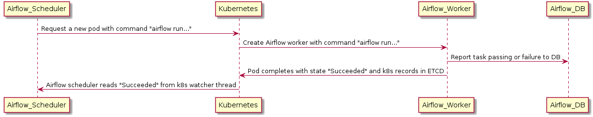

 .. Licensed to the Apache Software Foundation (ASF) under one
    or more contributor license agreements.  See the NOTICE file
    distributed with this work for additional information
    regarding copyright ownership.  The ASF licenses this file
    to you under the Apache License, Version 2.0 (the
    "License"); you may not use this file except in compliance
    with the License.  You may obtain a copy of the License at

 ..   http://www.apache.org/licenses/LICENSE-2.0

 .. Unless required by applicable law or agreed to in writing,
    software distributed under the License is distributed on an
    "AS IS" BASIS, WITHOUT WARRANTIES OR CONDITIONS OF ANY
    KIND, either express or implied.  See the License for the
    specific language governing permissions and limitations
    under the License.

.. _executor:KubernetesExecutor:

Kubernetes Executor
===================

The kubernetes executor is introduced in Apache Airflow 1.10.0. The Kubernetes executor will create a new pod for every task instance.

Example kubernetes files are available at ``scripts/in_container/kubernetes/app/{secrets,volumes,postgres}.yaml`` in the source distribution (please note that these examples are not ideal for production environments).
The volumes are optional and depend on your configuration. There are two volumes available:

- **Dags**:

  - By storing dags onto persistent disk, it will be made available to all workers

  - Another option is to use ``git-sync``. Before starting the container, a git pull of the dags repository will be performed and used throughout the lifecycle of the pod

- **Logs**:

  - By storing logs onto a persistent disk, the files are accessible by workers and the webserver. If you don't configure this, the logs will be lost after the worker pods shuts down

  - Another option is to use S3/GCS/etc to store logs

KubernetesExecutor Architecture
################################

The KubernetesExecutor runs as a process in the Scheduler that only requires access to the Kubernetes API (it does *not* need to run inside of a Kubernetes cluster). The KubernetesExecutor requires a non-sqlite database in the backend, but there are no external brokers or persistent workers needed.
For these reasons, we recommend the KubernetesExecutor for deployments have long periods of dormancy between DAG execution.

When a DAG submits a task, the KubernetesExecutor requests a worker pod from the Kubernetes API. The worker pod then runs the task, reports the result, and terminates.

.. image:: ../img/arch-diag-kubernetes.png

In contrast to the Celery Executor, the Kubernetes Executor does not require additional components such as Redis and Flower, but does require the Kubernetes infrastructure.

One example of an Airflow deployment running on a distributed set of five nodes in a Kubernetes cluster is shown below. 

.. image:: ../img/arch-diag-kubernetes2.png

The Kubernetes Executor has an advantage over the Celery Executor in that Pods are only spun up when required for task execution compared to the Celery Executor where the workers are statically configured and are running all the time, regardless of workloads. However, this could be a disadvantage depending on the latency needs, since a task takes longer to start using the Kubernetes Executor, since it now includes the Pod startup time.

Consistent with the regular Airflow architecture, the Workers need access to the DAG files to execute the tasks within those DAGs and interact with the Metadata repository. Also, configuration information specific to the Kubernetes Executor, such as the worker namespace and image information, needs to be specified in the Airflow Configuration file.

Additionally, the Kubernetes Executor enables specification of additional features on a per-task basis using the Executor config.

.. @startuml
.. Airflow_Scheduler -> Kubernetes: Request a new pod with command "airflow run..."
.. Kubernetes -> Airflow_Worker: Create Airflow worker with command "airflow run..."
.. Airflow_Worker -> Airflow_DB: Report task passing or failure to DB
.. Airflow_Worker -> Kubernetes: Pod completes with state "Succeeded" and k8s records in ETCD
.. Kubernetes -> Airflow_Scheduler: Airflow scheduler reads "Succeeded" from k8s watcher thread
.. @enduml

***************
Fault Tolerance
***************

===========================
Handling Worker Pod Crashes
===========================

When dealing with distributed systems, we need a system that assumes that any component can crash at any moment for reasons ranging from OOM errors to node upgrades.

In the case where a worker dies before it can report its status to the backend DB, the executor can use a Kubernetes watcher thread to discover the failed pod.

.. @startuml
..
.. Airflow_Scheduler -> Kubernetes: Request a new pod with command "airflow run..."
.. Kubernetes -> Airflow_Worker: Create Airflow worker with command "airflow run..."
.. Airflow_Worker -> Airflow_Worker: Pod fails before task can complete
.. Airflow_Worker -> Kubernetes: Pod completes with state "Failed" and k8s records in ETCD
.. Kubernetes -> Airflow_Scheduler: Airflow scheduler reads "Failed" from k8s watcher thread
.. Airflow_Scheduler -> Airflow_DB: Airflow scheduler records "FAILED" state to DB for task
..
.. @enduml

.. image:: ../img/k8s-failed-pod.png

A Kubernetes watcher is a thread that can subscribe to every change that occurs in Kubernetes' database. It is alerted when pods start, run, end, and fail.
By monitoring this stream, the KubernetesExecutor can discover that the worker crashed and correctly report the task as failed.

=====================================================
But What About Cases Where the Scheduler Pod Crashes?
=====================================================

In cases of scheduler crashes, we can completely rebuild the state of the scheduler using the watcher's ``resourceVersion``.

When monitoring the Kubernetes cluster's watcher thread, each event has a monotonically rising number called a resourceVersion.
Every time the executor reads a resourceVersion, the executor stores the latest value in the backend database.
Because the resourceVersion is stored, the scheduler can restart and continue reading the watcher stream from where it left off.
Since the tasks are run independently of the executor and report results directly to the database, scheduler failures will not lead to task failures or re-runs.
