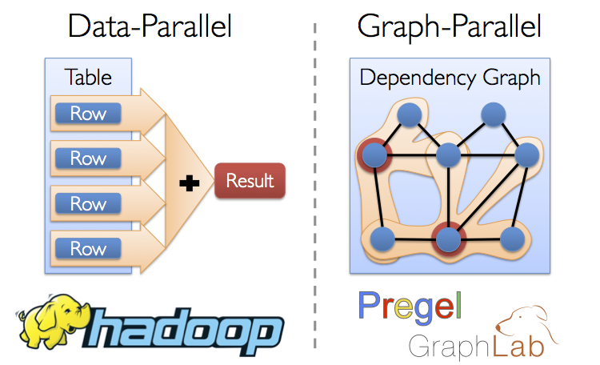
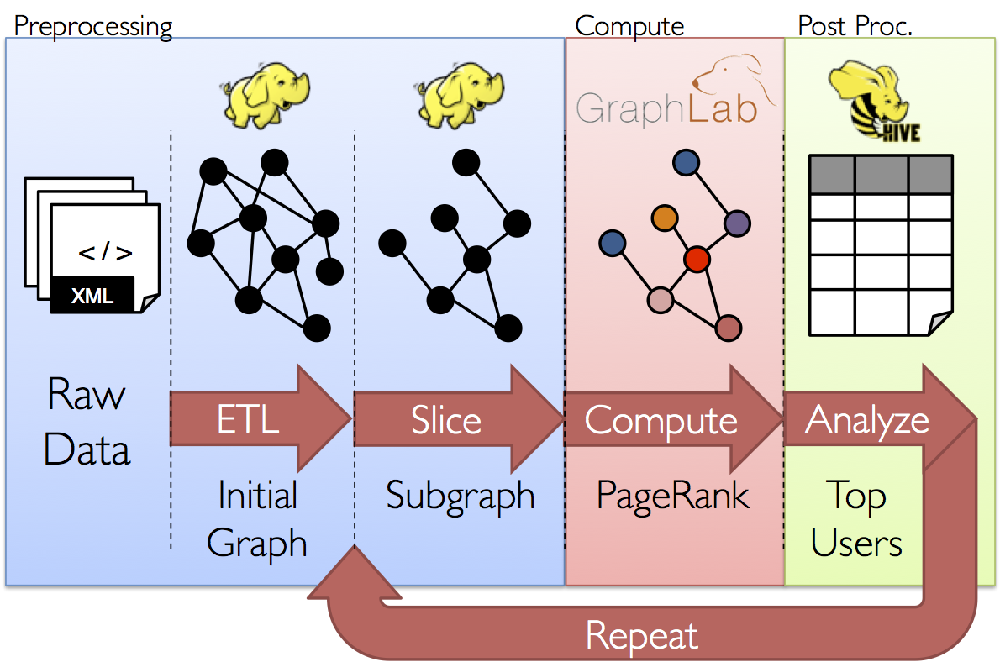
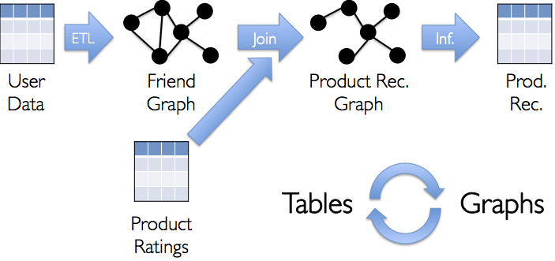

* This will become a table of contents (this text will be scraped).
{:toc}

  
  <!-- Images are downsized intentionally to improve quality on retina displays -->

# Overview

GraphX is the new (alpha) Spark API for graphs and graph-parallel
computation. At a high-level, GraphX extends the Spark
[RDD](api/core/index.html#org.apache.spark.rdd.RDD) by
introducing the [Resilient Distributed property Graph (RDG)](#property_graph):
a directed graph with properties attached to each vertex and edge.
To support graph computation, GraphX exposes a set of functions
(e.g., [mapReduceTriplets](#mrTriplets)) as well as optimized variants of the
[Pregel](http://giraph.apache.org) and [GraphLab](http://graphlab.org)
APIs. In addition, GraphX includes a growing collection of graph
[algorithms](#graph_algorithms) and [builders](#graph_builders) to simplify
graph analytics tasks.

## Background on Graph-Parallel Computation

From social networks to language modeling, the growing scale and importance of
graph data has driven the development of numerous new *graph-parallel* systems
(e.g., [Giraph](http://http://giraph.apache.org) and
[GraphLab](http://graphlab.org)).  By restricting the types of computation that can be
expressed and introducing new techniques to partition and distribute graphs,
these systems can efficiently execute sophisticated graph algorithms orders of
magnitude faster than more general *data-parallel* systems.

  
  <!-- Images are downsized intentionally to improve quality on retina displays -->

However, the same restrictions that enable these substantial performance gains
also make it difficult to express many of the important stages in a typical graph-analytics pipeline:
constructing the graph, modifying its structure, or expressing computation that
spans multiple graphs.  As a consequence, existing graph analytics pipelines
compose graph-parallel and data-parallel systems, leading to extensive data
movement and duplication and a complicated programming model.

  
  <!-- Images are downsized intentionally to improve quality on retina displays -->

The goal of the GraphX project is to unify graph-parallel and data-parallel
computation in one system with a single composable API. The GraphX API
enables users to view data both as a graph and as
collection (i.e., RDDs) without data movement or duplication. By
incorporating recent advances in graph-parallel systems, GraphX is able to optimize
the execution of graph operations.

## GraphX Replaces the Spark Bagel API

Prior to the release of GraphX, graph computation in Spark was expressed using
Bagel, an implementation of the Pregel API.  GraphX improves upon Bagel by
exposing a richer property graph API, a more streamlined version of the Pregel
abstraction, and system optimizations to improve performance and reduce memory
overhead.  While we plan to eventually deprecate the Bagel, we will continue to
support the [Bagel API](api/bagel/index.html#org.apache.spark.bagel.package) and
[Bagel programming guide](bagel-programming-guide.html). However, we encourage
Bagel users to explore the new GraphX API and comment on issues that may
complicate the transition from Bagel.

# Getting Started

To get started you first need to import Spark and GraphX into your project.  This can be done by
importing the following:


import org.apache.spark._
import org.apache.spark.graphx._


If you are not using the Spark shell you will also need a Spark context.

# The Property Graph

The [property graph](api/graphx/index.html#org.apache.spark.graphx.Graph) is a directed graph with
user defined objects attached to each vertex and edge.  Like RDDs, property graphs are immutable,
distributed, and fault-tolerant. Vertices are keyed by their vertex identifier (`VertexId`) which is
a unique 64-bit long. Similarly, edges have corresponding source and destination vertex identifiers.
Unlike other systems, GraphX does not impose any ordering or constraints on the vertex identifiers.

The property graph is parameterized over the vertex `VD` and edge `ED` types.  These are the types
of the objects associated with each vertex and edge respectively.  In some cases it can be desirable
to have vertices of different types.  However, this can be accomplished through inheritance.

> GraphX optimizes the representation of `VD` and `ED` when they are plain old data-types (e.g.,
> int, double, etc...) reducing the memory overhead of the graph representation.

Logically the property graph corresponds to a pair of typed collections (RDDs) encoding the
properties for each vertex and edge:


class Graph[VD: ClassTag, ED: ClassTag] {
  val vertices: RDD[(VertexId, VD)]
  val edges: RDD[Edge[ED]]
  // ...
}

> Note that the vertices and edges of the graph are actually of type `VertexRDD[VD]` and
> `EdgeRDD[ED]` respectively. These types extend and are optimized versions of `RDD[(VertexId, VD)]`
> and `RDD[Edge[ED]]`.

For example, we might construct a property graph consisting of various collaborators on the GraphX
project. The vertex property contains the username and occupation and the edge property contains
a string describing the relationships between the users.

  
  <!-- Images are downsized intentionally to improve quality on retina displays -->

The resulting graph would have the type signature:


val userGraph: Graph[(String, String), String]


There are numerous ways to construct a property graph from raw files, RDDs, and even synthetic
generators and these are discussed in more detail in the section on
[graph builders](#graph_builders).  Probably the most general method is to use the
[graph singleton](api/graphx/index.html#org.apache.spark.graphx.Graph$).
For example the following code constructs a graph from a collection of RDDs:


// Assume the SparkContext has already been constructed
val sc: SparkContext
// Create an RDD for the vertices
val users: RDD[(VertexId, (String, String))] =
  sc.parallelize(Array((3, ("rxin", "student")), (7, ("jgonzal", "postdoc")),
                       (5, ("franklin", "prof")), (2, ("istoica", "prof"))))
// Create an RDD for edges
val relationships: RDD[Edge[String]] =
  sc.parallelize(Array(Edge(3, 7, "collab"), Edge(5, 3, "advisor"),
                       Edge(2, 5, "colleague"), Edge(5, 7, "pi"))
// Define a default user in case there are relationship with missing user
val defaultUser = ("John Doe", "Missing")
// Build the initial Graph
val graph = Graph(users, relationships, defaultUser)


In the above example we make use of the [`Edge`](api/graphx/index.html#org.apache.spark.graphx.Edge)
case class. Edges have a `srcId` and a `dstId` corresponding to the source and destination vertex
identifiers. In addition, the `Edge` class contains the `attr` member which contains the edge
property.

We can deconstruct a graph into the respective vertex and edge views by using the `graph.vertices`
and `graph.edges` members respectively.


val graph: Graph[(String, String), String] // Constructed from above
// Count all users which are postdocs
graph.vertices.filter { case (id, (name, pos)) => pos == "postdoc"}.count
// Count all the edges where src > dst
graph.edges.filter(e => e.srcId > e.dstId).count


> Note that `graph.vertices` returns an `RDD[(VertexId, (String, String))]` and so we must use the
> scala `case` expression to deconstruct the tuple.  Alternatively, `graph.edges` returns an `RDD`
> containing `Edge[String]` objects.  We could have also used the case class type constructor as
> in the following:
> 
graph.edges.filter { case Edge(src, dst, prop) => src < dst }.count


In addition to the vertex and edge views of the property graph, GraphX also exposes a triplet view.
The triplet view logically joins the vertex and edge properties yielding an `RDD[EdgeTriplet[VD,
ED]]` consisting of [`EdgeTriplet`](api/graphx/index.html#org.apache.spark.graphx.EdgeTriplet).
This *join* can be expressed in the following SQL expression:


SELECT src.id, dst.id, src.attr, e.attr, dst.attr
FROM edges AS e LEFT JOIN vertices AS src, vertices AS dst
ON e.srcId = src.Id AND e.dstId = dst.Id


or graphically as:

  
  <!-- Images are downsized intentionally to improve quality on retina displays -->

The [`EdgeTriplet`](api/graphx/index.html#org.apache.spark.graphx.EdgeTriplet) class extends the
[`Edge`](api/graphx/index.html#org.apache.spark.graphx.Edge) class by adding the `srcAttr` and
`dstAttr` members which contain the source and destination properties respectively. We can use the
triplet view of a graph to render a collection of strings describing relationships between users.


val graph: Graph[(String, String), String] // Constructed from above
// Use the triplets view to create an RDD of facts.
val facts: RDD[String] =
  graph.triplets.map(et => et.srcAttr._1 + " is the " + et.attr + " of " et.dstAttr)


# Graph Operators

Just as RDDs have basic operations like `map`, `filter`, and `reduceByKey`, property graphs also
have a collection of basic operators that take user defined function and produce new graphs with
transformed properties and structure.

## Property Operators

In direct analogy to the RDD `map` operator, the property
graph contains the following:


class Graph[VD, ED] {
  def mapVertices[VD2](map: (VertexID, VD) => VD2): Graph[VD2, ED]
  def mapEdges[ED2](map: Edge[ED] => ED2): Graph[VD, ED2]
  def mapTriplets[ED2](map: EdgeTriplet[VD, ED] => ED2): Graph[VD, ED2]
}


Each of these operators yields a new graph with the vertex or edge properties modified by the user
defined `map` function.

> Note that in all cases the graph structure is unaffected.  This is a key feature of these
> operators which allows the resulting graph to reuse the structural indicies and the unaffected
> properties of the original graph.
> While `graph.mapVertices(mapUDF)` is logically equivalent to the following, the following
> does not preserve the structural indicies and would not benefit from the substantial system
> optimizations in GraphX.
> 
val newVertices = graph.vertices.map { case (id, attr) => (id, mapUdf(id, attr))}
val newGraph = Graph(newVertices, graph.edges)


These operators are often used to initialize the graph for a particular computation or project away
unnecessary properties.  For example, given a graph with the out-degrees as the vertex properties
(we describe how to construct such a graph later) we initialize for PageRank:


// Given a graph where the vertex property is the out-degree
val inputGraph: Graph[Int, String]
// Construct a graph where each edge contains the weight
// and each vertex is the initial PageRank
val outputGraph: Graph[Double, Double] =
  inputGraph.mapTriplets(et => 1.0/et.srcAttr).mapVertices(v => 1.0)


## Structural Operators

## Join Operators

## Map Reduce Triplets (mapReduceTriplets)

# Graph Builders


val userGraph: Graph[(String, String), String]


# Optimized Representation

This section should give some intuition about how GraphX works and how that affects the user (e.g.,
things to worry about.)

  
  <!-- Images are downsized intentionally to improve quality on retina displays -->

  
  <!-- Images are downsized intentionally to improve quality on retina displays -->

# Graph Algorithms

This section should describe the various algorithms and how they are used.

## PageRank

## Connected Components

## Shortest Path

## Triangle Counting

## K-Core

## LDA

  
  <!-- Images are downsized intentionally to improve quality on retina displays -->

# Examples

Suppose I want to build a graph from some text files, restrict the graph
to important relationships and users, run page-rank on the sub-graph, and
then finally return attributes associated with the top users.  I can do
all of this in just a few lines with GraphX:


// Connect to the Spark cluster
val sc = new SparkContext("spark://master.amplab.org", "research")

// Load my user data and prase into tuples of user id and attribute list
val users = sc.textFile("hdfs://user_attributes.tsv")
  .map(line => line.split).map( parts => (parts.head, parts.tail) )

// Parse the edge data which is already in userId -> userId format
val followerGraph = Graph.textFile(sc, "hdfs://followers.tsv")

// Attach the user attributes
val graph = followerGraph.outerJoinVertices(users){
  case (uid, deg, Some(attrList)) => attrList
  // Some users may not have attributes so we set them as empty
  case (uid, deg, None) => Array.empty[String]
  }

// Restrict the graph to users which have exactly two attributes
val subgraph = graph.subgraph((vid, attr) => attr.size == 2)

// Compute the PageRank
val pagerankGraph = Analytics.pagerank(subgraph)

// Get the attributes of the top pagerank users
val userInfoWithPageRank = subgraph.outerJoinVertices(pagerankGraph.vertices){
  case (uid, attrList, Some(pr)) => (pr, attrList)
  case (uid, attrList, None) => (pr, attrList)
  }

println(userInfoWithPageRank.top(5))


