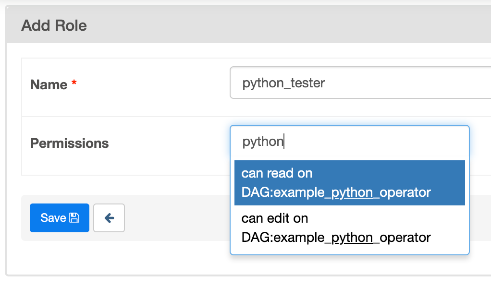

..  Licensed to the Apache Software Foundation (ASF) under one
    or more contributor license agreements.  See the NOTICE file
    distributed with this work for additional information
    regarding copyright ownership.  The ASF licenses this file
    to you under the Apache License, Version 2.0 (the
    "License"); you may not use this file except in compliance
    with the License.  You may obtain a copy of the License at

..    http://www.apache.org/licenses/LICENSE-2.0

..  Unless required by applicable law or agreed to in writing,
    software distributed under the License is distributed on an
    "AS IS" BASIS, WITHOUT WARRANTIES OR CONDITIONS OF ANY
    KIND, either express or implied.  See the License for the
    specific language governing permissions and limitations
    under the License.

Add a new role in RBAC UI
=========================

There are five roles created for Airflow by default: Admin, User, Op, Viewer, and Public.
The master branch adds beta support for DAG level access for RBAC UI. Each DAG comes with two permissions: read and write.

The Admin could create a specific role which is only allowed to read / write certain DAGs. To configure a new role, go to ``Security`` tab
and click ``List Roles`` in the new UI.

.. image:: ../img/new-role.png

The image shows a role which could only write to example_python_operator is created.
And we could assign the given role to a new user using ``airflow users --role`` cli command.
