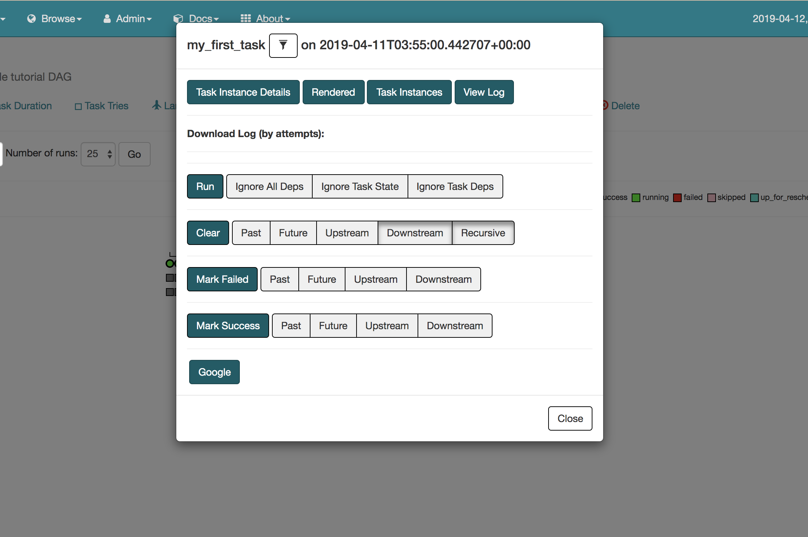

..  Licensed to the Apache Software Foundation (ASF) under one
    or more contributor license agreements.  See the NOTICE file
    distributed with this work for additional information
    regarding copyright ownership.  The ASF licenses this file
    to you under the Apache License, Version 2.0 (the
    "License"); you may not use this file except in compliance
    with the License.  You may obtain a copy of the License at

..    http://www.apache.org/licenses/LICENSE-2.0

..  Unless required by applicable law or agreed to in writing,
    software distributed under the License is distributed on an
    "AS IS" BASIS, WITHOUT WARRANTIES OR CONDITIONS OF ANY
    KIND, either express or implied.  See the License for the
    specific language governing permissions and limitations
    under the License.

Define an operator extra link
=============================

For each operator, you can define its own extra links that can
redirect users to external systems. The extra link buttons
will be available on the task page:

The following code shows how to add extra links to an operator:

.. code-block:: python

    from airflow.models.baseoperator import BaseOperator, BaseOperatorLink
    from airflow.utils.decorators import apply_defaults

    class GoogleLink(BaseOperatorLink):

        def get_link(self, operator, dttm):
            return "https://www.google.com"

    class MyFirstOperator(BaseOperator):

        operator_extra_link_dict = {
            "Google": GoogleLink(),
        }

        @apply_defaults
        def __init__(self, *args, **kwargs):
            super(MyFirstOperator, self).__init__(*args, **kwargs)

        def execute(self, context):
            self.log.info("Hello World!")
