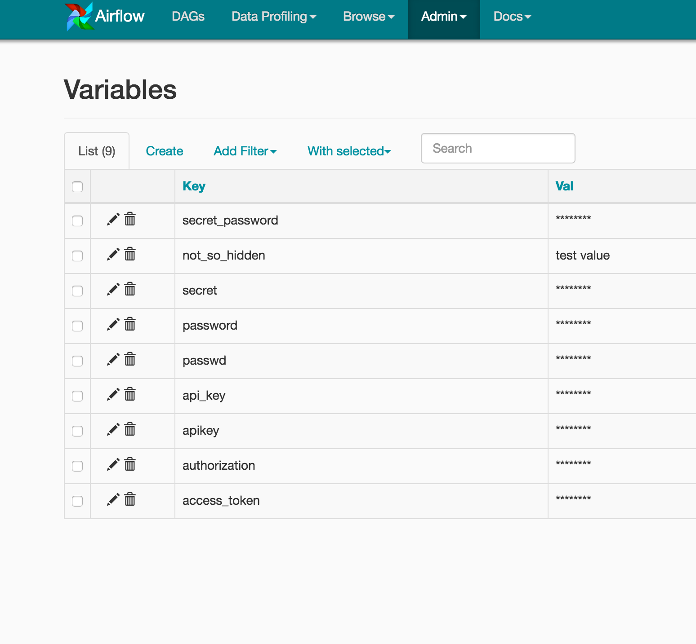

 .. Licensed to the Apache Software Foundation (ASF) under one
    or more contributor license agreements.  See the NOTICE file
    distributed with this work for additional information
    regarding copyright ownership.  The ASF licenses this file
    to you under the Apache License, Version 2.0 (the
    "License"); you may not use this file except in compliance
    with the License.  You may obtain a copy of the License at

 ..   http://www.apache.org/licenses/LICENSE-2.0

 .. Unless required by applicable law or agreed to in writing,
    software distributed under the License is distributed on an
    "AS IS" BASIS, WITHOUT WARRANTIES OR CONDITIONS OF ANY
    KIND, either express or implied.  See the License for the
    specific language governing permissions and limitations
    under the License.

Managing Variables
==================

Variables are a generic way to store and retrieve arbitrary content or
settings as a simple key value store within Airflow. Variables can be
listed, created, updated and deleted from the UI (``Admin -> Variables``),
code or CLI.

See the :ref:`Variables Concepts <concepts:variables>` documentation for
more information.

Storing Variables in Environment Variables
------------------------------------------

.. versionadded:: 1.10.10

Airflow Variables can also be created and managed using Environment Variables. The environment variable
naming convention is :envvar:`AIRFLOW_VAR_{VARIABLE_NAME}`, all uppercase.
So if your variable key is ``FOO`` then the variable name should be ``AIRFLOW_VAR_FOO``.

For example,

.. code-block:: bash

    export AIRFLOW_VAR_FOO=BAR

    # To use JSON, store them as JSON strings
    export AIRFLOW_VAR_FOO_BAZ='{"hello":"world"}'

You can use them in your DAGs as:

.. code-block:: python

    from airflow.models import Variable
    foo = Variable.get("foo")
    foo_json = Variable.get("foo_baz", deserialize_json=True)

.. note::

    Single underscores surround ``VAR``.  This is in contrast with the way ``airflow.cfg``
    parameters are stored, where double underscores surround the config section name.
    Variables set using Environment Variables would not appear in the Airflow UI but you will
    be able to use it in your DAG file.

Securing Variables
------------------

Airflow uses `Fernet <https://github.com/fernet/spec/>`__ to encrypt variables stored in the metastore database.
It guarantees that without the encryption password, content cannot be manipulated or read
without the key. For information on configuring Fernet, look at :ref:`security/fernet`.

In addition to retrieving variables from environment variables or the metastore database, you can enable
a secrets backend to retrieve variables. For more details see :doc:`secrets-backend/index`
