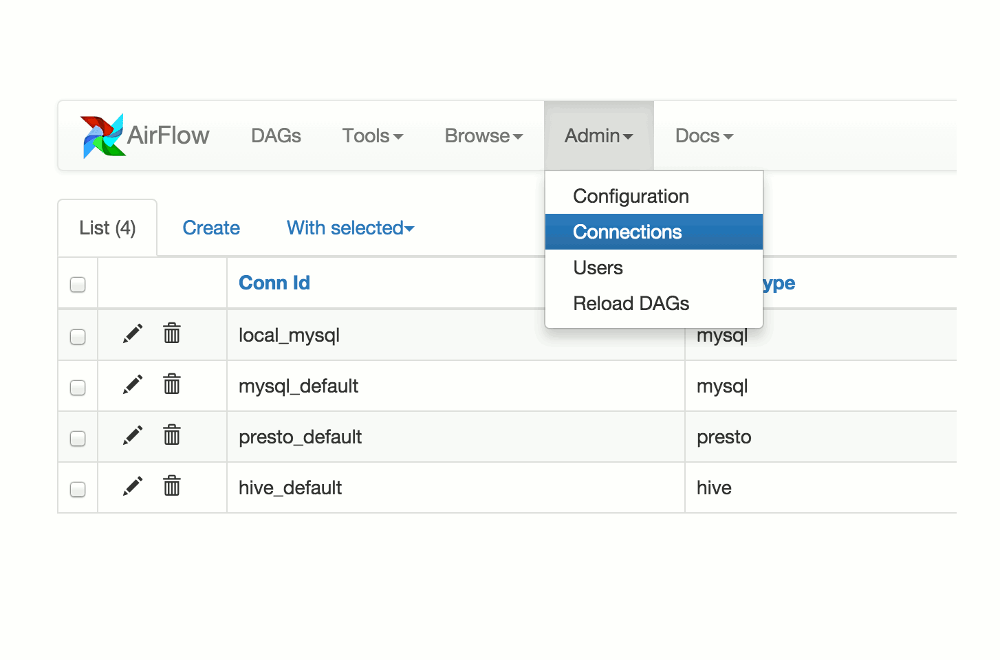

 .. Licensed to the Apache Software Foundation (ASF) under one
    or more contributor license agreements.  See the NOTICE file
    distributed with this work for additional information
    regarding copyright ownership.  The ASF licenses this file
    to you under the Apache License, Version 2.0 (the
    "License"); you may not use this file except in compliance
    with the License.  You may obtain a copy of the License at

 ..   http://www.apache.org/licenses/LICENSE-2.0

 .. Unless required by applicable law or agreed to in writing,
    software distributed under the License is distributed on an
    "AS IS" BASIS, WITHOUT WARRANTIES OR CONDITIONS OF ANY
    KIND, either express or implied.  See the License for the
    specific language governing permissions and limitations
    under the License.

Apache Airflow Documentation
=========================================

Airflow is a platform to programmatically author, schedule and monitor
workflows.

Use Airflow to author workflows as Directed Acyclic Graphs (DAGs) of tasks.
The Airflow scheduler executes your tasks on an array of workers while
following the specified dependencies. Rich command line utilities make
performing complex surgeries on DAGs a snap. The rich user interface
makes it easy to visualize pipelines running in production,
monitor progress, and troubleshoot issues when needed.

When workflows are defined as code, they become more maintainable,
versionable, testable, and collaborative.

------------

Principles
----------

- **Dynamic**:  Airflow pipelines are configuration as code (Python), allowing for dynamic pipeline generation. This allows for writing code that instantiates pipelines dynamically.
- **Extensible**:  Easily define your own operators, executors and extend the library so that it fits the level of abstraction that suits your environment.
- **Elegant**:  Airflow pipelines are lean and explicit. Parameterizing your scripts is built into the core of Airflow using the powerful **Jinja** templating engine.
- **Scalable**:  Airflow has a modular architecture and uses a message queue to orchestrate an arbitrary number of workers. Airflow is ready to scale to infinity.

Beyond the Horizon
------------------

Airflow **is not** a data streaming solution. Tasks do not move data from
one to the other (though tasks can exchange metadata!). Airflow is not
in the `Spark Streaming <http://spark.apache.org/streaming/>`_
or `Storm <https://storm.apache.org/>`_ space, it is more comparable to
`Oozie <http://oozie.apache.org/>`_ or
`Azkaban <https://azkaban.github.io/>`_.

Workflows are expected to be mostly static or slowly changing. You can think
of the structure of the tasks in your workflow as slightly more dynamic
than a database structure would be. Airflow workflows are expected to look
similar from a run to the next, this allows for clarity around
unit of work and continuity.

Content
-------
.. toctree::
    :maxdepth: 1

    Home <self>
    project
    license
    start
    installation
    tutorial
    tutorial_taskflow_api
    howto/index
    ui
    concepts
    scheduler
    executor/index
    dag-run
    plugins
    security/index
    logging-monitoring/index
    timezone
    Using the CLI <usage-cli>
    integration
    kubernetes
    lineage
    dag-serialization
    modules_management
    backport-providers
    smart-sensor
    changelog
    best-practices
    production-deployment
    faq
    privacy_notice

.. toctree::
    :maxdepth: 1
    :caption: References

    Operators and hooks <operators-and-hooks-ref>
    CLI <cli-and-env-variables-ref>
    Macros <macros-ref>
    Python API <_api/index>
    Experimental REST API <rest-api-ref>
    Stable REST API <stable-rest-api-ref>
    Configurations <configurations-ref>
    Extra packages <extra-packages-ref>
