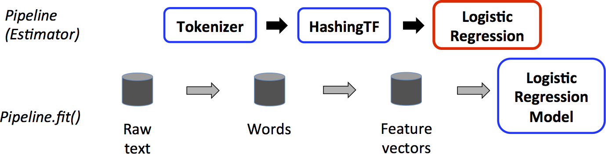
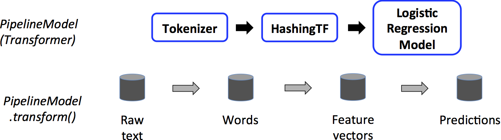

`\[
\newcommand{\R}{\mathbb{R}}
\newcommand{\E}{\mathbb{E}}
\newcommand{\x}{\mathbf{x}}
\newcommand{\y}{\mathbf{y}}
\newcommand{\wv}{\mathbf{w}}
\newcommand{\av}{\mathbf{\alpha}}
\newcommand{\bv}{\mathbf{b}}
\newcommand{\N}{\mathbb{N}}
\newcommand{\id}{\mathbf{I}}
\newcommand{\ind}{\mathbf{1}}
\newcommand{\0}{\mathbf{0}}
\newcommand{\unit}{\mathbf{e}}
\newcommand{\one}{\mathbf{1}}
\newcommand{\zero}{\mathbf{0}}
\]`

The `spark.ml` package aims to provide a uniform set of high-level APIs built on top of
[DataFrames](sql-programming-guide.html#dataframes) that help users create and tune practical
machine learning pipelines.
See the [algorithm guides](#algorithm-guides) section below for guides on sub-packages of
`spark.ml`, including feature transformers unique to the Pipelines API, ensembles, and more.

**Table of contents**

* This will become a table of contents (this text will be scraped).
{:toc}

# Main concepts

Spark ML standardizes APIs for machine learning algorithms to make it easier to combine multiple
algorithms into a single pipeline, or workflow.
This section covers the key concepts introduced by the Spark ML API, where the pipeline concept is
mostly inspired by the [scikit-learn](http://scikit-learn.org/) project.

* **[`DataFrame`](ml-guide.html#dataframe)**: Spark ML uses `DataFrame` from Spark SQL as an ML
  dataset, which can hold a variety of data types.
  E.g., a `DataFrame` could have different columns storing text, feature vectors, true labels, and predictions.

* **[`Transformer`](ml-guide.html#transformers)**: A `Transformer` is an algorithm which can transform one `DataFrame` into another `DataFrame`.
E.g., an ML model is a `Transformer` which transforms `DataFrame` with features into a `DataFrame` with predictions.

* **[`Estimator`](ml-guide.html#estimators)**: An `Estimator` is an algorithm which can be fit on a `DataFrame` to produce a `Transformer`.
E.g., a learning algorithm is an `Estimator` which trains on a `DataFrame` and produces a model.

* **[`Pipeline`](ml-guide.html#pipeline)**: A `Pipeline` chains multiple `Transformer`s and `Estimator`s together to specify an ML workflow.

* **[`Parameter`](ml-guide.html#parameters)**: All `Transformer`s and `Estimator`s now share a common API for specifying parameters.

## DataFrame

Machine learning can be applied to a wide variety of data types, such as vectors, text, images, and structured data.
Spark ML adopts the `DataFrame` from Spark SQL in order to support a variety of data types.

`DataFrame` supports many basic and structured types; see the [Spark SQL datatype reference](sql-programming-guide.html#spark-sql-datatype-reference) for a list of supported types.
In addition to the types listed in the Spark SQL guide, `DataFrame` can use ML [`Vector`](mllib-data-types.html#local-vector) types.

A `DataFrame` can be created either implicitly or explicitly from a regular `RDD`.  See the code examples below and the [Spark SQL programming guide](sql-programming-guide.html) for examples.

Columns in a `DataFrame` are named.  The code examples below use names such as "text," "features," and "label."

## Pipeline components

### Transformers

A `Transformer` is an abstraction that includes feature transformers and learned models.
Technically, a `Transformer` implements a method `transform()`, which converts one `DataFrame` into
another, generally by appending one or more columns.
For example:

* A feature transformer might take a `DataFrame`, read a column (e.g., text), map it into a new
  column (e.g., feature vectors), and output a new `DataFrame` with the mapped column appended.
* A learning model might take a `DataFrame`, read the column containing feature vectors, predict the
  label for each feature vector, and output a new `DataFrame` with predicted labels appended as a
  column.

### Estimators

An `Estimator` abstracts the concept of a learning algorithm or any algorithm that fits or trains on
data.
Technically, an `Estimator` implements a method `fit()`, which accepts a `DataFrame` and produces a
`Model`, which is a `Transformer`.
For example, a learning algorithm such as `LogisticRegression` is an `Estimator`, and calling
`fit()` trains a `LogisticRegressionModel`, which is a `Model` and hence a `Transformer`.

### Properties of pipeline components

`Transformer.transform()`s and `Estimator.fit()`s are both stateless.  In the future, stateful algorithms may be supported via alternative concepts.

Each instance of a `Transformer` or `Estimator` has a unique ID, which is useful in specifying parameters (discussed below).

## Pipeline

In machine learning, it is common to run a sequence of algorithms to process and learn from data.
E.g., a simple text document processing workflow might include several stages:

* Split each document's text into words.
* Convert each document's words into a numerical feature vector.
* Learn a prediction model using the feature vectors and labels.

Spark ML represents such a workflow as a `Pipeline`, which consists of a sequence of
`PipelineStage`s (`Transformer`s and `Estimator`s) to be run in a specific order.
We will use this simple workflow as a running example in this section.

### How it works

A `Pipeline` is specified as a sequence of stages, and each stage is either a `Transformer` or an `Estimator`.
These stages are run in order, and the input `DataFrame` is transformed as it passes through each stage.
For `Transformer` stages, the `transform()` method is called on the `DataFrame`.
For `Estimator` stages, the `fit()` method is called to produce a `Transformer` (which becomes part of the `PipelineModel`, or fitted `Pipeline`), and that `Transformer`'s `transform()` method is called on the `DataFrame`.

We illustrate this for the simple text document workflow.  The figure below is for the *training time* usage of a `Pipeline`.

  

Above, the top row represents a `Pipeline` with three stages.
The first two (`Tokenizer` and `HashingTF`) are `Transformer`s (blue), and the third (`LogisticRegression`) is an `Estimator` (red).
The bottom row represents data flowing through the pipeline, where cylinders indicate `DataFrame`s.
The `Pipeline.fit()` method is called on the original `DataFrame`, which has raw text documents and labels.
The `Tokenizer.transform()` method splits the raw text documents into words, adding a new column with words to the `DataFrame`.
The `HashingTF.transform()` method converts the words column into feature vectors, adding a new column with those vectors to the `DataFrame`.
Now, since `LogisticRegression` is an `Estimator`, the `Pipeline` first calls `LogisticRegression.fit()` to produce a `LogisticRegressionModel`.
If the `Pipeline` had more stages, it would call the `LogisticRegressionModel`'s `transform()`
method on the `DataFrame` before passing the `DataFrame` to the next stage.

A `Pipeline` is an `Estimator`.
Thus, after a `Pipeline`'s `fit()` method runs, it produces a `PipelineModel`, which is a
`Transformer`.
This `PipelineModel` is used at *test time*; the figure below illustrates this usage.

  

In the figure above, the `PipelineModel` has the same number of stages as the original `Pipeline`, but all `Estimator`s in the original `Pipeline` have become `Transformer`s.
When the `PipelineModel`'s `transform()` method is called on a test dataset, the data are passed
through the fitted pipeline in order.
Each stage's `transform()` method updates the dataset and passes it to the next stage.

`Pipeline`s and `PipelineModel`s help to ensure that training and test data go through identical feature processing steps.

### Details

*DAG `Pipeline`s*: A `Pipeline`'s stages are specified as an ordered array.  The examples given here are all for linear `Pipeline`s, i.e., `Pipeline`s in which each stage uses data produced by the previous stage.  It is possible to create non-linear `Pipeline`s as long as the data flow graph forms a Directed Acyclic Graph (DAG).  This graph is currently specified implicitly based on the input and output column names of each stage (generally specified as parameters).  If the `Pipeline` forms a DAG, then the stages must be specified in topological order.

*Runtime checking*: Since `Pipeline`s can operate on `DataFrame`s with varied types, they cannot use
compile-time type checking.
`Pipeline`s and `PipelineModel`s instead do runtime checking before actually running the `Pipeline`.
This type checking is done using the `DataFrame` *schema*, a description of the data types of columns in the `DataFrame`.

## Parameters

Spark ML `Estimator`s and `Transformer`s use a uniform API for specifying parameters.

A `Param` is a named parameter with self-contained documentation.
A `ParamMap` is a set of (parameter, value) pairs.

There are two main ways to pass parameters to an algorithm:

1. Set parameters for an instance.  E.g., if `lr` is an instance of `LogisticRegression`, one could
   call `lr.setMaxIter(10)` to make `lr.fit()` use at most 10 iterations.
   This API resembles the API used in `spark.mllib` package.
2. Pass a `ParamMap` to `fit()` or `transform()`.  Any parameters in the `ParamMap` will override parameters previously specified via setter methods.

Parameters belong to specific instances of `Estimator`s and `Transformer`s.
For example, if we have two `LogisticRegression` instances `lr1` and `lr2`, then we can build a `ParamMap` with both `maxIter` parameters specified: `ParamMap(lr1.maxIter -> 10, lr2.maxIter -> 20)`.
This is useful if there are two algorithms with the `maxIter` parameter in a `Pipeline`.

# Algorithm guides

There are now several algorithms in the Pipelines API which are not in the `spark.mllib` API, so we link to documentation for them here.  These algorithms are mostly feature transformers, which fit naturally into the `Transformer` abstraction in Pipelines, and ensembles, which fit naturally into the `Estimator` abstraction in the Pipelines.

* [Feature extraction, transformation, and selection](ml-features.html)
* [Decision Trees for classification and regression](ml-decision-tree.html)
* [Ensembles](ml-ensembles.html)
* [Linear methods with elastic net regularization](ml-linear-methods.html)
* [Multilayer perceptron classifier](ml-ann.html)

# Code examples

This section gives code examples illustrating the functionality discussed above.
For more info, please refer to the API documentation
([Scala](api/scala/index.html#org.apache.spark.ml.package),
[Java](api/java/org/apache/spark/ml/package-summary.html),
and [Python](api/python/pyspark.ml.html)).
Some Spark ML algorithms are wrappers for `spark.mllib` algorithms, and the
[MLlib programming guide](mllib-guide.html) has details on specific algorithms.

## Example: Estimator, Transformer, and Param

This example covers the concepts of `Estimator`, `Transformer`, and `Param`.


import org.apache.spark.ml.classification.LogisticRegression
import org.apache.spark.ml.param.ParamMap
import org.apache.spark.mllib.linalg.{Vector, Vectors}
import org.apache.spark.sql.Row

// Prepare training data from a list of (label, features) tuples.
val training = sqlContext.createDataFrame(Seq(
  (1.0, Vectors.dense(0.0, 1.1, 0.1)),
  (0.0, Vectors.dense(2.0, 1.0, -1.0)),
  (0.0, Vectors.dense(2.0, 1.3, 1.0)),
  (1.0, Vectors.dense(0.0, 1.2, -0.5))
)).toDF("label", "features")

// Create a LogisticRegression instance.  This instance is an Estimator.
val lr = new LogisticRegression()
// Print out the parameters, documentation, and any default values.
println("LogisticRegression parameters:\n" + lr.explainParams() + "\n")

// We may set parameters using setter methods.
lr.setMaxIter(10)
  .setRegParam(0.01)

// Learn a LogisticRegression model.  This uses the parameters stored in lr.
val model1 = lr.fit(training)
// Since model1 is a Model (i.e., a Transformer produced by an Estimator),
// we can view the parameters it used during fit().
// This prints the parameter (name: value) pairs, where names are unique IDs for this
// LogisticRegression instance.
println("Model 1 was fit using parameters: " + model1.parent.extractParamMap)

// We may alternatively specify parameters using a ParamMap,
// which supports several methods for specifying parameters.
val paramMap = ParamMap(lr.maxIter -> 20)
  .put(lr.maxIter, 30) // Specify 1 Param.  This overwrites the original maxIter.
  .put(lr.regParam -> 0.1, lr.threshold -> 0.55) // Specify multiple Params.

// One can also combine ParamMaps.
val paramMap2 = ParamMap(lr.probabilityCol -> "myProbability") // Change output column name
val paramMapCombined = paramMap ++ paramMap2

// Now learn a new model using the paramMapCombined parameters.
// paramMapCombined overrides all parameters set earlier via lr.set* methods.
val model2 = lr.fit(training, paramMapCombined)
println("Model 2 was fit using parameters: " + model2.parent.extractParamMap)

// Prepare test data.
val test = sqlContext.createDataFrame(Seq(
  (1.0, Vectors.dense(-1.0, 1.5, 1.3)),
  (0.0, Vectors.dense(3.0, 2.0, -0.1)),
  (1.0, Vectors.dense(0.0, 2.2, -1.5))
)).toDF("label", "features")

// Make predictions on test data using the Transformer.transform() method.
// LogisticRegression.transform will only use the 'features' column.
// Note that model2.transform() outputs a 'myProbability' column instead of the usual
// 'probability' column since we renamed the lr.probabilityCol parameter previously.
model2.transform(test)
  .select("features", "label", "myProbability", "prediction")
  .collect()
  .foreach { case Row(features: Vector, label: Double, prob: Vector, prediction: Double) =>
    println(s"($features, $label) -> prob=$prob, prediction=$prediction")
  }




import java.util.Arrays;
import java.util.List;

import org.apache.spark.ml.classification.LogisticRegressionModel;
import org.apache.spark.ml.param.ParamMap;
import org.apache.spark.ml.classification.LogisticRegression;
import org.apache.spark.mllib.linalg.Vectors;
import org.apache.spark.mllib.regression.LabeledPoint;
import org.apache.spark.sql.DataFrame;
import org.apache.spark.sql.Row;

// Prepare training data.
// We use LabeledPoint, which is a JavaBean.  Spark SQL can convert RDDs of JavaBeans
// into DataFrames, where it uses the bean metadata to infer the schema.
DataFrame training = sqlContext.createDataFrame(Arrays.asList(
  new LabeledPoint(1.0, Vectors.dense(0.0, 1.1, 0.1)),
  new LabeledPoint(0.0, Vectors.dense(2.0, 1.0, -1.0)),
  new LabeledPoint(0.0, Vectors.dense(2.0, 1.3, 1.0)),
  new LabeledPoint(1.0, Vectors.dense(0.0, 1.2, -0.5))
), LabeledPoint.class);

// Create a LogisticRegression instance.  This instance is an Estimator.
LogisticRegression lr = new LogisticRegression();
// Print out the parameters, documentation, and any default values.
System.out.println("LogisticRegression parameters:\n" + lr.explainParams() + "\n");

// We may set parameters using setter methods.
lr.setMaxIter(10)
  .setRegParam(0.01);

// Learn a LogisticRegression model.  This uses the parameters stored in lr.
LogisticRegressionModel model1 = lr.fit(training);
// Since model1 is a Model (i.e., a Transformer produced by an Estimator),
// we can view the parameters it used during fit().
// This prints the parameter (name: value) pairs, where names are unique IDs for this
// LogisticRegression instance.
System.out.println("Model 1 was fit using parameters: " + model1.parent().extractParamMap());

// We may alternatively specify parameters using a ParamMap.
ParamMap paramMap = new ParamMap()
  .put(lr.maxIter().w(20)) // Specify 1 Param.
  .put(lr.maxIter(), 30) // This overwrites the original maxIter.
  .put(lr.regParam().w(0.1), lr.threshold().w(0.55)); // Specify multiple Params.

// One can also combine ParamMaps.
ParamMap paramMap2 = new ParamMap()
  .put(lr.probabilityCol().w("myProbability")); // Change output column name
ParamMap paramMapCombined = paramMap.$plus$plus(paramMap2);

// Now learn a new model using the paramMapCombined parameters.
// paramMapCombined overrides all parameters set earlier via lr.set* methods.
LogisticRegressionModel model2 = lr.fit(training, paramMapCombined);
System.out.println("Model 2 was fit using parameters: " + model2.parent().extractParamMap());

// Prepare test documents.
DataFrame test = sqlContext.createDataFrame(Arrays.asList(
  new LabeledPoint(1.0, Vectors.dense(-1.0, 1.5, 1.3)),
  new LabeledPoint(0.0, Vectors.dense(3.0, 2.0, -0.1)),
  new LabeledPoint(1.0, Vectors.dense(0.0, 2.2, -1.5))
), LabeledPoint.class);

// Make predictions on test documents using the Transformer.transform() method.
// LogisticRegression.transform will only use the 'features' column.
// Note that model2.transform() outputs a 'myProbability' column instead of the usual
// 'probability' column since we renamed the lr.probabilityCol parameter previously.
DataFrame results = model2.transform(test);
for (Row r: results.select("features", "label", "myProbability", "prediction").collect()) {
  System.out.println("(" + r.get(0) + ", " + r.get(1) + ") -> prob=" + r.get(2)
      + ", prediction=" + r.get(3));
}




from pyspark.mllib.linalg import Vectors
from pyspark.ml.classification import LogisticRegression
from pyspark.ml.param import Param, Params

# Prepare training data from a list of (label, features) tuples.
training = sqlContext.createDataFrame([
    (1.0, Vectors.dense([0.0, 1.1, 0.1])),
    (0.0, Vectors.dense([2.0, 1.0, -1.0])),
    (0.0, Vectors.dense([2.0, 1.3, 1.0])),
    (1.0, Vectors.dense([0.0, 1.2, -0.5]))], ["label", "features"])

# Create a LogisticRegression instance. This instance is an Estimator.
lr = LogisticRegression(maxIter=10, regParam=0.01)
# Print out the parameters, documentation, and any default values.
print "LogisticRegression parameters:\n" + lr.explainParams() + "\n"

# Learn a LogisticRegression model. This uses the parameters stored in lr.
model1 = lr.fit(training)

# Since model1 is a Model (i.e., a transformer produced by an Estimator),
# we can view the parameters it used during fit().
# This prints the parameter (name: value) pairs, where names are unique IDs for this
# LogisticRegression instance.
print "Model 1 was fit using parameters: "
print model1.extractParamMap()

# We may alternatively specify parameters using a Python dictionary as a paramMap
paramMap = {lr.maxIter: 20}
paramMap[lr.maxIter] = 30 # Specify 1 Param, overwriting the original maxIter.
paramMap.update({lr.regParam: 0.1, lr.threshold: 0.55}) # Specify multiple Params.

# You can combine paramMaps, which are python dictionaries.
paramMap2 = {lr.probabilityCol: "myProbability"} # Change output column name
paramMapCombined = paramMap.copy()
paramMapCombined.update(paramMap2)

# Now learn a new model using the paramMapCombined parameters.
# paramMapCombined overrides all parameters set earlier via lr.set* methods.
model2 = lr.fit(training, paramMapCombined)
print "Model 2 was fit using parameters: "
print model2.extractParamMap()

# Prepare test data
test = sqlContext.createDataFrame([
    (1.0, Vectors.dense([-1.0, 1.5, 1.3])),
    (0.0, Vectors.dense([3.0, 2.0, -0.1])),
    (1.0, Vectors.dense([0.0, 2.2, -1.5]))], ["label", "features"])

# Make predictions on test data using the Transformer.transform() method.
# LogisticRegression.transform will only use the 'features' column.
# Note that model2.transform() outputs a "myProbability" column instead of the usual
# 'probability' column since we renamed the lr.probabilityCol parameter previously.
prediction = model2.transform(test)
selected = prediction.select("features", "label", "myProbability", "prediction")
for row in selected.collect():
    print row



## Example: Pipeline

This example follows the simple text document `Pipeline` illustrated in the figures above.


import org.apache.spark.ml.Pipeline
import org.apache.spark.ml.classification.LogisticRegression
import org.apache.spark.ml.feature.{HashingTF, Tokenizer}
import org.apache.spark.mllib.linalg.Vector
import org.apache.spark.sql.Row

// Prepare training documents from a list of (id, text, label) tuples.
val training = sqlContext.createDataFrame(Seq(
  (0L, "a b c d e spark", 1.0),
  (1L, "b d", 0.0),
  (2L, "spark f g h", 1.0),
  (3L, "hadoop mapreduce", 0.0)
)).toDF("id", "text", "label")

// Configure an ML pipeline, which consists of three stages: tokenizer, hashingTF, and lr.
val tokenizer = new Tokenizer()
  .setInputCol("text")
  .setOutputCol("words")
val hashingTF = new HashingTF()
  .setNumFeatures(1000)
  .setInputCol(tokenizer.getOutputCol)
  .setOutputCol("features")
val lr = new LogisticRegression()
  .setMaxIter(10)
  .setRegParam(0.01)
val pipeline = new Pipeline()
  .setStages(Array(tokenizer, hashingTF, lr))

// Fit the pipeline to training documents.
val model = pipeline.fit(training)

// Prepare test documents, which are unlabeled (id, text) tuples.
val test = sqlContext.createDataFrame(Seq(
  (4L, "spark i j k"),
  (5L, "l m n"),
  (6L, "mapreduce spark"),
  (7L, "apache hadoop")
)).toDF("id", "text")

// Make predictions on test documents.
model.transform(test.toDF)
  .select("id", "text", "probability", "prediction")
  .collect()
  .foreach { case Row(id: Long, text: String, prob: Vector, prediction: Double) =>
    println(s"($id, $text) --> prob=$prob, prediction=$prediction")
  }




import java.util.Arrays;
import java.util.List;

import org.apache.spark.ml.Pipeline;
import org.apache.spark.ml.PipelineModel;
import org.apache.spark.ml.PipelineStage;
import org.apache.spark.ml.classification.LogisticRegression;
import org.apache.spark.ml.feature.HashingTF;
import org.apache.spark.ml.feature.Tokenizer;
import org.apache.spark.sql.DataFrame;
import org.apache.spark.sql.Row;

// Labeled and unlabeled instance types.
// Spark SQL can infer schema from Java Beans.
public class Document implements Serializable {
  private long id;
  private String text;

  public Document(long id, String text) {
    this.id = id;
    this.text = text;
  }

  public long getId() { return this.id; }
  public void setId(long id) { this.id = id; }

  public String getText() { return this.text; }
  public void setText(String text) { this.text = text; }
}

public class LabeledDocument extends Document implements Serializable {
  private double label;

  public LabeledDocument(long id, String text, double label) {
    super(id, text);
    this.label = label;
  }

  public double getLabel() { return this.label; }
  public void setLabel(double label) { this.label = label; }
}

// Prepare training documents, which are labeled.
DataFrame training = sqlContext.createDataFrame(Arrays.asList(
  new LabeledDocument(0L, "a b c d e spark", 1.0),
  new LabeledDocument(1L, "b d", 0.0),
  new LabeledDocument(2L, "spark f g h", 1.0),
  new LabeledDocument(3L, "hadoop mapreduce", 0.0)
), LabeledDocument.class);

// Configure an ML pipeline, which consists of three stages: tokenizer, hashingTF, and lr.
Tokenizer tokenizer = new Tokenizer()
  .setInputCol("text")
  .setOutputCol("words");
HashingTF hashingTF = new HashingTF()
  .setNumFeatures(1000)
  .setInputCol(tokenizer.getOutputCol())
  .setOutputCol("features");
LogisticRegression lr = new LogisticRegression()
  .setMaxIter(10)
  .setRegParam(0.01);
Pipeline pipeline = new Pipeline()
  .setStages(new PipelineStage[] {tokenizer, hashingTF, lr});

// Fit the pipeline to training documents.
PipelineModel model = pipeline.fit(training);

// Prepare test documents, which are unlabeled.
DataFrame test = sqlContext.createDataFrame(Arrays.asList(
  new Document(4L, "spark i j k"),
  new Document(5L, "l m n"),
  new Document(6L, "mapreduce spark"),
  new Document(7L, "apache hadoop")
), Document.class);

// Make predictions on test documents.
DataFrame predictions = model.transform(test);
for (Row r: predictions.select("id", "text", "probability", "prediction").collect()) {
  System.out.println("(" + r.get(0) + ", " + r.get(1) + ") --> prob=" + r.get(2)
      + ", prediction=" + r.get(3));
}




from pyspark.ml import Pipeline
from pyspark.ml.classification import LogisticRegression
from pyspark.ml.feature import HashingTF, Tokenizer
from pyspark.sql import Row

# Prepare training documents from a list of (id, text, label) tuples.
LabeledDocument = Row("id", "text", "label")
training = sqlContext.createDataFrame([
    (0L, "a b c d e spark", 1.0),
    (1L, "b d", 0.0),
    (2L, "spark f g h", 1.0),
    (3L, "hadoop mapreduce", 0.0)], ["id", "text", "label"])

# Configure an ML pipeline, which consists of tree stages: tokenizer, hashingTF, and lr.
tokenizer = Tokenizer(inputCol="text", outputCol="words")
hashingTF = HashingTF(inputCol=tokenizer.getOutputCol(), outputCol="features")
lr = LogisticRegression(maxIter=10, regParam=0.01)
pipeline = Pipeline(stages=[tokenizer, hashingTF, lr])

# Fit the pipeline to training documents.
model = pipeline.fit(training)

# Prepare test documents, which are unlabeled (id, text) tuples.
test = sqlContext.createDataFrame([
    (4L, "spark i j k"),
    (5L, "l m n"),
    (6L, "mapreduce spark"),
    (7L, "apache hadoop")], ["id", "text"])

# Make predictions on test documents and print columns of interest.
prediction = model.transform(test)
selected = prediction.select("id", "text", "prediction")
for row in selected.collect():
    print(row)



## Example: model selection via cross-validation

An important task in ML is *model selection*, or using data to find the best model or parameters for a given task.  This is also called *tuning*.
`Pipeline`s facilitate model selection by making it easy to tune an entire `Pipeline` at once, rather than tuning each element in the `Pipeline` separately.

Currently, `spark.ml` supports model selection using the [`CrossValidator`](api/scala/index.html#org.apache.spark.ml.tuning.CrossValidator) class, which takes an `Estimator`, a set of `ParamMap`s, and an [`Evaluator`](api/scala/index.html#org.apache.spark.ml.Evaluator).
`CrossValidator` begins by splitting the dataset into a set of *folds* which are used as separate training and test datasets; e.g., with `$k=3$` folds, `CrossValidator` will generate 3 (training, test) dataset pairs, each of which uses 2/3 of the data for training and 1/3 for testing.
`CrossValidator` iterates through the set of `ParamMap`s. For each `ParamMap`, it trains the given `Estimator` and evaluates it using the given `Evaluator`.

The `Evaluator` can be a [`RegressionEvaluator`](api/scala/index.html#org.apache.spark.ml.RegressionEvaluator)
for regression problems, a [`BinaryClassificationEvaluator`](api/scala/index.html#org.apache.spark.ml.BinaryClassificationEvaluator)
for binary data, or a [`MultiClassClassificationEvaluator`](api/scala/index.html#org.apache.spark.ml.MultiClassClassificationEvaluator)
for multiclass problems. The default metric used to choose the best `ParamMap` can be overriden by the `setMetric`
method in each of these evaluators.

The `ParamMap` which produces the best evaluation metric (averaged over the `$k$` folds) is selected as the best model.
`CrossValidator` finally fits the `Estimator` using the best `ParamMap` and the entire dataset.

The following example demonstrates using `CrossValidator` to select from a grid of parameters.
To help construct the parameter grid, we use the [`ParamGridBuilder`](api/scala/index.html#org.apache.spark.ml.tuning.ParamGridBuilder) utility.

Note that cross-validation over a grid of parameters is expensive.
E.g., in the example below, the parameter grid has 3 values for `hashingTF.numFeatures` and 2 values for `lr.regParam`, and `CrossValidator` uses 2 folds.  This multiplies out to `$(3 \times 2) \times 2 = 12$` different models being trained.
In realistic settings, it can be common to try many more parameters and use more folds (`$k=3$` and `$k=10$` are common).
In other words, using `CrossValidator` can be very expensive.
However, it is also a well-established method for choosing parameters which is more statistically sound than heuristic hand-tuning.


import org.apache.spark.ml.Pipeline
import org.apache.spark.ml.classification.LogisticRegression
import org.apache.spark.ml.evaluation.BinaryClassificationEvaluator
import org.apache.spark.ml.feature.{HashingTF, Tokenizer}
import org.apache.spark.ml.tuning.{ParamGridBuilder, CrossValidator}
import org.apache.spark.mllib.linalg.Vector
import org.apache.spark.sql.Row

// Prepare training data from a list of (id, text, label) tuples.
val training = sqlContext.createDataFrame(Seq(
  (0L, "a b c d e spark", 1.0),
  (1L, "b d", 0.0),
  (2L, "spark f g h", 1.0),
  (3L, "hadoop mapreduce", 0.0),
  (4L, "b spark who", 1.0),
  (5L, "g d a y", 0.0),
  (6L, "spark fly", 1.0),
  (7L, "was mapreduce", 0.0),
  (8L, "e spark program", 1.0),
  (9L, "a e c l", 0.0),
  (10L, "spark compile", 1.0),
  (11L, "hadoop software", 0.0)
)).toDF("id", "text", "label")

// Configure an ML pipeline, which consists of three stages: tokenizer, hashingTF, and lr.
val tokenizer = new Tokenizer()
  .setInputCol("text")
  .setOutputCol("words")
val hashingTF = new HashingTF()
  .setInputCol(tokenizer.getOutputCol)
  .setOutputCol("features")
val lr = new LogisticRegression()
  .setMaxIter(10)
val pipeline = new Pipeline()
  .setStages(Array(tokenizer, hashingTF, lr))

// We use a ParamGridBuilder to construct a grid of parameters to search over.
// With 3 values for hashingTF.numFeatures and 2 values for lr.regParam,
// this grid will have 3 x 2 = 6 parameter settings for CrossValidator to choose from.
val paramGrid = new ParamGridBuilder()
  .addGrid(hashingTF.numFeatures, Array(10, 100, 1000))
  .addGrid(lr.regParam, Array(0.1, 0.01))
  .build()

// We now treat the Pipeline as an Estimator, wrapping it in a CrossValidator instance.
// This will allow us to jointly choose parameters for all Pipeline stages.
// A CrossValidator requires an Estimator, a set of Estimator ParamMaps, and an Evaluator.
// Note that the evaluator here is a BinaryClassificationEvaluator and its default metric
// is areaUnderROC.
val cv = new CrossValidator()
  .setEstimator(pipeline)
  .setEvaluator(new BinaryClassificationEvaluator)
  .setEstimatorParamMaps(paramGrid)
  .setNumFolds(2) // Use 3+ in practice

// Run cross-validation, and choose the best set of parameters.
val cvModel = cv.fit(training)

// Prepare test documents, which are unlabeled (id, text) tuples.
val test = sqlContext.createDataFrame(Seq(
  (4L, "spark i j k"),
  (5L, "l m n"),
  (6L, "mapreduce spark"),
  (7L, "apache hadoop")
)).toDF("id", "text")

// Make predictions on test documents. cvModel uses the best model found (lrModel).
cvModel.transform(test)
  .select("id", "text", "probability", "prediction")
  .collect()
  .foreach { case Row(id: Long, text: String, prob: Vector, prediction: Double) =>
    println(s"($id, $text) --> prob=$prob, prediction=$prediction")
  }




import java.util.Arrays;
import java.util.List;

import org.apache.spark.ml.Pipeline;
import org.apache.spark.ml.PipelineStage;
import org.apache.spark.ml.classification.LogisticRegression;
import org.apache.spark.ml.evaluation.BinaryClassificationEvaluator;
import org.apache.spark.ml.feature.HashingTF;
import org.apache.spark.ml.feature.Tokenizer;
import org.apache.spark.ml.param.ParamMap;
import org.apache.spark.ml.tuning.CrossValidator;
import org.apache.spark.ml.tuning.CrossValidatorModel;
import org.apache.spark.ml.tuning.ParamGridBuilder;
import org.apache.spark.sql.DataFrame;
import org.apache.spark.sql.Row;

// Labeled and unlabeled instance types.
// Spark SQL can infer schema from Java Beans.
public class Document implements Serializable {
  private long id;
  private String text;

  public Document(long id, String text) {
    this.id = id;
    this.text = text;
  }

  public long getId() { return this.id; }
  public void setId(long id) { this.id = id; }

  public String getText() { return this.text; }
  public void setText(String text) { this.text = text; }
}

public class LabeledDocument extends Document implements Serializable {
  private double label;

  public LabeledDocument(long id, String text, double label) {
    super(id, text);
    this.label = label;
  }

  public double getLabel() { return this.label; }
  public void setLabel(double label) { this.label = label; }
}

// Prepare training documents, which are labeled.
DataFrame training = sqlContext.createDataFrame(Arrays.asList(
  new LabeledDocument(0L, "a b c d e spark", 1.0),
  new LabeledDocument(1L, "b d", 0.0),
  new LabeledDocument(2L, "spark f g h", 1.0),
  new LabeledDocument(3L, "hadoop mapreduce", 0.0),
  new LabeledDocument(4L, "b spark who", 1.0),
  new LabeledDocument(5L, "g d a y", 0.0),
  new LabeledDocument(6L, "spark fly", 1.0),
  new LabeledDocument(7L, "was mapreduce", 0.0),
  new LabeledDocument(8L, "e spark program", 1.0),
  new LabeledDocument(9L, "a e c l", 0.0),
  new LabeledDocument(10L, "spark compile", 1.0),
  new LabeledDocument(11L, "hadoop software", 0.0)
), LabeledDocument.class);

// Configure an ML pipeline, which consists of three stages: tokenizer, hashingTF, and lr.
Tokenizer tokenizer = new Tokenizer()
  .setInputCol("text")
  .setOutputCol("words");
HashingTF hashingTF = new HashingTF()
  .setNumFeatures(1000)
  .setInputCol(tokenizer.getOutputCol())
  .setOutputCol("features");
LogisticRegression lr = new LogisticRegression()
  .setMaxIter(10)
  .setRegParam(0.01);
Pipeline pipeline = new Pipeline()
  .setStages(new PipelineStage[] {tokenizer, hashingTF, lr});

// We use a ParamGridBuilder to construct a grid of parameters to search over.
// With 3 values for hashingTF.numFeatures and 2 values for lr.regParam,
// this grid will have 3 x 2 = 6 parameter settings for CrossValidator to choose from.
ParamMap[] paramGrid = new ParamGridBuilder()
    .addGrid(hashingTF.numFeatures(), new int[]{10, 100, 1000})
    .addGrid(lr.regParam(), new double[]{0.1, 0.01})
    .build();

// We now treat the Pipeline as an Estimator, wrapping it in a CrossValidator instance.
// This will allow us to jointly choose parameters for all Pipeline stages.
// A CrossValidator requires an Estimator, a set of Estimator ParamMaps, and an Evaluator.
// Note that the evaluator here is a BinaryClassificationEvaluator and its default metric
// is areaUnderROC.
CrossValidator cv = new CrossValidator()
  .setEstimator(pipeline)
  .setEvaluator(new BinaryClassificationEvaluator())
  .setEstimatorParamMaps(paramGrid)
  .setNumFolds(2); // Use 3+ in practice

// Run cross-validation, and choose the best set of parameters.
CrossValidatorModel cvModel = cv.fit(training);

// Prepare test documents, which are unlabeled.
DataFrame test = sqlContext.createDataFrame(Arrays.asList(
  new Document(4L, "spark i j k"),
  new Document(5L, "l m n"),
  new Document(6L, "mapreduce spark"),
  new Document(7L, "apache hadoop")
), Document.class);

// Make predictions on test documents. cvModel uses the best model found (lrModel).
DataFrame predictions = cvModel.transform(test);
for (Row r: predictions.select("id", "text", "probability", "prediction").collect()) {
  System.out.println("(" + r.get(0) + ", " + r.get(1) + ") --> prob=" + r.get(2)
      + ", prediction=" + r.get(3));
}



## Example: model selection via train validation split
In addition to  `CrossValidator` Spark also offers `TrainValidationSplit` for hyper-parameter tuning.
`TrainValidationSplit` only evaluates each combination of parameters once as opposed to k times in
 case of `CrossValidator`. It is therefore less expensive,
 but will not produce as reliable results when the training dataset is not sufficiently large.

`TrainValidationSplit` takes an `Estimator`, a set of `ParamMap`s provided in the `estimatorParamMaps` parameter,
and an `Evaluator`.
It begins by splitting the dataset into two parts using `trainRatio` parameter
which are used as separate training and test datasets. For example with `$trainRatio=0.75$` (default),
`TrainValidationSplit` will generate a training and test dataset pair where 75% of the data is used for training and 25% for validation.
Similar to `CrossValidator`, `TrainValidationSplit` also iterates through the set of `ParamMap`s.
For each combination of parameters, it trains the given `Estimator` and evaluates it using the given `Evaluator`.
The `ParamMap` which produces the best evaluation metric is selected as the best option.
`TrainValidationSplit` finally fits the `Estimator` using the best `ParamMap` and the entire dataset.


import org.apache.spark.ml.evaluation.RegressionEvaluator
import org.apache.spark.ml.regression.LinearRegression
import org.apache.spark.ml.tuning.{ParamGridBuilder, TrainValidationSplit}
import org.apache.spark.mllib.util.MLUtils

// Prepare training and test data.
val data = MLUtils.loadLibSVMFile(sc, "data/mllib/sample_libsvm_data.txt").toDF()
val Array(training, test) = data.randomSplit(Array(0.9, 0.1), seed = 12345)

val lr = new LinearRegression()

// We use a ParamGridBuilder to construct a grid of parameters to search over.
// TrainValidationSplit will try all combinations of values and determine best model using
// the evaluator.
val paramGrid = new ParamGridBuilder()
  .addGrid(lr.regParam, Array(0.1, 0.01))
  .addGrid(lr.fitIntercept)
  .addGrid(lr.elasticNetParam, Array(0.0, 0.5, 1.0))
  .build()

// In this case the estimator is simply the linear regression.
// A TrainValidationSplit requires an Estimator, a set of Estimator ParamMaps, and an Evaluator.
val trainValidationSplit = new TrainValidationSplit()
  .setEstimator(lr)
  .setEvaluator(new RegressionEvaluator)
  .setEstimatorParamMaps(paramGrid)
  // 80% of the data will be used for training and the remaining 20% for validation.
  .setTrainRatio(0.8)

// Run train validation split, and choose the best set of parameters.
val model = trainValidationSplit.fit(training)

// Make predictions on test data. model is the model with combination of parameters
// that performed best.
model.transform(test)
  .select("features", "label", "prediction")
  .show()




import org.apache.spark.ml.evaluation.RegressionEvaluator;
import org.apache.spark.ml.param.ParamMap;
import org.apache.spark.ml.regression.LinearRegression;
import org.apache.spark.ml.tuning.*;
import org.apache.spark.mllib.regression.LabeledPoint;
import org.apache.spark.mllib.util.MLUtils;
import org.apache.spark.rdd.RDD;
import org.apache.spark.sql.DataFrame;

DataFrame data = sqlContext.createDataFrame(
  MLUtils.loadLibSVMFile(jsc.sc(), "data/mllib/sample_libsvm_data.txt"),
  LabeledPoint.class);

// Prepare training and test data.
DataFrame[] splits = data.randomSplit(new double[] {0.9, 0.1}, 12345);
DataFrame training = splits[0];
DataFrame test = splits[1];

LinearRegression lr = new LinearRegression();

// We use a ParamGridBuilder to construct a grid of parameters to search over.
// TrainValidationSplit will try all combinations of values and determine best model using
// the evaluator.
ParamMap[] paramGrid = new ParamGridBuilder()
  .addGrid(lr.regParam(), new double[] {0.1, 0.01})
  .addGrid(lr.fitIntercept())
  .addGrid(lr.elasticNetParam(), new double[] {0.0, 0.5, 1.0})
  .build();

// In this case the estimator is simply the linear regression.
// A TrainValidationSplit requires an Estimator, a set of Estimator ParamMaps, and an Evaluator.
TrainValidationSplit trainValidationSplit = new TrainValidationSplit()
  .setEstimator(lr)
  .setEvaluator(new RegressionEvaluator())
  .setEstimatorParamMaps(paramGrid)
  .setTrainRatio(0.8); // 80% for training and the remaining 20% for validation

// Run train validation split, and choose the best set of parameters.
TrainValidationSplitModel model = trainValidationSplit.fit(training);

// Make predictions on test data. model is the model with combination of parameters
// that performed best.
model.transform(test)
  .select("features", "label", "prediction")
  .show();



