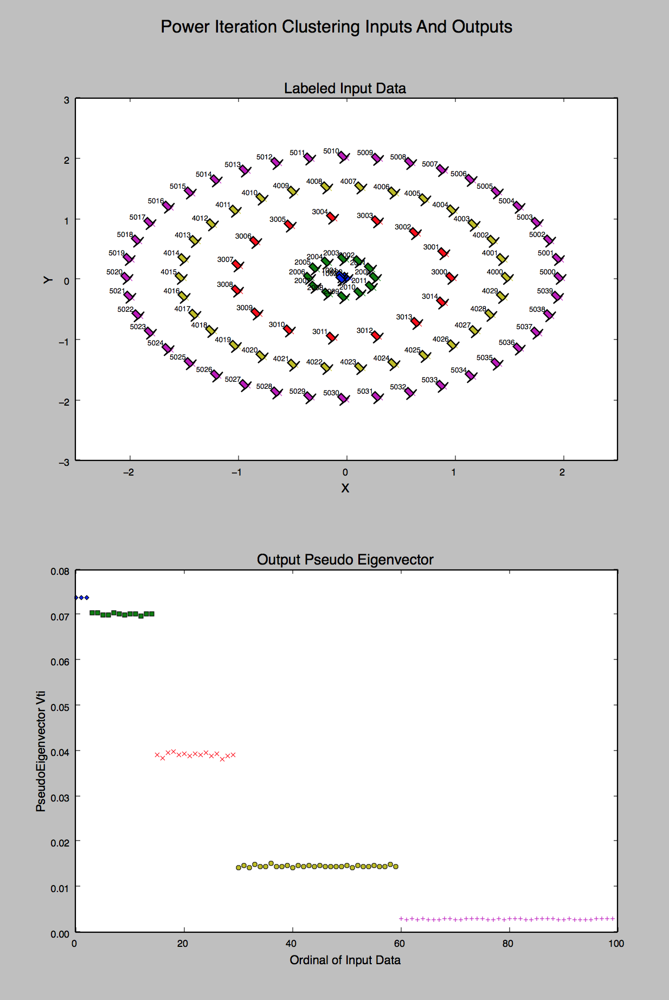

* Table of contents
{:toc}

## Clustering

Clustering is an unsupervised learning problem whereby we aim to group subsets
of entities with one another based on some notion of similarity.  Clustering is
often used for exploratory analysis and/or as a component of a hierarchical
supervised learning pipeline (in which distinct classifiers or regression
models are trained for each cluster). 

MLlib supports
[k-means](http://en.wikipedia.org/wiki/K-means_clustering) clustering, one of
the most commonly used clustering algorithms that clusters the data points into
predefined number of clusters. The MLlib implementation includes a parallelized
variant of the [k-means++](http://en.wikipedia.org/wiki/K-means%2B%2B) method
called [kmeans||](http://theory.stanford.edu/~sergei/papers/vldb12-kmpar.pdf).
The implementation in MLlib has the following parameters:  

* *k* is the number of desired clusters.
* *maxIterations* is the maximum number of iterations to run.
* *initializationMode* specifies either random initialization or
initialization via k-means\|\|.
* *runs* is the number of times to run the k-means algorithm (k-means is not
guaranteed to find a globally optimal solution, and when run multiple times on
a given dataset, the algorithm returns the best clustering result).
* *initializationSteps* determines the number of steps in the k-means\|\| algorithm.
* *epsilon* determines the distance threshold within which we consider k-means to have converged. 

### Power Iteration Clustering

Power iteration clustering is a scalable and efficient algorithm for clustering points given pointwise mutual affinity values.  Internally the algorithm:

* accepts a [Graph](https://spark.apache.org/docs/0.9.2/api/graphx/index.html#org.apache.spark.graphx.Graph) that represents a  normalized pairwise affinity between all input points.
* calculates the principal eigenvalue and eigenvector
* Clusters each of the input points according to their principal eigenvector component value

Details of this algorithm are found within [Power Iteration Clustering, Lin and Cohen]{www.icml2010.org/papers/387.pdf}

Example outputs for a dataset inspired by the paper - but with five clusters instead of three- have he following output from our implementation:

  
  <!-- Images are downsized intentionally to improve quality on retina displays -->

### Examples

The following code snippets can be executed in `spark-shell`.

In the following example after loading and parsing data, we use the
[`KMeans`](api/scala/index.html#org.apache.spark.mllib.clustering.KMeans) object to cluster the data
into two clusters. The number of desired clusters is passed to the algorithm. We then compute Within
Set Sum of Squared Error (WSSSE). You can reduce this error measure by increasing *k*. In fact the
optimal *k* is usually one where there is an "elbow" in the WSSSE graph.


import org.apache.spark.mllib.clustering.KMeans
import org.apache.spark.mllib.linalg.Vectors

// Load and parse the data
val data = sc.textFile("data/mllib/kmeans_data.txt")
val parsedData = data.map(s => Vectors.dense(s.split(' ').map(_.toDouble))).cache()

// Cluster the data into two classes using KMeans
val numClusters = 2
val numIterations = 20
val clusters = KMeans.train(parsedData, numClusters, numIterations)

// Evaluate clustering by computing Within Set Sum of Squared Errors
val WSSSE = clusters.computeCost(parsedData)
println("Within Set Sum of Squared Errors = " + WSSSE)


All of MLlib's methods use Java-friendly types, so you can import and call them there the same
way you do in Scala. The only caveat is that the methods take Scala RDD objects, while the
Spark Java API uses a separate `JavaRDD` class. You can convert a Java RDD to a Scala one by
calling `.rdd()` on your `JavaRDD` object. A self-contained application example
that is equivalent to the provided example in Scala is given below:


import org.apache.spark.api.java.*;
import org.apache.spark.api.java.function.Function;
import org.apache.spark.mllib.clustering.KMeans;
import org.apache.spark.mllib.clustering.KMeansModel;
import org.apache.spark.mllib.linalg.Vector;
import org.apache.spark.mllib.linalg.Vectors;
import org.apache.spark.SparkConf;

public class KMeansExample {
  public static void main(String[] args) {
    SparkConf conf = new SparkConf().setAppName("K-means Example");
    JavaSparkContext sc = new JavaSparkContext(conf);

    // Load and parse data
    String path = "data/mllib/kmeans_data.txt";
    JavaRDD<String> data = sc.textFile(path);
    JavaRDD<Vector> parsedData = data.map(
      new Function<String, Vector>() {
        public Vector call(String s) {
          String[] sarray = s.split(" ");
          double[] values = new double[sarray.length];
          for (int i = 0; i < sarray.length; i++)
            values[i] = Double.parseDouble(sarray[i]);
          return Vectors.dense(values);
        }
      }
    );
    parsedData.cache();

    // Cluster the data into two classes using KMeans
    int numClusters = 2;
    int numIterations = 20;
    KMeansModel clusters = KMeans.train(parsedData.rdd(), numClusters, numIterations);

    // Evaluate clustering by computing Within Set Sum of Squared Errors
    double WSSSE = clusters.computeCost(parsedData.rdd());
    System.out.println("Within Set Sum of Squared Errors = " + WSSSE);
  }
}


The following examples can be tested in the PySpark shell.

In the following example after loading and parsing data, we use the KMeans object to cluster the
data into two clusters. The number of desired clusters is passed to the algorithm. We then compute
Within Set Sum of Squared Error (WSSSE). You can reduce this error measure by increasing *k*. In
fact the optimal *k* is usually one where there is an "elbow" in the WSSSE graph.


from pyspark.mllib.clustering import KMeans
from numpy import array
from math import sqrt

# Load and parse the data
data = sc.textFile("data/mllib/kmeans_data.txt")
parsedData = data.map(lambda line: array([float(x) for x in line.split(' ')]))

# Build the model (cluster the data)
clusters = KMeans.train(parsedData, 2, maxIterations=10,
        runs=10, initializationMode="random")

# Evaluate clustering by computing Within Set Sum of Squared Errors
def error(point):
    center = clusters.centers[clusters.predict(point)]
    return sqrt(sum([x**2 for x in (point - center)]))

WSSSE = parsedData.map(lambda point: error(point)).reduce(lambda x, y: x + y)
print("Within Set Sum of Squared Error = " + str(WSSSE))


In order to run the above application, follow the instructions
provided in the [Self-Contained Applications](quick-start.html#self-contained-applications)
section of the Spark
Quick Start guide. Be sure to also include *spark-mllib* to your build file as
a dependency.

## Streaming clustering

When data arrive in a stream, we may want to estimate clusters dynamically, 
updating them as new data arrive. MLlib provides support for streaming k-means clustering, 
with parameters to control the decay (or "forgetfulness") of the estimates. The algorithm 
uses a generalization of the mini-batch k-means update rule. For each batch of data, we assign 
all points to their nearest cluster, compute new cluster centers, then update each cluster using:

`\begin{equation}
    c_{t+1} = \frac{c_tn_t\alpha + x_tm_t}{n_t\alpha+m_t}
\end{equation}`
`\begin{equation}
    n_{t+1} = n_t + m_t  
\end{equation}`

Where `$c_t$` is the previous center for the cluster, `$n_t$` is the number of points assigned 
to the cluster thus far, `$x_t$` is the new cluster center from the current batch, and `$m_t$` 
is the number of points added to the cluster in the current batch. The decay factor `$\alpha$` 
can be used to ignore the past: with `$\alpha$=1` all data will be used from the beginning; 
with `$\alpha$=0` only the most recent data will be used. This is analogous to an 
exponentially-weighted moving average. 

The decay can be specified using a `halfLife` parameter, which determines the 
correct decay factor `a` such that, for data acquired
at time `t`, its contribution by time `t + halfLife` will have dropped to 0.5.
The unit of time can be specified either as `batches` or `points` and the update rule
will be adjusted accordingly.

### Examples

This example shows how to estimate clusters on streaming data.

First we import the neccessary classes.



import org.apache.spark.mllib.linalg.Vectors
import org.apache.spark.mllib.regression.LabeledPoint
import org.apache.spark.mllib.clustering.StreamingKMeans



Then we make an input stream of vectors for training, as well as a stream of labeled data 
points for testing. We assume a StreamingContext `ssc` has been created, see 
[Spark Streaming Programming Guide](streaming-programming-guide.html#initializing) for more info.  



val trainingData = ssc.textFileStream("/training/data/dir").map(Vectors.parse)
val testData = ssc.textFileStream("/testing/data/dir").map(LabeledPoint.parse)



We create a model with random clusters and specify the number of clusters to find



val numDimensions = 3
val numClusters = 2
val model = new StreamingKMeans()
  .setK(numClusters)
  .setDecayFactor(1.0)
  .setRandomCenters(numDimensions, 0.0)



Now register the streams for training and testing and start the job, printing 
the predicted cluster assignments on new data points as they arrive.



model.trainOn(trainingData)
model.predictOnValues(testData).print()

ssc.start()
ssc.awaitTermination()
 


As you add new text files with data the cluster centers will update. Each training 
point should be formatted as `[x1, x2, x3]`, and each test data point
should be formatted as `(y, [x1, x2, x3])`, where `y` is some useful label or identifier 
(e.g. a true category assignment). Anytime a text file is placed in `/training/data/dir` 
the model will update. Anytime a text file is placed in `/testing/data/dir` 
you will see predictions. With new data, the cluster centers will change!

