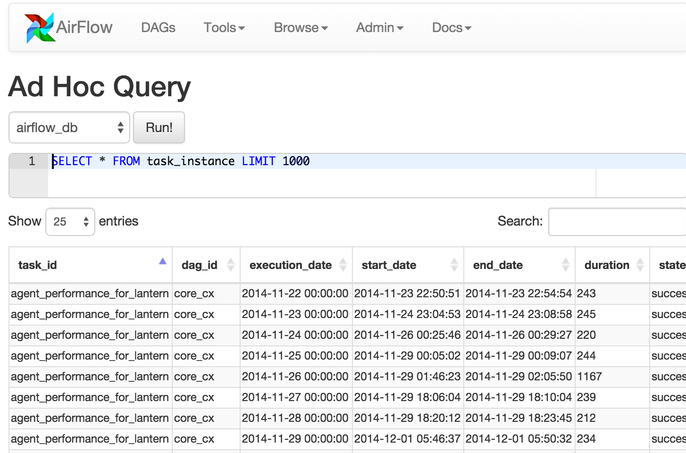
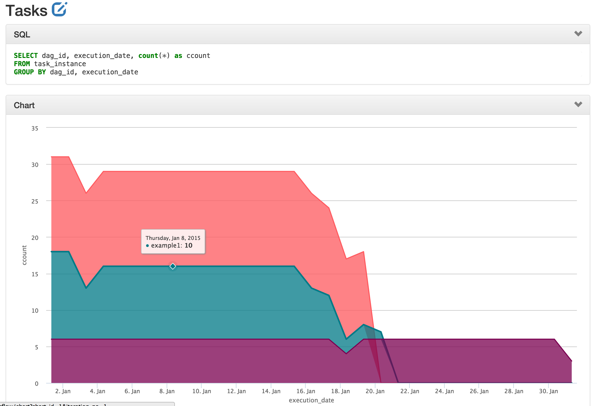
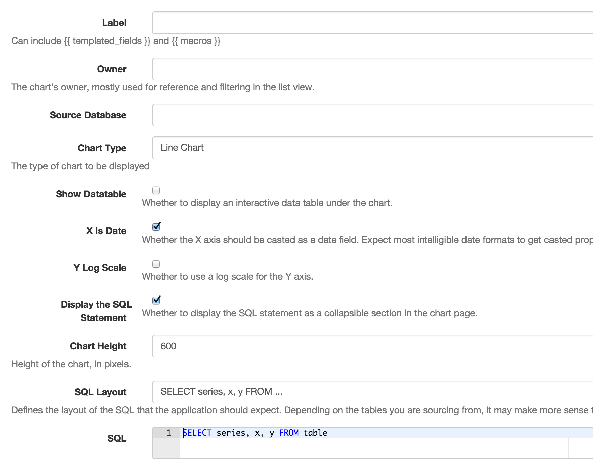

Data Profiling
==============

Part of being a productive data ninja is about having the right weapons to
profile the data you are working with. Airflow provides a simple query 
interface to write sql and get results quickly, and a charting application 
letting you visualize data.

Adhoc Queries
-------------
The adhoc query UI allows for simple SQL interaction with the database
connections registered in Airflow.

Charts
-------------
A simple UI built on top of flask-admin and highcharts allows to build
data visualizations and charts easily. Fill in a form with a label, sql,
chart tyoe, pick a source database from your environment's connecton, 
select a few other otpions, and save it for later use. 

You can even use the same templating and macros availlable when writting 
airflow pipelines, parameterizing your queries and modifying parameters 
direclty in the URL.

These charts ain't Tableau, but they're easy to create, modify and share.

Chart Screenshot
................

-----

Chart Form Screenshot
.....................

