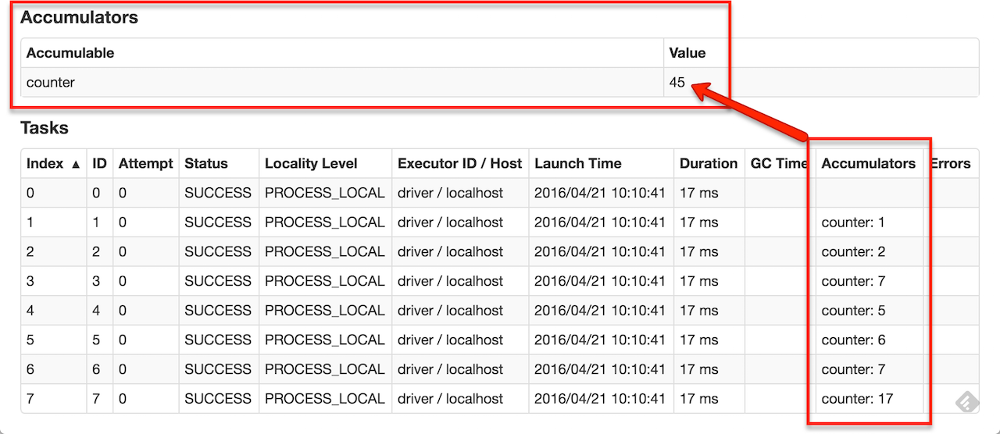

* This will become a table of contents (this text will be scraped).
{:toc}


# Overview

At a high level, every Spark application consists of a *driver program* that runs the user's `main` function and executes various *parallel operations* on a cluster. The main abstraction Spark provides is a *resilient distributed dataset* (RDD), which is a collection of elements partitioned across the nodes of the cluster that can be operated on in parallel. RDDs are created by starting with a file in the Hadoop file system (or any other Hadoop-supported file system), or an existing Scala collection in the driver program, and transforming it. Users may also ask Spark to *persist* an RDD in memory, allowing it to be reused efficiently across parallel operations. Finally, RDDs automatically recover from node failures.

A second abstraction in Spark is *shared variables* that can be used in parallel operations. By default, when Spark runs a function in parallel as a set of tasks on different nodes, it ships a copy of each variable used in the function to each task. Sometimes, a variable needs to be shared across tasks, or between tasks and the driver program. Spark supports two types of shared variables: *broadcast variables*, which can be used to cache a value in memory on all nodes, and *accumulators*, which are variables that are only "added" to, such as counters and sums.

This guide shows each of these features in each of Spark's supported languages. It is easiest to follow
along with if you launch Spark's interactive shell -- either `bin/spark-shell` for the Scala shell or
`bin/pyspark` for the Python one.

# Linking with Spark

<div class="codetabs">

<div data-lang="scala"  markdown="1">

Spark {{site.SPARK_VERSION}} is built and distributed to work with Scala {{site.SCALA_BINARY_VERSION}} 
by default. (Spark can be built to work with other versions of Scala, too.) To write
applications in Scala, you will need to use a compatible Scala version (e.g. {{site.SCALA_BINARY_VERSION}}.X).

To write a Spark application, you need to add a Maven dependency on Spark. Spark is available through Maven Central at:

    groupId = org.apache.spark
    artifactId = spark-core_{{site.SCALA_BINARY_VERSION}}
    version = {{site.SPARK_VERSION}}

In addition, if you wish to access an HDFS cluster, you need to add a dependency on
`hadoop-client` for your version of HDFS.

    groupId = org.apache.hadoop
    artifactId = hadoop-client
    version = <your-hdfs-version>

Finally, you need to import some Spark classes into your program. Add the following lines:


import org.apache.spark.SparkContext
import org.apache.spark.SparkConf


(Before Spark 1.3.0, you need to explicitly `import org.apache.spark.SparkContext._` to enable essential implicit conversions.)

</div>

<div data-lang="java"  markdown="1">

Spark {{site.SPARK_VERSION}} works with Java 7 and higher. If you are using Java 8, Spark supports
[lambda expressions](http://docs.oracle.com/javase/tutorial/java/javaOO/lambdaexpressions.html)
for concisely writing functions, otherwise you can use the classes in the
[org.apache.spark.api.java.function](api/java/index.html?org/apache/spark/api/java/function/package-summary.html) package.

Note that support for Java 7 is deprecated as of Spark 2.0.0 and may be removed in Spark 2.2.0.

To write a Spark application in Java, you need to add a dependency on Spark. Spark is available through Maven Central at:

    groupId = org.apache.spark
    artifactId = spark-core_{{site.SCALA_BINARY_VERSION}}
    version = {{site.SPARK_VERSION}}

In addition, if you wish to access an HDFS cluster, you need to add a dependency on
`hadoop-client` for your version of HDFS.

    groupId = org.apache.hadoop
    artifactId = hadoop-client
    version = <your-hdfs-version>

Finally, you need to import some Spark classes into your program. Add the following lines:


import org.apache.spark.api.java.JavaSparkContext
import org.apache.spark.api.java.JavaRDD
import org.apache.spark.SparkConf


</div>

<div data-lang="python"  markdown="1">

Spark {{site.SPARK_VERSION}} works with Python 2.6+ or Python 3.4+. It can use the standard CPython interpreter,
so C libraries like NumPy can be used. It also works with PyPy 2.3+.

Note that support for Python 2.6 is deprecated as of Spark 2.0.0, and may be removed in Spark 2.2.0.

To run Spark applications in Python, use the `bin/spark-submit` script located in the Spark directory.
This script will load Spark's Java/Scala libraries and allow you to submit applications to a cluster.
You can also use `bin/pyspark` to launch an interactive Python shell.

If you wish to access HDFS data, you need to use a build of PySpark linking
to your version of HDFS.
[Prebuilt packages](http://spark.apache.org/downloads.html) are also available on the Spark homepage
for common HDFS versions.

Finally, you need to import some Spark classes into your program. Add the following line:


from pyspark import SparkContext, SparkConf


PySpark requires the same minor version of Python in both driver and workers. It uses the default python version in PATH,
you can specify which version of Python you want to use by `PYSPARK_PYTHON`, for example:


$ PYSPARK_PYTHON=python3.4 bin/pyspark
$ PYSPARK_PYTHON=/opt/pypy-2.5/bin/pypy bin/spark-submit examples/src/main/python/pi.py


</div>

</div>


# Initializing Spark

<div class="codetabs">

<div data-lang="scala"  markdown="1">

The first thing a Spark program must do is to create a [SparkContext](api/scala/index.html#org.apache.spark.SparkContext) object, which tells Spark
how to access a cluster. To create a `SparkContext` you first need to build a [SparkConf](api/scala/index.html#org.apache.spark.SparkConf) object
that contains information about your application.

Only one SparkContext may be active per JVM.  You must `stop()` the active SparkContext before creating a new one.


val conf = new SparkConf().setAppName(appName).setMaster(master)
new SparkContext(conf)


</div>

<div data-lang="java"  markdown="1">

The first thing a Spark program must do is to create a [JavaSparkContext](api/java/index.html?org/apache/spark/api/java/JavaSparkContext.html) object, which tells Spark
how to access a cluster. To create a `SparkContext` you first need to build a [SparkConf](api/java/index.html?org/apache/spark/SparkConf.html) object
that contains information about your application.


SparkConf conf = new SparkConf().setAppName(appName).setMaster(master);
JavaSparkContext sc = new JavaSparkContext(conf);


</div>

<div data-lang="python"  markdown="1">

The first thing a Spark program must do is to create a [SparkContext](api/python/pyspark.html#pyspark.SparkContext) object, which tells Spark
how to access a cluster. To create a `SparkContext` you first need to build a [SparkConf](api/python/pyspark.html#pyspark.SparkConf) object
that contains information about your application.


conf = SparkConf().setAppName(appName).setMaster(master)
sc = SparkContext(conf=conf)


</div>

</div>

The `appName` parameter is a name for your application to show on the cluster UI.
`master` is a [Spark, Mesos or YARN cluster URL](submitting-applications.html#master-urls),
or a special "local" string to run in local mode.
In practice, when running on a cluster, you will not want to hardcode `master` in the program,
but rather [launch the application with `spark-submit`](submitting-applications.html) and
receive it there. However, for local testing and unit tests, you can pass "local" to run Spark
in-process.


## Using the Shell

<div class="codetabs">

<div data-lang="scala"  markdown="1">

In the Spark shell, a special interpreter-aware SparkContext is already created for you, in the
variable called `sc`. Making your own SparkContext will not work. You can set which master the
context connects to using the `--master` argument, and you can add JARs to the classpath
by passing a comma-separated list to the `--jars` argument. You can also add dependencies
(e.g. Spark Packages) to your shell session by supplying a comma-separated list of maven coordinates
to the `--packages` argument. Any additional repositories where dependencies might exist (e.g. Sonatype)
can be passed to the `--repositories` argument. For example, to run `bin/spark-shell` on exactly
four cores, use:


$ ./bin/spark-shell --master local[4]


Or, to also add `code.jar` to its classpath, use:


$ ./bin/spark-shell --master local[4] --jars code.jar


To include a dependency using maven coordinates:


$ ./bin/spark-shell --master local[4] --packages "org.example:example:0.1"


For a complete list of options, run `spark-shell --help`. Behind the scenes,
`spark-shell` invokes the more general [`spark-submit` script](submitting-applications.html).

</div>

<div data-lang="python"  markdown="1">

In the PySpark shell, a special interpreter-aware SparkContext is already created for you, in the
variable called `sc`. Making your own SparkContext will not work. You can set which master the
context connects to using the `--master` argument, and you can add Python .zip, .egg or .py files
to the runtime path by passing a comma-separated list to `--py-files`. You can also add dependencies
(e.g. Spark Packages) to your shell session by supplying a comma-separated list of maven coordinates
to the `--packages` argument. Any additional repositories where dependencies might exist (e.g. Sonatype)
can be passed to the `--repositories` argument. Any Python dependencies a Spark package has (listed in
the requirements.txt of that package) must be manually installed using `pip` when necessary.
For example, to run `bin/pyspark` on exactly four cores, use:


$ ./bin/pyspark --master local[4]


Or, to also add `code.py` to the search path (in order to later be able to `import code`), use:


$ ./bin/pyspark --master local[4] --py-files code.py


For a complete list of options, run `pyspark --help`. Behind the scenes,
`pyspark` invokes the more general [`spark-submit` script](submitting-applications.html).

It is also possible to launch the PySpark shell in [IPython](http://ipython.org), the
enhanced Python interpreter. PySpark works with IPython 1.0.0 and later. To
use IPython, set the `PYSPARK_DRIVER_PYTHON` variable to `ipython` when running `bin/pyspark`:


$ PYSPARK_DRIVER_PYTHON=ipython ./bin/pyspark


To use the Jupyter notebook (previously known as the IPython notebook), 


$ PYSPARK_DRIVER_PYTHON=jupyter ./bin/pyspark


You can customize the `ipython` or `jupyter` commands by setting `PYSPARK_DRIVER_PYTHON_OPTS`. 

After the Jupyter Notebook server is launched, you can create a new "Python 2" notebook from
the "Files" tab. Inside the notebook, you can input the command `%pylab inline` as part of
your notebook before you start to try Spark from the Jupyter notebook.

</div>

</div>

# Resilient Distributed Datasets (RDDs)

Spark revolves around the concept of a _resilient distributed dataset_ (RDD), which is a fault-tolerant collection of elements that can be operated on in parallel. There are two ways to create RDDs: *parallelizing*
an existing collection in your driver program, or referencing a dataset in an external storage system, such as a
shared filesystem, HDFS, HBase, or any data source offering a Hadoop InputFormat.

## Parallelized Collections

<div class="codetabs">

<div data-lang="scala"  markdown="1">

Parallelized collections are created by calling `SparkContext`'s `parallelize` method on an existing collection in your driver program (a Scala `Seq`). The elements of the collection are copied to form a distributed dataset that can be operated on in parallel. For example, here is how to create a parallelized collection holding the numbers 1 to 5:


val data = Array(1, 2, 3, 4, 5)
val distData = sc.parallelize(data)


Once created, the distributed dataset (`distData`) can be operated on in parallel. For example, we might call `distData.reduce((a, b) => a + b)` to add up the elements of the array. We describe operations on distributed datasets later on.

</div>

<div data-lang="java"  markdown="1">

Parallelized collections are created by calling `JavaSparkContext`'s `parallelize` method on an existing `Collection` in your driver program. The elements of the collection are copied to form a distributed dataset that can be operated on in parallel. For example, here is how to create a parallelized collection holding the numbers 1 to 5:


List<Integer> data = Arrays.asList(1, 2, 3, 4, 5);
JavaRDD<Integer> distData = sc.parallelize(data);


Once created, the distributed dataset (`distData`) can be operated on in parallel. For example, we might call `distData.reduce((a, b) -> a + b)` to add up the elements of the list.
We describe operations on distributed datasets later on.

**Note:** *In this guide, we'll often use the concise Java 8 lambda syntax to specify Java functions, but
in older versions of Java you can implement the interfaces in the
[org.apache.spark.api.java.function](api/java/index.html?org/apache/spark/api/java/function/package-summary.html) package.
We describe [passing functions to Spark](#passing-functions-to-spark) in more detail below.*

</div>

<div data-lang="python"  markdown="1">

Parallelized collections are created by calling `SparkContext`'s `parallelize` method on an existing iterable or collection in your driver program. The elements of the collection are copied to form a distributed dataset that can be operated on in parallel. For example, here is how to create a parallelized collection holding the numbers 1 to 5:


data = [1, 2, 3, 4, 5]
distData = sc.parallelize(data)


Once created, the distributed dataset (`distData`) can be operated on in parallel. For example, we can call `distData.reduce(lambda a, b: a + b)` to add up the elements of the list.
We describe operations on distributed datasets later on.

</div>

</div>

One important parameter for parallel collections is the number of *partitions* to cut the dataset into. Spark will run one task for each partition of the cluster. Typically you want 2-4 partitions for each CPU in your cluster. Normally, Spark tries to set the number of partitions automatically based on your cluster. However, you can also set it manually by passing it as a second parameter to `parallelize` (e.g. `sc.parallelize(data, 10)`). Note: some places in the code use the term slices (a synonym for partitions) to maintain backward compatibility.

## External Datasets

<div class="codetabs">

<div data-lang="scala"  markdown="1">

Spark can create distributed datasets from any storage source supported by Hadoop, including your local file system, HDFS, Cassandra, HBase, [Amazon S3](http://wiki.apache.org/hadoop/AmazonS3), etc. Spark supports text files, [SequenceFiles](http://hadoop.apache.org/common/docs/current/api/org/apache/hadoop/mapred/SequenceFileInputFormat.html), and any other Hadoop [InputFormat](http://hadoop.apache.org/docs/stable/api/org/apache/hadoop/mapred/InputFormat.html).

Text file RDDs can be created using `SparkContext`'s `textFile` method. This method takes an URI for the file (either a local path on the machine, or a `hdfs://`, `s3n://`, etc URI) and reads it as a collection of lines. Here is an example invocation:


scala> val distFile = sc.textFile("data.txt")
distFile: org.apache.spark.rdd.RDD[String] = data.txt MapPartitionsRDD[10] at textFile at <console>:26


Once created, `distFile` can be acted on by dataset operations. For example, we can add up the sizes of all the lines using the `map` and `reduce` operations as follows: `distFile.map(s => s.length).reduce((a, b) => a + b)`.

Some notes on reading files with Spark:

* If using a path on the local filesystem, the file must also be accessible at the same path on worker nodes. Either copy the file to all workers or use a network-mounted shared file system.

* All of Spark's file-based input methods, including `textFile`, support running on directories, compressed files, and wildcards as well. For example, you can use `textFile("/my/directory")`, `textFile("/my/directory/*.txt")`, and `textFile("/my/directory/*.gz")`.

* The `textFile` method also takes an optional second argument for controlling the number of partitions of the file. By default, Spark creates one partition for each block of the file (blocks being 128MB by default in HDFS), but you can also ask for a higher number of partitions by passing a larger value. Note that you cannot have fewer partitions than blocks.

Apart from text files, Spark's Scala API also supports several other data formats:

* `SparkContext.wholeTextFiles` lets you read a directory containing multiple small text files, and returns each of them as (filename, content) pairs. This is in contrast with `textFile`, which would return one record per line in each file.

* For [SequenceFiles](http://hadoop.apache.org/common/docs/current/api/org/apache/hadoop/mapred/SequenceFileInputFormat.html), use SparkContext's `sequenceFile[K, V]` method where `K` and `V` are the types of key and values in the file. These should be subclasses of Hadoop's [Writable](http://hadoop.apache.org/common/docs/current/api/org/apache/hadoop/io/Writable.html) interface, like [IntWritable](http://hadoop.apache.org/common/docs/current/api/org/apache/hadoop/io/IntWritable.html) and [Text](http://hadoop.apache.org/common/docs/current/api/org/apache/hadoop/io/Text.html). In addition, Spark allows you to specify native types for a few common Writables; for example, `sequenceFile[Int, String]` will automatically read IntWritables and Texts.

* For other Hadoop InputFormats, you can use the `SparkContext.hadoopRDD` method, which takes an arbitrary `JobConf` and input format class, key class and value class. Set these the same way you would for a Hadoop job with your input source. You can also use `SparkContext.newAPIHadoopRDD` for InputFormats based on the "new" MapReduce API (`org.apache.hadoop.mapreduce`).

* `RDD.saveAsObjectFile` and `SparkContext.objectFile` support saving an RDD in a simple format consisting of serialized Java objects. While this is not as efficient as specialized formats like Avro, it offers an easy way to save any RDD.

</div>

<div data-lang="java"  markdown="1">

Spark can create distributed datasets from any storage source supported by Hadoop, including your local file system, HDFS, Cassandra, HBase, [Amazon S3](http://wiki.apache.org/hadoop/AmazonS3), etc. Spark supports text files, [SequenceFiles](http://hadoop.apache.org/common/docs/current/api/org/apache/hadoop/mapred/SequenceFileInputFormat.html), and any other Hadoop [InputFormat](http://hadoop.apache.org/docs/stable/api/org/apache/hadoop/mapred/InputFormat.html).

Text file RDDs can be created using `SparkContext`'s `textFile` method. This method takes an URI for the file (either a local path on the machine, or a `hdfs://`, `s3n://`, etc URI) and reads it as a collection of lines. Here is an example invocation:


JavaRDD<String> distFile = sc.textFile("data.txt");


Once created, `distFile` can be acted on by dataset operations. For example, we can add up the sizes of all the lines using the `map` and `reduce` operations as follows: `distFile.map(s -> s.length()).reduce((a, b) -> a + b)`.

Some notes on reading files with Spark:

* If using a path on the local filesystem, the file must also be accessible at the same path on worker nodes. Either copy the file to all workers or use a network-mounted shared file system.

* All of Spark's file-based input methods, including `textFile`, support running on directories, compressed files, and wildcards as well. For example, you can use `textFile("/my/directory")`, `textFile("/my/directory/*.txt")`, and `textFile("/my/directory/*.gz")`.

* The `textFile` method also takes an optional second argument for controlling the number of partitions of the file. By default, Spark creates one partition for each block of the file (blocks being 128MB by default in HDFS), but you can also ask for a higher number of partitions by passing a larger value. Note that you cannot have fewer partitions than blocks.

Apart from text files, Spark's Java API also supports several other data formats:

* `JavaSparkContext.wholeTextFiles` lets you read a directory containing multiple small text files, and returns each of them as (filename, content) pairs. This is in contrast with `textFile`, which would return one record per line in each file.

* For [SequenceFiles](http://hadoop.apache.org/common/docs/current/api/org/apache/hadoop/mapred/SequenceFileInputFormat.html), use SparkContext's `sequenceFile[K, V]` method where `K` and `V` are the types of key and values in the file. These should be subclasses of Hadoop's [Writable](http://hadoop.apache.org/common/docs/current/api/org/apache/hadoop/io/Writable.html) interface, like [IntWritable](http://hadoop.apache.org/common/docs/current/api/org/apache/hadoop/io/IntWritable.html) and [Text](http://hadoop.apache.org/common/docs/current/api/org/apache/hadoop/io/Text.html).

* For other Hadoop InputFormats, you can use the `JavaSparkContext.hadoopRDD` method, which takes an arbitrary `JobConf` and input format class, key class and value class. Set these the same way you would for a Hadoop job with your input source. You can also use `JavaSparkContext.newAPIHadoopRDD` for InputFormats based on the "new" MapReduce API (`org.apache.hadoop.mapreduce`).

* `JavaRDD.saveAsObjectFile` and `JavaSparkContext.objectFile` support saving an RDD in a simple format consisting of serialized Java objects. While this is not as efficient as specialized formats like Avro, it offers an easy way to save any RDD.

</div>

<div data-lang="python"  markdown="1">

PySpark can create distributed datasets from any storage source supported by Hadoop, including your local file system, HDFS, Cassandra, HBase, [Amazon S3](http://wiki.apache.org/hadoop/AmazonS3), etc. Spark supports text files, [SequenceFiles](http://hadoop.apache.org/common/docs/current/api/org/apache/hadoop/mapred/SequenceFileInputFormat.html), and any other Hadoop [InputFormat](http://hadoop.apache.org/docs/stable/api/org/apache/hadoop/mapred/InputFormat.html).

Text file RDDs can be created using `SparkContext`'s `textFile` method. This method takes an URI for the file (either a local path on the machine, or a `hdfs://`, `s3n://`, etc URI) and reads it as a collection of lines. Here is an example invocation:


>>> distFile = sc.textFile("data.txt")


Once created, `distFile` can be acted on by dataset operations. For example, we can add up the sizes of all the lines using the `map` and `reduce` operations as follows: `distFile.map(lambda s: len(s)).reduce(lambda a, b: a + b)`.

Some notes on reading files with Spark:

* If using a path on the local filesystem, the file must also be accessible at the same path on worker nodes. Either copy the file to all workers or use a network-mounted shared file system.

* All of Spark's file-based input methods, including `textFile`, support running on directories, compressed files, and wildcards as well. For example, you can use `textFile("/my/directory")`, `textFile("/my/directory/*.txt")`, and `textFile("/my/directory/*.gz")`.

* The `textFile` method also takes an optional second argument for controlling the number of partitions of the file. By default, Spark creates one partition for each block of the file (blocks being 128MB by default in HDFS), but you can also ask for a higher number of partitions by passing a larger value. Note that you cannot have fewer partitions than blocks.

Apart from text files, Spark's Python API also supports several other data formats:

* `SparkContext.wholeTextFiles` lets you read a directory containing multiple small text files, and returns each of them as (filename, content) pairs. This is in contrast with `textFile`, which would return one record per line in each file.

* `RDD.saveAsPickleFile` and `SparkContext.pickleFile` support saving an RDD in a simple format consisting of pickled Python objects. Batching is used on pickle serialization, with default batch size 10.

* SequenceFile and Hadoop Input/Output Formats

**Note** this feature is currently marked ```Experimental``` and is intended for advanced users. It may be replaced in future with read/write support based on Spark SQL, in which case Spark SQL is the preferred approach.

**Writable Support**

PySpark SequenceFile support loads an RDD of key-value pairs within Java, converts Writables to base Java types, and pickles the
resulting Java objects using [Pyrolite](https://github.com/irmen/Pyrolite/). When saving an RDD of key-value pairs to SequenceFile,
PySpark does the reverse. It unpickles Python objects into Java objects and then converts them to Writables. The following
Writables are automatically converted:

<table class="table">
<tr><th>Writable Type</th><th>Python Type</th></tr>
<tr><td>Text</td><td>unicode str</td></tr>
<tr><td>IntWritable</td><td>int</td></tr>
<tr><td>FloatWritable</td><td>float</td></tr>
<tr><td>DoubleWritable</td><td>float</td></tr>
<tr><td>BooleanWritable</td><td>bool</td></tr>
<tr><td>BytesWritable</td><td>bytearray</td></tr>
<tr><td>NullWritable</td><td>None</td></tr>
<tr><td>MapWritable</td><td>dict</td></tr>
</table>

Arrays are not handled out-of-the-box. Users need to specify custom `ArrayWritable` subtypes when reading or writing. When writing,
users also need to specify custom converters that convert arrays to custom `ArrayWritable` subtypes. When reading, the default
converter will convert custom `ArrayWritable` subtypes to Java `Object[]`, which then get pickled to Python tuples. To get
Python `array.array` for arrays of primitive types, users need to specify custom converters.

**Saving and Loading SequenceFiles**

Similarly to text files, SequenceFiles can be saved and loaded by specifying the path. The key and value
classes can be specified, but for standard Writables this is not required.


>>> rdd = sc.parallelize(range(1, 4)).map(lambda x: (x, "a" * x))
>>> rdd.saveAsSequenceFile("path/to/file")
>>> sorted(sc.sequenceFile("path/to/file").collect())
[(1, u'a'), (2, u'aa'), (3, u'aaa')]


**Saving and Loading Other Hadoop Input/Output Formats**

PySpark can also read any Hadoop InputFormat or write any Hadoop OutputFormat, for both 'new' and 'old' Hadoop MapReduce APIs.
If required, a Hadoop configuration can be passed in as a Python dict. Here is an example using the
Elasticsearch ESInputFormat:


$ SPARK_CLASSPATH=/path/to/elasticsearch-hadoop.jar ./bin/pyspark
>>> conf = {"es.resource" : "index/type"}  # assume Elasticsearch is running on localhost defaults
>>> rdd = sc.newAPIHadoopRDD("org.elasticsearch.hadoop.mr.EsInputFormat",
                             "org.apache.hadoop.io.NullWritable",
                             "org.elasticsearch.hadoop.mr.LinkedMapWritable",
                             conf=conf)
>>> rdd.first()  # the result is a MapWritable that is converted to a Python dict
(u'Elasticsearch ID',
 {u'field1': True,
  u'field2': u'Some Text',
  u'field3': 12345})


Note that, if the InputFormat simply depends on a Hadoop configuration and/or input path, and
the key and value classes can easily be converted according to the above table,
then this approach should work well for such cases.

If you have custom serialized binary data (such as loading data from Cassandra / HBase), then you will first need to
transform that data on the Scala/Java side to something which can be handled by Pyrolite's pickler.
A [Converter](api/scala/index.html#org.apache.spark.api.python.Converter) trait is provided
for this. Simply extend this trait and implement your transformation code in the ```convert```
method. Remember to ensure that this class, along with any dependencies required to access your ```InputFormat```, are packaged into your Spark job jar and included on the PySpark
classpath.

See the [Python examples]({{site.SPARK_GITHUB_URL}}/tree/master/examples/src/main/python) and
the [Converter examples]({{site.SPARK_GITHUB_URL}}/tree/master/examples/src/main/scala/org/apache/spark/examples/pythonconverters)
for examples of using Cassandra / HBase ```InputFormat``` and ```OutputFormat``` with custom converters.

</div>
</div>

## RDD Operations

RDDs support two types of operations: *transformations*, which create a new dataset from an existing one, and *actions*, which return a value to the driver program after running a computation on the dataset. For example, `map` is a transformation that passes each dataset element through a function and returns a new RDD representing the results. On the other hand, `reduce` is an action that aggregates all the elements of the RDD using some function and returns the final result to the driver program (although there is also a parallel `reduceByKey` that returns a distributed dataset).

All transformations in Spark are <i>lazy</i>, in that they do not compute their results right away. Instead, they just remember the transformations applied to some base dataset (e.g. a file). The transformations are only computed when an action requires a result to be returned to the driver program. This design enables Spark to run more efficiently. For example, we can realize that a dataset created through `map` will be used in a `reduce` and return only the result of the `reduce` to the driver, rather than the larger mapped dataset.

By default, each transformed RDD may be recomputed each time you run an action on it. However, you may also *persist* an RDD in memory using the `persist` (or `cache`) method, in which case Spark will keep the elements around on the cluster for much faster access the next time you query it. There is also support for persisting RDDs on disk, or replicated across multiple nodes.

### Basics

<div class="codetabs">

<div data-lang="scala" markdown="1">

To illustrate RDD basics, consider the simple program below:


val lines = sc.textFile("data.txt")
val lineLengths = lines.map(s => s.length)
val totalLength = lineLengths.reduce((a, b) => a + b)


The first line defines a base RDD from an external file. This dataset is not loaded in memory or
otherwise acted on: `lines` is merely a pointer to the file.
The second line defines `lineLengths` as the result of a `map` transformation. Again, `lineLengths`
is *not* immediately computed, due to laziness.
Finally, we run `reduce`, which is an action. At this point Spark breaks the computation into tasks
to run on separate machines, and each machine runs both its part of the map and a local reduction,
returning only its answer to the driver program.

If we also wanted to use `lineLengths` again later, we could add:


lineLengths.persist()


before the `reduce`, which would cause `lineLengths` to be saved in memory after the first time it is computed.

</div>

<div data-lang="java" markdown="1">

To illustrate RDD basics, consider the simple program below:


JavaRDD<String> lines = sc.textFile("data.txt");
JavaRDD<Integer> lineLengths = lines.map(s -> s.length());
int totalLength = lineLengths.reduce((a, b) -> a + b);


The first line defines a base RDD from an external file. This dataset is not loaded in memory or
otherwise acted on: `lines` is merely a pointer to the file.
The second line defines `lineLengths` as the result of a `map` transformation. Again, `lineLengths`
is *not* immediately computed, due to laziness.
Finally, we run `reduce`, which is an action. At this point Spark breaks the computation into tasks
to run on separate machines, and each machine runs both its part of the map and a local reduction,
returning only its answer to the driver program.

If we also wanted to use `lineLengths` again later, we could add:


lineLengths.persist(StorageLevel.MEMORY_ONLY());


before the `reduce`, which would cause `lineLengths` to be saved in memory after the first time it is computed.

</div>

<div data-lang="python" markdown="1">

To illustrate RDD basics, consider the simple program below:


lines = sc.textFile("data.txt")
lineLengths = lines.map(lambda s: len(s))
totalLength = lineLengths.reduce(lambda a, b: a + b)


The first line defines a base RDD from an external file. This dataset is not loaded in memory or
otherwise acted on: `lines` is merely a pointer to the file.
The second line defines `lineLengths` as the result of a `map` transformation. Again, `lineLengths`
is *not* immediately computed, due to laziness.
Finally, we run `reduce`, which is an action. At this point Spark breaks the computation into tasks
to run on separate machines, and each machine runs both its part of the map and a local reduction,
returning only its answer to the driver program.

If we also wanted to use `lineLengths` again later, we could add:


lineLengths.persist()


before the `reduce`, which would cause `lineLengths` to be saved in memory after the first time it is computed.

</div>

</div>

### Passing Functions to Spark

<div class="codetabs">

<div data-lang="scala" markdown="1">

Spark's API relies heavily on passing functions in the driver program to run on the cluster.
There are two recommended ways to do this:

* [Anonymous function syntax](http://docs.scala-lang.org/tutorials/tour/anonymous-function-syntax.html),
  which can be used for short pieces of code.
* Static methods in a global singleton object. For example, you can define `object MyFunctions` and then
  pass `MyFunctions.func1`, as follows:


object MyFunctions {
  def func1(s: String): String = { ... }
}

myRdd.map(MyFunctions.func1)


Note that while it is also possible to pass a reference to a method in a class instance (as opposed to
a singleton object), this requires sending the object that contains that class along with the method.
For example, consider:


class MyClass {
  def func1(s: String): String = { ... }
  def doStuff(rdd: RDD[String]): RDD[String] = { rdd.map(func1) }
}


Here, if we create a new `MyClass` instance and call `doStuff` on it, the `map` inside there references the
`func1` method *of that `MyClass` instance*, so the whole object needs to be sent to the cluster. It is
similar to writing `rdd.map(x => this.func1(x))`.

In a similar way, accessing fields of the outer object will reference the whole object:


class MyClass {
  val field = "Hello"
  def doStuff(rdd: RDD[String]): RDD[String] = { rdd.map(x => field + x) }
}


is equivalent to writing `rdd.map(x => this.field + x)`, which references all of `this`. To avoid this
issue, the simplest way is to copy `field` into a local variable instead of accessing it externally:


def doStuff(rdd: RDD[String]): RDD[String] = {
  val field_ = this.field
  rdd.map(x => field_ + x)
}


</div>

<div data-lang="java"  markdown="1">

Spark's API relies heavily on passing functions in the driver program to run on the cluster.
In Java, functions are represented by classes implementing the interfaces in the
[org.apache.spark.api.java.function](api/java/index.html?org/apache/spark/api/java/function/package-summary.html) package.
There are two ways to create such functions:

* Implement the Function interfaces in your own class, either as an anonymous inner class or a named one,
  and pass an instance of it to Spark.
* In Java 8, use [lambda expressions](http://docs.oracle.com/javase/tutorial/java/javaOO/lambdaexpressions.html)
  to concisely define an implementation.

While much of this guide uses lambda syntax for conciseness, it is easy to use all the same APIs
in long-form. For example, we could have written our code above as follows:


JavaRDD<String> lines = sc.textFile("data.txt");
JavaRDD<Integer> lineLengths = lines.map(new Function<String, Integer>() {
  public Integer call(String s) { return s.length(); }
});
int totalLength = lineLengths.reduce(new Function2<Integer, Integer, Integer>() {
  public Integer call(Integer a, Integer b) { return a + b; }
});


Or, if writing the functions inline is unwieldy:


class GetLength implements Function<String, Integer> {
  public Integer call(String s) { return s.length(); }
}
class Sum implements Function2<Integer, Integer, Integer> {
  public Integer call(Integer a, Integer b) { return a + b; }
}

JavaRDD<String> lines = sc.textFile("data.txt");
JavaRDD<Integer> lineLengths = lines.map(new GetLength());
int totalLength = lineLengths.reduce(new Sum());


Note that anonymous inner classes in Java can also access variables in the enclosing scope as long
as they are marked `final`. Spark will ship copies of these variables to each worker node as it does
for other languages.

</div>

<div data-lang="python"  markdown="1">

Spark's API relies heavily on passing functions in the driver program to run on the cluster.
There are three recommended ways to do this:

* [Lambda expressions](https://docs.python.org/2/tutorial/controlflow.html#lambda-expressions),
  for simple functions that can be written as an expression. (Lambdas do not support multi-statement
  functions or statements that do not return a value.)
* Local `def`s inside the function calling into Spark, for longer code.
* Top-level functions in a module.

For example, to pass a longer function than can be supported using a `lambda`, consider
the code below:


"""MyScript.py"""
if __name__ == "__main__":
    def myFunc(s):
        words = s.split(" ")
        return len(words)

    sc = SparkContext(...)
    sc.textFile("file.txt").map(myFunc)


Note that while it is also possible to pass a reference to a method in a class instance (as opposed to
a singleton object), this requires sending the object that contains that class along with the method.
For example, consider:


class MyClass(object):
    def func(self, s):
        return s
    def doStuff(self, rdd):
        return rdd.map(self.func)


Here, if we create a `new MyClass` and call `doStuff` on it, the `map` inside there references the
`func` method *of that `MyClass` instance*, so the whole object needs to be sent to the cluster.

In a similar way, accessing fields of the outer object will reference the whole object:


class MyClass(object):
    def __init__(self):
        self.field = "Hello"
    def doStuff(self, rdd):
        return rdd.map(lambda s: self.field + s)


To avoid this issue, the simplest way is to copy `field` into a local variable instead
of accessing it externally:


def doStuff(self, rdd):
    field = self.field
    return rdd.map(lambda s: field + s)


</div>

</div>

### Understanding closures <a name="ClosuresLink"></a>
One of the harder things about Spark is understanding the scope and life cycle of variables and methods when executing code across a cluster. RDD operations that modify variables outside of their scope can be a frequent source of confusion. In the example below we'll look at code that uses `foreach()` to increment a counter, but similar issues can occur for other operations as well.

#### Example

Consider the naive RDD element sum below, which may behave differently depending on whether execution is happening within the same JVM. A common example of this is when running Spark in `local` mode (`--master = local[n]`) versus deploying a Spark application to a cluster (e.g. via spark-submit to YARN):

<div class="codetabs">

<div data-lang="scala"  markdown="1">

var counter = 0
var rdd = sc.parallelize(data)

// Wrong: Don't do this!!
rdd.foreach(x => counter += x)

println("Counter value: " + counter)

</div>

<div data-lang="java"  markdown="1">

int counter = 0;
JavaRDD<Integer> rdd = sc.parallelize(data);

// Wrong: Don't do this!!
rdd.foreach(x -> counter += x);

println("Counter value: " + counter);

</div>

<div data-lang="python"  markdown="1">

counter = 0
rdd = sc.parallelize(data)

# Wrong: Don't do this!!
def increment_counter(x):
    global counter
    counter += x
rdd.foreach(increment_counter)

print("Counter value: ", counter)

</div>

</div>

#### Local vs. cluster modes

The behavior of the above code is undefined, and may not work as intended. To execute jobs, Spark breaks up the processing of RDD operations into tasks, each of which is executed by an executor. Prior to execution, Spark computes the task's **closure**. The closure is those variables and methods which must be visible for the executor to perform its computations on the RDD (in this case `foreach()`). This closure is serialized and sent to each executor.

The variables within the closure sent to each executor are now copies and thus, when **counter** is referenced within the `foreach` function, it's no longer the **counter** on the driver node. There is still a **counter** in the memory of the driver node but this is no longer visible to the executors! The executors only see the copy from the serialized closure. Thus, the final value of **counter** will still be zero since all operations on **counter** were referencing the value within the serialized closure.

In local mode, in some circumstances the `foreach` function will actually execute within the same JVM as the driver and will reference the same original **counter**, and may actually update it.

To ensure well-defined behavior in these sorts of scenarios one should use an [`Accumulator`](#accumulators). Accumulators in Spark are used specifically to provide a mechanism for safely updating a variable when execution is split up across worker nodes in a cluster. The Accumulators section of this guide discusses these in more detail.  

In general, closures - constructs like loops or locally defined methods, should not be used to mutate some global state. Spark does not define or guarantee the behavior of mutations to objects referenced from outside of closures. Some code that does this may work in local mode, but that's just by accident and such code will not behave as expected in distributed mode. Use an Accumulator instead if some global aggregation is needed.

#### Printing elements of an RDD
Another common idiom is attempting to print out the elements of an RDD using `rdd.foreach(println)` or `rdd.map(println)`. On a single machine, this will generate the expected output and print all the RDD's elements. However, in `cluster` mode, the output to `stdout` being called by the executors is now writing to the executor's `stdout` instead, not the one on the driver, so `stdout` on the driver won't show these! To print all elements on the driver, one can use the `collect()` method to first bring the RDD to the driver node thus: `rdd.collect().foreach(println)`. This can cause the driver to run out of memory, though, because `collect()` fetches the entire RDD to a single machine; if you only need to print a few elements of the RDD, a safer approach is to use the `take()`: `rdd.take(100).foreach(println)`.

### Working with Key-Value Pairs

<div class="codetabs">

<div data-lang="scala" markdown="1">

While most Spark operations work on RDDs containing any type of objects, a few special operations are
only available on RDDs of key-value pairs.
The most common ones are distributed "shuffle" operations, such as grouping or aggregating the elements
by a key.

In Scala, these operations are automatically available on RDDs containing
[Tuple2](http://www.scala-lang.org/api/{{site.SCALA_VERSION}}/index.html#scala.Tuple2) objects
(the built-in tuples in the language, created by simply writing `(a, b)`). The key-value pair operations are available in the
[PairRDDFunctions](api/scala/index.html#org.apache.spark.rdd.PairRDDFunctions) class,
which automatically wraps around an RDD of tuples.

For example, the following code uses the `reduceByKey` operation on key-value pairs to count how
many times each line of text occurs in a file:


val lines = sc.textFile("data.txt")
val pairs = lines.map(s => (s, 1))
val counts = pairs.reduceByKey((a, b) => a + b)


We could also use `counts.sortByKey()`, for example, to sort the pairs alphabetically, and finally
`counts.collect()` to bring them back to the driver program as an array of objects.

**Note:** when using custom objects as the key in key-value pair operations, you must be sure that a
custom `equals()` method is accompanied with a matching `hashCode()` method.  For full details, see
the contract outlined in the [Object.hashCode()
documentation](http://docs.oracle.com/javase/7/docs/api/java/lang/Object.html#hashCode()).

</div>

<div data-lang="java" markdown="1">

While most Spark operations work on RDDs containing any type of objects, a few special operations are
only available on RDDs of key-value pairs.
The most common ones are distributed "shuffle" operations, such as grouping or aggregating the elements
by a key.

In Java, key-value pairs are represented using the
[scala.Tuple2](http://www.scala-lang.org/api/{{site.SCALA_VERSION}}/index.html#scala.Tuple2) class
from the Scala standard library. You can simply call `new Tuple2(a, b)` to create a tuple, and access
its fields later with `tuple._1()` and `tuple._2()`.

RDDs of key-value pairs are represented by the
[JavaPairRDD](api/java/index.html?org/apache/spark/api/java/JavaPairRDD.html) class. You can construct
JavaPairRDDs from JavaRDDs using special versions of the `map` operations, like
`mapToPair` and `flatMapToPair`. The JavaPairRDD will have both standard RDD functions and special
key-value ones.

For example, the following code uses the `reduceByKey` operation on key-value pairs to count how
many times each line of text occurs in a file:


JavaRDD<String> lines = sc.textFile("data.txt");
JavaPairRDD<String, Integer> pairs = lines.mapToPair(s -> new Tuple2(s, 1));
JavaPairRDD<String, Integer> counts = pairs.reduceByKey((a, b) -> a + b);


We could also use `counts.sortByKey()`, for example, to sort the pairs alphabetically, and finally
`counts.collect()` to bring them back to the driver program as an array of objects.

**Note:** when using custom objects as the key in key-value pair operations, you must be sure that a
custom `equals()` method is accompanied with a matching `hashCode()` method.  For full details, see
the contract outlined in the [Object.hashCode()
documentation](http://docs.oracle.com/javase/7/docs/api/java/lang/Object.html#hashCode()).

</div>

<div data-lang="python" markdown="1">

While most Spark operations work on RDDs containing any type of objects, a few special operations are
only available on RDDs of key-value pairs.
The most common ones are distributed "shuffle" operations, such as grouping or aggregating the elements
by a key.

In Python, these operations work on RDDs containing built-in Python tuples such as `(1, 2)`.
Simply create such tuples and then call your desired operation.

For example, the following code uses the `reduceByKey` operation on key-value pairs to count how
many times each line of text occurs in a file:


lines = sc.textFile("data.txt")
pairs = lines.map(lambda s: (s, 1))
counts = pairs.reduceByKey(lambda a, b: a + b)


We could also use `counts.sortByKey()`, for example, to sort the pairs alphabetically, and finally
`counts.collect()` to bring them back to the driver program as a list of objects.

</div>

</div>


### Transformations

The following table lists some of the common transformations supported by Spark. Refer to the
RDD API doc
([Scala](api/scala/index.html#org.apache.spark.rdd.RDD),
 [Java](api/java/index.html?org/apache/spark/api/java/JavaRDD.html),
 [Python](api/python/pyspark.html#pyspark.RDD),
 [R](api/R/index.html))
and pair RDD functions doc
([Scala](api/scala/index.html#org.apache.spark.rdd.PairRDDFunctions),
 [Java](api/java/index.html?org/apache/spark/api/java/JavaPairRDD.html))
for details.

<table class="table">
<tr><th style="width:25%">Transformation</th><th>Meaning</th></tr>
<tr>
  <td> <b>map</b>(<i>func</i>) </td>
  <td> Return a new distributed dataset formed by passing each element of the source through a function <i>func</i>. </td>
</tr>
<tr>
  <td> <b>filter</b>(<i>func</i>) </td>
  <td> Return a new dataset formed by selecting those elements of the source on which <i>func</i> returns true. </td>
</tr>
<tr>
  <td> <b>flatMap</b>(<i>func</i>) </td>
  <td> Similar to map, but each input item can be mapped to 0 or more output items (so <i>func</i> should return a Seq rather than a single item). </td>
</tr>
<tr>
  <td> <b>mapPartitions</b>(<i>func</i>) <a name="MapPartLink"></a> </td>
  <td> Similar to map, but runs separately on each partition (block) of the RDD, so <i>func</i> must be of type
    Iterator&lt;T&gt; => Iterator&lt;U&gt; when running on an RDD of type T. </td>
</tr>
<tr>
  <td> <b>mapPartitionsWithIndex</b>(<i>func</i>) </td>
  <td> Similar to mapPartitions, but also provides <i>func</i> with an integer value representing the index of
  the partition, so <i>func</i> must be of type (Int, Iterator&lt;T&gt;) => Iterator&lt;U&gt; when running on an RDD of type T.
  </td>
</tr>
<tr>
  <td> <b>sample</b>(<i>withReplacement</i>, <i>fraction</i>, <i>seed</i>) </td>
  <td> Sample a fraction <i>fraction</i> of the data, with or without replacement, using a given random number generator seed. </td>
</tr>
<tr>
  <td> <b>union</b>(<i>otherDataset</i>) </td>
  <td> Return a new dataset that contains the union of the elements in the source dataset and the argument. </td>
</tr>
<tr>
  <td> <b>intersection</b>(<i>otherDataset</i>) </td>
  <td> Return a new RDD that contains the intersection of elements in the source dataset and the argument. </td>
</tr>
<tr>
  <td> <b>distinct</b>([<i>numTasks</i>])) </td>
  <td> Return a new dataset that contains the distinct elements of the source dataset.</td>
</tr>
<tr>
  <td> <b>groupByKey</b>([<i>numTasks</i>]) <a name="GroupByLink"></a> </td>
  <td> When called on a dataset of (K, V) pairs, returns a dataset of (K, Iterable&lt;V&gt;) pairs. <br />
    <b>Note:</b> If you are grouping in order to perform an aggregation (such as a sum or
      average) over each key, using <code>reduceByKey</code> or <code>aggregateByKey</code> will yield much better
      performance.
    <br />
    <b>Note:</b> By default, the level of parallelism in the output depends on the number of partitions of the parent RDD.
      You can pass an optional <code>numTasks</code> argument to set a different number of tasks.
  </td>
</tr>
<tr>
  <td> <b>reduceByKey</b>(<i>func</i>, [<i>numTasks</i>]) <a name="ReduceByLink"></a> </td>
  <td> When called on a dataset of (K, V) pairs, returns a dataset of (K, V) pairs where the values for each key are aggregated using the given reduce function <i>func</i>, which must be of type (V,V) => V. Like in <code>groupByKey</code>, the number of reduce tasks is configurable through an optional second argument. </td>
</tr>
<tr>
  <td> <b>aggregateByKey</b>(<i>zeroValue</i>)(<i>seqOp</i>, <i>combOp</i>, [<i>numTasks</i>]) <a name="AggregateByLink"></a> </td>
  <td> When called on a dataset of (K, V) pairs, returns a dataset of (K, U) pairs where the values for each key are aggregated using the given combine functions and a neutral "zero" value. Allows an aggregated value type that is different than the input value type, while avoiding unnecessary allocations. Like in <code>groupByKey</code>, the number of reduce tasks is configurable through an optional second argument. </td>
</tr>
<tr>
  <td> <b>sortByKey</b>([<i>ascending</i>], [<i>numTasks</i>]) <a name="SortByLink"></a> </td>
  <td> When called on a dataset of (K, V) pairs where K implements Ordered, returns a dataset of (K, V) pairs sorted by keys in ascending or descending order, as specified in the boolean <code>ascending</code> argument.</td>
</tr>
<tr>
  <td> <b>join</b>(<i>otherDataset</i>, [<i>numTasks</i>]) <a name="JoinLink"></a> </td>
  <td> When called on datasets of type (K, V) and (K, W), returns a dataset of (K, (V, W)) pairs with all pairs of elements for each key.
    Outer joins are supported through <code>leftOuterJoin</code>, <code>rightOuterJoin</code>, and <code>fullOuterJoin</code>.
  </td>
</tr>
<tr>
  <td> <b>cogroup</b>(<i>otherDataset</i>, [<i>numTasks</i>]) <a name="CogroupLink"></a> </td>
  <td> When called on datasets of type (K, V) and (K, W), returns a dataset of (K, (Iterable&lt;V&gt;, Iterable&lt;W&gt;)) tuples. This operation is also called <code>groupWith</code>. </td>
</tr>
<tr>
  <td> <b>cartesian</b>(<i>otherDataset</i>) </td>
  <td> When called on datasets of types T and U, returns a dataset of (T, U) pairs (all pairs of elements). </td>
</tr>
<tr>
  <td> <b>pipe</b>(<i>command</i>, <i>[envVars]</i>) </td>
  <td> Pipe each partition of the RDD through a shell command, e.g. a Perl or bash script. RDD elements are written to the
    process's stdin and lines output to its stdout are returned as an RDD of strings. </td>
</tr>
<tr>
  <td> <b>coalesce</b>(<i>numPartitions</i>) <a name="CoalesceLink"></a> </td>
  <td> Decrease the number of partitions in the RDD to numPartitions. Useful for running operations more efficiently
    after filtering down a large dataset. </td>
</tr>
<tr>
  <td> <b>repartition</b>(<i>numPartitions</i>) </td>
  <td> Reshuffle the data in the RDD randomly to create either more or fewer partitions and balance it across them.
    This always shuffles all data over the network. <a name="RepartitionLink"></a></td>
</tr>
<tr>
  <td> <b>repartitionAndSortWithinPartitions</b>(<i>partitioner</i>) <a name="Repartition2Link"></a></td>
  <td> Repartition the RDD according to the given partitioner and, within each resulting partition,
  sort records by their keys. This is more efficient than calling <code>repartition</code> and then sorting within
  each partition because it can push the sorting down into the shuffle machinery. </td>
</tr>
</table>

### Actions

The following table lists some of the common actions supported by Spark. Refer to the
RDD API doc
([Scala](api/scala/index.html#org.apache.spark.rdd.RDD),
 [Java](api/java/index.html?org/apache/spark/api/java/JavaRDD.html),
 [Python](api/python/pyspark.html#pyspark.RDD),
 [R](api/R/index.html))

and pair RDD functions doc
([Scala](api/scala/index.html#org.apache.spark.rdd.PairRDDFunctions),
 [Java](api/java/index.html?org/apache/spark/api/java/JavaPairRDD.html))
for details.

<table class="table">
<tr><th>Action</th><th>Meaning</th></tr>
<tr>
  <td> <b>reduce</b>(<i>func</i>) </td>
  <td> Aggregate the elements of the dataset using a function <i>func</i> (which takes two arguments and returns one). The function should be commutative and associative so that it can be computed correctly in parallel. </td>
</tr>
<tr>
  <td> <b>collect</b>() </td>
  <td> Return all the elements of the dataset as an array at the driver program. This is usually useful after a filter or other operation that returns a sufficiently small subset of the data. </td>
</tr>
<tr>
  <td> <b>count</b>() </td>
  <td> Return the number of elements in the dataset. </td>
</tr>
<tr>
  <td> <b>first</b>() </td>
  <td> Return the first element of the dataset (similar to take(1)). </td>
</tr>
<tr>
  <td> <b>take</b>(<i>n</i>) </td>
  <td> Return an array with the first <i>n</i> elements of the dataset. </td>
</tr>
<tr>
  <td> <b>takeSample</b>(<i>withReplacement</i>, <i>num</i>, [<i>seed</i>]) </td>
  <td> Return an array with a random sample of <i>num</i> elements of the dataset, with or without replacement, optionally pre-specifying a random number generator seed.</td>
</tr>
<tr>
  <td> <b>takeOrdered</b>(<i>n</i>, <i>[ordering]</i>) </td>
  <td> Return the first <i>n</i> elements of the RDD using either their natural order or a custom comparator. </td>
</tr>
<tr>
  <td> <b>saveAsTextFile</b>(<i>path</i>) </td>
  <td> Write the elements of the dataset as a text file (or set of text files) in a given directory in the local filesystem, HDFS or any other Hadoop-supported file system. Spark will call toString on each element to convert it to a line of text in the file. </td>
</tr>
<tr>
  <td> <b>saveAsSequenceFile</b>(<i>path</i>) <br /> (Java and Scala) </td>
  <td> Write the elements of the dataset as a Hadoop SequenceFile in a given path in the local filesystem, HDFS or any other Hadoop-supported file system. This is available on RDDs of key-value pairs that implement Hadoop's Writable interface. In Scala, it is also
   available on types that are implicitly convertible to Writable (Spark includes conversions for basic types like Int, Double, String, etc). </td>
</tr>
<tr>
  <td> <b>saveAsObjectFile</b>(<i>path</i>) <br /> (Java and Scala) </td>
  <td> Write the elements of the dataset in a simple format using Java serialization, which can then be loaded using
    <code>SparkContext.objectFile()</code>. </td>
</tr>
<tr>
  <td> <b>countByKey</b>() <a name="CountByLink"></a> </td>
  <td> Only available on RDDs of type (K, V). Returns a hashmap of (K, Int) pairs with the count of each key. </td>
</tr>
<tr>
  <td> <b>foreach</b>(<i>func</i>) </td>
  <td> Run a function <i>func</i> on each element of the dataset. This is usually done for side effects such as updating an <a href="#accumulators">Accumulator</a> or interacting with external storage systems.
  <br /><b>Note</b>: modifying variables other than Accumulators outside of the <code>foreach()</code> may result in undefined behavior. See <a href="#understanding-closures-a-nameclosureslinka">Understanding closures </a> for more details.</td>
</tr>
</table>

The Spark RDD API also exposes asynchronous versions of some actions, like `foreachAsync` for `foreach`, which immediately return a `FutureAction` to the caller instead of blocking on completion of the action. This can be used to manage or wait for the asynchronous execution of the action.


### Shuffle operations

Certain operations within Spark trigger an event known as the shuffle. The shuffle is Spark's
mechanism for re-distributing data so that it's grouped differently across partitions. This typically
involves copying data across executors and machines, making the shuffle a complex and
costly operation.

#### Background

To understand what happens during the shuffle we can consider the example of the
[`reduceByKey`](#ReduceByLink) operation. The `reduceByKey` operation generates a new RDD where all
values for a single key are combined into a tuple - the key and the result of executing a reduce
function against all values associated with that key. The challenge is that not all values for a
single key necessarily reside on the same partition, or even the same machine, but they must be
co-located to compute the result.

In Spark, data is generally not distributed across partitions to be in the necessary place for a
specific operation. During computations, a single task will operate on a single partition - thus, to
organize all the data for a single `reduceByKey` reduce task to execute, Spark needs to perform an
all-to-all operation. It must read from all partitions to find all the values for all keys,
and then bring together values across partitions to compute the final result for each key -
this is called the **shuffle**.

Although the set of elements in each partition of newly shuffled data will be deterministic, and so
is the ordering of partitions themselves, the ordering of these elements is not. If one desires predictably
ordered data following shuffle then it's possible to use:

* `mapPartitions` to sort each partition using, for example, `.sorted`
* `repartitionAndSortWithinPartitions` to efficiently sort partitions while simultaneously repartitioning
* `sortBy` to make a globally ordered RDD

Operations which can cause a shuffle include **repartition** operations like
[`repartition`](#RepartitionLink) and [`coalesce`](#CoalesceLink), **'ByKey** operations
(except for counting) like [`groupByKey`](#GroupByLink) and [`reduceByKey`](#ReduceByLink), and
**join** operations like [`cogroup`](#CogroupLink) and [`join`](#JoinLink).

#### Performance Impact
The **Shuffle** is an expensive operation since it involves disk I/O, data serialization, and
network I/O. To organize data for the shuffle, Spark generates sets of tasks - *map* tasks to
organize the data, and a set of *reduce* tasks to aggregate it. This nomenclature comes from
MapReduce and does not directly relate to Spark's `map` and `reduce` operations.

Internally, results from individual map tasks are kept in memory until they can't fit. Then, these
are sorted based on the target partition and written to a single file. On the reduce side, tasks
read the relevant sorted blocks.

Certain shuffle operations can consume significant amounts of heap memory since they employ
in-memory data structures to organize records before or after transferring them. Specifically,
`reduceByKey` and `aggregateByKey` create these structures on the map side, and `'ByKey` operations
generate these on the reduce side. When data does not fit in memory Spark will spill these tables
to disk, incurring the additional overhead of disk I/O and increased garbage collection.

Shuffle also generates a large number of intermediate files on disk. As of Spark 1.3, these files
are preserved until the corresponding RDDs are no longer used and are garbage collected.
This is done so the shuffle files don't need to be re-created if the lineage is re-computed.
Garbage collection may happen only after a long period of time, if the application retains references
to these RDDs or if GC does not kick in frequently. This means that long-running Spark jobs may
consume a large amount of disk space. The temporary storage directory is specified by the
`spark.local.dir` configuration parameter when configuring the Spark context.

Shuffle behavior can be tuned by adjusting a variety of configuration parameters. See the
'Shuffle Behavior' section within the [Spark Configuration Guide](configuration.html).

## RDD Persistence

One of the most important capabilities in Spark is *persisting* (or *caching*) a dataset in memory
across operations. When you persist an RDD, each node stores any partitions of it that it computes in
memory and reuses them in other actions on that dataset (or datasets derived from it). This allows
future actions to be much faster (often by more than 10x). Caching is a key tool for
iterative algorithms and fast interactive use.

You can mark an RDD to be persisted using the `persist()` or `cache()` methods on it. The first time
it is computed in an action, it will be kept in memory on the nodes. Spark's cache is fault-tolerant --
if any partition of an RDD is lost, it will automatically be recomputed using the transformations
that originally created it.

In addition, each persisted RDD can be stored using a different *storage level*, allowing you, for example,
to persist the dataset on disk, persist it in memory but as serialized Java objects (to save space),
replicate it across nodes.
These levels are set by passing a
`StorageLevel` object ([Scala](api/scala/index.html#org.apache.spark.storage.StorageLevel),
[Java](api/java/index.html?org/apache/spark/storage/StorageLevel.html),
[Python](api/python/pyspark.html#pyspark.StorageLevel))
to `persist()`. The `cache()` method is a shorthand for using the default storage level,
which is `StorageLevel.MEMORY_ONLY` (store deserialized objects in memory). The full set of
storage levels is:

<table class="table">
<tr><th style="width:23%">Storage Level</th><th>Meaning</th></tr>
<tr>
  <td> MEMORY_ONLY </td>
  <td> Store RDD as deserialized Java objects in the JVM. If the RDD does not fit in memory, some partitions will
    not be cached and will be recomputed on the fly each time they're needed. This is the default level. </td>
</tr>
<tr>
  <td> MEMORY_AND_DISK </td>
  <td> Store RDD as deserialized Java objects in the JVM. If the RDD does not fit in memory, store the
    partitions that don't fit on disk, and read them from there when they're needed. </td>
</tr>
<tr>
  <td> MEMORY_ONLY_SER <br /> (Java and Scala) </td>
  <td> Store RDD as <i>serialized</i> Java objects (one byte array per partition).
    This is generally more space-efficient than deserialized objects, especially when using a
    <a href="tuning.html">fast serializer</a>, but more CPU-intensive to read.
  </td>
</tr>
<tr>
  <td> MEMORY_AND_DISK_SER <br /> (Java and Scala) </td>
  <td> Similar to MEMORY_ONLY_SER, but spill partitions that don't fit in memory to disk instead of
    recomputing them on the fly each time they're needed. </td>
</tr>
<tr>
  <td> DISK_ONLY </td>
  <td> Store the RDD partitions only on disk. </td>
</tr>
<tr>
  <td> MEMORY_ONLY_2, MEMORY_AND_DISK_2, etc.  </td>
  <td> Same as the levels above, but replicate each partition on two cluster nodes. </td>
</tr>
<tr>
  <td> OFF_HEAP (experimental) </td>
  <td> Similar to MEMORY_ONLY_SER, but store the data in
    <a href="configuration.html#memory-management">off-heap memory</a>. This requires off-heap memory to be enabled. </td>
</tr>
</table>

**Note:** *In Python, stored objects will always be serialized with the [Pickle](https://docs.python.org/2/library/pickle.html) library, 
so it does not matter whether you choose a serialized level. The available storage levels in Python include `MEMORY_ONLY`, `MEMORY_ONLY_2`, 
`MEMORY_AND_DISK`, `MEMORY_AND_DISK_2`, `DISK_ONLY`, and `DISK_ONLY_2`.*

Spark also automatically persists some intermediate data in shuffle operations (e.g. `reduceByKey`), even without users calling `persist`. This is done to avoid recomputing the entire input if a node fails during the shuffle. We still recommend users call `persist` on the resulting RDD if they plan to reuse it.

### Which Storage Level to Choose?

Spark's storage levels are meant to provide different trade-offs between memory usage and CPU
efficiency. We recommend going through the following process to select one:

* If your RDDs fit comfortably with the default storage level (`MEMORY_ONLY`), leave them that way.
  This is the most CPU-efficient option, allowing operations on the RDDs to run as fast as possible.

* If not, try using `MEMORY_ONLY_SER` and [selecting a fast serialization library](tuning.html) to
make the objects much more space-efficient, but still reasonably fast to access. (Java and Scala)

* Don't spill to disk unless the functions that computed your datasets are expensive, or they filter
a large amount of the data. Otherwise, recomputing a partition may be as fast as reading it from
disk.

* Use the replicated storage levels if you want fast fault recovery (e.g. if using Spark to serve
requests from a web application). *All* the storage levels provide full fault tolerance by
recomputing lost data, but the replicated ones let you continue running tasks on the RDD without
waiting to recompute a lost partition.


### Removing Data

Spark automatically monitors cache usage on each node and drops out old data partitions in a
least-recently-used (LRU) fashion. If you would like to manually remove an RDD instead of waiting for
it to fall out of the cache, use the `RDD.unpersist()` method.

# Shared Variables

Normally, when a function passed to a Spark operation (such as `map` or `reduce`) is executed on a
remote cluster node, it works on separate copies of all the variables used in the function. These
variables are copied to each machine, and no updates to the variables on the remote machine are
propagated back to the driver program. Supporting general, read-write shared variables across tasks
would be inefficient. However, Spark does provide two limited types of *shared variables* for two
common usage patterns: broadcast variables and accumulators.

## Broadcast Variables

Broadcast variables allow the programmer to keep a read-only variable cached on each machine rather
than shipping a copy of it with tasks. They can be used, for example, to give every node a copy of a
large input dataset in an efficient manner. Spark also attempts to distribute broadcast variables
using efficient broadcast algorithms to reduce communication cost.

Spark actions are executed through a set of stages, separated by distributed "shuffle" operations.
Spark automatically broadcasts the common data needed by tasks within each stage. The data
broadcasted this way is cached in serialized form and deserialized before running each task. This
means that explicitly creating broadcast variables is only useful when tasks across multiple stages
need the same data or when caching the data in deserialized form is important.

Broadcast variables are created from a variable `v` by calling `SparkContext.broadcast(v)`. The
broadcast variable is a wrapper around `v`, and its value can be accessed by calling the `value`
method. The code below shows this:

<div class="codetabs">

<div data-lang="scala"  markdown="1">


scala> val broadcastVar = sc.broadcast(Array(1, 2, 3))
broadcastVar: org.apache.spark.broadcast.Broadcast[Array[Int]] = Broadcast(0)

scala> broadcastVar.value
res0: Array[Int] = Array(1, 2, 3)


</div>

<div data-lang="java"  markdown="1">


Broadcast<int[]> broadcastVar = sc.broadcast(new int[] {1, 2, 3});

broadcastVar.value();
// returns [1, 2, 3]


</div>

<div data-lang="python"  markdown="1">


>>> broadcastVar = sc.broadcast([1, 2, 3])
<pyspark.broadcast.Broadcast object at 0x102789f10>

>>> broadcastVar.value
[1, 2, 3]


</div>

</div>

After the broadcast variable is created, it should be used instead of the value `v` in any functions
run on the cluster so that `v` is not shipped to the nodes more than once. In addition, the object
`v` should not be modified after it is broadcast in order to ensure that all nodes get the same
value of the broadcast variable (e.g. if the variable is shipped to a new node later).

## Accumulators

Accumulators are variables that are only "added" to through an associative and commutative operation and can
therefore be efficiently supported in parallel. They can be used to implement counters (as in
MapReduce) or sums. Spark natively supports accumulators of numeric types, and programmers
can add support for new types.

If accumulators are created with a name, they will be
displayed in Spark's UI. This can be useful for understanding the progress of
running stages (NOTE: this is not yet supported in Python).

<p style="text-align: center;">
  
</p>

<div class="codetabs">

<div data-lang="scala"  markdown="1">

A numeric accumulator can be created by calling `SparkContext.longAccumulator()` or `SparkContext.doubleAccumulator()`
to accumulate values of type Long or Double, respectively. Tasks running on a cluster can then add to it using
the `add` method.  However, they cannot read its value. Only the driver program can read the accumulator's value, 
using its `value` method.

The code below shows an accumulator being used to add up the elements of an array:


scala> val accum = sc.longAccumulator("My Accumulator")
accum: org.apache.spark.util.LongAccumulator = LongAccumulator(id: 0, name: Some(My Accumulator), value: 0)

scala> sc.parallelize(Array(1, 2, 3, 4)).foreach(x => accum.add(x))
...
10/09/29 18:41:08 INFO SparkContext: Tasks finished in 0.317106 s

scala> accum.value
res2: Long = 10


While this code used the built-in support for accumulators of type Long, programmers can also
create their own types by subclassing [AccumulatorV2](api/scala/index.html#org.apache.spark.util.AccumulatorV2).
The AccumulatorV2 abstract class has several methods which one has to override: `reset` for resetting
the accumulator to zero, `add` for adding another value into the accumulator,
`merge` for merging another same-type accumulator into this one. Other methods that must be overridden
are contained in the [API documentation](api/scala/index.html#org.apache.spark.util.AccumulatorV2). For example, supposing we had a `MyVector` class
representing mathematical vectors, we could write:


class VectorAccumulatorV2 extends AccumulatorV2[MyVector, MyVector] {

  private val myVector: MyVector = MyVector.createZeroVector

  def reset(): Unit = {
    myVector.reset()
  }

  def add(v: MyVector): Unit = {
    myVector.add(v)
  }
  ...
}

// Then, create an Accumulator of this type:
val myVectorAcc = new VectorAccumulatorV2
// Then, register it into spark context:
sc.register(myVectorAcc, "MyVectorAcc1")


Note that, when programmers define their own type of AccumulatorV2, the resulting type can be different than that of the elements added.

</div>

<div data-lang="java"  markdown="1">

A numeric accumulator can be created by calling `SparkContext.longAccumulator()` or `SparkContext.doubleAccumulator()`
to accumulate values of type Long or Double, respectively. Tasks running on a cluster can then add to it using
the `add` method.  However, they cannot read its value. Only the driver program can read the accumulator's value, 
using its `value` method.

The code below shows an accumulator being used to add up the elements of an array:


LongAccumulator accum = jsc.sc().longAccumulator();

sc.parallelize(Arrays.asList(1, 2, 3, 4)).foreach(x -> accum.add(x));
// ...
// 10/09/29 18:41:08 INFO SparkContext: Tasks finished in 0.317106 s

accum.value();
// returns 10


While this code used the built-in support for accumulators of type Long, programmers can also
create their own types by subclassing [AccumulatorV2](api/scala/index.html#org.apache.spark.util.AccumulatorV2).
The AccumulatorV2 abstract class has several methods which one has to override: `reset` for resetting
the accumulator to zero, `add` for adding another value into the accumulator,
`merge` for merging another same-type accumulator into this one. Other methods that must be overridden
are contained in the [API documentation](api/scala/index.html#org.apache.spark.util.AccumulatorV2). For example, supposing we had a `MyVector` class
representing mathematical vectors, we could write:


class VectorAccumulatorV2 implements AccumulatorV2<MyVector, MyVector> {

  private MyVector myVector = MyVector.createZeroVector();

  public void reset() {
    myVector.reset();
  }

  public void add(MyVector v) {
    myVector.add(v);
  }
  ...
}

// Then, create an Accumulator of this type:
VectorAccumulatorV2 myVectorAcc = new VectorAccumulatorV2();
// Then, register it into spark context:
jsc.sc().register(myVectorAcc, "MyVectorAcc1");


Note that, when programmers define their own type of AccumulatorV2, the resulting type can be different than that of the elements added.

</div>

<div data-lang="python"  markdown="1">

An accumulator is created from an initial value `v` by calling `SparkContext.accumulator(v)`. Tasks
running on a cluster can then add to it using the `add` method or the `+=` operator. However, they cannot read its value.
Only the driver program can read the accumulator's value, using its `value` method.

The code below shows an accumulator being used to add up the elements of an array:


>>> accum = sc.accumulator(0)
>>> accum
Accumulator<id=0, value=0>

>>> sc.parallelize([1, 2, 3, 4]).foreach(lambda x: accum.add(x))
...
10/09/29 18:41:08 INFO SparkContext: Tasks finished in 0.317106 s

>>> accum.value
10


While this code used the built-in support for accumulators of type Int, programmers can also
create their own types by subclassing [AccumulatorParam](api/python/pyspark.html#pyspark.AccumulatorParam).
The AccumulatorParam interface has two methods: `zero` for providing a "zero value" for your data
type, and `addInPlace` for adding two values together. For example, supposing we had a `Vector` class
representing mathematical vectors, we could write:


class VectorAccumulatorParam(AccumulatorParam):
    def zero(self, initialValue):
        return Vector.zeros(initialValue.size)

    def addInPlace(self, v1, v2):
        v1 += v2
        return v1

# Then, create an Accumulator of this type:
vecAccum = sc.accumulator(Vector(...), VectorAccumulatorParam())


</div>

</div>

For accumulator updates performed inside <b>actions only</b>, Spark guarantees that each task's update to the accumulator
will only be applied once, i.e. restarted tasks will not update the value. In transformations, users should be aware
of that each task's update may be applied more than once if tasks or job stages are re-executed.

Accumulators do not change the lazy evaluation model of Spark. If they are being updated within an operation on an RDD, their value is only updated once that RDD is computed as part of an action. Consequently, accumulator updates are not guaranteed to be executed when made within a lazy transformation like `map()`. The below code fragment demonstrates this property:

<div class="codetabs">

<div data-lang="scala" markdown="1">

val accum = sc.longAccumulator
data.map { x => accum.add(x); x }
// Here, accum is still 0 because no actions have caused the map operation to be computed.

</div>

<div data-lang="java"  markdown="1">

LongAccumulator accum = jsc.sc().longAccumulator();
data.map(x -> { accum.add(x); return f(x); });
// Here, accum is still 0 because no actions have caused the `map` to be computed.

</div>

<div data-lang="python"  markdown="1">

accum = sc.accumulator(0)
def g(x):
    accum.add(x)
    return f(x)
data.map(g)
# Here, accum is still 0 because no actions have caused the `map` to be computed.

</div>

</div>

# Deploying to a Cluster

The [application submission guide](submitting-applications.html) describes how to submit applications to a cluster.
In short, once you package your application into a JAR (for Java/Scala) or a set of `.py` or `.zip` files (for Python),
the `bin/spark-submit` script lets you submit it to any supported cluster manager.

# Launching Spark jobs from Java / Scala

The [org.apache.spark.launcher](api/java/index.html?org/apache/spark/launcher/package-summary.html)
package provides classes for launching Spark jobs as child processes using a simple Java API.

# Unit Testing

Spark is friendly to unit testing with any popular unit test framework.
Simply create a `SparkContext` in your test with the master URL set to `local`, run your operations,
and then call `SparkContext.stop()` to tear it down.
Make sure you stop the context within a `finally` block or the test framework's `tearDown` method,
as Spark does not support two contexts running concurrently in the same program.

# Where to Go from Here

You can see some [example Spark programs](http://spark.apache.org/examples.html) on the Spark website.
In addition, Spark includes several samples in the `examples` directory
([Scala]({{site.SPARK_GITHUB_URL}}/tree/master/examples/src/main/scala/org/apache/spark/examples),
 [Java]({{site.SPARK_GITHUB_URL}}/tree/master/examples/src/main/java/org/apache/spark/examples),
 [Python]({{site.SPARK_GITHUB_URL}}/tree/master/examples/src/main/python),
 [R]({{site.SPARK_GITHUB_URL}}/tree/master/examples/src/main/r)).
You can run Java and Scala examples by passing the class name to Spark's `bin/run-example` script; for instance:

    ./bin/run-example SparkPi

For Python examples, use `spark-submit` instead:

    ./bin/spark-submit examples/src/main/python/pi.py

For R examples, use `spark-submit` instead:

    ./bin/spark-submit examples/src/main/r/dataframe.R

For help on optimizing your programs, the [configuration](configuration.html) and
[tuning](tuning.html) guides provide information on best practices. They are especially important for
making sure that your data is stored in memory in an efficient format.
For help on deploying, the [cluster mode overview](cluster-overview.html) describes the components involved
in distributed operation and supported cluster managers.

Finally, full API documentation is available in
[Scala](api/scala/#org.apache.spark.package), [Java](api/java/), [Python](api/python/) and [R](api/R/).
