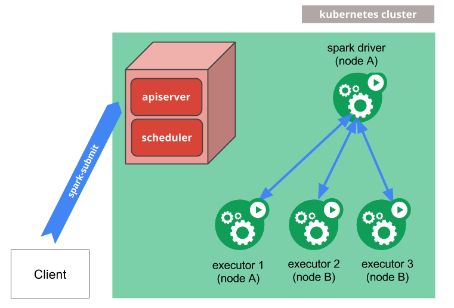

* This will become a table of contents (this text will be scraped).
{:toc}

Spark can run on clusters managed by [Kubernetes](https://kubernetes.io). This feature makes use of native
Kubernetes scheduler that has been added to Spark.

# Security

Security features like authentication are not enabled by default. When deploying a cluster that is open to the internet
or an untrusted network, it's important to secure access to the cluster to prevent unauthorized applications
from running on the cluster.
Please see [Spark Security](security.html) and the specific security sections in this doc before running Spark.

## User Identity

Images built from the project provided Dockerfiles contain a default [`USER`](https://docs.docker.com/engine/reference/builder/#user) directive with a default UID of `185`.  This means that the resulting images will be running the Spark processes as this UID inside the container. Security conscious deployments should consider providing custom images with `USER` directives specifying their desired unprivileged UID and GID.  The resulting UID should include the root group in its supplementary groups in order to be able to run the Spark executables.  Users building their own images with the provided `docker-image-tool.sh` script can use the `-u <uid>` option to specify the desired UID.

Alternatively the [Pod Template](#pod-template) feature can be used to add a [Security Context](https://kubernetes.io/docs/tasks/configure-pod-container/security-context/#volumes-and-file-systems) with a `runAsUser` to the pods that Spark submits.  This can be used to override the `USER` directives in the images themselves.  Please bear in mind that this requires cooperation from your users and as such may not be a suitable solution for shared environments.  Cluster administrators should use [Pod Security Policies](https://kubernetes.io/docs/concepts/policy/pod-security-policy/#users-and-groups) if they wish to limit the users that pods may run as.

## Volume Mounts

As described later in this document under [Using Kubernetes Volumes](#using-kubernetes-volumes) Spark on K8S provides configuration options that allow for mounting certain volume types into the driver and executor pods.  In particular it allows for [`hostPath`](https://kubernetes.io/docs/concepts/storage/volumes/#hostpath) volumes which as described in the Kubernetes documentation have known security vulnerabilities.

Cluster administrators should use [Pod Security Policies](https://kubernetes.io/docs/concepts/policy/pod-security-policy/) to limit the ability to mount `hostPath` volumes appropriately for their environments.

# Prerequisites

* A running Kubernetes cluster at version >= 1.29 with access configured to it using
[kubectl](https://kubernetes.io/docs/reference/kubectl/).  If you do not already have a working Kubernetes cluster,
you may set up a test cluster on your local machine using
[minikube](https://kubernetes.io/docs/getting-started-guides/minikube/).
  * We recommend using the latest release of minikube with the DNS addon enabled.
  * Be aware that the default minikube configuration is not enough for running Spark applications.
  We recommend 3 CPUs and 4g of memory to be able to start a simple Spark application with a single
  executor.
  * Check [kubernetes-client library](https://github.com/fabric8io/kubernetes-client)'s version of your Spark environment, and its compatibility with your Kubernetes cluster's version.
* You must have appropriate permissions to list, create, edit and delete
[pods](https://kubernetes.io/docs/concepts/workloads/pods/) in your cluster. You can verify that you can list these resources
by running `kubectl auth can-i <list|create|edit|delete> pods`.
  * The service account credentials used by the driver pods must be allowed to create pods, services and configmaps.
* You must have [Kubernetes DNS](https://kubernetes.io/docs/concepts/services-networking/dns-pod-service/) configured in your cluster.

# How it works

<p style="text-align: center;">
  
</p>

<code>spark-submit</code> can be directly used to submit a Spark application to a Kubernetes cluster.
The submission mechanism works as follows:

* Spark creates a Spark driver running within a [Kubernetes pod](https://kubernetes.io/docs/concepts/workloads/pods/pod/).
* The driver creates executors which are also running within Kubernetes pods and connects to them, and executes application code.
* When the application completes, the executor pods terminate and are cleaned up, but the driver pod persists
logs and remains in "completed" state in the Kubernetes API until it's eventually garbage collected or manually cleaned up.

Note that in the completed state, the driver pod does *not* use any computational or memory resources.

The driver and executor pod scheduling is handled by Kubernetes. Communication to the Kubernetes API is done via fabric8. It is possible to schedule the
driver and executor pods on a subset of available nodes through a [node selector](https://kubernetes.io/docs/concepts/configuration/assign-pod-node/#nodeselector)
using the configuration property for it. It will be possible to use more advanced
scheduling hints like [node/pod affinities](https://kubernetes.io/docs/concepts/configuration/assign-pod-node/#affinity-and-anti-affinity) in a future release.

# Submitting Applications to Kubernetes

## Docker Images

Kubernetes requires users to supply images that can be deployed into containers within pods. The images are built to
be run in a container runtime environment that Kubernetes supports. Docker is a container runtime environment that is
frequently used with Kubernetes. Spark (starting with version 2.3) ships with a Dockerfile that can be used for this
purpose, or customized to match an individual application's needs. It can be found in the `kubernetes/dockerfiles/`
directory.

Spark also ships with a `bin/docker-image-tool.sh` script that can be used to build and publish the Docker images to
use with the Kubernetes backend.

Example usage is:

```bash
$ ./bin/docker-image-tool.sh -r <repo> -t my-tag build
$ ./bin/docker-image-tool.sh -r <repo> -t my-tag push
```
This will build using the projects provided default `Dockerfiles`. To see more options available for customising the behaviour of this tool, including providing custom `Dockerfiles`, please run with the `-h` flag.

By default `bin/docker-image-tool.sh` builds docker image for running JVM jobs. You need to opt-in to build additional
language binding docker images.

Example usage is
```bash
# To build additional PySpark docker image
$ ./bin/docker-image-tool.sh -r <repo> -t my-tag -p ./kubernetes/dockerfiles/spark/bindings/python/Dockerfile build

# To build additional SparkR docker image
$ ./bin/docker-image-tool.sh -r <repo> -t my-tag -R ./kubernetes/dockerfiles/spark/bindings/R/Dockerfile build
```

You can also use the [Apache Spark Docker images](https://hub.docker.com/r/apache/spark) (such as `apache/spark:<version>`) directly.

## Cluster Mode

To launch Spark Pi in cluster mode,

```bash
$ ./bin/spark-submit \
    --master k8s://https://<k8s-apiserver-host>:<k8s-apiserver-port> \
    --deploy-mode cluster \
    --name spark-pi \
    --class org.apache.spark.examples.SparkPi \
    --conf spark.executor.instances=5 \
    --conf spark.kubernetes.container.image=<spark-image> \
    local:///path/to/examples.jar
```

The Spark master, specified either via passing the `--master` command line argument to `spark-submit` or by setting
`spark.master` in the application's configuration, must be a URL with the format `k8s://<api_server_host>:<k8s-apiserver-port>`. The port must always be specified, even if it's the HTTPS port 443. Prefixing the
master string with `k8s://` will cause the Spark application to launch on the Kubernetes cluster, with the API server
being contacted at `api_server_url`. If no HTTP protocol is specified in the URL, it defaults to `https`. For example,
setting the master to `k8s://example.com:443` is equivalent to setting it to `k8s://https://example.com:443`, but to
connect without TLS on a different port, the master would be set to `k8s://http://example.com:8080`.

In Kubernetes mode, the Spark application name that is specified by `spark.app.name` or the `--name` argument to
`spark-submit` is used by default to name the Kubernetes resources created like drivers and executors. So, application names
must consist of lower case alphanumeric characters, `-`, and `.`  and must start and end with an alphanumeric character.

If you have a Kubernetes cluster setup, one way to discover the apiserver URL is by executing `kubectl cluster-info`.

```bash
$ kubectl cluster-info
Kubernetes master is running at http://127.0.0.1:6443
```

In the above example, the specific Kubernetes cluster can be used with <code>spark-submit</code> by specifying
`--master k8s://http://127.0.0.1:6443` as an argument to spark-submit. Additionally, it is also possible to use the
authenticating proxy, `kubectl proxy` to communicate to the Kubernetes API.

The local proxy can be started by:

```bash
$ kubectl proxy
```

If the local proxy is running at localhost:8001, `--master k8s://http://127.0.0.1:8001` can be used as the argument to
spark-submit. Finally, notice that in the above example we specify a jar with a specific URI with a scheme of `local://`.
This URI is the location of the example jar that is already in the Docker image.

## Client Mode

Starting with Spark 2.4.0, it is possible to run Spark applications on Kubernetes in client mode. When your application
runs in client mode, the driver can run inside a pod or on a physical host. When running an application in client mode,
it is recommended to account for the following factors:

### Client Mode Networking

Spark executors must be able to connect to the Spark driver over a hostname and a port that is routable from the Spark
executors. The specific network configuration that will be required for Spark to work in client mode will vary per
setup. If you run your driver inside a Kubernetes pod, you can use a
[headless service](https://kubernetes.io/docs/concepts/services-networking/service/#headless-services) to allow your
driver pod to be routable from the executors by a stable hostname. When deploying your headless service, ensure that
the service's label selector will only match the driver pod and no other pods; it is recommended to assign your driver
pod a sufficiently unique label and to use that label in the label selector of the headless service. Specify the driver's
hostname via `spark.driver.host` and your spark driver's port to `spark.driver.port`.

### Client Mode Executor Pod Garbage Collection

If you run your Spark driver in a pod, it is highly recommended to set `spark.kubernetes.driver.pod.name` to the name of that pod.
When this property is set, the Spark scheduler will deploy the executor pods with an
[OwnerReference](https://kubernetes.io/docs/concepts/workloads/controllers/garbage-collection/), which in turn will
ensure that once the driver pod is deleted from the cluster, all of the application's executor pods will also be deleted.
The driver will look for a pod with the given name in the namespace specified by `spark.kubernetes.namespace`, and
an OwnerReference pointing to that pod will be added to each executor pod's OwnerReferences list. Be careful to avoid
setting the OwnerReference to a pod that is not actually that driver pod, or else the executors may be terminated
prematurely when the wrong pod is deleted.

If your application is not running inside a pod, or if `spark.kubernetes.driver.pod.name` is not set when your application is
actually running in a pod, keep in mind that the executor pods may not be properly deleted from the cluster when the
application exits. The Spark scheduler attempts to delete these pods, but if the network request to the API server fails
for any reason, these pods will remain in the cluster. The executor processes should exit when they cannot reach the
driver, so the executor pods should not consume compute resources (cpu and memory) in the cluster after your application
exits.

You may use `spark.kubernetes.executor.podNamePrefix` to fully control the executor pod names.
When this property is set, it's highly recommended to make it unique across all jobs in the same namespace.

### Authentication Parameters

Use the exact prefix `spark.kubernetes.authenticate` for Kubernetes authentication parameters in client mode.

## IPv4 and IPv6

Starting with 3.4.0, Spark supports additionally IPv6-only environment via
[IPv4/IPv6 dual-stack network](https://kubernetes.io/docs/concepts/services-networking/dual-stack/)
feature which enables the allocation of both IPv4 and IPv6 addresses to Pods and Services.
According to the K8s cluster capability, `spark.kubernetes.driver.service.ipFamilyPolicy` and
`spark.kubernetes.driver.service.ipFamilies` can be one of `SingleStack`, `PreferDualStack`,
and `RequireDualStack` and one of `IPv4`, `IPv6`, `IPv4,IPv6`, and `IPv6,IPv4` respectively.
By default, Spark uses `spark.kubernetes.driver.service.ipFamilyPolicy=SingleStack` and
`spark.kubernetes.driver.service.ipFamilies=IPv4`.

To use only `IPv6`, you can submit your jobs with the following.
```bash
...
    --conf spark.kubernetes.driver.service.ipFamilies=IPv6 \
```

In `DualStack` environment, you may need `java.net.preferIPv6Addresses=true` for JVM
and `SPARK_PREFER_IPV6=true` for Python additionally to use `IPv6`.

## Dependency Management

If your application's dependencies are all hosted in remote locations like HDFS or HTTP servers, they may be referred to
by their appropriate remote URIs. Also, application dependencies can be pre-mounted into custom-built Docker images.
Those dependencies can be added to the classpath by referencing them with `local://` URIs and/or setting the
`SPARK_EXTRA_CLASSPATH` environment variable in your Dockerfiles. The `local://` scheme is also required when referring to
dependencies in custom-built Docker images in `spark-submit`. We support dependencies from the submission
client's local file system using the `file://` scheme or without a scheme (using a full path), where the destination should be a Hadoop compatible filesystem.
A typical example of this using S3 is via passing the following options:

```
...
--packages org.apache.hadoop:hadoop-aws:3.4.1
--conf spark.kubernetes.file.upload.path=s3a://<s3-bucket>/path
--conf spark.hadoop.fs.s3a.access.key=...
--conf spark.hadoop.fs.s3a.impl=org.apache.hadoop.fs.s3a.S3AFileSystem
--conf spark.hadoop.fs.s3a.fast.upload=true
--conf spark.hadoop.fs.s3a.secret.key=....
--conf spark.driver.extraJavaOptions=-Divy.cache.dir=/tmp -Divy.home=/tmp
file:///full/path/to/app.jar
```
The app jar file will be uploaded to the S3 and then when the driver is launched it will be downloaded
to the driver pod and will be added to its classpath. Spark will generate a subdir under the upload path with a random name
to avoid conflicts with spark apps running in parallel. User could manage the subdirs created according to his needs.

The client scheme is supported for the application jar, and dependencies specified by properties `spark.jars`, `spark.files` and `spark.archives`.

Important: all client-side dependencies will be uploaded to the given path with a flat directory structure so
file names must be unique otherwise files will be overwritten. Also make sure in the derived k8s image default ivy dir
has the required access rights or modify the settings as above. The latter is also important if you use `--packages` in
cluster mode.

## Secret Management
Kubernetes [Secrets](https://kubernetes.io/docs/concepts/configuration/secret/) can be used to provide credentials for a
Spark application to access secured services. To mount a user-specified secret into the driver container, users can use
the configuration property of the form `spark.kubernetes.driver.secrets.[SecretName]=<mount path>`. Similarly, the
configuration property of the form `spark.kubernetes.executor.secrets.[SecretName]=<mount path>` can be used to mount a
user-specified secret into the executor containers. Note that it is assumed that the secret to be mounted is in the same
namespace as that of the driver and executor pods. For example, to mount a secret named `spark-secret` onto the path
`/etc/secrets` in both the driver and executor containers, add the following options to the `spark-submit` command:

```
--conf spark.kubernetes.driver.secrets.spark-secret=/etc/secrets
--conf spark.kubernetes.executor.secrets.spark-secret=/etc/secrets
```

To use a secret through an environment variable use the following options to the `spark-submit` command:
```
--conf spark.kubernetes.driver.secretKeyRef.ENV_NAME=name:key
--conf spark.kubernetes.executor.secretKeyRef.ENV_NAME=name:key
```

## Pod Template
Kubernetes allows defining pods from [template files](https://kubernetes.io/docs/concepts/workloads/pods/pod-overview/#pod-templates).
Spark users can similarly use template files to define the driver or executor pod configurations that Spark configurations do not support.
To do so, specify the spark properties `spark.kubernetes.driver.podTemplateFile` and `spark.kubernetes.executor.podTemplateFile`
to point to files accessible to the `spark-submit` process.

```
--conf spark.kubernetes.driver.podTemplateFile=s3a://bucket/driver.yml
--conf spark.kubernetes.executor.podTemplateFile=s3a://bucket/executor.yml
```

To allow the driver pod access the executor pod template
file, the file will be automatically mounted onto a volume in the driver pod when it's created.
Spark does not do any validation after unmarshalling these template files and relies on the Kubernetes API server for validation.

It is important to note that Spark is opinionated about certain pod configurations so there are values in the
pod template that will always be overwritten by Spark. Therefore, users of this feature should note that specifying
the pod template file only lets Spark start with a template pod instead of an empty pod during the pod-building process.
For details, see the [full list](#pod-template-properties) of pod template values that will be overwritten by spark.

Pod template files can also define multiple containers. In such cases, you can use the spark properties
`spark.kubernetes.driver.podTemplateContainerName` and `spark.kubernetes.executor.podTemplateContainerName`
to indicate which container should be used as a basis for the driver or executor.
If not specified, or if the container name is not valid, Spark will assume that the first container in the list
will be the driver or executor container.

## Using Kubernetes Volumes

Users can mount the following types of Kubernetes [volumes](https://kubernetes.io/docs/concepts/storage/volumes/) into the driver and executor pods:
* [hostPath](https://kubernetes.io/docs/concepts/storage/volumes/#hostpath): mounts a file or directory from the host node’s filesystem into a pod.
* [emptyDir](https://kubernetes.io/docs/concepts/storage/volumes/#emptydir): an initially empty volume created when a pod is assigned to a node.
* [nfs](https://kubernetes.io/docs/concepts/storage/volumes/#nfs): mounts an existing NFS(Network File System) into a pod.
* [persistentVolumeClaim](https://kubernetes.io/docs/concepts/storage/volumes/#persistentvolumeclaim): mounts a `PersistentVolume` into a pod.

**NB:** Please see the [Security](#security) section of this document for security issues related to volume mounts.

To mount a volume of any of the types above into the driver pod, use the following configuration property:

```
--conf spark.kubernetes.driver.volumes.[VolumeType].[VolumeName].mount.path=<mount path>
--conf spark.kubernetes.driver.volumes.[VolumeType].[VolumeName].mount.readOnly=<true|false>
--conf spark.kubernetes.driver.volumes.[VolumeType].[VolumeName].mount.subPath=<mount subPath>
```

Specifically, `VolumeType` can be one of the following values: `hostPath`, `emptyDir`, `nfs` and `persistentVolumeClaim`. `VolumeName` is the name you want to use for the volume under the `volumes` field in the pod specification.

Each supported type of volumes may have some specific configuration options, which can be specified using configuration properties of the following form:

```
spark.kubernetes.driver.volumes.[VolumeType].[VolumeName].options.[OptionName]=<value>
```

For example, the server and path of a `nfs` with volume name `images` can be specified using the following properties:

```
spark.kubernetes.driver.volumes.nfs.images.options.server=example.com
spark.kubernetes.driver.volumes.nfs.images.options.path=/data
```

And, the claim name of a `persistentVolumeClaim` with volume name `checkpointpvc` can be specified using the following property:

```
spark.kubernetes.driver.volumes.persistentVolumeClaim.checkpointpvc.options.claimName=check-point-pvc-claim
```

The configuration properties for mounting volumes into the executor pods use prefix `spark.kubernetes.executor.` instead of `spark.kubernetes.driver.`.

For example, you can mount a dynamically-created persistent volume claim per executor by using `OnDemand` as a claim name and `storageClass` and `sizeLimit` options like the following. This is useful in case of [Dynamic Allocation](configuration.html#dynamic-allocation).
```
spark.kubernetes.executor.volumes.persistentVolumeClaim.data.options.claimName=OnDemand
spark.kubernetes.executor.volumes.persistentVolumeClaim.data.options.storageClass=gp
spark.kubernetes.executor.volumes.persistentVolumeClaim.data.options.sizeLimit=500Gi
spark.kubernetes.executor.volumes.persistentVolumeClaim.data.mount.path=/data
spark.kubernetes.executor.volumes.persistentVolumeClaim.data.mount.readOnly=false
```

For a complete list of available options for each supported type of volumes, please refer to the [Spark Properties](#spark-properties) section below.

### PVC-oriented executor pod allocation

Since disks are one of the important resource types, Spark driver provides a fine-grained control
via a set of configurations. For example, by default, on-demand PVCs are owned by executors and
the lifecycle of PVCs are tightly coupled with its owner executors.
However, on-demand PVCs can be owned by driver and reused by another executors during the Spark job's
lifetime with the following options. This reduces the overhead of PVC creation and deletion.

```
spark.kubernetes.driver.ownPersistentVolumeClaim=true
spark.kubernetes.driver.reusePersistentVolumeClaim=true
```

In addition, since Spark 3.4, Spark driver is able to do PVC-oriented executor allocation which means
Spark counts the total number of created PVCs which the job can have, and holds on a new executor creation
if the driver owns the maximum number of PVCs. This helps the transition of the existing PVC from one executor
to another executor.
```
spark.kubernetes.driver.waitToReusePersistentVolumeClaim=true
```

## Local Storage

Spark supports using volumes to spill data during shuffles and other operations. To use a volume as local storage, the volume's name should starts with `spark-local-dir-`, for example:

```
--conf spark.kubernetes.driver.volumes.[VolumeType].spark-local-dir-[VolumeName].mount.path=<mount path>
--conf spark.kubernetes.driver.volumes.[VolumeType].spark-local-dir-[VolumeName].mount.readOnly=false
```

Specifically, you can use persistent volume claims if the jobs require large shuffle and sorting operations in executors.

```
spark.kubernetes.executor.volumes.persistentVolumeClaim.spark-local-dir-1.options.claimName=OnDemand
spark.kubernetes.executor.volumes.persistentVolumeClaim.spark-local-dir-1.options.storageClass=gp
spark.kubernetes.executor.volumes.persistentVolumeClaim.spark-local-dir-1.options.sizeLimit=500Gi
spark.kubernetes.executor.volumes.persistentVolumeClaim.spark-local-dir-1.mount.path=/data
spark.kubernetes.executor.volumes.persistentVolumeClaim.spark-local-dir-1.mount.readOnly=false
```

To enable shuffle data recovery feature via the built-in `KubernetesLocalDiskShuffleDataIO` plugin, we need to have the followings. You may want to enable `spark.kubernetes.driver.waitToReusePersistentVolumeClaim` additionally.

```
spark.kubernetes.executor.volumes.persistentVolumeClaim.spark-local-dir-1.mount.path=/data/spark-x/executor-x
spark.shuffle.sort.io.plugin.class=org.apache.spark.shuffle.KubernetesLocalDiskShuffleDataIO
```

If no volume is set as local storage, Spark uses temporary scratch space to spill data to disk during shuffles and other operations. When using Kubernetes as the resource manager the pods will be created with an [emptyDir](https://kubernetes.io/docs/concepts/storage/volumes/#emptydir) volume mounted for each directory listed in `spark.local.dir` or the environment variable `SPARK_LOCAL_DIRS` .  If no directories are explicitly specified then a default directory is created and configured appropriately.

`emptyDir` volumes use the ephemeral storage feature of Kubernetes and do not persist beyond the life of the pod.

### Using RAM for local storage

`emptyDir` volumes use the nodes backing storage for ephemeral storage by default, this behaviour may not be appropriate for some compute environments.  For example if you have diskless nodes with remote storage mounted over a network, having lots of executors doing IO to this remote storage may actually degrade performance.

In this case it may be desirable to set `spark.kubernetes.local.dirs.tmpfs=true` in your configuration which will cause the `emptyDir` volumes to be configured as `tmpfs` i.e. RAM backed volumes.  When configured like this Spark's local storage usage will count towards your pods memory usage therefore you may wish to increase your memory requests by increasing the value of `spark.{driver,executor}.memoryOverheadFactor` as appropriate.


## Introspection and Debugging

These are the different ways in which you can investigate a running/completed Spark application, monitor progress, and
take actions.

### Accessing Logs

Logs can be accessed using the Kubernetes API and the `kubectl` CLI. When a Spark application is running, it's possible
to stream logs from the application using:

```bash
$ kubectl -n=<namespace> logs -f <driver-pod-name>
```

The same logs can also be accessed through the
[Kubernetes dashboard](https://kubernetes.io/docs/tasks/access-application-cluster/web-ui-dashboard/) if installed on
the cluster.

When there exists a log collection system, you can expose it at Spark Driver `Executors` tab UI. For example,

```
spark.ui.custom.executor.log.url='https://log-server/log?appId={{APP_ID}}&execId={{EXECUTOR_ID}}'
```

You can add additional custom variables to this url template, populated with the values of existing executor environment variables like

```
spark.executorEnv.SPARK_EXECUTOR_ATTRIBUTE_YOUR_VAR='$(EXISTING_EXECUTOR_ENV_VAR)'
spark.ui.custom.executor.log.url='https://log-server/log?appId={{APP_ID}}&execId={{EXECUTOR_ID}}&your_var={{YOUR_VAR}}'
```

### Accessing Driver UI

The UI associated with any application can be accessed locally using
[`kubectl port-forward`](https://kubernetes.io/docs/tasks/access-application-cluster/port-forward-access-application-cluster/#forward-a-local-port-to-a-port-on-the-pod).

```bash
$ kubectl port-forward <driver-pod-name> 4040:4040
```

Then, the Spark driver UI can be accessed on `http://localhost:4040`.

Since Apache Spark 4.0.0, Driver UI provides a way to see driver logs via a new configuration.

```
spark.driver.log.localDir=/tmp
```

Then, the Spark driver UI can be accessed on `http://localhost:4040/logs/`.
Optionally, the layout of log is configured by the following.

```
spark.driver.log.layout="%m%n%ex"
```

### Debugging

There may be several kinds of failures. If the Kubernetes API server rejects the request made from spark-submit, or the
connection is refused for a different reason, the submission logic should indicate the error encountered. However, if there
are errors during the running of the application, often, the best way to investigate may be through the Kubernetes CLI.

To get some basic information about the scheduling decisions made around the driver pod, you can run:

```bash
$ kubectl describe pod <spark-driver-pod>
```

If the pod has encountered a runtime error, the status can be probed further using:

```bash
$ kubectl logs <spark-driver-pod>
```

Status and logs of failed executor pods can be checked in similar ways. Finally, deleting the driver pod will clean up the entire spark
application, including all executors, associated service, etc. The driver pod can be thought of as the Kubernetes representation of
the Spark application.

## Kubernetes Features

### Configuration File

Your Kubernetes config file typically lives under `.kube/config` in your home directory or in a location specified by the `KUBECONFIG` environment variable.  Spark on Kubernetes will attempt to use this file to do an initial auto-configuration of the Kubernetes client used to interact with the Kubernetes cluster.  A variety of Spark configuration properties are provided that allow further customising the client configuration e.g. using an alternative authentication method.

### Contexts

Kubernetes configuration files can contain multiple contexts that allow for switching between different clusters and/or user identities.  By default Spark on Kubernetes will use your current context (which can be checked by running `kubectl config current-context`) when doing the initial auto-configuration of the Kubernetes client.

In order to use an alternative context users can specify the desired context via the Spark configuration property `spark.kubernetes.context` e.g. `spark.kubernetes.context=minikube`.

### Namespaces

Kubernetes has the concept of [namespaces](https://kubernetes.io/docs/concepts/overview/working-with-objects/namespaces/).
Namespaces are ways to divide cluster resources between multiple users (via resource quota). Spark on Kubernetes can
use namespaces to launch Spark applications. This can be made use of through the `spark.kubernetes.namespace` configuration.

Kubernetes allows using [ResourceQuota](https://kubernetes.io/docs/concepts/policy/resource-quotas/) to set limits on
resources, number of objects, etc on individual namespaces. Namespaces and ResourceQuota can be used in combination by
administrator to control sharing and resource allocation in a Kubernetes cluster running Spark applications.

### RBAC

In Kubernetes clusters with [RBAC](https://kubernetes.io/docs/reference/access-authn-authz/rbac/) enabled, users can configure
Kubernetes RBAC roles and service accounts used by the various Spark on Kubernetes components to access the Kubernetes
API server.

The Spark driver pod uses a Kubernetes service account to access the Kubernetes API server to create and watch executor
pods. The service account used by the driver pod must have the appropriate permission for the driver to be able to do
its work. Specifically, at minimum, the service account must be granted a
[`Role` or `ClusterRole`](https://kubernetes.io/docs/reference/access-authn-authz/rbac/#role-and-clusterrole) that allows driver
pods to create pods and services. By default, the driver pod is automatically assigned the `default` service account in
the namespace specified by `spark.kubernetes.namespace`, if no service account is specified when the pod gets created.

Depending on the version and setup of Kubernetes deployed, this `default` service account may or may not have the role
that allows driver pods to create pods and services under the default Kubernetes
[RBAC](https://kubernetes.io/docs/reference/access-authn-authz/rbac/) policies. Sometimes users may need to specify a custom
service account that has the right role granted. Spark on Kubernetes supports specifying a custom service account to
be used by the driver pod through the configuration property
`spark.kubernetes.authenticate.driver.serviceAccountName=<service account name>`. For example, to make the driver pod
use the `spark` service account, a user simply adds the following option to the `spark-submit` command:

```
--conf spark.kubernetes.authenticate.driver.serviceAccountName=spark
```

To create a custom service account, a user can use the `kubectl create serviceaccount` command. For example, the
following command creates a service account named `spark`:

```bash
$ kubectl create serviceaccount spark
```

To grant a service account a `Role` or `ClusterRole`, a `RoleBinding` or `ClusterRoleBinding` is needed. To create
a `RoleBinding` or `ClusterRoleBinding`, a user can use the `kubectl create rolebinding` (or `clusterrolebinding`
for `ClusterRoleBinding`) command. For example, the following command creates an `edit` `ClusterRole` in the `default`
namespace and grants it to the `spark` service account created above:

```bash
$ kubectl create clusterrolebinding spark-role --clusterrole=edit --serviceaccount=default:spark --namespace=default
```

Note that a `Role` can only be used to grant access to resources (like pods) within a single namespace, whereas a
`ClusterRole` can be used to grant access to cluster-scoped resources (like nodes) as well as namespaced resources
(like pods) across all namespaces. For Spark on Kubernetes, since the driver always creates executor pods in the
same namespace, a `Role` is sufficient, although users may use a `ClusterRole` instead. For more information on
RBAC authorization and how to configure Kubernetes service accounts for pods, please refer to
[Using RBAC Authorization](https://kubernetes.io/docs/reference/access-authn-authz/rbac/) and
[Configure Service Accounts for Pods](https://kubernetes.io/docs/tasks/configure-pod-container/configure-service-account/).

## Spark Application Management

Kubernetes provides simple application management via the spark-submit CLI tool in cluster mode.
Users can kill a job by providing the submission ID that is printed when submitting their job.
The submission ID follows the format ``namespace:driver-pod-name``.
If user omits the namespace then the namespace set in current k8s context is used.
For example if user has set a specific namespace as follows `kubectl config set-context minikube --namespace=spark`
then the `spark` namespace will be used by default. On the other hand, if there is no namespace added to the specific context
then all namespaces will be considered by default. That means operations will affect all Spark applications matching the given submission ID regardless of namespace.
Moreover, spark-submit for application management uses the same backend code that is used for submitting the driver, so the same properties
like `spark.kubernetes.context` etc., can be re-used.

For example:
```bash
$ spark-submit --kill spark:spark-pi-1547948636094-driver --master k8s://https://192.168.2.8:8443
```
Users also can list the application status by using the `--status` flag:

```bash
$ spark-submit --status spark:spark-pi-1547948636094-driver --master  k8s://https://192.168.2.8:8443
```
Both operations support glob patterns. For example user can run:
```bash
$ spark-submit --kill spark:spark-pi* --master  k8s://https://192.168.2.8:8443
```
The above will kill all application with the specific prefix.

User can specify the grace period for pod termination via the `spark.kubernetes.appKillPodDeletionGracePeriod` property,
using `--conf` as means to provide it (default value for all K8s pods is <a href="https://kubernetes.io/docs/concepts/workloads/pods/pod">30 secs</a>).

## Future Work

There are several Spark on Kubernetes features that are currently being worked on or planned to be worked on. Those features are expected to eventually make it into future versions of the spark-kubernetes integration.

Some of these include:

* External Shuffle Service
* Job Queues and Resource Management

# Configuration

See the [configuration page](configuration.html) for information on Spark configurations.  The following configurations are specific to Spark on Kubernetes.

#### Spark Properties

<table class="spark-config">
<thead><tr><th>Property Name</th><th>Default</th><th>Meaning</th><th>Since Version</th></tr></thead>
<tr>
  <td><code>spark.kubernetes.context</code></td>
  <td><code>(none)</code></td>
  <td>
    The context from the user Kubernetes configuration file used for the initial
    auto-configuration of the Kubernetes client library.  When not specified then
    the users current context is used.  <strong>NB:</strong> Many of the
    auto-configured settings can be overridden by the use of other Spark
    configuration properties e.g. <code>spark.kubernetes.namespace</code>.
  </td>
  <td>3.0.0</td>
</tr>
<tr>
  <td><code>spark.kubernetes.driver.master</code></td>
  <td><code>https://kubernetes.default.svc</code></td>
  <td>
    The internal Kubernetes master (API server) address to be used for driver to request executors or
    'local[*]' for driver-pod-only mode.
  </td>
  <td>3.0.0</td>
</tr>
<tr>
  <td><code>spark.kubernetes.namespace</code></td>
  <td><code>default</code></td>
  <td>
    The namespace that will be used for running the driver and executor pods.
  </td>
  <td>2.3.0</td>
</tr>
<tr>
  <td><code>spark.kubernetes.container.image</code></td>
  <td><code>(none)</code></td>
  <td>
    Container image to use for the Spark application.
    This is usually of the form <code>example.com/repo/spark:v1.0.0</code>.
    This configuration is required and must be provided by the user, unless explicit
    images are provided for each different container type.
  </td>
  <td>2.3.0</td>
</tr>
<tr>
  <td><code>spark.kubernetes.driver.container.image</code></td>
  <td><code>(value of spark.kubernetes.container.image)</code></td>
  <td>
    Custom container image to use for the driver.
  </td>
  <td>2.3.0</td>
</tr>
<tr>
  <td><code>spark.kubernetes.executor.container.image</code></td>
  <td><code>(value of spark.kubernetes.container.image)</code></td>
  <td>
    Custom container image to use for executors.
  </td>
  <td>2.3.0</td>
</tr>
<tr>
  <td><code>spark.kubernetes.container.image.pullPolicy</code></td>
  <td><code>IfNotPresent</code></td>
  <td>
    Container image pull policy used when pulling images within Kubernetes.
    Valid values are <code>Always</code>, <code>Never</code>, and <code>IfNotPresent</code>.
  </td>
  <td>2.3.0</td>
</tr>
<tr>
  <td><code>spark.kubernetes.container.image.pullSecrets</code></td>
  <td><code></code></td>
  <td>
    Comma separated list of Kubernetes secrets used to pull images from private image registries.
  </td>
  <td>2.4.0</td>
</tr>
<tr>
  <td><code>spark.kubernetes.allocation.batch.size</code></td>
  <td><code>5</code></td>
  <td>
    Number of pods to launch at once in each round of executor pod allocation.
  </td>
  <td>2.3.0</td>
</tr>
<tr>
  <td><code>spark.kubernetes.allocation.batch.delay</code></td>
  <td><code>1s</code></td>
  <td>
    Time to wait between each round of executor pod allocation. Specifying values less than 1 second may lead to
    excessive CPU usage on the spark driver.
  </td>
  <td>2.3.0</td>
</tr>
<tr>
  <td><code>spark.kubernetes.jars.avoidDownloadSchemes</code></td>
  <td><code>(none)</code></td>
  <td>
    Comma-separated list of schemes for which jars will NOT be downloaded to the 
    driver local disk prior to be distributed to executors, only for kubernetes deployment. 
    For use in cases when the jars are big and executor counts are high, 
    concurrent download causes network saturation and timeouts. 
    Wildcard '*' is denoted to not downloading jars for any the schemes.
  </td>
  <td>4.0.0</td>
</tr>
<tr>
  <td><code>spark.kubernetes.authenticate.submission.caCertFile</code></td>
  <td>(none)</td>
  <td>
    Path to the CA cert file for connecting to the Kubernetes API server over TLS when starting the driver. This file
    must be located on the submitting machine's disk. Specify this as a path as opposed to a URI (i.e. do not provide
    a scheme). In client mode, use <code>spark.kubernetes.authenticate.caCertFile</code> instead.
  </td>
  <td>2.3.0</td>
</tr>
<tr>
  <td><code>spark.kubernetes.authenticate.submission.clientKeyFile</code></td>
  <td>(none)</td>
  <td>
    Path to the client key file for authenticating against the Kubernetes API server when starting the driver. This file
    must be located on the submitting machine's disk. Specify this as a path as opposed to a URI (i.e. do not provide
    a scheme). In client mode, use <code>spark.kubernetes.authenticate.clientKeyFile</code> instead.
  </td>
  <td>2.3.0</td>
</tr>
<tr>
  <td><code>spark.kubernetes.authenticate.submission.clientCertFile</code></td>
  <td>(none)</td>
  <td>
    Path to the client cert file for authenticating against the Kubernetes API server when starting the driver. This
    file must be located on the submitting machine's disk. Specify this as a path as opposed to a URI (i.e. do not
    provide a scheme). In client mode, use <code>spark.kubernetes.authenticate.clientCertFile</code> instead.
  </td>
  <td>2.3.0</td>
</tr>
<tr>
  <td><code>spark.kubernetes.authenticate.submission.oauthToken</code></td>
  <td>(none)</td>
  <td>
    OAuth token to use when authenticating against the Kubernetes API server when starting the driver. Note
    that unlike the other authentication options, this is expected to be the exact string value of the token to use for
    the authentication. In client mode, use <code>spark.kubernetes.authenticate.oauthToken</code> instead.
  </td>
  <td>2.3.0</td>
</tr>
<tr>
  <td><code>spark.kubernetes.authenticate.submission.oauthTokenFile</code></td>
  <td>(none)</td>
  <td>
    Path to the OAuth token file containing the token to use when authenticating against the Kubernetes API server when starting the driver.
    This file must be located on the submitting machine's disk. Specify this as a path as opposed to a URI (i.e. do not
    provide a scheme). In client mode, use <code>spark.kubernetes.authenticate.oauthTokenFile</code> instead.
  </td>
  <td>2.3.0</td>
</tr>
<tr>
  <td><code>spark.kubernetes.authenticate.driver.caCertFile</code></td>
  <td>(none)</td>
  <td>
    Path to the CA cert file for connecting to the Kubernetes API server over TLS from the driver pod when requesting
    executors. This file must be located on the submitting machine's disk, and will be uploaded to the driver pod.
    Specify this as a path as opposed to a URI (i.e. do not provide a scheme). In client mode, use
    <code>spark.kubernetes.authenticate.caCertFile</code> instead.
  </td>
  <td>2.3.0</td>
</tr>
<tr>
  <td><code>spark.kubernetes.authenticate.driver.clientKeyFile</code></td>
  <td>(none)</td>
  <td>
    Path to the client key file for authenticating against the Kubernetes API server from the driver pod when requesting
    executors. This file must be located on the submitting machine's disk, and will be uploaded to the driver pod as
    a Kubernetes secret. Specify this as a path as opposed to a URI (i.e. do not provide a scheme).
    In client mode, use <code>spark.kubernetes.authenticate.clientKeyFile</code> instead.
  </td>
  <td>2.3.0</td>
</tr>
<tr>
  <td><code>spark.kubernetes.authenticate.driver.clientCertFile</code></td>
  <td>(none)</td>
  <td>
    Path to the client cert file for authenticating against the Kubernetes API server from the driver pod when
    requesting executors. This file must be located on the submitting machine's disk, and will be uploaded to the
    driver pod as a Kubernetes secret. Specify this as a path as opposed to a URI (i.e. do not provide a scheme).
    In client mode, use <code>spark.kubernetes.authenticate.clientCertFile</code> instead.
  </td>
  <td>2.3.0</td>
</tr>
<tr>
  <td><code>spark.kubernetes.authenticate.driver.oauthToken</code></td>
  <td>(none)</td>
  <td>
    OAuth token to use when authenticating against the Kubernetes API server from the driver pod when
    requesting executors. Note that unlike the other authentication options, this must be the exact string value of
    the token to use for the authentication. This token value is uploaded to the driver pod as a Kubernetes secret.
    In client mode, use <code>spark.kubernetes.authenticate.oauthToken</code> instead.
  </td>
  <td>2.3.0</td>
</tr>
<tr>
  <td><code>spark.kubernetes.authenticate.driver.oauthTokenFile</code></td>
  <td>(none)</td>
  <td>
    Path to the OAuth token file containing the token to use when authenticating against the Kubernetes API server from the driver pod when
    requesting executors. Note that unlike the other authentication options, this file must contain the exact string value of
    the token to use for the authentication. This token value is uploaded to the driver pod as a secret. In client mode, use
    <code>spark.kubernetes.authenticate.oauthTokenFile</code> instead.
  </td>
  <td>2.3.0</td>
</tr>
<tr>
  <td><code>spark.kubernetes.authenticate.driver.mounted.caCertFile</code></td>
  <td>(none)</td>
  <td>
    Path to the CA cert file for connecting to the Kubernetes API server over TLS from the driver pod when requesting
    executors. This path must be accessible from the driver pod.
    Specify this as a path as opposed to a URI (i.e. do not provide a scheme). In client mode, use
    <code>spark.kubernetes.authenticate.caCertFile</code> instead.
  </td>
  <td>2.3.0</td>
</tr>
<tr>
  <td><code>spark.kubernetes.authenticate.driver.mounted.clientKeyFile</code></td>
  <td>(none)</td>
  <td>
    Path to the client key file for authenticating against the Kubernetes API server from the driver pod when requesting
    executors. This path must be accessible from the driver pod.
    Specify this as a path as opposed to a URI (i.e. do not provide a scheme). In client mode, use
    <code>spark.kubernetes.authenticate.clientKeyFile</code> instead.
  </td>
  <td>2.3.0</td>
</tr>
<tr>
  <td><code>spark.kubernetes.authenticate.driver.mounted.clientCertFile</code></td>
  <td>(none)</td>
  <td>
    Path to the client cert file for authenticating against the Kubernetes API server from the driver pod when
    requesting executors. This path must be accessible from the driver pod.
    Specify this as a path as opposed to a URI (i.e. do not provide a scheme). In client mode, use
    <code>spark.kubernetes.authenticate.clientCertFile</code> instead.
  </td>
  <td>2.3.0</td>
</tr>
<tr>
  <td><code>spark.kubernetes.authenticate.driver.mounted.oauthTokenFile</code></td>
  <td>(none)</td>
  <td>
    Path to the file containing the OAuth token to use when authenticating against the Kubernetes API server from the driver pod when
    requesting executors. This path must be accessible from the driver pod.
    Note that unlike the other authentication options, this file must contain the exact string value of the token to use
    for the authentication. In client mode, use <code>spark.kubernetes.authenticate.oauthTokenFile</code> instead.
  </td>
  <td>2.3.0</td>
</tr>
<tr>
  <td><code>spark.kubernetes.authenticate.driver.serviceAccountName</code></td>
  <td><code>default</code></td>
  <td>
    Service account that is used when running the driver pod. The driver pod uses this service account when requesting
    executor pods from the API server. Note that this cannot be specified alongside a CA cert file, client key file,
    client cert file, and/or OAuth token. In client mode, use <code>spark.kubernetes.authenticate.serviceAccountName</code> instead.
  </td>
  <td>2.3.0</td>
</tr>
<tr>
  <td><code>spark.kubernetes.authenticate.executor.serviceAccountName</code></td>
  <td><code>(value of spark.kubernetes.authenticate.driver.serviceAccountName)</code></td>
  <td>
    Service account that is used when running the executor pod.
    If this parameter is not setup, the fallback logic will use the driver's service account.
  </td>
  <td>3.1.0</td>
</tr>
<tr>
  <td><code>spark.kubernetes.authenticate.caCertFile</code></td>
  <td>(none)</td>
  <td>
    In client mode, path to the CA cert file for connecting to the Kubernetes API server over TLS when
    requesting executors. Specify this as a path as opposed to a URI (i.e. do not provide a scheme).
  </td>
  <td>2.4.0</td>
</tr>
<tr>
  <td><code>spark.kubernetes.authenticate.clientKeyFile</code></td>
  <td>(none)</td>
  <td>
    In client mode, path to the client key file for authenticating against the Kubernetes API server
    when requesting executors. Specify this as a path as opposed to a URI (i.e. do not provide a scheme).
  </td>
  <td>2.4.0</td>
</tr>
<tr>
  <td><code>spark.kubernetes.authenticate.clientCertFile</code></td>
  <td>(none)</td>
  <td>
    In client mode, path to the client cert file for authenticating against the Kubernetes API server
    when requesting executors. Specify this as a path as opposed to a URI (i.e. do not provide a scheme).
  </td>
  <td>2.4.0</td>
</tr>
<tr>
  <td><code>spark.kubernetes.authenticate.oauthToken</code></td>
  <td>(none)</td>
  <td>
    In client mode, the OAuth token to use when authenticating against the Kubernetes API server when
    requesting executors. Note that unlike the other authentication options, this must be the exact string value of
    the token to use for the authentication.
  </td>
  <td>2.4.0</td>
</tr>
<tr>
  <td><code>spark.kubernetes.authenticate.oauthTokenFile</code></td>
  <td>(none)</td>
  <td>
    In client mode, path to the file containing the OAuth token to use when authenticating against the Kubernetes API
    server when requesting executors.
  </td>
  <td>2.4.0</td>
</tr>
<tr>
  <td><code>spark.kubernetes.driver.label.[LabelName]</code></td>
  <td>(none)</td>
  <td>
    Add the label specified by <code>LabelName</code> to the driver pod.
    For example, <code>spark.kubernetes.driver.label.something=true</code>.
    Note that Spark also adds its own labels to the driver pod
    for bookkeeping purposes.
  </td>
  <td>2.3.0</td>
</tr>
<tr>
  <td><code>spark.kubernetes.driver.annotation.[AnnotationName]</code></td>
  <td>(none)</td>
  <td>
    Add the Kubernetes <a href="https://kubernetes.io/docs/concepts/overview/working-with-objects/annotations/">annotation</a> specified by <code>AnnotationName</code> to the driver pod.
    For example, <code>spark.kubernetes.driver.annotation.something=true</code>.
  </td>
  <td>2.3.0</td>
</tr>
<tr>
  <td><code>spark.kubernetes.driver.service.label.[LabelName]</code></td>
  <td>(none)</td>
  <td>
    Add the Kubernetes <a href="https://kubernetes.io/docs/concepts/overview/working-with-objects/labels/">label</a> specified by <code>LabelName</code> to the driver service.
    For example, <code>spark.kubernetes.driver.service.label.something=true</code>.
    Note that Spark also adds its own labels to the driver service
    for bookkeeping purposes.
  </td>
  <td>3.4.0</td>
</tr>
<tr>
  <td><code>spark.kubernetes.driver.service.annotation.[AnnotationName]</code></td>
  <td>(none)</td>
  <td>
    Add the Kubernetes <a href="https://kubernetes.io/docs/concepts/overview/working-with-objects/annotations/">annotation</a> specified by <code>AnnotationName</code> to the driver service.
    For example, <code>spark.kubernetes.driver.service.annotation.something=true</code>.
  </td>
  <td>3.0.0</td>
</tr>
<tr>
  <td><code>spark.kubernetes.executor.label.[LabelName]</code></td>
  <td>(none)</td>
  <td>
    Add the label specified by <code>LabelName</code> to the executor pods.
    For example, <code>spark.kubernetes.executor.label.something=true</code>.
    Note that Spark also adds its own labels to the executor pod
    for bookkeeping purposes.
  </td>
  <td>2.3.0</td>
</tr>
<tr>
  <td><code>spark.kubernetes.executor.annotation.[AnnotationName]</code></td>
  <td>(none)</td>
  <td>
    Add the Kubernetes <a href="https://kubernetes.io/docs/concepts/overview/working-with-objects/annotations/">annotation</a> specified by <code>AnnotationName</code> to the executor pods.
    For example, <code>spark.kubernetes.executor.annotation.something=true</code>.
  </td>
  <td>2.3.0</td>
</tr>
<tr>
  <td><code>spark.kubernetes.driver.pod.name</code></td>
  <td>(none)</td>
  <td>
    Name of the driver pod. In cluster mode, if this is not set, the driver pod name is set to "spark.app.name"
    suffixed by the current timestamp to avoid name conflicts. In client mode, if your application is running
    inside a pod, it is highly recommended to set this to the name of the pod your driver is running in. Setting this
    value in client mode allows the driver to become the owner of its executor pods, which in turn allows the executor
    pods to be garbage collected by the cluster.
  </td>
  <td>2.3.0</td>
</tr>
<tr>
  <td><code>spark.kubernetes.executor.podNamePrefix</code></td>
  <td>(none)</td>
  <td>
    Prefix to use in front of the executor pod names. It must conform the rules defined by the Kubernetes
    <a href="https://kubernetes.io/docs/concepts/overview/working-with-objects/names/#dns-label-names">DNS Label Names</a>.
    The prefix will be used to generate executor pod names in the form of <code>\$podNamePrefix-exec-\$id</code>, where the `id` is
    a positive int value, so the length of the `podNamePrefix` needs to be less than or equal to 47(= 63 - 10 - 6).
  </td>
  <td>2.3.0</td>
</tr>
<tr>
  <td><code>spark.kubernetes.submission.waitAppCompletion</code></td>
  <td><code>true</code></td>
  <td>
    In cluster mode, whether to wait for the application to finish before exiting the launcher process.  When changed to
    false, the launcher has a "fire-and-forget" behavior when launching the Spark job.
  </td>
  <td>2.3.0</td>
</tr>
<tr>
  <td><code>spark.kubernetes.report.interval</code></td>
  <td><code>1s</code></td>
  <td>
    Interval between reports of the current Spark job status in cluster mode.
  </td>
  <td>2.3.0</td>
</tr>
<tr>
  <td><code>spark.kubernetes.executor.apiPollingInterval</code></td>
  <td><code>30s</code></td>
  <td>
    Interval between polls against the Kubernetes API server to inspect the state of executors.
  </td>
  <td>2.4.0</td>
</tr>
<tr>
  <td><code>spark.kubernetes.driver.request.cores</code></td>
  <td>(none)</td>
  <td>
    Specify the cpu request for the driver pod. Values conform to the Kubernetes <a href="https://kubernetes.io/docs/concepts/configuration/manage-compute-resources-container/#meaning-of-cpu">convention</a>.
    Example values include 0.1, 500m, 1.5, 5, etc., with the definition of cpu units documented in <a href="https://kubernetes.io/docs/tasks/configure-pod-container/assign-cpu-resource/#cpu-units">CPU units</a>.
    This takes precedence over <code>spark.driver.cores</code> for specifying the driver pod cpu request if set.
  </td>
  <td>3.0.0</td>
</tr>
<tr>
  <td><code>spark.kubernetes.driver.limit.cores</code></td>
  <td>(none)</td>
  <td>
    Specify a hard cpu <a href="https://kubernetes.io/docs/concepts/configuration/manage-compute-resources-container/#resource-requests-and-limits-of-pod-and-container">limit</a> for the driver pod.
  </td>
  <td>2.3.0</td>
</tr>
<tr>
  <td><code>spark.kubernetes.executor.request.cores</code></td>
  <td>(none)</td>
  <td>
    Specify the cpu request for each executor pod. Values conform to the Kubernetes <a href="https://kubernetes.io/docs/concepts/configuration/manage-compute-resources-container/#meaning-of-cpu">convention</a>.
    Example values include 0.1, 500m, 1.5, 5, etc., with the definition of cpu units documented in <a href="https://kubernetes.io/docs/tasks/configure-pod-container/assign-cpu-resource/#cpu-units">CPU units</a>.
    This is distinct from <code>spark.executor.cores</code>: it is only used and takes precedence over <code>spark.executor.cores</code> for specifying the executor pod cpu request if set. Task
    parallelism, e.g., number of tasks an executor can run concurrently is not affected by this.
  </td>
  <td>2.4.0</td>
</tr>
<tr>
  <td><code>spark.kubernetes.executor.limit.cores</code></td>
  <td>(none)</td>
  <td>
    Specify a hard cpu <a href="https://kubernetes.io/docs/concepts/configuration/manage-compute-resources-container/#resource-requests-and-limits-of-pod-and-container">limit</a> for each executor pod launched for the Spark Application.
  </td>
  <td>2.3.0</td>
</tr>
<tr>
  <td><code>spark.kubernetes.node.selector.[labelKey]</code></td>
  <td>(none)</td>
  <td>
    Adds to the node selector of the driver pod and executor pods, with key <code>labelKey</code> and the value as the
    configuration's value. For example, setting <code>spark.kubernetes.node.selector.identifier</code> to <code>myIdentifier</code>
    will result in the driver pod and executors having a node selector with key <code>identifier</code> and value
     <code>myIdentifier</code>. Multiple node selector keys can be added by setting multiple configurations with this prefix.
  </td>
  <td>2.3.0</td>
</tr>
<tr>
  <td><code>spark.kubernetes.driver.node.selector.[labelKey]</code></td>
  <td>(none)</td>
  <td>
    Adds to the driver node selector of the driver pod, with key <code>labelKey</code> and the value as the
    configuration's value. For example, setting <code>spark.kubernetes.driver.node.selector.identifier</code> to <code>myIdentifier</code>
    will result in the driver pod having a node selector with key <code>identifier</code> and value
     <code>myIdentifier</code>. Multiple driver node selector keys can be added by setting multiple configurations with this prefix.
  </td>
  <td>3.3.0</td>
</tr>
<tr>
  <td><code>spark.kubernetes.executor.node.selector.[labelKey]</code></td>
  <td>(none)</td>
  <td>
    Adds to the executor node selector of the executor pods, with key <code>labelKey</code> and the value as the
    configuration's value. For example, setting <code>spark.kubernetes.executor.node.selector.identifier</code> to <code>myIdentifier</code>
    will result in the executors having a node selector with key <code>identifier</code> and value
     <code>myIdentifier</code>. Multiple executor node selector keys can be added by setting multiple configurations with this prefix.
  </td>
  <td>3.3.0</td>
</tr>
<tr>
  <td><code>spark.kubernetes.driverEnv.[EnvironmentVariableName]</code></td>
  <td>(none)</td>
  <td>
    Add the environment variable specified by <code>EnvironmentVariableName</code> to
    the Driver process. The user can specify multiple of these to set multiple environment variables.
  </td>
  <td>2.3.0</td>
</tr>
<tr>
  <td><code>spark.kubernetes.driver.secrets.[SecretName]</code></td>
  <td>(none)</td>
  <td>
   Add the <a href="https://kubernetes.io/docs/concepts/configuration/secret/">Kubernetes Secret</a> named <code>SecretName</code> to the driver pod on the path specified in the value. For example,
   <code>spark.kubernetes.driver.secrets.spark-secret=/etc/secrets</code>.
  </td>
  <td>2.3.0</td>
</tr>
<tr>
  <td><code>spark.kubernetes.executor.secrets.[SecretName]</code></td>
  <td>(none)</td>
  <td>
   Add the <a href="https://kubernetes.io/docs/concepts/configuration/secret/">Kubernetes Secret</a> named <code>SecretName</code> to the executor pod on the path specified in the value. For example,
   <code>spark.kubernetes.executor.secrets.spark-secret=/etc/secrets</code>.
  </td>
  <td>2.3.0</td>
</tr>
<tr>
  <td><code>spark.kubernetes.driver.secretKeyRef.[EnvName]</code></td>
  <td>(none)</td>
  <td>
   Add as an environment variable to the driver container with name EnvName (case sensitive), the value referenced by key <code> key </code> in the data of the referenced <a href="https://kubernetes.io/docs/concepts/configuration/secret/#using-secrets-as-environment-variables">Kubernetes Secret</a>. For example,
   <code>spark.kubernetes.driver.secretKeyRef.ENV_VAR=spark-secret:key</code>.
  </td>
  <td>2.4.0</td>
</tr>
<tr>
  <td><code>spark.kubernetes.executor.secretKeyRef.[EnvName]</code></td>
  <td>(none)</td>
  <td>
   Add as an environment variable to the executor container with name EnvName (case sensitive), the value referenced by key <code> key </code> in the data of the referenced <a href="https://kubernetes.io/docs/concepts/configuration/secret/#using-secrets-as-environment-variables">Kubernetes Secret</a>. For example,
   <code>spark.kubernetes.executor.secrets.ENV_VAR=spark-secret:key</code>.
  </td>
  <td>2.4.0</td>
</tr>
<tr>
  <td><code>spark.kubernetes.driver.volumes.[VolumeType].[VolumeName].mount.path</code></td>
  <td>(none)</td>
  <td>
   Add the <a href="https://kubernetes.io/docs/concepts/storage/volumes/">Kubernetes Volume</a> named <code>VolumeName</code> of the <code>VolumeType</code> type to the driver pod on the path specified in the value. For example,
   <code>spark.kubernetes.driver.volumes.persistentVolumeClaim.checkpointpvc.mount.path=/checkpoint</code>.
  </td>
  <td>2.4.0</td>
</tr>
<tr>
  <td><code>spark.kubernetes.driver.volumes.[VolumeType].[VolumeName].mount.subPath</code></td>
  <td>(none)</td>
  <td>
   Specifies a <a href="https://kubernetes.io/docs/concepts/storage/volumes/#using-subpath">subpath</a> to be mounted from the volume into the driver pod.
   <code>spark.kubernetes.driver.volumes.persistentVolumeClaim.checkpointpvc.mount.subPath=checkpoint</code>.
  </td>
  <td>3.0.0</td>
</tr>
<tr>
  <td><code>spark.kubernetes.driver.volumes.[VolumeType].[VolumeName].mount.readOnly</code></td>
  <td>(none)</td>
  <td>
   Specify if the mounted volume is read only or not. For example,
   <code>spark.kubernetes.driver.volumes.persistentVolumeClaim.checkpointpvc.mount.readOnly=false</code>.
  </td>
  <td>2.4.0</td>
</tr>
<tr>
  <td><code>spark.kubernetes.driver.volumes.[VolumeType].[VolumeName].options.[OptionName]</code></td>
  <td>(none)</td>
  <td>
   Configure <a href="https://kubernetes.io/docs/concepts/storage/volumes/">Kubernetes Volume</a> options passed to the Kubernetes with <code>OptionName</code> as key having specified value, must conform with Kubernetes option format. For example,
   <code>spark.kubernetes.driver.volumes.persistentVolumeClaim.checkpointpvc.options.claimName=spark-pvc-claim</code>.
  </td>
  <td>2.4.0</td>
</tr>
<tr>
  <td><code>spark.kubernetes.driver.volumes.[VolumeType].[VolumeName].label.[LabelName]</code></td>
  <td>(none)</td>
  <td>
   Configure <a href="https://kubernetes.io/docs/concepts/storage/volumes/">Kubernetes Volume</a> labels passed to the Kubernetes with <code>LabelName</code> as key having specified value, must conform with Kubernetes label format. For example,
   <code>spark.kubernetes.driver.volumes.persistentVolumeClaim.checkpointpvc.label.foo=bar</code>.
  </td>
  <td>4.0.0</td>
</tr>
<tr>
  <td><code>spark.kubernetes.driver.volumes.[VolumeType].[VolumeName].annotation.[AnnotationName]</code></td>
  <td>(none)</td>
  <td>
   Configure <a href="https://kubernetes.io/docs/concepts/storage/volumes/">Kubernetes Volume</a> annotations passed to the Kubernetes with <code>AnnotationName</code> as key having specified value, must conform with Kubernetes annotations format. For example,
   <code>spark.kubernetes.driver.volumes.persistentVolumeClaim.checkpointpvc.annotation.foo=bar</code>.
  </td>
  <td>4.0.0</td>
</tr>
<tr>
  <td><code>spark.kubernetes.executor.volumes.[VolumeType].[VolumeName].mount.path</code></td>
  <td>(none)</td>
  <td>
   Add the <a href="https://kubernetes.io/docs/concepts/storage/volumes/">Kubernetes Volume</a> named <code>VolumeName</code> of the <code>VolumeType</code> type to the executor pod on the path specified in the value. For example,
   <code>spark.kubernetes.executor.volumes.persistentVolumeClaim.checkpointpvc.mount.path=/checkpoint</code>.
  </td>
  <td>2.4.0</td>
</tr>
<tr>
  <td><code>spark.kubernetes.executor.volumes.[VolumeType].[VolumeName].mount.subPath</code></td>
  <td>(none)</td>
  <td>
   Specifies a <a href="https://kubernetes.io/docs/concepts/storage/volumes/#using-subpath">subpath</a> to be mounted from the volume into the executor pod.
   <code>spark.kubernetes.executor.volumes.persistentVolumeClaim.checkpointpvc.mount.subPath=checkpoint</code>.
  </td>
  <td>3.0.0</td>
</tr>
<tr>
  <td><code>spark.kubernetes.executor.volumes.[VolumeType].[VolumeName].mount.readOnly</code></td>
  <td>false</td>
  <td>
   Specify if the mounted volume is read only or not. For example,
   <code>spark.kubernetes.executor.volumes.persistentVolumeClaim.checkpointpvc.mount.readOnly=false</code>.
  </td>
  <td>2.4.0</td>
</tr>
<tr>
  <td><code>spark.kubernetes.executor.volumes.[VolumeType].[VolumeName].options.[OptionName]</code></td>
  <td>(none)</td>
  <td>
   Configure <a href="https://kubernetes.io/docs/concepts/storage/volumes/">Kubernetes Volume</a> options passed to the Kubernetes with <code>OptionName</code> as key having specified value. For example,
   <code>spark.kubernetes.executor.volumes.persistentVolumeClaim.checkpointpvc.options.claimName=spark-pvc-claim</code>.
  </td>
  <td>2.4.0</td>
</tr>
<tr>
  <td><code>spark.kubernetes.executor.volumes.[VolumeType].[VolumeName].label.[LabelName]</code></td>
  <td>(none)</td>
  <td>
   Configure <a href="https://kubernetes.io/docs/concepts/storage/volumes/">Kubernetes Volume</a> labels passed to the Kubernetes with <code>LabelName</code> as key having specified value, must conform with Kubernetes label format. For example,
   <code>spark.kubernetes.executor.volumes.persistentVolumeClaim.checkpointpvc.label.foo=bar</code>.
  </td>
  <td>4.0.0</td>
</tr>
<tr>
  <td><code>spark.kubernetes.executor.volumes.[VolumeType].[VolumeName].annotation.[AnnotationName]</code></td>
  <td>(none)</td>
  <td>
   Configure <a href="https://kubernetes.io/docs/concepts/storage/volumes/">Kubernetes Volume</a> annotations passed to the Kubernetes with <code>AnnotationName</code> as key having specified value, must conform with Kubernetes annotations format. For example,
   <code>spark.kubernetes.executor.volumes.persistentVolumeClaim.checkpointpvc.annotation.foo=bar</code>.
  </td>
  <td>4.0.0</td>
</tr>
<tr>
  <td><code>spark.kubernetes.local.dirs.tmpfs</code></td>
  <td><code>false</code></td>
  <td>
   Configure the <code>emptyDir</code> volumes used to back <code>SPARK_LOCAL_DIRS</code> within the Spark driver and executor pods to use <code>tmpfs</code> backing i.e. RAM.  See <a href="#local-storage">Local Storage</a> earlier on this page
   for more discussion of this.
  </td>
  <td>3.0.0</td>
</tr>
<tr>
  <td><code>spark.kubernetes.memoryOverheadFactor</code></td>
  <td><code>0.1</code></td>
  <td>
    This sets the Memory Overhead Factor that will allocate memory to non-JVM memory, which includes off-heap memory allocations, non-JVM tasks, various systems processes, and <code>tmpfs</code>-based local directories when <code>spark.kubernetes.local.dirs.tmpfs</code> is <code>true</code>. For JVM-based jobs this value will default to 0.10 and 0.40 for non-JVM jobs.
    This is done as non-JVM tasks need more non-JVM heap space and such tasks commonly fail with "Memory Overhead Exceeded" errors. This preempts this error with a higher default.
    This will be overridden by the value set by <code>spark.driver.memoryOverheadFactor</code> and <code>spark.executor.memoryOverheadFactor</code> explicitly.
  </td>
  <td>2.4.0</td>
</tr>
<tr>
  <td><code>spark.kubernetes.pyspark.pythonVersion</code></td>
  <td><code>"3"</code></td>
  <td>
   This sets the major Python version of the docker image used to run the driver and executor containers.
   It can be only "3". This configuration was deprecated from Spark 3.1.0, and is effectively no-op.
   Users should set 'spark.pyspark.python' and 'spark.pyspark.driver.python' configurations or
   'PYSPARK_PYTHON' and 'PYSPARK_DRIVER_PYTHON' environment variables.
  </td>
  <td>2.4.0</td>
</tr>
<tr>
  <td><code>spark.kubernetes.kerberos.krb5.path</code></td>
  <td><code>(none)</code></td>
  <td>
   Specify the local location of the krb5.conf file to be mounted on the driver and executors for Kerberos interaction.
   It is important to note that the KDC defined needs to be visible from inside the containers.
  </td>
  <td>3.0.0</td>
</tr>
<tr>
  <td><code>spark.kubernetes.kerberos.krb5.configMapName</code></td>
  <td><code>(none)</code></td>
  <td>
   Specify the name of the ConfigMap, containing the krb5.conf file, to be mounted on the driver and executors
   for Kerberos interaction. The KDC defined needs to be visible from inside the containers. The ConfigMap must also
   be in the same namespace of the driver and executor pods.
  </td>
  <td>3.0.0</td>
</tr>
<tr>
  <td><code>spark.kubernetes.hadoop.configMapName</code></td>
  <td><code>(none)</code></td>
  <td>
    Specify the name of the ConfigMap, containing the HADOOP_CONF_DIR files, to be mounted on the driver
    and executors for custom Hadoop configuration.
  </td>
  <td>3.0.0</td>
</tr>
<tr>
  <td><code>spark.kubernetes.kerberos.tokenSecret.name</code></td>
  <td><code>(none)</code></td>
  <td>
    Specify the name of the secret where your existing delegation tokens are stored. This removes the need for the job user
    to provide any kerberos credentials for launching a job.
  </td>
  <td>3.0.0</td>
</tr>
<tr>
  <td><code>spark.kubernetes.kerberos.tokenSecret.itemKey</code></td>
  <td><code>(none)</code></td>
  <td>
    Specify the item key of the data where your existing delegation tokens are stored. This removes the need for the job user
    to provide any kerberos credentials for launching a job.
  </td>
  <td>3.0.0</td>
</tr>
<tr>
  <td><code>spark.kubernetes.driver.podTemplateFile</code></td>
  <td>(none)</td>
  <td>
   Specify the local file that contains the driver <a href="#pod-template">pod template</a>. For example
   <code>spark.kubernetes.driver.podTemplateFile=/path/to/driver-pod-template.yaml</code>
  </td>
  <td>3.0.0</td>
</tr>
<tr>
  <td><code>spark.kubernetes.driver.podTemplateContainerName</code></td>
  <td>(none)</td>
  <td>
   Specify the container name to be used as a basis for the driver in the given <a href="#pod-template">pod template</a>.
   For example <code>spark.kubernetes.driver.podTemplateContainerName=spark-driver</code>
  </td>
  <td>3.0.0</td>
</tr>
<tr>
  <td><code>spark.kubernetes.executor.podTemplateFile</code></td>
  <td>(none)</td>
  <td>
   Specify the local file that contains the executor <a href="#pod-template">pod template</a>. For example
   <code>spark.kubernetes.executor.podTemplateFile=/path/to/executor-pod-template.yaml</code>
  </td>
  <td>3.0.0</td>
</tr>
<tr>
  <td><code>spark.kubernetes.executor.podTemplateContainerName</code></td>
  <td>(none)</td>
  <td>
   Specify the container name to be used as a basis for the executor in the given <a href="#pod-template">pod template</a>.
   For example <code>spark.kubernetes.executor.podTemplateContainerName=spark-executor</code>
  </td>
  <td>3.0.0</td>
</tr>
<tr>
  <td><code>spark.kubernetes.executor.deleteOnTermination</code></td>
  <td>true</td>
  <td>
  Specify whether executor pods should be deleted in case of failure or normal termination.
  </td>
  <td>3.0.0</td>
</tr>
<tr>
  <td><code>spark.kubernetes.executor.checkAllContainers</code></td>
  <td><code>true</code></td>
  <td>
  Specify whether executor pods should be check all containers (including sidecars) or only the executor container when determining the pod status.
  </td>
  <td>3.1.0</td>
</tr>
<tr>
  <td><code>spark.kubernetes.submission.connectionTimeout</code></td>
  <td><code>10000</code></td>
  <td>
    Connection timeout in milliseconds for the kubernetes client to use for starting the driver.
  </td>
  <td>3.0.0</td>
</tr>
<tr>
  <td><code>spark.kubernetes.submission.requestTimeout</code></td>
  <td><code>10000</code></td>
  <td>
    Request timeout in milliseconds for the kubernetes client to use for starting the driver.
  </td>
  <td>3.0.0</td>
</tr>
<tr>
  <td><code>spark.kubernetes.trust.certificates</code></td>
  <td><code>false</code></td>
  <td>
    If set to true then client can submit to kubernetes cluster only with token.
  </td>
  <td>3.2.0</td>
</tr>
<tr>
  <td><code>spark.kubernetes.driver.connectionTimeout</code></td>
  <td><code>10000</code></td>
  <td>
    Connection timeout in milliseconds for the kubernetes client in driver to use when requesting executors.
  </td>
  <td>3.0.0</td>
</tr>
<tr>
  <td><code>spark.kubernetes.driver.requestTimeout</code></td>
  <td><code>10000</code></td>
  <td>
    Request timeout in milliseconds for the kubernetes client in driver to use when requesting executors.
  </td>
  <td>3.0.0</td>
</tr>
<tr>
  <td><code>spark.kubernetes.appKillPodDeletionGracePeriod</code></td>
  <td>(none)</td>
  <td>
  Specify the grace period in seconds when deleting a Spark application using spark-submit.
  </td>
  <td>3.0.0</td>
</tr>
<tr>
  <td><code>spark.kubernetes.dynamicAllocation.deleteGracePeriod</code></td>
  <td><code>5s</code></td>
  <td>
    How long to wait for executors to shut down gracefully before a forceful kill.
  </td>
  <td>3.0.0</td>
</tr>
<tr>
  <td><code>spark.kubernetes.file.upload.path</code></td>
  <td>(none)</td>
  <td>
    Path to store files at the spark submit side in cluster mode. For example:
    <code>spark.kubernetes.file.upload.path=s3a://&lt;s3-bucket&gt;/path</code>
    File should specified as <code>file://path/to/file </code> or absolute path.
  </td>
  <td>3.0.0</td>
</tr>
<tr>
  <td><code>spark.kubernetes.executor.decommissionLabel</code></td>
  <td>(none)</td>
  <td>
    Label to be applied to pods which are exiting or being decommissioned. Intended for use
    with pod disruption budgets, deletion costs, and similar.
  </td>
  <td>3.3.0</td>
</tr>
<tr>
  <td><code>spark.kubernetes.executor.decommissionLabelValue</code></td>
  <td>(none)</td>
  <td>
    Value to be applied with the label when
    <code>spark.kubernetes.executor.decommissionLabel</code> is enabled.
  </td>
  <td>3.3.0</td>
</tr>
<tr>
  <td><code>spark.kubernetes.executor.scheduler.name</code></td>
  <td>(none)</td>
  <td>
	Specify the scheduler name for each executor pod.
  </td>
  <td>3.0.0</td>
</tr>
<tr>
  <td><code>spark.kubernetes.driver.scheduler.name</code></td>
  <td>(none)</td>
  <td>
    Specify the scheduler name for driver pod.
  </td>
  <td>3.3.0</td>
</tr>
<tr>
  <td><code>spark.kubernetes.scheduler.name</code></td>
  <td>(none)</td>
  <td>
    Specify the scheduler name for driver and executor pods. If `spark.kubernetes.driver.scheduler.name` or
    `spark.kubernetes.executor.scheduler.name` is set, will override this.
  </td>
  <td>3.3.0</td>
</tr>
<tr>
  <td><code>spark.kubernetes.configMap.maxSize</code></td>
  <td><code>1572864</code></td>
  <td>
    Max size limit for a config map.
    This is configurable as per <a href="https://etcd.io/docs/latest/dev-guide/limit/">limit</a> on k8s server end.
  </td>
  <td>3.1.0</td>
</tr>
<tr>
  <td><code>spark.kubernetes.executor.missingPodDetectDelta</code></td>
  <td><code>30s</code></td>
  <td>
    When a registered executor's POD is missing from the Kubernetes API server's polled
    list of PODs then this delta time is taken as the accepted time difference between the
    registration time and the time of the polling. After this time the POD is considered
    missing from the cluster and the executor will be removed.
  </td>
  <td>3.1.1</td>
</tr>
<tr>
  <td><code>spark.kubernetes.decommission.script</code></td>
  <td><code>/opt/decom.sh</code></td>
  <td>
    The location of the script to use for graceful decommissioning.
  </td>
  <td>3.2.0</td>
</tr>
<tr>
  <td><code>spark.kubernetes.driver.service.deleteOnTermination</code></td>
  <td><code>true</code></td>
  <td>
    If true, driver service will be deleted on Spark application termination. If false, it will be cleaned up when the driver pod is deletion.
  </td>
  <td>3.2.0</td>
</tr>
<tr>
  <td><code>spark.kubernetes.driver.service.ipFamilyPolicy</code></td>
  <td><code>SingleStack</code></td>
  <td>
    K8s IP Family Policy for Driver Service. Valid values are
    <code>SingleStack</code>, <code>PreferDualStack</code>, and <code>RequireDualStack</code>.
  </td>
  <td>3.4.0</td>
</tr>
<tr>
  <td><code>spark.kubernetes.driver.service.ipFamilies</code></td>
  <td><code>IPv4</code></td>
  <td>
    A list of IP families for K8s Driver Service. Valid values are
    <code>IPv4</code> and <code>IPv6</code>.
  </td>
  <td>3.4.0</td>
</tr>
<tr>
  <td><code>spark.kubernetes.driver.ownPersistentVolumeClaim</code></td>
  <td><code>true</code></td>
  <td>
    If true, driver pod becomes the owner of on-demand persistent volume claims instead of the executor pods
  </td>
  <td>3.2.0</td>
</tr>
<tr>
  <td><code>spark.kubernetes.driver.reusePersistentVolumeClaim</code></td>
  <td><code>true</code></td>
  <td>
    If true, driver pod tries to reuse driver-owned on-demand persistent volume claims
    of the deleted executor pods if exists. This can be useful to reduce executor pod
    creation delay by skipping persistent volume creations. Note that a pod in
    `Terminating` pod status is not a deleted pod by definition and its resources
    including persistent volume claims are not reusable yet. Spark will create new
    persistent volume claims when there exists no reusable one. In other words, the total
    number of persistent volume claims can be larger than the number of running executors
    sometimes. This config requires <code>spark.kubernetes.driver.ownPersistentVolumeClaim=true.</code>
  </td>
  <td>3.2.0</td>
</tr>
<tr>
  <td><code>spark.kubernetes.driver.waitToReusePersistentVolumeClaim</code></td>
  <td><code>false</code></td>
  <td>
    If true, driver pod counts the number of created on-demand persistent volume claims
    and wait if the number is greater than or equal to the total number of volumes which
    the Spark job is able to have. This config requires both
    <code>spark.kubernetes.driver.ownPersistentVolumeClaim=true</code> and
    <code>spark.kubernetes.driver.reusePersistentVolumeClaim=true.</code>
  </td>
  <td>3.4.0</td>
</tr>
<tr>
  <td><code>spark.kubernetes.executor.disableConfigMap</code></td>
  <td><code>false</code></td>
  <td>
    If true, disable ConfigMap creation for executors.
  </td>
  <td>3.2.0</td>
</tr>
<tr>
  <td><code>spark.kubernetes.driver.pod.featureSteps</code></td>
  <td>(none)</td>
  <td>
    Class names of an extra driver pod feature step implementing
    `KubernetesFeatureConfigStep`. This is a developer API. Comma separated.
    Runs after all of Spark internal feature steps. Since 3.3.0, your driver feature step
    can implement `KubernetesDriverCustomFeatureConfigStep` where the driver config
    is also available.
  </td>
  <td>3.2.0</td>
</tr>
<tr>
  <td><code>spark.kubernetes.executor.pod.featureSteps</code></td>
  <td>(none)</td>
  <td>
    Class names of an extra executor pod feature step implementing
    `KubernetesFeatureConfigStep`. This is a developer API. Comma separated.
    Runs after all of Spark internal feature steps. Since 3.3.0, your executor feature step
    can implement `KubernetesExecutorCustomFeatureConfigStep` where the executor config
    is also available.
  </td>
  <td>3.2.0</td>
</tr>
<tr>
  <td><code>spark.kubernetes.allocation.maxPendingPods</code></td>
  <td><code>Int.MaxValue</code></td>
  <td>
    Maximum number of pending PODs allowed during executor allocation for this
    application. Those newly requested executors which are unknown by Kubernetes yet are
    also counted into this limit as they will change into pending PODs by time.
    This limit is independent from the resource profiles as it limits the sum of all
    allocation for all the used resource profiles.
  </td>
  <td>3.2.0</td>
</tr>
<tr>
  <td><code>spark.kubernetes.allocation.pods.allocator</code></td>
  <td><code>direct</code></td>
  <td>
    Allocator to use for pods. Possible values are <code>direct</code> (the default)
    and <code>statefulset</code>, or a full class name of a class implementing `AbstractPodsAllocator`.
    Future version may add Job or replicaset. This is a developer API and may change
    or be removed at anytime.
  </td>
  <td>3.3.0</td>
</tr>
<tr>
  <td><code>spark.kubernetes.allocation.executor.timeout</code></td>
  <td><code>600s</code></td>
  <td>
    Time to wait before a newly created executor POD request, which does not reached
    the POD pending state yet, considered timedout and will be deleted.
  </td>
  <td>3.1.0</td>
</tr>
<tr>
  <td><code>spark.kubernetes.allocation.driver.readinessTimeout</code></td>
  <td><code>1s</code></td>
  <td>
    Time to wait for driver pod to get ready before creating executor pods. This wait
    only happens on application start. If timeout happens, executor pods will still be
    created.
  </td>
  <td>3.1.3</td>
</tr>
<tr>
  <td><code>spark.kubernetes.executor.enablePollingWithResourceVersion</code></td>
  <td><code>false</code></td>
  <td>
    If true, `resourceVersion` is set with `0` during invoking pod listing APIs
    in order to allow API Server-side caching. This should be used carefully.
  </td>
  <td>3.3.0</td>
</tr>
<tr>
  <td><code>spark.kubernetes.executor.eventProcessingInterval</code></td>
  <td><code>1s</code></td>
  <td>
    Interval between successive inspection of executor events sent from the Kubernetes API.
  </td>
  <td>2.4.0</td>
</tr>
<tr>
  <td><code>spark.kubernetes.executor.rollInterval</code></td>
  <td><code>0s</code></td>
  <td>
    Interval between executor roll operations. It's disabled by default with `0s`.
  </td>
  <td>3.3.0</td>
</tr>
<tr>
  <td><code>spark.kubernetes.executor.minTasksPerExecutorBeforeRolling</code></td>
  <td><code>0</code></td>
  <td>
    The minimum number of tasks per executor before rolling.
    Spark will not roll executors whose total number of tasks is smaller
    than this configuration. The default value is zero.
  </td>
  <td>3.3.0</td>
</tr>
<tr>
  <td><code>spark.kubernetes.executor.rollPolicy</code></td>
  <td><code>OUTLIER</code></td>
  <td>
    Executor roll policy: Valid values are ID, ADD_TIME, TOTAL_GC_TIME,
    TOTAL_DURATION, FAILED_TASKS, and OUTLIER (default).
    When executor roll happens, Spark uses this policy to choose
    an executor and decommission it. The built-in policies are based on executor summary
    and newly started executors are protected by spark.kubernetes.executor.minTasksPerExecutorBeforeRolling.
    ID policy chooses an executor with the smallest executor ID.
    ADD_TIME policy chooses an executor with the smallest add-time.
    TOTAL_GC_TIME policy chooses an executor with the biggest total task GC time.
    TOTAL_DURATION policy chooses an executor with the biggest total task time.
    AVERAGE_DURATION policy chooses an executor with the biggest average task time.
    FAILED_TASKS policy chooses an executor with the most number of failed tasks.
    OUTLIER policy chooses an executor with outstanding statistics which is bigger than
    at least two standard deviation from the mean in average task time,
    total task time, total task GC time, and the number of failed tasks if exists.
    If there is no outlier, it works like TOTAL_DURATION policy.
  </td>
  <td>3.3.0</td>
</tr>
</table>

#### Pod template properties

See the below table for the full list of pod specifications that will be overwritten by spark.

### Pod Metadata

<table>
<thead><tr><th>Pod metadata key</th><th>Modified value</th><th>Description</th></tr></thead>
<tr>
  <td>name</td>
  <td>Value of <code>spark.kubernetes.driver.pod.name</code></td>
  <td>
    The driver pod name will be overwritten with either the configured or default value of
    <code>spark.kubernetes.driver.pod.name</code>. The executor pod names will be unaffected.
  </td>
</tr>
<tr>
  <td>namespace</td>
  <td>Value of <code>spark.kubernetes.namespace</code></td>
  <td>
    Spark makes strong assumptions about the driver and executor namespaces. Both driver and executor namespaces will
    be replaced by either the configured or default spark conf value.
  </td>
</tr>
<tr>
  <td>labels</td>
  <td>Adds the labels from <code>spark.kubernetes.{driver,executor}.label.*</code></td>
  <td>
    Spark will add additional labels specified by the spark configuration.
  </td>
</tr>
<tr>
  <td>annotations</td>
  <td>Adds the annotations from <code>spark.kubernetes.{driver,executor}.annotation.*</code></td>
  <td>
    Spark will add additional annotations specified by the spark configuration.
  </td>
</tr>
</table>

### Pod Spec

<table>
<thead><tr><th>Pod spec key</th><th>Modified value</th><th>Description</th></tr></thead>
<tr>
  <td>imagePullSecrets</td>
  <td>Adds image pull secrets from <code>spark.kubernetes.container.image.pullSecrets</code></td>
  <td>
    Additional pull secrets will be added from the spark configuration to both executor pods.
  </td>
</tr>
<tr>
  <td>nodeSelector</td>
  <td>Adds node selectors from <code>spark.kubernetes.node.selector.*</code></td>
  <td>
    Additional node selectors will be added from the spark configuration to both executor pods.
  </td>
</tr>
<tr>
  <td>restartPolicy</td>
  <td><code>"never"</code></td>
  <td>
    Spark assumes that both drivers and executors never restart.
  </td>
</tr>
<tr>
  <td>serviceAccount</td>
  <td>Value of <code>spark.kubernetes.authenticate.driver.serviceAccountName</code></td>
  <td>
    Spark will override <code>serviceAccount</code> with the value of the spark configuration for only
    driver pods, and only if the spark configuration is specified. Executor pods will remain unaffected.
  </td>
</tr>
<tr>
  <td>serviceAccountName</td>
  <td>Value of <code>spark.kubernetes.authenticate.driver.serviceAccountName</code></td>
  <td>
    Spark will override <code>serviceAccountName</code> with the value of the spark configuration for only
    driver pods, and only if the spark configuration is specified. Executor pods will remain unaffected.
  </td>
</tr>
<tr>
  <td>volumes</td>
  <td>Adds volumes from <code>spark.kubernetes.{driver,executor}.volumes.[VolumeType].[VolumeName].mount.path</code></td>
  <td>
    Spark will add volumes as specified by the spark conf, as well as additional volumes necessary for passing
    spark conf and pod template files.
  </td>
</tr>
</table>

### Container spec

The following affect the driver and executor containers. All other containers in the pod spec will be unaffected.

<table>
<thead><tr><th>Container spec key</th><th>Modified value</th><th>Description</th></tr></thead>
<tr>
  <td>env</td>
  <td>Adds env variables from <code>spark.kubernetes.driverEnv.[EnvironmentVariableName]</code></td>
  <td>
    Spark will add driver env variables from <code>spark.kubernetes.driverEnv.[EnvironmentVariableName]</code>, and
    executor env variables from <code>spark.executorEnv.[EnvironmentVariableName]</code>.
  </td>
</tr>
<tr>
  <td>image</td>
  <td>Value of <code>spark.kubernetes.{driver,executor}.container.image</code></td>
  <td>
    The image will be defined by the spark configurations.
  </td>
</tr>
<tr>
  <td>imagePullPolicy</td>
  <td>Value of <code>spark.kubernetes.container.image.pullPolicy</code></td>
  <td>
    Spark will override the pull policy for both driver and executors.
  </td>
</tr>
<tr>
  <td>name</td>
  <td>See description</td>
  <td>
    The container name will be assigned by spark ("spark-kubernetes-driver" for the driver container, and
    "spark-kubernetes-executor" for each executor container) if not defined by the pod template. If the container is defined by the
    template, the template's name will be used.
  </td>
</tr>
<tr>
  <td>resources</td>
  <td>See description</td>
  <td>
    The cpu limits are set by <code>spark.kubernetes.{driver,executor}.limit.cores</code>. The cpu is set by
    <code>spark.{driver,executor}.cores</code>. The memory request and limit are set by summing the values of
    <code>spark.{driver,executor}.memory</code> and <code>spark.{driver,executor}.memoryOverhead</code>.
    Other resource limits are set by <code>spark.{driver,executor}.resources.{resourceName}.*</code> configs.
  </td>
</tr>
<tr>
  <td>volumeMounts</td>
  <td>Add volumes from <code>spark.kubernetes.driver.volumes.[VolumeType].[VolumeName].mount.{path,readOnly}</code></td>
  <td>
    Spark will add volumes as specified by the spark conf, as well as additional volumes necessary for passing
    spark conf and pod template files.
  </td>
</tr>
</table>

### Resource Allocation and Configuration Overview

Please make sure to have read the Custom Resource Scheduling and Configuration Overview section on the [configuration page](configuration.html). This section only talks about the Kubernetes specific aspects of resource scheduling.

The user is responsible to properly configuring the Kubernetes cluster to have the resources available and ideally isolate each resource per container so that a resource is not shared between multiple containers. If the resource is not isolated the user is responsible for writing a discovery script so that the resource is not shared between containers. See the Kubernetes documentation for specifics on configuring Kubernetes with [custom resources](https://kubernetes.io/docs/concepts/extend-kubernetes/compute-storage-net/device-plugins/).

Spark automatically handles translating the Spark configs <code>spark.{driver/executor}.resource.{resourceType}</code> into the kubernetes configs as long as the Kubernetes resource type follows the Kubernetes device plugin format of `vendor-domain/resourcetype`. The user must specify the vendor using the <code>spark.{driver/executor}.resource.{resourceType}.vendor</code> config. The user does not need to explicitly add anything if you are using Pod templates. For reference and an example, you can see the Kubernetes documentation for scheduling [GPUs](https://kubernetes.io/docs/tasks/manage-gpus/scheduling-gpus/). Spark only supports setting the resource limits.

Kubernetes does not tell Spark the addresses of the resources allocated to each container. For that reason, the user must specify a discovery script that gets run by the executor on startup to discover what resources are available to that executor. You can find an example scripts in `examples/src/main/scripts/getGpusResources.sh`. The script must have execute permissions set and the user should setup permissions to not allow malicious users to modify it. The script should write to STDOUT a JSON string in the format of the ResourceInformation class. This has the resource name and an array of resource addresses available to just that executor.

### Resource Level Scheduling Overview

There are several resource level scheduling features supported by Spark on Kubernetes.

#### Priority Scheduling

Kubernetes supports [Pod priority](https://kubernetes.io/docs/concepts/scheduling-eviction/pod-priority-preemption) by default.

Spark on Kubernetes allows defining the priority of jobs by [Pod template](#pod-template). The user can specify the <code>priorityClassName</code> in driver or executor Pod template <code>spec</code> section. Below is an example to show how to specify it:

```yaml
apiVersion: v1
Kind: Pod
metadata:
  labels:
    template-label-key: driver-template-label-value
spec:
  # Specify the priority in here
  priorityClassName: system-node-critical
  containers:
  - name: test-driver-container
    image: will-be-overwritten
```

#### Customized Kubernetes Schedulers for Spark on Kubernetes

Spark allows users to specify a custom Kubernetes schedulers.

1. Specify a scheduler name.

   Users can specify a custom scheduler using <code>spark.kubernetes.scheduler.name</code> or
   <code>spark.kubernetes.{driver/executor}.scheduler.name</code> configuration.

2. Specify scheduler related configurations.

   To configure the custom scheduler the user can use [Pod templates](#pod-template), add labels (<code>spark.kubernetes.{driver,executor}.label.*</code>), annotations (<code>spark.kubernetes.{driver/executor}.annotation.*</code>) or scheduler specific configurations (such as <code>spark.kubernetes.scheduler.volcano.podGroupTemplateFile</code>).

3. Specify scheduler feature step.

   Users may also consider to use <code>spark.kubernetes.{driver/executor}.pod.featureSteps</code> to support more complex requirements, including but not limited to:
   - Create additional Kubernetes custom resources for driver/executor scheduling.
   - Set scheduler hints according to configuration or existing Pod info dynamically.

#### Using Volcano as Customized Scheduler for Spark on Kubernetes

##### Prerequisites
* Spark on Kubernetes with [Volcano](https://volcano.sh/en) as a custom scheduler is supported since Spark v3.3.0 and Volcano v1.7.0. Below is an example to install Volcano 1.7.0:

  ```bash
  kubectl apply -f https://raw.githubusercontent.com/volcano-sh/volcano/v1.7.0/installer/volcano-development.yaml
  ```

##### Build
To create a Spark distribution along with Volcano support like those distributed by the Spark [Downloads page](https://spark.apache.org/downloads.html), also see more in ["Building Spark"](https://spark.apache.org/docs/latest/building-spark.html):

```bash
./dev/make-distribution.sh --name custom-spark --pip --r --tgz -Psparkr -Phive -Phive-thriftserver -Pkubernetes -Pvolcano
```

##### Usage
Spark on Kubernetes allows using Volcano as a custom scheduler. Users can use Volcano to
support more advanced resource scheduling: queue scheduling, resource reservation, priority scheduling, and more.

To use Volcano as a custom scheduler the user needs to specify the following configuration options:

```bash
# Specify volcano scheduler and PodGroup template
--conf spark.kubernetes.scheduler.name=volcano
--conf spark.kubernetes.scheduler.volcano.podGroupTemplateFile=/path/to/podgroup-template.yaml
# Specify driver/executor VolcanoFeatureStep
--conf spark.kubernetes.driver.pod.featureSteps=org.apache.spark.deploy.k8s.features.VolcanoFeatureStep
--conf spark.kubernetes.executor.pod.featureSteps=org.apache.spark.deploy.k8s.features.VolcanoFeatureStep
```

##### Volcano Feature Step
Volcano feature steps help users to create a Volcano PodGroup and set driver/executor pod annotation to link with this [PodGroup](https://volcano.sh/en/docs/podgroup/).

Note that currently only driver/job level PodGroup is supported in Volcano Feature Step.

##### Volcano PodGroup Template
Volcano defines PodGroup spec using [CRD yaml](https://volcano.sh/en/docs/podgroup/#example).

Similar to [Pod template](#pod-template), Spark users can use Volcano PodGroup Template to define the PodGroup spec configurations.
To do so, specify the Spark property `spark.kubernetes.scheduler.volcano.podGroupTemplateFile` to point to files accessible to the `spark-submit` process.
Below is an example of PodGroup template:

```yaml
apiVersion: scheduling.volcano.sh/v1beta1
kind: PodGroup
spec:
  # Specify minMember to 1 to make a driver pod
  minMember: 1
  # Specify minResources to support resource reservation (the driver pod resource and executors pod resource should be considered)
  # It is useful for ensource the available resources meet the minimum requirements of the Spark job and avoiding the
  # situation where drivers are scheduled, and then they are unable to schedule sufficient executors to progress.
  minResources:
    cpu: "2"
    memory: "3Gi"
  # Specify the priority, help users to specify job priority in the queue during scheduling.
  priorityClassName: system-node-critical
  # Specify the queue, indicates the resource queue which the job should be submitted to
  queue: default
```

#### Using Apache YuniKorn as Customized Scheduler for Spark on Kubernetes

[Apache YuniKorn](https://yunikorn.apache.org/) is a resource scheduler for Kubernetes that provides advanced batch scheduling
capabilities, such as job queuing, resource fairness, min/max queue capacity and flexible job ordering policies.
For available Apache YuniKorn features, please refer to [core features](https://yunikorn.apache.org/docs/get_started/core_features).

##### Prerequisites

Install Apache YuniKorn:

```bash
helm repo add yunikorn https://apache.github.io/yunikorn-release
helm repo update
helm install yunikorn yunikorn/yunikorn --namespace yunikorn --version 1.6.0 --create-namespace --set embedAdmissionController=false
```

The above steps will install YuniKorn v1.6.0 on an existing Kubernetes cluster.

##### Get started

Submit Spark jobs with the following extra options:

```bash
--conf spark.kubernetes.scheduler.name=yunikorn
--conf spark.kubernetes.driver.label.queue=root.default
--conf spark.kubernetes.executor.label.queue=root.default
--conf spark.kubernetes.driver.annotation.yunikorn.apache.org/app-id={{APP_ID}}
--conf spark.kubernetes.executor.annotation.yunikorn.apache.org/app-id={{APP_ID}}
```

Note that {{APP_ID}} is the built-in variable that will be substituted with Spark job ID automatically.
With the above configuration, the job will be scheduled by YuniKorn scheduler instead of the default Kubernetes scheduler.

### Stage Level Scheduling Overview

Stage level scheduling is supported on Kubernetes:
- When dynamic allocation is disabled: It allows users to specify different task resource requirements at the stage level and will use the same executors requested at startup.
- When dynamic allocation is enabled: It allows users to specify task and executor resource requirements at the stage level and will request the extra executors. This also requires <code>spark.dynamicAllocation.shuffleTracking.enabled</code> to be enabled since Kubernetes doesn't support an external shuffle service at this time. The order in which containers for different profiles is requested from Kubernetes is not guaranteed. Note that since dynamic allocation on Kubernetes requires the shuffle tracking feature, this means that executors from previous stages that used a different ResourceProfile may not idle timeout due to having shuffle data on them. This could result in using more cluster resources and in the worst case if there are no remaining resources on the Kubernetes cluster then Spark could potentially hang. You may consider looking at config <code>spark.dynamicAllocation.shuffleTracking.timeout</code> to set a timeout, but that could result in data having to be recomputed if the shuffle data is really needed.
Note, there is a difference in the way pod template resources are handled between the base default profile and custom ResourceProfiles. Any resources specified in the pod template file will only be used with the base default profile. If you create custom ResourceProfiles be sure to include all necessary resources there since the resources from the template file will not be propagated to custom ResourceProfiles.
