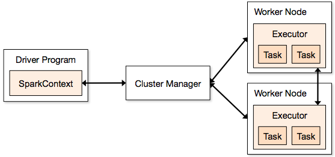

* This will become a table of contents (this text will be scraped).
{:toc}

Spark can run on hardware clusters managed by [Apache Mesos](http://mesos.apache.org/).

The advantages of deploying Spark with Mesos include:

- dynamic partitioning between Spark and other
  [frameworks](https://mesos.apache.org/documentation/latest/mesos-frameworks/)
- scalable partitioning between multiple instances of Spark

# How it Works

In a standalone cluster deployment, the cluster manager in the below diagram is a Spark master
instance.  When using Mesos, the Mesos master replaces the Spark master as the cluster manager.

  

Now when a driver creates a job and starts issuing tasks for scheduling, Mesos determines what
machines handle what tasks.  Because it takes into account other frameworks when scheduling these
many short-lived tasks, multiple frameworks can coexist on the same cluster without resorting to a
static partitioning of resources.

To get started, follow the steps below to install Mesos and deploy Spark jobs via Mesos.

# Installing Mesos

Spark {{site.SPARK_VERSION}} is designed for use with Mesos {{site.MESOS_VERSION}} and does not
require any special patches of Mesos.

If you already have a Mesos cluster running, you can skip this Mesos installation step.

Otherwise, installing Mesos for Spark is no different than installing Mesos for use by other
frameworks.  You can install Mesos either from source or using prebuilt packages.

## From Source

To install Apache Mesos from source, follow these steps:

1. Download a Mesos release from a
   [mirror](http://www.apache.org/dyn/closer.lua/mesos/{{site.MESOS_VERSION}}/)
2. Follow the Mesos [Getting Started](http://mesos.apache.org/gettingstarted) page for compiling and
   installing Mesos

**Note:** If you want to run Mesos without installing it into the default paths on your system
(e.g., if you lack administrative privileges to install it), pass the
`--prefix` option to `configure` to tell it where to install. For example, pass
`--prefix=/home/me/mesos`. By default the prefix is `/usr/local`.

## Third-Party Packages

The Apache Mesos project only publishes source releases, not binary packages.  But other
third party projects publish binary releases that may be helpful in setting Mesos up.

One of those is Mesosphere.  To install Mesos using the binary releases provided by Mesosphere:

1. Download Mesos installation package from [downloads page](http://mesosphere.io/downloads/)
2. Follow their instructions for installation and configuration

The Mesosphere installation documents suggest setting up ZooKeeper to handle Mesos master failover,
but Mesos can be run without ZooKeeper using a single master as well.

## Verification

To verify that the Mesos cluster is ready for Spark, navigate to the Mesos master webui at port
`:5050`  Confirm that all expected machines are present in the slaves tab.

# Connecting Spark to Mesos

To use Mesos from Spark, you need a Spark binary package available in a place accessible by Mesos, and
a Spark driver program configured to connect to Mesos.

Alternatively, you can also install Spark in the same location in all the Mesos slaves, and configure
`spark.mesos.executor.home` (defaults to SPARK_HOME) to point to that location.

## Uploading Spark Package

When Mesos runs a task on a Mesos slave for the first time, that slave must have a Spark binary
package for running the Spark Mesos executor backend.
The Spark package can be hosted at any Hadoop-accessible URI, including HTTP via `http://`,
[Amazon Simple Storage Service](http://aws.amazon.com/s3) via `s3n://`, or HDFS via `hdfs://`.

To use a precompiled package:

1. Download a Spark binary package from the Spark [download page](https://spark.apache.org/downloads.html)
2. Upload to hdfs/http/s3

To host on HDFS, use the Hadoop fs put command: `hadoop fs -put spark-{{site.SPARK_VERSION}}.tar.gz
/path/to/spark-{{site.SPARK_VERSION}}.tar.gz`

Or if you are using a custom-compiled version of Spark, you will need to create a package using
the `make-distribution.sh` script included in a Spark source tarball/checkout.

1. Download and build Spark using the instructions [here](index.html)
2. Create a binary package using `make-distribution.sh --tgz`.
3. Upload archive to http/s3/hdfs

## Using a Mesos Master URL

The Master URLs for Mesos are in the form `mesos://host:5050` for a single-master Mesos
cluster, or `mesos://zk://host:2181` for a multi-master Mesos cluster using ZooKeeper.

## Client Mode

In client mode, a Spark Mesos framework is launched directly on the client machine and waits for the driver output.

The driver needs some configuration in `spark-env.sh` to interact properly with Mesos:

1. In `spark-env.sh` set some environment variables:
 * `export MESOS_NATIVE_JAVA_LIBRARY=<path to libmesos.so>`. This path is typically
   `<prefix>/lib/libmesos.so` where the prefix is `/usr/local` by default. See Mesos installation
   instructions above. On Mac OS X, the library is called `libmesos.dylib` instead of
   `libmesos.so`.
 * `export SPARK_EXECUTOR_URI=<URL of spark-{{site.SPARK_VERSION}}.tar.gz uploaded above>`.
2. Also set `spark.executor.uri` to `<URL of spark-{{site.SPARK_VERSION}}.tar.gz>`.

Now when starting a Spark application against the cluster, pass a `mesos://`
URL as the master when creating a `SparkContext`. For example:


val conf = new SparkConf()
  .setMaster("mesos://HOST:5050")
  .setAppName("My app")
  .set("spark.executor.uri", "<path to spark-{{site.SPARK_VERSION}}.tar.gz uploaded above>")
val sc = new SparkContext(conf)


(You can also use [`spark-submit`](submitting-applications.html) and configure `spark.executor.uri`
in the [conf/spark-defaults.conf](configuration.html#loading-default-configurations) file.)

When running a shell, the `spark.executor.uri` parameter is inherited from `SPARK_EXECUTOR_URI`, so
it does not need to be redundantly passed in as a system property.


./bin/spark-shell --master mesos://host:5050


## Cluster mode

Spark on Mesos also supports cluster mode, where the driver is launched in the cluster and the client
can find the results of the driver from the Mesos Web UI.

To use cluster mode, you must start the `MesosClusterDispatcher` in your cluster via the `sbin/start-mesos-dispatcher.sh` script,
passing in the Mesos master URL (e.g: mesos://host:5050). This starts the `MesosClusterDispatcher` as a daemon running on the host.

If you like to run the `MesosClusterDispatcher` with Marathon, you need to run the `MesosClusterDispatcher` in the foreground (i.e: `bin/spark-class org.apache.spark.deploy.mesos.MesosClusterDispatcher`).

From the client, you can submit a job to Mesos cluster by running `spark-submit` and specifying the master URL
to the URL of the `MesosClusterDispatcher` (e.g: mesos://dispatcher:7077). You can view driver statuses on the
Spark cluster Web UI.

For example:

./bin/spark-submit \
  --class org.apache.spark.examples.SparkPi \
  --master mesos://207.184.161.138:7077 \
  --deploy-mode cluster
  --supervise
  --executor-memory 20G \
  --total-executor-cores 100 \
  http://path/to/examples.jar \
  1000


Note that jars or python files that are passed to spark-submit should be URIs reachable by Mesos slaves, as the Spark driver doesn't automatically upload local jars.

# Mesos Run Modes

Spark can run over Mesos in two modes: "coarse-grained" (default) and "fine-grained".

The "coarse-grained" mode will launch only *one* long-running Spark task on each Mesos
machine, and dynamically schedule its own "mini-tasks" within it. The benefit is much lower startup
overhead, but at the cost of reserving the Mesos resources for the complete duration of the
application.

Coarse-grained is the default mode. You can also set `spark.mesos.coarse` property to true
to turn it on explictly in [SparkConf](configuration.html#spark-properties):


conf.set("spark.mesos.coarse", "true")


In addition, for coarse-grained mode, you can control the maximum number of resources Spark will
acquire. By default, it will acquire *all* cores in the cluster (that get offered by Mesos), which
only makes sense if you run just one application at a time. You can cap the maximum number of cores
using `conf.set("spark.cores.max", "10")` (for example).

In "fine-grained" mode, each Spark task runs as a separate Mesos task. This allows
multiple instances of Spark (and other frameworks) to share machines at a very fine granularity,
where each application gets more or fewer machines as it ramps up and down, but it comes with an
additional overhead in launching each task. This mode may be inappropriate for low-latency
requirements like interactive queries or serving web requests.

To run in fine-grained mode, set the `spark.mesos.coarse` property to false in your
[SparkConf](configuration.html#spark-properties):


conf.set("spark.mesos.coarse", "false")


You may also make use of `spark.mesos.constraints` to set attribute based constraints on mesos resource offers. By default, all resource offers will be accepted.


conf.set("spark.mesos.constraints", "tachyon:true;us-east-1:false")


For example, Let's say `spark.mesos.constraints` is set to `tachyon:true;us-east-1:false`, then the resource offers will be checked to see if they meet both these constraints and only then will be accepted to start new executors.

# Mesos Docker Support

Spark can make use of a Mesos Docker containerizer by setting the property `spark.mesos.executor.docker.image`
in your [SparkConf](configuration.html#spark-properties).

The Docker image used must have an appropriate version of Spark already part of the image, or you can
have Mesos download Spark via the usual methods.

Requires Mesos version 0.20.1 or later.

# Running Alongside Hadoop

You can run Spark and Mesos alongside your existing Hadoop cluster by just launching them as a
separate service on the machines. To access Hadoop data from Spark, a full `hdfs://` URL is required
(typically `hdfs://<namenode>:9000/path`, but you can find the right URL on your Hadoop Namenode web
UI).

In addition, it is possible to also run Hadoop MapReduce on Mesos for better resource isolation and
sharing between the two. In this case, Mesos will act as a unified scheduler that assigns cores to
either Hadoop or Spark, as opposed to having them share resources via the Linux scheduler on each
node. Please refer to [Hadoop on Mesos](https://github.com/mesos/hadoop).

In either case, HDFS runs separately from Hadoop MapReduce, without being scheduled through Mesos.

# Dynamic Resource Allocation with Mesos

Mesos supports dynamic allocation only with coarse grain mode, which can resize the number of executors based on statistics
of the application. While dynamic allocation supports both scaling up and scaling down the number of executors, the coarse grain scheduler only supports scaling down
since it is already designed to run one executor per slave with the configured amount of resources. However, after scaling down the number of executors the coarse grain scheduler
can scale back up to the same amount of executors when Spark signals more executors are needed.

Users that like to utilize this feature should launch the Mesos Shuffle Service that
provides shuffle data cleanup functionality on top of the Shuffle Service since Mesos doesn't yet support notifying another framework's
termination. To launch/stop the Mesos Shuffle Service please use the provided sbin/start-mesos-shuffle-service.sh and sbin/stop-mesos-shuffle-service.sh
scripts accordingly.

The Shuffle Service is expected to be running on each slave node that will run Spark executors. One way to easily achieve this with Mesos
is to launch the Shuffle Service with Marathon with a unique host constraint.

# Configuration

See the [configuration page](configuration.html) for information on Spark configurations.  The following configs are specific for Spark on Mesos.

#### Spark Properties

<table class="table">
<tr><th>Property Name</th><th>Default</th><th>Meaning</th></tr>
<tr>
  <td><code>spark.mesos.coarse</code></td>
  <td>true</td>
  <td>
    If set to <code>true</code>, runs over Mesos clusters in "coarse-grained" sharing mode, where Spark acquires one long-lived Mesos task on each machine.
    If set to <code>false</code>, runs over Mesos cluster in "fine-grained" sharing mode, where one Mesos task is created per Spark task.
    Detailed information in <a href="running-on-mesos.html#mesos-run-modes">'Mesos Run Modes'</a>.
  </td>
</tr>
<tr>
  <td><code>spark.mesos.extra.cores</code></td>
  <td><code>0</code></td>
  <td>
    Set the extra amount of cpus to request per task. This setting is only used for Mesos coarse grain mode.
    The total amount of cores requested per task is the number of cores in the offer plus the extra cores configured.
    Note that total amount of cores the executor will request in total will not exceed the <code>spark.cores.max</code> setting.
  </td>
</tr>
<tr>
  <td><code>spark.mesos.mesosExecutor.cores</code></td>
  <td><code>1.0</code></td>
  <td>
    (Fine-grained mode only) Number of cores to give each Mesos executor. This does not
    include the cores used to run the Spark tasks. In other words, even if no Spark task
    is being run, each Mesos executor will occupy the number of cores configured here.
    The value can be a floating point number.
  </td>
</tr>
<tr>
  <td><code>spark.mesos.executor.docker.image</code></td>
  <td>(none)</td>
  <td>
    Set the name of the docker image that the Spark executors will run in. The selected
    image must have Spark installed, as well as a compatible version of the Mesos library.
    The installed path of Spark in the image can be specified with <code>spark.mesos.executor.home</code>;
    the installed path of the Mesos library can be specified with <code>spark.executorEnv.MESOS_NATIVE_JAVA_LIBRARY</code>.
  </td>
</tr>
<tr>
  <td><code>spark.mesos.executor.docker.volumes</code></td>
  <td>(none)</td>
  <td>
    Set the list of volumes which will be mounted into the Docker image, which was set using
    <code>spark.mesos.executor.docker.image</code>. The format of this property is a comma-separated list of
    mappings following the form passed to <code>docker run -v</code>. That is they take the form:

    <pre>[host_path:]container_path[:ro|:rw]</pre>
  </td>
</tr>
<tr>
  <td><code>spark.mesos.executor.docker.portmaps</code></td>
  <td>(none)</td>
  <td>
    Set the list of incoming ports exposed by the Docker image, which was set using
    <code>spark.mesos.executor.docker.image</code>. The format of this property is a comma-separated list of
    mappings which take the form:

    <pre>host_port:container_port[:tcp|:udp]</pre>
  </td>
</tr>
<tr>
  <td><code>spark.mesos.executor.home</code></td>
  <td>driver side <code>SPARK_HOME</code></td>
  <td>
    Set the directory in which Spark is installed on the executors in Mesos. By default, the
    executors will simply use the driver's Spark home directory, which may not be visible to
    them. Note that this is only relevant if a Spark binary package is not specified through
    <code>spark.executor.uri</code>.
  </td>
</tr>
<tr>
  <td><code>spark.mesos.executor.memoryOverhead</code></td>
  <td>executor memory * 0.10, with minimum of 384</td>
  <td>
    The amount of additional memory, specified in MB, to be allocated per executor. By default,
    the overhead will be larger of either 384 or 10% of <code>spark.executor.memory</code>. If set,
    the final overhead will be this value.
  </td>
</tr>
<tr>
  <td><code>spark.mesos.uris</code></td>
  <td>(none)</td>
  <td>
    A list of URIs to be downloaded to the sandbox when driver or executor is launched by Mesos.
    This applies to both coarse-grain and fine-grain mode.
  </td>
</tr>
<tr>
  <td><code>spark.mesos.principal</code></td>
  <td>(none)</td>
  <td>
    Set the principal with which Spark framework will use to authenticate with Mesos.
  </td>
</tr>
<tr>
  <td><code>spark.mesos.secret</code></td>
  <td>(none)</td>
  <td>
    Set the secret with which Spark framework will use to authenticate with Mesos.
  </td>
</tr>
<tr>
  <td><code>spark.mesos.role</code></td>
  <td><code>*</code></td>
  <td>
    Set the role of this Spark framework for Mesos. Roles are used in Mesos for reservations
    and resource weight sharing.
  </td>
</tr>
<tr>
  <td><code>spark.mesos.constraints</code></td>
  <td>(none)</td>
  <td>
    Attribute based constraints on mesos resource offers. By default, all resource offers will be accepted. Refer to <a href="http://mesos.apache.org/documentation/attributes-resources/">Mesos Attributes & Resources</a> for more information on attributes.
    <ul>
      <li>Scalar constraints are matched with "less than equal" semantics i.e. value in the constraint must be less than or equal to the value in the resource offer.</li>
      <li>Range constraints are matched with "contains" semantics i.e. value in the constraint must be within the resource offer's value.</li>
      <li>Set constraints are matched with "subset of" semantics i.e. value in the constraint must be a subset of the resource offer's value.</li>
      <li>Text constraints are metched with "equality" semantics i.e. value in the constraint must be exactly equal to the resource offer's value.</li>
      <li>In case there is no value present as a part of the constraint any offer with the corresponding attribute will be accepted (without value check).</li>
    </ul>
  </td>
</tr>
</table>

# Troubleshooting and Debugging

A few places to look during debugging:

- Mesos master on port `:5050`
  - Slaves should appear in the slaves tab
  - Spark applications should appear in the frameworks tab
  - Tasks should appear in the details of a framework
  - Check the stdout and stderr of the sandbox of failed tasks
- Mesos logs
  - Master and slave logs are both in `/var/log/mesos` by default

And common pitfalls:

- Spark assembly not reachable/accessible
  - Slaves must be able to download the Spark binary package from the `http://`, `hdfs://` or `s3n://` URL you gave
- Firewall blocking communications
  - Check for messages about failed connections
  - Temporarily disable firewalls for debugging and then poke appropriate holes
