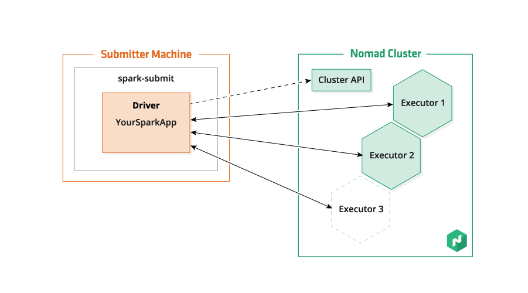
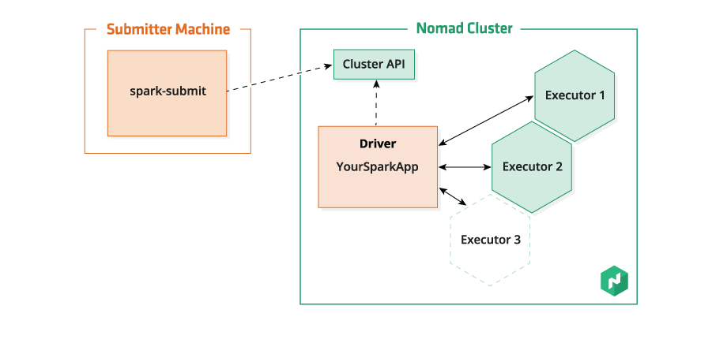

Spark supports using a [Nomad](https://nomadproject.io/) cluster to run Spark applications.
When running on nomad, the Spark executors that run Spark tasks for your application,
and optionally the application driver itself, run as Nomad tasks in a Nomad job.


* This will become a table of contents (this text will be scraped).
{:toc}


# Launching Spark on Nomad

To launch a Spark application on Nomad, set the Spark master to either
"nomad:" followed by the URL for the Nomad HTTP API (e.g. "nomad:http://nomad.example.com:4646"),
or simply "nomad" to use the URL in `NOMAD_ADDR` environment variable or "http://127.0.0.1:4646" when that variable is not set.

When using `spark-submit`, the master is set with the `--master` option.
In general, your `spark-submit` invocation will have the form:

    $ bin/spark-submit --master nomad[:<url>] [options] --class <main-class> <jar> [args]

When running your application directly (which limits you to [client mode](#client-mode)),
you can set the master with the `spark.master` configuration property,
or using the `SparkConf.setMaster` on the configuration you create your `SparkContext` from.


# Prerequisites

When running on Nomad, Spark creates Nomad tasks that run scripts from the Spark distribution on client agents in the Nomad cluster.
These tasks need access to a Java runtime environment (JRE), a Spark distribution built with Nomad support,
and (in [cluster mode](#cluster-mode)) the Spark application itself.


## Installed JRE or Docker Image

By default, Spark will constrain the tasks it creates to run on Nomad client agents which have the `java` driver enabled and at least Java 7.
The tasks use Nomad's `exec` driver to run Spark scripts on those nodes, and the scripts make use of the JRE that is installed on the node.

Alternatively, you can set the `spark.nomad.dockerImage` configuration property (set by `spark-submit`'s `--docker-image` flag)
to the name or URL of a docker image to use to run Spark Nomad tasks.
The tasks use Nomad's `docker` driver to run Spark scripts in a container created from this image.
The image should contain a JRE, and optionally a Spark distribution (see below).
When using this option, you can use the `spark.nomad.docker.*` [configuration properties](#configuration)
to control authentication.

Note that when using a Docker image, you may want to include the Spark distribution directly in the docker image,
you may want to include the Spark distribution (see the section below) and possibly even your application in the docker image
and use `local:` URLs when giving their locations to `spark-submit`.

## Spark Distribution Location

The Nomad tasks created by Spark need to have access to a Spark distribution,
and the `spark.nomad.sparkDistribution` configuration property (set by `spark-submit`'s `--distribution` flag)
must be set to a URL where the spark distribution can be found.

When a `local:` URL is provided, it must point to a directory containing a spark distribution.
When `spark.nomad.dockerImage` is set (see [Installed JRE or Docker Image](#installed-jre-or-docker-image) above),
this designates a path inside the docker image.
Otherwise it is a path on the Nomad client node itself
(meaning that Spark must be installed at this location on all clients in the Nomad cluster that have at least Java 7 and meet any additional [constraints](#contraints) you specify).

E.g.:

    $ ./bin/spark-submit \
        --master nomad \
        --docker-image your-spark-image \
        --distribution local:///opt/spark \
        --class com.example.Main \
        example.jar

Alternatively, you can provide the [remote URL](#remote-urls) of a Spark distribution archive.
The archive will be downloaded and extracted into the task's allocation directory.

E.g.:

    $ ./bin/spark-submit \
        --master nomad \
        --distribution http://example.com/spark.tgz \
        --class com.example.Main \
        example.jar


# Deployment Modes

You can run a Spark application on Nomad in either "client" mode (the default) or "cluster" mode.

## Client Mode

In client mode (the default deployment mode),
the Spark application is either directly started by the user, or run directly by `spark-submit`,
so the application driver runs on a machine that is not necessarily in the Nomad cluster.
The driver's SparkContext creates a Nomad job to run Spark executors.
The executors connect to the driver and run Spark tasks on behalf of the application.
When the driver's SparkContext is stopped, the executors are shut down.



Note that the machine running the driver or spark-submit needs to be reachable from
the Nomad clients so that the executors can connect to it.

In client mode, application resources need to start out present on the submitting machine,
so jars (both the primary jar and those added with the `--jars` option) can't be specified using `http:` or `https:` URLs.
You can either use files on the submitting machine (either as raw paths or `file:` URLs),
or use `local:` URLs to indicate that the files are independently available on both
the submitting machine and all of the Nomad clients where the executors might run.

In this mode, the spark-submit invocation doesn't return until the application has finished running,
and killing the spark-submit process kills the application.

For example, to submit an application in client mode:

    $ ./bin/spark-submit --class org.apache.spark.examples.SparkPi \
        --master nomad \
        --distribution http://example.com/spark.tgz
        lib/spark-examples*.jar \
        10

## Cluster Mode

In cluster mode, the `spark-submit` process creates a Nomad job to run the Spark application driver.
The driver's SparkContext then adds Spark executors to the Nomad job.
The executors connect to the driver and run Spark tasks on behalf of the application.
When the driver's SparkContext is stopped, the executors are shut down.



In cluster mode, application resources need to be hosted somewhere accessible to the Nomad cluster,
so jars (both the primary jar and those added with the `--jars` option) can't be specified using raw paths or `file:` URLs.
You can either use `http:` or `https:` URLs, or use `local:` URLs to indicate that
the files are independently available all of the Nomad clients where the driver and executors might run.

Note that in cluster mode, the nomad master URL needs to be routable from both the submitting machine and
the Nomad client node that runs the driver. If the Nomad cluster is integrated with Consul,
you may want to use a DNS name for the Nomad service served by Consul.

For example, to submit an application in cluster mode:

    $ ./bin/spark-submit --class org.apache.spark.examples.SparkPi \
        --master nomad \
        --deploy-mode cluster \
        --distribution http://example.com/spark.tgz
        http://example.com/spark-examples.jar \
        10

### Monitoring Output

By default, `spark-submit` in cluster mode will simply submit your application to the Nomad cluster.
You can use the `spark.nomad.cluster.monitorUntil` configuration property (set by `spark-submit`'s `--monitor-until` flag)
to have spark-submit monitor the job after submitting it, and even tail its log until the job completes.

In any case, once the job has been submitted to Nomad, killing spark-submit won't stop the spark application,
as it runs independently in the Nomad cluster.

### Spark UI

In cluster mode, if `spark.ui.enabled` is `true` (as by default), the Spark UI will be
dynamically allocated a port. The UI will be exposed by Nomad as a service,
and the UI's URL will appear in the Spark driver's log.

The Spark UI stops being served when the application finishes.
This can sometimes be frustrating when debugging an application.
You can delay the stopping of the UI by setting `spark.ui.stopDelay` duration, e.g. "5m" for 5 minutes.
Note that this will cause the driver process to continue running.
You can force a delayed stop to proceed immediately on the "Jobs" page of the web UI,
or by sending


# Remote URLs

Nomad uses [go-getter](https://github.com/hashicorp/go-getter) to download artifacts,
which allows you to embed checksums in HTTP/S URLs.
Using checksums is recommended, as it allows Nomad to both verify the integrity of a file,
and use the checksum as a cache key to avoid re-downloading unchanged files.
The checksums take the form of a query string parameter of the form `checksum=type:value`,
where `type` is a hash type and `value` is the checksum value.
See the [go-getter checksumming documentation](https://github.com/hashicorp/go-getter#checksumming)
for details.


# Nomad Job Customization

By default, Nomad will start with a blank job, and starts adding to it.
When running in cluster mode, it will add a task group for the driver,
containing a task (with a "spark.nomad.role" = "driver" meta value) to run the driver.
The driver then adds a task group to run its executors.
The executor task group will contain a task (with a "spark.nomad.role" = "executor" meta value) to run the executor,
and if the shuffle service is enabled (as with [dynamic allocation](#dynamic-allocation-of-executors)), also a task (with a "spark.nomad.role" = "shuffle" meta value) to run the shuffle service.

The following incomplete HCL job specification gives an idea of the structure of a Nomad job created by Spark.

~~~ .hcl
job "structure" {
  meta {
    "spark.nomad.role" = "application"
  }

  # A driver group is only added in cluster mode
  group "driver" {
    task "driver" {
      meta {
        "spark.nomad.role" = "driver"
      }
    }
  }

  group "executors" {
    count = 2

    task "executor" {
      meta {
        "spark.nomad.role" = "executor"
      }
    }

    # shuffle service tasks are only added when enabled (as it must be when using dynamic allocation)
    task "shuffle-service" {
      meta {
        "spark.nomad.role" = "shuffle"
      }
    }
  }
}
~~~

There are two ways to customize the Nomad job, task groups and tasks that Spark creates.
You can provide a job template that Spark will use as a starting point for creating its Nomad job, allowing you to customize almost any aspect of the job.
You can also set Spark configuration properties to override e.g. how many resources Spark should reserve for its Nomad tasks.

The order of precedence for settings is as follows:
1. Explicitly set configuration properties.
2. Settings in the job template if provided.
3. Default values of the configuration properties.


## Using a Job Template

Rather than having Spark create a Nomad job from scratch to run your application,
you can set the `spark.nomad.job.template` configuration property (set by `spark-submit`'s `--nomad-template` flag)
to the path of the file containing a template job specification.
There are two important things to note here:
- The template must be in the format of a [JSON job specification](https://www.nomadproject.io/docs/http/json-jobs.html).
  Nomad job specifications are normally [written in HCL](https://www.nomadproject.io/docs/job-specification/) and converted to JSON
  by the `nomad` command-line tool. You can convert an HCL jobspec to JSON by running `nomad run -output <job.nomad>`.
- `spark.nomad.job.template` should be set to a path on the submitting machine, *not* to a URL (even in cluster mode).
  The template does not need to be accessible from driver or executors.

Using a job template you can override Spark's default resource utilization,
add additional metadata or constraints, set environment variables, add sidecar tasks to the driver or executor task groups,
add additional task groups of your own, etc.

The template does not need to be a complete Nomad jobspec, as Spark will add everything necessary to run your Spark application.
E.g., your template might set some job metadata, but not contain any task groups,
making it an incomplete Nomad jobspec but still a valid template to use with Spark.

When setting properties in the job Spark creates from your template, the value precedence is as follows:
1. Values from Spark properties
2. Values in the job template
3. Default values for Spark configuration properties

E.g. the job priority is controlled by the `spark.nomad.priority` configuration property, which has a default of 40.
If a value is specified for that property (e.g. on the commandline, in `spark-defaults.conf`, etc.), that value will be used.
Otherwise if the template contains a value for the priority, the template's value will be used.
If neither of these sources provides a value, the default of 40 will be used.

Conceptually, this is how Spark uses the job template:

1. Identify the template task group for Spark executors, of which there should be at most one,
  as a group containing tasks with a "spark.nomad.role" meta value of "executor" or "shuffle".
  If there is such a group, it is removed from the job and used as a template for executors.

2. Identify the template task group for the Spark driver, of which there should be at most one,
  as a group containing a task with a "spark.nomad.role" meta value of "driver".
  If not running in cluster mode, this task group is removed from the job and discarded.

3. Proceed as normal, but using the provided job, driver task group, and executor task group template
  as the starting point for the task groups that are normally generated.

Here's an example of a small HCL template that sets a metadata value on the job and an environment
variable for executors:

~~~ .hcl
job "template" {
  meta {
    "foo" = "bar"
  }
  group "executor-group-name" {
    task "executor-task-name" {
      meta {
        "spark.nomad.role" = "executor"
      }
      env {
        BAZ = "something"
      }
    }
  }
}
~~~

Note that this is only a partial jobspec and not fully runnable. But it is a valid template, and can be converted to JSON with `nomad run -output <hcl-jobspec.nomad>`.
The job name is always set at runtime, so the "template" name is just a syntactically necessary placeholder and will be overridden.
Also note that it is the "spark.nomad.role" = "executor" meta value on the driver task that tells Spark that the "driver-group-name" task group is the template for executors;
the names of the group and task can be whatever you like.


## Resource Allocation

Resource allocation can be configured using a job template or through configuration properties.

Configuring resources using a template would look something like this (this HCL syntax; see the section above on converting this to JSON):

~~~ .hcl
job "template" {
  group "group-name" {
    task "task-name" {
      meta {
        "spark.nomad.role" = "role"  # this would be "driver", "executor", or "shuffle", as appropriate
      }

      resources {
        cpu    = 2000
        memory = 2048

        network {
          mbits = 100
        }
      }
    }
  }
}
~~~

Resource-related configuration properties are covered below:

### Memory

The standard Spark memory properties will be propagated to Nomad to control task resource allocation:
`spark.driver.memory` (set by `spark-submit`'s `--driver-memory` flag) and
`spark.executor.memory` (set by `spark-submit`'s `--executor-memory` flag).
You can additionally specify `spark.nomad.shuffle.memory` to control how much memory Nomad allocates to shuffle service tasks.

### CPU

Spark sizes its thread pools and allocates tasks based on the number of CPU cores available.
Nomad manages CPU allocation in terms of processing speed rather than number of cores.

When running Spark on Nomad, you can control how much CPU share Nomad will allocate to tasks using
the `spark.nomad.driver.cpu`, `spark.nomad.executor.cpu` and `spark.nomad.shuffle.cpu` properties
(or `spark-submit`'s `--driver-cpu` and `--executor-cpu` flags).

When running on Nomad, executors will be configured to use one core by default,
meaning they will only pull a single 1-core task at a time.
You can setting the `spark.executor.cores` property (set by `spark-submit`'s `--executor-cores` flag)
to allow more tasks to be executed concurrently on a single executor.

### Network

Nomad doesn't restrict the network bandwidth of running tasks,
bit it does allocate a non-zero number of Mbit/s to each task and uses this when bin-packing task groups onto Nomad clients.
Spark defaults to requesting the minimum of 1 Mbit/s per task, but you can change this with the
`spark.nomad.driver.networkMBits`, `spark.nomad.executor.networkMBits`, and `spark.nomad.shuffle.networkMBits` properties.

### Log Rotation

Nomad performs log rotation on the `stdout` and `stderr` of its tasks.
You can configure the number number and size of log files it will keep for driver and executor task groups using
`spark.nomad.driver.logMaxFiles` and `spark.nomad.executor.logMaxFiles`.


# Logs

Nomad clients collect the stderr and stdout of the tasks that they run,
and the nomad CLI or API can be used to inspect them, as documented in Nomad's documentation on
[Accessing Logs](https://www.nomadproject.io/docs/operating-a-job/accessing-logs.html).

Links to the stderr and stdout of the executors tab of the Spark UI.
In cluster mode, the stderr and stdout of the driver application can be found there as well.

The Log Shipper Pattern described in the "Accessing Logs" link above uses sidecar tasks to forward logs to a central location.
This can be done [using a job template](#using-a-job-template) along the following lines:

~~~ .hcl
job "template" {

  group "driver" {
    task "driver" {
      meta {
        "spark.nomad.role" = "driver"
      }
    }
    task "log-forwarding-sidecar" {
      # sidecar task definition here
    }
  }

  group "executor" {
    task "executor" {
      meta {
        "spark.nomad.role" = "executor"
      }
    }
    task "log-forwarding-sidecar" {
      # sidecar task definition here
    }
  }

}
~~~


# Dynamic Allocation of Executors

By default, the Spark application will use a fixed number of executors.
Setting `spark.dynamicAllocation` to `true` enables Spark to
add and remove executors during execution depending on the number of Spark tasks scheduled to run.
As described in [Dynamic Resource Allocation](http://spark.apache.org/docs/latest/job-scheduling.html#configuration-and-setup),
dynamic allocation requires that `spark.shuffle.service.enabled` be set to `true`.

On Nomad, setting `spark.shuffle.service.enabled` to `true` adds an additional
shuffle serivce Nomad task to the executors' task group. This results in a
one-to-one mapping of executors to shuffle services.

When the executor exits, the shuffle service continues running so that it can serve any results produced by the
executor. Note that due to the way resource allocation works in Nomad,
the resources allocated to the executor Nomad task aren't freed until the shuffle service
is also finished, meaning that they will remain allocated until the application has finished.
This may improve in the future.


# Python and R

There is basic support for running Spark applications written in Python and R on Nomad,
including the `pyspark` and `sparkR` interactive modes.

For example, running a python Spark application on Nomad:

```
bin/spark-submit \
    --master nomad \
    --distribution http://example.com/spark.tgz \
    examples/src/main/python/pi.py
```

For example, running a sparkR interactive mode with executors on Nomad:

```
bin/sparkR \
    --master nomad \
    --distribution http://example.com/spark.tgz
```

Note that the python or R runtime must be installed on the Nomad clients;
if these are only present on some client, you can use constraints (documented above)
to ensure your task groups run on these clients.


# Configuration

Most of the configuration properties are the same for Spark on Nomad as for other deployment modes.
See the [configuration page](configuration.html) for more information on those.

These are configuration properties that are specific to running Spark on Nomad.

<table class="table">
<tr><th>Property Name</th><th>Default</th><th>Meaning</th></tr>
<tr>
 <td><code>spark.executor.instances</code></td>
  <td><code>2</code></td>
  <td>
    The number of executors for static allocation. With <code>spark.dynamicAllocation.enabled</code>, the initial set of executors will be at least this large.
  </td>
</tr>
<tr>
  <td><code>spark.nomad.cluster.expectImmediateScheduling</code></td>
  <td><code>false</code></td>
  <td>
    When true, spark-submit will fail if Nomad isn't able to schedule the job to run right away
  </td>
</tr>
<tr>
  <td><code>spark.nomad.cluster.monitorUntil</code></td>
  <td></td>
  <td>
    Specifies how long spark-submit should monitor a Spark application in cluster mode. <code>submitted</code> (the default) causes spark-submit to return as soon as the application has been submitted to the Nomad cluster. <code>scheduled</code> causes spark-submit to return once the Nomad job has been scheduled. <code>complete</code> causes spark-submit to tail the output from the driver process and return when the job has completed.
  </td>
</tr>
<tr>
  <td><code>spark.nomad.datacenters</code></td>
  <td></td>
  <td>
    Comma-separated list of Nomad datacenters to use (defaults to the datacenter of the first Nomad server contacted)
  </td>
</tr>
<tr>
  <td><code>spark.nomad.docker.email</code></td>
  <td></td>
  <td>
    Email address used when downloading the docker image specified by <code>spark.nomad.dockerImage</code> from the docker registry. (https://www.nomadproject.io/docs/drivers/docker.html#authentication)
  </td>
</tr>
<tr>
  <td><code>spark.nomad.docker.password</code></td>
  <td></td>
  <td>
    Password used when downloading the docker image specified by <code>spark.nomad.dockerImage</code> from the docker registry. (https://www.nomadproject.io/docs/drivers/docker.html#authentication)
  </td>
</tr>
<tr>
  <td><code>spark.nomad.docker.serverAddress</code></td>
  <td></td>
  <td>
    Server address (domain/IP without the protocol) used when downloading the docker image specified by <code>spark.nomad.dockerImage</code> from the docker registry. Docker Hub is used by default.(https://www.nomadproject.io/docs/drivers/docker.html#authentication)
  </td>
</tr>
<tr>
  <td><code>spark.nomad.docker.username</code></td>
  <td></td>
  <td>
    Username used when downloading the docker image specified by <code>spark.nomad.dockerImage</code> from the docker registry. (https://www.nomadproject.io/docs/drivers/docker.html#authentication)
  </td>
</tr>
<tr>
  <td><code>spark.nomad.dockerImage</code></td>
  <td></td>
  <td>
    A [docker image](https://www.nomadproject.io/docs/drivers/docker.html#image) to use to run Spark with Nomad's <code>docker</code> driver. When not specified, Nomad's <code>exec</code> driver will be used instead.
  </td>
</tr>
<tr>
  <td><code>spark.nomad.driver.cpu</code></td>
  <td><code>1000</code></td>
  <td>
    How many MHz of CPU power Nomad should reserve for driver tasks
  </td>
</tr>
<tr>
  <td><code>spark.nomad.driver.logMaxFileSize</code></td>
  <td><code>1m</code></td>
  <td>
    Maximum size that Nomad should keep in log files from driver tasks
  </td>
</tr>
<tr>
  <td><code>spark.nomad.driver.logMaxFiles</code></td>
  <td><code>5</code></td>
  <td>
    Number of log files Nomad should keep from driver tasks
  </td>
</tr>
<tr>
  <td><code>spark.nomad.driver.networkMBits</code></td>
  <td><code>1</code></td>
  <td>
    The network bandwidth Nomad should allocate to driver tasks during bin packing
  </td>
</tr>
<tr>
  <td><code>spark.nomad.driver.retryAttempts</code></td>
  <td><code>5</code></td>
  <td>
    The number of times Nomad should retry driver task groups if they fail
  </td>
</tr>
<tr>
  <td><code>spark.nomad.driver.retryDelay</code></td>
  <td><code>15s</code></td>
  <td>
    How long Nomad should wait before retrying driver task groups if they fail
  </td>
</tr>
<tr>
  <td><code>spark.nomad.driver.retryInterval</code></td>
  <td><code>1d</code></td>
  <td>
    Nomad's retry interval for driver task groups
  </td>
</tr>
<tr>
  <td><code>spark.nomad.executor.cpu</code></td>
  <td><code>1000</code></td>
  <td>
    How many MHz of CPU power Nomad should reserve for executor tasks
  </td>
</tr>
<tr>
  <td><code>spark.nomad.executor.logMaxFileSize</code></td>
  <td><code>1m</code></td>
  <td>
    Maximum size that Nomad should keep in log files from executor tasks
  </td>
</tr>
<tr>
  <td><code>spark.nomad.executor.logMaxFiles</code></td>
  <td><code>5</code></td>
  <td>
    Number of log files Nomad should keep from executor tasks
  </td>
</tr>
<tr>
  <td><code>spark.nomad.executor.networkMBits</code></td>
  <td><code>1</code></td>
  <td>
    The network bandwidth Nomad should allocate to executor tasks during bin packing
  </td>
</tr>
<tr>
  <td><code>spark.nomad.executor.retryAttempts</code></td>
  <td><code>5</code></td>
  <td>
    The number of times Nomad should retry executor task groups if they fail
  </td>
</tr>
<tr>
  <td><code>spark.nomad.executor.retryDelay</code></td>
  <td><code>15s</code></td>
  <td>
    How long Nomad should wait before retrying executor task groups if they fail
  </td>
</tr>
<tr>
  <td><code>spark.nomad.executor.retryInterval</code></td>
  <td><code>1d</code></td>
  <td>
    Nomad's retry interval for executor task groups
  </td>
</tr>
<tr>
  <td><code>spark.nomad.job</code></td>
  <td></td>
  <td>
    The Nomad job name to use
  </td>
</tr>
<tr>
  <td><code>spark.nomad.job.template</code></td>
  <td></td>
  <td>
    The path to a JSON file containing a Nomad job to use as a template
  </td>
</tr>
<tr>
  <td><code>spark.nomad.priority</code></td>
  <td></td>
  <td>
    The priority of the Nomad job that runs the application or its executors
  </td>
</tr>
<tr>
  <td><code>spark.nomad.region</code></td>
  <td></td>
  <td>
    The Nomad region to use (defaults to the region of the first Nomad server contacted)
  </td>
</tr>
<tr>
  <td><code>spark.nomad.shuffle.cpu</code></td>
  <td><code>1000</code></td>
  <td>
    How many MHz of CPU power Nomad should reserve for shuffle service tasks
  </td>
</tr>
<tr>
  <td><code>spark.nomad.shuffle.logMaxFileSize</code></td>
  <td><code>1m</code></td>
  <td>
    Maximum size that Nomad should keep in log files from shuffle service tasks
  </td>
</tr>
<tr>
  <td><code>spark.nomad.shuffle.logMaxFiles</code></td>
  <td><code>5</code></td>
  <td>
    Number of log files Nomad should keep from shuffle service tasks
  </td>
</tr>
<tr>
  <td><code>spark.nomad.shuffle.memory</code></td>
  <td><code>256m</code></td>
  <td>
    The amount of memory that Nomad should allocate for the shuffle service tasks
  </td>
</tr>
<tr>
  <td><code>spark.nomad.shuffle.networkMBits</code></td>
  <td><code>1</code></td>
  <td>
    The network bandwidth Nomad should allocate to shuffle service tasks during bin packing
  </td>
</tr>
<tr>
  <td><code>spark.nomad.sparkDistribution</code></td>
  <td></td>
  <td>
    The location of the spark distribution tgz file to use.
  </td>
</tr>
<tr>
  <td><code>spark.nomad.tls.caCert</code></td>
  <td></td>
  <td>
    Path to a .pem file containing the certificate authority to validate the Nomad server's TLS certificate against
  </td>
</tr>
<tr>
  <td><code>spark.nomad.tls.cert</code></td>
  <td></td>
  <td>
    Path to a .pem file containing the TLS certificate to present to the Nomad server
  </td>
</tr>
<tr>
  <td><code>spark.nomad.tls.trustStorePassword</code></td>
  <td></td>
  <td>
    Path to a .pem file containing the private key corresponding to the certificate in spark.nomad.tls.cert
  </td>
</tr>
</table>
