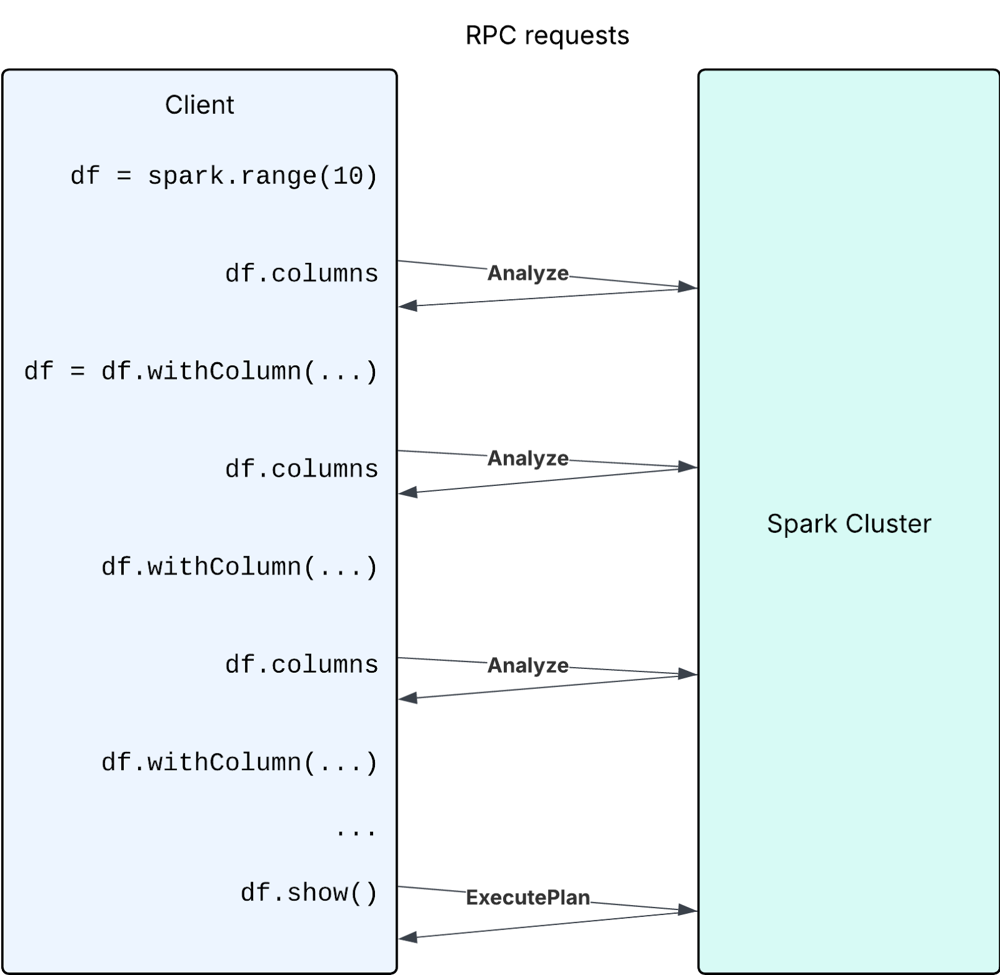

The comparison highlights key differences between Spark Connect and Spark Classic in terms of execution and analysis behavior. While both utilize lazy execution for transformations, Spark Connect emphasizes deferred schema analysis, introducing unique considerations like temporary view handling and UDF evaluation. The guide outlines common gotchas and provides strategies for mitigation.

For an overview of Spark Connect, see [Spark Connect Overview](spark-connect-overview.html).

# Query Execution: Both lazy

## Spark Classic

In traditional Spark, DataFrame transformations (e.g., `filter`, `limit`) are lazy. This means they are not executed immediately but are recorded in a logical plan. The actual computation is triggered only when an action (e.g., `show()`, `collect()`) is invoked.

## Spark Connect

Spark Connect follows a similar lazy evaluation model. Transformations are constructed on the client side and sent as unresolved proto plans to the server. The server then performs the necessary analysis and execution when an action is called.

## Comparison

| Code                                                                                  | Spark Classic   | Spark Connect   |
|:--------------------------------------------------------------------------------------|:----------------|:----------------|
| Transformations: `df.filter(...)`, `df.select(...)`, `df.limit(...)`, etc             | Lazy execution  | Lazy execution  |
| SQL queries: <br/> `spark.sql("select …")`                                            | Lazy execution  | Lazy execution  |
| Actions: `df.collect()`, `df.show()`, etc                                             | Eager execution | Eager execution |
| SQL commands: <br/> `spark.sql("insert …")`, <br/> `spark.sql("create …")`, <br/> etc | Eager execution | Eager execution |

# Schema Analysis: Eager vs. lazy

## Spark Classic

Traditionally, Spark Classic performs schema analysis eagerly during the logical plan construction phase. This means that when you define transformations, Spark immediately analyzes the DataFrame's schema to ensure all referenced columns and data types are valid.

For example, executing `spark.sql("select 1 as a, 2 as b").filter("c > 1")` will throw an error eagerly, indicating the column `c` cannot be found.

## Spark Connect

Spark Connect differs from Classic’s eager analysis because the client constructs unresolved proto plans during transformation. When accessing a schema or executing an action, the client sends the unresolved plans to the server. The server then performs the schema analysis and execution. This design defers in schema analysis.

For example, `spark.sql("select 1 as a, 2 as b").filter("c > 1")` will not throw any error because the unresolved plan is client-side only, but on `df.columns` or `df.show()` an error will be thrown because the unresolved plan is sent to the server for analysis.

## Comparison

| Code                                                                      | Spark Classic | Spark Connect                                                              |
|:--------------------------------------------------------------------------|:--------------|:---------------------------------------------------------------------------|
| Transformations: `df.filter(...)`, `df.select(...)`, `df.limit(...)`, etc | Eager         | **Lazy**                                                                   |
| Schema access: `df.columns`, `df.schema`, `df.isStreaming`, etc           | Eager         | **Eager** <br/> **Triggers an analysis RPC request, unlike Spark Classic** |
| Actions: `df.collect()`, `df.show()`, etc                                 | Eager         | Eager                                                                      |
| Dependent session state: UDFs, temporary views, configs, etc              | Eager         | **Lazy** <br/> **Evaluated during the execution**                          |

# Common Gotchas (with mitigations)

If not careful about the difference between lazy vs. eager analysis, there are some gotchas you can run into.

## 1. Overwriting temp views

```python
def create_temp_view_and_create_dataframe(x):
  spark.range(x).createOrReplaceTempView("tempview")
  return spark.sql("SELECT * FROM tempview")
  # return spark.table("tempview")  # Or this, it is similar to the above SQL

df10 = create_temp_view_and_create_dataframe(10)
assert len(df10.collect()) == 10

df100 = create_temp_view_and_create_dataframe(100)
assert len(df10.collect()) == 10  # <-- User expects the df still references the old tempview, but in SparkConnect, it is not.
assert len(df100.collect()) == 100
```

In Spark Connect, the unresolved proto plan for the df in the above code looks like this. It refers to the temporary view purely by name ("tempview"). As a result, if the temp view is later replaced, the data in df will also change.

```
# The proto plan of spark.sql("SELECT * FROM tempview")
root {
  sql {
    query: "SELECT * FROM tempview"
  }
}

# The proto plan of spark.table("tempview")
root {
  read {
    named_table {
      unparsed_identifier: "tempview"
    }
  }
}
```

This behavior differs from Spark Classic, where due to eager analysis, the logical plan of the temp view is embedded into the df's plan at the time of creation. Therefore, any subsequent replacement of the temp view does not affect the original df.

In Spark Connect, users should be more cautious when reusing temporary view names, as replacing an existing temp view will affect all previously created DataFrames that reference it by name.

**Mitigation**:

As a mitigation, you can consider creating unique temporary view names, for example by including a UUID in the view name. This approach helps avoid affecting any existing DataFrames that reference a previously registered temp view, ensuring isolation and consistency.

```python
import uuid
def create_temp_view_and_create_dataframe(x):
  tempview_name = f"`tempview_{uuid.uuid4()}`"  # Use a random name to avoid conflicts.
  spark.range(x).createOrReplaceTempView(tempview_name)
  return spark.sql("SELECT * FROM " + tempview_name)
  # return spark.table(tempview_name)  # Or this.

df10 = create_temp_view_and_create_dataframe(10)
assert len(df10.collect()) == 10

df100 = create_temp_view_and_create_dataframe(100)
assert len(df10.collect()) == 10  # It works as exepected now.
assert len(df100.collect()) == 100
```

In this way, the proto plan of the df will reference the unique temp view:

```
root {
  sql {
    query: "SELECT * FROM `tempview_3b851121-e2f8-4763-9168-8a0e886b6203`"
  }
}
```

## 2. UDF closure over external variables

```python
from pyspark.sql.functions import udf

x = 123

@udf("INT")
def foo():
  return x


df = spark.createDataFrame([(1,)], ["dummy"])
df = df.select(foo())
x = 456
df.show() # prints 456
```

In this example, the df displays 456 instead of 123. This is because, in Spark Connect, Python UDFs are lazy—their serialization and registration are deferred until execution time. That means the UDF is only serialized and uploaded to the Spark cluster for execution when df.show() is called.

This behavior differs from Spark Classic, where UDFs are eagerly created. In Spark Classic, the value of x at the time of UDF creation is captured, so subsequent changes to x do not affect the already-created UDF.

Another example of this gotcha is creating UDFs in a loop:

```python
import json
from pyspark.sql.functions import udf, col

df = spark.createDataFrame([{"values": '{"column_1": 1, "column_2": 2}'}], ["values"])
for j in ['column_1', 'column_2']:
  def extract_value(col):
    return json.loads(col).get(j)
  extract_value_udf = udf(extract_value)
  df = df.withColumn(j, extract_value_udf(col('values')))
df.show() # It shows 2 for both 'column_1' and 'column_2' 
```

This is the same issue as above. It happens because Python closures capture variables by reference, not by value, and UDF serialization and registration is deferred when there is an action on the DataFrame. So both UDFs end up using the last value of j — in this case 'column\_2'.

**Mitigation:**

If you do need to modify the value of external variables that a UDF depends on, you can use a function factory (closure with early binding). Specifically, you can wrap the UDF creation in a helper function to correctly capture the value of a dependent variable at each loop iteration.

```python
from pyspark.sql.functions import udf, col
import json

df = spark.createDataFrame([{"values": '{"column_1": 1, "column_2": 2}'}], ["values"])

def make_extract_value_udf(field):
    def extract_value(val):
        return json.loads(val).get(field)
    return udf(extract_value)

for j in ['column_1', 'column_2']:
    extract_value_udf = make_extract_value_udf(j)
    df = df.withColumn(j, extract_value_udf(col('values')))

df.show()
```

By wrapping the UDF definition inside another function (`make_extract_value_udf`), we create a new scope where the current value of j is passed in as an argument. This ensures each generated UDF has its own copy of the field, bound at the time the UDF is created.

## 3. Error handling

Error handling during transformations:

```python
try:
  df = df.select("name", "age")
  df = df.withColumn(
      "age_group",
      when(col("age") < 18, "minor").otherwise("adult")  )
  df = df.filter(col("age_with_typo") > 6) # <-- The use of non-existing column name will not throw analysis exception in Spark Connect
except Exception as e:
  print(f"Error: {repr(e)}")
```

The above error handling is useful in Spark Classic because it performs eager analysis, which allows exceptions to be thrown promptly. However, in Spark Connect, this code does not pose any issue, as it only constructs a local unresolved proto plan without triggering any analysis.

**Mitigation**:

If your code relies on the analysis exception and wants to catch it, you can trigger eager analysis with `df.columns`, `df.schema`, `df.collect()`, etc.

```python
try:
  df = ...
  df.columns # <-- This will trigger eager analysis
except Exception as e:
  print(f"Error: {repr(e)}")
```

## 4. Triggering too many analysis of new DataFrames

The following is an anti-pattern:

```python
import pyspark.sql.functions as F
df = spark.range(10)
for i in range(200):
  new_column_name = str(i)
  if new_column_name not in df.columns: # <-- The df.columns call causes a new Analyze request in every iteration
    df = df.withColumn(new_column_name, F.col("id") + i)
df.show()
```

While building the DataFrame step by step, each time a new DataFrame is generated with an empty schema, which is lazily computed on access. However, if a user's code frequently accesses the schema of these new DataFrames using methods such as df.columns, it will result in a large number of analysis requests to the server.

<p style="text-align: center;">
  
</p>

Performance can be improved if users avoid large numbers of Analyze requests by avoiding excessive usage of calls triggering eager analysis (e.g. `df.columns`, `df.schema`, etc)

**Mitigation**:

If your code is tricky to avoid the above anti-pattern and have to frequently check columns of new DataFrames, you can maintain a set to keep track of these column names yourself to avoid analysis requests thereby improving performance.

```python
df = spark.range(10)
columns = set(df.columns) # Maintain the set of column names
for i in range(200):
  new_column_name = str(i)
  if new_column_name not in columns: # Check the set
    df = df.withColumn(new_column_name, F.col("id") + i)
    columns.add(new_column_name)
df.show()
```

Another similar case is creating a large number of unnecessary intermediate DataFrames and analyzing them. In the following case, the goal is to extract the field names from each column of a struct type.

```python
from pyspark.sql.types import StructType

struct_column_fields = {
    column_schema.name: df.select(column_schema.name + ".*").columns
    for column_schema in df.schema
    if isinstance(column_schema.dataType, StructType)
}
print(struct_column_fields)
```

However, this code snippet can lead to poor performance when there are many columns, as it creates and analyzes a large number of new DataFrames—each call to `df.select(column_schema.name + ".*")` generates a new DataFrame, and `columns` triggers analysis on it.

**Mitigation:**

Creating a DataFrame to retrieve the fields of a `StructType` column, as shown in the code above, is unnecessary. You can obtain this information directly from the DataFrame's schema.

```python
from pyspark.sql.types import StructType

struct_column_fields = {
    column_schema.name: [f.name for f in column_schema.dataType.fields]
    for column_schema in df.schema
    if isinstance(column_schema.dataType, StructType)
}
print(struct_column_fields)
```

This approach can be significantly faster when dealing with a large number of columns because it avoids the creation and analysis of numerous DataFrames.
