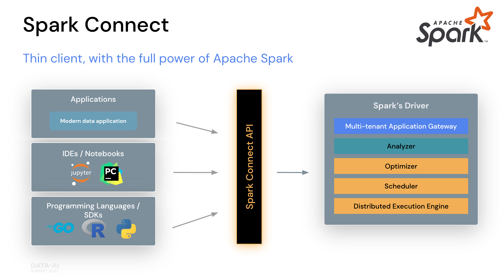
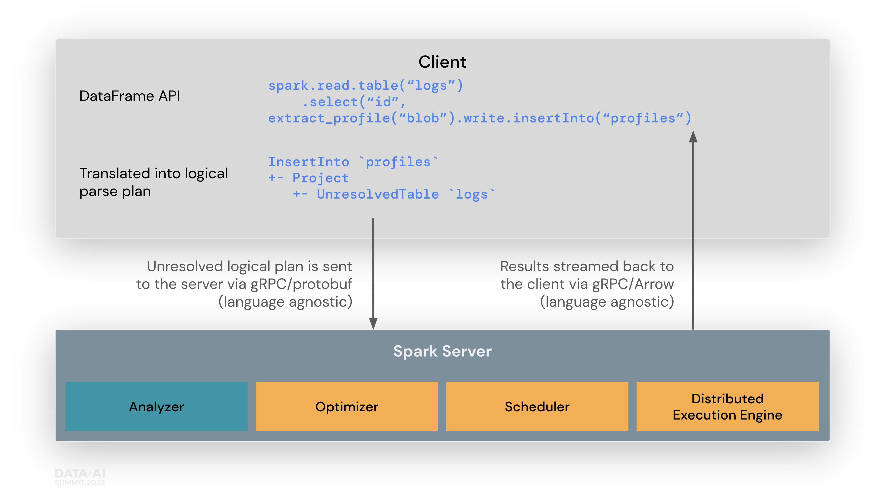

**Building client-side Spark applications**

In Apache Spark 3.4, Spark Connect introduced a decoupled client-server
architecture that allows remote connectivity to Spark clusters using the
DataFrame API and unresolved logical plans as the protocol. The separation
between client and server allows Spark and its open ecosystem to be
leveraged from everywhere. It can be embedded in modern data applications,
in IDEs, Notebooks and programming languages.

To get started, see [Quickstart: Spark Connect](api/python/getting_started/quickstart_connect.html).

  

# How Spark Connect works

The Spark Connect client library is designed to simplify Spark application
development. It is a thin API that can be embedded everywhere: in application
servers, IDEs, notebooks, and programming languages. The Spark Connect API
builds on Spark's DataFrame API using unresolved logical plans as a
language-agnostic protocol between the client and the Spark driver.

The Spark Connect client translates DataFrame operations into unresolved
logical query plans which are encoded using protocol buffers. These are sent
to the server using the gRPC framework.

The Spark Connect endpoint embedded on the Spark Server receives and
translates unresolved logical plans into Spark's logical plan operators.
This is similar to parsing a SQL query, where attributes and relations are
parsed and an initial parse plan is built. From there, the standard Spark
execution process kicks in, ensuring that Spark Connect leverages all of
Spark's optimizations and enhancements. Results are streamed back to the
client through gRPC as Apache Arrow-encoded row batches.

  

# Operational benefits of Spark Connect

With this new architecture, Spark Connect mitigates several multi-tenant
operational issues:

**Stability**: Applications that use too much memory will now only impact their
own environment as they can run in their own processes. Users can define their
own dependencies on the client and don't need to worry about potential conflicts
with the Spark driver.

**Upgradability**: The Spark driver can now seamlessly be upgraded independently
of applications, for example to benefit from performance improvements and security fixes.
This means applications can be forward-compatible, as long as the server-side RPC
definitions are designed to be backwards compatible.

**Debuggability and observability**: Spark Connect enables interactive debugging
during development directly from your favorite IDE. Similarly, applications can
be monitored using the application's framework native metrics and logging libraries.

# How to use Spark Connect

Starting with Spark 3.4, Spark Connect is available and supports PySpark and Scala
applications. We will walk through how to run an Apache Spark server with Spark
Connect and connect to it from a client application using the Spark Connect client
library.

## Download and start Spark server with Spark Connect

First, download Spark from the
[Download Apache Spark](https://spark.apache.org/downloads.html) page. Spark Connect
was introduced in Apache Spark version 3.4 so make sure you choose 3.4.0 or newer in
the release drop down at the top of the page. Then choose your package type, typically
“Pre-built for Apache Hadoop 3.3 and later”, and click the link to download.

Now extract the Spark package you just downloaded on your computer, for example:


tar -xvf spark-3.4.0-bin-hadoop3.tgz


In a terminal window, go to the `spark` folder in the location where you extracted
Spark before and run the `start-connect-server.sh` script to start Spark server with
Spark Connect, like in this example:


./sbin/start-connect-server.sh --packages org.apache.spark:spark-connect_2.12:3.4.0


Note that we include a Spark Connect package (`spark-connect_2.12:3.4.0`), when starting
Spark server. This is required to use Spark Connect. Make sure to use the same version
of the package as the Spark version you downloaded previously. In this example,
Spark 3.4.0 with Scala 2.12.

Now Spark server is running and ready to accept Spark Connect sessions from client
applications. In the next section we will walk through how to use Spark Connect
when writing client applications.

## Use Spark Connect in client applications

When creating a Spark session, you can specify that you want to use Spark Connect
and there are a few ways to do that outlined as follows.

If you do not use one of the mechanisms outlined here, your Spark session will
work just like before, without leveraging Spark Connect, and your application code
will run on the Spark driver node.

### Set SPARK_REMOTE environment variable

If you set the `SPARK_REMOTE` environment variable on the client machine where your
Spark client application is running and create a new Spark Session as in the following
example, the session will be a Spark Connect session. With this approach, there is no
code change needed to start using Spark Connect.

In a terminal window, set the `SPARK_REMOTE` environment variable to point to the
local Spark server you started previously on your computer:


export SPARK_REMOTE="sc://localhost"


And start the Spark shell as usual:


./bin/pyspark


The PySpark shell is now connected to Spark using Spark Connect as indicated in the welcome message:


Client connected to the Spark Connect server at localhost


And if you write your own program, create a Spark session as shown in this example:


from pyspark.sql import SparkSession
spark = SparkSession.builder.getOrCreate()


This will create a Spark Connect session from your application by reading the
`SPARK_REMOTE` environment variable we set previously.

### Specify Spark Connect when creating Spark session

You can also specify that you want to use Spark Connect explicitly when you
create a Spark session.

For example, you can launch the PySpark shell with Spark Connect as
illustrated here.

To launch the PySpark shell with Spark Connect, simply include the `remote`
parameter and specify the location of your Spark server. We are using `localhost`
in this example to connect to the local Spark server we started previously:


./bin/pyspark --remote "sc://localhost"


And you will notice that the PySpark shell welcome message tells you that
you have connected to Spark using Spark Connect:


Client connected to the Spark Connect server at localhost


You can also check the Spark session type. If it includes `.connect.` you
are using Spark Connect as shown in this example:


SparkSession available as 'spark'.
>>> type(spark)
<class 'pyspark.sql.connect.session.SparkSession'>


Now you can run PySpark code in the shell to see Spark Connect in action:


>>> columns = ["id","name"]
>>> data = [(1,"Sarah"),(2,"Maria")]
>>> df = spark.createDataFrame(data).toDF(*columns)
>>> df.show()
+---+-----+
| id| name|
+---+-----+
|  1|Sarah|
|  2|Maria|
+---+-----+


Or, when writing your own code, include the `remote` function with a reference to
your Spark server when you create a Spark session, as in this example:


from pyspark.sql import SparkSession
spark = SparkSession.builder.remote("sc://localhost").getOrCreate()



import org.apache.spark.sql.SparkSession
val spark = SparkSession.builder().remote("sc://localhost").build()


# Client application authentication

While Spark Connect does not have built-in authentication, it is designed to
work seamlessly with your existing authentication infrastructure. Its gRPC
HTTP/2 interface allows for the use of authenticating proxies, which makes
it possible to secure Spark Connect without having to implement authentication
logic in Spark directly.

# What is supported in Spark 3.4

**PySpark**: In Spark 3.4, Spark Connect supports most PySpark APIs, including
[DataFrame](api/python/reference/pyspark.sql/dataframe.html),
[Functions](api/python/reference/pyspark.sql/functions.html), and
[Column](api/python/reference/pyspark.sql/column.html). However,
some APIs such as [SparkContext](api/python/reference/api/pyspark.SparkContext.html)
and [RDD](api/python/reference/api/pyspark.RDD.html) are not supported.
You can check which APIs are currently
supported in the [API reference](api/python/reference/index.html) documentation.
Supported APIs are labeled "Supports Spark Connect" so you can check whether the
APIs you are using are available before migrating existing code to Spark Connect.

**Scala**: In Spark 3.4, Spark Connect supports most Scala APIs, including
[Dataset](api/scala/org/apache/spark/sql/Dataset.html),
[functions](api/scala/org/apache/spark/sql/functions$.html), and
[Column](api/scala/org/apache/spark/sql/Column.html).

Support for more APIs is planned for upcoming Spark releases.