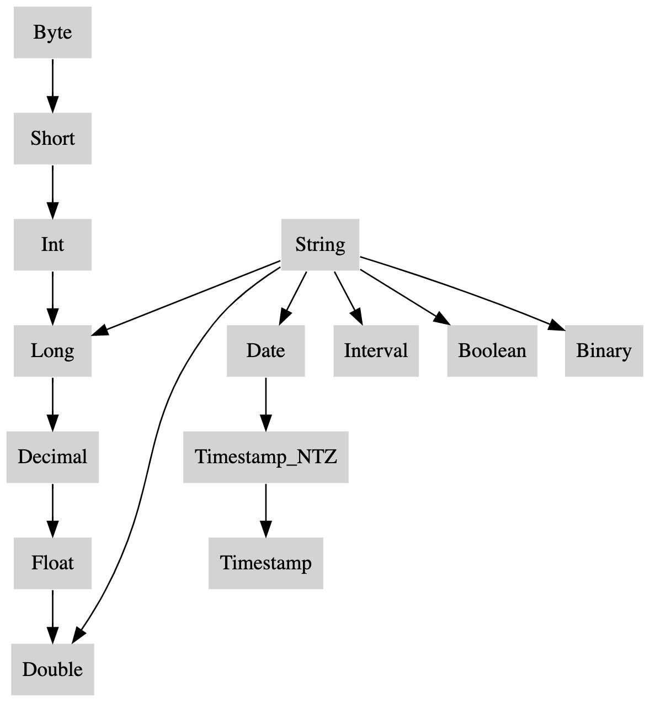

Since Spark 3.0, Spark SQL introduces two experimental options to comply with the SQL standard: `spark.sql.ansi.enabled` and `spark.sql.storeAssignmentPolicy` (See a table below for details).

When `spark.sql.ansi.enabled` is set to `true`, Spark SQL uses an ANSI compliant dialect instead of being Hive compliant. For example, Spark will throw an exception at runtime instead of returning null results if the inputs to a SQL operator/function are invalid. Some ANSI dialect features may be not from the ANSI SQL standard directly, but their behaviors align with ANSI SQL's style.

Moreover, Spark SQL has an independent option to control implicit casting behaviours when inserting rows in a table.
The casting behaviours are defined as store assignment rules in the standard.

When `spark.sql.storeAssignmentPolicy` is set to `ANSI`, Spark SQL complies with the ANSI store assignment rules. This is a separate configuration because its default value is `ANSI`, while the configuration `spark.sql.ansi.enabled` is disabled by default.

|Property Name|Default|Meaning|Since Version|
|-------------|-------|-------|-------------|
|`spark.sql.ansi.enabled`|false|(Experimental) When true, Spark tries to conform to the ANSI SQL specification: <br/> 1. Spark will throw a runtime exception if an overflow occurs in any operation on integral/decimal field. <br/> 2. Spark will forbid using the reserved keywords of ANSI SQL as identifiers in the SQL parser.|3.0.0|
|`spark.sql.storeAssignmentPolicy`|ANSI|(Experimental) When inserting a value into a column with different data type, Spark will perform type conversion.  Currently, we support 3 policies for the type coercion rules: ANSI, legacy and strict. With ANSI policy, Spark performs the type coercion as per ANSI SQL. In practice, the behavior is mostly the same as PostgreSQL.  It disallows certain unreasonable type conversions such as converting string to int or double to boolean.  With legacy policy, Spark allows the type coercion as long as it is a valid Cast, which is very loose.  e.g. converting string to int or double to boolean is allowed.  It is also the only behavior in Spark 2.x and it is compatible with Hive.  With strict policy, Spark doesn't allow any possible precision loss or data truncation in type coercion, e.g. converting double to int or decimal to double is not allowed.|3.0.0|

The following subsections present behaviour changes in arithmetic operations, type conversions, and SQL parsing when the ANSI mode enabled. For type conversions in Spark SQL, there are three kinds of them and this article will introduce them one by one: cast, store assignment and type coercion. 

### Arithmetic Operations

In Spark SQL, arithmetic operations performed on numeric types (with the exception of decimal) are not checked for overflows by default.
This means that in case an operation causes overflows, the result is the same with the corresponding operation in a Java/Scala program (e.g., if the sum of 2 integers is higher than the maximum value representable, the result is a negative number).
On the other hand, Spark SQL returns null for decimal overflows.
When `spark.sql.ansi.enabled` is set to `true` and an overflow occurs in numeric and interval arithmetic operations, it throws an arithmetic exception at runtime.

```sql
-- `spark.sql.ansi.enabled=true`
SELECT 2147483647 + 1;
java.lang.ArithmeticException: integer overflow

SELECT abs(-2147483648);
java.lang.ArithmeticException: integer overflow

-- `spark.sql.ansi.enabled=false`
SELECT 2147483647 + 1;
+----------------+
|(2147483647 + 1)|
+----------------+
|     -2147483648|
+----------------+

SELECT abs(-2147483648);
+----------------+
|abs(-2147483648)|
+----------------+
|     -2147483648|
+----------------+
```

### Cast

When `spark.sql.ansi.enabled` is set to `true`, explicit casting by `CAST` syntax throws a runtime exception for illegal cast patterns defined in the standard, e.g. casts from a string to an integer.

Besides, the ANSI SQL mode disallows the following type conversions which are allowed when ANSI mode is off:
* Numeric <=> Binary
* Date <=> Boolean
* Timestamp <=> Boolean
* Date => Numeric

 The valid combinations of source and target data type in a `CAST` expression are given by the following table.
“Y” indicates that the combination is syntactically valid without restriction and “N” indicates that the combination is not valid.

| Source\Target | Numeric | String | Date | Timestamp | Interval | Boolean | Binary | Array | Map | Struct |
|-----------|---------|--------|------|-----------|----------|---------|--------|-------|-----|--------|
| Numeric   | <span style="color:red">**Y**</span> | Y      | N    | <span style="color:red">**Y**</span>         | N      | Y       | N      | N     | N   | N      |
| String    | <span style="color:red">**Y**</span> | Y | <span style="color:red">**Y**</span> | <span style="color:red">**Y**</span> | <span style="color:red">**Y**</span> | <span style="color:red">**Y**</span> | Y | N     | N   | N      |
| Date      | N       | Y      | Y    | Y         | N        | N       | N      | N     | N   | N      |
| Timestamp | <span style="color:red">**Y**</span> | Y      | Y    | Y         | N        | N       | N      | N     | N   | N      |
| Interval  | N       | Y      | N    | N         | Y        | N       | N      | N     | N   | N      |
| Boolean   | Y       | Y      | N    | N         | N        | Y       | N      | N     | N   | N      |
| Binary    | N       | Y      | N    | N         | N        | N       | Y      | N     | N   | N      |
| Array     | N       | Y      | N    | N         | N        | N       | N      | <span style="color:red">**Y**</span> | N   | N      |
| Map       | N       | Y      | N    | N         | N        | N       | N      | N     | <span style="color:red">**Y**</span> | N      |
| Struct    | N       | Y      | N    | N         | N        | N       | N      | N     | N   | <span style="color:red">**Y**</span> |

In the table above, all the `CAST`s that can cause runtime exceptions are marked as red <span style="color:red">**Y**</span>:
* CAST(Numeric AS Numeric): raise an overflow exception if the value is out of the target data type's range.
* CAST(String AS (Numeric/Date/Timestamp/Interval/Boolean)): raise a runtime exception if the value can't be parsed as the target data type.
* CAST(Timestamp AS Numeric): raise an overflow exception if the number of seconds since epoch is out of the target data type's range.
* CAST(Numeric AS Timestamp): raise an overflow exception if numeric value times 1000000(microseconds per second) is out of the range of Long type. 
* CAST(Array AS Array): raise an exception if there is any on the conversion of the elements.
* CAST(Map AS Map): raise an exception if there is any on the conversion of the keys and the values.
* CAST(Struct AS Struct): raise an exception if there is any on the conversion of the struct fields.

```sql
-- Examples of explicit casting

-- `spark.sql.ansi.enabled=true`
SELECT CAST('a' AS INT);
java.lang.NumberFormatException: invalid input syntax for type numeric: a

SELECT CAST(2147483648L AS INT);
java.lang.ArithmeticException: Casting 2147483648 to int causes overflow

SELECT CAST(DATE'2020-01-01' AS INT)
org.apache.spark.sql.AnalysisException: cannot resolve 'CAST(DATE '2020-01-01' AS INT)' due to data type mismatch: cannot cast date to int.
To convert values from date to int, you can use function UNIX_DATE instead.

-- `spark.sql.ansi.enabled=false` (This is a default behaviour)
SELECT CAST('a' AS INT);
+--------------+
|CAST(a AS INT)|
+--------------+
|          null|
+--------------+

SELECT CAST(2147483648L AS INT);
+-----------------------+
|CAST(2147483648 AS INT)|
+-----------------------+
|            -2147483648|
+-----------------------+

SELECT CAST(DATE'2020-01-01' AS INT)
+------------------------------+
|CAST(DATE '2020-01-01' AS INT)|
+------------------------------+
|                          null|
+------------------------------+

-- Examples of store assignment rules
CREATE TABLE t (v INT);

-- `spark.sql.storeAssignmentPolicy=ANSI`
INSERT INTO t VALUES ('1');
org.apache.spark.sql.AnalysisException: Cannot write incompatible data to table '`default`.`t`':
- Cannot safely cast 'v': string to int;

-- `spark.sql.storeAssignmentPolicy=LEGACY` (This is a legacy behaviour until Spark 2.x)
INSERT INTO t VALUES ('1');
SELECT * FROM t;
+---+
|  v|
+---+
|  1|
+---+
```

### Store assignment
As mentioned at the beginning, when `spark.sql.storeAssignmentPolicy` is set to `ANSI`(which is the default value), Spark SQL complies with the ANSI store assignment rules on table insertions. The valid combinations of source and target data type in table insertions are given by the following table.

| Source\Target | Numeric | String | Date | Timestamp | Interval | Boolean | Binary | Array | Map | Struct |
|:-------------:|:-------:|:------:|:----:|:---------:|:--------:|:-------:|:------:|:-----:|:---:|:------:|
| Numeric       | Y       | Y      | N    | N         | N        | N       | N      | N     | N   | N      |
| String        | N       | Y      | N    | N         | N        | N       | N      | N     | N   | N      |
| Date          | N       | Y      | Y    | Y         | N        | N       | N      | N     | N   | N      |
| Timestamp     | N       | Y      | Y    | Y         | N        | N       | N      | N     | N   | N      |
| Interval      | N       | Y      | N    | N         | N*        | N       | N      | N     | N   | N      |
| Boolean       | N       | Y      | N    | N         | N        | Y       | N      | N     | N   | N      |
| Binary        | N       | Y      | N    | N         | N        | N       | Y      | N     | N   | N      |
| Array         | N       | N      | N    | N         | N        | N       | N      | Y**     | N   | N      |
| Map           | N       | N      | N    | N         | N        | N       | N      | N     | Y**   | N      |
| Struct        | N       | N      | N    | N         | N        | N       | N      | N     | N   | Y**      |

\* Spark doesn't support interval type table column.

\*\* For Array/Map/Struct types, the data type check rule applies recursively to its component elements.

During table insertion, Spark will throw exception on numeric value overflow.
```sql
CREATE TABLE test(i INT);

INSERT INTO test VALUES (2147483648L);
java.lang.ArithmeticException: Casting 2147483648 to int causes overflow
```

### Type coercion
#### Type Promotion and Precedence
When `spark.sql.ansi.enabled` is set to `true`, Spark SQL uses several rules that govern how conflicts between data types are resolved.
At the heart of this conflict resolution is the Type Precedence List which defines whether values of a given data type can be promoted to another data type implicitly.

| Data type | precedence list(from narrowest to widest)                     |
|-----------|---------------------------------------------------------------|
| Byte      | Byte -> Short -> Int -> Long -> Decimal -> Float* -> Double   |
| Short     | Short -> Int -> Long -> Decimal-> Float* -> Double            |
| Int       | Int -> Long -> Decimal -> Float* -> Double                    |
| Long      | Long -> Decimal -> Float* -> Double                           |
| Decimal   | Decimal -> Float* -> Double                                   |
| Float     | Float -> Double                                               |
| Double    | Double                                                        |
| Date      | Date -> Timestamp                                             |
| Timestamp | Timestamp                                                     |
| String    | String, Long -> Double, Date -> Timestamp, Boolean, Binary ** |
| Binary    | Binary                                                        |
| Boolean   | Boolean                                                       |
| Interval  | Interval                                                      |
| Map       | Map***                                                        |
| Array     | Array***                                                      |
| Struct    | Struct***                                                     |

\* For least common type resolution float is skipped to avoid loss of precision.

\*\* String can be promoted to multiple kinds of data types. Note that Byte/Short/Int/Decimal/Float is not on this precedent list. The least common type between Byte/Short/Int and String is Long, while the least common type between Decimal/Float is Double.

\*\*\* For a complex type, the precedence rule applies recursively to its component elements.

Special rules apply for untyped NULL. A NULL can be promoted to any other type.

This is a graphical depiction of the precedence list as a directed tree:


#### Least Common Type Resolution
The least common type from a set of types is the narrowest type reachable from the precedence list by all elements of the set of types.

The least common type resolution is used to:
- Derive the argument type for functions which expect a shared argument type for multiple parameters, such as coalesce, least, or greatest.
- Derive the operand types for operators such as arithmetic operations or comparisons.
- Derive the result type for expressions such as the case expression.
- Derive the element, key, or value types for array and map constructors.
Special rules are applied if the least common type resolves to FLOAT. With float type values, if any of the types is INT, BIGINT, or DECIMAL the least common type is pushed to DOUBLE to avoid potential loss of digits.
  
```sql
-- The coalesce function accepts any set of argument types as long as they share a least common type. 
-- The result type is the least common type of the arguments.
> SET spark.sql.ansi.enabled=true;
> SELECT typeof(coalesce(1Y, 1L, NULL));
BIGINT
> SELECT typeof(coalesce(1, DATE'2020-01-01'));
Error: Incompatible types [INT, DATE]

> SELECT typeof(coalesce(ARRAY(1Y), ARRAY(1L)));
ARRAY<BIGINT>
> SELECT typeof(coalesce(1, 1F));
DOUBLE
> SELECT typeof(coalesce(1L, 1F));
DOUBLE
> SELECT (typeof(coalesce(1BD, 1F)));
DOUBLE

> SELECT typeof(coalesce(1, '2147483648'))
BIGINT
> SELECT typeof(coalesce(1.0, '2147483648'))
DOUBLE
> SELECT typeof(coalesce(DATE'2021-01-01', '2022-01-01'))
DATE
```

### SQL Functions
#### Function invocation
Under ANSI mode(spark.sql.ansi.enabled=true), the function invocation of Spark SQL:
- In general, it follows the `Store assignment` rules as storing the input values as the declared parameter type of the SQL functions
- Special rules apply for untyped NULL. A NULL can be promoted to any other type.

```sql
> SET spark.sql.ansi.enabled=true;
-- implicitly cast Int to String type
> SELECT concat('total number: ', 1);
total number: 1
-- implicitly cast Timestamp to Date type
> select datediff(now(), current_date);
0

-- implicitly cast String to Double type
> SELECT ceil('0.1');
1
-- special rule: implicitly cast NULL to Date type
> SELECT year(null);
NULL

> CREATE TABLE t(s string);
-- Can't store String column as Numeric types.
> SELECT ceil(s) from t;
Error in query: cannot resolve 'CEIL(spark_catalog.default.t.s)' due to data type mismatch
-- Can't store String column as Date type.
> select year(s) from t;
Error in query: cannot resolve 'year(spark_catalog.default.t.s)' due to data type mismatch
```

#### Functions with different behaviors
The behavior of some SQL functions can be different under ANSI mode (`spark.sql.ansi.enabled=true`).
  - `size`: This function returns null for null input.
  - `element_at`:
    - This function throws `ArrayIndexOutOfBoundsException` if using invalid indices.
    - This function throws `NoSuchElementException` if key does not exist in map.
  - `elt`: This function throws `ArrayIndexOutOfBoundsException` if using invalid indices.
  - `parse_url`: This function throws `IllegalArgumentException` if an input string is not a valid url.
  - `to_date`: This function should fail with an exception if the input string can't be parsed, or the pattern string is invalid.
  - `to_timestamp`: This function should fail with an exception if the input string can't be parsed, or the pattern string is invalid.
  - `unix_timestamp`: This function should fail with an exception if the input string can't be parsed, or the pattern string is invalid.
  - `to_unix_timestamp`: This function should fail with an exception if the input string can't be parsed, or the pattern string is invalid.
  - `make_date`: This function should fail with an exception if the result date is invalid.
  - `make_timestamp`: This function should fail with an exception if the result timestamp is invalid.
  - `make_interval`:  This function should fail with an exception if the result interval is invalid.
  - `next_day`: This function throws `IllegalArgumentException` if input is not a valid day of week.

### SQL Operators

The behavior of some SQL operators can be different under ANSI mode (`spark.sql.ansi.enabled=true`).
  - `array_col[index]`: This operator throws `ArrayIndexOutOfBoundsException` if using invalid indices.
  - `map_col[key]`: This operator throws `NoSuchElementException` if key does not exist in map.

### Useful Functions for ANSI Mode

When ANSI mode is on, it throws exceptions for invalid operations. You can use the following SQL functions to suppress such exceptions.
  - `try_cast`: identical to `CAST`, except that it returns `NULL` result instead of throwing an exception on runtime error.
  - `try_add`: identical to the add operator `+`, except that it returns `NULL` result instead of throwing an exception on integral value overflow.
  - `try_subtract`: identical to the add operator `-`, except that it returns `NULL` result instead of throwing an exception on integral value overflow.
  - `try_multiply`: identical to the add operator `*`, except that it returns `NULL` result instead of throwing an exception on integral value overflow.
  - `try_divide`: identical to the division operator `/`, except that it returns `NULL` result instead of throwing an exception on dividing 0.
  - `try_sum`: identical to the function `sum`, except that it returns `NULL` result instead of throwing an exception on integral/decimal/interval value overflow.
  - `try_avg`: identical to the function `avg`, except that it returns `NULL` result instead of throwing an exception on decimal/interval value overflow.
  - `try_element_at`: identical to the function `element_at`, except that it returns `NULL` result instead of throwing an exception on array's index out of bound or map's key not found.

### SQL Keywords (optional, disabled by default)

When both `spark.sql.ansi.enabled` and `spark.sql.ansi.enforceReservedKeywords` are true, Spark SQL will use the ANSI mode parser.

With the ANSI mode parser, Spark SQL has two kinds of keywords:
* Non-reserved keywords: Keywords that have a special meaning only in particular contexts and can be used as identifiers in other contexts. For example, `EXPLAIN SELECT ...` is a command, but EXPLAIN can be used as identifiers in other places.
* Reserved keywords: Keywords that are reserved and can't be used as identifiers for table, view, column, function, alias, etc.

With the default parser, Spark SQL has two kinds of keywords:
* Non-reserved keywords: Same definition as the one when the ANSI mode enabled.
* Strict-non-reserved keywords: A strict version of non-reserved keywords, which can not be used as table alias.

By default, both `spark.sql.ansi.enabled` and `spark.sql.ansi.enforceReservedKeywords` are false.

Below is a list of all the keywords in Spark SQL.

|Keyword|Spark SQL<br/>ANSI Mode|Spark SQL<br/>Default Mode|SQL-2016|
|-------|----------------------|-------------------------|--------|
|ADD|non-reserved|non-reserved|non-reserved|
|AFTER|non-reserved|non-reserved|non-reserved|
|ALL|reserved|non-reserved|reserved|
|ALTER|non-reserved|non-reserved|reserved|
|ANALYZE|non-reserved|non-reserved|non-reserved|
|AND|reserved|non-reserved|reserved|
|ANTI|non-reserved|strict-non-reserved|non-reserved|
|ANY|reserved|non-reserved|reserved|
|ARCHIVE|non-reserved|non-reserved|non-reserved|
|ARRAY|non-reserved|non-reserved|reserved|
|AS|reserved|non-reserved|reserved|
|ASC|non-reserved|non-reserved|non-reserved|
|AT|non-reserved|non-reserved|reserved|
|AUTHORIZATION|reserved|non-reserved|reserved|
|BETWEEN|non-reserved|non-reserved|reserved|
|BOTH|reserved|non-reserved|reserved|
|BUCKET|non-reserved|non-reserved|non-reserved|
|BUCKETS|non-reserved|non-reserved|non-reserved|
|BY|non-reserved|non-reserved|reserved|
|CACHE|non-reserved|non-reserved|non-reserved|
|CASCADE|non-reserved|non-reserved|non-reserved|
|CASE|reserved|non-reserved|reserved|
|CAST|reserved|non-reserved|reserved|
|CATALOG|non-reserved|non-reserved|non-reserved|
|CATALOGS|non-reserved|non-reserved|non-reserved|
|CHANGE|non-reserved|non-reserved|non-reserved|
|CHECK|reserved|non-reserved|reserved|
|CLEAR|non-reserved|non-reserved|non-reserved|
|CLUSTER|non-reserved|non-reserved|non-reserved|
|CLUSTERED|non-reserved|non-reserved|non-reserved|
|CODEGEN|non-reserved|non-reserved|non-reserved|
|COLLATE|reserved|non-reserved|reserved|
|COLLECTION|non-reserved|non-reserved|non-reserved|
|COLUMN|reserved|non-reserved|reserved|
|COLUMNS|non-reserved|non-reserved|non-reserved|
|COMMENT|non-reserved|non-reserved|non-reserved|
|COMMIT|non-reserved|non-reserved|reserved|
|COMPACT|non-reserved|non-reserved|non-reserved|
|COMPACTIONS|non-reserved|non-reserved|non-reserved|
|COMPUTE|non-reserved|non-reserved|non-reserved|
|CONCATENATE|non-reserved|non-reserved|non-reserved|
|CONSTRAINT|reserved|non-reserved|reserved|
|COST|non-reserved|non-reserved|non-reserved|
|CREATE|reserved|non-reserved|reserved|
|CROSS|reserved|strict-non-reserved|reserved|
|CUBE|non-reserved|non-reserved|reserved|
|CURRENT|non-reserved|non-reserved|reserved|
|CURRENT_DATE|reserved|non-reserved|reserved|
|CURRENT_TIME|reserved|non-reserved|reserved|
|CURRENT_TIMESTAMP|reserved|non-reserved|reserved|
|CURRENT_USER|reserved|non-reserved|reserved|
|DATA|non-reserved|non-reserved|non-reserved|
|DATABASE|non-reserved|non-reserved|non-reserved|
|DATABASES|non-reserved|non-reserved|non-reserved|
|DATEADD|non-reserved|non-reserved|non-reserved|
|DATEDIFF|non-reserved|non-reserved|non-reserved|
|DAY|non-reserved|non-reserved|non-reserved|
|DAYOFYEAR|non-reserved|non-reserved|non-reserved|
|DBPROPERTIES|non-reserved|non-reserved|non-reserved|
|DEFAULT|non-reserved|non-reserved|non-reserved|
|DEFINED|non-reserved|non-reserved|non-reserved|
|DELETE|non-reserved|non-reserved|reserved|
|DELIMITED|non-reserved|non-reserved|non-reserved|
|DESC|non-reserved|non-reserved|non-reserved|
|DESCRIBE|non-reserved|non-reserved|reserved|
|DFS|non-reserved|non-reserved|non-reserved|
|DIRECTORIES|non-reserved|non-reserved|non-reserved|
|DIRECTORY|non-reserved|non-reserved|non-reserved|
|DISTINCT|reserved|non-reserved|reserved|
|DISTRIBUTE|non-reserved|non-reserved|non-reserved|
|DIV|non-reserved|non-reserved|not a keyword|
|DROP|non-reserved|non-reserved|reserved|
|ELSE|reserved|non-reserved|reserved|
|END|reserved|non-reserved|reserved|
|ESCAPE|reserved|non-reserved|reserved|
|ESCAPED|non-reserved|non-reserved|non-reserved|
|EXCEPT|reserved|strict-non-reserved|reserved|
|EXCHANGE|non-reserved|non-reserved|non-reserved|
|EXISTS|non-reserved|non-reserved|reserved|
|EXPLAIN|non-reserved|non-reserved|non-reserved|
|EXPORT|non-reserved|non-reserved|non-reserved|
|EXTENDED|non-reserved|non-reserved|non-reserved|
|EXTERNAL|non-reserved|non-reserved|reserved|
|EXTRACT|non-reserved|non-reserved|reserved|
|FALSE|reserved|non-reserved|reserved|
|FETCH|reserved|non-reserved|reserved|
|FIELDS|non-reserved|non-reserved|non-reserved|
|FILTER|reserved|non-reserved|reserved|
|FILEFORMAT|non-reserved|non-reserved|non-reserved|
|FIRST|non-reserved|non-reserved|non-reserved|
|FOLLOWING|non-reserved|non-reserved|non-reserved|
|FOR|reserved|non-reserved|reserved|
|FOREIGN|reserved|non-reserved|reserved|
|FORMAT|non-reserved|non-reserved|non-reserved|
|FORMATTED|non-reserved|non-reserved|non-reserved|
|FROM|reserved|non-reserved|reserved|
|FULL|reserved|strict-non-reserved|reserved|
|FUNCTION|non-reserved|non-reserved|reserved|
|FUNCTIONS|non-reserved|non-reserved|non-reserved|
|GLOBAL|non-reserved|non-reserved|reserved|
|GRANT|reserved|non-reserved|reserved|
|GROUP|reserved|non-reserved|reserved|
|GROUPING|non-reserved|non-reserved|reserved|
|HAVING|reserved|non-reserved|reserved|
|HOUR|non-reserved|non-reserved|non-reserved|
|IF|non-reserved|non-reserved|not a keyword|
|IGNORE|non-reserved|non-reserved|non-reserved|
|IMPORT|non-reserved|non-reserved|non-reserved|
|IN|reserved|non-reserved|reserved|
|INDEX|non-reserved|non-reserved|non-reserved|
|INDEXES|non-reserved|non-reserved|non-reserved|
|INNER|reserved|strict-non-reserved|reserved|
|INPATH|non-reserved|non-reserved|non-reserved|
|INPUTFORMAT|non-reserved|non-reserved|non-reserved|
|INSERT|non-reserved|non-reserved|reserved|
|INTERSECT|reserved|strict-non-reserved|reserved|
|INTERVAL|non-reserved|non-reserved|reserved|
|INTO|reserved|non-reserved|reserved|
|IS|reserved|non-reserved|reserved|
|ITEMS|non-reserved|non-reserved|non-reserved|
|JOIN|reserved|strict-non-reserved|reserved|
|KEYS|non-reserved|non-reserved|non-reserved|
|LAST|non-reserved|non-reserved|non-reserved|
|LATERAL|reserved|strict-non-reserved|reserved|
|LAZY|non-reserved|non-reserved|non-reserved|
|LEADING|reserved|non-reserved|reserved|
|LEFT|reserved|strict-non-reserved|reserved|
|LIKE|non-reserved|non-reserved|reserved|
|ILIKE|non-reserved|non-reserved|non-reserved|
|LIMIT|non-reserved|non-reserved|non-reserved|
|LINES|non-reserved|non-reserved|non-reserved|
|LIST|non-reserved|non-reserved|non-reserved|
|LOAD|non-reserved|non-reserved|non-reserved|
|LOCAL|non-reserved|non-reserved|reserved|
|LOCATION|non-reserved|non-reserved|non-reserved|
|LOCK|non-reserved|non-reserved|non-reserved|
|LOCKS|non-reserved|non-reserved|non-reserved|
|LOGICAL|non-reserved|non-reserved|non-reserved|
|MACRO|non-reserved|non-reserved|non-reserved|
|MAP|non-reserved|non-reserved|non-reserved|
|MATCHED|non-reserved|non-reserved|non-reserved|
|MERGE|non-reserved|non-reserved|non-reserved|
|MICROSECOND|non-reserved|non-reserved|non-reserved|
|MILLISECOND|non-reserved|non-reserved|non-reserved|
|MINUTE|non-reserved|non-reserved|non-reserved|
|MINUS|non-reserved|strict-non-reserved|non-reserved|
|MONTH|non-reserved|non-reserved|non-reserved|
|MSCK|non-reserved|non-reserved|non-reserved|
|NAMESPACE|non-reserved|non-reserved|non-reserved|
|NAMESPACES|non-reserved|non-reserved|non-reserved|
|NATURAL|reserved|strict-non-reserved|reserved|
|NO|non-reserved|non-reserved|reserved|
|NOT|reserved|non-reserved|reserved|
|NULL|reserved|non-reserved|reserved|
|NULLS|non-reserved|non-reserved|non-reserved|
|OF|non-reserved|non-reserved|reserved|
|ON|reserved|strict-non-reserved|reserved|
|ONLY|reserved|non-reserved|reserved|
|OPTION|non-reserved|non-reserved|non-reserved|
|OPTIONS|non-reserved|non-reserved|non-reserved|
|OR|reserved|non-reserved|reserved|
|ORDER|reserved|non-reserved|reserved|
|OUT|non-reserved|non-reserved|reserved|
|OUTER|reserved|non-reserved|reserved|
|OUTPUTFORMAT|non-reserved|non-reserved|non-reserved|
|OVER|non-reserved|non-reserved|non-reserved|
|OVERLAPS|reserved|non-reserved|reserved|
|OVERLAY|non-reserved|non-reserved|non-reserved|
|OVERWRITE|non-reserved|non-reserved|non-reserved|
|PARTITION|non-reserved|non-reserved|reserved|
|PARTITIONED|non-reserved|non-reserved|non-reserved|
|PARTITIONS|non-reserved|non-reserved|non-reserved|
|PERCENT|non-reserved|non-reserved|non-reserved|
|PERCENTILE_CONT|reserved|non-reserved|non-reserved|
|PERCENTILE_DISC|reserved|non-reserved|non-reserved|
|PIVOT|non-reserved|non-reserved|non-reserved|
|PLACING|non-reserved|non-reserved|non-reserved|
|POSITION|non-reserved|non-reserved|reserved|
|PRECEDING|non-reserved|non-reserved|non-reserved|
|PRIMARY|reserved|non-reserved|reserved|
|PRINCIPALS|non-reserved|non-reserved|non-reserved|
|PROPERTIES|non-reserved|non-reserved|non-reserved|
|PURGE|non-reserved|non-reserved|non-reserved|
|QUARTER|non-reserved|non-reserved|non-reserved|
|QUERY|non-reserved|non-reserved|non-reserved|
|RANGE|non-reserved|non-reserved|reserved|
|RECORDREADER|non-reserved|non-reserved|non-reserved|
|RECORDWRITER|non-reserved|non-reserved|non-reserved|
|RECOVER|non-reserved|non-reserved|non-reserved|
|REDUCE|non-reserved|non-reserved|non-reserved|
|REFERENCES|reserved|non-reserved|reserved|
|REFRESH|non-reserved|non-reserved|non-reserved|
|REGEXP|non-reserved|non-reserved|not a keyword|
|RENAME|non-reserved|non-reserved|non-reserved|
|REPAIR|non-reserved|non-reserved|non-reserved|
|REPEATABLE|non-reserved|non-reserved|non-reserved|
|REPLACE|non-reserved|non-reserved|non-reserved|
|RESET|non-reserved|non-reserved|non-reserved|
|RESPECT|non-reserved|non-reserved|non-reserved|
|RESTRICT|non-reserved|non-reserved|non-reserved|
|REVOKE|non-reserved|non-reserved|reserved|
|RIGHT|reserved|strict-non-reserved|reserved|
|RLIKE|non-reserved|non-reserved|non-reserved|
|ROLE|non-reserved|non-reserved|non-reserved|
|ROLES|non-reserved|non-reserved|non-reserved|
|ROLLBACK|non-reserved|non-reserved|reserved|
|ROLLUP|non-reserved|non-reserved|reserved|
|ROW|non-reserved|non-reserved|reserved|
|ROWS|non-reserved|non-reserved|reserved|
|SCHEMA|non-reserved|non-reserved|non-reserved|
|SCHEMAS|non-reserved|non-reserved|non-reserved|
|SECOND|non-reserved|non-reserved|non-reserved|
|SELECT|reserved|non-reserved|reserved|
|SEMI|non-reserved|strict-non-reserved|non-reserved|
|SEPARATED|non-reserved|non-reserved|non-reserved|
|SERDE|non-reserved|non-reserved|non-reserved|
|SERDEPROPERTIES|non-reserved|non-reserved|non-reserved|
|SESSION_USER|reserved|non-reserved|reserved|
|SET|non-reserved|non-reserved|reserved|
|SETS|non-reserved|non-reserved|non-reserved|
|SHOW|non-reserved|non-reserved|non-reserved|
|SKEWED|non-reserved|non-reserved|non-reserved|
|SOME|reserved|non-reserved|reserved|
|SORT|non-reserved|non-reserved|non-reserved|
|SORTED|non-reserved|non-reserved|non-reserved|
|START|non-reserved|non-reserved|reserved|
|STATISTICS|non-reserved|non-reserved|non-reserved|
|STORED|non-reserved|non-reserved|non-reserved|
|STRATIFY|non-reserved|non-reserved|non-reserved|
|STRUCT|non-reserved|non-reserved|non-reserved|
|SUBSTR|non-reserved|non-reserved|non-reserved|
|SUBSTRING|non-reserved|non-reserved|non-reserved|
|SYNC|non-reserved|non-reserved|non-reserved|
|SYSTEM_TIME|non-reserved|non-reserved|non-reserved|
|SYSTEM_VERSION|non-reserved|non-reserved|non-reserved|
|TABLE|reserved|non-reserved|reserved|
|TABLES|non-reserved|non-reserved|non-reserved|
|TABLESAMPLE|non-reserved|non-reserved|reserved|
|TBLPROPERTIES|non-reserved|non-reserved|non-reserved|
|TEMP|non-reserved|non-reserved|not a keyword|
|TEMPORARY|non-reserved|non-reserved|non-reserved|
|TERMINATED|non-reserved|non-reserved|non-reserved|
|THEN|reserved|non-reserved|reserved|
|TIME|reserved|non-reserved|reserved|
|TIMESTAMP|non-reserved|non-reserved|non-reserved|
|TIMESTAMPADD|non-reserved|non-reserved|non-reserved|
|TIMESTAMPDIFF|non-reserved|non-reserved|non-reserved|
|TO|reserved|non-reserved|reserved|
|TOUCH|non-reserved|non-reserved|non-reserved|
|TRAILING|reserved|non-reserved|reserved|
|TRANSACTION|non-reserved|non-reserved|non-reserved|
|TRANSACTIONS|non-reserved|non-reserved|non-reserved|
|TRANSFORM|non-reserved|non-reserved|non-reserved|
|TRIM|non-reserved|non-reserved|non-reserved|
|TRUE|non-reserved|non-reserved|reserved|
|TRUNCATE|non-reserved|non-reserved|reserved|
|TRY_CAST|non-reserved|non-reserved|non-reserved|
|TYPE|non-reserved|non-reserved|non-reserved|
|UNARCHIVE|non-reserved|non-reserved|non-reserved|
|UNBOUNDED|non-reserved|non-reserved|non-reserved|
|UNCACHE|non-reserved|non-reserved|non-reserved|
|UNION|reserved|strict-non-reserved|reserved|
|UNIQUE|reserved|non-reserved|reserved|
|UNKNOWN|reserved|non-reserved|reserved|
|UNLOCK|non-reserved|non-reserved|non-reserved|
|UNSET|non-reserved|non-reserved|non-reserved|
|UPDATE|non-reserved|non-reserved|reserved|
|USE|non-reserved|non-reserved|non-reserved|
|USER|reserved|non-reserved|reserved|
|USING|reserved|strict-non-reserved|reserved|
|VALUES|non-reserved|non-reserved|reserved|
|VERSION|non-reserved|non-reserved|non-reserved|
|VIEW|non-reserved|non-reserved|non-reserved|
|VIEWS|non-reserved|non-reserved|non-reserved|
|WEEK|non-reserved|non-reserved|non-reserved|
|WHEN|reserved|non-reserved|reserved|
|WHERE|reserved|non-reserved|reserved|
|WINDOW|non-reserved|non-reserved|reserved|
|WITH|reserved|non-reserved|reserved|
|WITHIN|reserved|non-reserved|reserved|
|YEAR|non-reserved|non-reserved|non-reserved|
|ZONE|non-reserved|non-reserved|non-reserved|
