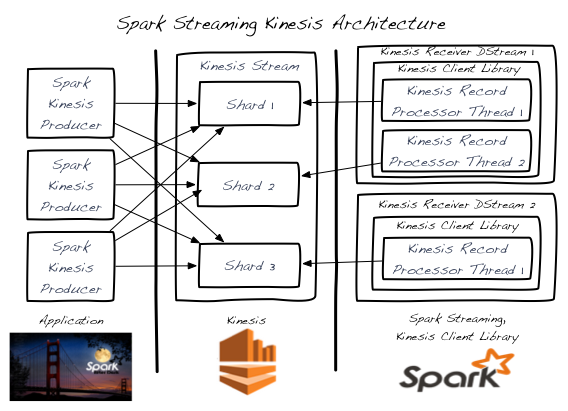

[Amazon Kinesis](http://aws.amazon.com/kinesis/) is a fully managed service for real-time processing of streaming data at massive scale.
The Kinesis receiver creates an input DStream using the Kinesis Client Library (KCL) provided by Amazon under the Amazon Software License (ASL).
The KCL builds on top of the Apache 2.0 licensed AWS Java SDK and provides load-balancing, fault-tolerance, checkpointing through the concepts of Workers, Checkpoints, and Shard Leases.
Here we explain how to configure Spark Streaming to receive data from Kinesis.

#### Configuring Kinesis

A Kinesis stream can be set up at one of the valid Kinesis endpoints with 1 or more shards per the following
[guide](http://docs.aws.amazon.com/kinesis/latest/dev/step-one-create-stream.html).

#### Configuring Spark Streaming Application

1. **Linking:** In your SBT/Maven project definition, link your streaming application against the following artifact (see [Linking section](streaming-programming-guide.html#linking) in the main programming guide for further information).

		groupId = org.apache.spark
		artifactId = spark-streaming-kinesis-asl_{{site.SCALA_BINARY_VERSION}}
		version = {{site.SPARK_VERSION_SHORT}}

	**Note that by linking to this library, you will include [ASL](https://aws.amazon.com/asl/)-licensed code in your application.**

2. **Programming:** In the streaming application code, import `KinesisUtils` and create the input DStream as follows:

	

	

		import org.apache.spark.streaming.Duration
		import org.apache.spark.streaming.kinesis._
		import com.amazonaws.services.kinesis.clientlibrary.lib.worker.InitialPositionInStream

		val kinesisStream = KinesisUtils.createStream(
			streamingContext, [Kinesis app name], [Kinesis stream name], [endpoint URL],
			[region name], [initial position], [checkpoint interval], StorageLevel.MEMORY_AND_DISK_2)

	See the [API docs](api/scala/index.html#org.apache.spark.streaming.kinesis.KinesisUtils$)
	and the [example]({{site.SPARK_GITHUB_URL}}/tree/master/extras/kinesis-asl/src/main/scala/org/apache/spark/examples/streaming/KinesisWordCountASL.scala). Refer to the Running the Example section for instructions on how to run the example.

	

	

		import org.apache.spark.streaming.Duration;
		import org.apache.spark.streaming.kinesis.*;
		import com.amazonaws.services.kinesis.clientlibrary.lib.worker.InitialPositionInStream;

		JavaReceiverInputDStream<byte[]> kinesisStream = KinesisUtils.createStream(
			streamingContext, [Kinesis app name], [Kinesis stream name], [endpoint URL],
			[region name], [initial position], [checkpoint interval], StorageLevel.MEMORY_AND_DISK_2);

	See the [API docs](api/java/index.html?org/apache/spark/streaming/kinesis/KinesisUtils.html)
	and the [example]({{site.SPARK_GITHUB_URL}}/tree/master/extras/kinesis-asl/src/main/java/org/apache/spark/examples/streaming/JavaKinesisWordCountASL.java). Refer to the next subsection for instructions to run the example.

	

	

    - `streamingContext`: StreamingContext containg an application name used by Kinesis to tie this Kinesis application to the Kinesis stream

	- `[Kineiss app name]`: The application name that will be used to checkpoint the Kinesis
		sequence numbers in DynamoDB table.
		- The application name must be unique for a given account and region.
		- If the table exists but has incorrect checkpoint information (for a different stream, or
		  old expired sequenced numbers), then there may be temporary errors.

	- `[Kinesis stream name]`: The Kinesis stream that this streaming application will pull data from.

	- `[endpoint URL]`: Valid Kinesis endpoints URL can be found [here](http://docs.aws.amazon.com/general/latest/gr/rande.html#ak_region).

	- `[region name]`: Valid Kinesis region names can be found [here](https://docs.aws.amazon.com/AWSEC2/latest/UserGuide/using-regions-availability-zones.html).

	- `[checkpoint interval]`: The interval (e.g., Duration(2000) = 2 seconds) at which the Kinesis Client Library saves its position in the stream.  For starters, set it to the same as the batch interval of the streaming application.

	- `[initial position]`: Can be either `InitialPositionInStream.TRIM_HORIZON` or `InitialPositionInStream.LATEST` (see Kinesis Checkpointing section and Amazon Kinesis API documentation for more details).

	In other versions of the API, you can also specify the AWS access key and secret key directly.

3. **Deploying:** Package `spark-streaming-kinesis-asl_{{site.SCALA_BINARY_VERSION}}` and its dependencies (except `spark-core_{{site.SCALA_BINARY_VERSION}}` and `spark-streaming_{{site.SCALA_BINARY_VERSION}}` which are provided by `spark-submit`) into the application JAR. Then use `spark-submit` to launch your application (see [Deploying section](streaming-programming-guide.html#deploying-applications) in the main programming guide).

	*Points to remember at runtime:*

	- Kinesis data processing is ordered per partition and occurs at-least once per message.

	- Multiple applications can read from the same Kinesis stream.  Kinesis will maintain the application-specific shard and checkpoint info in DynamodDB.

	- A single Kinesis stream shard is processed by one input DStream at a time.

	

  		
	  	<!-- Images are downsized intentionally to improve quality on retina displays -->
	

	- A single Kinesis input DStream can read from multiple shards of a Kinesis stream by creating multiple KinesisRecordProcessor threads.

	- Multiple input DStreams running in separate processes/instances can read from a Kinesis stream.

	- You never need more Kinesis input DStreams than the number of Kinesis stream shards as each input DStream will create at least one KinesisRecordProcessor thread that handles a single shard.

	- Horizontal scaling is achieved by adding/removing  Kinesis input DStreams (within a single process or across multiple processes/instances) - up to the total number of Kinesis stream shards per the previous point.

	- The Kinesis input DStream will balance the load between all DStreams - even across processes/instances.

	- The Kinesis input DStream will balance the load during re-shard events (merging and splitting) due to changes in load.

	- As a best practice, it's recommended that you avoid re-shard jitter by over-provisioning when possible.

	- Each Kinesis input DStream maintains its own checkpoint info.  See the Kinesis Checkpointing section for more details.

	- There is no correlation between the number of Kinesis stream shards and the number of RDD partitions/shards created across the Spark cluster during input DStream processing.  These are 2 independent partitioning schemes.

#### Running the Example
To run the example,

- Download Spark source and follow the [instructions](building-spark.html) to build Spark with profile *-Pkinesis-asl*.

        mvn -Pkinesis-asl -DskipTests clean package

- Set up Kinesis stream (see earlier section) within AWS. Note the name of the Kinesis stream and the endpoint URL corresponding to the region where the stream was created.

- Set up the environment variables AWS_ACCESS_KEY_ID and AWS_SECRET_KEY with your AWS credentials.

- In the Spark root directory, run the example as

	

	

        bin/run-example streaming.KinesisWordCountASL [Kinesis app name] [Kinesis stream name] [endpoint URL]

	

	

        bin/run-example streaming.JavaKinesisWordCountASL [Kinesis app name] [Kinesis stream name] [endpoint URL]

	

	

    This will wait for data to be received from the Kinesis stream.

- To generate random string data to put onto the Kinesis stream, in another terminal, run the associated Kinesis data producer.

		bin/run-example streaming.KinesisWordProducerASL [Kinesis stream name] [endpoint URL] 1000 10

	This will push 1000 lines per second of 10 random numbers per line to the Kinesis stream.  This data should then be received and processed by the running example.

#### Kinesis Checkpointing
- Each Kinesis input DStream periodically stores the current position of the stream in the backing DynamoDB table.  This allows the system to recover from failures and continue processing where the DStream left off.

- Checkpointing too frequently will cause excess load on the AWS checkpoint storage layer and may lead to AWS throttling.  The provided example handles this throttling with a random-backoff-retry strategy.

- If no Kinesis checkpoint info exists when the input DStream starts, it will start either from the oldest record available (InitialPositionInStream.TRIM_HORIZON) or from the latest tip (InitialPostitionInStream.LATEST).  This is configurable.
- InitialPositionInStream.LATEST could lead to missed records if data is added to the stream while no input DStreams are running (and no checkpoint info is being stored). 
- InitialPositionInStream.TRIM_HORIZON may lead to duplicate processing of records where the impact is dependent on checkpoint frequency and processing idempotency.
