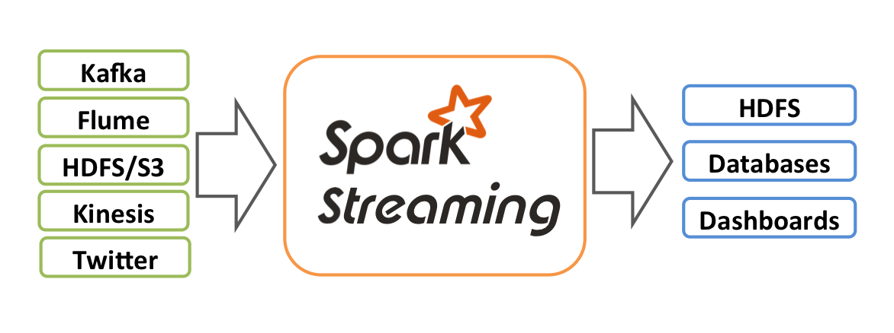
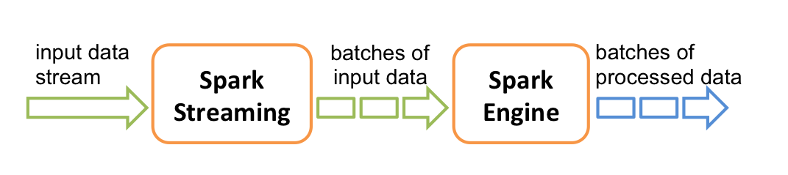
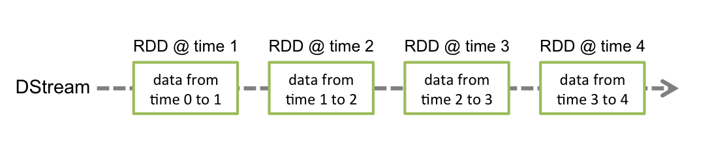
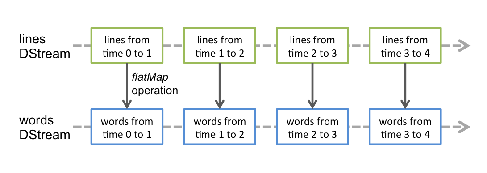
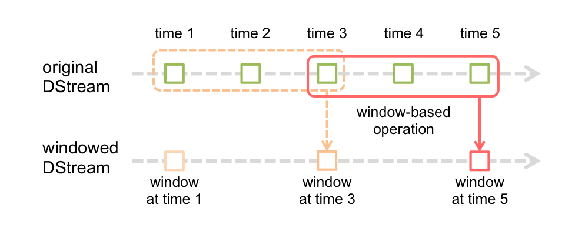

* This will become a table of contents (this text will be scraped).
{:toc}

# Overview
Spark Streaming is an extension of the core Spark API that allows enables high-throughput,
fault-tolerant stream processing of live data streams. Data can be ingested from many sources
like Kafka, Flume, Twitter, ZeroMQ, Kinesis or plain old TCP sockets and be processed using complex
algorithms expressed with high-level functions like `map`, `reduce`, `join` and `window`.
Finally, processed data can be pushed out to filesystems, databases,
and live dashboards. In fact, you can apply Spark's in-built
[machine learning](mllib-guide.html) algorithms, and
[graph processing](graphx-programming-guide.html) algorithms on data streams.

  

Internally, it works as follows. Spark Streaming receives live input data streams and divides
the data into batches, which are then processed by the Spark engine to generate the final
stream of results in batches.

  

Spark Streaming provides a high-level abstraction called *discretized stream* or *DStream*,
which represents a continuous stream of data. DStreams can be created either from input data
stream from sources such as Kafka, Flume, and Kinesis, or by applying high-level
operations on other DStreams. Internally, a DStream is represented as a sequence of
[RDDs](api/scala/index.html#org.apache.spark.rdd.RDD).

This guide shows you how to start writing Spark Streaming programs with DStreams. You can
write Spark Streaming programs in Scala or Java, both of which are presented in this guide. You
will find tabs throughout this guide that let you choose between Scala and Java
code snippets.

***************************************************************************************************  

# A Quick Example
Before we go into the details of how to write your own Spark Streaming program,
let's take a quick look at what a simple Spark Streaming program looks like. Let's say we want to
count the number of words in text data received from a data server listening on a TCP
socket. All you need to
do is as follows.

First, we import the names of the Spark Streaming classes, and some implicit
conversions from StreamingContext into our environment, to add useful methods to
other classes we need (like DStream).

[StreamingContext](api/scala/index.html#org.apache.spark.streaming.StreamingContext) is the
main entry point for all streaming functionality.


import org.apache.spark.streaming._
import org.apache.spark.streaming.StreamingContext._


Then we create a
[StreamingContext](api/scala/index.html#org.apache.spark.streaming.StreamingContext) object.
Besides Spark's configuration, we specify that any DStream will be processed
in 1 second batches.


import org.apache.spark.api.java.function._
import org.apache.spark.streaming._
import org.apache.spark.streaming.api._
// Create a StreamingContext with a local master
// Spark Streaming needs at least two working thread
val ssc = new StreamingContext("local[2]", "NetworkWordCount", Seconds(1))


Using this context, we then create a new DStream
by specifying the IP address and port of the data server.


// Create a DStream that will connect to serverIP:serverPort, like localhost:9999
val lines = ssc.socketTextStream("localhost", 9999)


This `lines` DStream represents the stream of data that will be received from the data
server. Each record in this DStream is a line of text. Next, we want to split the lines by
space into words.


// Split each line into words
val words = lines.flatMap(_.split(" "))


`flatMap` is a one-to-many DStream operation that creates a new DStream by
generating multiple new records from each record in the source DStream. In this case,
each line will be split into multiple words and the stream of words is represented as the
`words` DStream.  Next, we want to count these words.


import org.apache.spark.streaming.StreamingContext._
// Count each word in each batch
val pairs = words.map(word => (word, 1))
val wordCounts = pairs.reduceByKey(_ + _)

// Print a few of the counts to the console
wordCounts.print()


The `words` DStream is further mapped (one-to-one transformation) to a DStream of `(word,
1)` pairs, which is then reduced to get the frequency of words in each batch of data.
Finally, `wordCounts.print()` will print a few of the counts generated every second.

Note that when these lines are executed, Spark Streaming only sets up the computation it
will perform when it is started, and no real processing has started yet. To start the processing
after all the transformations have been setup, we finally call


ssc.start()             // Start the computation
ssc.awaitTermination()  // Wait for the computation to terminate


The complete code can be found in the Spark Streaming example
[NetworkWordCount]({{site.SPARK_GITHUB_URL}}/blob/master/examples/src/main/scala/org/apache/spark/examples/streaming/NetworkWordCount.scala).
 

First, we create a
[JavaStreamingContext](api/java/index.html?org/apache/spark/streaming/api/java/JavaStreamingContext.html) object,
which is the main entry point for all streaming
functionality. Besides Spark's configuration, we specify that any DStream would be processed
in 1 second batches.


import org.apache.spark.api.java.function.*;
import org.apache.spark.streaming.*;
import org.apache.spark.streaming.api.java.*;
import scala.Tuple2;
// Create a StreamingContext with a local master
JavaStreamingContext jssc = new JavaStreamingContext("local[2]", "JavaNetworkWordCount", new Duration(1000))


Using this context, we then create a new DStream
by specifying the IP address and port of the data server.


// Create a DStream that will connect to serverIP:serverPort, like localhost:9999
JavaReceiverInputDStream<String> lines = jssc.socketTextStream("localhost", 9999);


This `lines` DStream represents the stream of data that will be received from the data
server. Each record in this stream is a line of text. Then, we want to split the the lines by
space into words.


// Split each line into words
JavaDStream<String> words = lines.flatMap(
  new FlatMapFunction<String, String>() {
    @Override public Iterable<String> call(String x) {
      return Arrays.asList(x.split(" "));
    }
  });


`flatMap` is a DStream operation that creates a new DStream by
generating multiple new records from each record in the source DStream. In this case,
each line will be split into multiple words and the stream of words is represented as the
`words` DStream. Note that we defined the transformation using a
[FlatMapFunction](api/scala/index.html#org.apache.spark.api.java.function.FlatMapFunction) object.
As we will discover along the way, there are a number of such convenience classes in the Java API
that help define DStream transformations.

Next, we want to count these words.


// Count each word in each batch
JavaPairDStream<String, Integer> pairs = words.map(
  new PairFunction<String, String, Integer>() {
    @Override public Tuple2<String, Integer> call(String s) throws Exception {
      return new Tuple2<String, Integer>(s, 1);
    }
  });
JavaPairDStream<String, Integer> wordCounts = pairs.reduceByKey(
  new Function2<Integer, Integer, Integer>() {
    @Override public Integer call(Integer i1, Integer i2) throws Exception {
      return i1 + i2;
    }
  });
wordCounts.print();     // Print a few of the counts to the console


The `words` DStream is further mapped (one-to-one transformation) to a DStream of `(word,
1)` pairs, using a [PairFunction](api/scala/index.html#org.apache.spark.api.java.function.PairFunction)
object. Then, it is reduced to get the frequency of words in each batch of data,
using a [Function2](api/scala/index.html#org.apache.spark.api.java.function.Function2) object.
Finally, `wordCounts.print()` will print a few of the counts generated every second.

Note that when these lines are executed, Spark Streaming only sets up the computation it
will perform when it is started, and no real processing has started yet. To start the processing
after all the transformations have been setup, we finally call


jssc.start();              // Start the computation
jssc.awaitTermination();   // Wait for the computation to terminate


The complete code can be found in the Spark Streaming example
[JavaNetworkWordCount]({{site.SPARK_GITHUB_URL}}/blob/master/examples/src/main/java/org/apache/spark/examples/streaming/JavaNetworkWordCount.java).
 

If you have already [downloaded](index.html#downloading) and [built](index.html#building) Spark,
you can run this example as follows. You will first need to run Netcat
(a small utility found in most Unix-like systems) as a data server by using


$ nc -lk 9999


Then, in a different terminal, you can start the example by using


$ ./bin/run-example org.apache.spark.examples.streaming.NetworkWordCount localhost 9999



$ ./bin/run-example org.apache.spark.examples.streaming.JavaNetworkWordCount localhost 9999


Then, any lines typed in the terminal running the netcat server will be counted and printed on
screen every second. It will look something like this.

<table width="100%">
    <td>

# TERMINAL 1:
# Running Netcat

$ nc -lk 9999

hello world

...

    </td>
    <td width="2%"></td>
    <td>

# TERMINAL 2: RUNNING NetworkWordCount or JavaNetworkWordCount

$ ./bin/run-example org.apache.spark.examples.streaming.NetworkWordCount localhost 9999
...
-------------------------------------------
Time: 1357008430000 ms
-------------------------------------------
(hello,1)
(world,1)
...

    </td>
</table>

You can also use Spark Streaming directly from the Spark shell:


$ bin/spark-shell


... and create your StreamingContext by wrapping the existing interactive shell
SparkContext object, `sc`:


val ssc = new StreamingContext(sc, Seconds(1))


When working with the shell, you may also need to send a `^D` to your netcat session
to force the pipeline to print the word counts to the console at the sink.

***************************************************************************************************  

# Basics

Next, we move beyond the simple example and elaborate on the basics of Spark Streaming that you
need to know to write your streaming applications.

## Linking

To write your own Spark Streaming program, you will have to add the following dependency to your
 SBT or Maven project:

    groupId = org.apache.spark
    artifactId = spark-streaming_{{site.SCALA_BINARY_VERSION}}
    version = {{site.SPARK_VERSION}}

For ingesting data from sources like Kafka, Flume, and Kinesis that are not present in the Spark
Streaming core
 API, you will have to add the corresponding
artifact `spark-streaming-xyz_{{site.SCALA_BINARY_VERSION}}` to the dependencies. For example,
some of the common ones are as follows.

<table class="table">
<tr><th>Source</th><th>Artifact</th></tr>
<tr><td> Kafka </td><td> spark-streaming-kafka_{{site.SCALA_BINARY_VERSION}} </td></tr>
<tr><td> Flume </td><td> spark-streaming-flume_{{site.SCALA_BINARY_VERSION}} </td></tr>
<tr><td> Twitter </td><td> spark-streaming-twitter_{{site.SCALA_BINARY_VERSION}} </td></tr>
<tr><td> ZeroMQ </td><td> spark-streaming-zeromq_{{site.SCALA_BINARY_VERSION}} </td></tr>
<tr><td> MQTT </td><td> spark-streaming-mqtt_{{site.SCALA_BINARY_VERSION}} </td></tr>
<tr><td> Kinesis (built separately)</td><td> kinesis-asl_{{site.SCALA_BINARY_VERSION}} </td></tr>
<tr><td> </td><td></td></tr>
</table>

For an up-to-date list, please refer to the
[Apache repository](http://search.maven.org/#search%7Cga%7C1%7Cg%3A%22org.apache.spark%22%20AND%20v%3A%22{{site.SPARK_VERSION}}%22)
for the full list of supported sources and artifacts.

## Initializing

To initialize a Spark Streaming program in Scala, a
[`StreamingContext`](api/scala/index.html#org.apache.spark.streaming.StreamingContext)
object has to be created, which is the main entry point of all Spark Streaming functionality.
A `StreamingContext` object can be created by using


new StreamingContext(master, appName, batchDuration, [sparkHome], [jars])


To initialize a Spark Streaming program in Java, a
[`JavaStreamingContext`](api/scala/index.html#org.apache.spark.streaming.api.java.JavaStreamingContext)
object has to be created, which is the main entry point of all Spark Streaming functionality.
A `JavaStreamingContext` object can be created by using


new JavaStreamingContext(master, appName, batchInterval, [sparkHome], [jars])


The `master` parameter is a standard [Spark cluster URL](programming-guide.html#master-urls)
and can be "local" for local testing. The `appName` is a name of your program,
which will be shown on your cluster's web UI. The `batchInterval` is the size of the batches,
as explained earlier. Finally, the last two parameters are needed to deploy your code to a cluster
 if running in distributed mode, as described in the
 [Spark programming guide](programming-guide.html#deploying-code-on-a-cluster).
 Additionally, the underlying SparkContext can be accessed as
`ssc.sparkContext`.

The batch interval must be set based on the latency requirements of your application
and available cluster resources. See the [Performance Tuning](#setting-the-right-batch-size)
section for more details.

## DStreams
*Discretized Stream* or *DStream* is the basic abstraction provided by Spark Streaming.
It represents a continuous stream of data, either the input data stream received from source,
or the processed data stream generated by transforming the input stream. Internally,
it is represented by a continuous sequence of RDDs, which is Spark's abstraction of an immutable,
distributed dataset. Each RDD in a DStream contains data from a certain interval,
as shown in the following figure.

  

Any operation applied on a DStream translates to operations on the underlying RDDs. For example,
in the [earlier example](#a-quick-example) of converting a stream of lines to words,
the `flatmap` operation is applied on each RDD in the `lines` DStream to generate the RDDs of the
 `words` DStream. This is shown the following figure.

  

These underlying RDD transformations are computed by the Spark engine. The DStream operations
hide most of these details and provides the developer with higher-level API for convenience.
These operations are discussed in detail in later sections.

## Input Sources

We have already taken a look at the `ssc.socketTextStream(...)` in the [quick
example](#a-quick-example) which creates a DStream from text
data received over a TCP socket connection. Besides sockets, the core Spark Streaming API provides
methods for creating DStreams from files and Akka actors as input sources.

Specifically, for files, the DStream can be created as


ssc.fileStream(dataDirectory)



jssc.fileStream(dataDirectory);


Spark Streaming will monitor the directory `dataDirectory` for any Hadoop-compatible filesystem
and process any files created in that directory. Note that

 * The files must have the same data format.
 * The files must be created in the `dataDirectory` by atomically *moving* or *renaming* them into
 the data directory.
 * Once moved the files must not be changed.

For more details on streams from files, Akka actors and sockets,
see the API documentations of the relevant functions in
[StreamingContext](api/scala/index.html#org.apache.spark.streaming.StreamingContext) for
Scala and [JavaStreamingContext](api/scala/index.html#org.apache.spark.streaming.api.java.JavaStreamingContext)
 for Java.

Additional functionality for creating DStreams from sources such as Kafka, Flume, Kinesis, and Twitter
can be imported by adding the right dependencies as explained in an
[earlier](#linking) section. To take the
case of Kafka, after adding the artifact `spark-streaming-kafka_{{site.SCALA_BINARY_VERSION}}` to the
project dependencies, you can create a DStream from Kafka as


import org.apache.spark.streaming.kafka._
KafkaUtils.createStream(ssc, kafkaParams, ...)



import org.apache.spark.streaming.kafka.*;
KafkaUtils.createStream(jssc, kafkaParams, ...);


For more details on these additional sources, see the corresponding [API documentation](#where-to-go-from-here).
Furthermore, you can also implement your own custom receiver for your sources. See the
[Custom Receiver Guide](streaming-custom-receivers.html).

### Kinesis
[Kinesis](streaming-kinesis.html)

## Operations
There are two kinds of DStream operations - _transformations_ and _output operations_. Similar to
RDD transformations, DStream transformations operate on one or more DStreams to create new DStreams
with transformed data. After applying a sequence of transformations to the input streams, output
operations need to called, which write data out to an external data sink, such as a filesystem or a
database.

### Transformations
DStreams support many of the transformations available on normal Spark RDD's. Some of the
common ones are as follows.

<table class="table">
<tr><th style="width:25%">Transformation</th><th>Meaning</th></tr>
<tr>
  <td> <b>map</b>(<i>func</i>) </td>
  <td> Return a new DStream by passing each element of the source DStream through a
  function <i>func</i>. </td>
</tr>
<tr>
  <td> <b>flatMap</b>(<i>func</i>) </td>
  <td> Similar to map, but each input item can be mapped to 0 or more output items. </td>
</tr>
<tr>
  <td> <b>filter</b>(<i>func</i>) </td>
  <td> Return a new DStream by selecting only the records of the source DStream on which
  <i>func</i> returns true. </td>
</tr>
<tr>
  <td> <b>repartition</b>(<i>numPartitions</i>) </td>
  <td> Changes the level of parallelism in this DStream by creating more or fewer partitions. </td>
</tr>
<tr>
  <td> <b>union</b>(<i>otherStream</i>) </td>
  <td> Return a new DStream that contains the union of the elements in the source DStream and
  <i>otherDStream</i>. </td>
</tr>
<tr>
  <td> <b>count</b>() </td>
  <td> Return a new DStream of single-element RDDs by counting the number of elements in each RDD
   of the source DStream. </td>
</tr>
<tr>
  <td> <b>reduce</b>(<i>func</i>) </td>
  <td> Return a new DStream of single-element RDDs by aggregating the elements in each RDD of the
  source DStream using a function <i>func</i> (which takes two arguments and returns one).
  The function should be associative so that it can be computed in parallel. </td>
</tr>
<tr>
  <td> <b>countByValue</b>() </td>
  <td> When called on a DStream of elements of type K, return a new DStream of (K, Long) pairs
  where the value of each key is its frequency in each RDD of the source DStream.  </td>
</tr>
<tr>
  <td> <b>reduceByKey</b>(<i>func</i>, [<i>numTasks</i>]) </td>
  <td> When called on a DStream of (K, V) pairs, return a new DStream of (K, V) pairs where the
  values for each key are aggregated using the given reduce function. <b>Note:</b> By default,
  this uses Spark's default number of parallel tasks (2 for local mode, and in cluster mode the number
  is determined by the config property <code>spark.default.parallelism</code>) to do the grouping.
  You can pass an optional <code>numTasks</code> argument to set a different number of tasks.</td>
</tr>
<tr>
  <td> <b>join</b>(<i>otherStream</i>, [<i>numTasks</i>]) </td>
  <td> When called on two DStreams of (K, V) and (K, W) pairs, return a new DStream of (K, (V, W))
  pairs with all pairs of elements for each key. </td>
</tr>
<tr>
  <td> <b>cogroup</b>(<i>otherStream</i>, [<i>numTasks</i>]) </td>
  <td> When called on DStream of (K, V) and (K, W) pairs, return a new DStream of
  (K, Seq[V], Seq[W]) tuples.</td>
</tr>
<tr>
  <td> <b>transform</b>(<i>func</i>) </td>
  <td> Return a new DStream by applying a RDD-to-RDD function to every RDD of the source DStream.
  This can be used to do arbitrary RDD operations on the DStream. </td>
</tr>
<tr>
  <td> <b>updateStateByKey</b>(<i>func</i>) </td>
  <td> Return a new "state" DStream where the state for each key is updated by applying the
  given function on the previous state of the key and the new values for the key. This can be
  used to maintain arbitrary state data for each key.</td>
</tr>
<tr><td></td><td></td></tr>
</table>

The last two transformations are worth highlighting again.

<h4>UpdateStateByKey Operation</h4>

The `updateStateByKey` operation allows you to maintain arbitrary state while continuously updating
it with new information. To use this, you will have to do two steps.

1. Define the state - The state can be of arbitrary data type.
1. Define the state update function - Specify with a function how to update the state using the
previous state and the new values from input stream.

Let's illustrate this with an example. Say you want to maintain a running count of each word
seen in a text data stream. Here, the running count is the state and it is an integer. We
define the update function as


def updateFunction(newValues: Seq[Int], runningCount: Option[Int]): Option[Int] = {
    val newCount = ...  // add the new values with the previous running count to get the new count
    Some(newCount)
}


This is applied on a DStream containing words (say, the `pairs` DStream containing `(word,
1)` pairs in the [earlier example](#a-quick-example)).


val runningCounts = pairs.updateStateByKey[Int](updateFunction _)



import com.google.common.base.Optional;
Function2<List<Integer>, Optional<Integer>, Optional<Integer>> updateFunction =
  new Function2<List<Integer>, Optional<Integer>, Optional<Integer>>() {
    @Override public Optional<Integer> call(List<Integer> values, Optional<Integer> state) {
      Integer newSum = ...  // add the new values with the previous running count to get the new count
      return Optional.of(newSum);
    }
  };


This is applied on a DStream containing words (say, the `pairs` DStream containing `(word,
1)` pairs in the [quick example](#a-quick-example)).


JavaPairDStream<String, Integer> runningCounts = pairs.updateStateByKey(updateFunction);


The update function will be called for each word, with `newValues` having a sequence of 1's (from
the `(word, 1)` pairs) and the `runningCount` having the previous count. For the complete
Scala code, take a look at the example
[StatefulNetworkWordCount]({{site.SPARK_GITHUB_URL}}/blob/master/examples/src/main/scala/org/apache/spark/examples/streaming/StatefulNetworkWordCount.scala).

<h4>Transform Operation</h4>

The `transform` operation (along with its variations like `transformWith`) allows
arbitrary RDD-to-RDD functions to be applied on a DStream. It can be used to apply any RDD
operation that is not exposed in the DStream API.
For example, the functionality of joining every batch in a data stream
with another dataset is not directly exposed in the DStream API. However,
you can easily use `transform` to do this. This enables very powerful possibilities. For example,
if you want to do real-time data cleaning by joining the input data stream with precomputed
spam information (maybe generated with Spark as well) and then filtering based on it.


val spamInfoRDD = ssc.sparkContext.newAPIHadoopRDD(...) // RDD containing spam information

val cleanedDStream = wordCounts.transform(rdd => {
  rdd.join(spamInfoRDD).filter(...) // join data stream with spam information to do data cleaning
  ...
})



import org.apache.spark.streaming.api.java.*;
// RDD containing spam information
final JavaPairRDD<String, Double> spamInfoRDD = jssc.sparkContext().newAPIHadoopRDD(...);

JavaPairDStream<String, Integer> cleanedDStream = wordCounts.transform(
  new Function<JavaPairRDD<String, Integer>, JavaPairRDD<String, Integer>>() {
    @Override public JavaPairRDD<String, Integer> call(JavaPairRDD<String, Integer> rdd) throws Exception {
      rdd.join(spamInfoRDD).filter(...); // join data stream with spam information to do data cleaning
      ...
    }
  });


In fact, you can also use [machine learning](mllib-guide.html) and
[graph computation](graphx-programming-guide.html) algorithms in the `transform` method.

<h4>Window Operations</h4>

Finally, Spark Streaming also provides *windowed computations*, which allow you to apply
transformations over a sliding window of data. This following figure illustrates this sliding
window.

  

As shown in the figure, every time the window *slides* over a source DStream,
the source RDDs that fall within the window are combined and operated upon to produce the
RDDs of the windowed DStream. In this specific case, the operation is applied over last 3 time
units of data, and slides by 2 time units. This shows that any window-based operation needs to
specify two parameters.

 * <i>window length</i> - The duration of the window (3 in the figure)
 * <i>slide interval</i> - The interval at which the window-based operation is performed (2 in
 the figure).

These two parameters must be multiples of the batch interval of the source DStream (1 in the
figure).

Let's illustrate the window operations with an example. Say, you want to extend the
[earlier example](#a-quick-example) by generating word counts over last 30 seconds of data,
every 10 seconds. To do this, we have to apply the `reduceByKey` operation on the `pairs` DStream of
`(word, 1)` pairs over the last 30 seconds of data. This is done using the
operation `reduceByKeyAndWindow`.


// Reduce last 30 seconds of data, every 10 seconds
val windowedWordCounts = pairs.reduceByKeyAndWindow((a:Int,b:Int) => (a + b), Seconds(30), Seconds(10))



// Reduce function adding two integers, defined separately for clarity
Function2<Integer, Integer, Integer> reduceFunc = new Function2<Integer, Integer, Integer>() {
  @Override public Integer call(Integer i1, Integer i2) throws Exception {
    return i1 + i2;
  }
};

// Reduce last 30 seconds of data, every 10 seconds
JavaPairDStream<String, Integer> windowedWordCounts = pairs.reduceByKeyAndWindow(reduceFunc, new Duration(30000), new Duration(10000));


Some of the common window-based operations are as follows. All of these operations take the
said two parameters - <i>windowLength</i> and <i>slideInterval</i>.

<table class="table">
<tr><th style="width:25%">Transformation</th><th>Meaning</th></tr>
<tr>
  <td> <b>window</b>(<i>windowLength</i>, <i>slideInterval</i>) </td>
  <td> Return a new DStream which is computed based on windowed batches of the source DStream.
  </td>
</tr>
<tr>
  <td> <b>countByWindow</b>(<i>windowLength</i>, <i>slideInterval</i>) </td>
  <td> Return a sliding window count of elements in the stream.
  </td>
</tr>
<tr>
  <td> <b>reduceByWindow</b>(<i>func</i>, <i>windowLength</i>, <i>slideInterval</i>) </td>
  <td> Return a new single-element stream, created by aggregating elements in the stream over a
  sliding interval using <i>func</i>. The function should be associative so that it can be computed
  correctly in parallel.
  </td>
</tr>
<tr>
  <td> <b>reduceByKeyAndWindow</b>(<i>func</i>, <i>windowLength</i>, <i>slideInterval</i>,
  [<i>numTasks</i>]) </td>
  <td> When called on a DStream of (K, V) pairs, returns a new DStream of (K, V)
  pairs where the values for each key are aggregated using the given reduce function <i>func</i>
  over batches in a sliding window. <b>Note:</b> By default, this uses Spark's default number of
  parallel tasks (2 for local mode, and in cluster mode the number is determined by the config
  property <code>spark.default.parallelism</code>) to do the grouping. You can pass an optional
  <code>numTasks</code> argument to set a different number of tasks.
  </td>
</tr>
<tr>
  <td> <b>reduceByKeyAndWindow</b>(<i>func</i>, <i>invFunc</i>, <i>windowLength</i>,
  <i>slideInterval</i>, [<i>numTasks</i>]) </td>
  <td> A more efficient version of the above <code>reduceByKeyAndWindow()</code> where the reduce
  value of each window is calculated incrementally using the reduce values of the previous window.
  This is done by reducing the new data that enter the sliding window, and "inverse reducing" the
  old data that leave the window. An example would be that of "adding" and "subtracting" counts
  of keys as the window slides. However, it is applicable to only "invertible reduce functions",
  that is, those reduce functions which have a corresponding "inverse reduce" function (taken as
  parameter <i>invFunc</i>. Like in <code>reduceByKeyAndWindow</code>, the number of reduce tasks
  is configurable through an optional argument.
</td>
</tr>
<tr>
  <td> <b>countByValueAndWindow</b>(<i>windowLength</i>,
  <i>slideInterval</i>, [<i>numTasks</i>]) </td>
  <td> When called on a DStream of (K, V) pairs, returns a new DStream of (K, Long) pairs where the
  value of each key is its frequency within a sliding window. Like in
  <code>reduceByKeyAndWindow</code>, the number of reduce tasks is configurable through an
  optional argument.
</td>
</tr>
<tr><td></td><td></td></tr>
</table>

### Output Operations
When an output operator is called, it triggers the computation of a stream. Currently the following
output operators are defined:

<table class="table">
<tr><th style="width:30%">Output Operation</th><th>Meaning</th></tr>
<tr>
  <td> <b>print</b>() </td>
  <td> Prints first ten elements of every batch of data in a DStream on the driver. </td>
</tr>
<tr>
  <td> <b>foreachRDD</b>(<i>func</i>) </td>
  <td> The fundamental output operator. Applies a function, <i>func</i>, to each RDD generated from
  the stream. This function should have side effects, such as printing output, saving the RDD to
  external files, or writing it over the network to an external system. </td>
</tr>
<tr>
  <td> <b>saveAsObjectFiles</b>(<i>prefix</i>, [<i>suffix</i>]) </td>
  <td> Save this DStream's contents as a <code>SequenceFile</code> of serialized objects. The file
  name at each batch interval is generated based on <i>prefix</i> and
  <i>suffix</i>: <i>"prefix-TIME_IN_MS[.suffix]"</i>.
  </td>
</tr>
<tr>
  <td> <b>saveAsTextFiles</b>(<i>prefix</i>, [<i>suffix</i>]) </td>
  <td> Save this DStream's contents as a text files. The file name at each batch interval is
  generated based on <i>prefix</i> and <i>suffix</i>: <i>"prefix-TIME_IN_MS[.suffix]"</i>. </td>
</tr>
<tr>
  <td> <b>saveAsHadoopFiles</b>(<i>prefix</i>, [<i>suffix</i>]) </td>
  <td> Save this DStream's contents as a Hadoop file. The file name at each batch interval is
  generated based on <i>prefix</i> and <i>suffix</i>: <i>"prefix-TIME_IN_MS[.suffix]"</i>. </td>
</tr>
<tr><td></td><td></td></tr>
</table>

The complete list of DStream operations is available in the API documentation. For the Scala API,
see [DStream](api/scala/index.html#org.apache.spark.streaming.dstream.DStream)
and [PairDStreamFunctions](api/scala/index.html#org.apache.spark.streaming.dstream.PairDStreamFunctions).
For the Java API, see [JavaDStream](api/java/index.html?org/apache/spark/streaming/api/java/JavaDStream.html)
and [JavaPairDStream](api/java/index.html?org/apache/spark/streaming/api/java/JavaPairDStream.html).

## Persistence
Similar to RDDs, DStreams also allow developers to persist the stream's data in memory. That is,
using `persist()` method on a DStream would automatically persist every RDD of that DStream in
memory. This is useful if the data in the DStream will be computed multiple times (e.g., multiple
operations on the same data). For window-based operations like `reduceByWindow` and
`reduceByKeyAndWindow` and state-based operations like `updateStateByKey`, this is implicitly true.
Hence, DStreams generated by window-based operations are automatically persisted in memory, without
the developer calling `persist()`.

For input streams that receive data over the network (such as, Kafka, Flume, sockets, etc.), the
default persistence level is set to replicate the data to two nodes for fault-tolerance.

Note that, unlike RDDs, the default persistence level of DStreams keeps the data serialized in
memory. This is further discussed in the [Performance Tuning](#memory-tuning) section. More
information on different persistence levels can be found in
[Spark Programming Guide](programming-guide.html#rdd-persistence).

## RDD Checkpointing
A _stateful operation_ is one which operates over multiple batches of data. This includes all
window-based operations and the `updateStateByKey` operation. Since stateful operations have a
dependency on previous batches of data, they continuously accumulate metadata over time.
To clear this metadata, streaming supports periodic _checkpointing_ by saving intermediate data
to HDFS. Note that checkpointing also incurs the cost of saving to HDFS which may cause the
corresponding batch to take longer to process. Hence, the interval of checkpointing needs to be
set carefully. At small batch sizes (say 1 second), checkpointing every batch may significantly
reduce operation throughput. Conversely, checkpointing too slowly causes the lineage and task
sizes to grow which may have detrimental effects. Typically, a checkpoint interval of 5 - 10
times of sliding interval of a DStream is good setting to try.

To enable checkpointing, the developer has to provide the HDFS path to which RDD will be saved.
This is done by using


ssc.checkpoint(hdfsPath) // assuming ssc is the StreamingContext or JavaStreamingContext


The interval of checkpointing of a DStream can be set by using


dstream.checkpoint(checkpointInterval)


For DStreams that must be checkpointed (that is, DStreams created by `updateStateByKey` and
`reduceByKeyAndWindow` with inverse function), the checkpoint interval of the DStream is by
default set to a multiple of the DStream's sliding interval such that its at least 10 seconds.

## Deployment
A Spark Streaming application is deployed on a cluster in the same way as any other Spark application.
Please refer to the [deployment guide](cluster-overview.html) for more details.

If a running Spark Streaming application needs to be upgraded (with new application code), then
there are two possible mechanism.

- The upgraded Spark Streaming application is started and run in parallel to the existing application.
Once the new one (receiving the same data as the old one) has been warmed up and ready
for prime time, the old one be can be brought down. Note that this can be done for data sources that support
sending the data to two destinations (i.e., the earlier and upgraded applications).

- The existing application is shutdown gracefully (see
[`StreamingContext.stop(...)`](api/scala/index.html#org.apache.spark.streaming.StreamingContext)
or [`JavaStreamingContext.stop(...)`](api/java/index.html?org/apache/spark/streaming/api/java/JavaStreamingContext.html)
for graceful shutdown options) which ensure data that have been received is completely
processed before shutdown. Then the
upgraded application can be started, which will start processing from the same point where the earlier
application left off. Note that this can be done only with input sources that support source-side buffering
(like Kafka, and Flume) as data needs to be buffered while the previous application down and
the upgraded application is not yet up.

## Monitoring
Beyond Spark's [monitoring capabilities](monitoring.html), there are additional capabilities
specific to Spark Streaming. When a StreamingContext is used, the
[Spark web UI](monitoring.html#web-interfaces) shows
an additional `Streaming` tab which shows statistics about running receivers (whether
receivers are active, number of records received, receiver error, etc.)
and completed batches (batch processing times, queueing delays, etc.). This can be used to
monitor the progress of the streaming application.

The following two metrics in web UI is particularly important -
*Processing Time* and *Scheduling Delay* (under *Batch Processing Statistics*). The first is the
time to process each batch of data, and the second is the time a batch waits in a queue
for the processing of previous batches to finish. If the batch processing time is consistently more
than the batch interval and/or the queueing delay keeps increasing, then it indicates the system is
not able to process the batches as fast they are being generated and falling behind.
In that case, consider
[reducing](#reducing-the-processing-time-of-each-batch) the batch processing time.

The progress of a Spark Streaming program can also be monitored using the
[StreamingListener](api/scala/index.html#org.apache.spark.scheduler.StreamingListener) interface,
which allows you to get receiver status and processing times. Note that this is a developer API
and it is likely to be improved upon (i.e., more information reported) in the future.

***************************************************************************************************  

# Performance Tuning
Getting the best performance of a Spark Streaming application on a cluster requires a bit of
tuning. This section explains a number of the parameters and configurations that can tuned to
improve the performance of you application. At a high level, you need to consider two things:

<ol>
<li>
  Reducing the processing time of each batch of data by efficiently using cluster resources.
</li>
<li>
  Setting the right batch size such that the batches of data can be processed as fast as they
  are received (that is, data processing keeps up with the data ingestion).
</li>
</ol>

## Reducing the Processing Time of each Batch
There are a number of optimizations that can be done in Spark to minimize the processing time of
each batch. These have been discussed in detail in [Tuning Guide](tuning.html). This section
highlights some of the most important ones.

### Level of Parallelism in Data Receiving
Receiving data over the network (like Kafka, Flume, socket, etc.) requires the data to deserialized
and stored in Spark. If the data receiving becomes a bottleneck in the system, then consider
parallelizing the data receiving. Note that each input DStream
creates a single receiver (running on a worker machine) that receives a single stream of data.
Receiving multiple data streams can therefore be achieved by creating multiple input DStreams
and configuring them to receive different partitions of the data stream from the source(s).
For example, a single Kafka input stream receiving two topics of data can be split into two
Kafka input streams, each receiving only one topic. This would run two receivers on two workers,
thus allowing data to be received in parallel, and increasing overall throughput.

Another parameter that should be considered is the receiver's blocking interval. For most receivers,
the received data is coalesced together into large blocks of data before storing inside Spark's memory.
The number of blocks in each batch determines the number of tasks that will be used to process those
the received data in a map-like transformation. This blocking interval is determined by the
[configuration parameter](configuration.html) `spark.streaming.blockInterval` and the default value
is 200 milliseconds.

An alternative to receiving data with multiple input streams / receivers is to explicitly repartition
the input data stream (using `inputStream.repartition(<number of partitions>)`).
This distributes the received batches of data across specified number of machines in the cluster
before further processing.

### Level of Parallelism in Data Processing
Cluster resources maybe under-utilized if the number of parallel tasks used in any stage of the
computation is not high enough. For example, for distributed reduce operations like `reduceByKey`
and `reduceByKeyAndWindow`, the default number of parallel tasks is decided by the [config property]
(configuration.html#spark-properties) `spark.default.parallelism`. You can pass the level of
parallelism as an argument (see [`PairDStreamFunctions`]
(api/scala/index.html#org.apache.spark.streaming.dstream.PairDStreamFunctions)
documentation), or set the [config property](configuration.html#spark-properties)
`spark.default.parallelism` to change the default.

### Data Serialization
The overhead of data serialization can be significant, especially when sub-second batch sizes are
 to be achieved. There are two aspects to it.

* **Serialization of RDD data in Spark**: Please refer to the detailed discussion on data
  serialization in the [Tuning Guide](tuning.html). However, note that unlike Spark, by default
  RDDs are persisted as serialized byte arrays to minimize pauses related to GC.

* **Serialization of input data**: To ingest external data into Spark, data received as bytes
  (say, from the network) needs to deserialized from bytes and re-serialized into Spark's
  serialization format. Hence, the deserialization overhead of input data may be a bottleneck.

### Task Launching Overheads
If the number of tasks launched per second is high (say, 50 or more per second), then the overhead
of sending out tasks to the slaves maybe significant and will make it hard to achieve sub-second
latencies. The overhead can be reduced by the following changes:

* **Task Serialization**: Using Kryo serialization for serializing tasks can reduce the task
  sizes, and therefore reduce the time taken to send them to the slaves.

* **Execution mode**: Running Spark in Standalone mode or coarse-grained Mesos mode leads to
  better task launch times than the fine-grained Mesos mode. Please refer to the
  [Running on Mesos guide](running-on-mesos.html) for more details.

These changes may reduce batch processing time by 100s of milliseconds,
thus allowing sub-second batch size to be viable.

## Setting the Right Batch Size
For a Spark Streaming application running on a cluster to be stable, the system should be able to
process data as fast as it is being received. In other words, batches of data should be processed
as fast as they are being generated. Whether this is true for an application can be found by
[monitoring](#monitoring) the processing times in the streaming web UI, where the batch
processing time should be less than the batch interval.

Depending on the nature of the streaming
computation, the batch interval used may have significant impact on the data rates that can be
sustained by the application on a fixed set of cluster resources. For example, let us
consider the earlier WordCountNetwork example. For a particular data rate, the system may be able
to keep up with reporting word counts every 2 seconds (i.e., batch interval of 2 seconds), but not
every 500 milliseconds. So the batch interval needs to be set such that the expected data rate in
production can be sustained.

A good approach to figure out the right batch size for your application is to test it with a
conservative batch interval (say, 5-10 seconds) and a low data rate. To verify whether the system
is able to keep up with data rate, you can check the value of the end-to-end delay experienced
by each processed batch (either look for "Total delay" in Spark driver log4j logs, or use the
[StreamingListener](api/scala/index.html#org.apache.spark.streaming.scheduler.StreamingListener)
interface).
If the delay is maintained to be comparable to the batch size, then system is stable. Otherwise,
if the delay is continuously increasing, it means that the system is unable to keep up and it
therefore unstable. Once you have an idea of a stable configuration, you can try increasing the
data rate and/or reducing the batch size. Note that momentary increase in the delay due to
temporary data rate increases maybe fine as long as the delay reduces back to a low value
(i.e., less than batch size).

## Memory Tuning
Tuning the memory usage and GC behavior of Spark applications have been discussed in great detail
in the [Tuning Guide](tuning.html). It is recommended that you read that. In this section,
we highlight a few customizations that are strongly recommended to minimize GC related pauses
in Spark Streaming applications and achieving more consistent batch processing times.

* **Default persistence level of DStreams**: Unlike RDDs, the default persistence level of DStreams
serializes the data in memory (that is,
[StorageLevel.MEMORY_ONLY_SER](api/scala/index.html#org.apache.spark.storage.StorageLevel$) for
DStream compared to
[StorageLevel.MEMORY_ONLY](api/scala/index.html#org.apache.spark.storage.StorageLevel$) for RDDs).
Even though keeping the data serialized incurs higher serialization/deserialization overheads,
it significantly reduces GC pauses.

* **Clearing persistent RDDs**: By default, all persistent RDDs generated by Spark Streaming will
 be cleared from memory based on Spark's in-built policy (LRU). If `spark.cleaner.ttl` is set,
 then persistent RDDs that are older than that value are periodically cleared. As mentioned
 [earlier](#operation), this needs to be careful set based on operations used in the Spark
 Streaming program. However, a smarter unpersisting of RDDs can be enabled by setting the
 [configuration property](configuration.html#spark-properties) `spark.streaming.unpersist` to
 `true`. This makes the system to figure out which RDDs are not necessary to be kept around and
 unpersists them. This is likely to reduce
 the RDD memory usage of Spark, potentially improving GC behavior as well.

* **Concurrent garbage collector**: Using the concurrent mark-and-sweep GC further
minimizes the variability of GC pauses. Even though concurrent GC is known to reduce the
overall processing throughput of the system, its use is still recommended to achieve more
consistent batch processing times.

***************************************************************************************************  

# Fault-tolerance Properties
In this section, we are going to discuss the behavior of Spark Streaming application in the event
of a node failure. To understand this, let us remember the basic fault-tolerance properties of
Spark's RDDs.

 1. An RDD is an immutable, deterministically re-computable, distributed dataset. Each RDD
 remembers the lineage of deterministic operations that were used on a fault-tolerant input
 dataset to create it.
 1. If any partition of an RDD is lost due to a worker node failure, then that partition can be
 re-computed from the original fault-tolerant dataset using the lineage of operations.

Since all data transformations in Spark Streaming are based on RDD operations, as long as the input
dataset is present, all intermediate data can recomputed. Keeping these properties in mind, we are
going to discuss the failure semantics in more detail.

## Failure of a Worker Node
There are two failure behaviors based on which input sources are used.

1. _Using HDFS files as input source_ - Since the data is reliably stored on HDFS, all data can
re-computed and therefore no data will be lost due to any failure.
1. _Using any input source that receives data through a network_ - For network-based data sources
like Kafka and Flume, the received input data is replicated in memory between nodes of the cluster
(default replication factor is 2). So if a worker node fails, then the system can recompute the
lost from the the left over copy of the input data. However, if the worker node where a network
receiver was running fails, then a tiny bit of data may be lost, that is, the data received by
the system but not yet replicated to other node(s). The receiver will be started on a different
node and it will continue to receive data.

Since all data is modeled as RDDs with their lineage of deterministic operations, any recomputation
 always leads to the same result. As a result, all DStream transformations are guaranteed to have
 _exactly-once_ semantics. That is, the final transformed result will be same even if there were
 was a worker node failure. However, output operations (like `foreachRDD`) have _at-least once_
 semantics, that is, the transformed data may get written to an external entity more than once in
 the event of a worker failure. While this is acceptable for saving to HDFS using the
 `saveAs*Files` operations (as the file will simply get over-written by the same data),
 additional transactions-like mechanisms may be necessary to achieve exactly-once semantics
 for output operations.

## Failure of the Driver Node
For a streaming application to operate 24/7, Spark Streaming allows a streaming computation
to be resumed even after the failure of the driver node. Spark Streaming periodically writes the
metadata information of the DStreams setup through the `StreamingContext` to a
HDFS directory (can be any Hadoop-compatible filesystem). This periodic
*checkpointing* can be enabled by setting the checkpoint
directory using `ssc.checkpoint(<checkpoint directory>)` as described
[earlier](#rdd-checkpointing). On failure of the driver node,
the lost `StreamingContext` can be recovered from this information, and restarted.

To allow a Spark Streaming program to be recoverable, it must be written in a way such that
it has the following behavior:

1.  When the program is being started for the first time, it will create a new StreamingContext,
    set up all the streams and then call start().
1.  When the program is being restarted after failure, it will re-create a StreamingContext
    from the checkpoint data in the checkpoint directory.

This behavior is made simple by using `StreamingContext.getOrCreate`. This is used as follows.


// Function to create and setup a new StreamingContext
def functionToCreateContext(): StreamingContext = {
    val ssc = new StreamingContext(...)   // new context
    val lines = ssc.socketTextStream(...) // create DStreams
    ...
    ssc.checkpoint(checkpointDirectory)   // set checkpoint directory
    ssc
}

// Get StreaminContext from checkpoint data or create a new one
val context = StreamingContext.getOrCreate(checkpointDirectory, functionToCreateContext _)

// Do additional setup on context that needs to be done,
// irrespective of whether it is being started or restarted
context. ...

// Start the context
context.start()
context.awaitTermination()


If the `checkpointDirectory` exists, then the context will be recreated from the checkpoint data.
If the directory does not exist (i.e., running for the first time),
then the function `functionToCreateContext` will be called to create a new
context and set up the DStreams. See the Scala example
[RecoverableNetworkWordCount]({{site.SPARK_GITHUB_URL}}/tree/master/examples/src/main/scala/org/apache/spark/examples/streaming/RecoverableNetworkWordCount.scala).
This example appends the word counts of network data into a file.

You can also explicitly create a `StreamingContext` from the checkpoint data and start the
 computation by using `new StreamingContext(checkpointDirectory)`.

This behavior is made simple by using `JavaStreamingContext.getOrCreate`. This is used as follows.


// Create a factory object that can create a and setup a new JavaStreamingContext
JavaStreamingContextFactory contextFactory = new JavaStreamingContextFactory() {
  @Override public JavaStreamingContext create() {
    JavaStreamingContext jssc = new JavaStreamingContext(...);  // new context
    JavaDStream<String> lines = jssc.socketTextStream(...);     // create DStreams
    ...
    jssc.checkpoint(checkpointDirectory);                       // set checkpoint directory
    return jssc;
  }
};

// Get JavaStreamingContext from checkpoint data or create a new one
JavaStreamingContext context = JavaStreamingContext.getOrCreate(checkpointDirectory, contextFactory);

// Do additional setup on context that needs to be done,
// irrespective of whether it is being started or restarted
context. ...

// Start the context
context.start();
context.awaitTermination();


If the `checkpointDirectory` exists, then the context will be recreated from the checkpoint data.
If the directory does not exist (i.e., running for the first time),
then the function `contextFactory` will be called to create a new
context and set up the DStreams. See the Scala example
[JavaRecoverableWordCount]({{site.SPARK_GITHUB_URL}}/tree/master/examples/src/main/scala/org/apache/spark/examples/streaming/JavaRecoverableWordCount.scala)
(note that this example is missing in the 0.9 release, so you can test it using the master branch).
This example appends the word counts of network data into a file.

You can also explicitly create a `JavaStreamingContext` from the checkpoint data and start
the computation by using `new JavaStreamingContext(checkpointDirectory)`.

**Note**: If Spark Streaming and/or the Spark Streaming program is recompiled,
you *must* create a new `StreamingContext` or `JavaStreamingContext`,
not recreate from checkpoint data. This is because trying to load a
context from checkpoint data may fail if the data was generated before recompilation of the
classes. So, if you are using `getOrCreate`, then make sure that the checkpoint directory is
explicitly deleted every time recompiled code needs to be launched.

This failure recovery can be done automatically using Spark's
[standalone cluster mode](spark-standalone.html), which allows the driver of any Spark application
to be launched within the cluster and be restarted on failure (see
[supervise mode](spark-standalone.html#launching-applications-inside-the-cluster)). This can be
tested locally by launching the above example using the supervise mode in a
local standalone cluster and killing the java process running the driver (will be shown as
*DriverWrapper* when `jps` is run to show all active Java processes). The driver should be
automatically restarted, and the word counts will cont

For other deployment environments like Mesos and Yarn, you have to restart the driver through other
mechanisms.

<h4>Recovery Semantics</h4>

There are two different failure behaviors based on which input sources are used.

1. _Using HDFS files as input source_ - Since the data is reliably stored on HDFS, all data can
re-computed and therefore no data will be lost due to any failure.
1. _Using any input source that receives data through a network_ - The received input data is
replicated in memory to multiple nodes. Since all the data in the Spark worker's memory is lost
when the Spark driver fails, the past input data will not be accessible and driver recovers.
Hence, if stateful and window-based operations are used
(like `updateStateByKey`, `window`, `countByValueAndWindow`, etc.), then the intermediate state
will not be recovered completely.

In future releases, we will support full recoverability for all input sources. Note that for
non-stateful transformations like `map`, `count`, and `reduceByKey`, with _all_ input streams,
the system, upon restarting, will continue to receive and process new data.

To better understand the behavior of the system under driver failure with a HDFS source, let's
consider what will happen with a file input stream. Specifically, in the case of the file input
stream, it will correctly identify new files that were created while the driver was down and
process them in the same way as it would have if the driver had not failed. To explain further
in the case of file input stream, we shall use an example. Let's say, files are being generated
every second, and a Spark Streaming program reads every new file and output the number of lines
in the file. This is what the sequence of outputs would be with and without a driver failure.

<table class="table">
    <!-- Results table headers -->
    <tr>
      <th> Time </th>
      <th> Number of lines in input file </th>
      <th> Output without driver failure </th>
      <th> Output with driver failure </th>
    </tr>
    <tr>
      <td>1</td>
      <td>10</td>
      <td>10</td>
      <td>10</td>
    </tr>
    <tr>
      <td>2</td>
      <td>20</td>
      <td>20</td>
      <td>20</td>
    </tr>
    <tr>
      <td>3</td>
      <td>30</td>
      <td>30</td>
      <td>30</td>
    </tr>
    <tr>
      <td>4</td>
      <td>40</td>
      <td>40</td>
      <td>[DRIVER FAILS] no output</td>
    </tr>
    <tr>
      <td>5</td>
      <td>50</td>
      <td>50</td>
      <td>no output</td>
    </tr>
    <tr>
      <td>6</td>
      <td>60</td>
      <td>60</td>
      <td>no output</td>
    </tr>
    <tr>
      <td>7</td>
      <td>70</td>
      <td>70</td>
      <td>[DRIVER RECOVERS] 40, 50, 60, 70</td>
    </tr>
    <tr>
      <td>8</td>
      <td>80</td>
      <td>80</td>
      <td>80</td>
    </tr>
    <tr>
      <td>9</td>
      <td>90</td>
      <td>90</td>
      <td>90</td>
    </tr>
    <tr>
      <td>10</td>
      <td>100</td>
      <td>100</td>
      <td>100</td>
    </tr>
</table>

If the driver had crashed in the middle of the processing of time 3, then it will process time 3
and output 30 after recovery.

***************************************************************************************************  

# Migration Guide from 0.9.1 or below to 1.x
Between Spark 0.9.1 and Spark 1.0, there were a few API changes made to ensure future API stability.
This section elaborates the steps required to migrate your existing code to 1.0.

**Input DStreams**: All operations that create an input stream (e.g., `StreamingContext.socketStream`,
`FlumeUtils.createStream`, etc.) now returns
[InputDStream](api/scala/index.html#org.apache.spark.streaming.dstream.InputDStream) /
[ReceiverInputDStream](api/scala/index.html#org.apache.spark.streaming.dstream.ReceiverInputDStream)
(instead of DStream) for Scala, and [JavaInputDStream](api/java/index.html?org/apache/spark/streaming/api/java/JavaInputDStream.html) /
[JavaPairInputDStream](api/java/index.html?org/apache/spark/streaming/api/java/JavaPairInputDStream.html) /
[JavaReceiverInputDStream](api/java/index.html?org/apache/spark/streaming/api/java/JavaReceiverInputDStream.html) /
[JavaPairReceiverInputDStream](api/java/index.html?org/apache/spark/streaming/api/java/JavaPairReceiverInputDStream.html)
(instead of JavaDStream) for Java. This ensures that functionality specific to input streams can
be added to these classes in the future without breaking binary compatibility.
Note that your existing Spark Streaming applications should not require any change
(as these new classes are subclasses of DStream/JavaDStream) but may require recompilation with Spark 1.0.

**Custom Network Receivers**: Since the release to Spark Streaming, custom network receivers could be defined
in Scala using the class NetworkReceiver. However, the API was limited in terms of error handling
and reporting, and could not be used from Java. Starting Spark 1.0, this class has been
replaced by [Receiver](api/scala/index.html#org.apache.spark.streaming.receiver.Receiver) which has
the following advantages.

* Methods like `stop` and `restart` have been added to for better control of the lifecycle of a receiver. See
the [custom receiver guide](streaming-custom-receiver.html) for more details.
* Custom receivers can be implemented using both Scala and Java.

To migrate your existing custom receivers from the earlier NetworkReceiver to the new Receiver, you have
to do the following.

* Make your custom receiver class extend
[`org.apache.spark.streaming.receiver.Receiver`](api/scala/index.html#org.apache.spark.streaming.receiver.Receiver)
instead of `org.apache.spark.streaming.dstream.NetworkReceiver`.
* Earlier, a BlockGenerator object had to be created by the custom receiver, to which received data was
added for being stored in Spark. It had to be explicitly started and stopped from `onStart()` and `onStop()`
methods. The new Receiver class makes this unnecessary as it adds a set of methods named `store(<data>)`
that can be called to store the data in Spark. So, to migrate your custom network receiver, remove any
BlockGenerator object (does not exist any more in Spark 1.0 anyway), and use `store(...)` methods on
received data.

**Actor-based Receivers**: Data could have been received using any Akka Actors by extending the actor class with
`org.apache.spark.streaming.receivers.Receiver` trait. This has been renamed to
[`org.apache.spark.streaming.receiver.ActorHelper`](api/scala/index.html#org.apache.spark.streaming.receiver.ActorHelper)
and the `pushBlock(...)` methods to store received data has been renamed to `store(...)`. Other helper classes in
the `org.apache.spark.streaming.receivers` package were also moved
to [`org.apache.spark.streaming.receiver`](api/scala/index.html#org.apache.spark.streaming.receiver.package)
package and renamed for better clarity.

***************************************************************************************************

# Where to Go from Here

* API documentation
  - Scala docs
    * [StreamingContext](api/scala/index.html#org.apache.spark.streaming.StreamingContext) and
  [DStream](api/scala/index.html#org.apache.spark.streaming.dstream.DStream)
    * [KafkaUtils](api/scala/index.html#org.apache.spark.streaming.kafka.KafkaUtils$),
    [FlumeUtils](api/scala/index.html#org.apache.spark.streaming.flume.FlumeUtils$),
    [TwitterUtils](api/scala/index.html#org.apache.spark.streaming.twitter.TwitterUtils$),
    [ZeroMQUtils](api/scala/index.html#org.apache.spark.streaming.zeromq.ZeroMQUtils$), and
    [MQTTUtils](api/scala/index.html#org.apache.spark.streaming.mqtt.MQTTUtils$)
  - Java docs
    * [JavaStreamingContext](api/java/index.html?org/apache/spark/streaming/api/java/JavaStreamingContext.html),
    [JavaDStream](api/java/index.html?org/apache/spark/streaming/api/java/JavaDStream.html) and
    [PairJavaDStream](api/java/index.html?org/apache/spark/streaming/api/java/PairJavaDStream.html)
    * [KafkaUtils](api/java/index.html?org/apache/spark/streaming/kafka/KafkaUtils.html),
    [FlumeUtils](api/java/index.html?org/apache/spark/streaming/flume/FlumeUtils.html),
    [TwitterUtils](api/java/index.html?org/apache/spark/streaming/twitter/TwitterUtils.html),
    [ZeroMQUtils](api/java/index.html?org/apache/spark/streaming/zeromq/ZeroMQUtils.html), and
    [MQTTUtils](api/java/index.html?org/apache/spark/streaming/mqtt/MQTTUtils.html)

* More examples in [Scala]({{site.SPARK_GITHUB_URL}}/tree/master/examples/src/main/scala/org/apache/spark/examples/streaming)
  and [Java]({{site.SPARK_GITHUB_URL}}/tree/master/examples/src/main/java/org/apache/spark/examples/streaming)
* [Paper](http://www.eecs.berkeley.edu/Pubs/TechRpts/2012/EECS-2012-259.pdf) and [video](http://youtu.be/g171ndOHgJ0) describing Spark Streaming.
