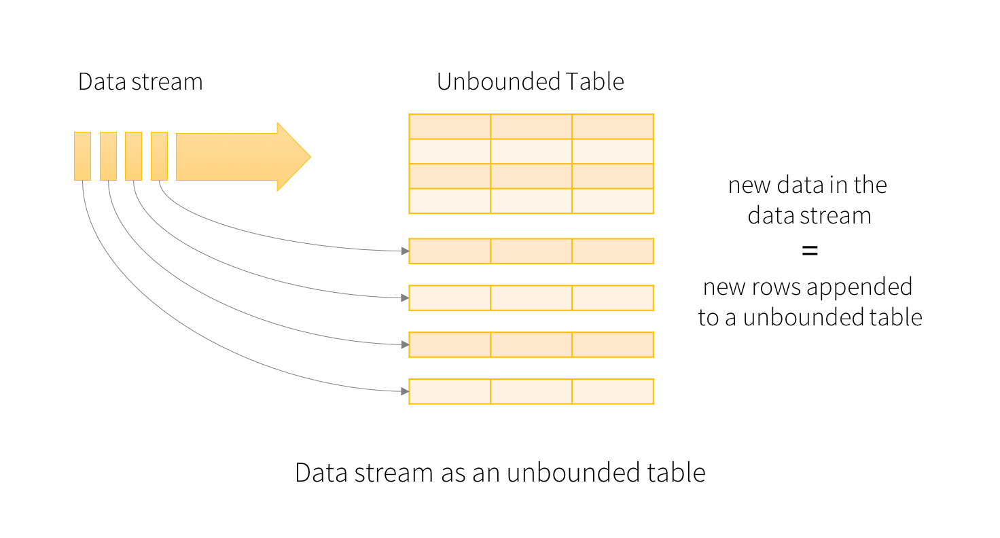
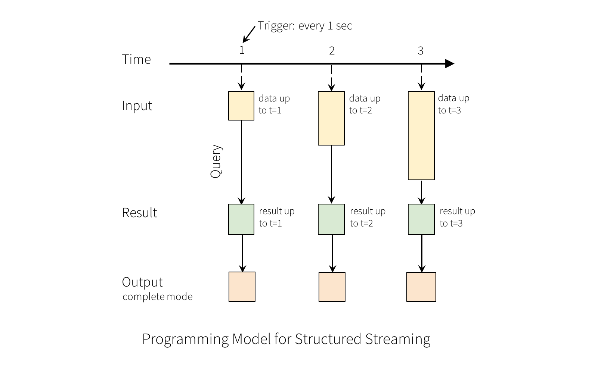
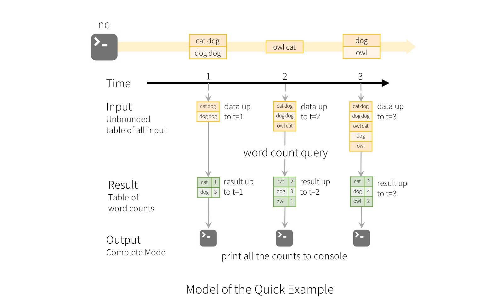
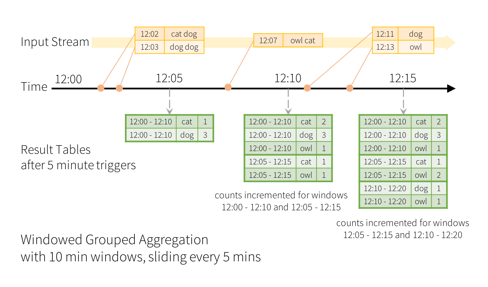
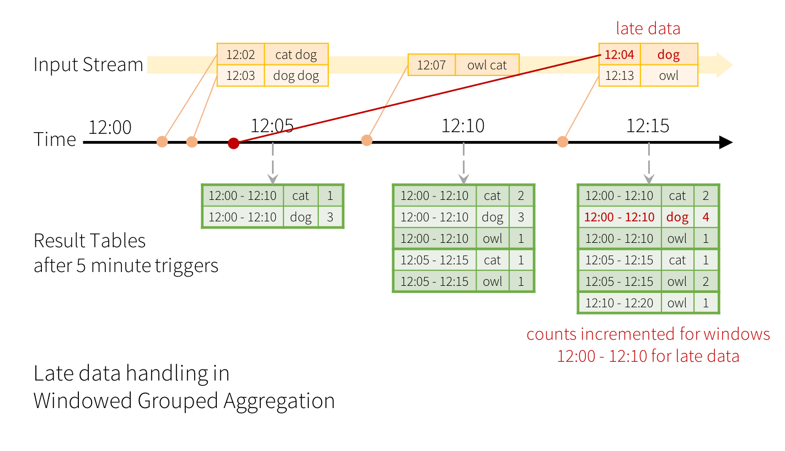
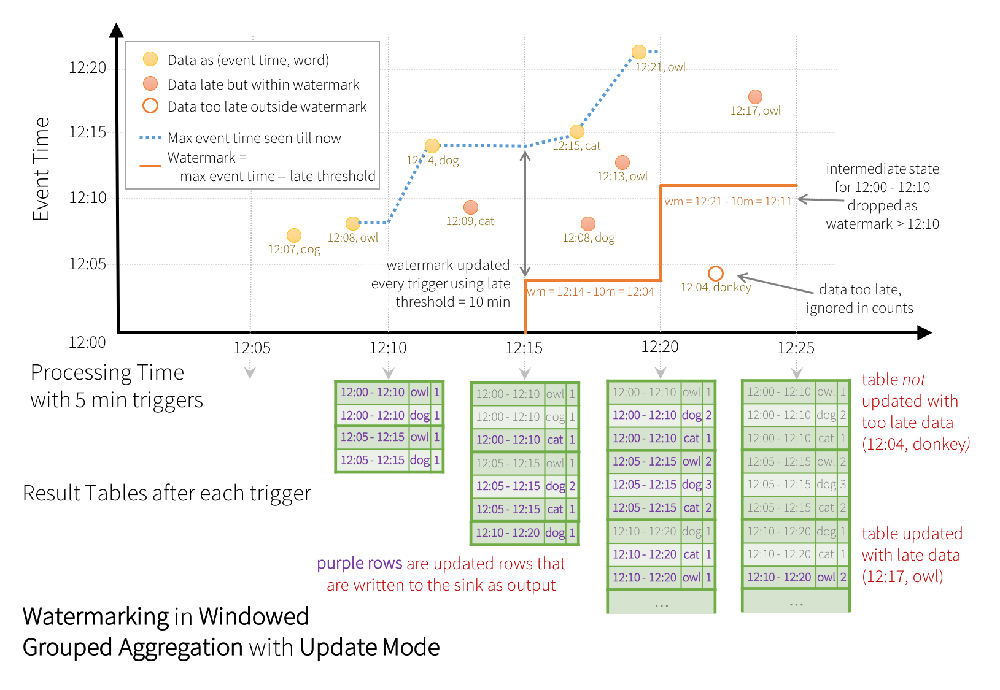
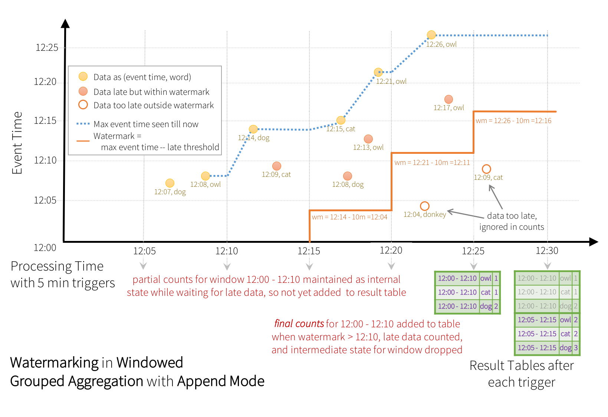
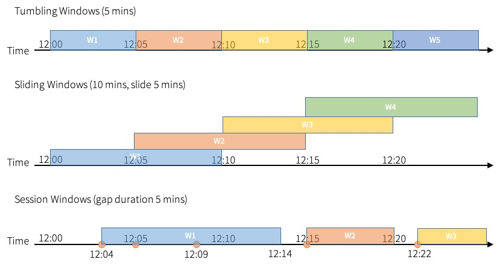

* This will become a table of contents (this text will be scraped).
{:toc}

# Overview
Structured Streaming is a scalable and fault-tolerant stream processing engine built on the Spark SQL engine. You can express your streaming computation the same way you would express a batch computation on static data. The Spark SQL engine will take care of running it incrementally and continuously and updating the final result as streaming data continues to arrive. You can use the [Dataset/DataFrame API](sql-programming-guide.html) in Scala, Java, Python or R to express streaming aggregations, event-time windows, stream-to-batch joins, etc. The computation is executed on the same optimized Spark SQL engine. Finally, the system ensures end-to-end exactly-once fault-tolerance guarantees through checkpointing and Write-Ahead Logs. In short, *Structured Streaming provides fast, scalable, fault-tolerant, end-to-end exactly-once stream processing without the user having to reason about streaming.*

Internally, by default, Structured Streaming queries are processed using a *micro-batch processing* engine, which processes data streams as a series of small batch jobs thereby achieving end-to-end latencies as low as 100 milliseconds and exactly-once fault-tolerance guarantees. However, since Spark 2.3, we have introduced a new low-latency processing mode called **Continuous Processing**, which can achieve end-to-end latencies as low as 1 millisecond with at-least-once guarantees. Without changing the Dataset/DataFrame operations in your queries, you will be able to choose the mode based on your application requirements. 

In this guide, we are going to walk you through the programming model and the APIs. We are going to explain the concepts mostly using the default micro-batch processing model, and then [later](#continuous-processing) discuss Continuous Processing model. First, let's start with a simple example of a Structured Streaming query - a streaming word count.

# Quick Example
Let’s say you want to maintain a running word count of text data received from a data server listening on a TCP socket. Let’s see how you can express this using Structured Streaming. You can see the full code in
[Scala]({{site.SPARK_GITHUB_URL}}/blob/v{{site.SPARK_VERSION_SHORT}}/examples/src/main/scala/org/apache/spark/examples/sql/streaming/StructuredNetworkWordCount.scala)/[Java]({{site.SPARK_GITHUB_URL}}/blob/v{{site.SPARK_VERSION_SHORT}}/examples/src/main/java/org/apache/spark/examples/sql/streaming/JavaStructuredNetworkWordCount.java)/[Python]({{site.SPARK_GITHUB_URL}}/blob/v{{site.SPARK_VERSION_SHORT}}/examples/src/main/python/sql/streaming/structured_network_wordcount.py)/[R]({{site.SPARK_GITHUB_URL}}/blob/v{{site.SPARK_VERSION_SHORT}}/examples/src/main/r/streaming/structured_network_wordcount.R).
And if you [download Spark](https://spark.apache.org/downloads.html), you can directly [run the example](index.html#running-the-examples-and-shell). In any case, let’s walk through the example step-by-step and understand how it works. First, we have to import the necessary classes and create a local SparkSession, the starting point of all functionalities related to Spark.


import org.apache.spark.sql.functions._
import org.apache.spark.sql.SparkSession

val spark = SparkSession
  .builder
  .appName("StructuredNetworkWordCount")
  .getOrCreate()
  
import spark.implicits._



import org.apache.spark.api.java.function.FlatMapFunction;
import org.apache.spark.sql.*;
import org.apache.spark.sql.streaming.StreamingQuery;

import java.util.Arrays;
import java.util.Iterator;

SparkSession spark = SparkSession
  .builder()
  .appName("JavaStructuredNetworkWordCount")
  .getOrCreate();



from pyspark.sql import SparkSession
from pyspark.sql.functions import explode
from pyspark.sql.functions import split

spark = SparkSession \
    .builder \
    .appName("StructuredNetworkWordCount") \
    .getOrCreate()



sparkR.session(appName = "StructuredNetworkWordCount")


Next, let’s create a streaming DataFrame that represents text data received from a server listening on localhost:9999, and transform the DataFrame to calculate word counts.


// Create DataFrame representing the stream of input lines from connection to localhost:9999
val lines = spark.readStream
  .format("socket")
  .option("host", "localhost")
  .option("port", 9999)
  .load()

// Split the lines into words
val words = lines.as[String].flatMap(_.split(" "))

// Generate running word count
val wordCounts = words.groupBy("value").count()


This `lines` DataFrame represents an unbounded table containing the streaming text data. This table contains one column of strings named "value", and each line in the streaming text data becomes a row in the table. Note, that this is not currently receiving any data as we are just setting up the transformation, and have not yet started it. Next, we have converted the DataFrame to a  Dataset of String using `.as[String]`, so that we can apply the `flatMap` operation to split each line into multiple words. The resultant `words` Dataset contains all the words. Finally, we have defined the `wordCounts` DataFrame by grouping by the unique values in the Dataset and counting them. Note that this is a streaming DataFrame which represents the running word counts of the stream.


// Create DataFrame representing the stream of input lines from connection to localhost:9999
Dataset<Row> lines = spark
  .readStream()
  .format("socket")
  .option("host", "localhost")
  .option("port", 9999)
  .load();

// Split the lines into words
Dataset<String> words = lines
  .as(Encoders.STRING())
  .flatMap((FlatMapFunction<String, String>) x -> Arrays.asList(x.split(" ")).iterator(), Encoders.STRING());

// Generate running word count
Dataset<Row> wordCounts = words.groupBy("value").count();


This `lines` DataFrame represents an unbounded table containing the streaming text data. This table contains one column of strings named "value", and each line in the streaming text data becomes a row in the table. Note, that this is not currently receiving any data as we are just setting up the transformation, and have not yet started it. Next, we have converted the DataFrame to a  Dataset of String using `.as(Encoders.STRING())`, so that we can apply the `flatMap` operation to split each line into multiple words. The resultant `words` Dataset contains all the words. Finally, we have defined the `wordCounts` DataFrame by grouping by the unique values in the Dataset and counting them. Note that this is a streaming DataFrame which represents the running word counts of the stream.


# Create DataFrame representing the stream of input lines from connection to localhost:9999
lines = spark \
    .readStream \
    .format("socket") \
    .option("host", "localhost") \
    .option("port", 9999) \
    .load()

# Split the lines into words
words = lines.select(
   explode(
       split(lines.value, " ")
   ).alias("word")
)

# Generate running word count
wordCounts = words.groupBy("word").count()


This `lines` DataFrame represents an unbounded table containing the streaming text data. This table contains one column of strings named "value", and each line in the streaming text data becomes a row in the table. Note, that this is not currently receiving any data as we are just setting up the transformation, and have not yet started it. Next, we have used two built-in SQL functions - split and explode, to split each line into multiple rows with a word each. In addition, we use the function `alias` to name the new column as "word". Finally, we have defined the `wordCounts` DataFrame by grouping by the unique values in the Dataset and counting them. Note that this is a streaming DataFrame which represents the running word counts of the stream.


# Create DataFrame representing the stream of input lines from connection to localhost:9999
lines <- read.stream("socket", host = "localhost", port = 9999)

# Split the lines into words
words <- selectExpr(lines, "explode(split(value, ' ')) as word")

# Generate running word count
wordCounts <- count(group_by(words, "word"))


This `lines` SparkDataFrame represents an unbounded table containing the streaming text data. This table contains one column of strings named "value", and each line in the streaming text data becomes a row in the table. Note, that this is not currently receiving any data as we are just setting up the transformation, and have not yet started it. Next, we have a SQL expression with two SQL functions - split and explode, to split each line into multiple rows with a word each. In addition, we name the new column as "word". Finally, we have defined the `wordCounts` SparkDataFrame by grouping by the unique values in the SparkDataFrame and counting them. Note that this is a streaming SparkDataFrame which represents the running word counts of the stream.

We have now set up the query on the streaming data. All that is left is to actually start receiving data and computing the counts. To do this, we set it up to print the complete set of counts (specified by `outputMode("complete")`) to the console every time they are updated. And then start the streaming computation using `start()`.


// Start running the query that prints the running counts to the console
val query = wordCounts.writeStream
  .outputMode("complete")
  .format("console")
  .start()

query.awaitTermination()



// Start running the query that prints the running counts to the console
StreamingQuery query = wordCounts.writeStream()
  .outputMode("complete")
  .format("console")
  .start();

query.awaitTermination();



 # Start running the query that prints the running counts to the console
query = wordCounts \
    .writeStream \
    .outputMode("complete") \
    .format("console") \
    .start()

query.awaitTermination()



# Start running the query that prints the running counts to the console
query <- write.stream(wordCounts, "console", outputMode = "complete")

awaitTermination(query)


After this code is executed, the streaming computation will have started in the background. The `query` object is a handle to that active streaming query, and we have decided to wait for the termination of the query using `awaitTermination()` to prevent the process from exiting while the query is active.

To actually execute this example code, you can either compile the code in your own 
[Spark application](quick-start.html#self-contained-applications), or simply 
[run the example](index.html#running-the-examples-and-shell) once you have downloaded Spark. We are showing the latter. You will first need to run Netcat (a small utility found in most Unix-like systems) as a data server by using

    $ nc -lk 9999

Then, in a different terminal, you can start the example by using


$ ./bin/run-example org.apache.spark.examples.sql.streaming.StructuredNetworkWordCount localhost 9999



$ ./bin/run-example org.apache.spark.examples.sql.streaming.JavaStructuredNetworkWordCount localhost 9999



$ ./bin/spark-submit examples/src/main/python/sql/streaming/structured_network_wordcount.py localhost 9999



$ ./bin/spark-submit examples/src/main/r/streaming/structured_network_wordcount.R localhost 9999


Then, any lines typed in the terminal running the netcat server will be counted and printed on screen every second. It will look something like the following.

<table width="100%">
    <td>

# TERMINAL 1:
# Running Netcat

$ nc -lk 9999
apache spark
apache hadoop

...

    </td>
    <td width="2%"></td>
    <td>


# TERMINAL 2: RUNNING StructuredNetworkWordCount

$ ./bin/run-example org.apache.spark.examples.sql.streaming.StructuredNetworkWordCount localhost 9999

-------------------------------------------
Batch: 0
-------------------------------------------
+------+-----+
| value|count|
+------+-----+
|apache|    1|
| spark|    1|
+------+-----+

-------------------------------------------
Batch: 1
-------------------------------------------
+------+-----+
| value|count|
+------+-----+
|apache|    2|
| spark|    1|
|hadoop|    1|
+------+-----+
...



# TERMINAL 2: RUNNING JavaStructuredNetworkWordCount

$ ./bin/run-example org.apache.spark.examples.sql.streaming.JavaStructuredNetworkWordCount localhost 9999

-------------------------------------------
Batch: 0
-------------------------------------------
+------+-----+
| value|count|
+------+-----+
|apache|    1|
| spark|    1|
+------+-----+

-------------------------------------------
Batch: 1
-------------------------------------------
+------+-----+
| value|count|
+------+-----+
|apache|    2|
| spark|    1|
|hadoop|    1|
+------+-----+
...



# TERMINAL 2: RUNNING structured_network_wordcount.py

$ ./bin/spark-submit examples/src/main/python/sql/streaming/structured_network_wordcount.py localhost 9999

-------------------------------------------
Batch: 0
-------------------------------------------
+------+-----+
| value|count|
+------+-----+
|apache|    1|
| spark|    1|
+------+-----+

-------------------------------------------
Batch: 1
-------------------------------------------
+------+-----+
| value|count|
+------+-----+
|apache|    2|
| spark|    1|
|hadoop|    1|
+------+-----+
...



# TERMINAL 2: RUNNING structured_network_wordcount.R

$ ./bin/spark-submit examples/src/main/r/streaming/structured_network_wordcount.R localhost 9999

-------------------------------------------
Batch: 0
-------------------------------------------
+------+-----+
| value|count|
+------+-----+
|apache|    1|
| spark|    1|
+------+-----+

-------------------------------------------
Batch: 1
-------------------------------------------
+------+-----+
| value|count|
+------+-----+
|apache|    2|
| spark|    1|
|hadoop|    1|
+------+-----+
...


    </td>
</table>

# Programming Model

The key idea in Structured Streaming is to treat a live data stream as a 
table that is being continuously appended. This leads to a new stream 
processing model that is very similar to a batch processing model. You will 
express your streaming computation as standard batch-like query as on a static 
table, and Spark runs it as an *incremental* query on the *unbounded* input 
table. Let’s understand this model in more detail.

## Basic Concepts
Consider the input data stream as the "Input Table". Every data item that is 
arriving on the stream is like a new row being appended to the Input Table.

A query on the input will generate the "Result Table". Every trigger interval (say, every 1 second), new rows get appended to the Input Table, which eventually updates the Result Table. Whenever the result table gets updated, we would want to write the changed result rows to an external sink. 

The "Output" is defined as what gets written out to the external storage. The output can be defined in a different mode:

  - *Complete Mode* - The entire updated Result Table will be written to the external storage. It is up to the storage connector to decide how to handle writing of the entire table. 

  - *Append Mode* - Only the new rows appended in the Result Table since the last trigger will be written to the external storage. This is applicable only on the queries where existing rows in the Result Table are not expected to change.
  
  - *Update Mode* - Only the rows that were updated in the Result Table since the last trigger will be written to the external storage (available since Spark 2.1.1). Note that this is different from the Complete Mode in that this mode only outputs the rows that have changed since the last trigger. If the query doesn't contain aggregations, it will be equivalent to Append mode.

Note that each mode is applicable on certain types of queries. This is discussed in detail [later](#output-modes).

To illustrate the use of this model, let’s understand the model in context of 
the [Quick Example](#quick-example) above. The first `lines` DataFrame is the input table, and 
the final `wordCounts` DataFrame is the result table. Note that the query on 
streaming `lines` DataFrame to generate `wordCounts` is *exactly the same* as 
it would be a static DataFrame. However, when this query is started, Spark 
will continuously check for new data from the socket connection. If there is 
new data, Spark will run an "incremental" query that combines the previous 
running counts with the new data to compute updated counts, as shown below.

**Note that Structured Streaming does not materialize the entire table**. It reads the latest
available data from the streaming data source, processes it incrementally to update the result,
and then discards the source data. It only keeps around the minimal intermediate *state* data as
required to update the result (e.g. intermediate counts in the earlier example).

This model is significantly different from many other stream processing
engines. Many streaming systems require the user to maintain running 
aggregations themselves, thus having to reason about fault-tolerance, and 
data consistency (at-least-once, or at-most-once, or exactly-once). In this 
model, Spark is responsible for updating the Result Table when there is new 
data, thus relieving the users from reasoning about it. As an example, let’s 
see how this model handles event-time based processing and late arriving data.

## Handling Event-time and Late Data
Event-time is the time embedded in the data itself. For many applications, you may want to operate on this event-time. For example, if you want to get the number of events generated by IoT devices every minute, then you probably want to use the time when the data was generated (that is, event-time in the data), rather than the time Spark receives them. This event-time is very naturally expressed in this model -- each event from the devices is a row in the table, and event-time is a column value in the row. This allows window-based aggregations (e.g. number of events every minute) to be just a special type of grouping and aggregation on the event-time column -- each time window is a group and each row can belong to multiple windows/groups. Therefore, such event-time-window-based aggregation queries can be defined consistently on both a static dataset (e.g. from collected device events logs) as well as on a data stream, making the life of the user much easier.

Furthermore, this model naturally handles data that has arrived later than 
expected based on its event-time. Since Spark is updating the Result Table, 
it has full control over updating old aggregates when there is late data, 
as well as cleaning up old aggregates to limit the size of intermediate
state data. Since Spark 2.1, we have support for watermarking which 
allows the user to specify the threshold of late data, and allows the engine
to accordingly clean up old state. These are explained later in more 
detail in the [Window Operations](#window-operations-on-event-time) section.

## Fault Tolerance Semantics
Delivering end-to-end exactly-once semantics was one of key goals behind the design of Structured Streaming. To achieve that, we have designed the Structured Streaming sources, the sinks and the execution engine to reliably track the exact progress of the processing so that it can handle any kind of failure by restarting and/or reprocessing. Every streaming source is assumed to have offsets (similar to Kafka offsets, or Kinesis sequence numbers)
to track the read position in the stream. The engine uses checkpointing and write-ahead logs to record the offset range of the data being processed in each trigger. The streaming sinks are designed to be idempotent for handling reprocessing. Together, using replayable sources and idempotent sinks, Structured Streaming can ensure **end-to-end exactly-once semantics** under any failure.

# API using Datasets and DataFrames
Since Spark 2.0, DataFrames and Datasets can represent static, bounded data, as well as streaming, unbounded data. Similar to static Datasets/DataFrames, you can use the common entry point `SparkSession`
([Scala](api/scala/org/apache/spark/sql/SparkSession.html)/[Java](api/java/org/apache/spark/sql/SparkSession.html)/[Python](api/python/reference/pyspark.sql/api/pyspark.sql.SparkSession.html#pyspark.sql.SparkSession)/[R](api/R/sparkR.session.html) docs)
to create streaming DataFrames/Datasets from streaming sources, and apply the same operations on them as static DataFrames/Datasets. If you are not familiar with Datasets/DataFrames, you are strongly advised to familiarize yourself with them using the
[DataFrame/Dataset Programming Guide](sql-programming-guide.html).

## Creating streaming DataFrames and streaming Datasets
Streaming DataFrames can be created through the `DataStreamReader` interface
([Scala](api/scala/org/apache/spark/sql/streaming/DataStreamReader.html)/[Java](api/java/org/apache/spark/sql/streaming/DataStreamReader.html)/[Python](api/python/reference/pyspark.ss/api/pyspark.sql.streaming.DataStreamReader.html#pyspark.sql.streaming.DataStreamReader) docs)
returned by `SparkSession.readStream()`. In [R](api/R/read.stream.html), with the `read.stream()` method. Similar to the read interface for creating static DataFrame, you can specify the details of the source – data format, schema, options, etc.

#### Input Sources
There are a few built-in sources.

  - **File source** - Reads files written in a directory as a stream of data. Files will be processed in the order of file modification time. If `latestFirst` is set, order will be reversed. Supported file formats are text, CSV, JSON, ORC, Parquet. See the docs of the DataStreamReader interface for a more up-to-date list, and supported options for each file format. Note that the files must be atomically placed in the given directory, which in most file systems, can be achieved by file move operations.
  - **Kafka source** - Reads data from Kafka. It's compatible with Kafka broker versions 0.10.0 or higher. See the [Kafka Integration Guide](structured-streaming-kafka-integration.html) for more details.

  - **Socket source (for testing)** - Reads UTF8 text data from a socket connection. The listening server socket is at the driver. Note that this should be used only for testing as this does not provide end-to-end fault-tolerance guarantees. 

  - **Rate source (for testing)** - Generates data at the specified number of rows per second, each output row contains a `timestamp` and `value`. Where `timestamp` is a `Timestamp` type containing the time of message dispatch, and `value` is of `Long` type containing the message count, starting from 0 as the first row. This source is intended for testing and benchmarking.

  - **Rate Per Micro-Batch source (for testing)** - Generates data at the specified number of rows per micro-batch, each output row contains a `timestamp` and `value`. Where `timestamp` is a `Timestamp` type containing the time of message dispatch, and `value` is of `Long` type containing the message count, starting from 0 as the first row. Unlike `rate` data source, this data source provides a consistent set of input rows per micro-batch regardless of query execution (configuration of trigger, query being lagging, etc.), say, batch 0 will produce 0~999 and batch 1 will produce 1000~1999, and so on. Same applies to the generated time. This source is intended for testing and benchmarking.

Some sources are not fault-tolerant because they do not guarantee that data can be replayed using 
checkpointed offsets after a failure. See the earlier section on 
[fault-tolerance semantics](#fault-tolerance-semantics).
Here are the details of all the sources in Spark.

<table class="table">
  <tr>
    <th>Source</th>
    <th>Options</th>
    <th>Fault-tolerant</th>
    <th>Notes</th>
  </tr>
  <tr>
    <td><b>File source</b></td>
    <td>
        <code>path</code>: path to the input directory, and common to all file formats.
         
        <code>maxFilesPerTrigger</code>: maximum number of new files to be considered in every trigger (default: no max)
         
        <code>latestFirst</code>: whether to process the latest new files first, useful when there is a large backlog of files (default: false)
         
        <code>fileNameOnly</code>: whether to check new files based on only the filename instead of on the full path (default: false). With this set to `true`, the following files would be considered as the same file, because their filenames, "dataset.txt", are the same:
         
        "file:///dataset.txt" 
        "s3://a/dataset.txt" 
        "s3n://a/b/dataset.txt" 
        "s3a://a/b/c/dataset.txt"
         
        <code>maxFileAge</code>: Maximum age of a file that can be found in this directory, before it is ignored. For the first batch all files will be considered valid. If <code>latestFirst</code> is set to `true` and <code>maxFilesPerTrigger</code> is set, then this parameter will be ignored, because old files that are valid, and should be processed, may be ignored. The max age is specified with respect to the timestamp of the latest file, and not the timestamp of the current system.(default: 1 week)
         
        <code>cleanSource</code>: option to clean up completed files after processing. 
        Available options are "archive", "delete", "off". If the option is not provided, the default value is "off". 
        When "archive" is provided, additional option <code>sourceArchiveDir</code> must be provided as well. The value of "sourceArchiveDir" must not match with source pattern in depth (the number of directories from the root directory), where the depth is minimum of depth on both paths. This will ensure archived files are never included as new source files. 
        For example, suppose you provide '/hello?/spark/*' as source pattern, '/hello1/spark/archive/dir' cannot be used as the value of "sourceArchiveDir", as '/hello?/spark/*' and '/hello1/spark/archive' will be matched. '/hello1/spark' cannot be also used as the value of "sourceArchiveDir", as '/hello?/spark' and '/hello1/spark' will be matched. '/archived/here' would be OK as it doesn't match. 
        Spark will move source files respecting their own path. For example, if the path of source file is <code>/a/b/dataset.txt</code> and the path of archive directory is <code>/archived/here</code>, file will be moved to <code>/archived/here/a/b/dataset.txt</code>. 
        NOTE: Both archiving (via moving) or deleting completed files will introduce overhead (slow down, even if it's happening in separate thread) in each micro-batch, so you need to understand the cost for each operation in your file system before enabling this option. On the other hand, enabling this option will reduce the cost to list source files which can be an expensive operation. 
        Number of threads used in completed file cleaner can be configured with <code>spark.sql.streaming.fileSource.cleaner.numThreads</code> (default: 1). 
        NOTE 2: The source path should not be used from multiple sources or queries when enabling this option. Similarly, you must ensure the source path doesn't match to any files in output directory of file stream sink. 
        NOTE 3: Both delete and move actions are best effort. Failing to delete or move files will not fail the streaming query. Spark may not clean up some source files in some circumstances - e.g. the application doesn't shut down gracefully, too many files are queued to clean up.
          
        For file-format-specific options, see the related methods in <code>DataStreamReader</code>
        (<a href="api/scala/org/apache/spark/sql/streaming/DataStreamReader.html">Scala</a>/<a href="api/java/org/apache/spark/sql/streaming/DataStreamReader.html">Java</a>/<a href="api/python/reference/pyspark.sql/api/pyspark.sql.streaming.DataStreamReader.html#pyspark.sql.streaming.DataStreamReader">Python</a>/<a
        href="api/R/read.stream.html">R</a>).
        E.g. for "parquet" format options see <code>DataStreamReader.parquet()</code>.
          
        In addition, there are session configurations that affect certain file-formats. See the <a href="sql-programming-guide.html">SQL Programming Guide</a> for more details. E.g., for "parquet", see <a href="sql-data-sources-parquet.html#configuration">Parquet configuration</a> section.
        </td>
    <td>Yes</td>
    <td>Supports glob paths, but does not support multiple comma-separated paths/globs.</td>
  </tr>
  <tr>
    <td><b>Socket Source</b></td>
    <td>
        <code>host</code>: host to connect to, must be specified 
        <code>port</code>: port to connect to, must be specified
    </td>
    <td>No</td>
    <td></td>
  </tr>
  <tr>
    <td><b>Rate Source</b></td>
    <td>
        <code>rowsPerSecond</code> (e.g. 100, default: 1): How many rows should be generated per second.  
        <code>rampUpTime</code> (e.g. 5s, default: 0s): How long to ramp up before the generating speed becomes <code>rowsPerSecond</code>. Using finer granularities than seconds will be truncated to integer seconds.   
        <code>numPartitions</code> (e.g. 10, default: Spark's default parallelism): The partition number for the generated rows.   
        
        The source will try its best to reach <code>rowsPerSecond</code>, but the query may be resource constrained, and <code>numPartitions</code> can be tweaked to help reach the desired speed.
    </td>
    <td>Yes</td>
    <td></td>
  </tr>
  <tr>
    <td><b>Rate Per Micro-Batch Source</b> (format: <b>rate-micro-batch</b>)</td>
    <td>
        <code>rowsPerBatch</code> (e.g. 100): How many rows should be generated per micro-batch.  
        <code>numPartitions</code> (e.g. 10, default: Spark's default parallelism): The partition number for the generated rows.   
        <code>startTimestamp</code> (e.g. 1000, default: 0): starting value of generated time.   
        <code>advanceMillisPerBatch</code> (e.g. 1000, default: 1000): the amount of time being advanced in generated time on each micro-batch.   
    </td>
    <td>Yes</td>
    <td></td>
  </tr>

  <tr>
    <td><b>Kafka Source</b></td>
    <td>
        See the <a href="structured-streaming-kafka-integration.html">Kafka Integration Guide</a>.
    </td>
    <td>Yes</td>
    <td></td>
  </tr>
  <tr>
    <td></td>
    <td></td>
    <td></td>
    <td></td>
  </tr>
</table>

Here are some examples.


val spark: SparkSession = ...

// Read text from socket
val socketDF = spark
  .readStream
  .format("socket")
  .option("host", "localhost")
  .option("port", 9999)
  .load()

socketDF.isStreaming    // Returns True for DataFrames that have streaming sources

socketDF.printSchema

// Read all the csv files written atomically in a directory
val userSchema = new StructType().add("name", "string").add("age", "integer")
val csvDF = spark
  .readStream
  .option("sep", ";")
  .schema(userSchema)      // Specify schema of the csv files
  .csv("/path/to/directory")    // Equivalent to format("csv").load("/path/to/directory")



SparkSession spark = ...

// Read text from socket
Dataset<Row> socketDF = spark
  .readStream()
  .format("socket")
  .option("host", "localhost")
  .option("port", 9999)
  .load();

socketDF.isStreaming();    // Returns True for DataFrames that have streaming sources

socketDF.printSchema();

// Read all the csv files written atomically in a directory
StructType userSchema = new StructType().add("name", "string").add("age", "integer");
Dataset<Row> csvDF = spark
  .readStream()
  .option("sep", ";")
  .schema(userSchema)      // Specify schema of the csv files
  .csv("/path/to/directory");    // Equivalent to format("csv").load("/path/to/directory")



spark = SparkSession. ...

# Read text from socket
socketDF = spark \
    .readStream \
    .format("socket") \
    .option("host", "localhost") \
    .option("port", 9999) \
    .load()

socketDF.isStreaming()    # Returns True for DataFrames that have streaming sources

socketDF.printSchema()

# Read all the csv files written atomically in a directory
userSchema = StructType().add("name", "string").add("age", "integer")
csvDF = spark \
    .readStream \
    .option("sep", ";") \
    .schema(userSchema) \
    .csv("/path/to/directory")  # Equivalent to format("csv").load("/path/to/directory")



sparkR.session(...)

# Read text from socket
socketDF <- read.stream("socket", host = hostname, port = port)

isStreaming(socketDF)    # Returns TRUE for SparkDataFrames that have streaming sources

printSchema(socketDF)

# Read all the csv files written atomically in a directory
schema <- structType(structField("name", "string"),
                     structField("age", "integer"))
csvDF <- read.stream("csv", path = "/path/to/directory", schema = schema, sep = ";")


These examples generate streaming DataFrames that are untyped, meaning that the schema of the DataFrame is not checked at compile time, only checked at runtime when the query is submitted. Some operations like `map`, `flatMap`, etc. need the type to be known at compile time. To do those, you can convert these untyped streaming DataFrames to typed streaming Datasets using the same methods as static DataFrame. See the [SQL Programming Guide](sql-programming-guide.html) for more details. Additionally, more details on the supported streaming sources are discussed later in the document.

Since Spark 3.1, you can also create streaming DataFrames from tables with `DataStreamReader.table()`. See [Streaming Table APIs](#streaming-table-apis) for more details.

### Schema inference and partition of streaming DataFrames/Datasets

By default, Structured Streaming from file based sources requires you to specify the schema, rather than rely on Spark to infer it automatically. This restriction ensures a consistent schema will be used for the streaming query, even in the case of failures. For ad-hoc use cases, you can reenable schema inference by setting `spark.sql.streaming.schemaInference` to `true`.

Partition discovery does occur when subdirectories that are named `/key=value/` are present and listing will automatically recurse into these directories. If these columns appear in the user-provided schema, they will be filled in by Spark based on the path of the file being read. The directories that make up the partitioning scheme must be present when the query starts and must remain static. For example, it is okay to add `/data/year=2016/` when `/data/year=2015/` was present, but it is invalid to change the partitioning column (i.e. by creating the directory `/data/date=2016-04-17/`).

## Operations on streaming DataFrames/Datasets
You can apply all kinds of operations on streaming DataFrames/Datasets – ranging from untyped, SQL-like operations (e.g. `select`, `where`, `groupBy`), to typed RDD-like operations (e.g. `map`, `filter`, `flatMap`). See the [SQL programming guide](sql-programming-guide.html) for more details. Let’s take a look at a few example operations that you can use.

### Basic Operations - Selection, Projection, Aggregation
Most of the common operations on DataFrame/Dataset are supported for streaming. The few operations that are not supported are [discussed later](#unsupported-operations) in this section.


case class DeviceData(device: String, deviceType: String, signal: Double, time: DateTime)

val df: DataFrame = ... // streaming DataFrame with IOT device data with schema { device: string, deviceType: string, signal: double, time: string }
val ds: Dataset[DeviceData] = df.as[DeviceData]    // streaming Dataset with IOT device data

// Select the devices which have signal more than 10
df.select("device").where("signal > 10")      // using untyped APIs   
ds.filter(_.signal > 10).map(_.device)         // using typed APIs

// Running count of the number of updates for each device type
df.groupBy("deviceType").count()                          // using untyped API

// Running average signal for each device type
import org.apache.spark.sql.expressions.scalalang.typed
ds.groupByKey(_.deviceType).agg(typed.avg(_.signal))    // using typed API



import org.apache.spark.api.java.function.*;
import org.apache.spark.sql.*;
import org.apache.spark.sql.expressions.javalang.typed;
import org.apache.spark.sql.catalyst.encoders.ExpressionEncoder;

public class DeviceData {
  private String device;
  private String deviceType;
  private Double signal;
  private java.sql.Date time;
  ...
  // Getter and setter methods for each field
}

Dataset<Row> df = ...;    // streaming DataFrame with IOT device data with schema { device: string, type: string, signal: double, time: DateType }
Dataset<DeviceData> ds = df.as(ExpressionEncoder.javaBean(DeviceData.class)); // streaming Dataset with IOT device data

// Select the devices which have signal more than 10
df.select("device").where("signal > 10"); // using untyped APIs
ds.filter((FilterFunction<DeviceData>) value -> value.getSignal() > 10)
  .map((MapFunction<DeviceData, String>) value -> value.getDevice(), Encoders.STRING());

// Running count of the number of updates for each device type
df.groupBy("deviceType").count(); // using untyped API

// Running average signal for each device type
ds.groupByKey((MapFunction<DeviceData, String>) value -> value.getDeviceType(), Encoders.STRING())
  .agg(typed.avg((MapFunction<DeviceData, Double>) value -> value.getSignal()));



df = ...  # streaming DataFrame with IOT device data with schema { device: string, deviceType: string, signal: double, time: DateType }

# Select the devices which have signal more than 10
df.select("device").where("signal > 10")

# Running count of the number of updates for each device type
df.groupBy("deviceType").count()



df <- ...  # streaming DataFrame with IOT device data with schema { device: string, deviceType: string, signal: double, time: DateType }

# Select the devices which have signal more than 10
select(where(df, "signal > 10"), "device")

# Running count of the number of updates for each device type
count(groupBy(df, "deviceType"))


You can also register a streaming DataFrame/Dataset as a temporary view and then apply SQL commands on it.


df.createOrReplaceTempView("updates")
spark.sql("select count(*) from updates")  // returns another streaming DF


  

df.createOrReplaceTempView("updates");
spark.sql("select count(*) from updates");  // returns another streaming DF


  

df.createOrReplaceTempView("updates")
spark.sql("select count(*) from updates")  # returns another streaming DF



createOrReplaceTempView(df, "updates")
sql("select count(*) from updates")


Note, you can identify whether a DataFrame/Dataset has streaming data or not by using `df.isStreaming`.


df.isStreaming



df.isStreaming()



df.isStreaming()



isStreaming(df)


You may want to check the query plan of the query, as Spark could inject stateful operations during interpret of SQL statement against streaming dataset. Once stateful operations are injected in the query plan, you may need to check your query with considerations in stateful operations. (e.g. output mode, watermark, state store size maintenance, etc.)

### Window Operations on Event Time
Aggregations over a sliding event-time window are straightforward with Structured Streaming and are very similar to grouped aggregations. In a grouped aggregation, aggregate values (e.g. counts) are maintained for each unique value in the user-specified grouping column. In case of window-based aggregations, aggregate values are maintained for each window the event-time of a row falls into. Let's understand this with an illustration. 

Imagine our [quick example](#quick-example) is modified and the stream now contains lines along with the time when the line was generated. Instead of running word counts, we want to count words within 10 minute windows, updating every 5 minutes. That is, word counts in words received between 10 minute windows 12:00 - 12:10, 12:05 - 12:15, 12:10 - 12:20, etc. Note that 12:00 - 12:10 means data that arrived after 12:00 but before 12:10. Now, consider a word that was received at 12:07. This word should increment the counts corresponding to two windows 12:00 - 12:10 and 12:05 - 12:15. So the counts will be indexed by both, the grouping key (i.e. the word) and the window (can be calculated from the event-time).

The result tables would look something like the following.

Since this windowing is similar to grouping, in code, you can use `groupBy()` and `window()` operations to express windowed aggregations. You can see the full code for the below examples in
[Scala]({{site.SPARK_GITHUB_URL}}/blob/v{{site.SPARK_VERSION_SHORT}}/examples/src/main/scala/org/apache/spark/examples/sql/streaming/StructuredNetworkWordCountWindowed.scala)/[Java]({{site.SPARK_GITHUB_URL}}/blob/v{{site.SPARK_VERSION_SHORT}}/examples/src/main/java/org/apache/spark/examples/sql/streaming/JavaStructuredNetworkWordCountWindowed.java)/[Python]({{site.SPARK_GITHUB_URL}}/blob/v{{site.SPARK_VERSION_SHORT}}/examples/src/main/python/sql/streaming/structured_network_wordcount_windowed.py).


import spark.implicits._

val words = ... // streaming DataFrame of schema { timestamp: Timestamp, word: String }

// Group the data by window and word and compute the count of each group
val windowedCounts = words.groupBy(
  window($"timestamp", "10 minutes", "5 minutes"),
  $"word"
).count()



Dataset<Row> words = ... // streaming DataFrame of schema { timestamp: Timestamp, word: String }

// Group the data by window and word and compute the count of each group
Dataset<Row> windowedCounts = words.groupBy(
  functions.window(words.col("timestamp"), "10 minutes", "5 minutes"),
  words.col("word")
).count();



words = ...  # streaming DataFrame of schema { timestamp: Timestamp, word: String }

# Group the data by window and word and compute the count of each group
windowedCounts = words.groupBy(
    window(words.timestamp, "10 minutes", "5 minutes"),
    words.word
).count()



words <- ...  # streaming DataFrame of schema { timestamp: Timestamp, word: String }

# Group the data by window and word and compute the count of each group
windowedCounts <- count(
                    groupBy(
                      words,
                      window(words$timestamp, "10 minutes", "5 minutes"),
                      words$word))


#### Handling Late Data and Watermarking
Now consider what happens if one of the events arrives late to the application.
For example, say, a word generated at 12:04 (i.e. event time) could be received by 
the application at 12:11. The application should use the time 12:04 instead of 12:11
to update the older counts for the window `12:00 - 12:10`. This occurs 
naturally in our window-based grouping – Structured Streaming can maintain the intermediate state 
for partial aggregates for a long period of time such that late data can update aggregates of 
old windows correctly, as illustrated below.

However, to run this query for days, it's necessary for the system to bound the amount of 
intermediate in-memory state it accumulates. This means the system needs to know when an old 
aggregate can be dropped from the in-memory state because the application is not going to receive 
late data for that aggregate any more. To enable this, in Spark 2.1, we have introduced 
**watermarking**, which lets the engine automatically track the current event time in the data
and attempt to clean up old state accordingly. You can define the watermark of a query by 
specifying the event time column and the threshold on how late the data is expected to be in terms of 
event time. For a specific window ending at time `T`, the engine will maintain state and allow late
data to update the state until `(max event time seen by the engine - late threshold > T)`. 
In other words, late data within the threshold will be aggregated, 
but data later than the threshold will start getting dropped
(see [later](#semantic-guarantees-of-aggregation-with-watermarking)
in the section for the exact guarantees). Let's understand this with an example. We can
easily define watermarking on the previous example using `withWatermark()` as shown below.


import spark.implicits._

val words = ... // streaming DataFrame of schema { timestamp: Timestamp, word: String }

// Group the data by window and word and compute the count of each group
val windowedCounts = words
    .withWatermark("timestamp", "10 minutes")
    .groupBy(
        window($"timestamp", "10 minutes", "5 minutes"),
        $"word")
    .count()



Dataset<Row> words = ... // streaming DataFrame of schema { timestamp: Timestamp, word: String }

// Group the data by window and word and compute the count of each group
Dataset<Row> windowedCounts = words
    .withWatermark("timestamp", "10 minutes")
    .groupBy(
        window(col("timestamp"), "10 minutes", "5 minutes"),
        col("word"))
    .count();



words = ...  # streaming DataFrame of schema { timestamp: Timestamp, word: String }

# Group the data by window and word and compute the count of each group
windowedCounts = words \
    .withWatermark("timestamp", "10 minutes") \
    .groupBy(
        window(words.timestamp, "10 minutes", "5 minutes"),
        words.word) \
    .count()



words <- ...  # streaming DataFrame of schema { timestamp: Timestamp, word: String }

# Group the data by window and word and compute the count of each group

words <- withWatermark(words, "timestamp", "10 minutes")
windowedCounts <- count(
                    groupBy(
                      words,
                      window(words$timestamp, "10 minutes", "5 minutes"),
                      words$word))


In this example, we are defining the watermark of the query on the value of the column "timestamp", 
and also defining "10 minutes" as the threshold of how late is the data allowed to be. If this query 
is run in Update output mode (discussed later in [Output Modes](#output-modes) section), 
the engine will keep updating counts of a window in the Result Table until the window is older
than the watermark, which lags behind the current event time in column "timestamp" by 10 minutes.
Here is an illustration. 

As shown in the illustration, the maximum event time tracked by the engine is the 
*blue dashed line*, and the watermark set as `(max event time - '10 mins')`
at the beginning of every trigger is the red line. For example, when the engine observes the data 
`(12:14, dog)`, it sets the watermark for the next trigger as `12:04`.
This watermark lets the engine maintain intermediate state for additional 10 minutes to allow late
data to be counted. For example, the data `(12:09, cat)` is out of order and late, and it falls in
windows `12:00 - 12:10` and `12:05 - 12:15`. Since, it is still ahead of the watermark `12:04` in 
the trigger, the engine still maintains the intermediate counts as state and correctly updates the 
counts of the related windows. However, when the watermark is updated to `12:11`, the intermediate 
state for window `(12:00 - 12:10)` is cleared, and all subsequent data (e.g. `(12:04, donkey)`) 
is considered "too late" and therefore ignored. Note that after every trigger, 
the updated counts (i.e. purple rows) are written to sink as the trigger output, as dictated by 
the Update mode.

Some sinks (e.g. files) may not supported fine-grained updates that Update Mode requires. To work
with them, we have also support Append Mode, where only the *final counts* are written to sink.
This is illustrated below.

Note that using `withWatermark` on a non-streaming Dataset is no-op. As the watermark should not affect 
any batch query in any way, we will ignore it directly.

Similar to the Update Mode earlier, the engine maintains intermediate counts for each window. 
However, the partial counts are not updated to the Result Table and not written to sink. The engine
waits for "10 mins" for late date to be counted, 
then drops intermediate state of a window < watermark, and appends the final
counts to the Result Table/sink. For example, the final counts of window `12:00 - 12:10` is 
appended to the Result Table only after the watermark is updated to `12:11`. 

#### Types of time windows

Spark supports three types of time windows: tumbling (fixed), sliding and session.

Tumbling windows are a series of fixed-sized, non-overlapping and contiguous time intervals. An input
can only be bound to a single window.

Sliding windows are similar to the tumbling windows from the point of being "fixed-sized", but windows
can overlap if the duration of slide is smaller than the duration of window, and in this case an input
can be bound to the multiple windows.

Tumbling and sliding window use `window` function, which has been described on above examples.

Session windows have different characteristic compared to the previous two types. Session window has a dynamic size
of the window length, depending on the inputs. A session window starts with an input, and expands itself
if following input has been received within gap duration. For static gap duration, a session window closes when
there's no input received within gap duration after receiving the latest input.

Session window uses `session_window` function. The usage of the function is similar to the `window` function.


import spark.implicits._

val events = ... // streaming DataFrame of schema { timestamp: Timestamp, userId: String }

// Group the data by session window and userId, and compute the count of each group
val sessionizedCounts = events
    .withWatermark("timestamp", "10 minutes")
    .groupBy(
        session_window($"timestamp", "5 minutes"),
        $"userId")
    .count()



Dataset<Row> events = ... // streaming DataFrame of schema { timestamp: Timestamp, userId: String }

// Group the data by session window and userId, and compute the count of each group
Dataset<Row> sessionizedCounts = events
    .withWatermark("timestamp", "10 minutes")
    .groupBy(
        session_window(col("timestamp"), "5 minutes"),
        col("userId"))
    .count();



events = ...  # streaming DataFrame of schema { timestamp: Timestamp, userId: String }

# Group the data by session window and userId, and compute the count of each group
sessionizedCounts = events \
    .withWatermark("timestamp", "10 minutes") \
    .groupBy(
        session_window(events.timestamp, "5 minutes"),
        events.userId) \
    .count()


Instead of static value, we can also provide an expression to specify gap duration dynamically
based on the input row. Note that the rows with negative or zero gap duration will be filtered
out from the aggregation.

With dynamic gap duration, the closing of a session window does not depend on the latest input
anymore. A session window's range is the union of all events' ranges which are determined by
event start time and evaluated gap duration during the query execution.


import spark.implicits._

val events = ... // streaming DataFrame of schema { timestamp: Timestamp, userId: String }

val sessionWindow = session_window($"timestamp", when($"userId" === "user1", "5 seconds")
  .when($"userId" === "user2", "20 seconds")
  .otherwise("5 minutes"))

// Group the data by session window and userId, and compute the count of each group
val sessionizedCounts = events
    .withWatermark("timestamp", "10 minutes")
    .groupBy(
        Column(sessionWindow),
        $"userId")
    .count()



Dataset<Row> events = ... // streaming DataFrame of schema { timestamp: Timestamp, userId: String }

SessionWindow sessionWindow = session_window(col("timestamp"), when(col("userId").equalTo("user1"), "5 seconds")
  .when(col("userId").equalTo("user2"), "20 seconds")
  .otherwise("5 minutes"))

// Group the data by session window and userId, and compute the count of each group
Dataset<Row> sessionizedCounts = events
    .withWatermark("timestamp", "10 minutes")
    .groupBy(
        new Column(sessionWindow),
        col("userId"))
    .count();



from pyspark.sql import functions as F

events = ...  # streaming DataFrame of schema { timestamp: Timestamp, userId: String }

session_window = session_window(events.timestamp, \
    F.when(events.userId == "user1", "5 seconds") \
    .when(events.userId == "user2", "20 seconds").otherwise("5 minutes"))

# Group the data by session window and userId, and compute the count of each group
sessionizedCounts = events \
    .withWatermark("timestamp", "10 minutes") \
    .groupBy(
        session_window,
        events.userId) \
    .count()


Note that there are some restrictions when you use session window in streaming query, like below:

- "Update mode" as output mode is not supported.
- There should be at least one column in addition to `session_window` in grouping key.

For batch query, global window (only having `session_window` in grouping key) is supported.

By default, Spark does not perform partial aggregation for session window aggregation, since it requires additional
sort in local partitions before grouping. It works better for the case there are only few number of input rows in
same group key for each local partition, but for the case there are numerous input rows having same group key in
local partition, doing partial aggregation can still increase the performance significantly despite additional sort.

You can enable `spark.sql.streaming.sessionWindow.merge.sessions.in.local.partition` to indicate Spark to perform partial aggregation.

##### Conditions for watermarking to clean aggregation state
{:.no_toc}

It is important to note that the following conditions must be satisfied for the watermarking to 
clean the state in aggregation queries *(as of Spark 2.1.1, subject to change in the future)*.

- **Output mode must be Append or Update.** Complete mode requires all aggregate data to be preserved, 
and hence cannot use watermarking to drop intermediate state. See the [Output Modes](#output-modes) 
section for detailed explanation of the semantics of each output mode.

- The aggregation must have either the event-time column, or a `window` on the event-time column. 

- `withWatermark` must be called on the 
same column as the timestamp column used in the aggregate. For example, 
`df.withWatermark("time", "1 min").groupBy("time2").count()` is invalid 
in Append output mode, as watermark is defined on a different column
from the aggregation column.

- `withWatermark` must be called before the aggregation for the watermark details to be used. 
For example, `df.groupBy("time").count().withWatermark("time", "1 min")` is invalid in Append 
output mode.

##### Semantic Guarantees of Aggregation with Watermarking
{:.no_toc}

- A watermark delay (set with `withWatermark`) of "2 hours" guarantees that the engine will never
drop any data that is less than 2 hours delayed. In other words, any data less than 2 hours behind
(in terms of event-time) the latest data processed till then is guaranteed to be aggregated.

- However, the guarantee is strict only in one direction. Data delayed by more than 2 hours is
not guaranteed to be dropped; it may or may not get aggregated. More delayed is the data, less
likely is the engine going to process it.

### Join Operations
Structured Streaming supports joining a streaming Dataset/DataFrame with a static Dataset/DataFrame
as well as another streaming Dataset/DataFrame. The result of the streaming join is generated
incrementally, similar to the results of streaming aggregations in the previous section. In this
section we will explore what type of joins (i.e. inner, outer, semi, etc.) are supported in the above
cases. Note that in all the supported join types, the result of the join with a streaming
Dataset/DataFrame will be the exactly the same as if it was with a static Dataset/DataFrame
containing the same data in the stream.

#### Stream-static Joins

Since the introduction in Spark 2.0, Structured Streaming has supported joins (inner join and some
type of outer joins) between a streaming and a static DataFrame/Dataset. Here is a simple example.


val staticDf = spark.read. ...
val streamingDf = spark.readStream. ...

streamingDf.join(staticDf, "type")          // inner equi-join with a static DF
streamingDf.join(staticDf, "type", "left_outer")  // left outer join with a static DF




Dataset<Row> staticDf = spark.read(). ...;
Dataset<Row> streamingDf = spark.readStream(). ...;
streamingDf.join(staticDf, "type");         // inner equi-join with a static DF
streamingDf.join(staticDf, "type", "left_outer");  // left outer join with a static DF



staticDf = spark.read. ...
streamingDf = spark.readStream. ...
streamingDf.join(staticDf, "type")  # inner equi-join with a static DF
streamingDf.join(staticDf, "type", "left_outer")  # left outer join with a static DF



staticDf <- read.df(...)
streamingDf <- read.stream(...)
joined <- merge(streamingDf, staticDf, sort = FALSE)  # inner equi-join with a static DF
joined <- join(
            streamingDf,
            staticDf,
            streamingDf$value == staticDf$value,
            "left_outer")  # left outer join with a static DF


Note that stream-static joins are not stateful, so no state management is necessary.
However, a few types of stream-static outer joins are not yet supported.
These are listed at the [end of this Join section](#support-matrix-for-joins-in-streaming-queries).

#### Stream-stream Joins
In Spark 2.3, we have added support for stream-stream joins, that is, you can join two streaming
Datasets/DataFrames. The challenge of generating join results between two data streams is that,
at any point of time, the view of the dataset is incomplete for both sides of the join making
it much harder to find matches between inputs. Any row received from one input stream can match
with any future, yet-to-be-received row from the other input stream. Hence, for both the input
streams, we buffer past input as streaming state, so that we can match every future input with
past input and accordingly generate joined results. Furthermore, similar to streaming aggregations,
we automatically handle late, out-of-order data and can limit the state using watermarks.
Let’s discuss the different types of supported stream-stream joins and how to use them.

##### Inner Joins with optional Watermarking
Inner joins on any kind of columns along with any kind of join conditions are supported.
However, as the stream runs, the size of streaming state will keep growing indefinitely as
*all* past input must be saved as any new input can match with any input from the past.
To avoid unbounded state, you have to define additional join conditions such that indefinitely
old inputs cannot match with future inputs and therefore can be cleared from the state.
In other words, you will have to do the following additional steps in the join.

1. Define watermark delays on both inputs such that the engine knows how delayed the input can be
(similar to streaming aggregations)

1. Define a constraint on event-time across the two inputs such that the engine can figure out when
old rows of one input is not going to be required (i.e. will not satisfy the time constraint) for
matches with the other input. This constraint can be defined in one of the two ways.

    1. Time range join conditions (e.g. `...JOIN ON leftTime BETWEEN rightTime AND rightTime + INTERVAL 1 HOUR`),

    1. Join on event-time windows (e.g. `...JOIN ON leftTimeWindow = rightTimeWindow`).

Let’s understand this with an example.

Let’s say we want to join a stream of advertisement impressions (when an ad was shown) with
another stream of user clicks on advertisements to correlate when impressions led to
monetizable clicks. To allow the state cleanup in this stream-stream join, you will have to
specify the watermarking delays and the time constraints as follows.

1. Watermark delays: Say, the impressions and the corresponding clicks can be late/out-of-order
in event-time by at most 2 and 3 hours, respectively.

1. Event-time range condition: Say, a click can occur within a time range of 0 seconds to 1 hour
after the corresponding impression.

The code would look like this.


import org.apache.spark.sql.functions.expr

val impressions = spark.readStream. ...
val clicks = spark.readStream. ...

// Apply watermarks on event-time columns
val impressionsWithWatermark = impressions.withWatermark("impressionTime", "2 hours")
val clicksWithWatermark = clicks.withWatermark("clickTime", "3 hours")

// Join with event-time constraints
impressionsWithWatermark.join(
  clicksWithWatermark,
  expr("""
    clickAdId = impressionAdId AND
    clickTime >= impressionTime AND
    clickTime <= impressionTime + interval 1 hour
    """)
)




import static org.apache.spark.sql.functions.expr

Dataset<Row> impressions = spark.readStream(). ...
Dataset<Row> clicks = spark.readStream(). ...

// Apply watermarks on event-time columns
Dataset<Row> impressionsWithWatermark = impressions.withWatermark("impressionTime", "2 hours");
Dataset<Row> clicksWithWatermark = clicks.withWatermark("clickTime", "3 hours");

// Join with event-time constraints
impressionsWithWatermark.join(
  clicksWithWatermark,
  expr(
    "clickAdId = impressionAdId AND " +
    "clickTime >= impressionTime AND " +
    "clickTime <= impressionTime + interval 1 hour ")
);




from pyspark.sql.functions import expr

impressions = spark.readStream. ...
clicks = spark.readStream. ...

# Apply watermarks on event-time columns
impressionsWithWatermark = impressions.withWatermark("impressionTime", "2 hours")
clicksWithWatermark = clicks.withWatermark("clickTime", "3 hours")

# Join with event-time constraints
impressionsWithWatermark.join(
  clicksWithWatermark,
  expr("""
    clickAdId = impressionAdId AND
    clickTime >= impressionTime AND
    clickTime <= impressionTime + interval 1 hour
    """)
)




impressions <- read.stream(...)
clicks <- read.stream(...)

# Apply watermarks on event-time columns
impressionsWithWatermark <- withWatermark(impressions, "impressionTime", "2 hours")
clicksWithWatermark <- withWatermark(clicks, "clickTime", "3 hours")

# Join with event-time constraints
joined <- join(
  impressionsWithWatermark,
  clicksWithWatermark,
  expr(
    paste(
      "clickAdId = impressionAdId AND",
      "clickTime >= impressionTime AND",
      "clickTime <= impressionTime + interval 1 hour"
)))



###### Semantic Guarantees of Stream-stream Inner Joins with Watermarking
{:.no_toc}
This is similar to the [guarantees provided by watermarking on aggregations](#semantic-guarantees-of-aggregation-with-watermarking).
A watermark delay of "2 hours" guarantees that the engine will never drop any data that is less than
 2 hours delayed. But data delayed by more than 2 hours may or may not get processed.

##### Outer Joins with Watermarking
While the watermark + event-time constraints is optional for inner joins, for outer joins
they must be specified. This is because for generating the NULL results in outer join, the
engine must know when an input row is not going to match with anything in future. Hence, the
watermark + event-time constraints must be specified for generating correct results. Therefore,
a query with outer-join will look quite like the ad-monetization example earlier, except that
there will be an additional parameter specifying it to be an outer-join.



impressionsWithWatermark.join(
  clicksWithWatermark,
  expr("""
    clickAdId = impressionAdId AND
    clickTime >= impressionTime AND
    clickTime <= impressionTime + interval 1 hour
    """),
  joinType = "leftOuter"      // can be "inner", "leftOuter", "rightOuter", "fullOuter", "leftSemi"
 )




impressionsWithWatermark.join(
  clicksWithWatermark,
  expr(
    "clickAdId = impressionAdId AND " +
    "clickTime >= impressionTime AND " +
    "clickTime <= impressionTime + interval 1 hour "),
  "leftOuter"                 // can be "inner", "leftOuter", "rightOuter", "fullOuter", "leftSemi"
);




impressionsWithWatermark.join(
  clicksWithWatermark,
  expr("""
    clickAdId = impressionAdId AND
    clickTime >= impressionTime AND
    clickTime <= impressionTime + interval 1 hour
    """),
  "leftOuter"                 # can be "inner", "leftOuter", "rightOuter", "fullOuter", "leftSemi"
)




joined <- join(
  impressionsWithWatermark,
  clicksWithWatermark,
  expr(
    paste(
      "clickAdId = impressionAdId AND",
      "clickTime >= impressionTime AND",
      "clickTime <= impressionTime + interval 1 hour"),
  "left_outer"                 # can be "inner", "left_outer", "right_outer", "full_outer", "left_semi"
))



###### Semantic Guarantees of Stream-stream Outer Joins with Watermarking
{:.no_toc}
Outer joins have the same guarantees as [inner joins](#semantic-guarantees-of-stream-stream-inner-joins-with-watermarking)
regarding watermark delays and whether data will be dropped or not.

###### Caveats
{:.no_toc}
There are a few important characteristics to note regarding how the outer results are generated.

- *The outer NULL results will be generated with a delay that depends on the specified watermark
delay and the time range condition.* This is because the engine has to wait for that long to ensure
there were no matches and there will be no more matches in future.

- In the current implementation in the micro-batch engine, watermarks are advanced at the end of a
micro-batch, and the next micro-batch uses the updated watermark to clean up state and output
outer results. Since we trigger a micro-batch only when there is new data to be processed, the
generation of the outer result may get delayed if there no new data being received in the stream.
*In short, if any of the two input streams being joined does not receive data for a while, the
outer (both cases, left or right) output may get delayed.*

##### Semi Joins with Watermarking
A semi join returns values from the left side of the relation that has a match with the right.
It is also referred to as a left semi join. Similar to outer joins, watermark + event-time
constraints must be specified for semi join. This is to evict unmatched input rows on left side,
the engine must know when an input row on left side is not going to match with anything on right
side in future.

###### Semantic Guarantees of Stream-stream Semi Joins with Watermarking
{:.no_toc}
Semi joins have the same guarantees as [inner joins](#semantic-guarantees-of-stream-stream-inner-joins-with-watermarking)
regarding watermark delays and whether data will be dropped or not.

##### Support matrix for joins in streaming queries

<table class ="table">
  <tr>
    <th>Left Input</th>
    <th>Right Input</th>
    <th>Join Type</th>
    <th></th>
  </tr>
  <tr>
      <td style="vertical-align: middle;">Static</td>
      <td style="vertical-align: middle;">Static</td>
      <td style="vertical-align: middle;">All types</td>
      <td style="vertical-align: middle;">
        Supported, since its not on streaming data even though it
        can be present in a streaming query
      </td>
  </tr>
  <tr>
    <td rowspan="5" style="vertical-align: middle;">Stream</td>
    <td rowspan="5" style="vertical-align: middle;">Static</td>
    <td style="vertical-align: middle;">Inner</td>
    <td style="vertical-align: middle;">Supported, not stateful</td>
  </tr>
  <tr>
    <td style="vertical-align: middle;">Left Outer</td>
    <td style="vertical-align: middle;">Supported, not stateful</td>
  </tr>
  <tr>
    <td style="vertical-align: middle;">Right Outer</td>
    <td style="vertical-align: middle;">Not supported</td>
  </tr>
  <tr>
    <td style="vertical-align: middle;">Full Outer</td>
    <td style="vertical-align: middle;">Not supported</td>
  </tr>
  <tr>
    <td style="vertical-align: middle;">Left Semi</td>
    <td style="vertical-align: middle;">Supported, not stateful</td>
  </tr>
  <tr>
    <td rowspan="5" style="vertical-align: middle;">Static</td>
    <td rowspan="5" style="vertical-align: middle;">Stream</td>
    <td style="vertical-align: middle;">Inner</td>
    <td style="vertical-align: middle;">Supported, not stateful</td>
  </tr>
  <tr>
    <td style="vertical-align: middle;">Left Outer</td>
    <td style="vertical-align: middle;">Not supported</td>
  </tr>
  <tr>
    <td style="vertical-align: middle;">Right Outer</td>
    <td style="vertical-align: middle;">Supported, not stateful</td>
  </tr>
  <tr>
    <td style="vertical-align: middle;">Full Outer</td>
    <td style="vertical-align: middle;">Not supported</td>
  </tr>
  <tr>
    <td style="vertical-align: middle;">Left Semi</td>
    <td style="vertical-align: middle;">Not supported</td>
  </tr>
  <tr>
    <td rowspan="5" style="vertical-align: middle;">Stream</td>
    <td rowspan="5" style="vertical-align: middle;">Stream</td>
    <td style="vertical-align: middle;">Inner</td>
    <td style="vertical-align: middle;">
      Supported, optionally specify watermark on both sides +
      time constraints for state cleanup
    </td>
  </tr>
  <tr>
    <td style="vertical-align: middle;">Left Outer</td>
    <td style="vertical-align: middle;">
      Conditionally supported, must specify watermark on right + time constraints for correct
      results, optionally specify watermark on left for all state cleanup
    </td>
  </tr>
  <tr>
    <td style="vertical-align: middle;">Right Outer</td>
    <td style="vertical-align: middle;">
      Conditionally supported, must specify watermark on left + time constraints for correct
      results, optionally specify watermark on right for all state cleanup
    </td>
  </tr>
  <tr>
    <td style="vertical-align: middle;">Full Outer</td>
    <td style="vertical-align: middle;">
      Conditionally supported, must specify watermark on one side + time constraints for correct
      results, optionally specify watermark on the other side for all state cleanup
    </td>
  </tr>
  <tr>
    <td style="vertical-align: middle;">Left Semi</td>
    <td style="vertical-align: middle;">
      Conditionally supported, must specify watermark on right + time constraints for correct
      results, optionally specify watermark on left for all state cleanup
    </td>
  </tr>
  <tr>
    <td></td>
    <td></td>
    <td></td>
    <td></td>
  </tr>
</table>

Additional details on supported joins:

- Joins can be cascaded, that is, you can do `df1.join(df2, ...).join(df3, ...).join(df4, ....)`.

- As of Spark 2.4, you can use joins only when the query is in Append output mode. Other output modes are not yet supported.

- As of Spark 2.4, you cannot use other non-map-like operations before joins. Here are a few examples of
  what cannot be used.

  - Cannot use streaming aggregations before joins.

  - Cannot use mapGroupsWithState and flatMapGroupsWithState in Update mode before joins.

### Streaming Deduplication
You can deduplicate records in data streams using a unique identifier in the events. This is exactly same as deduplication on static using a unique identifier column. The query will store the necessary amount of data from previous records such that it can filter duplicate records. Similar to aggregations, you can use deduplication with or without watermarking.

- *With watermark* - If there is an upper bound on how late a duplicate record may arrive, then you can define a watermark on an event time column and deduplicate using both the guid and the event time columns. The query will use the watermark to remove old state data from past records that are not expected to get any duplicates any more. This bounds the amount of the state the query has to maintain.

- *Without watermark* - Since there are no bounds on when a duplicate record may arrive, the query stores the data from all the past records as state.


val streamingDf = spark.readStream. ...  // columns: guid, eventTime, ...

// Without watermark using guid column
streamingDf.dropDuplicates("guid")

// With watermark using guid and eventTime columns
streamingDf
  .withWatermark("eventTime", "10 seconds")
  .dropDuplicates("guid", "eventTime")



Dataset<Row> streamingDf = spark.readStream(). ...;  // columns: guid, eventTime, ...

// Without watermark using guid column
streamingDf.dropDuplicates("guid");

// With watermark using guid and eventTime columns
streamingDf
  .withWatermark("eventTime", "10 seconds")
  .dropDuplicates("guid", "eventTime");



streamingDf = spark.readStream. ...

# Without watermark using guid column
streamingDf.dropDuplicates("guid")

# With watermark using guid and eventTime columns
streamingDf \
  .withWatermark("eventTime", "10 seconds") \
  .dropDuplicates("guid", "eventTime")



streamingDf <- read.stream(...)

# Without watermark using guid column
streamingDf <- dropDuplicates(streamingDf, "guid")

# With watermark using guid and eventTime columns
streamingDf <- withWatermark(streamingDf, "eventTime", "10 seconds")
streamingDf <- dropDuplicates(streamingDf, "guid", "eventTime")


### Policy for handling multiple watermarks
A streaming query can have multiple input streams that are unioned or joined together.
Each of the input streams can have a different threshold of late data that needs to
be tolerated for stateful operations. You specify these thresholds using
``withWatermarks("eventTime", delay)`` on each of the input streams. For example, consider
a query with stream-stream joins between `inputStream1` and `inputStream2`.
    


inputStream1.withWatermark("eventTime1", "1 hour")
  .join(
    inputStream2.withWatermark("eventTime2", "2 hours"),
    joinCondition)


While executing the query, Structured Streaming individually tracks the maximum
event time seen in each input stream, calculates watermarks based on the corresponding delay,
and chooses a single global watermark with them to be used for stateful operations. By default,
the minimum is chosen as the global watermark because it ensures that no data is
accidentally dropped as too late if one of the streams falls behind the others
(for example, one of the streams stops receiving data due to upstream failures). In other words,
the global watermark will safely move at the pace of the slowest stream and the query output will
be delayed accordingly.

However, in some cases, you may want to get faster results even if it means dropping data from the
slowest stream. Since Spark 2.4, you can set the multiple watermark policy to choose
the maximum value as the global watermark by setting the SQL configuration
``spark.sql.streaming.multipleWatermarkPolicy`` to ``max`` (default is ``min``). 
This lets the global watermark move at the pace of the fastest stream.
However, as a side effect, data from the slower streams will be aggressively dropped. Hence, use
this configuration judiciously.

### Arbitrary Stateful Operations
Many usecases require more advanced stateful operations than aggregations. For example, in many usecases, you have to track sessions from data streams of events. For doing such sessionization, you will have to save arbitrary types of data as state, and perform arbitrary operations on the state using the data stream events in every trigger. Since Spark 2.2, this can be done using the operation `mapGroupsWithState` and the more powerful operation `flatMapGroupsWithState`. Both operations allow you to apply user-defined code on grouped Datasets to update user-defined state. For more concrete details, take a look at the API documentation ([Scala](api/scala/org/apache/spark/sql/streaming/GroupState.html)/[Java](api/java/org/apache/spark/sql/streaming/GroupState.html)) and the examples ([Scala]({{site.SPARK_GITHUB_URL}}/blob/v{{site.SPARK_VERSION_SHORT}}/examples/src/main/scala/org/apache/spark/examples/sql/streaming/StructuredComplexSessionization.scala)/[Java]({{site.SPARK_GITHUB_URL}}/blob/v{{site.SPARK_VERSION_SHORT}}/examples/src/main/java/org/apache/spark/examples/sql/streaming/JavaStructuredComplexSessionization.java)).

Though Spark cannot check and force it, the state function should be implemented with respect to the semantics of the output mode. For example, in Update mode Spark doesn't expect that the state function will emit rows which are older than current watermark plus allowed late record delay, whereas in Append mode the state function can emit these rows.

### Unsupported Operations
There are a few DataFrame/Dataset operations that are not supported with streaming DataFrames/Datasets. 
Some of them are as follows.
 
- Multiple streaming aggregations (i.e. a chain of aggregations on a streaming DF) are not yet supported on streaming Datasets.

- Limit and take the first N rows are not supported on streaming Datasets.

- Distinct operations on streaming Datasets are not supported.

- Deduplication operation is not supported after aggregation on a streaming Datasets.

- Sorting operations are supported on streaming Datasets only after an aggregation and in Complete Output Mode.

- Few types of outer joins on streaming Datasets are not supported. See the
  <a href="#support-matrix-for-joins-in-streaming-queries">support matrix in the Join Operations section</a>
  for more details.

In addition, there are some Dataset methods that will not work on streaming Datasets. They are actions that will immediately run queries and return results, which does not make sense on a streaming Dataset. Rather, those functionalities can be done by explicitly starting a streaming query (see the next section regarding that).

- `count()` - Cannot return a single count from a streaming Dataset. Instead, use `ds.groupBy().count()` which returns a streaming Dataset containing a running count. 

- `foreach()` - Instead use `ds.writeStream.foreach(...)` (see next section).

- `show()` - Instead use the console sink (see next section).

If you try any of these operations, you will see an `AnalysisException` like "operation XYZ is not supported with streaming DataFrames/Datasets".
While some of them may be supported in future releases of Spark, 
there are others which are fundamentally hard to implement on streaming data efficiently. 
For example, sorting on the input stream is not supported, as it requires keeping 
track of all the data received in the stream. This is therefore fundamentally hard to execute 
efficiently.

### Limitation of global watermark

In Append mode, if a stateful operation emits rows older than current watermark plus allowed late record delay,
they will be "late rows" in downstream stateful operations (as Spark uses global watermark). Note that these rows may be discarded.
This is a limitation of a global watermark, and it could potentially cause a correctness issue.

Spark will check the logical plan of query and log a warning when Spark detects such a pattern.

Any of the stateful operation(s) after any of below stateful operations can have this issue:

* streaming aggregation in Append mode
* stream-stream outer join
* `mapGroupsWithState` and `flatMapGroupsWithState` in Append mode (depending on the implementation of the state function)

As Spark cannot check the state function of `mapGroupsWithState`/`flatMapGroupsWithState`, Spark assumes that the state function
emits late rows if the operator uses Append mode.

Spark provides two ways to check the number of late rows on stateful operators which would help you identify the issue:

1. On Spark UI: check the metrics in stateful operator nodes in query execution details page in SQL tab
2. On Streaming Query Listener: check "numRowsDroppedByWatermark" in "stateOperators" in QueryProcessEvent.

Please note that "numRowsDroppedByWatermark" represents the number of "dropped" rows by watermark, which is not always same as the count of "late input rows" for the operator.
It depends on the implementation of the operator - e.g. streaming aggregation does pre-aggregate input rows and checks the late inputs against pre-aggregated inputs,
hence the number is not same as the number of original input rows. You'd like to just check the fact whether the value is zero or non-zero.

There's a known workaround: split your streaming query into multiple queries per stateful operator, and ensure
end-to-end exactly once per query. Ensuring end-to-end exactly once for the last query is optional.

### State Store

State store is a versioned key-value store which provides both read and write operations. In
Structured Streaming, we use the state store provider to handle the stateful operations across
batches. There are two built-in state store provider implementations. End users can also implement
their own state store provider by extending StateStoreProvider interface.

#### HDFS state store provider

The HDFS backend state store provider is the default implementation of [[StateStoreProvider]] and
[[StateStore]] in which all the data is stored in memory map in the first stage, and then backed
by files in an HDFS-compatible file system. All updates to the store have to be done in sets
transactionally, and each set of updates increments the store's version. These versions can be
used to re-execute the updates (by retries in RDD operations) on the correct version of the store,
and regenerate the store version.

#### RocksDB state store implementation

As of Spark 3.2, we add a new built-in state store implementation, RocksDB state store provider.

If you have stateful operations in your streaming query (for example, streaming aggregation,
streaming dropDuplicates, stream-stream joins, mapGroupsWithState, or flatMapGroupsWithState)
and you want to maintain millions of keys in the state, then you may face issues related to large
JVM garbage collection (GC) pauses causing high variations in the micro-batch processing times.
This occurs because, by the implementation of HDFSBackedStateStore, the state data is maintained
in the JVM memory of the executors and large number of state objects puts memory pressure on the
JVM causing high GC pauses.

In such cases, you can choose to use a more optimized state management solution based on
[RocksDB](https://rocksdb.org/). Rather than keeping the state in the JVM memory, this solution
uses RocksDB to efficiently manage the state in the native memory and the local disk. Furthermore,
any changes to this state are automatically saved by Structured Streaming to the checkpoint
location you have provided, thus providing full fault-tolerance guarantees (the same as default
state management).

To enable the new build-in state store implementation, set `spark.sql.streaming.stateStore.providerClass`
to `org.apache.spark.sql.execution.streaming.state.RocksDBStateStoreProvider`.

Here are the configs regarding to RocksDB instance of the state store provider:

<table class="table">
  <tr>
    <th>Config Name</th>
    <th>Description</th>
    <th>Default Value</th>
  </tr>
  <tr>
    <td>spark.sql.streaming.stateStore.rocksdb.compactOnCommit</td>
    <td>Whether we perform a range compaction of RocksDB instance for commit operation</td>
    <td>False</td>
  </tr>
  <tr>
    <td>spark.sql.streaming.stateStore.rocksdb.blockSizeKB</td>
    <td>Approximate size in KB of user data packed per block for a RocksDB BlockBasedTable, which is a RocksDB's default SST file format.</td>
    <td>4</td>
  </tr>
  <tr>
    <td>spark.sql.streaming.stateStore.rocksdb.blockCacheSizeMB</td>
    <td>The size capacity in MB for a cache of blocks.</td>
    <td>8</td>
  </tr>
  <tr>
    <td>spark.sql.streaming.stateStore.rocksdb.lockAcquireTimeoutMs</td>
    <td>The waiting time in millisecond for acquiring lock in the load operation for RocksDB instance.</td>
    <td>60000</td>
  </tr>
  <tr>
    <td>spark.sql.streaming.stateStore.rocksdb.maxOpenFiles</td>
    <td>The number of open files that can be used by the RocksDB instance. Value of -1 means that files opened are always kept open. If the open file limit is reached, RocksDB will evict entries from the open file cache and close those file descriptors and remove the entries from the cache.</td>
    <td>-1</td>
  </tr>
  <tr>
    <td>spark.sql.streaming.stateStore.rocksdb.resetStatsOnLoad</td>
    <td>Whether we resets all ticker and histogram stats for RocksDB on load.</td>
    <td>True</td>
  </tr>
  <tr>
    <td>spark.sql.streaming.stateStore.rocksdb.trackTotalNumberOfRows</td>
    <td>Whether we track the total number of rows in state store. Please refer the details in <a href="#performance-aspect-considerations">Performance-aspect considerations</a>.</td>
    <td>True</td>
  </tr>
</table>

##### Performance-aspect considerations

1. You may want to disable the track of total number of rows to aim the better performance on RocksDB state store.

Tracking the number of rows brings additional lookup on write operations - you're encouraged to try turning off the config on tuning RocksDB state store, especially the values of metrics for state operator are big - `numRowsUpdated`, `numRowsRemoved`.

You can change the config during restarting the query, which enables you to change the trade-off decision on "observability vs performance".
If the config is disabled, the number of rows in state (`numTotalStateRows`) will be reported as 0.

#### State Store and task locality

The stateful operations store states for events in state stores of executors. State stores occupy resources such as memory and disk space to store the states.
So it is more efficient to keep a state store provider running in the same executor across different streaming batches.
Changing the location of a state store provider requires the extra overhead of loading checkpointed states. The overhead of loading state from checkpoint depends
on the external storage and the size of the state, which tends to hurt the latency of micro-batch run. For some use cases such as processing very large state data,
loading new state store providers from checkpointed states can be very time-consuming and inefficient.

The stateful operations in Structured Streaming queries rely on the preferred location feature of Spark's RDD to run the state store provider on the same executor.
If in the next batch the corresponding state store provider is scheduled on this executor again, it could reuse the previous states and save the time of loading checkpointed states.

However, generally the preferred location is not a hard requirement and it is still possible that Spark schedules tasks to the executors other than the preferred ones.
In this case, Spark will load state store providers from checkpointed states on new executors. The state store providers run in the previous batch will not be unloaded immediately.
Spark runs a maintenance task which checks and unloads the state store providers that are inactive on the executors.

By changing the Spark configurations related to task scheduling, for example `spark.locality.wait`, users can configure Spark how long to wait to launch a data-local task.
For stateful operations in Structured Streaming, it can be used to let state store providers running on the same executors across batches.

Specifically for built-in HDFS state store provider, users can check the state store metrics such as `loadedMapCacheHitCount` and `loadedMapCacheMissCount`. Ideally,
it is best if cache missing count is minimized that means Spark won't waste too much time on loading checkpointed state.
User can increase Spark locality waiting configurations to avoid loading state store providers in different executors across batches.

## Starting Streaming Queries
Once you have defined the final result DataFrame/Dataset, all that is left is for you to start the streaming computation. To do that, you have to use the `DataStreamWriter`
([Scala](api/scala/org/apache/spark/sql/streaming/DataStreamWriter.html)/[Java](api/java/org/apache/spark/sql/streaming/DataStreamWriter.html)/[Python](api/python/reference/pyspark.ss/api/pyspark.sql.streaming.DataStreamWriter.html#pyspark.sql.streaming.DataStreamWriter) docs)
returned through `Dataset.writeStream()`. You will have to specify one or more of the following in this interface.

- *Details of the output sink:* Data format, location, etc.

- *Output mode:* Specify what gets written to the output sink.

- *Query name:* Optionally, specify a unique name of the query for identification.

- *Trigger interval:* Optionally, specify the trigger interval. If it is not specified, the system will check for availability of new data as soon as the previous processing has been completed. If a trigger time is missed because the previous processing has not been completed, then the system will trigger processing immediately.

- *Checkpoint location:* For some output sinks where the end-to-end fault-tolerance can be guaranteed, specify the location where the system will write all the checkpoint information. This should be a directory in an HDFS-compatible fault-tolerant file system. The semantics of checkpointing is discussed in more detail in the next section.

#### Output Modes
There are a few types of output modes.

- **Append mode (default)** - This is the default mode, where only the 
new rows added to the Result Table since the last trigger will be 
outputted to the sink. This is supported for only those queries where 
rows added to the Result Table is never going to change. Hence, this mode 
guarantees that each row will be output only once (assuming 
fault-tolerant sink). For example, queries with only `select`, 
`where`, `map`, `flatMap`, `filter`, `join`, etc. will support Append mode.

- **Complete mode** - The whole Result Table will be outputted to the sink after every trigger.
 This is supported for aggregation queries.

- **Update mode** - (*Available since Spark 2.1.1*) Only the rows in the Result Table that were 
updated since the last trigger will be outputted to the sink. 
More information to be added in future releases.

Different types of streaming queries support different output modes.
Here is the compatibility matrix.

<table class="table">
  <tr>
    <th>Query Type</th>
    <th></th>
    <th>Supported Output Modes</th>
    <th>Notes</th>        
  </tr>
  <tr>
    <td rowspan="2" style="vertical-align: middle;">Queries with aggregation</td>
    <td style="vertical-align: middle;">Aggregation on event-time with watermark</td>
    <td style="vertical-align: middle;">Append, Update, Complete</td>
    <td>
        Append mode uses watermark to drop old aggregation state. But the output of a 
        windowed aggregation is delayed the late threshold specified in <code>withWatermark()</code> as by
        the modes semantics, rows can be added to the Result Table only once after they are 
        finalized (i.e. after watermark is crossed). See the
        <a href="#handling-late-data-and-watermarking">Late Data</a> section for more details.
          
        Update mode uses watermark to drop old aggregation state.
          
        Complete mode does not drop old aggregation state since by definition this mode
        preserves all data in the Result Table.
    </td>    
  </tr>
  <tr>
    <td style="vertical-align: middle;">Other aggregations</td>
    <td style="vertical-align: middle;">Complete, Update</td>
    <td>
        Since no watermark is defined (only defined in other category), 
        old aggregation state is not dropped.
          
        Append mode is not supported as aggregates can update thus violating the semantics of 
        this mode.
    </td>  
  </tr>
  <tr>
    <td colspan="2" style="vertical-align: middle;">Queries with <code>mapGroupsWithState</code></td>
    <td style="vertical-align: middle;">Update</td>
    <td style="vertical-align: middle;">
      Aggregations not allowed in a query with <code>mapGroupsWithState</code>.
    </td>
  </tr>
  <tr>
    <td rowspan="2" style="vertical-align: middle;">Queries with <code>flatMapGroupsWithState</code></td>
    <td style="vertical-align: middle;">Append operation mode</td>
    <td style="vertical-align: middle;">Append</td>
    <td style="vertical-align: middle;">
      Aggregations are allowed after <code>flatMapGroupsWithState</code>.
    </td>
  </tr>
  <tr>
    <td style="vertical-align: middle;">Update operation mode</td>
    <td style="vertical-align: middle;">Update</td>
    <td style="vertical-align: middle;">
      Aggregations not allowed in a query with <code>flatMapGroupsWithState</code>.
    </td>
  </tr>
  <tr>
      <td colspan="2" style="vertical-align: middle;">Queries with <code>joins</code></td>
      <td style="vertical-align: middle;">Append</td>
      <td style="vertical-align: middle;">
        Update and Complete mode not supported yet. See the
        <a href="#support-matrix-for-joins-in-streaming-queries">support matrix in the Join Operations section</a>
         for more details on what types of joins are supported.
      </td>
    </tr>
  <tr>
    <td colspan="2" style="vertical-align: middle;">Other queries</td>
    <td style="vertical-align: middle;">Append, Update</td>
    <td style="vertical-align: middle;">
      Complete mode not supported as it is infeasible to keep all unaggregated data in the Result Table.
    </td>
  </tr>
  <tr>
    <td></td>
    <td></td>
    <td></td>
    <td></td>
  </tr>
</table>

#### Output Sinks
There are a few types of built-in output sinks.

- **File sink** - Stores the output to a directory.


writeStream
    .format("parquet")        // can be "orc", "json", "csv", etc.
    .option("path", "path/to/destination/dir")
    .start()


- **Kafka sink** - Stores the output to one or more topics in Kafka.


writeStream
    .format("kafka")
    .option("kafka.bootstrap.servers", "host1:port1,host2:port2")
    .option("topic", "updates")
    .start()


- **Foreach sink** - Runs arbitrary computation on the records in the output. See later in the section for more details.


writeStream
    .foreach(...)
    .start()


- **Console sink (for debugging)** - Prints the output to the console/stdout every time there is a trigger. Both, Append and Complete output modes, are supported. This should be used for debugging purposes on low data volumes as the entire output is collected and stored in the driver's memory after every trigger.


writeStream
    .format("console")
    .start()


- **Memory sink (for debugging)** - The output is stored in memory as an in-memory table.
Both, Append and Complete output modes, are supported. This should be used for debugging purposes
on low data volumes as the entire output is collected and stored in the driver's memory.
Hence, use it with caution.


writeStream
    .format("memory")
    .queryName("tableName")
    .start()


Some sinks are not fault-tolerant because they do not guarantee persistence of the output and are 
meant for debugging purposes only. See the earlier section on 
[fault-tolerance semantics](#fault-tolerance-semantics). 
Here are the details of all the sinks in Spark.

<table class="table">
  <tr>
    <th>Sink</th>
    <th>Supported Output Modes</th>
    <th>Options</th>
    <th>Fault-tolerant</th>
    <th>Notes</th>
  </tr>
  <tr>
    <td><b>File Sink</b></td>
    <td>Append</td>
    <td>
        <code>path</code>: path to the output directory, must be specified. 
        <code>retention</code>: time to live (TTL) for output files. Output files which batches were
        committed older than TTL will be eventually excluded in metadata log. This means reader queries which read
        the sink's output directory may not process them. You can provide the value as string format of the time. (like "12h", "7d", etc.)
        By default it's disabled.
          
        For file-format-specific options, see the related methods in DataFrameWriter
        (<a href="api/scala/org/apache/spark/sql/DataFrameWriter.html">Scala</a>/<a href="api/java/org/apache/spark/sql/DataFrameWriter.html">Java</a>/<a href="api/python/reference/pyspark.ss/api/pyspark.sql.streaming.DataStreamWriter.html#pyspark.sql.streaming.DataStreamWriter">Python</a>/<a
        href="api/R/write.stream.html">R</a>).
        E.g. for "parquet" format options see <code>DataFrameWriter.parquet()</code>
    </td>
    <td>Yes (exactly-once)</td>
    <td>Supports writes to partitioned tables. Partitioning by time may be useful.</td>
  </tr>
  <tr>
    <td><b>Kafka Sink</b></td>
    <td>Append, Update, Complete</td>
    <td>See the <a href="structured-streaming-kafka-integration.html">Kafka Integration Guide</a></td>
    <td>Yes (at-least-once)</td>
    <td>More details in the <a href="structured-streaming-kafka-integration.html">Kafka Integration Guide</a></td>
  </tr>
  <tr>
    <td><b>Foreach Sink</b></td>
    <td>Append, Update, Complete</td>
    <td>None</td>
    <td>Yes (at-least-once)</td>
    <td>More details in the <a href="#using-foreach-and-foreachbatch">next section</a></td>
  </tr>
  <tr>
      <td><b>ForeachBatch Sink</b></td>
      <td>Append, Update, Complete</td>
      <td>None</td>
      <td>Depends on the implementation</td>
      <td>More details in the <a href="#using-foreach-and-foreachbatch">next section</a></td>
    </tr>
    
  <tr>
    <td><b>Console Sink</b></td>
    <td>Append, Update, Complete</td>
    <td>
        <code>numRows</code>: Number of rows to print every trigger (default: 20)
         
        <code>truncate</code>: Whether to truncate the output if too long (default: true)
    </td>
    <td>No</td>
    <td></td>
  </tr>
  <tr>
    <td><b>Memory Sink</b></td>
    <td>Append, Complete</td>
    <td>None</td>
    <td>No. But in Complete Mode, restarted query will recreate the full table.</td>
    <td>Table name is the query name.</td>
  </tr>
  <tr>
    <td></td>
    <td></td>
    <td></td>
    <td></td>
    <td></td>
  </tr>
</table>

Note that you have to call `start()` to actually start the execution of the query. This returns a StreamingQuery object which is a handle to the continuously running execution. You can use this object to manage the query, which we will discuss in the next subsection. For now, let’s understand all this with a few examples.


// ========== DF with no aggregations ==========
val noAggDF = deviceDataDf.select("device").where("signal > 10")   

// Print new data to console
noAggDF
  .writeStream
  .format("console")
  .start()

// Write new data to Parquet files
noAggDF
  .writeStream
  .format("parquet")
  .option("checkpointLocation", "path/to/checkpoint/dir")
  .option("path", "path/to/destination/dir")
  .start()

// ========== DF with aggregation ==========
val aggDF = df.groupBy("device").count()

// Print updated aggregations to console
aggDF
  .writeStream
  .outputMode("complete")
  .format("console")
  .start()

// Have all the aggregates in an in-memory table
aggDF
  .writeStream
  .queryName("aggregates")    // this query name will be the table name
  .outputMode("complete")
  .format("memory")
  .start()

spark.sql("select * from aggregates").show()   // interactively query in-memory table



// ========== DF with no aggregations ==========
Dataset<Row> noAggDF = deviceDataDf.select("device").where("signal > 10");

// Print new data to console
noAggDF
  .writeStream()
  .format("console")
  .start();

// Write new data to Parquet files
noAggDF
  .writeStream()
  .format("parquet")
  .option("checkpointLocation", "path/to/checkpoint/dir")
  .option("path", "path/to/destination/dir")
  .start();

// ========== DF with aggregation ==========
Dataset<Row> aggDF = df.groupBy("device").count();

// Print updated aggregations to console
aggDF
  .writeStream()
  .outputMode("complete")
  .format("console")
  .start();

// Have all the aggregates in an in-memory table
aggDF
  .writeStream()
  .queryName("aggregates")    // this query name will be the table name
  .outputMode("complete")
  .format("memory")
  .start();

spark.sql("select * from aggregates").show();   // interactively query in-memory table



# ========== DF with no aggregations ==========
noAggDF = deviceDataDf.select("device").where("signal > 10")   

# Print new data to console
noAggDF \
    .writeStream \
    .format("console") \
    .start()

# Write new data to Parquet files
noAggDF \
    .writeStream \
    .format("parquet") \
    .option("checkpointLocation", "path/to/checkpoint/dir") \
    .option("path", "path/to/destination/dir") \
    .start()

# ========== DF with aggregation ==========
aggDF = df.groupBy("device").count()

# Print updated aggregations to console
aggDF \
    .writeStream \
    .outputMode("complete") \
    .format("console") \
    .start()

# Have all the aggregates in an in-memory table. The query name will be the table name
aggDF \
    .writeStream \
    .queryName("aggregates") \
    .outputMode("complete") \
    .format("memory") \
    .start()

spark.sql("select * from aggregates").show()   # interactively query in-memory table



# ========== DF with no aggregations ==========
noAggDF <- select(where(deviceDataDf, "signal > 10"), "device")

# Print new data to console
write.stream(noAggDF, "console")

# Write new data to Parquet files
write.stream(noAggDF,
             "parquet",
             path = "path/to/destination/dir",
             checkpointLocation = "path/to/checkpoint/dir")

# ========== DF with aggregation ==========
aggDF <- count(groupBy(df, "device"))

# Print updated aggregations to console
write.stream(aggDF, "console", outputMode = "complete")

# Have all the aggregates in an in memory table. The query name will be the table name
write.stream(aggDF, "memory", queryName = "aggregates", outputMode = "complete")

# Interactively query in-memory table
head(sql("select * from aggregates"))


##### Using Foreach and ForeachBatch
The `foreach` and `foreachBatch` operations allow you to apply arbitrary operations and writing 
logic on the output of a streaming query. They have slightly different use cases - while `foreach` 
allows custom write logic on every row, `foreachBatch` allows arbitrary operations 
and custom logic on the output of each micro-batch. Let's understand their usages in more detail.  

###### ForeachBatch
`foreachBatch(...)` allows you to specify a function that is executed on 
the output data of every micro-batch of a streaming query. Since Spark 2.4, this is supported in Scala, Java and Python. 
It takes two parameters: a DataFrame or Dataset that has the output data of a micro-batch and the unique ID of the micro-batch.


streamingDF.writeStream.foreachBatch { (batchDF: DataFrame, batchId: Long) =>
  // Transform and write batchDF 
}.start()



streamingDatasetOfString.writeStream().foreachBatch(
  new VoidFunction2<Dataset<String>, Long>() {
    public void call(Dataset<String> dataset, Long batchId) {
      // Transform and write batchDF
    }    
  }
).start();



def foreach_batch_function(df, epoch_id):
    # Transform and write batchDF
    pass
  
streamingDF.writeStream.foreachBatch(foreach_batch_function).start()   


R is not yet supported.

With `foreachBatch`, you can do the following.

- **Reuse existing batch data sources** - For many storage systems, there may not be a streaming sink available yet, 
  but there may already exist a data writer for batch queries. Using `foreachBatch`, you can use the batch
  data writers on the output of each micro-batch.
- **Write to multiple locations** - If you want to write the output of a streaming query to multiple locations, 
  then you can simply write the output DataFrame/Dataset multiple times. However, each attempt to write can 
  cause the output data to be recomputed (including possible re-reading of the input data). To avoid recomputations,
  you should cache the output DataFrame/Dataset, write it to multiple locations, and then uncache it. Here is an outline.  


streamingDF.writeStream.foreachBatch { (batchDF: DataFrame, batchId: Long) =>
  batchDF.persist()
  batchDF.write.format(...).save(...)  // location 1
  batchDF.write.format(...).save(...)  // location 2
  batchDF.unpersist()
}


- **Apply additional DataFrame operations** - Many DataFrame and Dataset operations are not supported 
  in streaming DataFrames because Spark does not support generating incremental plans in those cases. 
  Using `foreachBatch`, you can apply some of these operations on each micro-batch output. However, you will have to reason about the end-to-end semantics of doing that operation yourself.

**Note:**
- By default, `foreachBatch` provides only at-least-once write guarantees. However, you can use the 
  batchId provided to the function as way to deduplicate the output and get an exactly-once guarantee.  
- `foreachBatch` does not work with the continuous processing mode as it fundamentally relies on the
  micro-batch execution of a streaming query. If you write data in the continuous mode, use `foreach` instead.

###### Foreach
If `foreachBatch` is not an option (for example, corresponding batch data writer does not exist, or 
continuous processing mode), then you can express your custom writer logic using `foreach`. 
Specifically, you can express the data writing logic by dividing it into three methods: `open`, `process`, and `close`.
Since Spark 2.4, `foreach` is available in Scala, Java and Python. 

In Scala, you have to extend the class `ForeachWriter` ([docs](api/scala/org/apache/spark/sql/ForeachWriter.html)).


streamingDatasetOfString.writeStream.foreach(
  new ForeachWriter[String] {

    def open(partitionId: Long, version: Long): Boolean = {
      // Open connection
    }

    def process(record: String): Unit = {
      // Write string to connection
    }

    def close(errorOrNull: Throwable): Unit = {
      // Close the connection
    }
  }
).start()


In Java, you have to extend the class `ForeachWriter` ([docs](api/java/org/apache/spark/sql/ForeachWriter.html)).

streamingDatasetOfString.writeStream().foreach(
  new ForeachWriter<String>() {

    @Override public boolean open(long partitionId, long version) {
      // Open connection
    }

    @Override public void process(String record) {
      // Write string to connection
    }

    @Override public void close(Throwable errorOrNull) {
      // Close the connection
    }
  }
).start();



In Python, you can invoke foreach in two ways: in a function or in an object. 
The function offers a simple way to express your processing logic but does not allow you to 
deduplicate generated data when failures cause reprocessing of some input data. 
For that situation you must specify the processing logic in an object.

- First, the function takes a row as input.


def process_row(row):
    # Write row to storage
    pass

query = streamingDF.writeStream.foreach(process_row).start()  


- Second, the object has a process method and optional open and close methods:


class ForeachWriter:
    def open(self, partition_id, epoch_id):
        # Open connection. This method is optional in Python.
        pass

    def process(self, row):
        # Write row to connection. This method is NOT optional in Python.
        pass

    def close(self, error):
        # Close the connection. This method in optional in Python.
        pass
      
query = streamingDF.writeStream.foreach(ForeachWriter()).start()


R is not yet supported.

**Execution semantics**
When the streaming query is started, Spark calls the function or the object’s methods in the following way:

- A single copy of this object is responsible for all the data generated by a single task in a query. 
  In other words, one instance is responsible for processing one partition of the data generated in a distributed manner.

- This object must be serializable, because each task will get a fresh serialized-deserialized copy 
  of the provided object. Hence, it is strongly recommended that any initialization for writing data 
  (for example. opening a connection or starting a transaction) is done after the open() method has 
  been called, which signifies that the task is ready to generate data.

- The lifecycle of the methods are as follows:

  - For each partition with partition_id:

    - For each batch/epoch of streaming data with epoch_id:

      - Method open(partitionId, epochId) is called.

      - If open(...) returns true, for each row in the partition and batch/epoch, method process(row) is called.

      - Method close(error) is called with error (if any) seen while processing rows.

- The close() method (if it exists) is called if an open() method exists and returns successfully (irrespective of the return value), except if the JVM or Python process crashes in the middle.

- **Note:** Spark does not guarantee same output for (partitionId, epochId), so deduplication
  cannot be achieved with (partitionId, epochId). e.g. source provides different number of
  partitions for some reasons, Spark optimization changes number of partitions, etc.
  See [SPARK-28650](https://issues.apache.org/jira/browse/SPARK-28650) for more details.
  If you need deduplication on output, try out `foreachBatch` instead.

#### Streaming Table APIs
Since Spark 3.1, you can also use `DataStreamReader.table()` to read tables as streaming DataFrames and use `DataStreamWriter.toTable()` to write streaming DataFrames as tables:


val spark: SparkSession = ...

// Create a streaming DataFrame
val df = spark.readStream
  .format("rate")
  .option("rowsPerSecond", 10)
  .load()

// Write the streaming DataFrame to a table
df.writeStream
  .option("checkpointLocation", "path/to/checkpoint/dir")
  .toTable("myTable")

// Check the table result
spark.read.table("myTable").show()

// Transform the source dataset and write to a new table
spark.readStream
  .table("myTable")
  .select("value")
  .writeStream
  .option("checkpointLocation", "path/to/checkpoint/dir")
  .format("parquet")
  .toTable("newTable")

// Check the new table result
spark.read.table("newTable").show()



SparkSession spark = ...

// Create a streaming DataFrame
Dataset<Row> df = spark.readStream()
  .format("rate")
  .option("rowsPerSecond", 10)
  .load();

// Write the streaming DataFrame to a table
df.writeStream()
  .option("checkpointLocation", "path/to/checkpoint/dir")
  .toTable("myTable");

// Check the table result
spark.read().table("myTable").show();

// Transform the source dataset and write to a new table
spark.readStream()
  .table("myTable")
  .select("value")
  .writeStream()
  .option("checkpointLocation", "path/to/checkpoint/dir")
  .format("parquet")
  .toTable("newTable");

// Check the new table result
spark.read().table("newTable").show();



spark = ...  # spark session

# Create a streaming DataFrame
df = spark.readStream \
    .format("rate") \
    .option("rowsPerSecond", 10) \
    .load()

# Write the streaming DataFrame to a table
df.writeStream \
    .option("checkpointLocation", "path/to/checkpoint/dir") \
    .toTable("myTable")

# Check the table result
spark.read.table("myTable").show()

# Transform the source dataset and write to a new table
spark.readStream \
    .table("myTable") \
    .select("value") \
    .writeStream \
    .option("checkpointLocation", "path/to/checkpoint/dir") \
    .format("parquet") \
    .toTable("newTable")

# Check the new table result
spark.read.table("newTable").show()


Not available in R.

For more details, please check the docs for DataStreamReader ([Scala](api/scala/org/apache/spark/sql/streaming/DataStreamReader.html)/[Java](api/java/org/apache/spark/sql/streaming/DataStreamReader.html)/[Python](api/python/reference/pyspark.ss/api/pyspark.sql.streaming.DataStreamReader.html#pyspark.sql.streaming.DataStreamReader) docs) and DataStreamWriter ([Scala](api/scala/org/apache/spark/sql/streaming/DataStreamWriter.html)/[Java](api/java/org/apache/spark/sql/streaming/DataStreamWriter.html)/[Python](api/python/reference/pyspark.ss/api/pyspark.sql.streaming.DataStreamWriter.html#pyspark.sql.streaming.DataStreamWriter) docs).

#### Triggers
The trigger settings of a streaming query define the timing of streaming data processing, whether
the query is going to be executed as micro-batch query with a fixed batch interval or as a continuous processing query.
Here are the different kinds of triggers that are supported.

<table class="table">
  <tr>
    <th>Trigger Type</th>
    <th>Description</th>
  </tr>
  <tr>
    <td><i>unspecified (default)</i></td>
    <td>
        If no trigger setting is explicitly specified, then by default, the query will be
        executed in micro-batch mode, where micro-batches will be generated as soon as
        the previous micro-batch has completed processing.
    </td>
  </tr>
  <tr>
    <td><b>Fixed interval micro-batches</b></td>
    <td>
        The query will be executed with micro-batches mode, where micro-batches will be kicked off
        at the user-specified intervals.
        <ul>
          <li>If the previous micro-batch completes within the interval, then the engine will wait until
          the interval is over before kicking off the next micro-batch.</li>

          <li>If the previous micro-batch takes longer than the interval to complete (i.e. if an
          interval boundary is missed), then the next micro-batch will start as soon as the
          previous one completes (i.e., it will not wait for the next interval boundary).</li>

          <li>If no new data is available, then no micro-batch will be kicked off.</li>
        </ul>
    </td>
  </tr>
  <tr>
    <td><b>One-time micro-batch</b><i>(deprecated)</i></td>
    <td>
        The query will execute <strong>only one</strong> micro-batch to process all the available data and then
        stop on its own. This is useful in scenarios you want to periodically spin up a cluster,
        process everything that is available since the last period, and then shutdown the
        cluster. In some case, this may lead to significant cost savings.
        Note that this trigger is deprecated and users are encouraged to migrate to <b>Available-now micro-batch</b>,
        as it provides the better guarantee of processing, fine-grained scale of batches, and better gradual processing
        of watermark advancement including no-data batch.
    </td>
  </tr>
  <tr>
    <td><b>Available-now micro-batch</b></td>
    <td>
        Similar to queries one-time micro-batch trigger, the query will process all the available data and then
        stop on its own. The difference is that, it will process the data in (possibly) multiple micro-batches
        based on the source options (e.g. <code>maxFilesPerTrigger</code> for file source), which will result
        in better query scalability.
        <ul>
            <li>This trigger provides a strong guarantee of processing: regardless of how many batches were
                left over in previous run, it ensures all available data at the time of execution gets
                processed before termination. All uncommitted batches will be processed first.</li>

            <li>Watermark gets advanced per each batch, and no-data batch gets executed before termination
                if the last batch advances the watermark. This helps to maintain smaller and predictable
                state size and smaller latency on the output of stateful operators.</li>
        </ul>
    </td>
  </tr>
  <tr>
    <td><b>Continuous with fixed checkpoint interval</b> <i>(experimental)</i></td>
    <td>
        The query will be executed in the new low-latency, continuous processing mode. Read more
        about this in the <a href="#continuous-processing">Continuous Processing section</a> below.
    </td>
  </tr>
</table>

Here are a few code examples.


import org.apache.spark.sql.streaming.Trigger

// Default trigger (runs micro-batch as soon as it can)
df.writeStream
  .format("console")
  .start()

// ProcessingTime trigger with two-seconds micro-batch interval
df.writeStream
  .format("console")
  .trigger(Trigger.ProcessingTime("2 seconds"))
  .start()

// One-time trigger (Deprecated, encouraged to use Available-now trigger)
df.writeStream
  .format("console")
  .trigger(Trigger.Once())
  .start()

// Available-now trigger
df.writeStream
  .format("console")
  .trigger(Trigger.AvailableNow())
  .start()

// Continuous trigger with one-second checkpointing interval
df.writeStream
  .format("console")
  .trigger(Trigger.Continuous("1 second"))
  .start()




import org.apache.spark.sql.streaming.Trigger

// Default trigger (runs micro-batch as soon as it can)
df.writeStream
  .format("console")
  .start();

// ProcessingTime trigger with two-seconds micro-batch interval
df.writeStream
  .format("console")
  .trigger(Trigger.ProcessingTime("2 seconds"))
  .start();

// One-time trigger (Deprecated, encouraged to use Available-now trigger)
df.writeStream
  .format("console")
  .trigger(Trigger.Once())
  .start();

// Available-now trigger
df.writeStream
  .format("console")
  .trigger(Trigger.AvailableNow())
  .start();

// Continuous trigger with one-second checkpointing interval
df.writeStream
  .format("console")
  .trigger(Trigger.Continuous("1 second"))
  .start();





# Default trigger (runs micro-batch as soon as it can)
df.writeStream \
  .format("console") \
  .start()

# ProcessingTime trigger with two-seconds micro-batch interval
df.writeStream \
  .format("console") \
  .trigger(processingTime='2 seconds') \
  .start()

# One-time trigger (Deprecated, encouraged to use Available-now trigger)
df.writeStream \
  .format("console") \
  .trigger(once=True) \
  .start()

# Available-now trigger
df.writeStream \
  .format("console") \
  .trigger(availableNow=True) \
  .start()

# Continuous trigger with one-second checkpointing interval
df.writeStream
  .format("console")
  .trigger(continuous='1 second')
  .start()




# Default trigger (runs micro-batch as soon as it can)
write.stream(df, "console")

# ProcessingTime trigger with two-seconds micro-batch interval
write.stream(df, "console", trigger.processingTime = "2 seconds")

# One-time trigger
write.stream(df, "console", trigger.once = TRUE)

# Continuous trigger is not yet supported


## Managing Streaming Queries
The `StreamingQuery` object created when a query is started can be used to monitor and manage the query. 


val query = df.writeStream.format("console").start()   // get the query object

query.id          // get the unique identifier of the running query that persists across restarts from checkpoint data

query.runId       // get the unique id of this run of the query, which will be generated at every start/restart

query.name        // get the name of the auto-generated or user-specified name

query.explain()   // print detailed explanations of the query

query.stop()      // stop the query

query.awaitTermination()   // block until query is terminated, with stop() or with error

query.exception       // the exception if the query has been terminated with error

query.recentProgress  // an array of the most recent progress updates for this query

query.lastProgress    // the most recent progress update of this streaming query



StreamingQuery query = df.writeStream().format("console").start();   // get the query object

query.id();          // get the unique identifier of the running query that persists across restarts from checkpoint data

query.runId();       // get the unique id of this run of the query, which will be generated at every start/restart

query.name();        // get the name of the auto-generated or user-specified name

query.explain();   // print detailed explanations of the query

query.stop();      // stop the query

query.awaitTermination();   // block until query is terminated, with stop() or with error

query.exception();       // the exception if the query has been terminated with error

query.recentProgress();  // an array of the most recent progress updates for this query

query.lastProgress();    // the most recent progress update of this streaming query




query = df.writeStream.format("console").start()   # get the query object

query.id()          # get the unique identifier of the running query that persists across restarts from checkpoint data

query.runId()       # get the unique id of this run of the query, which will be generated at every start/restart

query.name()        # get the name of the auto-generated or user-specified name

query.explain()   # print detailed explanations of the query

query.stop()      # stop the query

query.awaitTermination()   # block until query is terminated, with stop() or with error

query.exception()       # the exception if the query has been terminated with error

query.recentProgress  # a list of the most recent progress updates for this query

query.lastProgress    # the most recent progress update of this streaming query




query <- write.stream(df, "console")  # get the query object

queryName(query)          # get the name of the auto-generated or user-specified name

explain(query)            # print detailed explanations of the query

stopQuery(query)          # stop the query

awaitTermination(query)   # block until query is terminated, with stop() or with error

lastProgress(query)       # the most recent progress update of this streaming query



You can start any number of queries in a single SparkSession. They will all be running concurrently sharing the cluster resources. You can use `sparkSession.streams()` to get the `StreamingQueryManager`
([Scala](api/scala/org/apache/spark/sql/streaming/StreamingQueryManager.html)/[Java](api/java/org/apache/spark/sql/streaming/StreamingQueryManager.html)/[Python](api/python/reference/pyspark.ss/api/pyspark.sql.streaming.StreamingQueryManager.html#pyspark.sql.streaming.StreamingQueryManager) docs)
that can be used to manage the currently active queries.


val spark: SparkSession = ...

spark.streams.active    // get the list of currently active streaming queries

spark.streams.get(id)   // get a query object by its unique id

spark.streams.awaitAnyTermination()   // block until any one of them terminates



SparkSession spark = ...

spark.streams().active();    // get the list of currently active streaming queries

spark.streams().get(id);   // get a query object by its unique id

spark.streams().awaitAnyTermination();   // block until any one of them terminates



spark = ...  # spark session

spark.streams.active  # get the list of currently active streaming queries

spark.streams.get(id)  # get a query object by its unique id

spark.streams.awaitAnyTermination()  # block until any one of them terminates



Not available in R.


## Monitoring Streaming Queries
There are multiple ways to monitor active streaming queries. You can either push metrics to external systems using Spark's Dropwizard Metrics support, or access them programmatically.

### Reading Metrics Interactively

You can directly get the current status and metrics of an active query using 
`streamingQuery.lastProgress()` and `streamingQuery.status()`. 
`lastProgress()` returns a `StreamingQueryProgress` object 
in [Scala](api/scala/org/apache/spark/sql/streaming/StreamingQueryProgress.html) 
and [Java](api/java/org/apache/spark/sql/streaming/StreamingQueryProgress.html)
and a dictionary with the same fields in Python. It has all the information about
the progress made in the last trigger of the stream - what data was processed, 
what were the processing rates, latencies, etc. There is also 
`streamingQuery.recentProgress` which returns an array of last few progresses.  

In addition, `streamingQuery.status()` returns a `StreamingQueryStatus` object 
in [Scala](api/scala/org/apache/spark/sql/streaming/StreamingQueryStatus.html) 
and [Java](api/java/org/apache/spark/sql/streaming/StreamingQueryStatus.html)
and a dictionary with the same fields in Python. It gives information about
what the query is immediately doing - is a trigger active, is data being processed, etc.

Here are a few examples.


val query: StreamingQuery = ...

println(query.lastProgress)

/* Will print something like the following.

{
  "id" : "ce011fdc-8762-4dcb-84eb-a77333e28109",
  "runId" : "88e2ff94-ede0-45a8-b687-6316fbef529a",
  "name" : "MyQuery",
  "timestamp" : "2016-12-14T18:45:24.873Z",
  "numInputRows" : 10,
  "inputRowsPerSecond" : 120.0,
  "processedRowsPerSecond" : 200.0,
  "durationMs" : {
    "triggerExecution" : 3,
    "getOffset" : 2
  },
  "eventTime" : {
    "watermark" : "2016-12-14T18:45:24.873Z"
  },
  "stateOperators" : [ ],
  "sources" : [ {
    "description" : "KafkaSource[Subscribe[topic-0]]",
    "startOffset" : {
      "topic-0" : {
        "2" : 0,
        "4" : 1,
        "1" : 1,
        "3" : 1,
        "0" : 1
      }
    },
    "endOffset" : {
      "topic-0" : {
        "2" : 0,
        "4" : 115,
        "1" : 134,
        "3" : 21,
        "0" : 534
      }
    },
    "numInputRows" : 10,
    "inputRowsPerSecond" : 120.0,
    "processedRowsPerSecond" : 200.0
  } ],
  "sink" : {
    "description" : "MemorySink"
  }
}
*/

println(query.status)

/*  Will print something like the following.
{
  "message" : "Waiting for data to arrive",
  "isDataAvailable" : false,
  "isTriggerActive" : false
}
*/



StreamingQuery query = ...

System.out.println(query.lastProgress());
/* Will print something like the following.

{
  "id" : "ce011fdc-8762-4dcb-84eb-a77333e28109",
  "runId" : "88e2ff94-ede0-45a8-b687-6316fbef529a",
  "name" : "MyQuery",
  "timestamp" : "2016-12-14T18:45:24.873Z",
  "numInputRows" : 10,
  "inputRowsPerSecond" : 120.0,
  "processedRowsPerSecond" : 200.0,
  "durationMs" : {
    "triggerExecution" : 3,
    "getOffset" : 2
  },
  "eventTime" : {
    "watermark" : "2016-12-14T18:45:24.873Z"
  },
  "stateOperators" : [ ],
  "sources" : [ {
    "description" : "KafkaSource[Subscribe[topic-0]]",
    "startOffset" : {
      "topic-0" : {
        "2" : 0,
        "4" : 1,
        "1" : 1,
        "3" : 1,
        "0" : 1
      }
    },
    "endOffset" : {
      "topic-0" : {
        "2" : 0,
        "4" : 115,
        "1" : 134,
        "3" : 21,
        "0" : 534
      }
    },
    "numInputRows" : 10,
    "inputRowsPerSecond" : 120.0,
    "processedRowsPerSecond" : 200.0
  } ],
  "sink" : {
    "description" : "MemorySink"
  }
}
*/

System.out.println(query.status());
/*  Will print something like the following.
{
  "message" : "Waiting for data to arrive",
  "isDataAvailable" : false,
  "isTriggerActive" : false
}
*/



query = ...  # a StreamingQuery
print(query.lastProgress)

'''
Will print something like the following.

{u'stateOperators': [], u'eventTime': {u'watermark': u'2016-12-14T18:45:24.873Z'}, u'name': u'MyQuery', u'timestamp': u'2016-12-14T18:45:24.873Z', u'processedRowsPerSecond': 200.0, u'inputRowsPerSecond': 120.0, u'numInputRows': 10, u'sources': [{u'description': u'KafkaSource[Subscribe[topic-0]]', u'endOffset': {u'topic-0': {u'1': 134, u'0': 534, u'3': 21, u'2': 0, u'4': 115}}, u'processedRowsPerSecond': 200.0, u'inputRowsPerSecond': 120.0, u'numInputRows': 10, u'startOffset': {u'topic-0': {u'1': 1, u'0': 1, u'3': 1, u'2': 0, u'4': 1}}}], u'durationMs': {u'getOffset': 2, u'triggerExecution': 3}, u'runId': u'88e2ff94-ede0-45a8-b687-6316fbef529a', u'id': u'ce011fdc-8762-4dcb-84eb-a77333e28109', u'sink': {u'description': u'MemorySink'}}
'''

print(query.status)
''' 
Will print something like the following.

{u'message': u'Waiting for data to arrive', u'isTriggerActive': False, u'isDataAvailable': False}
'''



query <- ...  # a StreamingQuery
lastProgress(query)

'''
Will print something like the following.

{
  "id" : "8c57e1ec-94b5-4c99-b100-f694162df0b9",
  "runId" : "ae505c5a-a64e-4896-8c28-c7cbaf926f16",
  "name" : null,
  "timestamp" : "2017-04-26T08:27:28.835Z",
  "numInputRows" : 0,
  "inputRowsPerSecond" : 0.0,
  "processedRowsPerSecond" : 0.0,
  "durationMs" : {
    "getOffset" : 0,
    "triggerExecution" : 1
  },
  "stateOperators" : [ {
    "numRowsTotal" : 4,
    "numRowsUpdated" : 0
  } ],
  "sources" : [ {
    "description" : "TextSocketSource[host: localhost, port: 9999]",
    "startOffset" : 1,
    "endOffset" : 1,
    "numInputRows" : 0,
    "inputRowsPerSecond" : 0.0,
    "processedRowsPerSecond" : 0.0
  } ],
  "sink" : {
    "description" : "org.apache.spark.sql.execution.streaming.ConsoleSink@76b37531"
  }
}
'''

status(query)
'''
Will print something like the following.

{
  "message" : "Waiting for data to arrive",
  "isDataAvailable" : false,
  "isTriggerActive" : false
}
'''


### Reporting Metrics programmatically using Asynchronous APIs

You can also asynchronously monitor all queries associated with a
`SparkSession` by attaching a `StreamingQueryListener`
([Scala](api/scala/org/apache/spark/sql/streaming/StreamingQueryListener.html)/[Java](api/java/org/apache/spark/sql/streaming/StreamingQueryListener.html)/[Python](api/python/reference/pyspark.ss/api/pyspark.sql.streaming.StreamingQueryListener.html) docs).
Once you attach your custom `StreamingQueryListener` object with
`sparkSession.streams.addListener()`, you will get callbacks when a query is started and
stopped and when there is progress made in an active query. Here is an example,


val spark: SparkSession = ...

spark.streams.addListener(new StreamingQueryListener() {
    override def onQueryStarted(queryStarted: QueryStartedEvent): Unit = {
        println("Query started: " + queryStarted.id)
    }
    override def onQueryTerminated(queryTerminated: QueryTerminatedEvent): Unit = {
        println("Query terminated: " + queryTerminated.id)
    }
    override def onQueryProgress(queryProgress: QueryProgressEvent): Unit = {
        println("Query made progress: " + queryProgress.progress)
    }
})



SparkSession spark = ...

spark.streams().addListener(new StreamingQueryListener() {
    @Override
    public void onQueryStarted(QueryStartedEvent queryStarted) {
        System.out.println("Query started: " + queryStarted.id());
    }
    @Override
    public void onQueryTerminated(QueryTerminatedEvent queryTerminated) {
        System.out.println("Query terminated: " + queryTerminated.id());
    }
    @Override
    public void onQueryProgress(QueryProgressEvent queryProgress) {
        System.out.println("Query made progress: " + queryProgress.progress());
    }
});



spark = ...

class Listener(StreamingQueryListener):
    def onQueryStarted(self, event):
        print("Query started: " + queryStarted.id)

    def onQueryProgress(self, event):
        println("Query terminated: " + queryTerminated.id)

    def onQueryTerminated(self, event):
        println("Query made progress: " + queryProgress.progress)

spark.streams.addListener(Listener())



Not available in R.


### Reporting Metrics using Dropwizard 
Spark supports reporting metrics using the [Dropwizard Library](monitoring.html#metrics). To enable metrics of Structured Streaming queries to be reported as well, you have to explicitly enable the configuration `spark.sql.streaming.metricsEnabled` in the SparkSession. 


spark.conf.set("spark.sql.streaming.metricsEnabled", "true")
// or
spark.sql("SET spark.sql.streaming.metricsEnabled=true")


  

spark.conf().set("spark.sql.streaming.metricsEnabled", "true");
// or
spark.sql("SET spark.sql.streaming.metricsEnabled=true");


  

spark.conf.set("spark.sql.streaming.metricsEnabled", "true")
# or
spark.sql("SET spark.sql.streaming.metricsEnabled=true")



sql("SET spark.sql.streaming.metricsEnabled=true")


All queries started in the SparkSession after this configuration has been enabled will report metrics through Dropwizard to whatever [sinks](monitoring.html#metrics) have been configured (e.g. Ganglia, Graphite, JMX, etc.).

## Recovering from Failures with Checkpointing 
In case of a failure or intentional shutdown, you can recover the previous progress and state of a previous query, and continue where it left off. This is done using checkpointing and write-ahead logs. You can configure a query with a checkpoint location, and the query will save all the progress information (i.e. range of offsets processed in each trigger) and the running aggregates (e.g. word counts in the [quick example](#quick-example)) to the checkpoint location. This checkpoint location has to be a path in an HDFS compatible file system, and can be set as an option in the DataStreamWriter when [starting a query](#starting-streaming-queries).


aggDF
  .writeStream
  .outputMode("complete")
  .option("checkpointLocation", "path/to/HDFS/dir")
  .format("memory")
  .start()



aggDF
  .writeStream()
  .outputMode("complete")
  .option("checkpointLocation", "path/to/HDFS/dir")
  .format("memory")
  .start();



aggDF \
    .writeStream \
    .outputMode("complete") \
    .option("checkpointLocation", "path/to/HDFS/dir") \
    .format("memory") \
    .start()



write.stream(aggDF, "memory", outputMode = "complete", checkpointLocation = "path/to/HDFS/dir")


## Recovery Semantics after Changes in a Streaming Query
There are limitations on what changes in a streaming query are allowed between restarts from the 
same checkpoint location. Here are a few kinds of changes that are either not allowed, or 
the effect of the change is not well-defined. For all of them:

- The term *allowed* means you can do the specified change but whether the semantics of its effect 
  is well-defined depends on the query and the change.

- The term *not allowed* means you should not do the specified change as the restarted query is likely 
  to fail with unpredictable errors. `sdf` represents a streaming DataFrame/Dataset 
  generated with sparkSession.readStream.
  
**Types of changes**

- *Changes in the number or type (i.e. different source) of input sources*: This is not allowed.

- *Changes in the parameters of input sources*: Whether this is allowed and whether the semantics 
  of the change are well-defined depends on the source and the query. Here are a few examples.

  - Addition/deletion/modification of rate limits is allowed: `spark.readStream.format("kafka").option("subscribe", "topic")` to `spark.readStream.format("kafka").option("subscribe", "topic").option("maxOffsetsPerTrigger", ...)`

  - Changes to subscribed topics/files are generally not allowed as the results are unpredictable: `spark.readStream.format("kafka").option("subscribe", "topic")` to `spark.readStream.format("kafka").option("subscribe", "newTopic")`

- *Changes in the type of output sink*: Changes between a few specific combinations of sinks 
  are allowed. This needs to be verified on a case-by-case basis. Here are a few examples.

  - File sink to Kafka sink is allowed. Kafka will see only the new data.

  - Kafka sink to file sink is not allowed.

  - Kafka sink changed to foreach, or vice versa is allowed.

- *Changes in the parameters of output sink*: Whether this is allowed and whether the semantics of 
  the change are well-defined depends on the sink and the query. Here are a few examples.

  - Changes to output directory of a file sink are not allowed: `sdf.writeStream.format("parquet").option("path", "/somePath")` to `sdf.writeStream.format("parquet").option("path", "/anotherPath")`

  - Changes to output topic are allowed: `sdf.writeStream.format("kafka").option("topic", "someTopic")` to `sdf.writeStream.format("kafka").option("topic", "anotherTopic")`

  - Changes to the user-defined foreach sink (that is, the `ForeachWriter` code) are allowed, but the semantics of the change depends on the code.

- *Changes in projection / filter / map-like operations*: Some cases are allowed. For example:

  - Addition / deletion of filters is allowed: `sdf.selectExpr("a")` to `sdf.where(...).selectExpr("a").filter(...)`.

  - Changes in projections with same output schema are allowed: `sdf.selectExpr("stringColumn AS json").writeStream` to `sdf.selectExpr("anotherStringColumn AS json").writeStream`

  - Changes in projections with different output schema are conditionally allowed: `sdf.selectExpr("a").writeStream` to `sdf.selectExpr("b").writeStream` is allowed only if the output sink allows the schema change from `"a"` to `"b"`.

- *Changes in stateful operations*: Some operations in streaming queries need to maintain
  state data in order to continuously update the result. Structured Streaming automatically checkpoints
  the state data to fault-tolerant storage (for example, HDFS, AWS S3, Azure Blob storage) and restores it after restart.
  However, this assumes that the schema of the state data remains same across restarts. This means that
  *any changes (that is, additions, deletions, or schema modifications) to the stateful operations of a streaming query are not allowed between restarts*.
  Here is the list of stateful operations whose schema should not be changed between restarts in order to ensure state recovery:

  - *Streaming aggregation*: For example, `sdf.groupBy("a").agg(...)`. Any change in number or type of grouping keys or aggregates is not allowed.

  - *Streaming deduplication*: For example, `sdf.dropDuplicates("a")`. Any change in number or type of deduplicating columns is not allowed.

  - *Stream-stream join*: For example, `sdf1.join(sdf2, ...)` (i.e. both inputs are generated with `sparkSession.readStream`). Changes
    in the schema or equi-joining columns are not allowed. Changes in join type (outer or inner) are not allowed. Other changes in the join condition are ill-defined.

  - *Arbitrary stateful operation*: For example, `sdf.groupByKey(...).mapGroupsWithState(...)` or `sdf.groupByKey(...).flatMapGroupsWithState(...)`.
    Any change to the schema of the user-defined state and the type of timeout is not allowed.
    Any change within the user-defined state-mapping function are allowed, but the semantic effect of the change depends on the user-defined logic.
    If you really want to support state schema changes, then you can explicitly encode/decode your complex state data
    structures into bytes using an encoding/decoding scheme that supports schema migration. For example,
    if you save your state as Avro-encoded bytes, then you are free to change the Avro-state-schema between query
    restarts as the binary state will always be restored successfully.

# Continuous Processing
## [Experimental]
{:.no_toc}

**Continuous processing** is a new, experimental streaming execution mode introduced in Spark 2.3 that enables low (~1 ms) end-to-end latency with at-least-once fault-tolerance guarantees. Compare this with the default *micro-batch processing* engine which can achieve exactly-once guarantees but achieve latencies of ~100ms at best. For some types of queries (discussed below), you can choose which mode to execute them in without modifying the application logic (i.e. without changing the DataFrame/Dataset operations). 

To run a supported query in continuous processing mode, all you need to do is specify a **continuous trigger** with the desired checkpoint interval as a parameter. For example, 


import org.apache.spark.sql.streaming.Trigger

spark
  .readStream
  .format("kafka")
  .option("kafka.bootstrap.servers", "host1:port1,host2:port2")
  .option("subscribe", "topic1")
  .load()
  .selectExpr("CAST(key AS STRING)", "CAST(value AS STRING)")
  .writeStream
  .format("kafka")
  .option("kafka.bootstrap.servers", "host1:port1,host2:port2")
  .option("topic", "topic1")
  .trigger(Trigger.Continuous("1 second"))  // only change in query
  .start()


  

import org.apache.spark.sql.streaming.Trigger;

spark
  .readStream
  .format("kafka")
  .option("kafka.bootstrap.servers", "host1:port1,host2:port2")
  .option("subscribe", "topic1")
  .load()
  .selectExpr("CAST(key AS STRING)", "CAST(value AS STRING)")
  .writeStream
  .format("kafka")
  .option("kafka.bootstrap.servers", "host1:port1,host2:port2")
  .option("topic", "topic1")
  .trigger(Trigger.Continuous("1 second"))  // only change in query
  .start();


  

spark \
  .readStream \
  .format("kafka") \
  .option("kafka.bootstrap.servers", "host1:port1,host2:port2") \
  .option("subscribe", "topic1") \
  .load() \
  .selectExpr("CAST(key AS STRING)", "CAST(value AS STRING)") \
  .writeStream \
  .format("kafka") \
  .option("kafka.bootstrap.servers", "host1:port1,host2:port2") \
  .option("topic", "topic1") \
  .trigger(continuous="1 second") \     # only change in query
  .start()



A checkpoint interval of 1 second means that the continuous processing engine will record the progress of the query every second. The resulting checkpoints are in a format compatible with the micro-batch engine, hence any query can be restarted with any trigger. For example, a supported query started with the micro-batch mode can be restarted in continuous mode, and vice versa. Note that any time you switch to continuous mode, you will get at-least-once fault-tolerance guarantees.

## Supported Queries
{:.no_toc}

As of Spark 2.4, only the following type of queries are supported in the continuous processing mode.

- *Operations*: Only map-like Dataset/DataFrame operations are supported in continuous mode, that is, only projections (`select`, `map`, `flatMap`, `mapPartitions`, etc.) and selections (`where`, `filter`, etc.).
  + All SQL functions are supported except aggregation functions (since aggregations are not yet supported), `current_timestamp()` and `current_date()` (deterministic computations using time is challenging).

- *Sources*:
  + Kafka source: All options are supported.
  + Rate source: Good for testing. Only options that are supported in the continuous mode are `numPartitions` and `rowsPerSecond`.

- *Sinks*: 
  + Kafka sink: All options are supported.
  + Memory sink: Good for debugging.
  + Console sink: Good for debugging. All options are supported. Note that the console will print every checkpoint interval that you have specified in the continuous trigger. 

See [Input Sources](#input-sources) and [Output Sinks](#output-sinks) sections for more details on them. While the console sink is good for testing, the end-to-end low-latency processing can be best observed with Kafka as the source and sink, as this allows the engine to process the data and make the results available in the output topic within milliseconds of the input data being available in the input topic.

## Caveats
{:.no_toc}

- Continuous processing engine launches multiple long-running tasks that continuously read data from sources, process it and continuously write to sinks. The number of tasks required by the query depends on how many partitions the query can read from the sources in parallel. Therefore, before starting a continuous processing query, you must ensure there are enough cores in the cluster to all the tasks in parallel. For example, if you are reading from a Kafka topic that has 10 partitions, then the cluster must have at least 10 cores for the query to make progress.
- Stopping a continuous processing stream may produce spurious task termination warnings. These can be safely ignored.
- There are currently no automatic retries of failed tasks. Any failure will lead to the query being stopped and it needs to be manually restarted from the checkpoint.

# Additional Information

**Notes**

- Several configurations are not modifiable after the query has run. To change them, discard the checkpoint and start a new query. These configurations include:
  - `spark.sql.shuffle.partitions`
    - This is due to the physical partitioning of state: state is partitioned via applying hash function to key, hence the number of partitions for state should be unchanged.
    - If you want to run fewer tasks for stateful operations, `coalesce` would help with avoiding unnecessary repartitioning.
      - After `coalesce`, the number of (reduced) tasks will be kept unless another shuffle happens.
  - `spark.sql.streaming.stateStore.providerClass`: To read the previous state of the query properly, the class of state store provider should be unchanged.
  - `spark.sql.streaming.multipleWatermarkPolicy`: Modification of this would lead inconsistent watermark value when query contains multiple watermarks, hence the policy should be unchanged.

**Further Reading**

- See and run the
  [Scala]({{site.SPARK_GITHUB_URL}}/tree/v{{site.SPARK_VERSION_SHORT}}/examples/src/main/scala/org/apache/spark/examples/sql/streaming)/[Java]({{site.SPARK_GITHUB_URL}}/tree/v{{site.SPARK_VERSION_SHORT}}/examples/src/main/java/org/apache/spark/examples/sql/streaming)/[Python]({{site.SPARK_GITHUB_URL}}/tree/v{{site.SPARK_VERSION_SHORT}}/examples/src/main/python/sql/streaming)/[R]({{site.SPARK_GITHUB_URL}}/tree/v{{site.SPARK_VERSION_SHORT}}/examples/src/main/r/streaming)
  examples.
    - [Instructions](index.html#running-the-examples-and-shell) on how to run Spark examples
- Read about integrating with Kafka in the [Structured Streaming Kafka Integration Guide](structured-streaming-kafka-integration.html)
- Read more details about using DataFrames/Datasets in the [Spark SQL Programming Guide](sql-programming-guide.html)
- Third-party Blog Posts
    - [Real-time Streaming ETL with Structured Streaming in Apache Spark 2.1 (Databricks Blog)](https://databricks.com/blog/2017/01/19/real-time-streaming-etl-structured-streaming-apache-spark-2-1.html)
    - [Real-Time End-to-End Integration with Apache Kafka in Apache Spark’s Structured Streaming (Databricks Blog)](https://databricks.com/blog/2017/04/04/real-time-end-to-end-integration-with-apache-kafka-in-apache-sparks-structured-streaming.html)
    - [Event-time Aggregation and Watermarking in Apache Spark’s Structured Streaming (Databricks Blog)](https://databricks.com/blog/2017/05/08/event-time-aggregation-watermarking-apache-sparks-structured-streaming.html)

**Talks**

- Spark Summit Europe 2017
  - Easy, Scalable, Fault-tolerant Stream Processing with Structured Streaming in Apache Spark -
    [Part 1 slides/video](https://databricks.com/session/easy-scalable-fault-tolerant-stream-processing-with-structured-streaming-in-apache-spark), [Part 2 slides/video](https://databricks.com/session/easy-scalable-fault-tolerant-stream-processing-with-structured-streaming-in-apache-spark-continues)
  - Deep Dive into Stateful Stream Processing in Structured Streaming - [slides/video](https://databricks.com/session/deep-dive-into-stateful-stream-processing-in-structured-streaming)
- Spark Summit 2016
  - A Deep Dive into Structured Streaming - [slides/video](https://spark-summit.org/2016/events/a-deep-dive-into-structured-streaming/)

# Migration Guide

The migration guide is now archived [on this page](ss-migration-guide.html).
