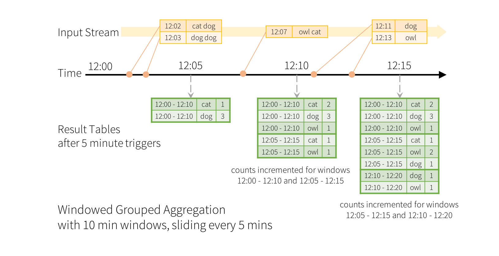

* This will become a table of contents (this text will be scraped).
{:toc}

# Overview
Structured Streaming is a scalable and fault-tolerant stream processing engine built on the Spark SQL engine. You can express your streaming computation the same way you would express a batch computation on static data. The Spark SQL engine will take care of running it incrementally and continuously and updating the final result as streaming data continues to arrive. You can use the [Dataset/DataFrame API](sql-programming-guide.html) in Scala, Java or Python to express streaming aggregations, event-time windows, stream-to-batch joins, etc. The computation is executed on the same optimized Spark SQL engine. Finally, the system ensures end-to-end exactly-once fault-tolerance guarantees through checkpointing and Write Ahead Logs. In short, *Structured Streaming provides fast, scalable, fault-tolerant, end-to-end exactly-once stream processing without the user having to reason about streaming.*

**Structured Streaming is still ALPHA in Spark 2.1** and the APIs are still experimental. In this guide, we are going to walk you through the programming model and the APIs. First, let's start with a simple example - a streaming word count. 

# Quick Example
Let’s say you want to maintain a running word count of text data received from a data server listening on a TCP socket. Let’s see how you can express this using Structured Streaming. You can see the full code in 
[Scala]({{site.SPARK_GITHUB_URL}}/blob/v{{site.SPARK_VERSION_SHORT}}/examples/src/main/scala/org/apache/spark/examples/sql/streaming/StructuredNetworkWordCount.scala)/[Java]({{site.SPARK_GITHUB_URL}}/blob/v{{site.SPARK_VERSION_SHORT}}/examples/src/main/java/org/apache/spark/examples/sql/streaming/JavaStructuredNetworkWordCount.java)/[Python]({{site.SPARK_GITHUB_URL}}/blob/v{{site.SPARK_VERSION_SHORT}}/examples/src/main/python/sql/streaming/structured_network_wordcount.py).
And if you [download Spark](http://spark.apache.org/downloads.html), you can directly run the example. In any case, let’s walk through the example step-by-step and understand how it works. First, we have to import the necessary classes and create a local SparkSession, the starting point of all functionalities related to Spark.


import org.apache.spark.sql.functions._
import org.apache.spark.sql.SparkSession

val spark = SparkSession
  .builder
  .appName("StructuredNetworkWordCount")
  .getOrCreate()
  
import spark.implicits._



import org.apache.spark.api.java.function.FlatMapFunction;
import org.apache.spark.sql.*;
import org.apache.spark.sql.streaming.StreamingQuery;

import java.util.Arrays;
import java.util.Iterator;

SparkSession spark = SparkSession
  .builder()
  .appName("JavaStructuredNetworkWordCount")
  .getOrCreate();



from pyspark.sql import SparkSession
from pyspark.sql.functions import explode
from pyspark.sql.functions import split

spark = SparkSession \
    .builder \
    .appName("StructuredNetworkWordCount") \
    .getOrCreate()


Next, let’s create a streaming DataFrame that represents text data received from a server listening on localhost:9999, and transform the DataFrame to calculate word counts.


// Create DataFrame representing the stream of input lines from connection to localhost:9999
val lines = spark.readStream
  .format("socket")
  .option("host", "localhost")
  .option("port", 9999)
  .load()

// Split the lines into words
val words = lines.as[String].flatMap(_.split(" "))

// Generate running word count
val wordCounts = words.groupBy("value").count()


This `lines` DataFrame represents an unbounded table containing the streaming text data. This table contains one column of strings named "value", and each line in the streaming text data becomes a row in the table. Note, that this is not currently receiving any data as we are just setting up the transformation, and have not yet started it. Next, we have converted the DataFrame to a  Dataset of String using `.as[String]`, so that we can apply the `flatMap` operation to split each line into multiple words. The resultant `words` Dataset contains all the words. Finally, we have defined the `wordCounts` DataFrame by grouping by the unique values in the Dataset and counting them. Note that this is a streaming DataFrame which represents the running word counts of the stream.


// Create DataFrame representing the stream of input lines from connection to localhost:9999
Dataset<Row> lines = spark
  .readStream()
  .format("socket")
  .option("host", "localhost")
  .option("port", 9999)
  .load();

// Split the lines into words
Dataset<String> words = lines
  .as(Encoders.STRING())
  .flatMap(
    new FlatMapFunction<String, String>() {
      @Override
      public Iterator<String> call(String x) {
        return Arrays.asList(x.split(" ")).iterator();
      }
    }, Encoders.STRING());

// Generate running word count
Dataset<Row> wordCounts = words.groupBy("value").count();


This `lines` DataFrame represents an unbounded table containing the streaming text data. This table contains one column of strings named "value", and each line in the streaming text data becomes a row in the table. Note, that this is not currently receiving any data as we are just setting up the transformation, and have not yet started it. Next, we have converted the DataFrame to a  Dataset of String using `.as(Encoders.STRING())`, so that we can apply the `flatMap` operation to split each line into multiple words. The resultant `words` Dataset contains all the words. Finally, we have defined the `wordCounts` DataFrame by grouping by the unique values in the Dataset and counting them. Note that this is a streaming DataFrame which represents the running word counts of the stream.


# Create DataFrame representing the stream of input lines from connection to localhost:9999
lines = spark \
    .readStream \
    .format("socket") \
    .option("host", "localhost") \
    .option("port", 9999) \
    .load()

# Split the lines into words
words = lines.select(
   explode(
       split(lines.value, " ")
   ).alias("word")
)

# Generate running word count
wordCounts = words.groupBy("word").count()


This `lines` DataFrame represents an unbounded table containing the streaming text data. This table contains one column of strings named "value", and each line in the streaming text data becomes a row in the table. Note, that this is not currently receiving any data as we are just setting up the transformation, and have not yet started it. Next, we have used two built-in SQL functions - split and explode, to split each line into multiple rows with a word each. In addition, we use the function `alias` to name the new column as "word". Finally, we have defined the `wordCounts` DataFrame by grouping by the unique values in the Dataset and counting them. Note that this is a streaming DataFrame which represents the running word counts of the stream.

We have now set up the query on the streaming data. All that is left is to actually start receiving data and computing the counts. To do this, we set it up to print the complete set of counts (specified by `outputMode("complete")`) to the console every time they are updated. And then start the streaming computation using `start()`.


// Start running the query that prints the running counts to the console
val query = wordCounts.writeStream
  .outputMode("complete")
  .format("console")
  .start()

query.awaitTermination()



// Start running the query that prints the running counts to the console
StreamingQuery query = wordCounts.writeStream()
  .outputMode("complete")
  .format("console")
  .start();

query.awaitTermination();



 # Start running the query that prints the running counts to the console
query = wordCounts \
    .writeStream \
    .outputMode("complete") \
    .format("console") \
    .start()

query.awaitTermination()


After this code is executed, the streaming computation will have started in the background. The `query` object is a handle to that active streaming query, and we have decided to wait for the termination of the query using `query.awaitTermination()` to prevent the process from exiting while the query is active.

To actually execute this example code, you can either compile the code in your own 
[Spark application](quick-start.html#self-contained-applications), or simply 
[run the example](index.html#running-the-examples-and-shell) once you have downloaded Spark. We are showing the latter. You will first need to run Netcat (a small utility found in most Unix-like systems) as a data server by using

    $ nc -lk 9999

Then, in a different terminal, you can start the example by using


$ ./bin/run-example org.apache.spark.examples.sql.streaming.StructuredNetworkWordCount localhost 9999



$ ./bin/run-example org.apache.spark.examples.sql.streaming.JavaStructuredNetworkWordCount localhost 9999



$ ./bin/spark-submit examples/src/main/python/sql/streaming/structured_network_wordcount.py localhost 9999


Then, any lines typed in the terminal running the netcat server will be counted and printed on screen every second. It will look something like the following.

<table width="100%">
    <td>

# TERMINAL 1:
# Running Netcat

$ nc -lk 9999
apache spark
apache hadoop

...

    </td>
    <td width="2%"></td>
    <td>


# TERMINAL 2: RUNNING StructuredNetworkWordCount

$ ./bin/run-example org.apache.spark.examples.sql.streaming.StructuredNetworkWordCount localhost 9999

-------------------------------------------
Batch: 0
-------------------------------------------
+------+-----+
| value|count|
+------+-----+
|apache|    1|
| spark|    1|
+------+-----+

-------------------------------------------
Batch: 1
-------------------------------------------
+------+-----+
| value|count|
+------+-----+
|apache|    2|
| spark|    1|
|hadoop|    1|
+------+-----+
...



# TERMINAL 2: RUNNING JavaStructuredNetworkWordCount

$ ./bin/run-example org.apache.spark.examples.sql.streaming.JavaStructuredNetworkWordCount localhost 9999

-------------------------------------------
Batch: 0
-------------------------------------------
+------+-----+
| value|count|
+------+-----+
|apache|    1|
| spark|    1|
+------+-----+

-------------------------------------------
Batch: 1
-------------------------------------------
+------+-----+
| value|count|
+------+-----+
|apache|    2|
| spark|    1|
|hadoop|    1|
+------+-----+
...



# TERMINAL 2: RUNNING structured_network_wordcount.py

$ ./bin/spark-submit examples/src/main/python/sql/streaming/structured_network_wordcount.py localhost 9999

-------------------------------------------
Batch: 0
-------------------------------------------
+------+-----+
| value|count|
+------+-----+
|apache|    1|
| spark|    1|
+------+-----+

-------------------------------------------
Batch: 1
-------------------------------------------
+------+-----+
| value|count|
+------+-----+
|apache|    2|
| spark|    1|
|hadoop|    1|
+------+-----+
...


    </td>
</table>

# Programming Model

The key idea in Structured Streaming is to treat a live data stream as a 
table that is being continuously appended. This leads to a new stream 
processing model that is very similar to a batch processing model. You will 
express your streaming computation as standard batch-like query as on a static 
table, and Spark runs it as an *incremental* query on the *unbounded* input 
table. Let’s understand this model in more detail.

## Basic Concepts
Consider the input data stream as the "Input Table". Every data item that is 
arriving on the stream is like a new row being appended to the Input Table.

A query on the input will generate the "Result Table". Every trigger interval (say, every 1 second), new rows get appended to the Input Table, which eventually updates the Result Table. Whenever the result table gets updated, we would want to write the changed result rows to an external sink. 

The "Output" is defined as what gets written out to the external storage. The output can be defined in a different mode:

  - *Complete Mode* - The entire updated Result Table will be written to the external storage. It is up to the storage connector to decide how to handle writing of the entire table. 

  - *Append Mode* - Only the new rows appended in the Result Table since the last trigger will be written to the external storage. This is applicable only on the queries where existing rows in the Result Table are not expected to change.
  
  - *Update Mode* - Only the rows that were updated in the Result Table since the last trigger will be written to the external storage (available since Spark 2.1.1). Note that this is different from the Complete Mode in that this mode only outputs the rows that have changed since the last trigger. If the query doesn't contain aggregations, it will be equivalent to Append mode.

Note that each mode is applicable on certain types of queries. This is discussed in detail [later](#output-modes).

To illustrate the use of this model, let’s understand the model in context of 
the [Quick Example](#quick-example) above. The first `lines` DataFrame is the input table, and 
the final `wordCounts` DataFrame is the result table. Note that the query on 
streaming `lines` DataFrame to generate `wordCounts` is *exactly the same* as 
it would be a static DataFrame. However, when this query is started, Spark 
will continuously check for new data from the socket connection. If there is 
new data, Spark will run an "incremental" query that combines the previous 
running counts with the new data to compute updated counts, as shown below.

This model is significantly different from many other stream processing 
engines. Many streaming systems require the user to maintain running 
aggregations themselves, thus having to reason about fault-tolerance, and 
data consistency (at-least-once, or at-most-once, or exactly-once). In this 
model, Spark is responsible for updating the Result Table when there is new 
data, thus relieving the users from reasoning about it. As an example, let’s 
see how this model handles event-time based processing and late arriving data.

## Handling Event-time and Late Data
Event-time is the time embedded in the data itself. For many applications, you may want to operate on this event-time. For example, if you want to get the number of events generated by IoT devices every minute, then you probably want to use the time when the data was generated (that is, event-time in the data), rather than the time Spark receives them. This event-time is very naturally expressed in this model -- each event from the devices is a row in the table, and event-time is a column value in the row. This allows window-based aggregations (e.g. number of events every minute) to be just a special type of grouping and aggregation on the even-time column -- each time window is a group and each row can belong to multiple windows/groups. Therefore, such event-time-window-based aggregation queries can be defined consistently on both a static dataset (e.g. from collected device events logs) as well as on a data stream, making the life of the user much easier.

Furthermore, this model naturally handles data that has arrived later than 
expected based on its event-time. Since Spark is updating the Result Table, 
it has full control over updating old aggregates when there is late data, 
as well as cleaning up old aggregates to limit the size of intermediate
state data. Since Spark 2.1, we have support for watermarking which 
allows the user to specify the threshold of late data, and allows the engine
to accordingly clean up old state. These are explained later in more 
details in the [Window Operations](#window-operations-on-event-time) section.

## Fault Tolerance Semantics
Delivering end-to-end exactly-once semantics was one of key goals behind the design of Structured Streaming. To achieve that, we have designed the Structured Streaming sources, the sinks and the execution engine to reliably track the exact progress of the processing so that it can handle any kind of failure by restarting and/or reprocessing. Every streaming source is assumed to have offsets (similar to Kafka offsets, or Kinesis sequence numbers)
to track the read position in the stream. The engine uses checkpointing and write ahead logs to record the offset range of the data being processed in each trigger. The streaming sinks are designed to be idempotent for handling reprocessing. Together, using replayable sources and idempotent sinks, Structured Streaming can ensure **end-to-end exactly-once semantics** under any failure.

# API using Datasets and DataFrames
Since Spark 2.0, DataFrames and Datasets can represent static, bounded data, as well as streaming, unbounded data. Similar to static Datasets/DataFrames, you can use the common entry point `SparkSession`
([Scala](api/scala/index.html#org.apache.spark.sql.SparkSession)/[Java](api/java/org/apache/spark/sql/SparkSession.html)/[Python](api/python/pyspark.sql.html#pyspark.sql.SparkSession) docs)
to create streaming DataFrames/Datasets from streaming sources, and apply the same operations on them as static DataFrames/Datasets. If you are not familiar with Datasets/DataFrames, you are strongly advised to familiarize yourself with them using the
[DataFrame/Dataset Programming Guide](sql-programming-guide.html).

## Creating streaming DataFrames and streaming Datasets
Streaming DataFrames can be created through the `DataStreamReader` interface 
([Scala](api/scala/index.html#org.apache.spark.sql.streaming.DataStreamReader)/[Java](api/java/org/apache/spark/sql/streaming/DataStreamReader.html)/[Python](api/python/pyspark.sql.html#pyspark.sql.streaming.DataStreamReader) docs)
returned by `SparkSession.readStream()`. Similar to the read interface for creating static DataFrame, you can specify the details of the source – data format, schema, options, etc.

#### Input Sources
In Spark 2.0, there are a few built-in sources.

  - **File source** - Reads files written in a directory as a stream of data. Supported file formats are text, csv, json, parquet. See the docs of the DataStreamReader interface for a more up-to-date list, and supported options for each file format. Note that the files must be atomically placed in the given directory, which in most file systems, can be achieved by file move operations.

  - **Kafka source** - Poll data from Kafka. It's compatible with Kafka broker versions 0.10.0 or higher. See the [Kafka Integration Guide](structured-streaming-kafka-integration.html) for more details.

  - **Socket source (for testing)** - Reads UTF8 text data from a socket connection. The listening server socket is at the driver. Note that this should be used only for testing as this does not provide end-to-end fault-tolerance guarantees. 

Some sources are not fault-tolerant because they do not guarantee that data can be replayed using 
checkpointed offsets after a failure. See the earlier section on 
[fault-tolerance semantics](#fault-tolerance-semantics).
Here are the details of all the sources in Spark.

<table class="table">
  <tr>
    <th>Source</th>
    <th>Options</th>
    <th>Fault-tolerant</th>
    <th>Notes</th>
  </tr>
  <tr>
    <td><b>File source</b></td>
    <td>
        <code>path</code>: path to the input directory, and common to all file formats.
          
        For file-format-specific options, see the related methods in <code>DataStreamReader</code>
        (<a href="api/scala/index.html#org.apache.spark.sql.streaming.DataStreamReader">Scala</a>/<a href="api/java/org/apache/spark/sql/streaming/DataStreamReader.html">Java</a>/<a href="api/python/pyspark.sql.html#pyspark.sql.streaming.DataStreamReader">Python</a>).
        E.g. for "parquet" format options see <code>DataStreamReader.parquet()</code></td>
    <td>Yes</td>
    <td>Supports glob paths, but does not support multiple comma-separated paths/globs.</td>
  </tr>
  <tr>
    <td><b>Socket Source</b></td>
    <td>
        <code>host</code>: host to connect to, must be specified 
        <code>port</code>: port to connect to, must be specified
    </td>
    <td>No</td>
    <td></td>
  </tr>
  <tr>
    <td><b>Kafka Source</b></td>
    <td>
        See the <a href="structured-streaming-kafka-integration.html">Kafka Integration Guide</a>.
    </td>
    <td>Yes</td>
    <td></td>
  </tr>
  <tr>
    <td></td>
    <td></td>
    <td></td>
    <td></td>
  </tr>
</table>

Here are some examples.


val spark: SparkSession = ...

// Read text from socket 
val socketDF = spark
  .readStream
  .format("socket")
  .option("host", "localhost")
  .option("port", 9999)
  .load()

socketDF.isStreaming    // Returns True for DataFrames that have streaming sources

socketDF.printSchema 

// Read all the csv files written atomically in a directory
val userSchema = new StructType().add("name", "string").add("age", "integer")
val csvDF = spark
  .readStream
  .option("sep", ";")
  .schema(userSchema)      // Specify schema of the csv files
  .csv("/path/to/directory")    // Equivalent to format("csv").load("/path/to/directory")



SparkSession spark = ...

// Read text from socket 
Dataset[Row] socketDF = spark
  .readStream()
  .format("socket")
  .option("host", "localhost")
  .option("port", 9999)
  .load();

socketDF.isStreaming();    // Returns True for DataFrames that have streaming sources

socketDF.printSchema();

// Read all the csv files written atomically in a directory
StructType userSchema = new StructType().add("name", "string").add("age", "integer");
Dataset[Row] csvDF = spark
  .readStream()
  .option("sep", ";")
  .schema(userSchema)      // Specify schema of the csv files
  .csv("/path/to/directory");    // Equivalent to format("csv").load("/path/to/directory")



spark = SparkSession. ...

# Read text from socket 
socketDF = spark \
    .readStream \
    .format("socket") \
    .option("host", "localhost") \
    .option("port", 9999) \
    .load()

socketDF.isStreaming()    # Returns True for DataFrames that have streaming sources

socketDF.printSchema() 

# Read all the csv files written atomically in a directory
userSchema = StructType().add("name", "string").add("age", "integer")
csvDF = spark \
    .readStream \
    .option("sep", ";") \
    .schema(userSchema) \
    .csv("/path/to/directory")  # Equivalent to format("csv").load("/path/to/directory")


These examples generate streaming DataFrames that are untyped, meaning that the schema of the DataFrame is not checked at compile time, only checked at runtime when the query is submitted. Some operations like `map`, `flatMap`, etc. need the type to be known at compile time. To do those, you can convert these untyped streaming DataFrames to typed streaming Datasets using the same methods as static DataFrame. See the [SQL Programming Guide](sql-programming-guide.html) for more details. Additionally, more details on the supported streaming sources are discussed later in the document.

### Schema inference and partition of streaming DataFrames/Datasets

By default, Structured Streaming from file based sources requires you to specify the schema, rather than rely on Spark to infer it automatically. This restriction ensures a consistent schema will be used for the streaming query, even in the case of failures. For ad-hoc use cases, you can reenable schema inference by setting `spark.sql.streaming.schemaInference` to `true`.

Partition discovery does occur when subdirectories that are named `/key=value/` are present and listing will automatically recurse into these directories. If these columns appear in the user provided schema, they will be filled in by Spark based on the path of the file being read. The directories that make up the partitioning scheme must be present when the query starts and must remain static. For example, it is okay to add `/data/year=2016/` when `/data/year=2015/` was present, but it is invalid to change the partitioning column (i.e. by creating the directory `/data/date=2016-04-17/`).

## Operations on streaming DataFrames/Datasets
You can apply all kinds of operations on streaming DataFrames/Datasets – ranging from untyped, SQL-like operations (e.g. `select`, `where`, `groupBy`), to typed RDD-like operations (e.g. `map`, `filter`, `flatMap`). See the [SQL programming guide](sql-programming-guide.html) for more details. Let’s take a look at a few example operations that you can use.

### Basic Operations - Selection, Projection, Aggregation
Most of the common operations on DataFrame/Dataset are supported for streaming. The few operations that are not supported are [discussed later](#unsupported-operations) in this section.


case class DeviceData(device: String, deviceType: String, signal: Double, time: DateTime)

val df: DataFrame = ... // streaming DataFrame with IOT device data with schema { device: string, deviceType: string, signal: double, time: string }
val ds: Dataset[DeviceData] = df.as[DeviceData]    // streaming Dataset with IOT device data

// Select the devices which have signal more than 10
df.select("device").where("signal > 10")      // using untyped APIs   
ds.filter(_.signal > 10).map(_.device)         // using typed APIs

// Running count of the number of updates for each device type
df.groupBy("deviceType").count()                          // using untyped API

// Running average signal for each device type
import org.apache.spark.sql.expressions.scalalang.typed
ds.groupByKey(_.deviceType).agg(typed.avg(_.signal))    // using typed API



import org.apache.spark.api.java.function.*;
import org.apache.spark.sql.*;
import org.apache.spark.sql.expressions.javalang.typed;
import org.apache.spark.sql.catalyst.encoders.ExpressionEncoder;

public class DeviceData {
  private String device;
  private String deviceType;
  private Double signal;
  private java.sql.Date time;
  ...
  // Getter and setter methods for each field
}

Dataset<Row> df = ...;    // streaming DataFrame with IOT device data with schema { device: string, type: string, signal: double, time: DateType }
Dataset<DeviceData> ds = df.as(ExpressionEncoder.javaBean(DeviceData.class)); // streaming Dataset with IOT device data

// Select the devices which have signal more than 10
df.select("device").where("signal > 10"); // using untyped APIs
ds.filter(new FilterFunction<DeviceData>() { // using typed APIs
  @Override
  public boolean call(DeviceData value) throws Exception {
    return value.getSignal() > 10;
  }
}).map(new MapFunction<DeviceData, String>() {
  @Override
  public String call(DeviceData value) throws Exception {
    return value.getDevice();
  }
}, Encoders.STRING());

// Running count of the number of updates for each device type
df.groupBy("deviceType").count(); // using untyped API

// Running average signal for each device type
ds.groupByKey(new MapFunction<DeviceData, String>() { // using typed API
  @Override
  public String call(DeviceData value) throws Exception {
    return value.getDeviceType();
  }
}, Encoders.STRING()).agg(typed.avg(new MapFunction<DeviceData, Double>() {
  @Override
  public Double call(DeviceData value) throws Exception {
    return value.getSignal();
  }
}));



df = ...  # streaming DataFrame with IOT device data with schema { device: string, deviceType: string, signal: double, time: DateType }

# Select the devices which have signal more than 10
df.select("device").where("signal > 10")                              

# Running count of the number of updates for each device type
df.groupBy("deviceType").count()


### Window Operations on Event Time
Aggregations over a sliding event-time window are straightforward with Structured Streaming. The key idea to understand about window-based aggregations are very similar to grouped aggregations. In a grouped aggregation, aggregate values (e.g. counts) are maintained for each unique value in the user-specified grouping column. In case of window-based aggregations, aggregate values are maintained for each window the event-time of a row falls into. Let's understand this with an illustration. 

Imagine our [quick example](#quick-example) is modified and the stream now contains lines along with the time when the line was generated. Instead of running word counts, we want to count words within 10 minute windows, updating every 5 minutes. That is, word counts in words received between 10 minute windows 12:00 - 12:10, 12:05 - 12:15, 12:10 - 12:20, etc. Note that 12:00 - 12:10 means data that arrived after 12:00 but before 12:10. Now, consider a word that was received at 12:07. This word should increment the counts corresponding to two windows 12:00 - 12:10 and 12:05 - 12:15. So the counts will be indexed by both, the grouping key (i.e. the word) and the window (can be calculated from the event-time).

The result tables would look something like the following.

Since this windowing is similar to grouping, in code, you can use `groupBy()` and `window()` operations to express windowed aggregations. You can see the full code for the below examples in
[Scala]({{site.SPARK_GITHUB_URL}}/blob/v{{site.SPARK_VERSION_SHORT}}/examples/src/main/scala/org/apache/spark/examples/sql/streaming/StructuredNetworkWordCountWindowed.scala)/[Java]({{site.SPARK_GITHUB_URL}}/blob/v{{site.SPARK_VERSION_SHORT}}/examples/src/main/java/org/apache/spark/examples/sql/streaming/JavaStructuredNetworkWordCountWindowed.java)/[Python]({{site.SPARK_GITHUB_URL}}/blob/v{{site.SPARK_VERSION_SHORT}}/examples/src/main/python/sql/streaming/structured_network_wordcount_windowed.py).


import spark.implicits._

val words = ... // streaming DataFrame of schema { timestamp: Timestamp, word: String }

// Group the data by window and word and compute the count of each group
val windowedCounts = words.groupBy(
  window($"timestamp", "10 minutes", "5 minutes"),
  $"word"
).count()



Dataset<Row> words = ... // streaming DataFrame of schema { timestamp: Timestamp, word: String }

// Group the data by window and word and compute the count of each group
Dataset<Row> windowedCounts = words.groupBy(
  functions.window(words.col("timestamp"), "10 minutes", "5 minutes"),
  words.col("word")
).count();



words = ...  # streaming DataFrame of schema { timestamp: Timestamp, word: String }

# Group the data by window and word and compute the count of each group
windowedCounts = words.groupBy(
    window(words.timestamp, "10 minutes", "5 minutes"),
    words.word
).count()


### Handling Late Data and Watermarking
Now consider what happens if one of the events arrives late to the application.
For example, say, a word generated at 12:04 (i.e. event time) could be received received by 
the application at 12:11. The application should use the time 12:04 instead of 12:11
to update the older counts for the window `12:00 - 12:10`. This occurs 
naturally in our window-based grouping – Structured Streaming can maintain the intermediate state 
for partial aggregates for a long period of time such that late data can update aggregates of 
old windows correctly, as illustrated below.

However, to run this query for days, its necessary for the system to bound the amount of 
intermediate in-memory state it accumulates. This means the system needs to know when an old 
aggregate can be dropped from the in-memory state because the application is not going to receive 
late data for that aggregate any more. To enable this, in Spark 2.1, we have introduced 
**watermarking**, which let's the engine automatically track the current event time in the data and
and attempt to clean up old state accordingly. You can define the watermark of a query by 
specifying the event time column and the threshold on how late the data is expected be in terms of 
event time. For a specific window starting at time `T`, the engine will maintain state and allow late
data to be update the state until `(max event time seen by the engine - late threshold > T)`. 
In other words, late data within the threshold will be aggregated, 
but data later than the threshold will be dropped. Let's understand this with an example. We can 
easily define watermarking on the previous example using `withWatermark()` as shown below.


import spark.implicits._

val words = ... // streaming DataFrame of schema { timestamp: Timestamp, word: String }

// Group the data by window and word and compute the count of each group
val windowedCounts = words
    .withWatermark("timestamp", "10 minutes")
    .groupBy(
        window($"timestamp", "10 minutes", "5 minutes"),
        $"word")
    .count()



Dataset<Row> words = ... // streaming DataFrame of schema { timestamp: Timestamp, word: String }

// Group the data by window and word and compute the count of each group
Dataset<Row> windowedCounts = words
    .withWatermark("timestamp", "10 minutes")
    .groupBy(
        functions.window(words.col("timestamp"), "10 minutes", "5 minutes"),
        words.col("word"))
    .count();



words = ...  # streaming DataFrame of schema { timestamp: Timestamp, word: String }

# Group the data by window and word and compute the count of each group
windowedCounts = words \
    .withWatermark("timestamp", "10 minutes") \
    .groupBy(
        window(words.timestamp, "10 minutes", "5 minutes"),
        words.word) \
    .count()


In this example, we are defining the watermark of the query on the value of the column "timestamp", 
and also defining "10 minutes" as the threshold of how late is the data allowed to be. If this query 
is run in Update output mode (discussed later in [Output Modes](#output-modes) section), 
the engine will keep updating counts of a window in the Resule Table until the window is older 
than the watermark, which lags behind the current event time in column "timestamp" by 10 minutes.
Here is an illustration. 

As shown in the illustration, the maximum event time tracked by the engine is the 
*blue dashed line*, and the watermark set as `(max event time - '10 mins')`
at the beginning of every trigger is the red line  For example, when the engine observes the data 
`(12:14, dog)`, it sets the watermark for the next trigger as `12:04`.
This watermark lets the engine maintain intermediate state for additional 10 minutes to allow late
data to be counted. For example, the data `(12:09, cat)` is out of order and late, and it falls in
windows `12:05 - 12:15` and `12:10 - 12:20`. Since, it is still ahead of the watermark `12:04` in 
the trigger, the engine still maintains the intermediate counts as state and correctly updates the 
counts of the related windows. However, when the watermark is updated to 12:11, the intermediate 
state for window `(12:00 - 12:10)` is cleared, and all subsequent data (e.g. `(12:04, donkey)`) 
is considered "too late" and therefore ignored. Note that after every trigger, 
the updated counts (i.e. purple rows) are written to sink as the trigger output, as dictated by 
the Update mode.

Some sinks (e.g. files) may not supported fine-grained updates that Update Mode requires. To work
with them, we have also support Append Mode, where only the *final counts* are written to sink.
This is illustrated below.

Similar to the Update Mode earlier, the engine maintains intermediate counts for each window. 
However, the partial counts are not updated to the Result Table and not written to sink. The engine
waits for "10 mins" for late date to be counted, 
then drops intermediate state of a window < watermark, and appends the final
counts to the Result Table/sink. For example, the final counts of window `12:00 - 12:10` is 
appended to the Result Table only after the watermark is updated to `12:11`. 

**Conditions for watermarking to clean aggregation state**
It is important to note that the following conditions must be satisfied for the watermarking to 
clean the state in aggregation queries *(as of Spark 2.1.1, subject to change in the future)*.

- **Output mode must be Append or Update.** Complete mode requires all aggregate data to be preserved, 
and hence cannot use watermarking to drop intermediate state. See the [Output Modes](#output-modes) 
section for detailed explanation of the semantics of each output mode.

- The aggregation must have either the event-time column, or a `window` on the event-time column. 

- `withWatermark` must be called on the 
same column as the timestamp column used in the aggregate. For example, 
`df.withWatermark("time", "1 min").groupBy("time2").count()` is invalid 
in Append output mode, as watermark is defined on a different column
as the aggregation column.

- `withWatermark` must be called before the aggregation for the watermark details to be used. 
For example, `df.groupBy("time").count().withWatermark("time", "1 min")` is invalid in Append 
output mode.

### Join Operations
Streaming DataFrames can be joined with static DataFrames to create new streaming DataFrames. Here are a few examples.


val staticDf = spark.read. ...
val streamingDf = spark.readStream. ... 

streamingDf.join(staticDf, "type")          // inner equi-join with a static DF
streamingDf.join(staticDf, "type", "right_join")  // right outer join with a static DF  




Dataset<Row> staticDf = spark.read. ...;
Dataset<Row> streamingDf = spark.readStream. ...;
streamingDf.join(staticDf, "type");         // inner equi-join with a static DF
streamingDf.join(staticDf, "type", "right_join");  // right outer join with a static DF



staticDf = spark.read. ...
streamingDf = spark.readStream. ...
streamingDf.join(staticDf, "type")  # inner equi-join with a static DF
streamingDf.join(staticDf, "type", "right_join")  # right outer join with a static DF


### Unsupported Operations
There are a few DataFrame/Dataset operations that are not supported with streaming DataFrames/Datasets. 
Some of them are as follows.
 
- Multiple streaming aggregations (i.e. a chain of aggregations on a streaming DF) are not yet supported on streaming Datasets.

- Limit and take first N rows are not supported on streaming Datasets.

- Distinct operations on streaming Datasets are not supported.

- Sorting operations are supported on streaming Datasets only after an aggregation and in Complete Output Mode.

- Outer joins between a streaming and a static Datasets are conditionally supported.

    + Full outer join with a streaming Dataset is not supported

    + Left outer join with a streaming Dataset on the right is not supported

    + Right outer join with a streaming Dataset on the left is not supported

- Any kind of joins between two streaming Datasets are not yet supported.

In addition, there are some Dataset methods that will not work on streaming Datasets. They are actions that will immediately run queries and return results, which does not make sense on a streaming Dataset. Rather, those functionalities can be done by explicitly starting a streaming query (see the next section regarding that).

- `count()` - Cannot return a single count from a streaming Dataset. Instead, use `ds.groupBy.count()` which returns a streaming Dataset containing a running count. 

- `foreach()` - Instead use `ds.writeStream.foreach(...)` (see next section).

- `show()` - Instead use the console sink (see next section).

If you try any of these operations, you will see an `AnalysisException` like "operation XYZ is not supported with streaming DataFrames/Datasets".
While some of them may be supported in future releases of Spark, 
there are others which are fundamentally hard to implement on streaming data efficiently. 
For example, sorting on the input stream is not supported, as it requires keeping 
track of all the data received in the stream. This is therefore fundamentally hard to execute 
efficiently.

## Starting Streaming Queries
Once you have defined the final result DataFrame/Dataset, all that is left is for you start the streaming computation. To do that, you have to use the `DataStreamWriter`
([Scala](api/scala/index.html#org.apache.spark.sql.streaming.DataStreamWriter)/[Java](api/java/org/apache/spark/sql/streaming/DataStreamWriter.html)/[Python](api/python/pyspark.sql.html#pyspark.sql.streaming.DataStreamWriter) docs)
returned through `Dataset.writeStream()`. You will have to specify one or more of the following in this interface.

- *Details of the output sink:* Data format, location, etc. 

- *Output mode:* Specify what gets written to the output sink.

- *Query name:* Optionally, specify a unique name of the query for identification.

- *Trigger interval:* Optionally, specify the trigger interval. If it is not specified, the system will check for availability of new data as soon as the previous processing has completed. If a trigger time is missed because the previous processing has not completed, then the system will attempt to trigger at the next trigger point, not immediately after the processing has completed.

- *Checkpoint location:* For some output sinks where the end-to-end fault-tolerance can be guaranteed, specify the location where the system will write all the checkpoint information. This should be a directory in an HDFS-compatible fault-tolerant file system. The semantics of checkpointing is discussed in more detail in the next section.

#### Output Modes
There are a few types of output modes.

- **Append mode (default)** - This is the default mode, where only the 
new rows added to the Result Table since the last trigger will be 
outputted to the sink. This is supported for only those queries where 
rows added to the Result Table is never going to change. Hence, this mode 
guarantees that each row will be output only once (assuming 
fault-tolerant sink). For example, queries with only `select`, 
`where`, `map`, `flatMap`, `filter`, `join`, etc. will support Append mode.

- **Complete mode** - The whole Result Table will be outputted to the sink after every trigger.
 This is supported for aggregation queries.

- **Update mode** - (*Available since Spark 2.1.1*) Only the rows in the Result Table that were 
updated since the last trigger will be outputted to the sink. 
More information to be added in future releases.

Different types of streaming queries support different output modes.
Here is the compatibility matrix.

<table class="table">
  <tr>
    <th>Query Type</th>
    <th></th>
    <th>Supported Output Modes</th>
    <th>Notes</th>        
  </tr>
  <tr>
    <td colspan="2" style="vertical-align: middle;">Queries without aggregation</td>
    <td style="vertical-align: middle;">Append, Update</td>
    <td style="vertical-align: middle;">
        Complete mode not supported as it is infeasible to keep all data in the Result Table.
    </td>
  </tr>
  <tr>
    <td rowspan="2" style="vertical-align: middle;">Queries with aggregation</td>
    <td style="vertical-align: middle;">Aggregation on event-time with watermark</td>
    <td style="vertical-align: middle;">Append, Update, Complete</td>
    <td>
        Append mode uses watermark to drop old aggregation state. But the output of a 
        windowed aggregation is delayed the late threshold specified in `withWatermark()` as by
        the modes semantics, rows can be added to the Result Table only once after they are 
        finalized (i.e. after watermark is crossed). See the
        <a href="#handling-late-data-and-watermarking">Late Data</a> section for more details.
          
        Update mode uses watermark to drop old aggregation state.
          
        Complete mode does not drop old aggregation state since by definition this mode
        preserves all data in the Result Table.
    </td>    
  </tr>
  <tr>
    <td style="vertical-align: middle;">Other aggregations</td>
    <td style="vertical-align: middle;">Complete, Update</td>
    <td>
        Since no watermark is defined (only defined in other category), 
        old aggregation state is not dropped.
          
        Append mode is not supported as aggregates can update thus violating the semantics of 
        this mode.
    </td>  
  </tr>
  <tr>
    <td></td>
    <td></td>
    <td></td>
    <td></td>
  </tr>
</table>

#### Output Sinks
There are a few types of built-in output sinks.

- **File sink** - Stores the output to a directory. 


writeStream
    .format("parquet")        // can be "orc", "json", "csv", etc.
    .option("path", "path/to/destination/dir")
    .start()


- **Foreach sink** - Runs arbitrary computation on the records in the output. See later in the section for more details.


writeStream
    .foreach(...)
    .start()


- **Console sink (for debugging)** - Prints the output to the console/stdout every time there is a trigger. Both, Append and Complete output modes, are supported. This should be used for debugging purposes on low data volumes as the entire output is collected and stored in the driver's memory after every trigger.


writeStream
    .format("console")
    .start()


- **Memory sink (for debugging)** - The output is stored in memory as an in-memory table.
Both, Append and Complete output modes, are supported. This should be used for debugging purposes
on low data volumes as the entire output is collected and stored in the driver's memory.
Hence, use it with caution.


writeStream
    .format("memory")
    .queryName("tableName")
    .start()


Some sinks are not fault-tolerant because they do not guarantee persistence of the output and are 
meant for debugging purposes only. See the earlier section on 
[fault-tolerance semantics](#fault-tolerance-semantics). 
Here are the details of all the sinks in Spark.

<table class="table">
  <tr>
    <th>Sink</th>
    <th>Supported Output Modes</th>
    <th>Options</th>
    <th>Fault-tolerant</th>
    <th>Notes</th>
  </tr>
  <tr>
    <td><b>File Sink</b></td>
    <td>Append</td>
    <td>
        <code>path</code>: path to the output directory, must be specified.
        <code>maxFilesPerTrigger</code>: maximum number of new files to be considered in every trigger (default: no max)
         
        <code>latestFirst</code>: whether to processs the latest new files first, useful when there is a large backlog of files(default: false)
          
        For file-format-specific options, see the related methods in DataFrameWriter
        (<a href="api/scala/index.html#org.apache.spark.sql.DataFrameWriter">Scala</a>/<a href="api/java/org/apache/spark/sql/DataFrameWriter.html">Java</a>/<a href="api/python/pyspark.sql.html#pyspark.sql.DataFrameWriter">Python</a>).
        E.g. for "parquet" format options see <code>DataFrameWriter.parquet()</code>
    </td>
    <td>Yes</td>
    <td>Supports writes to partitioned tables. Partitioning by time may be useful.</td>
  </tr>
  <tr>
    <td><b>Foreach Sink</b></td>
    <td>Append, Update, Compelete</td>
    <td>None</td>
    <td>Depends on ForeachWriter implementation</td>
    <td>More details in the <a href="#using-foreach">next section</a></td>
  </tr>
  <tr>
    <td><b>Console Sink</b></td>
    <td>Append, Update, Complete</td>
    <td>
        <code>numRows</code>: Number of rows to print every trigger (default: 20)
         
        <code>truncate</code>: Whether to truncate the output if too long (default: true)
    </td>
    <td>No</td>
    <td></td>
  </tr>
  <tr>
    <td><b>Memory Sink</b></td>
    <td>Append, Complete</td>
    <td>None</td>
    <td>No. But in Complete Mode, restarted query will recreate the full table.</td>
    <td>Table name is the query name.</td>
  </tr>
  <tr>
    <td></td>
    <td></td>
    <td></td>
    <td></td>
    <td></td>
  </tr>
</table>

Note that you have to call `start()` to actually start the execution of the query. This returns a StreamingQuery object which is a handle to the continuously running execution. You can use this object to manage the query, which we will discuss in the next subsection. For now, let’s understand all this with a few examples.


// ========== DF with no aggregations ==========
val noAggDF = deviceDataDf.select("device").where("signal > 10")   

// Print new data to console
noAggDF
  .writeStream
  .format("console")
  .start()

// Write new data to Parquet files
noAggDF
  .writeStream
  .format("parquet")
  .option("checkpointLocation", "path/to/checkpoint/dir")
  .option("path", "path/to/destination/dir")
  .start()
   
// ========== DF with aggregation ==========
val aggDF = df.groupBy("device").count()

// Print updated aggregations to console
aggDF
  .writeStream
  .outputMode("complete")
  .format("console")
  .start()

// Have all the aggregates in an in-memory table 
aggDF
  .writeStream
  .queryName("aggregates")    // this query name will be the table name
  .outputMode("complete")
  .format("memory")
  .start()

spark.sql("select * from aggregates").show()   // interactively query in-memory table



// ========== DF with no aggregations ==========
Dataset<Row> noAggDF = deviceDataDf.select("device").where("signal > 10");

// Print new data to console
noAggDF
  .writeStream()
  .format("console")
  .start();

// Write new data to Parquet files
noAggDF
  .writeStream()
  .format("parquet")
  .option("checkpointLocation", "path/to/checkpoint/dir")
  .option("path", "path/to/destination/dir")
  .start();
   
// ========== DF with aggregation ==========
Dataset<Row> aggDF = df.groupBy("device").count();

// Print updated aggregations to console
aggDF
  .writeStream()
  .outputMode("complete")
  .format("console")
  .start();

// Have all the aggregates in an in-memory table 
aggDF
  .writeStream()
  .queryName("aggregates")    // this query name will be the table name
  .outputMode("complete")
  .format("memory")
  .start();

spark.sql("select * from aggregates").show();   // interactively query in-memory table



# ========== DF with no aggregations ==========
noAggDF = deviceDataDf.select("device").where("signal > 10")   

# Print new data to console
noAggDF \
    .writeStream \
    .format("console") \
    .start()

# Write new data to Parquet files
noAggDF \
    .writeStream \
    .format("parquet") \
    .option("checkpointLocation", "path/to/checkpoint/dir") \
    .option("path", "path/to/destination/dir") \
    .start()
   
# ========== DF with aggregation ==========
aggDF = df.groupBy("device").count()

# Print updated aggregations to console
aggDF \
    .writeStream \
    .outputMode("complete") \
    .format("console") \
    .start()

# Have all the aggregates in an in memory table. The query name will be the table name
aggDF \
    .writeStream \
    .queryName("aggregates") \
    .outputMode("complete") \
    .format("memory") \
    .start()

spark.sql("select * from aggregates").show()   # interactively query in-memory table


#### Using Foreach
The `foreach` operation allows arbitrary operations to be computed on the output data. As of Spark 2.1, this is available only for Scala and Java. To use this, you will have to implement the interface `ForeachWriter`
([Scala](api/scala/index.html#org.apache.spark.sql.ForeachWriter)/[Java](api/java/org/apache/spark/sql/ForeachWriter.html) docs),
which has methods that get called whenever there is a sequence of rows generated as output after a trigger. Note the following important points.

- The writer must be serializable, as it will be serialized and sent to the executors for execution.

- All the three methods, `open`, `process` and `close` will be called on the executors.

- The writer must do all the initialization (e.g. opening connections, starting a transaction, etc.) only when the `open` method is called. Be aware that, if there is any initialization in the class as soon as the object is created, then that initialization will happen in the driver (because that is where the instance is being created), which may not be what you intend.

- `version` and `partition` are two parameters in `open` that uniquely represent a set of rows that needs to be pushed out. `version` is a monotonically increasing id that increases with every trigger. `partition` is an id that represents a partition of the output, since the output is distributed and will be processed on multiple executors.

- `open` can use the `version` and `partition` to choose whether it needs to write the sequence of rows. Accordingly, it can return `true` (proceed with writing), or `false` (no need to write). If `false` is returned, then `process` will not be called on any row. For example, after a partial failure, some of the output partitions of the failed trigger may have already been committed to a database. Based on metadata stored in the database, the writer can identify partitions that have already been committed and accordingly return false to skip committing them again. 

- Whenever `open` is called, `close` will also be called (unless the JVM exits due to some error). This is true even if `open` returns false. If there is any error in processing and writing the data, `close` will be called with the error. It is your responsibility to clean up state (e.g. connections, transactions, etc.) that have been created in `open` such that there are no resource leaks.

## Managing Streaming Queries
The `StreamingQuery` object created when a query is started can be used to monitor and manage the query. 


val query = df.writeStream.format("console").start()   // get the query object

query.id          // get the unique identifier of the running query that persists across restarts from checkpoint data

query.runId       // get the unique id of this run of the query, which will be generated at every start/restart

query.name        // get the name of the auto-generated or user-specified name

query.explain()   // print detailed explanations of the query

query.stop()      // stop the query 

query.awaitTermination()   // block until query is terminated, with stop() or with error

query.exception       // the exception if the query has been terminated with error

query.recentProgress  // an array of the most recent progress updates for this query

query.lastProgress    // the most recent progress update of this streaming query



StreamingQuery query = df.writeStream().format("console").start();   // get the query object

query.id();          // get the unique identifier of the running query that persists across restarts from checkpoint data

query.runId();       // get the unique id of this run of the query, which will be generated at every start/restart

query.name();        // get the name of the auto-generated or user-specified name

query.explain();   // print detailed explanations of the query

query.stop();      // stop the query

query.awaitTermination();   // block until query is terminated, with stop() or with error

query.exception();       // the exception if the query has been terminated with error

query.recentProgress();  // an array of the most recent progress updates for this query

query.lastProgress();    // the most recent progress update of this streaming query




query = df.writeStream.format("console").start()   # get the query object

query.id()          # get the unique identifier of the running query that persists across restarts from checkpoint data

query.runId()       # get the unique id of this run of the query, which will be generated at every start/restart

query.name()        # get the name of the auto-generated or user-specified name

query.explain()   # print detailed explanations of the query

query.stop()      # stop the query 

query.awaitTermination()   # block until query is terminated, with stop() or with error

query.exception()       # the exception if the query has been terminated with error

query.recentProgress()  # an array of the most recent progress updates for this query

query.lastProgress()    # the most recent progress update of this streaming query



You can start any number of queries in a single SparkSession. They will all be running concurrently sharing the cluster resources. You can use `sparkSession.streams()` to get the `StreamingQueryManager`
([Scala](api/scala/index.html#org.apache.spark.sql.streaming.StreamingQueryManager)/[Java](api/java/org/apache/spark/sql/streaming/StreamingQueryManager.html)/[Python](api/python/pyspark.sql.html#pyspark.sql.streaming.StreamingQueryManager) docs)
that can be used to manage the currently active queries.


val spark: SparkSession = ...

spark.streams.active    // get the list of currently active streaming queries

spark.streams.get(id)   // get a query object by its unique id

spark.streams.awaitAnyTermination()   // block until any one of them terminates



SparkSession spark = ...

spark.streams().active();    // get the list of currently active streaming queries

spark.streams().get(id);   // get a query object by its unique id

spark.streams().awaitAnyTermination();   // block until any one of them terminates



spark = ...  # spark session

spark.streams().active  # get the list of currently active streaming queries

spark.streams().get(id)  # get a query object by its unique id

spark.streams().awaitAnyTermination()  # block until any one of them terminates


## Monitoring Streaming Queries
There are two APIs for monitoring and debugging active queries - 
interactively and asynchronously.

### Interactive APIs

You can directly get the current status and metrics of an active query using 
`streamingQuery.lastProgress()` and `streamingQuery.status()`. 
`lastProgress()` returns a `StreamingQueryProgress` object 
in [Scala](api/scala/index.html#org.apache.spark.sql.streaming.StreamingQueryProgress) 
and [Java](api/java/org/apache/spark/sql/streaming/StreamingQueryProgress.html)
and an dictionary with the same fields in Python. It has all the information about
the progress made in the last trigger of the stream - what data was processed, 
what were the processing rates, latencies, etc. There is also 
`streamingQuery.recentProgress` which returns an array of last few progresses.  

In addition, `streamingQuery.status()` returns `StreamingQueryStatus` object 
in [Scala](api/scala/index.html#org.apache.spark.sql.streaming.StreamingQueryStatus) 
and [Java](api/java/org/apache/spark/sql/streaming/StreamingQueryStatus.html)
and an dictionary with the same fields in Python. It gives information about
what the query is immediately doing - is a trigger active, is data being processed, etc.

Here are a few examples.


val query: StreamingQuery = ...

println(query.lastProgress)

/* Will print something like the following.

{
  "id" : "ce011fdc-8762-4dcb-84eb-a77333e28109",
  "runId" : "88e2ff94-ede0-45a8-b687-6316fbef529a",
  "name" : "MyQuery",
  "timestamp" : "2016-12-14T18:45:24.873Z",
  "numInputRows" : 10,
  "inputRowsPerSecond" : 120.0,
  "processedRowsPerSecond" : 200.0,
  "durationMs" : {
    "triggerExecution" : 3,
    "getOffset" : 2
  },
  "eventTime" : {
    "watermark" : "2016-12-14T18:45:24.873Z"
  },
  "stateOperators" : [ ],
  "sources" : [ {
    "description" : "KafkaSource[Subscribe[topic-0]]",
    "startOffset" : {
      "topic-0" : {
        "2" : 0,
        "4" : 1,
        "1" : 1,
        "3" : 1,
        "0" : 1
      }
    },
    "endOffset" : {
      "topic-0" : {
        "2" : 0,
        "4" : 115,
        "1" : 134,
        "3" : 21,
        "0" : 534
      }
    },
    "numInputRows" : 10,
    "inputRowsPerSecond" : 120.0,
    "processedRowsPerSecond" : 200.0
  } ],
  "sink" : {
    "description" : "MemorySink"
  }
}
*/

println(query.status)

/*  Will print something like the following.
{
  "message" : "Waiting for data to arrive",
  "isDataAvailable" : false,
  "isTriggerActive" : false
}
*/



StreamingQuery query = ...

System.out.println(query.lastProgress());
/* Will print something like the following.

{
  "id" : "ce011fdc-8762-4dcb-84eb-a77333e28109",
  "runId" : "88e2ff94-ede0-45a8-b687-6316fbef529a",
  "name" : "MyQuery",
  "timestamp" : "2016-12-14T18:45:24.873Z",
  "numInputRows" : 10,
  "inputRowsPerSecond" : 120.0,
  "processedRowsPerSecond" : 200.0,
  "durationMs" : {
    "triggerExecution" : 3,
    "getOffset" : 2
  },
  "eventTime" : {
    "watermark" : "2016-12-14T18:45:24.873Z"
  },
  "stateOperators" : [ ],
  "sources" : [ {
    "description" : "KafkaSource[Subscribe[topic-0]]",
    "startOffset" : {
      "topic-0" : {
        "2" : 0,
        "4" : 1,
        "1" : 1,
        "3" : 1,
        "0" : 1
      }
    },
    "endOffset" : {
      "topic-0" : {
        "2" : 0,
        "4" : 115,
        "1" : 134,
        "3" : 21,
        "0" : 534
      }
    },
    "numInputRows" : 10,
    "inputRowsPerSecond" : 120.0,
    "processedRowsPerSecond" : 200.0
  } ],
  "sink" : {
    "description" : "MemorySink"
  }
}
*/

System.out.println(query.status());
/*  Will print something like the following.
{
  "message" : "Waiting for data to arrive",
  "isDataAvailable" : false,
  "isTriggerActive" : false
}
*/



query = ...  # a StreamingQuery
print(query.lastProgress)

'''
Will print something like the following.

{u'stateOperators': [], u'eventTime': {u'watermark': u'2016-12-14T18:45:24.873Z'}, u'name': u'MyQuery', u'timestamp': u'2016-12-14T18:45:24.873Z', u'processedRowsPerSecond': 200.0, u'inputRowsPerSecond': 120.0, u'numInputRows': 10, u'sources': [{u'description': u'KafkaSource[Subscribe[topic-0]]', u'endOffset': {u'topic-0': {u'1': 134, u'0': 534, u'3': 21, u'2': 0, u'4': 115}}, u'processedRowsPerSecond': 200.0, u'inputRowsPerSecond': 120.0, u'numInputRows': 10, u'startOffset': {u'topic-0': {u'1': 1, u'0': 1, u'3': 1, u'2': 0, u'4': 1}}}], u'durationMs': {u'getOffset': 2, u'triggerExecution': 3}, u'runId': u'88e2ff94-ede0-45a8-b687-6316fbef529a', u'id': u'ce011fdc-8762-4dcb-84eb-a77333e28109', u'sink': {u'description': u'MemorySink'}}
'''

print(query.status)
''' 
Will print something like the following.

{u'message': u'Waiting for data to arrive', u'isTriggerActive': False, u'isDataAvailable': False}
'''


### Asynchronous API

You can also asynchronously monitor all queries associated with a
`SparkSession` by attaching a `StreamingQueryListener`
([Scala](api/scala/index.html#org.apache.spark.sql.streaming.StreamingQueryListener)/[Java](api/java/org/apache/spark/sql/streaming/StreamingQueryListener.html) docs).
Once you attach your custom `StreamingQueryListener` object with
`sparkSession.streams.attachListener()`, you will get callbacks when a query is started and
stopped and when there is progress made in an active query. Here is an example,


val spark: SparkSession = ...

spark.streams.addListener(new StreamingQueryListener() {
    override def onQueryStarted(queryStarted: QueryStartedEvent): Unit = {
        println("Query started: " + queryStarted.id)
    }
    override def onQueryTerminated(queryTerminated: QueryTerminatedEvent): Unit = {
        println("Query terminated: " + queryTerminated.id)
    }
    override def onQueryProgress(queryProgress: QueryProgressEvent): Unit = {
        println("Query made progress: " + queryProgress.progress)
    }
})



SparkSession spark = ...

spark.streams().addListener(new StreamingQueryListener() {
    @Override
    public void onQueryStarted(QueryStartedEvent queryStarted) {
        System.out.println("Query started: " + queryStarted.id());
    }
    @Override
    public void onQueryTerminated(QueryTerminatedEvent queryTerminated) {
        System.out.println("Query terminated: " + queryTerminated.id());
    }
    @Override
    public void onQueryProgress(QueryProgressEvent queryProgress) {
        System.out.println("Query made progress: " + queryProgress.progress());
    }
});



Not available in Python.


## Recovering from Failures with Checkpointing 
In case of a failure or intentional shutdown, you can recover the previous progress and state of a previous query, and continue where it left off. This is done using checkpointing and write ahead logs. You can configure a query with a checkpoint location, and the query will save all the progress information (i.e. range of offsets processed in each trigger) and the running aggregates (e.g. word counts in the [quick example](#quick-example)) to the checkpoint location. This checkpoint location has to be a path in an HDFS compatible file system, and can be set as an option in the DataStreamWriter when [starting a query](#starting-streaming-queries). 


aggDF
  .writeStream
  .outputMode("complete")
  .option("checkpointLocation", "path/to/HDFS/dir")
  .format("memory")
  .start()



aggDF
  .writeStream()
  .outputMode("complete")
  .option("checkpointLocation", "path/to/HDFS/dir")
  .format("memory")
  .start();



aggDF \
    .writeStream \
    .outputMode("complete") \
    .option("checkpointLocation", "path/to/HDFS/dir") \
    .format("memory") \
    .start()


# Where to go from here
- Examples: See and run the 
[Scala]({{site.SPARK_GITHUB_URL}}/tree/master/examples/src/main/scala/org/apache/spark/examples/sql/streaming)/[Java]({{site.SPARK_GITHUB_URL}}/tree/master/examples/src/main/java/org/apache/spark/examples/sql/streaming)/[Python]({{site.SPARK_GITHUB_URL}}/tree/master/examples/src/main/python/sql/streaming) 
examples.
- Spark Summit 2016 Talk - [A Deep Dive into Structured Streaming](https://spark-summit.org/2016/events/a-deep-dive-into-structured-streaming/)

