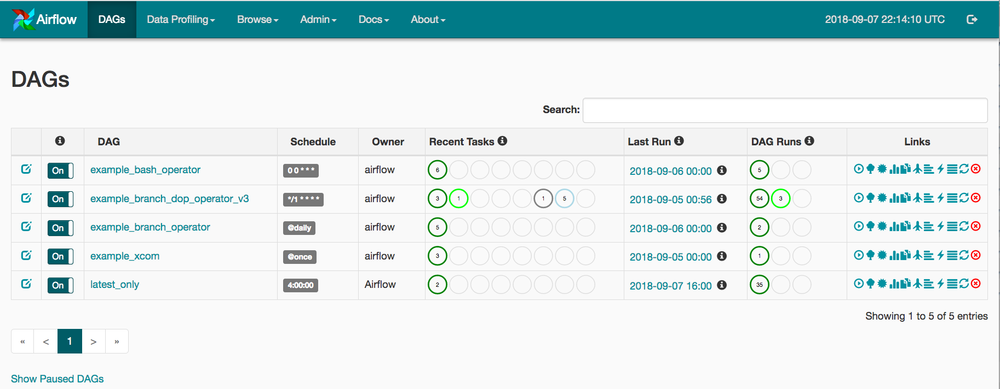
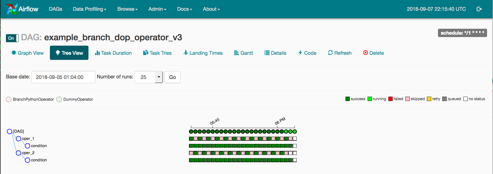
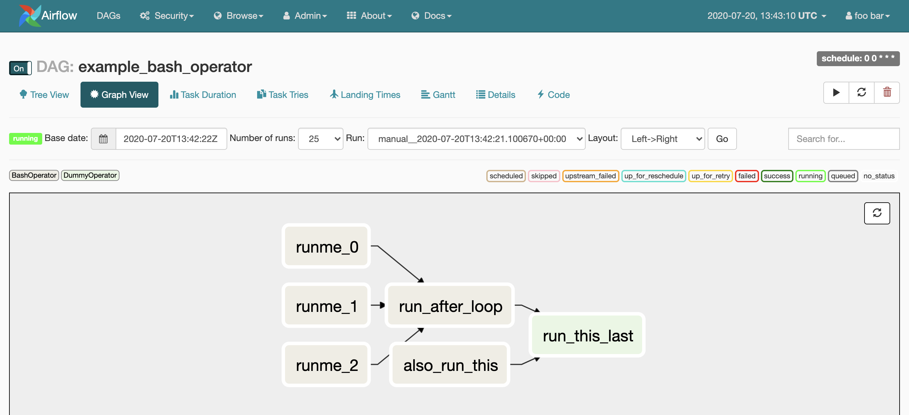
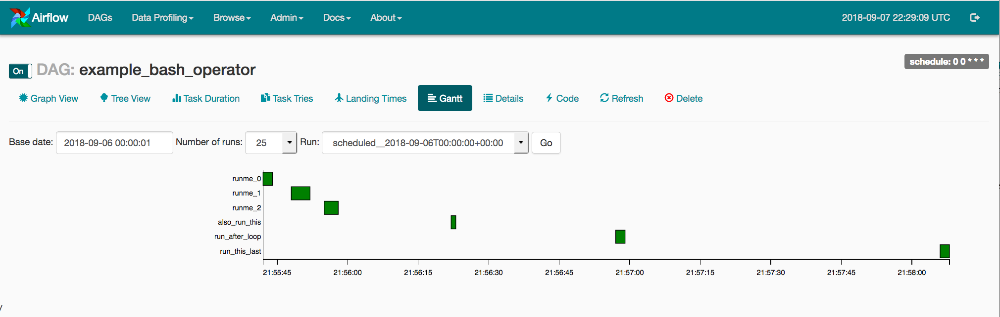
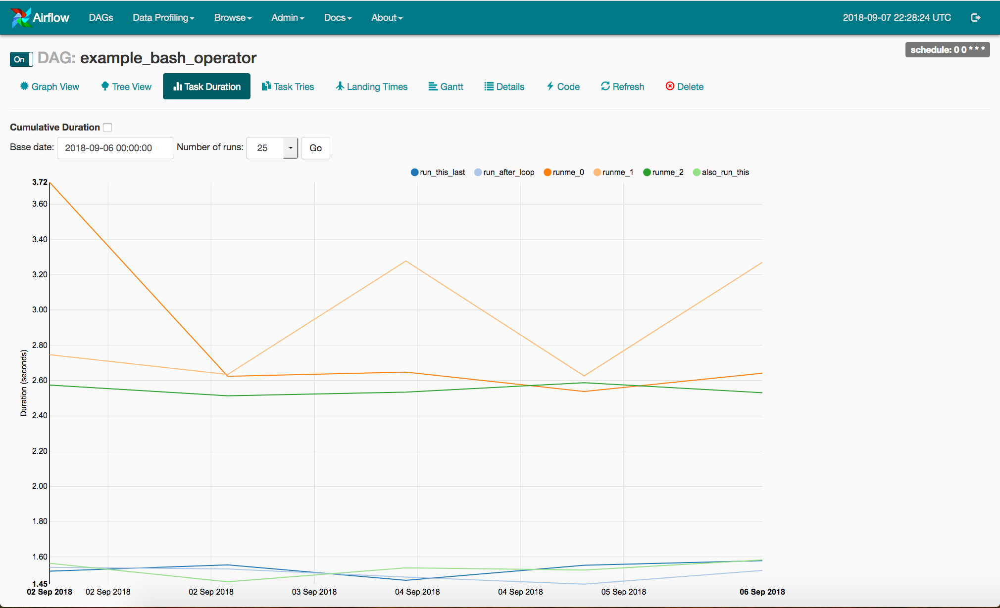
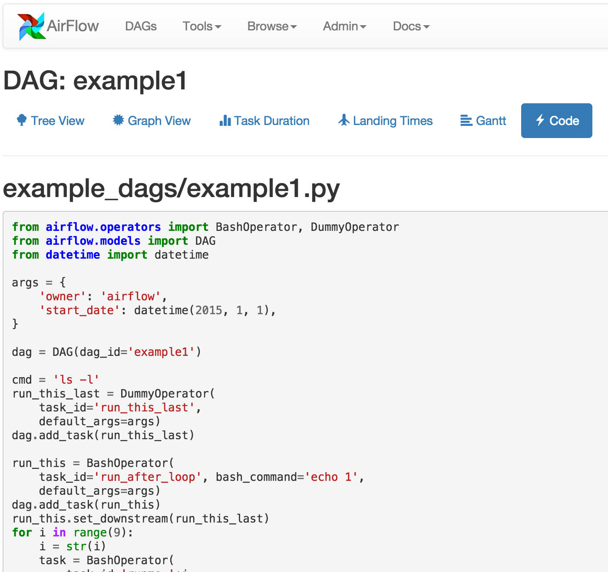
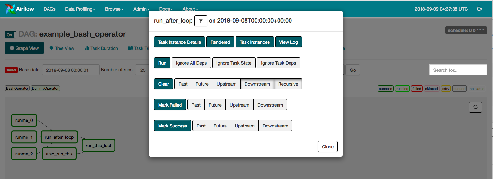

UI / Screenshots
=================
The Airflow UI make it easy to monitor and troubleshoot your data pipelines.
Here's a quick overview of some of the features and visualizations you
can find in the Airflow UI.

DAGs View
.........
List of the DAGs in your environment, and a set of shortcuts to useful pages.
You can see exactly how many tasks succeeded, failed and are currently
running at a glance.

------------

------------

Tree View
.........
A tree representation of the DAG that spans across time. If a pipeline is 
late, you can quickly see where the different steps are at and identify
the blocking ones.

------------

------------

Graph View
..........
The graph is perhaps the most comprehensive. Visualize your DAG's dependencies
and their current status for a specific run.

------------

------------

Gantt Chart
...........
The Gantt chart lets you analyse task duration and overlap, you can quickly
identify bottlenecks and where the bulk of the time is spent for specific
DAG runs.

------------

------------

Task Duration
.............
The duration of your different tasks over the past N runs. This view lets 
you find outliers and quickly understand where the time is spent in your
DAG, over many runs.

------------

------------

Code View
.........
Transparency is everything. While the code for your pipeline is in source
control, this is a quick way to get to the code that generates the DAG and
provide yet more context.

------------

------------

Task Instance Context Menu
.........
From the pages seen above (tree view, graph view, gantt, ...), it is always
possible to click on a task instance, and get to this rich context menu
that can take you to more detailed metadata, and perform some actions.

------------

------------
