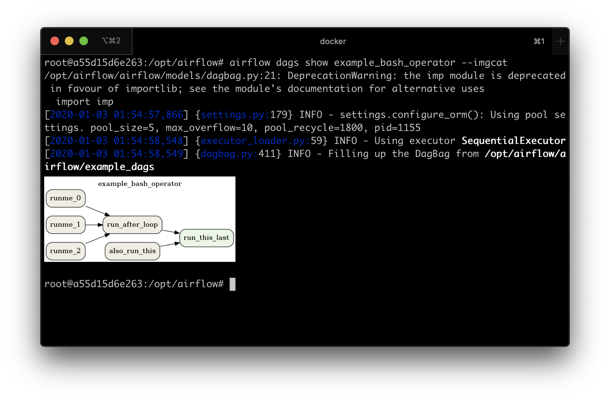

 .. Licensed to the Apache Software Foundation (ASF) under one
    or more contributor license agreements.  See the NOTICE file
    distributed with this work for additional information
    regarding copyright ownership.  The ASF licenses this file
    to you under the Apache License, Version 2.0 (the
    "License"); you may not use this file except in compliance
    with the License.  You may obtain a copy of the License at

 ..   http://www.apache.org/licenses/LICENSE-2.0

 .. Unless required by applicable law or agreed to in writing,
    software distributed under the License is distributed on an
    "AS IS" BASIS, WITHOUT WARRANTIES OR CONDITIONS OF ANY
    KIND, either express or implied.  See the License for the
    specific language governing permissions and limitations
    under the License.

Using the Command Line Interface
================================

This document is meant to give an overview of all common tasks while using the CLI.

.. note::
    For more information on CLI commands, see :doc:`cli-ref`

Set Up connection to a remote Airflow instance
----------------------------------------------

For some functions the CLI can use :doc:`the REST API <rest-api-ref>`. To configure the CLI to use the API
when available configure as follows:

.. code-block:: ini

    [cli]
    api_client = airflow.api.client.json_client
    endpoint_url = http://<WEBSERVER>:<PORT>

Set Up Bash/Zsh Completion
--------------------------

When using bash (or ``zsh``) as your shell, ``airflow`` can use
`argcomplete <https://argcomplete.readthedocs.io/>`_ for auto-completion.

For `global activation <https://github.com/kislyuk/argcomplete#activating-global-completion>`_ of all argcomplete enabled python applications run:

.. code-block:: bash

  sudo activate-global-python-argcomplete

For permanent (but not global) airflow activation, use:

.. code-block:: bash

  register-python-argcomplete airflow >> ~/.bashrc

For one-time activation of argcomplete for airflow only, use:

.. code-block:: bash

  eval "$(register-python-argcomplete airflow)"

.. image:: img/cli_completion.gif

If you’re using ``zsh``, add the following to your ``.zshrc``:

.. code-block:: bash

  autoload bashcompinit
  bashcompinit
  eval "$(register-python-argcomplete airflow)"

Creating a Connection
---------------------

For information on creating connection using CLI, see :ref:`connection/cli`

Exporting DAGs structure to images
----------------------------------

The application has the functionality of saving DAG to image file. You can attach them to the documentation
for the documentation, or send another without having to send the DAG file and install the application at
the other person. However, you need to have `Graphviz <https://graphviz.gitlab.io/download/>`_ installed.

For example, if you want to export ``example_complex`` DAG then you can use the following command:

.. code-block:: bash

  airflow dag show example_complex

After passing the ``dag_id`` parameter itself, the command will print rendered DAG structure (similar to :ref:`Graph View <ui:graph-view>`)
to the screen in the DOT format.

It is possible to save the file in a different format. To do this, add the switch ``--save [filename].[format]``.
If you want to save files as PNG, you can use the following command:

.. code-block:: bash

  airflow dags show example_complex --save example_complex.png

An example image file may look as follow:

.. figure:: img/usage_cli_export.png
    :width: 100%

    Example DAG representation

The following file formats are supported:

 * ``bmp``,
 * ``canon``, ``dot``, ``gv``, ``xdot``, ``xdot1.2``, ``xdot1.4``,
 * ``cgimage``,
 * ``cmap``,
 * ``eps``,
 * ``exr``,
 * ``fig``,
 * ``gd``, ``gd2``,
 * ``gif``,
 * ``gtk``,
 * ``ico``,
 * ``imap``, ``cmapx``,
 * ``imap_np``, ``cmapx_np``,
 * ``ismap``,
 * ``jp2``,
 * ``jpg``, ``jpeg``, ``jpe``,
 * ``json``, ``json0``, ``dot_json``, ``xdot_json``,
 * ``pct``, ``pict``,
 * ``pdf``,
 * ``pic``,
 * ``plain``, ``plain-ext``,
 * ``png``,
 * ``pov``,
 * ``ps``,
 * ``ps2``,
 * ``psd``,
 * ``sgi``,
 * ``svg``, ``svgz``,
 * ``tga``,
 * ``tif``, ``tiff``,
 * ``tk``,
 * ``vml``, ``vmlz``,
 * ``vrml``,
 * ``wbmp``,
 * ``webp``,
 * ``xlib``,
 * ``x11``.

By default, the application search for DAGs in the directory specified in ``dags_folder`` option in
`[core]` section specified in the file ``airflow.cfg``. You can change it with the ``--subdir`` switch.

Display DAGs structure
----------------------

Sometimes you will work on DAGs that contain complex dependencies. It is helpful then to preview
the DAG to see if it is correct.

If you have macOS, you can use `iTerm2 <https://iterm2.com/>`__ together with
the `imgcat <https://www.iterm2.com/documentation-images.html>`__ script to display the DAG structure in the
console. You also need to have `Graphviz <https://graphviz.gitlab.io/download/>`_ installed.

Other terminals do not support the display of high-quality graphics. You can convert the image to a text
form, but its resolution will prevent you from reading it.

To do this, you should use the ``--imgcat`` switch in the ``airflow dags show`` command. For example, if you
want to display ``example_bash_operator`` DAG  then you can use the following command:

.. code-block:: bash

  airflow dag show example_bash_operator --imgcat

You will see a similar result as in the screenshot below.

    Preview of DAG in iTerm2
