Apache Spark provides a suite of web user interfaces (UIs) that you can use
to monitor the status and resource consumption of your Spark cluster.

**Table of Contents**

* This will become a table of contents (this text will be scraped).
{:toc}

## Overview

The Web UI is built into every Spark application: while the application is
running, it serves a set of web pages that let you inspect what is happening
inside it. Typical uses include monitoring a running job, diagnosing a
failure, analyzing the execution plan of a slow SQL query, and checking how
memory and tasks are distributed across executors.

By default the Web UI is available at `http://<driver-host>:4040`. When that
port is already in use (for example, when several Spark applications run on
the same host), Spark tries `4041`, `4042`, and so on until it finds a free
port, and logs the chosen port at startup. You can override the default port
with `spark.ui.port`, and tune other UI behavior through the `spark.ui.*`
properties documented in the [Configuration](configuration.html#spark-ui)
reference.

The Web UI is tied to the lifetime of the application: once it exits, the UI
is no longer reachable. To inspect an application after it has finished,
enable event logging and run the Spark History Server, which reconstructs an
equivalent UI from the persisted event log; see
[Monitoring and Instrumentation](monitoring.html) for setup details.

The remaining sections walk through each tab in the Web UI's top navigation
bar.

## Jobs Tab
The Jobs tab displays a summary page of all jobs in the Spark application and a details page
for each job. The summary page shows high-level information, such as the status, duration, and
progress of all jobs and the overall event timeline. When you click on a job on the summary
page, you see the details page for that job. The details page further shows the event timeline,
DAG visualization, and all stages of the job.

The information displayed at the top of the page includes:

* Scheduling mode: See [job scheduling](job-scheduling.html#configuring-pool-properties)
* Number of jobs per status: Active, Completed, Failed
* Event timeline: Displays in chronological order the events related to the executors (added, removed) and the jobs
* Details of jobs grouped by status: Displays detailed information of the jobs including Job ID, description (with a link to detailed job page), submitted time, duration, stages summary and tasks progress bar

The current user, application start time, and total uptime are shown in the footer at the
bottom of every page.

  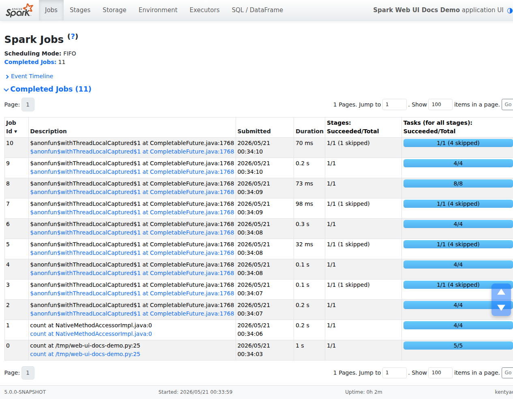

### Jobs detail

This page displays the details of a specific job identified by its job ID.

* Job Status: (running, succeeded, failed)
* Number of stages per status (active, pending, completed, skipped, failed)
* Associated SQL Query: Link to the SQL tab for this job
* Event timeline: Displays in chronological order the events related to the executors (added, removed) and the stages of the job
* DAG visualization: Visual representation of the directed acyclic graph of this job where vertices represent the RDDs or DataFrames and the edges represent an operation to be applied on RDD
* List of stages (grouped by state active, pending, completed, skipped, and failed), with columns including Stage ID, description, submitted timestamp, duration, tasks progress bar, **Input** (bytes read from storage), **Output** (bytes written to storage), **Shuffle read** (total shuffle bytes and records read locally and from remote executors), and **Shuffle write** (bytes and records written to disk for a future shuffle)

  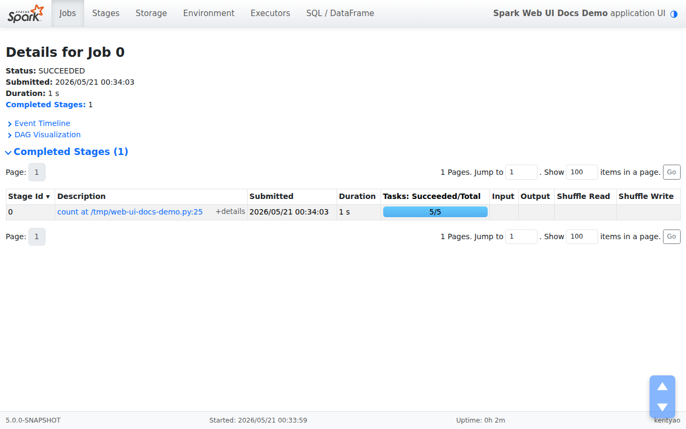

## Stages Tab

The Stages tab displays a summary page that shows the current state of all stages of all jobs in
the Spark application.

At the top of the page is a summary with the count of all stages by status (active, pending,
completed, skipped, and failed). In [Fair scheduling mode](job-scheduling.html#scheduling-within-an-application)
a table of [pool properties](job-scheduling.html#configuring-pool-properties) is also shown.

Below the summary are the stages, grouped by status (active, pending, completed, skipped, failed).
An active stage shows a small **(kill)** link next to its description; clicking it asks Spark
to cancel that stage. Only failed stages show the failure reason. Click a stage's description
to open its [Stage detail](#stage-detail) page.

  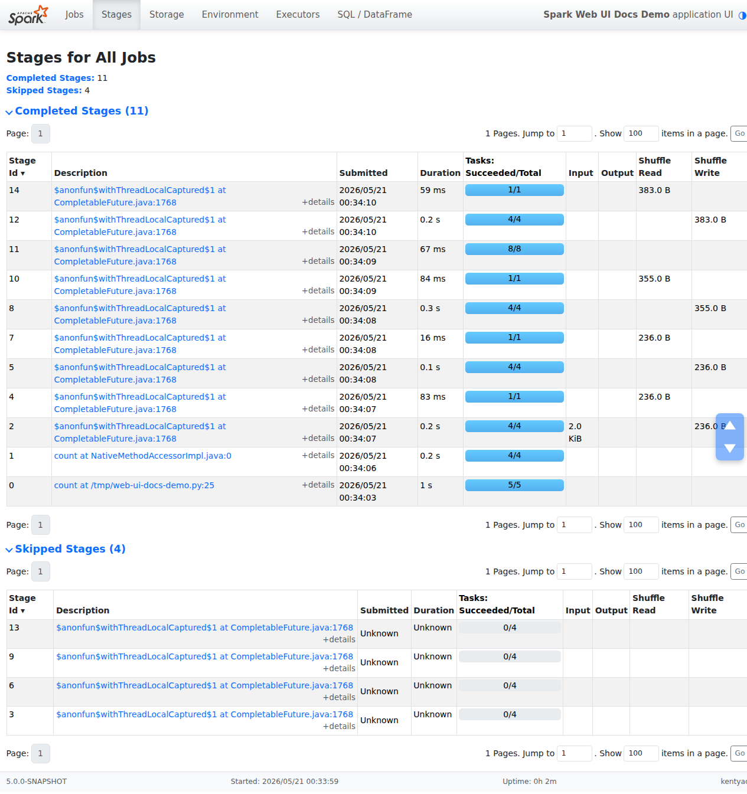

### Stage detail

The stage detail page begins with information like total time across all tasks,
[Locality level summary](tuning.html#data-locality),
[Shuffle Read Size / Records](rdd-programming-guide.html#shuffle-operations) and Associated Job IDs.

It also shows a visual representation of the directed acyclic graph (DAG) of this stage,
where vertices represent the RDDs or DataFrames and the edges represent an operation to be
applied. Nodes are grouped by operation scope in the DAG visualization and labelled with the
operation scope name (`BatchScan`, `WholeStageCodegen`, `Exchange`, etc).
Notably, whole-stage code generation operations are also annotated with the code generation id.
For stages belonging to Spark DataFrame or SQL execution, this allows you to cross-reference
stage execution details to the relevant query in the [SQL Tab](#sql-tab).

Summary metrics for all tasks are represented in a table and in a timeline:

* **Task deserialization time** is the time spent deserializing the task closure on an executor before it can run.
* **Duration of tasks**.
* **GC time** is the total JVM garbage collection time.
* **Result serialization time** is the time spent serializing the task result on an executor before sending it back to the driver.
* **Getting result time** is the time that the driver spends fetching task results from workers.
* **Scheduler delay** is the time the task waits to be scheduled for execution.
* **Peak execution memory** is the maximum memory used by the internal data structures created during shuffles, aggregations and joins.
* **Shuffle Read Size / Records**. Total shuffle bytes read, includes both data read locally and data read from remote executors.
* **Shuffle Read Fetch Wait Time** is the time that tasks spent blocked waiting for shuffle data to be read from remote machines.
* **Shuffle Remote Reads** is the total shuffle bytes read from remote executors.
* **Shuffle Write Time** is the time that tasks spent writing shuffle data.
* **Shuffle spill (memory)** is the size of the deserialized form of the shuffled data in memory.
* **Shuffle spill (disk)** is the size of the serialized form of the data on disk.

The same metrics are also shown aggregated by executor.
**[Accumulators](rdd-programming-guide.html#accumulators)** are shared variables that can be
updated inside transformations; only named accumulators are displayed here. Finally, a tasks
table shows the same information broken down per task, with links to executor logs and the task
attempt number for failures.

  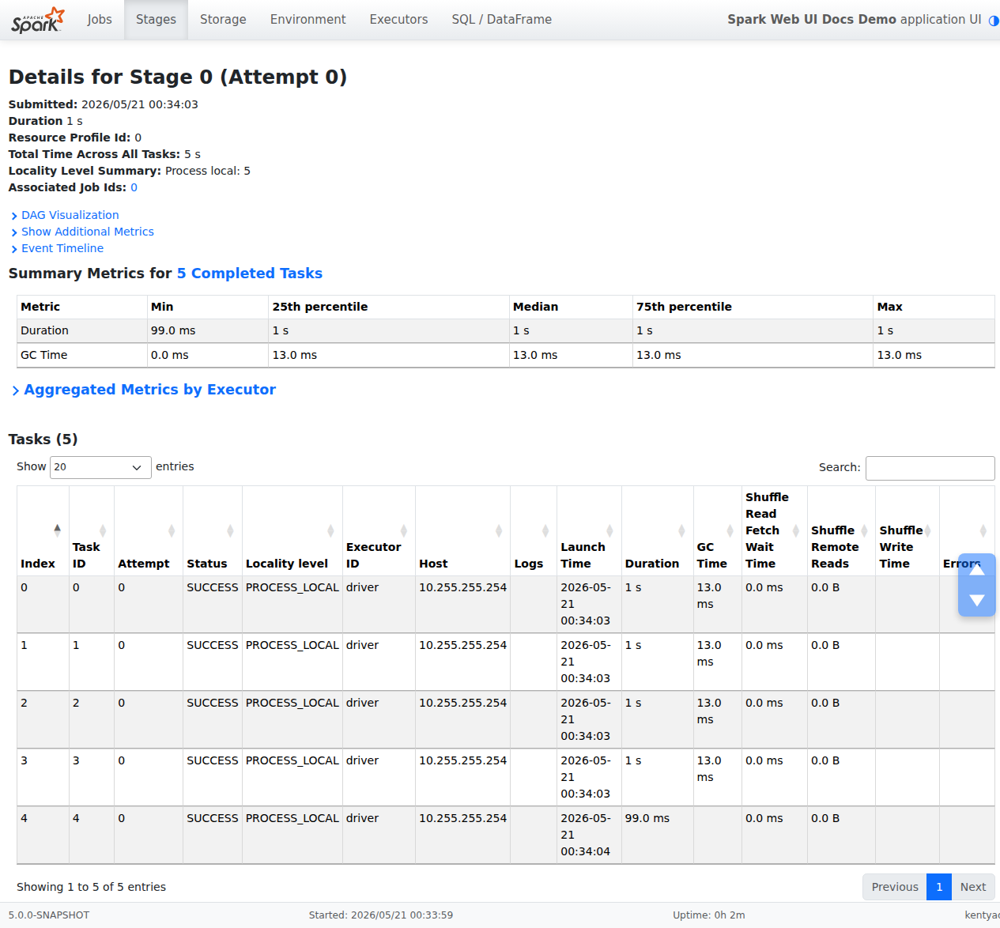

## Storage Tab
The Storage tab displays the persisted RDDs and DataFrames, if any, in the application. The summary
page shows the storage levels, sizes and partitions of all RDDs, and the details page shows the
sizes and using executors for all partitions in an RDD or DataFrame.


scala> import org.apache.spark.storage.StorageLevel._
import org.apache.spark.storage.StorageLevel._

scala> val rdd = sc.range(0, 100, 1, 5).setName("rdd")
rdd: org.apache.spark.rdd.RDD[Long] = rdd MapPartitionsRDD[1] at range at <console>:27

scala> rdd.persist(MEMORY_ONLY_SER)
res0: rdd.type = rdd MapPartitionsRDD[1] at range at <console>:27

scala> rdd.count
res1: Long = 100

scala> val df = Seq((1, "andy"), (2, "bob"), (2, "andy")).toDF("count", "name")
df: org.apache.spark.sql.DataFrame = [count: int, name: string]

scala> df.persist(DISK_ONLY)
res2: df.type = [count: int, name: string]

scala> df.count
res3: Long = 3


  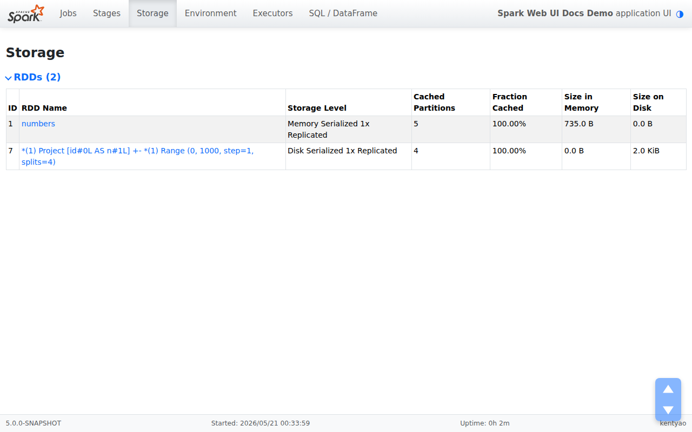
  <!-- Images are downsized intentionally to improve quality on retina displays -->

After running the above example, we can find two RDDs listed in the Storage tab. Basic information like
storage level, number of partitions and memory overhead are provided. Note that the newly persisted RDDs
or DataFrames are not shown in the tab before they are materialized. To monitor a specific RDD or DataFrame,
make sure an action operation has been triggered.

  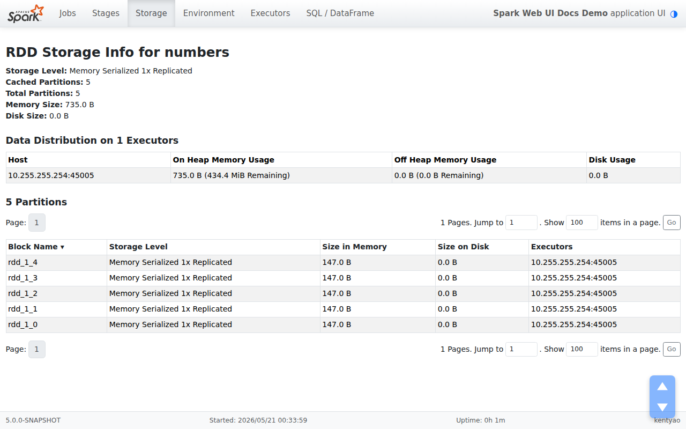
  <!-- Images are downsized intentionally to improve quality on retina displays -->

You can click the RDD name 'rdd' for obtaining the details of data persistence, such as the data
distribution on the cluster.

## Environment Tab

The Environment tab is the place to verify that your Spark application is
running with the configuration you expect. It groups the environment and
configuration information into a set of sub-tabs along the left side of the
page; clicking one switches the panel on the right.

  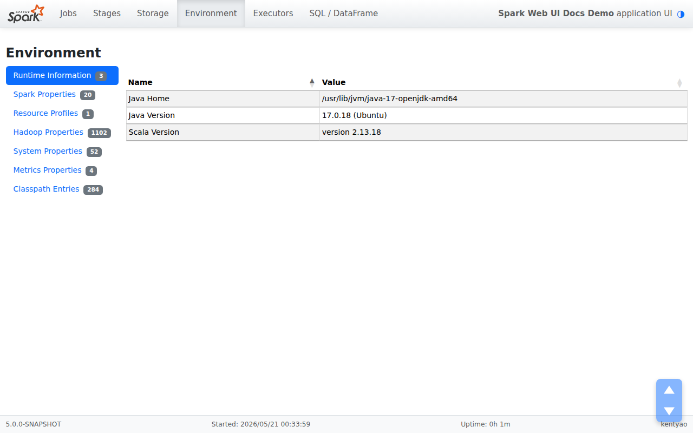
  <!-- Images are downsized intentionally to improve quality on retina displays -->

The sub-tabs are:

* **Runtime Information** &mdash; JVM, Scala, and other
  [runtime properties](configuration.html#runtime-environment) of the driver.
* **Spark Properties** &mdash; the effective
  [application properties](configuration.html#application-properties)
  (such as `spark.app.name` and `spark.driver.memory`). Note that
  [`spark.hadoop.*`](configuration.html#execution-behavior) properties are
  listed here, not under Hadoop Properties.
* **Resource Profiles** &mdash; CPU, memory, and accelerator resource
  requests for each [resource profile](configuration.html#stage-level-scheduling-overview)
  in use.
* **Hadoop Properties** &mdash; values loaded from Hadoop and YARN configuration
  files.
* **System Properties** &mdash; the underlying JVM system properties.
* **Metrics Properties** &mdash; the configuration loaded for the
  [metrics system](monitoring.html#metrics).
* **Classpath Entries** &mdash; the classes loaded into the driver, broken
  down by source. Handy when tracking down class conflicts.

## Executors Tab
The Executors tab lists every executor that has been allocated to the
application, including the driver. Each row shows resource usage (memory,
disk, cores), storage memory reserved for cached data, task counts, shuffle
totals, and performance signals such as
[GC time](tuning.html#garbage-collection-tuning).

  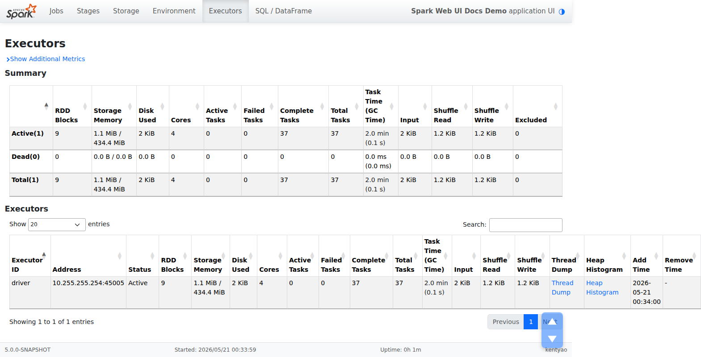
  <!-- Images are downsized intentionally to improve quality on retina displays -->

Each row carries a set of detail links &mdash; **Thread Dump**, **Heap
Histogram**, and **Flame Graph** &mdash; that open the corresponding live
data for that executor in a side panel without leaving the page. The panel
can be resized by dragging its left edge. The **stderr** and **stdout**
links open the executor's log files in a new view; the exact location of
those logs depends on your cluster manager (see
[Monitoring and Instrumentation](monitoring.html) for details).

## SQL Tab

### Query Listing

The SQL tab lists all SQL and DataFrame queries submitted to the Spark
application. Any DataFrame action that triggers execution (such as `count`,
`show`, or `write`) shows up here, not only queries written as SQL strings.
Here is a short example that produces a few entries:


df = spark.createDataFrame([(1, "andy"), (2, "bob"), (2, "andy")], ["count", "name"])
df.count()
df.createOrReplaceTempView("df")
spark.sql("SELECT name, SUM(count) FROM df GROUP BY name").show()


  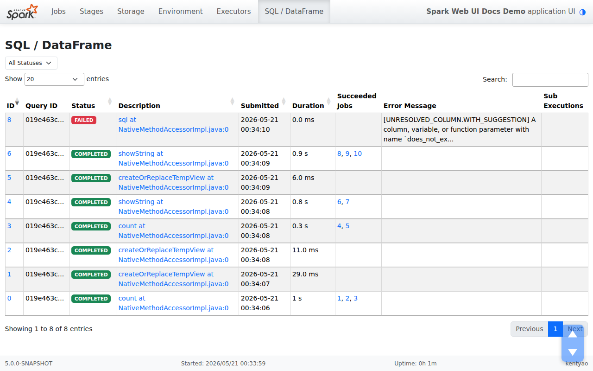
  <!-- Images are downsized intentionally to improve quality on retina displays -->

The listing supports sorting by column, searching, filtering by status,
and pagination, which makes it easy to locate a specific query in
long-running applications.

### SQL Plan Visualization

Each query in the listing has a graph view of its operators. Every node
shows the operator name together with its metrics inline, and the edges
follow the data flow. You can pan and zoom the graph to navigate large
plans, search for a node by name, and click any node to open a side panel
with its full details.

  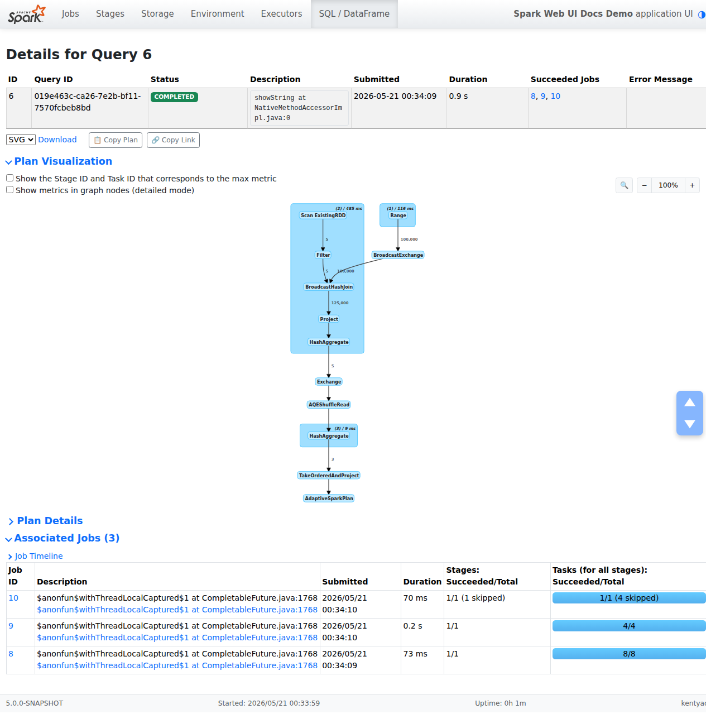
  <!-- Images are downsized intentionally to improve quality on retina displays -->

### Execution Detail Page

The execution detail page, opened by clicking the **ID** or **Description**
link of any row in the query listing, gathers everything recorded for a
single query. The header lists the
query's submission time, duration, status, description, and the jobs and
stages associated with it. The
[SQL Plan Visualization](#sql-plan-visualization) shows the graph of
operators. At the bottom of the page, a "Details" link expands the full
text of the parsed, analyzed, and optimized logical plans together with
the physical plan, useful when you want to see how Spark transformed your
query during planning.

### SQL metrics

Each node in the [SQL Plan Visualization](#sql-plan-visualization) carries
its own metrics inline. These metrics are useful when you want to dive into
the execution details of each operator. For example, `number of output rows`
shows how many rows pass through a `Filter` operator, and
`shuffle bytes written` in an `Exchange` shows how much data the
shuffle wrote.

Here is the list of SQL metrics:

<table>
<thead><tr><th>SQL metrics</th><th>Meaning</th><th>Operators</th></tr></thead>
<tr><td> <code>number of output rows</code> </td><td> the number of output rows of the operator </td><td> Aggregate operators, Join operators, Sample, Range, Scan operators, Filter, etc.</td></tr>
<tr><td> <code>data size</code> </td><td> the size of broadcast/shuffled/collected data of the operator </td><td> BroadcastExchange, ShuffleExchange, Subquery </td></tr>
<tr><td> <code>time to collect</code> </td><td> the time spent on collecting data </td><td> BroadcastExchange, Subquery </td></tr>
<tr><td> <code>scan time</code> </td><td> the time spent on scanning data </td><td> ColumnarBatchScan, FileSourceScan </td></tr>
<tr><td> <code>metadata time</code> </td><td> the time spent on getting metadata like number of partitions, number of files </td><td> FileSourceScan </td></tr>
<tr><td> <code>shuffle bytes written</code> </td><td> the number of bytes written </td><td> CollectLimit, TakeOrderedAndProject, ShuffleExchange </td></tr>
<tr><td> <code>shuffle records written</code> </td><td> the number of records written </td><td> CollectLimit, TakeOrderedAndProject, ShuffleExchange </td></tr>
<tr><td> <code>shuffle write time</code> </td><td> the time spent on shuffle writing </td><td> CollectLimit, TakeOrderedAndProject, ShuffleExchange </td></tr>
<tr><td> <code>remote blocks read</code> </td><td> the number of blocks read remotely </td><td> CollectLimit, TakeOrderedAndProject, ShuffleExchange</td></tr>
<tr><td> <code>remote bytes read</code> </td><td> the number of bytes read remotely </td><td> CollectLimit, TakeOrderedAndProject, ShuffleExchange </td></tr>
<tr><td> <code>remote bytes read to disk</code> </td><td> the number of bytes read from remote to local disk </td><td> CollectLimit, TakeOrderedAndProject, ShuffleExchange </td></tr>
<tr><td> <code>local blocks read</code> </td><td> the number of blocks read locally </td><td> CollectLimit, TakeOrderedAndProject, ShuffleExchange </td></tr>
<tr><td> <code>local bytes read</code> </td><td> the number of bytes read locally </td><td> CollectLimit, TakeOrderedAndProject, ShuffleExchange </td></tr>
<tr><td> <code>fetch wait time</code> </td><td> the time spent on fetching data (local and remote)</td><td> CollectLimit, TakeOrderedAndProject, ShuffleExchange </td></tr>
<tr><td> <code>records read</code> </td><td> the number of read records </td><td> CollectLimit, TakeOrderedAndProject, ShuffleExchange </td></tr>
<tr><td> <code>sort time</code> </td><td> the time spent on sorting </td><td> Sort </td></tr>
<tr><td> <code>peak memory</code> </td><td> the peak memory usage in the operator </td><td> Sort, HashAggregate </td></tr>
<tr><td> <code>spill size</code> </td><td> number of bytes spilled to disk from memory in the operator </td><td> Sort, HashAggregate </td></tr>
<tr><td> <code>time in aggregation build</code> </td><td> the time spent on aggregation </td><td> HashAggregate, ObjectHashAggregate </td></tr>
<tr><td> <code>avg hash probe bucket list iters</code> </td><td> the average bucket list iterations per lookup during aggregation </td><td> HashAggregate </td></tr>
<tr><td> <code>data size of build side</code> </td><td> the size of built hash map </td><td> ShuffledHashJoin </td></tr>
<tr><td> <code>time to build hash map</code> </td><td> the time spent on building hash map </td><td> ShuffledHashJoin </td></tr>
<tr><td> <code>task commit time</code> </td><td> the time spent on committing the output of a task after the writes succeed </td><td> any write operation on a file-based table </td></tr>
<tr><td> <code>job commit time</code> </td><td> the time spent on committing the output of a job after the writes succeed </td><td> any write operation on a file-based table </td></tr>
<tr><td> <code>data sent to Python workers</code> </td><td> the number of bytes of serialized data sent to the Python workers </td><td> Python UDFs, Pandas UDFs, Pandas Functions API and Python Data Source </td></tr>
<tr><td> <code>data returned from Python workers</code> </td><td> the number of bytes of serialized data received back from the Python workers </td><td> Python UDFs, Pandas UDFS, Pandas Functions API and Python Data Source </td></tr>
</table>

## Structured Streaming Tab
When running Structured Streaming jobs in micro-batch mode, a Structured Streaming tab will be
available on the Web UI. The overview page displays some brief statistics for running and completed
queries. Also, you can check the latest exception of a failed query. For detailed statistics, please
click a "run id" in the tables.

  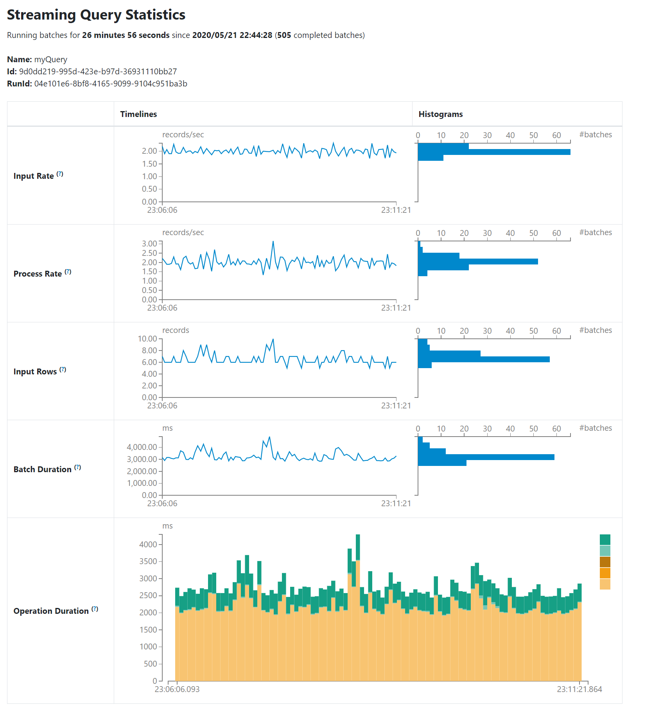
  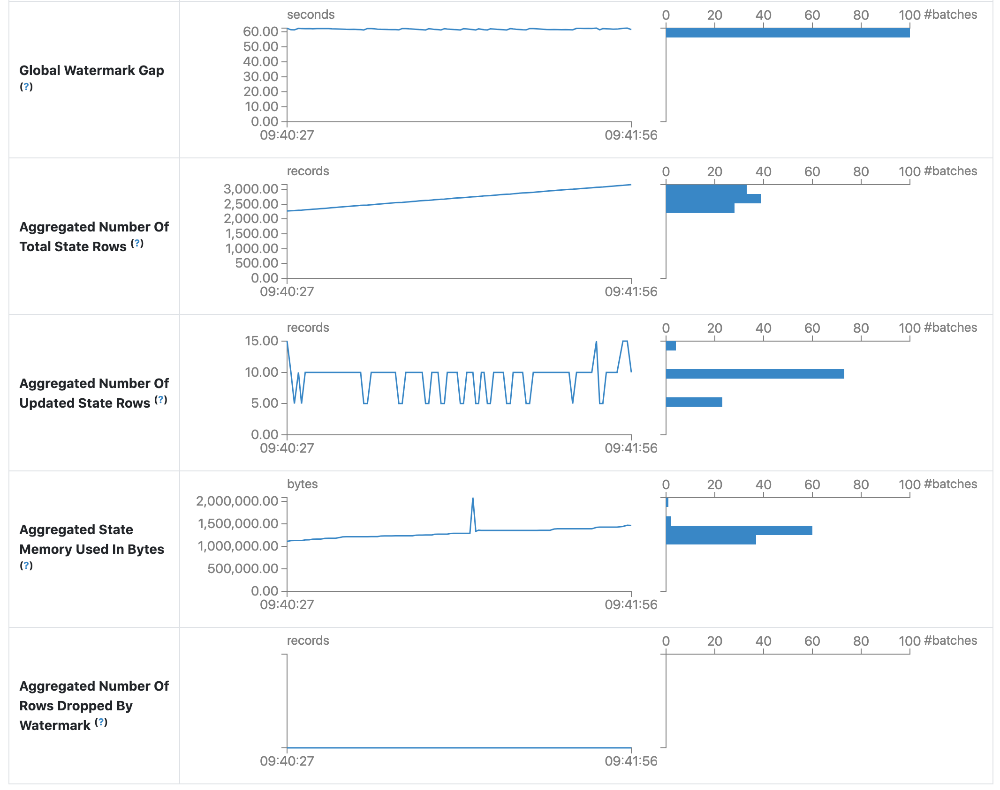

The statistics page displays some useful metrics for insight into the status of your streaming
queries. Currently, it contains the following metrics.

* **Input Rate.** The aggregate (across all sources) rate of data arriving.
* **Process Rate.** The aggregate (across all sources) rate at which Spark is processing data.
* **Input Rows.** The aggregate (across all sources) number of records processed in a trigger.
* **Batch Duration.** The process duration of each batch.
* **Operation Duration.** The amount of time taken to perform various operations in milliseconds.
The tracked operations are listed as follows.
    * addBatch: Time taken to read the micro-batch's input data from the sources, process it, and write the batch's output to the sink. This should take the bulk of the micro-batch's time.
    * getBatch: Time taken to prepare the logical query to read the input of the current micro-batch from the sources.
    * latestOffset & getOffset: Time taken to query the maximum available offset for this source.
    * queryPlanning: Time taken to generates the execution plan.
    * walCommit: Time taken to write the offsets to the metadata log.
* **Global Watermark Gap.** The gap between batch timestamp and global watermark for the batch.
* **Aggregated Number Of Total State Rows.** The aggregated number of total state rows.
* **Aggregated Number Of Updated State Rows.** The aggregated number of updated state rows.
* **Aggregated State Memory Used In Bytes.** The aggregated state memory used in bytes.
* **Aggregated Number Of State Rows Dropped By Watermark.** The aggregated number of state rows dropped by watermark.

As an early-release version, the statistics page is still under development and will be improved in
future releases.

## Streaming (DStreams) Tab
The web UI includes a Streaming tab if the application uses Spark Streaming with DStream API.
This tab displays scheduling delay and processing time for each micro-batch in the data stream,
which can be useful for troubleshooting the streaming application.

## JDBC/ODBC Server Tab
We can see this tab when Spark is running as a [distributed SQL engine](sql-distributed-sql-engine.html). It shows information about sessions and submitted SQL operations.

The first section of the page displays general information about the JDBC/ODBC server: start time and uptime.

  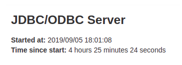

The second section contains information about active and finished sessions.
* **User** and **IP** of the connection.
* **Session id** link to access to session info.
* **Start time**, **finish time** and **duration** of the session.
* **Total execute** is the number of operations submitted in this session.

  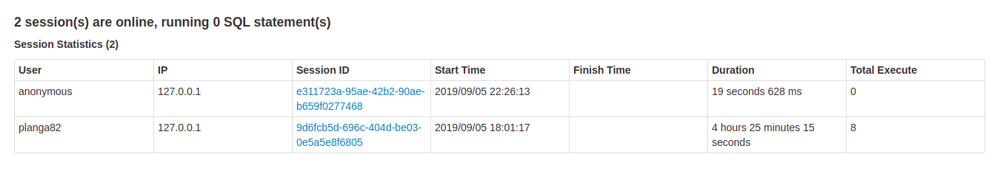

The third section has the SQL statistics of the submitted operations.
* **User** that submit the operation.
* **Job id** link to [jobs tab](web-ui.html#jobs-tab).
* **Group id** of the query that group all jobs together. An application can cancel all running jobs using this group id.
* **Start time** of the operation.
* **Finish time** of the execution, before fetching the results.
* **Close time** of the operation after fetching the results.
* **Execution time** is the difference between finish time and start time.
* **Duration time** is the difference between close time and start time.
* **Statement** is the operation being executed.
* **State** of the process.
    * _Started_, first state, when the process begins.
    * _Compiled_, execution plan generated.
    * _Failed_, final state when the execution failed or finished with error.
    * _Canceled_, final state when the execution is canceled.
    * _Finished_ processing and waiting to fetch results.
    * _Closed_, final state when client closed the statement.
* **Detail** of the execution plan with parsed logical plan, analyzed logical plan, optimized logical plan and physical plan or errors in the SQL statement.

  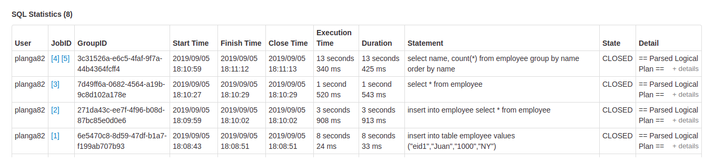

