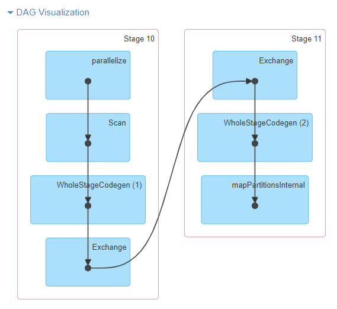
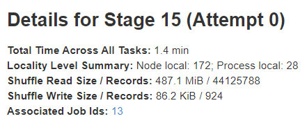
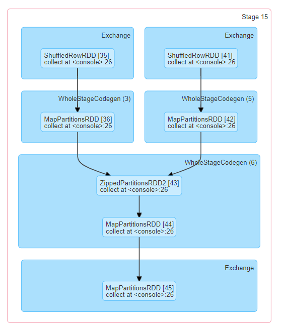
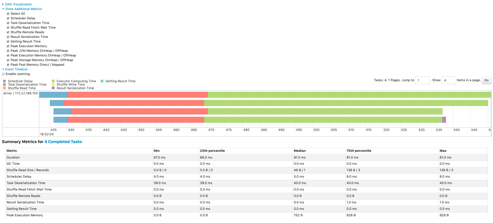
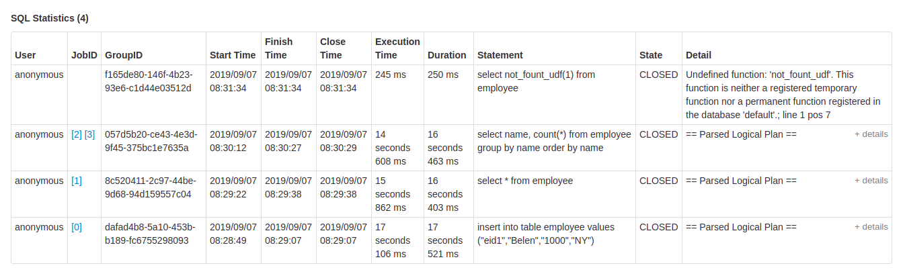

Apache Spark provides a suite of web user interfaces (UIs) that you can use
to monitor the status and resource consumption of your Spark cluster.

**Table of Contents**

* This will become a table of contents (this text will be scraped).
{:toc}

## Jobs Tab
The Jobs tab displays a summary page of all jobs in the Spark application and a details page
for each job. The summary page shows high-level information, such as the status, duration, and
progress of all jobs and the overall event timeline. When you click on a job on the summary
page, you see the details page for that job. The details page further shows the event timeline,
DAG visualization, and all stages of the job.

The information that is displayed in this section is
* User: Current Spark user
* Total uptime: Time since Spark application started
* Scheduling mode: See [job scheduling](job-scheduling.html#configuring-pool-properties)
* Number of jobs per status: Active, Completed, Failed

  

* Event timeline: Displays in chronological order the events related to the executors (added, removed) and the jobs

  

* Details of jobs grouped by status: Displays detailed information of the jobs including Job ID, description (with a link to detailed job page), submitted time, duration, stages summary and tasks progress bar

  

When you click on a specific job, you can see the detailed information of this job.

### Jobs detail

This page displays the details of a specific job identified by its job ID.
* Job Status: (running, succeeded, failed)
* Number of stages per status (active, pending, completed, skipped, failed)
* Associated SQL Query: Link to the sql tab for this job
* Event timeline: Displays in chronological order the events related to the executors (added, removed) and the stages of the job

  

* DAG visualization: Visual representation of the directed acyclic graph of this job where vertices represent the RDDs or DataFrames and the edges represent an operation to be applied on RDD.
* An example of DAG visualization for `sc.parallelize(1 to 100).toDF.count()`

  

* List of stages (grouped by state active, pending, completed, skipped, and failed)
    * Stage ID
    * Description of the stage
    * Submitted timestamp
    * Duration of the stage
    * Tasks progress bar
    * Input: Bytes read from storage in this stage
    * Output: Bytes written in storage in this stage
    * Shuffle read: Total shuffle bytes and records read, includes both data read locally and data read from remote executors
    * Shuffle write: Bytes and records written to disk in order to be read by a shuffle in a future stage

  

## Stages Tab

The Stages tab displays a summary page that shows the current state of all stages of all jobs in
the Spark application.

At the beginning of the page is the summary with the count of all stages by status (active, pending, completed, skipped, and failed)

  

In [Fair scheduling mode](job-scheduling.html#scheduling-within-an-application) there is a table that displays [pools properties](job-scheduling.html#configuring-pool-properties)

  

After that are the details of stages per status (active, pending, completed, skipped, failed). In active stages, it's possible to kill the stage with the kill link. Only in failed stages, failure reason is shown. Task detail can be accessed by clicking on the description.

  

### Stage detail
The stage detail page begins with information like total time across all tasks, [Locality level summary](tuning.html#data-locality), [Shuffle Read Size / Records](rdd-programming-guide.html#shuffle-operations) and Associated Job IDs.

  

There is also a visual representation of the directed acyclic graph (DAG) of this stage, where vertices represent the RDDs or DataFrames and the edges represent an operation to be applied.
Nodes are grouped by operation scope in the DAG visualization and labelled with the operation scope name (BatchScan, WholeStageCodegen, Exchange, etc).
Notably, Whole Stage Code Generation operations are also annotated with the code generation id. For stages belonging to Spark DataFrame or SQL execution, this allows to cross-reference Stage execution details to the relevant details in the Web-UI SQL Tab page where SQL plan graphs and execution plans are reported.

  

Summary metrics for all task are represented in a table and in a timeline.
* **[Tasks deserialization time](configuration.html#compression-and-serialization)**
* **Duration of tasks**.
* **GC time** is the total JVM garbage collection time.
* **Result serialization time** is the time spent serializing the task result on an executor before sending it back to the driver.
* **Getting result time** is the time that the driver spends fetching task results from workers.
* **Scheduler delay** is the time the task waits to be scheduled for execution.
* **Peak execution memory** is the maximum memory used by the internal data structures created during shuffles, aggregations and joins.
* **Shuffle Read Size / Records**. Total shuffle bytes read, includes both data read locally and data read from remote executors.
* **Shuffle Read Fetch Wait Time** is the time that tasks spent blocked waiting for shuffle data to be read from remote machines.
* **Shuffle Remote Reads** is the total shuffle bytes read from remote executors.
* **Shuffle Write Time** is the time that tasks spent writing shuffle data.
* **Shuffle spill (memory)** is the size of the deserialized form of the shuffled data in memory.
* **Shuffle spill (disk)** is the size of the serialized form of the data on disk.

  

Aggregated metrics by executor show the same information aggregated by executor.

  

**[Accumulators](rdd-programming-guide.html#accumulators)** are a type of shared variables. It provides a mutable variable that can be updated inside of a variety of transformations. It is possible to create accumulators with and without name, but only named accumulators are displayed.

  

Tasks details basically includes the same information as in the summary section but detailed by task. It also includes links to review the logs and the task attempt number if it fails for any reason. If there are named accumulators, here it is possible to see the accumulator value at the end of each task.

  

## Storage Tab
The Storage tab displays the persisted RDDs and DataFrames, if any, in the application. The summary
page shows the storage levels, sizes and partitions of all RDDs, and the details page shows the
sizes and using executors for all partitions in an RDD or DataFrame.


scala> import org.apache.spark.storage.StorageLevel._
import org.apache.spark.storage.StorageLevel._

scala> val rdd = sc.range(0, 100, 1, 5).setName("rdd")
rdd: org.apache.spark.rdd.RDD[Long] = rdd MapPartitionsRDD[1] at range at <console>:27

scala> rdd.persist(MEMORY_ONLY_SER)
res0: rdd.type = rdd MapPartitionsRDD[1] at range at <console>:27

scala> rdd.count
res1: Long = 100

scala> val df = Seq((1, "andy"), (2, "bob"), (2, "andy")).toDF("count", "name")
df: org.apache.spark.sql.DataFrame = [count: int, name: string]

scala> df.persist(DISK_ONLY)
res2: df.type = [count: int, name: string]

scala> df.count
res3: Long = 3


  
  <!-- Images are downsized intentionally to improve quality on retina displays -->

After running the above example, we can find two RDDs listed in the Storage tab. Basic information like
storage level, number of partitions and memory overhead are provided. Note that the newly persisted RDDs
or DataFrames are not shown in the tab before they are materialized. To monitor a specific RDD or DataFrame,
make sure an action operation has been triggered.

  
  <!-- Images are downsized intentionally to improve quality on retina displays -->

You can click the RDD name 'rdd' for obtaining the details of data persistence, such as the data
distribution on the cluster.

## Environment Tab
The Environment tab displays the values for the different environment and configuration variables,
including JVM, Spark, and system properties.

  
  <!-- Images are downsized intentionally to improve quality on retina displays -->

This environment page has five parts. It is a useful place to check whether your properties have
been set correctly.
The first part 'Runtime Information' simply contains the [runtime properties](configuration.html#runtime-environment)
like versions of Java and Scala.
The second part 'Spark Properties' lists the [application properties](configuration.html#application-properties) like
['spark.app.name'](configuration.html#application-properties) and 'spark.driver.memory'.

  
  <!-- Images are downsized intentionally to improve quality on retina displays -->

Clicking the 'Hadoop Properties' link displays properties relative to Hadoop and YARN. Note that properties like
['spark.hadoop.*'](configuration.html#execution-behavior) are shown not in this part but in 'Spark Properties'.

  
  <!-- Images are downsized intentionally to improve quality on retina displays -->

'System Properties' shows more details about the JVM.

  
  <!-- Images are downsized intentionally to improve quality on retina displays -->

The last part 'Classpath Entries' lists the classes loaded from different sources, which is very useful
to resolve class conflicts.

## Executors Tab
The Executors tab displays summary information about the executors that were created for the
application, including memory and disk usage and task and shuffle information. The Storage Memory
column shows the amount of memory used and reserved for caching data.

  
  <!-- Images are downsized intentionally to improve quality on retina displays -->

The Executors tab provides not only resource information (amount of memory, disk, and cores used by each executor)
but also performance information ([GC time](tuning.html#garbage-collection-tuning) and shuffle information).

  
  <!-- Images are downsized intentionally to improve quality on retina displays -->

Clicking the 'stderr' link of executor 0 displays detailed [standard error log](spark-standalone.html#monitoring-and-logging)
in its console.

  
  <!-- Images are downsized intentionally to improve quality on retina displays -->

Clicking the 'Thread Dump' link of executor 0 displays the thread dump of JVM on executor 0, which is pretty useful
for performance analysis.

## SQL Tab
If the application executes Spark SQL queries, the SQL tab displays information, such as the duration,
jobs, and physical and logical plans for the queries. Here we include a basic example to illustrate
this tab:

scala> val df = Seq((1, "andy"), (2, "bob"), (2, "andy")).toDF("count", "name")
df: org.apache.spark.sql.DataFrame = [count: int, name: string]

scala> df.count
res0: Long = 3

scala> df.createGlobalTempView("df")

scala> spark.sql("select name,sum(count) from global_temp.df group by name").show
+----+----------+
|name|sum(count)|
+----+----------+
|andy|         3|
| bob|         2|
+----+----------+


  
  <!-- Images are downsized intentionally to improve quality on retina displays -->

Now the above three dataframe/SQL operators are shown in the list. If we click the
'show at \<console\>: 24' link of the last query, we will see the DAG and details of the query execution.

  
  <!-- Images are downsized intentionally to improve quality on retina displays -->

The query details page displays information about the query execution time, its duration,
the list of associated jobs, and the query execution DAG.
The first block 'WholeStageCodegen (1)' compiles multiple operators ('LocalTableScan' and 'HashAggregate') together into a single Java
function to improve performance, and metrics like number of rows and spill size are listed in the block.
The annotation '(1)' in the block name is the code generation id.
The second block 'Exchange' shows the metrics on the shuffle exchange, including
number of written shuffle records, total data size, etc.

  
  <!-- Images are downsized intentionally to improve quality on retina displays -->

Clicking the 'Details' link on the bottom displays the logical plans and the physical plan, which
illustrate how Spark parses, analyzes, optimizes and performs the query.
Steps in the physical plan subject to whole stage code generation optimization, are prefixed by a star followed by
the code generation id, for example: '*(1) LocalTableScan'

### SQL metrics

The metrics of SQL operators are shown in the block of physical operators. The SQL metrics can be useful
when we want to dive into the execution details of each operator. For example, "number of output rows"
can answer how many rows are output after a Filter operator, "shuffle bytes written total" in an Exchange
operator shows the number of bytes written by a shuffle.

Here is the list of SQL metrics:

<table>
<thead><tr><th>SQL metrics</th><th>Meaning</th><th>Operators</th></tr></thead>
<tr><td> <code>number of output rows</code> </td><td> the number of output rows of the operator </td><td> Aggregate operators, Join operators, Sample, Range, Scan operators, Filter, etc.</td></tr>
<tr><td> <code>data size</code> </td><td> the size of broadcast/shuffled/collected data of the operator </td><td> BroadcastExchange, ShuffleExchange, Subquery </td></tr>
<tr><td> <code>time to collect</code> </td><td> the time spent on collecting data </td><td> BroadcastExchange, Subquery </td></tr>
<tr><td> <code>scan time</code> </td><td> the time spent on scanning data </td><td> ColumnarBatchScan, FileSourceScan </td></tr>
<tr><td> <code>metadata time</code> </td><td> the time spent on getting metadata like number of partitions, number of files </td><td> FileSourceScan </td></tr>
<tr><td> <code>shuffle bytes written</code> </td><td> the number of bytes written </td><td> CollectLimit, TakeOrderedAndProject, ShuffleExchange </td></tr>
<tr><td> <code>shuffle records written</code> </td><td> the number of records written </td><td> CollectLimit, TakeOrderedAndProject, ShuffleExchange </td></tr>
<tr><td> <code>shuffle write time</code> </td><td> the time spent on shuffle writing </td><td> CollectLimit, TakeOrderedAndProject, ShuffleExchange </td></tr>
<tr><td> <code>remote blocks read</code> </td><td> the number of blocks read remotely </td><td> CollectLimit, TakeOrderedAndProject, ShuffleExchange</td></tr>
<tr><td> <code>remote bytes read</code> </td><td> the number of bytes read remotely </td><td> CollectLimit, TakeOrderedAndProject, ShuffleExchange </td></tr>
<tr><td> <code>remote bytes read to disk</code> </td><td> the number of bytes read from remote to local disk </td><td> CollectLimit, TakeOrderedAndProject, ShuffleExchange </td></tr>
<tr><td> <code>local blocks read</code> </td><td> the number of blocks read locally </td><td> CollectLimit, TakeOrderedAndProject, ShuffleExchange </td></tr>
<tr><td> <code>local bytes read</code> </td><td> the number of bytes read locally </td><td> CollectLimit, TakeOrderedAndProject, ShuffleExchange </td></tr>
<tr><td> <code>fetch wait time</code> </td><td> the time spent on fetching data (local and remote)</td><td> CollectLimit, TakeOrderedAndProject, ShuffleExchange </td></tr>
<tr><td> <code>records read</code> </td><td> the number of read records </td><td> CollectLimit, TakeOrderedAndProject, ShuffleExchange </td></tr>
<tr><td> <code>sort time</code> </td><td> the time spent on sorting </td><td> Sort </td></tr>
<tr><td> <code>peak memory</code> </td><td> the peak memory usage in the operator </td><td> Sort, HashAggregate </td></tr>
<tr><td> <code>spill size</code> </td><td> number of bytes spilled to disk from memory in the operator </td><td> Sort, HashAggregate </td></tr>
<tr><td> <code>time in aggregation build</code> </td><td> the time spent on aggregation </td><td> HashAggregate, ObjectHashAggregate </td></tr>
<tr><td> <code>avg hash probe bucket list iters</code> </td><td> the average bucket list iterations per lookup during aggregation </td><td> HashAggregate </td></tr>
<tr><td> <code>data size of build side</code> </td><td> the size of built hash map </td><td> ShuffledHashJoin </td></tr>
<tr><td> <code>time to build hash map</code> </td><td> the time spent on building hash map </td><td> ShuffledHashJoin </td></tr>
<tr><td> <code>task commit time</code> </td><td> the time spent on committing the output of a task after the writes succeed </td><td> any write operation on a file-based table </td></tr>
<tr><td> <code>job commit time</code> </td><td> the time spent on committing the output of a job after the writes succeed </td><td> any write operation on a file-based table </td></tr>
<tr><td> <code>data sent to Python workers</code> </td><td> the number of bytes of serialized data sent to the Python workers </td><td> Python UDFs, Pandas UDFs, Pandas Functions API and Python Data Source </td></tr>
<tr><td> <code>data returned from Python workers</code> </td><td> the number of bytes of serialized data received back from the Python workers </td><td> Python UDFs, Pandas UDFS, Pandas Functions API and Python Data Source </td></tr>
</table>

## Structured Streaming Tab
When running Structured Streaming jobs in micro-batch mode, a Structured Streaming tab will be
available on the Web UI. The overview page displays some brief statistics for running and completed
queries. Also, you can check the latest exception of a failed query. For detailed statistics, please
click a "run id" in the tables.

  
  

The statistics page displays some useful metrics for insight into the status of your streaming
queries. Currently, it contains the following metrics.

* **Input Rate.** The aggregate (across all sources) rate of data arriving.
* **Process Rate.** The aggregate (across all sources) rate at which Spark is processing data.
* **Input Rows.** The aggregate (across all sources) number of records processed in a trigger.
* **Batch Duration.** The process duration of each batch.
* **Operation Duration.** The amount of time taken to perform various operations in milliseconds.
The tracked operations are listed as follows.
    * addBatch: Time taken to read the micro-batch's input data from the sources, process it, and write the batch's output to the sink. This should take the bulk of the micro-batch's time.
    * getBatch: Time taken to prepare the logical query to read the input of the current micro-batch from the sources.
    * latestOffset & getOffset: Time taken to query the maximum available offset for this source.
    * queryPlanning: Time taken to generates the execution plan.
    * walCommit: Time taken to write the offsets to the metadata log.
* **Global Watermark Gap.** The gap between batch timestamp and global watermark for the batch.
* **Aggregated Number Of Total State Rows.** The aggregated number of total state rows.
* **Aggregated Number Of Updated State Rows.** The aggregated number of updated state rows.
* **Aggregated State Memory Used In Bytes.** The aggregated state memory used in bytes.
* **Aggregated Number Of State Rows Dropped By Watermark.** The aggregated number of state rows dropped by watermark.

As an early-release version, the statistics page is still under development and will be improved in
future releases.

## Streaming (DStreams) Tab
The web UI includes a Streaming tab if the application uses Spark Streaming with DStream API.
This tab displays scheduling delay and processing time for each micro-batch in the data stream,
which can be useful for troubleshooting the streaming application.

## JDBC/ODBC Server Tab
We can see this tab when Spark is running as a [distributed SQL engine](sql-distributed-sql-engine.html). It shows information about sessions and submitted SQL operations.

The first section of the page displays general information about the JDBC/ODBC server: start time and uptime.

  

The second section contains information about active and finished sessions.
* **User** and **IP** of the connection.
* **Session id** link to access to session info.
* **Start time**, **finish time** and **duration** of the session.
* **Total execute** is the number of operations submitted in this session.

  

The third section has the SQL statistics of the submitted operations.
* **User** that submit the operation.
* **Job id** link to [jobs tab](web-ui.html#jobs-tab).
* **Group id** of the query that group all jobs together. An application can cancel all running jobs using this group id.
* **Start time** of the operation.
* **Finish time** of the execution, before fetching the results.
* **Close time** of the operation after fetching the results.
* **Execution time** is the difference between finish time and start time.
* **Duration time** is the difference between close time and start time.
* **Statement** is the operation being executed.
* **State** of the process.
    * _Started_, first state, when the process begins.
    * _Compiled_, execution plan generated.
    * _Failed_, final state when the execution failed or finished with error.
    * _Canceled_, final state when the execution is canceled.
    * _Finished_ processing and waiting to fetch results.
    * _Closed_, final state when client closed the statement.
* **Detail** of the execution plan with parsed logical plan, analyzed logical plan, optimized logical plan and physical plan or errors in the SQL statement.

  

