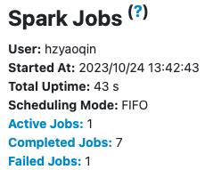
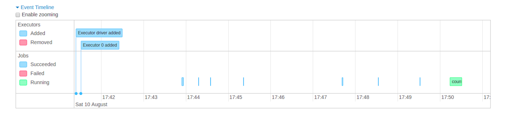
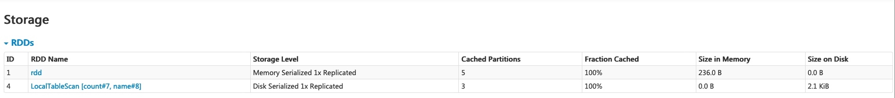
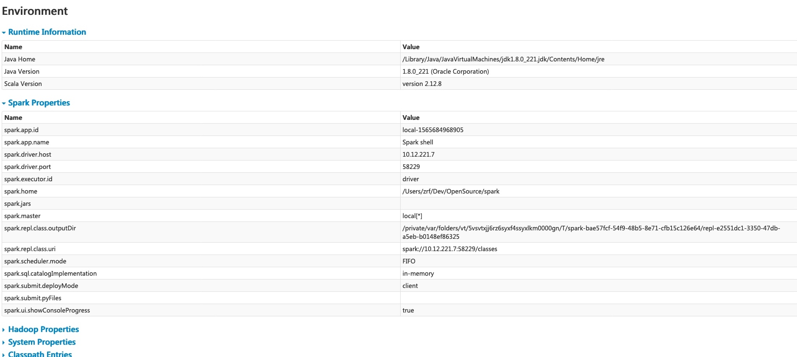
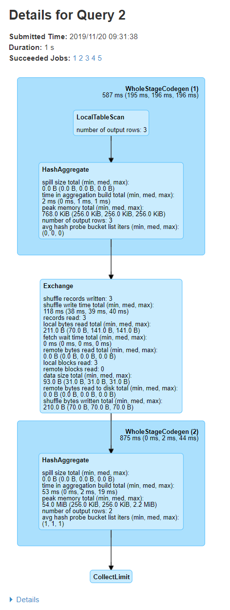

Apache Spark provides a suite of web user interfaces (UIs) that you can use
to monitor the status and resource consumption of your Spark cluster.

**Table of Contents**

* This will become a table of contents (this text will be scraped).
{:toc}

## Jobs Tab
The Jobs tab displays a summary page of all jobs in the Spark application and a details page
for each job. The summary page shows high-level information, such as the status, duration, and
progress of all jobs and the overall event timeline. When you click on a job on the summary
page, you see the details page for that job. The details page further shows the event timeline,
DAG visualization, and all stages of the job.

The information that is displayed in this section is
* User: Current Spark user
* Total uptime: Time since Spark application started
* Scheduling mode: See [job scheduling](job-scheduling.html#configuring-pool-properties)
* Number of jobs per status: Active, Completed, Failed

  

* Event timeline: Displays in chronological order the events related to the executors (added, removed) and the jobs

  

* Details of jobs grouped by status: Displays detailed information of the jobs including Job ID, description (with a link to detailed job page), submitted time, duration, stages summary and tasks progress bar

  

When you click on a specific job, you can see the detailed information of this job.

### Jobs detail

This page displays the details of a specific job identified by its job ID. 
* Job Status: (running, succeeded, failed)
* Number of stages per status (active, pending, completed, skipped, failed)
* Associated SQL Query: Link to the sql tab for this job
* Event timeline: Displays in chronological order the events related to the executors (added, removed) and the stages of the job

  

* DAG visualization: Visual representation of the directed acyclic graph of this job where vertices represent the RDDs or DataFrames and the edges represent an operation to be applied on RDD.

  

* List of stages (grouped by state active, pending, completed, skipped, and failed)
	* Stage ID
	* Description of the stage
	* Submitted timestamp
	* Duration of the stage
	* Tasks progress bar
	* Input: Bytes read from storage in this stage
	* Output: Bytes written in storage in this stage
	* Shuffle read: Total shuffle bytes and records read, includes both data read locally and data read from remote executors
	* Shuffle write: Bytes and records written to disk in order to be read by a shuffle in a future stage

  

## Stages Tab
The Stages tab displays a summary page that shows the current state of all stages of all jobs in
the Spark application, and, when you click on a stage, a details page for that stage. The details
page shows the event timeline, DAG visualization, and all tasks for the stage.

## Storage Tab
The Storage tab displays the persisted RDDs and DataFrames, if any, in the application. The summary
page shows the storage levels, sizes and partitions of all RDDs, and the details page shows the
sizes and using executors for all partitions in an RDD or DataFrame.


scala> import org.apache.spark.storage.StorageLevel._
import org.apache.spark.storage.StorageLevel._

scala> val rdd = sc.range(0, 100, 1, 5).setName("rdd")
rdd: org.apache.spark.rdd.RDD[Long] = rdd MapPartitionsRDD[1] at range at <console>:27

scala> rdd.persist(MEMORY_ONLY_SER)
res0: rdd.type = rdd MapPartitionsRDD[1] at range at <console>:27

scala> rdd.count
res1: Long = 100                                                                

scala> val df = Seq((1, "andy"), (2, "bob"), (2, "andy")).toDF("count", "name")
df: org.apache.spark.sql.DataFrame = [count: int, name: string]

scala> df.persist(DISK_ONLY)
res2: df.type = [count: int, name: string]

scala> df.count
res3: Long = 3


  
  <!-- Images are downsized intentionally to improve quality on retina displays -->

After running the above example, we can find two RDDs listed in the Storage tab. Basic information like
storage level, number of partitions and memory overhead are provided. Note that the newly persisted RDDs
or DataFrames are not shown in the tab before they are materialized. To monitor a specific RDD or DataFrame,
make sure an action operation has been triggered.

  
  <!-- Images are downsized intentionally to improve quality on retina displays -->

You can click the RDD name 'rdd' for obtaining the details of data persistence, such as the data
distribution on the cluster.

## Environment Tab
The Environment tab displays the values for the different environment and configuration variables,
including JVM, Spark, and system properties.

  
  <!-- Images are downsized intentionally to improve quality on retina displays -->

This environment page has five parts. It is a useful place to check whether your properties have
been set correctly.
The first part 'Runtime Information' simply contains the [runtime properties](configuration.html#runtime-environment)
like versions of Java and Scala.
The second part 'Spark Properties' lists the [application properties](configuration.html#application-properties) like
['spark.app.name'](configuration.html#application-properties) and 'spark.driver.memory'.

  
  <!-- Images are downsized intentionally to improve quality on retina displays -->

Clicking the 'Hadoop Properties' link displays properties relative to Hadoop and YARN. Note that properties like
['spark.hadoop.*'](configuration.html#execution-behavior) are shown not in this part but in 'Spark Properties'.

  
  <!-- Images are downsized intentionally to improve quality on retina displays -->

'System Properties' shows more details about the JVM.

  
  <!-- Images are downsized intentionally to improve quality on retina displays -->

The last part 'Classpath Entries' lists the classes loaded from different sources, which is very useful
to resolve class conflicts.

## Executors Tab
The Executors tab displays summary information about the executors that were created for the
application, including memory and disk usage and task and shuffle information. The Storage Memory
column shows the amount of memory used and reserved for caching data.

## SQL Tab
If the application executes Spark SQL queries, the SQL tab displays information, such as the duration,
jobs, and physical and logical plans for the queries. Here we include a basic example to illustrate
this tab:

scala> val df = Seq((1, "andy"), (2, "bob"), (2, "andy")).toDF("count", "name")
df: org.apache.spark.sql.DataFrame = [count: int, name: string]

scala> df.count
res0: Long = 3                                                                  

scala> df.createGlobalTempView("df")

scala> spark.sql("select name,sum(count) from global_temp.df group by name").show
+----+----------+
|name|sum(count)|
+----+----------+
|andy|         3|
| bob|         2|
+----+----------+


  
  <!-- Images are downsized intentionally to improve quality on retina displays -->

Now the above three dataframe/SQL operators are shown in the list. If we click the
'show at \<console\>: 24' link of the last query, we will see the DAG of the job.

  
  <!-- Images are downsized intentionally to improve quality on retina displays -->

We can see that details information of each stage. The first block 'WholeStageCodegen'  
compile multiple operator ('LocalTableScan' and 'HashAggregate') together into a single Java
function to improve performance, and metrics like number of rows and spill size are listed in
the block. The second block 'Exchange' shows the metrics on the shuffle exchange, including
number of written shuffle records, total data size, etc.

  
  <!-- Images are downsized intentionally to improve quality on retina displays -->

Clicking the 'Details' link on the bottom displays the logical plans and the physical plan, which
illustrate how Spark parses, analyzes, optimizes and performs the query.

## Streaming Tab
The web UI includes a Streaming tab if the application uses Spark streaming. This tab displays
scheduling delay and processing time for each micro-batch in the data stream, which can be useful
for troubleshooting the streaming application.

