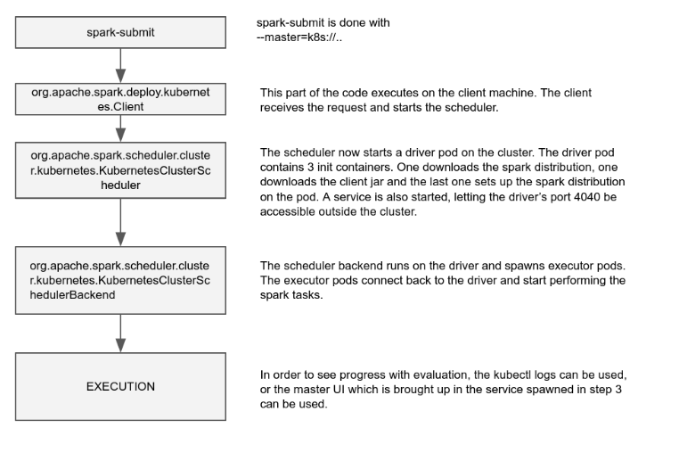

# Pre-requisites
* maven, JDK and all other pre-requisites for building Spark.

# Steps to compile

* Clone the fork of spark: https://github.com/foxish/spark/ and switch to the k8s-support branch.
* Build the project
    * ./build/mvn -Pkubernetes -Phadoop-2.4 -Dhadoop.version=2.4.0 -DskipTests package
* Ensure that you are pointing to a k8s cluster (kubectl config current-context), which you want to use with spark.
* Launch a spark-submit job:
   * `./bin/spark-submit --deploy-mode cluster --class org.apache.spark.examples.SparkPi --master k8s://default --conf spark.executor.instances=5 --conf spark.kubernetes.sparkImage=manyangled/kube-spark:snapshot  http://storage.googleapis.com/foxish-spark-distro/original-spark-examples_2.11-2.1.0-SNAPSHOT.jar 10000`
   * Optionally, the following config parameters can be supplied to spark-submit with additional `--conf` arguments (or a configuration file).
       * spark.kubernetes.serviceAccountName (defaults to "default")
       * spark.kubernetes.namespace (defaults to "default"). The namespace must exist prior to launching spark-submit.
   * The image is built from https://github.com/erikerlandson/openshift-spark.
   * `--master k8s://default` ensures that it picks up the correct APIServer the default from the current context. 
* Check for pods being created. Watch the master logs using kubectl log -f <driver-pod>.
* If on a cloud/infrastructure provider that allows external load balancers to be provisioned, an external IP will be allocated to the service associated with the driver. The spark-master UI can be accessed from that IP address on port 4040.

