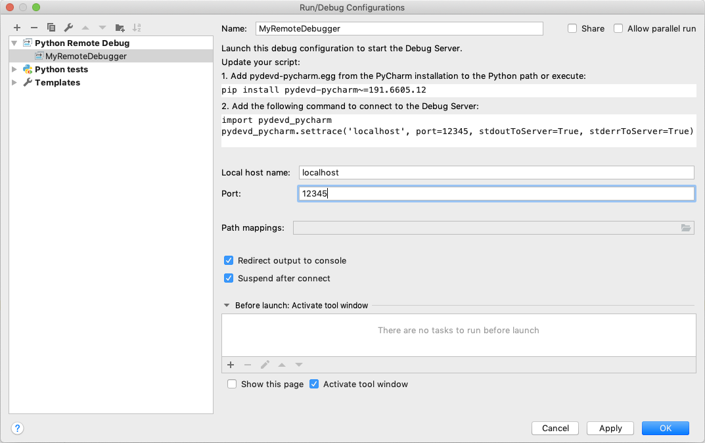
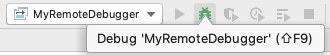
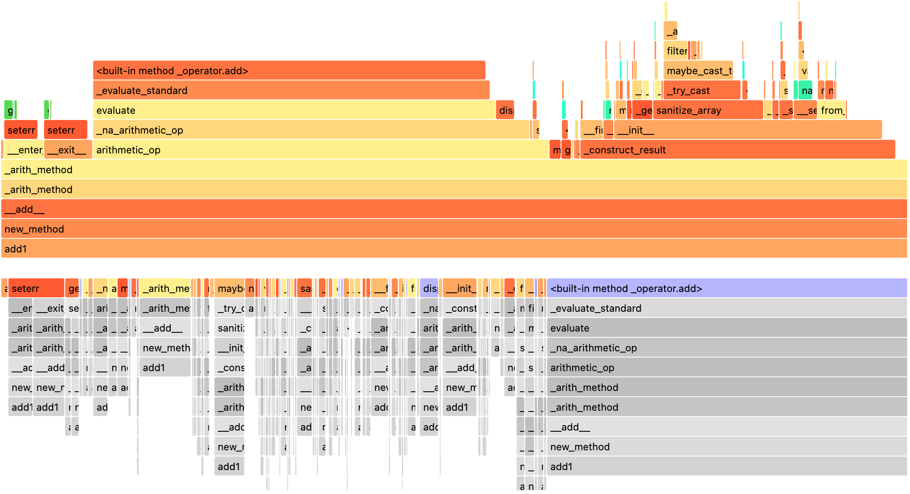

..  Licensed to the Apache Software Foundation (ASF) under one
    or more contributor license agreements.  See the NOTICE file
    distributed with this work for additional information
    regarding copyright ownership.  The ASF licenses this file
    to you under the Apache License, Version 2.0 (the
    "License"); you may not use this file except in compliance
    with the License.  You may obtain a copy of the License at

..    http://www.apache.org/licenses/LICENSE-2.0

..  Unless required by applicable law or agreed to in writing,
    software distributed under the License is distributed on an
    "AS IS" BASIS, WITHOUT WARRANTIES OR CONDITIONS OF ANY
    KIND, either express or implied.  See the License for the
    specific language governing permissions and limitations
    under the License.

=================
Debugging PySpark
=================

PySpark uses Spark as an engine. PySpark uses `Py4J <https://www.py4j.org/>`_ to leverage Spark to submit and computes the jobs.

On the driver side, PySpark communicates with the driver on JVM by using `Py4J <https://www.py4j.org/>`_.
When :class:`pyspark.sql.SparkSession` or :class:`pyspark.SparkContext` is created and initialized, PySpark launches a JVM
to communicate.

On the executor side, Python workers execute and handle Python native functions or data. They are not launched if
a PySpark application does not require interaction between Python workers and JVMs. They are lazily launched only when
Python native functions or data have to be handled, for example, when you execute pandas UDFs or
PySpark RDD APIs.

This page focuses on debugging Python side of PySpark on both driver and executor sides instead of focusing on debugging
with JVM. Profiling and debugging JVM is described at `Useful Developer Tools <https://spark.apache.org/developer-tools.html>`_.

Note that,

- If you are running locally, you can directly debug the driver side via using your IDE without the remote debug feature. Setting PySpark with IDEs is documented `here <setting_ide.rst#pycharm>`__.
- *There are many other ways of debugging PySpark applications*. For example, you can remotely debug by using the open source `Remote Debugger <https://www.pydev.org/manual_adv_remote_debugger.html>`_ instead of using PyCharm Professional documented here.

Remote Debugging (PyCharm Professional)
---------------------------------------

This section describes remote debugging on both driver and executor sides within a single machine to demonstrate easily.
The ways of debugging PySpark on the executor side is different from doing in the driver. Therefore, they will be demonstrated respectively.
In order to debug PySpark applications on other machines, please refer to the full instructions that are specific
to PyCharm, documented `here <https://www.jetbrains.com/help/pycharm/remote-debugging-with-product.html>`_.

Firstly, choose **Edit Configuration...** from the *Run* menu. It opens the **Run/Debug Configurations dialog**.
You have to click ``+`` configuration on the toolbar, and from the list of available configurations, select **Python Debug Server**.
Enter the name of this new configuration, for example, ``MyRemoteDebugger`` and also specify the port number, for example ``12345``.

| After that, you should install the corresponding version of the ``pydevd-pycharm`` package in all the machines which will connect to your PyCharm debugger. In the previous dialog, it shows the command to install.

.. code-block:: text

    pip install pydevd-pycharm~=<version of PyCharm on the local machine>

Driver Side
~~~~~~~~~~~

To debug on the driver side, your application should be able to connect to the debugging server. Copy and paste the codes
with ``pydevd_pycharm.settrace`` to the top of your PySpark script. Suppose the script name is ``app.py``:

.. code-block:: bash

    echo "#======================Copy and paste from the previous dialog===========================
    import pydevd_pycharm
    pydevd_pycharm.settrace('localhost', port=12345, stdoutToServer=True, stderrToServer=True)
    #========================================================================================
    # Your PySpark application codes:
    from pyspark.sql import SparkSession
    spark = SparkSession.builder.getOrCreate()
    spark.range(10).show()" > app.py

Start to debug with your ``MyRemoteDebugger``.

| After that, submit your application. This will connect to your PyCharm debugging server and enable you to debug on the driver side remotely.

.. code-block:: bash

    spark-submit app.py

Executor Side
~~~~~~~~~~~~~

To debug on the executor side, prepare a Python file as below in your current working directory.

.. code-block:: bash

    echo "from pyspark import daemon, worker
    def remote_debug_wrapped(*args, **kwargs):
        #======================Copy and paste from the previous dialog===========================
        import pydevd_pycharm
        pydevd_pycharm.settrace('localhost', port=12345, stdoutToServer=True, stderrToServer=True)
        #========================================================================================
        worker.main(*args, **kwargs)
    daemon.worker_main = remote_debug_wrapped
    if __name__ == '__main__':
        daemon.manager()" > remote_debug.py

You will use this file as the Python worker in your PySpark applications by using the ``spark.python.daemon.module`` configuration.
Run the ``pyspark`` shell with the configuration below:

.. code-block:: bash

    pyspark --conf spark.python.daemon.module=remote_debug

Now you're ready to remotely debug. Start to debug with your ``MyRemoteDebugger``.

| After that, run a job that creates Python workers, for example, as below:

.. code-block:: python

    spark.range(10).repartition(1).rdd.map(lambda x: x).collect()

Checking Resource Usage (``top`` and ``ps``)
--------------------------------------------

The Python processes on the driver and executor can be checked via typical ways such as ``top`` and ``ps`` commands.

Driver Side
~~~~~~~~~~~

On the driver side, you can get the process id from your PySpark shell easily as below to know the process id and resources.

.. code-block:: python

    >>> import os; os.getpid()
    18482

.. code-block:: bash

    ps -fe 18482

.. code-block:: text

    UID   PID  PPID   C STIME  TTY           TIME CMD
    000 18482 12345   0 0:00PM ttys001    0:00.00 /.../python

Executor Side
~~~~~~~~~~~~~

To check on the executor side, you can simply ``grep`` them to figure out the process
ids and relevant resources because Python workers are forked from ``pyspark.daemon``.

.. code-block:: bash

    ps -fe | grep pyspark.daemon

.. code-block:: text

    000 12345     1   0  0:00PM ttys000    0:00.00 /.../python -m pyspark.daemon
    000 12345     1   0  0:00PM ttys000    0:00.00 /.../python -m pyspark.daemon
    000 12345     1   0  0:00PM ttys000    0:00.00 /.../python -m pyspark.daemon
    000 12345     1   0  0:00PM ttys000    0:00.00 /.../python -m pyspark.daemon
    ...

Profiling Memory Usage (Memory Profiler)
----------------------------------------

`memory_profiler <https://github.com/pythonprofilers/memory_profiler>`_ is one of the profilers that allow you to
check the memory usage line by line.

Driver Side
~~~~~~~~~~~

Unless you are running your driver program in another machine (e.g., YARN cluster mode), this useful tool can be used
to debug the memory usage on driver side easily. Suppose your PySpark script name is ``profile_memory.py``.
You can profile it as below.

.. code-block:: bash

    echo "from pyspark.sql import SparkSession
    #===Your function should be decorated with @profile===
    from memory_profiler import profile
    @profile
    #=====================================================
    def my_func():
        session = SparkSession.builder.getOrCreate()
        df = session.range(10000)
        return df.collect()
    if __name__ == '__main__':
        my_func()" > profile_memory.py

.. code-block:: bash

    python -m memory_profiler profile_memory.py

.. code-block:: text

    Filename: profile_memory.py

    Line #    Mem usage    Increment   Line Contents
    ================================================
    ...
         6                             def my_func():
         7     51.5 MiB      0.6 MiB       session = SparkSession.builder.getOrCreate()
         8     51.5 MiB      0.0 MiB       df = session.range(10000)
         9     54.4 MiB      2.8 MiB       return df.collect()

Python/Pandas UDF
~~~~~~~~~~~~~~~~~

PySpark provides remote `memory_profiler <https://github.com/pythonprofilers/memory_profiler>`_ for
Python/Pandas UDFs. That can be used on editors with line numbers such as Jupyter notebooks. UDFs with iterators as inputs/outputs are not supported.

SparkSession-based memory profiler can be enabled by setting the `Runtime SQL configuration <https://spark.apache.org/docs/latest/configuration.html#runtime-sql-configuration>`_
``spark.sql.pyspark.udf.profiler`` to ``memory``. An example on a Jupyter notebook is as shown below.

.. code-block:: python

    from pyspark.sql.functions import pandas_udf
    df = spark.range(10)

    @pandas_udf("long")
    def add1(x):
      return x + 1

    spark.conf.set("spark.sql.pyspark.udf.profiler", "memory")

    added = df.select(add1("id"))
    added.show()
    spark.profile.show(type="memory")

The result profile is as shown below.

.. code-block:: text

    ============================================================
    Profile of UDF<id=2>
    ============================================================
    Filename: ...

    Line #    Mem usage    Increment  Occurrences   Line Contents
    =============================================================
         4    974.0 MiB    974.0 MiB          10   @pandas_udf("long")
         5                                         def add1(x):
         6    974.4 MiB      0.4 MiB          10     return x + 1

The UDF IDs can be seen in the query plan, for example, ``add1(...)#2L`` in ``ArrowEvalPython`` as shown below.

.. code-block:: python

    added.explain()

.. code-block:: text

    == Physical Plan ==
    *(2) Project [pythonUDF0#11L AS add1(id)#3L]
    +- ArrowEvalPython [add1(id#0L)#2L], [pythonUDF0#11L], 200
       +- *(1) Range (0, 10, step=1, splits=16)

We can render the result with an arbitrary renderer function as shown below.

.. code-block:: python

    def do_render(codemap):
        # Your custom rendering logic
        ...

    spark.profile.render(id=2, type="memory", renderer=do_render)

We can clear the result memory profile as shown below.

.. code-block:: python

    spark.profile.clear(id=2, type="memory")

Identifying Hot Loops (Python Profilers)
----------------------------------------

`Python Profilers <https://docs.python.org/3/library/profile.html>`_ are useful built-in features in Python itself. These
provide deterministic profiling of Python programs with a lot of useful statistics. This section describes how to use it on
both driver and executor sides in order to identify expensive or hot code paths.

Driver Side
~~~~~~~~~~~

To use this on driver side, you can use it as you would do for regular Python programs because PySpark on driver side is a
regular Python process unless you are running your driver program in another machine (e.g., YARN cluster mode).

.. code-block:: bash

    echo "from pyspark.sql import SparkSession
    spark = SparkSession.builder.getOrCreate()
    spark.range(10).show()" > app.py

.. code-block:: bash

    python -m cProfile app.py

.. code-block:: text

    ...
         129215 function calls (125446 primitive calls) in 5.926 seconds

       Ordered by: standard name

       ncalls  tottime  percall  cumtime  percall filename:lineno(function)
     1198/405    0.001    0.000    0.083    0.000 <frozen importlib._bootstrap>:1009(_handle_fromlist)
          561    0.001    0.000    0.001    0.000 <frozen importlib._bootstrap>:103(release)
          276    0.000    0.000    0.000    0.000 <frozen importlib._bootstrap>:143(__init__)
          276    0.000    0.000    0.002    0.000 <frozen importlib._bootstrap>:147(__enter__)
    ...

Python/Pandas UDF
~~~~~~~~~~~~~~~~~

PySpark provides remote `Python Profilers <https://docs.python.org/3/library/profile.html>`_ for
Python/Pandas UDFs. UDFs with iterators as inputs/outputs are not supported.

SparkSession-based performance profiler can be enabled by setting the `Runtime SQL configuration <https://spark.apache.org/docs/latest/configuration.html#runtime-sql-configuration>`_
``spark.sql.pyspark.udf.profiler`` to ``perf``. An example is as shown below.

.. code-block:: python

    >>> from pyspark.sql.functions import pandas_udf
    >>> df = spark.range(10)
    >>> @pandas_udf("long")
    ... def add1(x):
    ...     return x + 1
    ...
    >>> added = df.select(add1("id"))

    >>> spark.conf.set("spark.sql.pyspark.udf.profiler", "perf")
    >>> added.show()
    +--------+
    |add1(id)|
    +--------+
    ...
    +--------+

    >>> spark.profile.show(type="perf")
    ============================================================
    Profile of UDF<id=2>
    ============================================================
             2300 function calls (2270 primitive calls) in 0.006 seconds

       Ordered by: internal time, cumulative time

       ncalls  tottime  percall  cumtime  percall filename:lineno(function)
           10    0.001    0.000    0.005    0.001 series.py:5515(_arith_method)
           10    0.001    0.000    0.001    0.000 _ufunc_config.py:425(__init__)
           10    0.000    0.000    0.000    0.000 {built-in method _operator.add}
           10    0.000    0.000    0.002    0.000 series.py:315(__init__)
    ...

The UDF IDs can be seen in the query plan, for example, ``add1(...)#2L`` in ``ArrowEvalPython`` below.

.. code-block:: python

    >>> added.explain()
    == Physical Plan ==
    *(2) Project [pythonUDF0#11L AS add1(id)#3L]
    +- ArrowEvalPython [add1(id#0L)#2L], [pythonUDF0#11L], 200
       +- *(1) Range (0, 10, step=1, splits=16)

We can render the result with a preregistered renderer as shown below.

.. code-block:: python

    >>> spark.profile.render(id=2, type="perf")  # renderer="flameprof" by default

Or with an arbitrary renderer function as shown below.

.. code-block:: python

    >>> def do_render(stats):
    ...     # Your custom rendering logic
    ...     ...
    ...
    >>> spark.profile.render(id=2, type="perf", renderer=do_render)

We can clear the result performance profile as shown below.

.. code-block:: python

    >>> spark.profile.clear(id=2, type="perf")

Common Exceptions / Errors
--------------------------

PySpark SQL
~~~~~~~~~~~

**AnalysisException**

``AnalysisException`` is raised when failing to analyze a SQL query plan.

Example:

.. code-block:: python

    >>> df = spark.range(1)
    >>> df['bad_key']
    Traceback (most recent call last):
    ...
    pyspark.errors.exceptions.AnalysisException: Cannot resolve column name "bad_key" among (id)

Solution:

.. code-block:: python

    >>> df['id']
    Column<'id'>

**ParseException**

``ParseException`` is raised when failing to parse a SQL command.

Example:

.. code-block:: python

    >>> spark.sql("select * 1")
    Traceback (most recent call last):
    ...
    pyspark.errors.exceptions.ParseException:
    [PARSE_SYNTAX_ERROR] Syntax error at or near '1': extra input '1'.(line 1, pos 9)

    == SQL ==
    select * 1
    ---------^^^

Solution:

.. code-block:: python

    >>> spark.sql("select *")
    DataFrame[]

**IllegalArgumentException**

``IllegalArgumentException`` is raised when passing an illegal or inappropriate argument.

Example:

.. code-block:: python

    >>> spark.range(1).sample(-1.0)
    Traceback (most recent call last):
    ...
    pyspark.errors.exceptions.IllegalArgumentException: requirement failed: Sampling fraction (-1.0) must be on interval [0, 1] without replacement

Solution:

.. code-block:: python

    >>> spark.range(1).sample(1.0)
    DataFrame[id: bigint]

**PythonException**

``PythonException`` is thrown from Python workers.

You can see the type of exception that was thrown from the Python worker and its stack trace, as ``TypeError`` below.

Example:

.. code-block:: python

    >>> import pyspark.sql.functions as sf
    >>> from pyspark.sql.functions import udf
    >>> def f(x):
    ...   return sf.abs(x)
    ...
    >>> spark.range(-1, 1).withColumn("abs", udf(f)("id")).collect()
    22/04/12 14:52:31 ERROR Executor: Exception in task 7.0 in stage 37.0 (TID 232)
    org.apache.spark.api.python.PythonException: Traceback (most recent call last):
    ...
    TypeError: Invalid argument, not a string or column: -1 of type <class 'int'>. For column literals, use 'lit', 'array', 'struct' or 'create_map' function.

Solution:

.. code-block:: python

    >>> def f(x):
    ...   return abs(x)
    ...
    >>> spark.range(-1, 1).withColumn("abs", udf(f)("id")).collect()
    [Row(id=-1, abs='1'), Row(id=0, abs='0')]

**StreamingQueryException**

``StreamingQueryException`` is raised when failing a StreamingQuery. Most often, it is thrown from Python workers, that wrap it as a ``PythonException``.

Example:

.. code-block:: python

    >>> sdf = spark.readStream.format("text").load("python/test_support/sql/streaming")
    >>> from pyspark.sql.functions import col, udf
    >>> bad_udf = udf(lambda x: 1 / 0)
    >>> (sdf.select(bad_udf(col("value"))).writeStream.format("memory").queryName("q1").start()).processAllAvailable()
    Traceback (most recent call last):
    ...
    org.apache.spark.api.python.PythonException: Traceback (most recent call last):
      File "<stdin>", line 1, in <lambda>
    ZeroDivisionError: division by zero
    ...
    pyspark.errors.exceptions.StreamingQueryException: [STREAM_FAILED] Query [id = 74eb53a8-89bd-49b0-9313-14d29eed03aa, runId = 9f2d5cf6-a373-478d-b718-2c2b6d8a0f24] terminated with exception: Job aborted

Solution:

Fix the StreamingQuery and re-execute the workflow.

**SparkUpgradeException**

``SparkUpgradeException`` is thrown because of Spark upgrade.

Example:

.. code-block:: python

    >>> from pyspark.sql.functions import to_date, unix_timestamp, from_unixtime
    >>> df = spark.createDataFrame([("2014-31-12",)], ["date_str"])
    >>> df2 = df.select("date_str", to_date(from_unixtime(unix_timestamp("date_str", "yyyy-dd-aa"))))
    >>> df2.collect()
    Traceback (most recent call last):
    ...
    pyspark.sql.utils.SparkUpgradeException: You may get a different result due to the upgrading to Spark >= 3.0: Fail to recognize 'yyyy-dd-aa' pattern in the DateTimeFormatter. 1) You can set spark.sql.legacy.timeParserPolicy to LEGACY to restore the behavior before Spark 3.0. 2) You can form a valid datetime pattern with the guide from https://spark.apache.org/docs/latest/sql-ref-datetime-pattern.html

Solution:

.. code-block:: python

    >>> spark.conf.set("spark.sql.legacy.timeParserPolicy", "LEGACY")
    >>> df2 = df.select("date_str", to_date(from_unixtime(unix_timestamp("date_str", "yyyy-dd-aa"))))
    >>> df2.collect()
    [Row(date_str='2014-31-12', to_date(from_unixtime(unix_timestamp(date_str, yyyy-dd-aa), yyyy-MM-dd HH:mm:ss))=None)]

pandas API on Spark
~~~~~~~~~~~~~~~~~~~

There are specific common exceptions / errors in pandas API on Spark.

**ValueError: Cannot combine the series or dataframe because it comes from a different dataframe**

Operations involving more than one series or dataframes raises a ``ValueError`` if ``compute.ops_on_diff_frames`` is disabled (disabled by default). Such operations may be expensive due to joining of underlying Spark frames. So users should be aware of the cost and enable that flag only when necessary.

Exception:

.. code-block:: python

    >>> ps.Series([1, 2]) + ps.Series([3, 4])
    Traceback (most recent call last):
    ...
    ValueError: Cannot combine the series or dataframe because it comes from a different dataframe. In order to allow this operation, enable 'compute.ops_on_diff_frames' option.

Solution:

.. code-block:: python

    >>> with ps.option_context('compute.ops_on_diff_frames', True):
    ...     ps.Series([1, 2]) + ps.Series([3, 4])
    ...
    0    4
    1    6
    dtype: int64

**RuntimeError: Result vector from pandas_udf was not the required length**

Exception:

.. code-block:: python

    >>> def f(x) -> ps.Series[np.int32]:
    ...   return x[:-1]
    ...
    >>> ps.DataFrame({"x":[1, 2], "y":[3, 4]}).transform(f)
    22/04/12 13:46:39 ERROR Executor: Exception in task 2.0 in stage 16.0 (TID 88)
    org.apache.spark.api.python.PythonException: Traceback (most recent call last):
    ...
    RuntimeError: Result vector from pandas_udf was not the required length: expected 1, got 0

Solution:

.. code-block:: python

    >>> def f(x) -> ps.Series[np.int32]:
    ...   return x
    ...
    >>> ps.DataFrame({"x":[1, 2], "y":[3, 4]}).transform(f)
       x  y
    0  1  3
    1  2  4

Py4j
~~~~

**Py4JJavaError**

``Py4JJavaError`` is raised when an exception occurs in the Java client code.
You can see the type of exception that was thrown on the Java side and its stack trace, as ``java.lang.NullPointerException`` below.

Example:

.. code-block:: python

    >>> spark.sparkContext._jvm.java.lang.String(None)
    Traceback (most recent call last):
    ...
    py4j.protocol.Py4JJavaError: An error occurred while calling None.java.lang.String.
    : java.lang.NullPointerException
    ..

Solution:

.. code-block:: python

    >>> spark.sparkContext._jvm.java.lang.String("x")
    'x'

**Py4JError**

``Py4JError`` is raised when any other error occurs such as when the Python client program tries to access an object that no longer exists on the Java side.

Example:

.. code-block:: python

    >>> from pyspark.ml.linalg import Vectors
    >>> from pyspark.ml.regression import LinearRegression
    >>> df = spark.createDataFrame(
    ...             [(1.0, 2.0, Vectors.dense(1.0)), (0.0, 2.0, Vectors.sparse(1, [], []))],
    ...             ["label", "weight", "features"],
    ...         )
    >>> lr = LinearRegression(
    ...             maxIter=1, regParam=0.0, solver="normal", weightCol="weight", fitIntercept=False
    ...         )
    >>> model = lr.fit(df)
    >>> model
    LinearRegressionModel: uid=LinearRegression_eb7bc1d4bf25, numFeatures=1
    >>> model.__del__()
    >>> model
    Traceback (most recent call last):
    ...
    py4j.protocol.Py4JError: An error occurred while calling o531.toString. Trace:
    py4j.Py4JException: Target Object ID does not exist for this gateway :o531
    ...

Solution:

Access an object that exists on the Java side.

**Py4JNetworkError**

``Py4JNetworkError`` is raised when a problem occurs during network transfer (e.g., connection lost). In this case, we shall debug the network and rebuild the connection.

Stack Traces
------------

There are Spark configurations to control stack traces:

- ``spark.sql.execution.pyspark.udf.simplifiedTraceback.enabled`` is true by default to simplify traceback from Python UDFs.

- ``spark.sql.pyspark.jvmStacktrace.enabled`` is false by default to hide JVM stacktrace and to show a Python-friendly exception only.

Spark configurations above are independent from log level settings. Control log levels through :meth:`pyspark.SparkContext.setLogLevel`.
