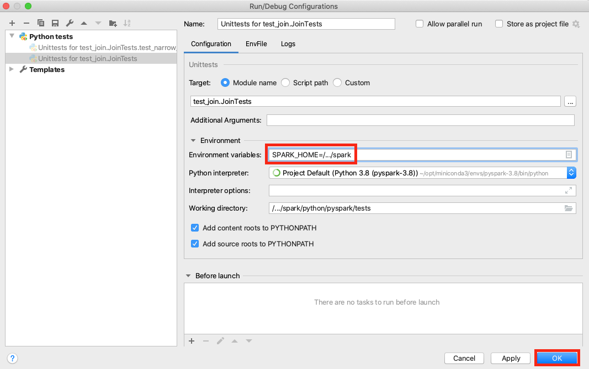

..  Licensed to the Apache Software Foundation (ASF) under one
    or more contributor license agreements.  See the NOTICE file
    distributed with this work for additional information
    regarding copyright ownership.  The ASF licenses this file
    to you under the Apache License, Version 2.0 (the
    "License"); you may not use this file except in compliance
    with the License.  You may obtain a copy of the License at

..    http://www.apache.org/licenses/LICENSE-2.0

..  Unless required by applicable law or agreed to in writing,
    software distributed under the License is distributed on an
    "AS IS" BASIS, WITHOUT WARRANTIES OR CONDITIONS OF ANY
    KIND, either express or implied.  See the License for the
    specific language governing permissions and limitations
    under the License.

===============
Setting up IDEs
===============

PyCharm
-------

This section describes how to setup PySpark on PyCharm.
It guides step by step to the process of downloading the source code from GitHub and running the test code successfully.

Firstly, download the Spark source code from GitHub using git url. You can download the source code by simply using ``git clone`` command as shown below.
If you want to download the code from any forked repository rather than Spark original repository, please change the url properly.

.. code-block:: bash

    git clone https://github.com/apache/spark.git

When the download is completed, go to the ``spark`` directory and build the package.
SBT build is generally much faster than Maven. More details about the build are documented `here <https://spark.apache.org/docs/latest/building-spark.html>`_.

.. code-block:: bash

    build/sbt package

After building is finished, run PyCharm and select the path ``spark/python``.

Let's go to the path ``python/pyspark/tests`` in PyCharm and try to run the any test like ``test_join.py``.
You might can see the ``KeyError: 'SPARK_HOME'`` because the environment variable has not been set yet.

Go **Run -> Edit Configurations**, and set the environment variables as below.
Please make sure to specify your own path for ``SPARK_HOME`` rather than ``/.../spark``. After completing the variable, click **OK** to apply the changes.

Once ``SPARK_HOME`` is set properly, you'll be able to run the tests properly as below:

