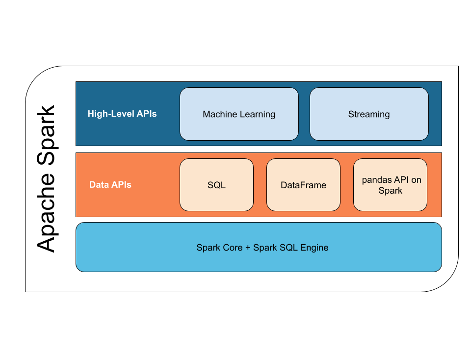

..  Licensed to the Apache Software Foundation (ASF) under one
    or more contributor license agreements.  See the NOTICE file
    distributed with this work for additional information
    regarding copyright ownership.  The ASF licenses this file
    to you under the Apache License, Version 2.0 (the
    "License"); you may not use this file except in compliance
    with the License.  You may obtain a copy of the License at

..    http://www.apache.org/licenses/LICENSE-2.0

..  Unless required by applicable law or agreed to in writing,
    software distributed under the License is distributed on an
    "AS IS" BASIS, WITHOUT WARRANTIES OR CONDITIONS OF ANY
    KIND, either express or implied.  See the License for the
    specific language governing permissions and limitations
    under the License.

.. PySpark documentation master file

=====================
PySpark Documentation2
=====================

|binder|_ | `GitHub <https://github.com/apache/spark>`_ | `Issues <https://issues.apache.org/jira/projects/SPARK/issues>`_ | |examples|_ | `Community <https://spark.apache.org/community.html>`_

PySpark is an interface for Apache Spark in Python. It not only allows you to write
Spark applications using Python APIs, but also provides the PySpark shell for
interactively analyzing your data in a distributed environment. PySpark supports most
of Spark's features such as Spark SQL, DataFrame, Streaming, MLlib
(Machine Learning) and Spark Core.

.. .. image:: ../../../docs/img/pyspark-components.png

*******************
Data APIs 
*******************

`Spark SQL and DataFrame <https://spark.apache.org/docs/latest/sql-programming-guide.html>`_

Spark SQL is a Spark module, similar to SQL, that can be used for structured data processing. It provides
a programming abstraction called DataFrame and can also act as distributed
SQL query engine.

`pandas API on Spark <https://koalas.readthedocs.io/en/latest/>`_

The pandas API on Spark allows you to scale your pandas workload out.
With this package, you can:

* Be immediately productive with Spark, with no learning curve, if you are already familiar with pandas.
* Have a single codebase that works both with pandas (tests, smaller datasets) and with Spark (distributed datasets).
* Switch to pandas API and PySpark API contexts easily without any overhead.

*****************
High-level APIs
*****************

`Streaming <https://spark.apache.org/docs/latest/structured-streaming-programming-guide.html>`_

Running on top of Spark, the streaming feature in Apache Spark enables powerful
interactive and analytical applications across both streaming and historical data,
while inheriting Spark's ease of use and fault tolerance characteristics.

`Machine Learning (MLlib) <https://spark.apache.org/docs/latest/ml-guide.html>`_

Built on top of Spark, MLlib is a scalable machine learning library that provides
a uniform set of high-level APIs that help users create and tune practical machine
learning pipelines.

*****************
Spark Core + Spark SQL Engine
*****************

Spark Core is the underlying general execution engine for the Spark platform that all
other functionality is built on top of. It provides an RDD (Resilient Distributed Dataset)
and in-memory computing capabilities.

.. toctree::
    :maxdepth: 2
    :hidden:

    getting_started/index
    user_guide/index
    reference/index
    development/index
    migration_guide/index
