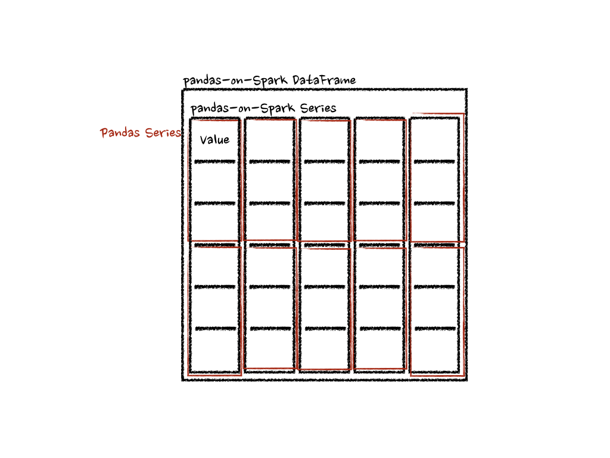
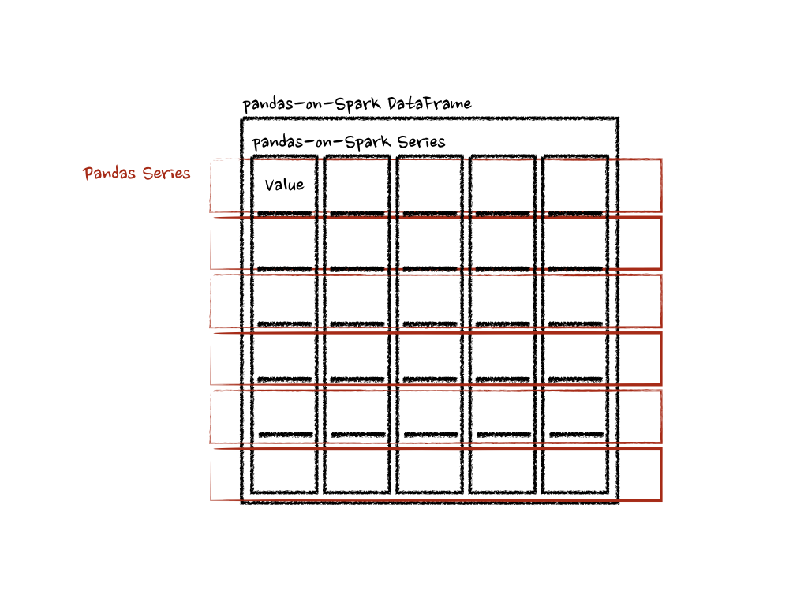
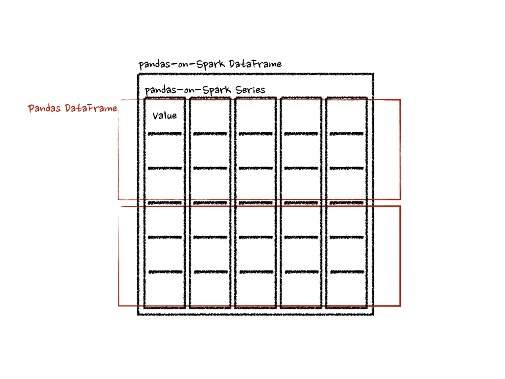
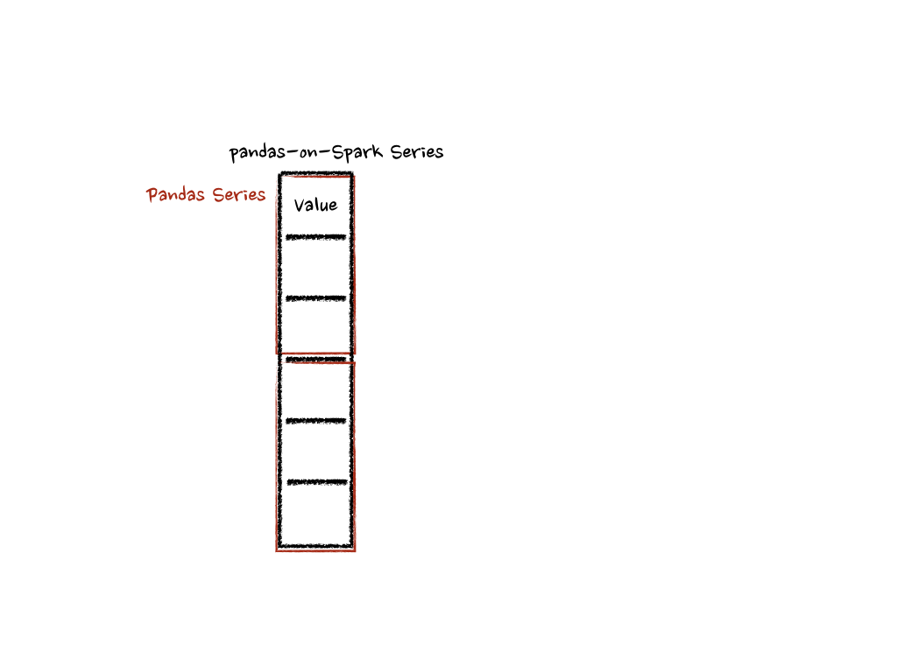

..  Licensed to the Apache Software Foundation (ASF) under one
    or more contributor license agreements.  See the NOTICE file
    distributed with this work for additional information
    regarding copyright ownership.  The ASF licenses this file
    to you under the Apache License, Version 2.0 (the
    "License"); you may not use this file except in compliance
    with the License.  You may obtain a copy of the License at

..    http://www.apache.org/licenses/LICENSE-2.0

..  Unless required by applicable law or agreed to in writing,
    software distributed under the License is distributed on an
    "AS IS" BASIS, WITHOUT WARRANTIES OR CONDITIONS OF ANY
    KIND, either express or implied.  See the License for the
    specific language governing permissions and limitations
    under the License.

==============================
Transform and apply a function
==============================

.. NOTE: the images are stored at https://github.com/koalas/issues/1443. Feel free to edit and/or add.

.. currentmodule:: pyspark.pandas

There are many APIs that allow users to apply a function against pandas-on-Spark DataFrame such as
:func:`DataFrame.transform`, :func:`DataFrame.apply`, :func:`DataFrame.pandas_on_spark.transform_batch`,
:func:`DataFrame.pandas_on_spark.apply_batch`, :func:`Series.pandas_on_spark.transform_batch`, etc. Each has a distinct
purpose and works differently internally. This section describes the differences among
them where users are confused often.

``transform`` and ``apply``
---------------------------

The main difference between :func:`DataFrame.transform` and :func:`DataFrame.apply` is that the former requires
to return the same length of the input and the latter does not require this. See the example below:

.. code-block:: python

   >>> psdf = ps.DataFrame({'a': [1,2,3], 'b':[4,5,6]})
   >>> def pandas_plus(pser):
   ...     return pser + 1  # should always return the same length as input.
   ...
   >>> psdf.transform(pandas_plus)

.. code-block:: python

   >>> psdf = ps.DataFrame({'a': [1,2,3], 'b':[5,6,7]})
   >>> def pandas_plus(pser):
   ...     return pser[pser % 2 == 1]  # allows an arbitrary length
   ...
   >>> psdf.apply(pandas_plus)

In this case, each function takes a pandas Series, and the pandas API on Spark computes the functions in a distributed manner as below.

In the case of 'column' axis, the function takes each row as a pandas Series.

.. code-block:: python

   >>> psdf = ps.DataFrame({'a': [1,2,3], 'b':[4,5,6]})
   >>> def pandas_plus(pser):
   ...     return sum(pser)  # allows an arbitrary length
   ...
   >>> psdf.apply(pandas_plus, axis='columns')

The example above calculates the summation of each row as a pandas Series. See below:

In the examples above, the type hints were not used for simplicity but it is encouraged to use them to avoid performance penalty.
Please refer to the API documentations.

``pandas_on_spark.transform_batch`` and ``pandas_on_spark.apply_batch``
-----------------------------------------------------------------------

In :func:`DataFrame.pandas_on_spark.transform_batch`, :func:`DataFrame.pandas_on_spark.apply_batch`, :func:`Series.pandas_on_spark.transform_batch`, etc., the ``batch``
postfix means each chunk in pandas-on-Spark DataFrame or Series. The APIs slice the pandas-on-Spark DataFrame or Series, and
then apply the given function with pandas DataFrame or Series as input and output. See the examples below:

.. code-block:: python

   >>> psdf = ps.DataFrame({'a': [1,2,3], 'b':[4,5,6]})
   >>> def pandas_plus(pdf):
   ...     return pdf + 1  # should always return the same length as input.
   ...
   >>> psdf.pandas_on_spark.transform_batch(pandas_plus)

.. code-block:: python

   >>> psdf = ps.DataFrame({'a': [1,2,3], 'b':[4,5,6]})
   >>> def pandas_plus(pdf):
   ...     return pdf[pdf.a > 1]  # allow arbitrary length
   ...
   >>> psdf.pandas_on_spark.apply_batch(pandas_plus)

The functions in both examples take a pandas DataFrame as a chunk of pandas-on-Spark DataFrame, and output a pandas DataFrame.
Pandas API on Spark combines the pandas DataFrames as a pandas-on-Spark DataFrame.

Note that :func:`DataFrame.pandas_on_spark.transform_batch` has the length restriction - the length of input and output should be
the same - whereas :func:`DataFrame.pandas_on_spark.apply_batch` does not.  However, it is important to know that
the output belongs to the same DataFrame when :func:`DataFrame.pandas_on_spark.transform_batch` returns a Series, and
you can avoid a shuffle by the operations between different DataFrames. In case of :func:`DataFrame.pandas_on_spark.apply_batch`, its output is always
treated as though it belongs to a new different DataFrame. See also
`Operations on different DataFrames <options.rst#operations-on-different-dataframes>`_ for more details.

In case of :func:`Series.pandas_on_spark.transform_batch`, it is also similar with :func:`DataFrame.pandas_on_spark.transform_batch`; however, it takes
a pandas Series as a chunk of pandas-on-Spark Series.

.. code-block:: python

   >>> psdf = ps.DataFrame({'a': [1,2,3], 'b':[4,5,6]})
   >>> def pandas_plus(pser):
   ...     return pser + 1  # should always return the same length as input.
   ...
   >>> psdf.a.pandas_on_spark.transform_batch(pandas_plus)

Under the hood, each batch of pandas-on-Spark Series is split to multiple pandas Series, and each function computes on that as below:

There are more details such as the type inference and preventing its performance penalty. Please refer to the API documentations.
